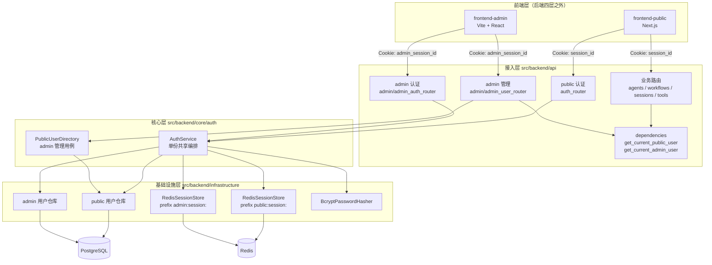
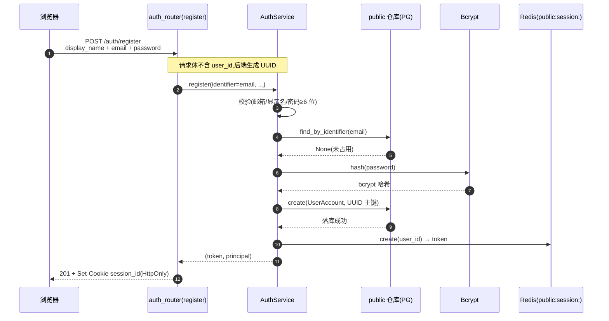
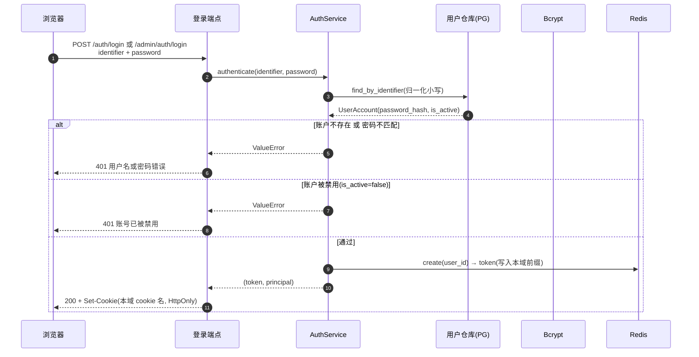
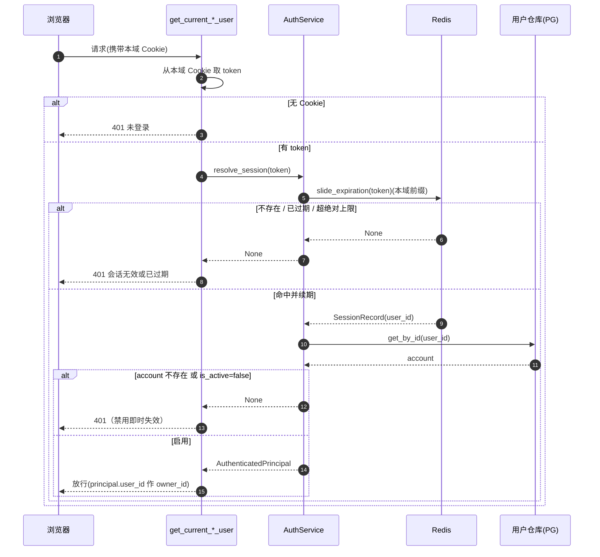
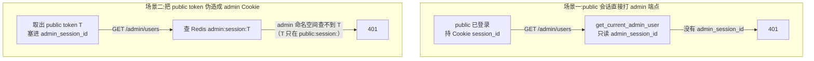
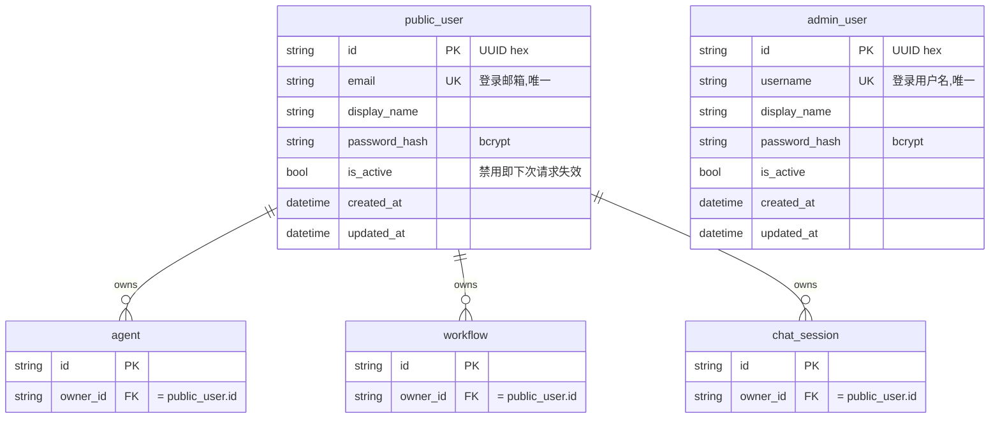

# 认证与会话逻辑

本页完整说明本仓库的认证实现:**两套物理隔离的认证域 + 服务端 Session(Redis) + HttpOnly Cookie**。它是 [系统架构](system-design.md) 中"认证与会话域"一节的展开版。

!!! info "一句话概览"
    不是 JWT、也不是 access/refresh 双 token。后端为每次登录签发一个**不透明随机 token**(uuid),存进 **Redis**,通过 **HttpOnly Cookie** 下发;每个请求回查 Redis 才有效。public 与 admin 是**两个独立认证域**,各有独立的用户表、Cookie 与 Redis 命名空间。

---

## 1. 整体架构



要点:

- **一份 `AuthService` 服务两域**:登录 / 登出 / 会话解析 / 注册的编排只有一份,通过注入不同的「用户仓库 + 会话存储(不同前缀)+ 是否允许注册」区分 public 与 admin,避免复制两套近似代码。
- **两域在数据层物理隔离**:不同用户表、不同 Cookie、不同 Redis 命名空间。
- 业务资源(agent / workflow / session)归属 **public 用户**(`owner_id = public_user.id`);admin 域只做管理,不拥有业务资源。

---

## 2. 两个认证域对照

| 维度 | public 域(C 端用户) | admin 域(内部管理员) |
|---|---|---|
| 用户表 | `public_user`(开放自助注册) | `admin_user`(仅种子创建,不开放注册) |
| 主键 | UUID(`str`),用作业务 `owner_id` | UUID(`str`) |
| 登录标识 | 邮箱 `email` | 用户名 `username` |
| 端点 | `/auth/login` `/auth/register` `/auth/logout` `/auth/me` | `/admin/auth/login` `/admin/auth/logout` `/admin/auth/me`(无 register) |
| 会话 Cookie | `session_id` | `admin_session_id` |
| Redis 命名空间 | `public:session:<token>` | `admin:session:<token>` |
| 鉴权依赖 | `get_current_public_user` | `get_current_admin_user` |
| 业务能力 | 业务 API(`agents` 等) | `/admin/users` 管理 public 用户 |
| 前端 | `frontend-public` | `frontend-admin` |

---

## 3. 会话机制

### 3.1 token 与存储

会话 token 是 `uuid.uuid4().hex` 生成的**不透明随机串**(不是自包含的 JWT)。它本身不含信息,必须回查 Redis 才能解析出用户。

每条会话在 Redis 中的形态:

```text
key   = "{prefix}{token}"          # 例 public:session:9df9880fde8a...
value = {"user_id", "created_at", "expires_at"}   # JSON
TTL   = 滑动窗口秒数
```

!!! note "为什么是 Session 而不是 JWT"
    - **即时吊销**:禁用用户、登出时删一条 Redis 记录即可让会话立刻失效;JWT 无状态,需额外维护黑名单。
    - **安全**:token 放 HttpOnly Cookie,前端 JS 读不到(防 XSS),浏览器自动携带,前端零 token 管理。
    - **沿用现状**:项目原本就是 session 设计(内存版),本次只是落地到 Redis 并拆成双域。

### 3.2 滑动窗口续期

没有 refresh token——"保持登录"靠**滑动窗口**实现:

- **滑动窗口 15 天**:每次活跃请求(经 `/me` 或业务调用解析会话时)续期 15 天。
- **绝对上限 60 天**:自创建起最多存活 60 天,到顶即失效,需重新登录。
- 每次续期 `new_expires = min(now + 15天, created_at + 60天)`,并据此重设 Redis TTL。

### 3.3 命名空间前缀隔离

`RedisSessionStore` 只有一份实现,实例化两次、注入不同前缀:

```text
public:session:<token>     ← public 域
admin:session:<token>      ← admin 域
```

同一个 Redis 实例,但两域的 key 空间互不重叠——这是越权隔离的物理基础(见 §5)。

---

## 4. 核心流程(时序图)

### 4.1 注册(仅 public)



### 4.2 登录



### 4.3 会话解析(每个受保护请求)+ 禁用即时失效



!!! tip "禁用即时失效"
    每次解析会话都会回查用户表的 `is_active`。admin 一旦在 `/admin/users` 把某 public 用户禁用,该用户**下一次请求**就会被判 `401`,无需等会话过期。

### 4.4 登出

登出调用本域 `AuthService.logout(token)` → 删除该 Redis 会话记录,并清除 Cookie。只影响当前域。

---

## 5. 越权隔离(为什么 public 进不了 admin)



两层保障:

1. **Cookie 维度**:admin 守卫只认 `admin_session_id`,public 会话的 `session_id` 根本不被读取。
2. **命名空间维度**:即使把 public 的 token 值塞进 `admin_session_id`,admin 域查的是 `admin:session:<token>` 命名空间,而该 token 只存在于 `public:session:`——查不到,依然 `401`。

反方向同理:admin 会话访问业务 API(走 `get_current_public_user`)也是 `401`。

!!! warning "前端隔离不是安全边界"
    "哪个前端登录的"不能作为权限依据——同域部署时不同端口共享 Cookie domain。真正的边界在后端:两套独立 Cookie + 两套 Redis 命名空间 + 两套用户表。

---

## 6. 数据模型



- 会话**不落 PG**——它在 Redis。PG 只存用户与业务实体。
- `owner_id` 维持 `String` 类型、应用层关联(不加数据库外键),与既有 per-owner 模式一致;`admin_user` 与业务资源无所有权关系。

---

## 7. Admin 管理 public 用户

`frontend-admin` 的 `users` 页经 `/admin/users` 管理 C 端用户:

| 操作 | 端点 | 说明 |
|---|---|---|
| 列表 | `GET /admin/users?page=&page_size=&status=&keyword=` | 分页 + 按状态(active/disabled)/关键字过滤 |
| 详情 | `GET /admin/users/{id}` | 单个用户 |
| 启用 | `POST /admin/users/{id}/enable` | 恢复登录 |
| 禁用 | `POST /admin/users/{id}/disable` | 即时失效其会话 |

这些端点全部经 `get_current_admin_user` 守卫,由 `PublicUserDirectory`(core 用例)操作 public 用户仓库。

---

## 8. 配置与运维

```bash
# .env / .env.local
REDIS_URL=redis://:password@localhost:6379/0    # 会话存储,必需

# 初始管理员种子(后端启动时按用户名幂等创建;明文仅用于首次创建,库中只存哈希)
AUTH_ADMIN_BOOTSTRAP_USERNAME=admin
AUTH_ADMIN_BOOTSTRAP_PASSWORD=change-me-please
```

- **种子 admin**：`src/backend/composition/bootstrap.py` 启动时，若配置了
  `AUTH_ADMIN_BOOTSTRAP_*` 且该用户名不存在，则创建一个管理员；两项任一为空则
  跳过（不影响 public 流程）。
- **Cookie 安全**:本地开发 `secure=False`(http);生产经反代终止 TLS 后应置 `True`。Cookie 名是接入层常量(`session_id` / `admin_session_id`),会话窗口天数与 admin 种子来自 `AuthSettings`。
- **会话窗口**:`AUTH_SESSION_SLIDING_DAYS`(默认 15)、`AUTH_SESSION_ABSOLUTE_DAYS`(默认 60)。

!!! danger "本地直接运行需注意"
    `RedisSettings` / `AuthSettings` 会从 `.env` / `.env.local` 读取。务必在其中配置可达的 `REDIS_URL`(本地可用 `docker-compose.testing.yml` 的 redis,带密码 `redis123`),否则登录 / 注册会因连不上 Redis 而 500。

---

## 9. 关键代码位置

| 关注点 | 位置 |
|---|---|
| 认证编排(共享) | `src/backend/core/auth/service.py`(`AuthService`) |
| admin 管理用例 | `src/backend/core/auth/directory.py`(`PublicUserDirectory`) |
| 领域模型 | `src/backend/core/auth/models.py`、`src/backend/core/shared/models/user_account.py` |
| 抽象端口 | `src/backend/core/shared/interfaces/{user_account_repository,password_hasher,session_store}.py` |
| Redis 会话 | `src/backend/infrastructure/auth/redis_session_store.py` |
| 密码哈希 | `src/backend/infrastructure/auth/bcrypt_password_hasher.py` |
| 用户仓库(统一) | `src/backend/infrastructure/persistence/repos/user_account_repo.py` |
| ORM 模型 | `src/backend/infrastructure/persistence/models/{public_user,admin_user}.py` |
| 鉴权依赖 | `src/backend/api/dependencies.py` |
| public 路由 | `src/backend/api/auth_router.py` |
| admin 路由 | `src/backend/api/admin/` |
| 装配 + 种子 | `src/backend/composition/{auth_wiring,bootstrap,app_factory}.py` |
| 迁移 | `alembic/versions/20260625-182322-auth_domains_init.py` |

---

## 10. 验证覆盖

| 层级 | 覆盖 |
|---|---|
| 单元 / 集成 | `tests/backend/`:双向越权 401、注册去 `user_id`、禁用即时失效、bcrypt、Redis 前缀隔离(fakeredis)、admin 管理 API |
| 迁移 | `alembic upgrade head` / `downgrade base` 往返 |
| public 端到端 | `tests/playwright-e2e/`:真实浏览器→public 前端→`/api` 代理→后端→真实 Redis 登录 |
| admin 端到端 | `tests/playwright-e2e/tests/admin/`:admin 登录→`users` 页→搜索→禁用一次性用户 |

详见 [测试规范](../ai-standards/testing.md)。
