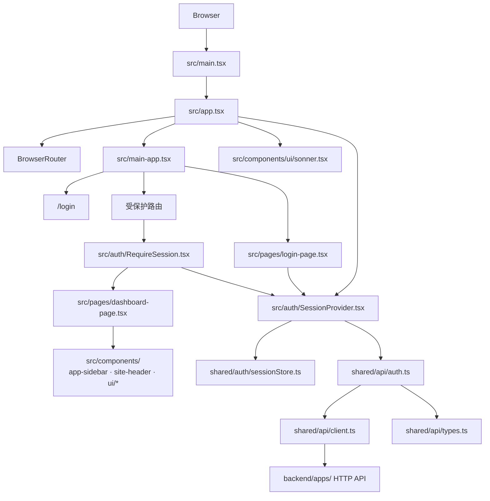
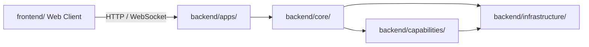

# 前端架构

本文档描述 `frontend/` 目录内部的前端结构。它是浏览器端客户端架构，不属于后端四层 Clean Architecture 的内部依赖图。

## 定位

- `frontend/` 是系统边界外的 Web 客户端。
- 它通过 HTTP 接口调用 `backend/apps/` 暴露的后端能力。
- 它负责页面渲染、路由跳转、会话恢复和交互反馈，不承载后端用例编排。

## 前端内部架构图

## 模块职责

### 应用入口层

路径：

- `src/main.tsx`
- `src/app.tsx`
- `src/main-app.tsx`

职责：

- 挂载 React 应用
- 组装 Router、Provider 与全局提示组件
- 定义页面路由、懒加载和主布局壳

### 认证与会话层

路径：

- `src/auth/SessionProvider.tsx`
- `src/auth/RequireSession.tsx`
- `shared/auth/sessionStore.ts`

职责：

- 恢复当前会话
- 暴露登录、登出与鉴权状态
- 在受保护路由前执行访问控制

### 页面层

路径：

- `src/pages/`
- `src/hooks/`

职责：

- 组织页面级交互
- 处理页面状态、加载态和错误态
- 连接认证层与共享组件层

### 共享组件层

路径：

- `src/components/`
- `src/components/ui/`

职责：

- 提供布局壳、导航组件和基础 UI 原语
- 复用视觉和交互模式
- 避免直接承担接口调用与会话编排

### API 适配层

路径：

- `shared/api/client.ts`
- `shared/api/auth.ts`
- `shared/api/types.ts`

职责：

- 封装 HTTP 请求和响应解析
- 统一错误处理
- 为页面和认证逻辑提供稳定的接口调用入口

## 与后端四层的边界

这表示：

- 前端只依赖后端暴露的接口契约，不依赖后端 Python 模块。
- 后端内部如何在 `backend/apps/`、`backend/core/`、`backend/capabilities/`、`backend/infrastructure/` 之间拆分，对前端来说应是透明的。
- 如果后续前端规模扩大，可以继续在本文档下增加路由图、状态图和组件边界约束。
