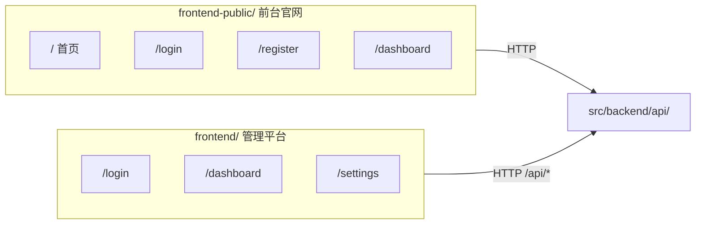
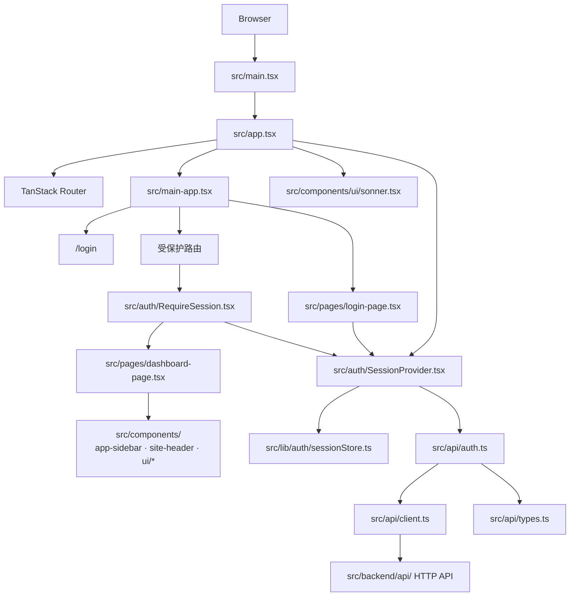
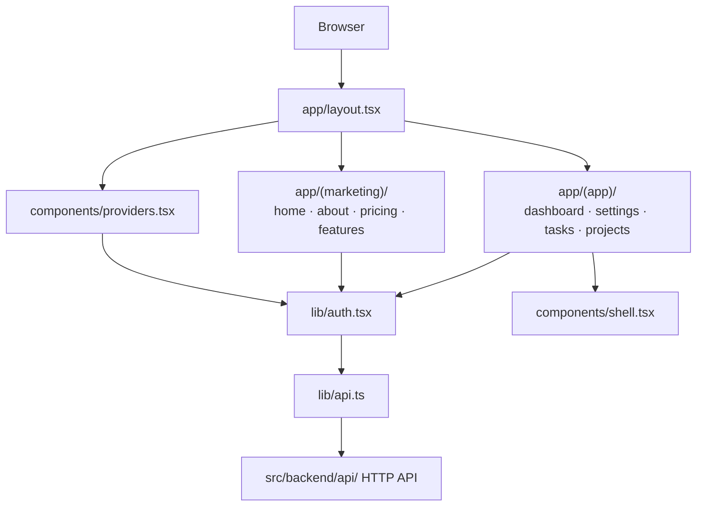
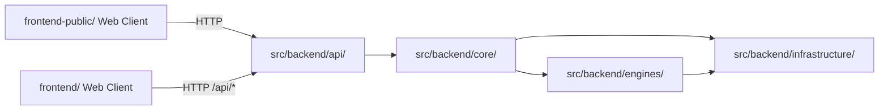

# 前端架构

本仓库包含两个独立的前端项目，它们都通过 HTTP 接口调用 `src/backend/api/` 暴露的后端能力，但服务不同场景：

- `frontend/`：管理平台（Admin Dashboard），面向已登录的管理员/用户。
- `frontend-public/`：前台官网（Marketing + App Shell），面向访客和已登录的最终用户。

两者都是浏览器端客户端架构，不属于后端四层 Clean Architecture 的内部依赖图。

## 定位

- `frontend/` 与 `frontend-public/` 是系统边界外的 Web 客户端。
- 它们通过 HTTP 接口调用 `src/backend/api/` 暴露的后端能力。
- 它们负责页面渲染、路由跳转、会话恢复和交互反馈，不承载后端用例编排。
- 两个项目独立构建、独立部署，彼此不共享源码（避免隐式耦合）。

## 双前端关系

- `frontend-public/` 是面向访客的默认入口，承载官网、注册、登录和轻量应用壳。
- `frontend/` 是登录后的管理后台，通过 Nginx `/api/*` 代理或直接请求后端。
- 两个前端共享同一会话机制：后端通过 HTTP-only `session_id` cookie 维持会话，因此在一处登录后，另一处在同域名下也处于登录态。

## `frontend/` 内部架构图

## `frontend-public/` 内部架构图

## `frontend/` 模块职责

### 应用入口层

路径：

- `src/main.tsx`
- `src/app.tsx`
- `src/main-app.tsx`

职责：

- 挂载 React 应用
- 组装 Router、Provider 与全局提示组件
- 定义页面路由、懒加载和主布局壳

### 认证与会话层

路径：

- `src/auth/SessionProvider.tsx`
- `src/auth/RequireSession.tsx`
- `src/lib/auth/sessionStore.ts`

职责：

- 恢复当前会话
- 暴露登录、登出与鉴权状态
- 在受保护路由前执行访问控制

### 页面层

路径：

- `src/pages/`
- `src/hooks/`

职责：

- 组织页面级交互
- 处理页面状态、加载态和错误态
- 连接认证层与共享组件层

### 共享组件层

路径：

- `src/components/`
- `src/components/ui/`

职责：

- 提供布局壳、导航组件和基础 UI 原语
- 复用视觉和交互模式
- 避免直接承担接口调用与会话编排

### API 适配层

路径：

- `src/api/client.ts`
- `src/api/auth.ts`
- `src/api/types.ts`

职责：

- 封装 HTTP 请求和响应解析
- 统一错误处理
- 为页面和认证逻辑提供稳定的接口调用入口

## `frontend-public/` 模块职责

### 应用入口层

路径：

- `app/layout.tsx`
- `app/page.tsx`
- `components/providers.tsx`

职责：

- 挂载 Next.js App Router
- 提供主题、会话等全局 Provider
- 区分 marketing 页面与 app 页面

### 认证与会话层

路径：

- `lib/auth.tsx`
- `lib/api.ts`

职责：

- 维护当前用户会话
- 提供受保护布局（app 路由默认需要登录）
- 统一 API 基础地址与错误处理

### 页面与组件层

路径：

- `app/(marketing)/`：首页、功能、定价等落地页
- `app/(app)/`：dashboard、settings、tasks、projects 等登录后页面
- `components/ui/`：shadcn/ui 组件
- `components/`：项目级业务组件

### API 适配层

路径：

- `lib/api.ts`

职责：

- 封装 axios 或 fetch 请求
- 根据环境变量 `API_BASE_URL` 指向正确后端地址
- 处理 401 等全局错误

## 与后端四层的边界

这表示：

- 前端只依赖后端暴露的接口契约，不依赖后端 Python 模块。
- 后端内部如何在 `src/backend/api/`、`src/backend/core/`、`src/backend/engines/`、`src/backend/infrastructure/` 之间拆分，对前端来说应是透明的。
- 如果后续前端规模扩大，可以继续在本文档下增加路由图、状态图和组件边界约束。

## 部署与代理

- `frontend/` 生产镜像使用 Nginx 托管静态产物，`/api/*` 代理到后端服务。
- `frontend-public/` 生产镜像使用 Next.js standalone 模式，`API_BASE_URL` 指向后端服务。
- 本地 `docker compose up` 会同时启动 `zata-codes-template-admin`（端口 5173）和 `zata-codes-template-public`（端口 3000）。
- Dokploy / VPS 生产环境通过不同 Host rule 路由：
  - `${DOMAIN}` → public
  - `admin.${DOMAIN}` → admin
