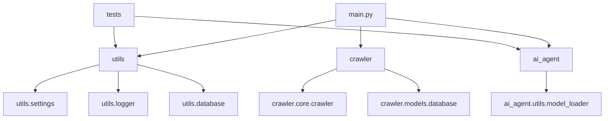

# 系统架构

该模板项目采用模块化结构，强调配置集中化与可复用工具沉淀。

## 总体架构

- **入口层**：`main.py` 作为基础运行入口。
- **通用能力层**：`utils` 提供配置、日志、数据库与工具函数。
- **AI 能力层**：`ai_agent` 提供模型加载与实例化基础能力。
- **业务示例层**：`crawler` 提供爬虫抽象与数据模型示例。
- **保障层**：`tests` 与 hooks 保证质量基线。

## 模块关系图

## 配置与运行链路

1. `utils.settings` 初始化全局 `config`。
2. `utils.logger` 读取 `config` 初始化日志器。
3. 业务模块在运行时复用上述能力。

## 扩展建议

- 将新的业务域代码按模块隔离，保持低耦合。
- 对外部系统调用统一封装，便于观测与重试。
- 优先保证配置和文档同步更新。
