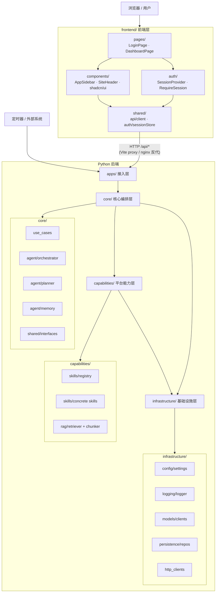

# 系统架构

本仓库遵循 **DDD 边界意识 + Clean Architecture 依赖方向 + 模块化单体** 的设计理念，目标是把模板演进为一个可长期维护的四层 AI Agent 骨架，而不是把所有能力堆在一个扁平工具目录里。

## 架构原则

- **依赖向内**：外层可以依赖内层，内层不能反向依赖外层。
- **按职责分层**：按变化率和业务边界分层，而不是按技术栈堆目录。
- **模块化单体**：保持一个仓库、一个部署单元，但内部按层隔离。
- **可替换实现**：模型、存储、HTTP、日志、配置等都放在基础设施层，核心层只依赖接口。

## 目标分层

### `apps/` 请求接入层

- 接收 HTTP、WebSocket、CLI 等请求。
- 只负责参数校验、DTO 转换、调用用例。
- 不写业务规则。

### `core/` 核心编排层

- 放置用例、Orchestrator、Planner、Memory 和领域契约。
- 负责业务规则和任务编排。
- 不直接依赖具体 SDK、数据库或 HTTP 客户端。

### `capabilities/` 平台能力层

- 放置 skills、RAG、registry、可插拔能力。
- 实现 `core/` 定义的端口。
- 不承担基础设施细节。

### `infrastructure/` 基础设施层

- 放置模型客户端、数据库、HTTP 客户端、配置和日志实现。
- 对接外部 API、物理数据库和文件系统。
- 只提供可被内层调用的具体实现。

## 当前目录与迁移方向

- `main.py`：未来作为 composition root，只做依赖组装。
- `utils/`：迁移期可作为兼容层，最终基础设施能力将下沉到 `infrastructure/`。
- `ai_agent/`：迁移期可保留部分兼容实现，核心编排与契约会逐步迁移到 `core/`。
- `crawler/`：根据实际职责，迁入 `capabilities/` 或作为独立示例域保留。
- `tests/`：用于验证边界、用例和适配器行为。

## 模块关系图



## 前端分层说明

| 层 | 路径 | 职责 |
|---|---|---|
| 页面层 | `src/pages/` | 路由级页面组件（登录、Dashboard） |
| 布局层 | `src/components/` | Sidebar、Header、shadcn/ui 基础组件 |
| 认证层 | `src/auth/` | SessionProvider 上下文、RequireSession 路由守卫 |
| 共享层 | `shared/` | API 客户端封装、会话缓存，与后端唯一通信入口 |

前端与后端之间**仅通过 `/api/*` HTTP 接口通信**，开发时由 Vite 代理转发，生产时由 nginx 反代。两侧无任何代码直接依赖。

## 为什么前端不属于四层

本仓库的四层架构用于约束 Python 后端内部的依赖方向：

```text
apps/ → core/ → capabilities/ → infrastructure/
```

这里的 `apps/` 指后端请求接入层，不等于浏览器前端。

- `frontend/` 是系统边界外的 Web 客户端。
- 它负责路由、页面渲染、会话状态和接口调用。
- 它通过 HTTP 或 WebSocket 调用 `apps/` 暴露的后端入口。
- 它不参与后端内部的依赖传递，因此不应被硬塞进四层中的任意一层。

如果需要讨论 `frontend/` 自身的模块拆分，应使用单独的前端内部架构文档，而不是混入后端四层依赖规则。详见 [`frontend-architecture.md`](frontend-architecture.md)。

## 依赖规则

1. `apps/` 只能调用 `core/` 暴露的用例和 DTO。
2. `core/` 只能依赖抽象接口和纯业务模型。
3. `capabilities/` 只能实现 `core/` 定义的契约。
4. `infrastructure/` 负责具体集成，不包含业务编排。
5. 旧的 `utils/` 与 `ai_agent/` 目录在迁移期内可以作为兼容出口，但不应继续作为最终架构。

## 迁移策略

- 先创建四层目录骨架，再迁移核心逻辑。
- 先定义接口，再迁移适配器。
- 先保持兼容导出，再逐步清理旧路径。
- 文档、测试和代码一起迁移，避免“结构变了，认知没变”。
