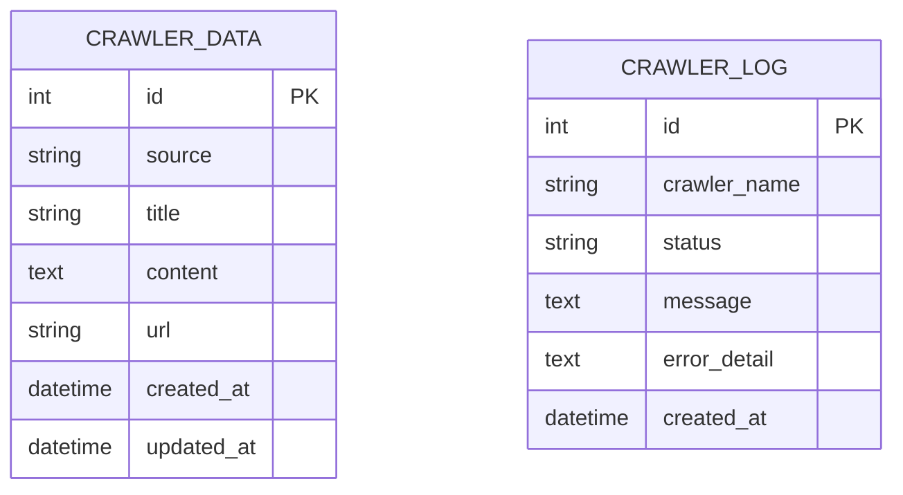

# Schema 设计

当前项目在 `crawler/models/database.py` 中提供了示例实体，用于展示爬虫数据与执行日志的持久化方式。

## 实体总览

- `CrawlerData`：存储爬取的核心业务数据。
- `CrawlerLog`：存储爬虫运行日志和错误信息。

## 字段说明

### CrawlerData

- `id`：主键。
- `source`：数据来源。
- `title`：标题。
- `content`：正文内容。
- `url`：源链接。
- `created_at` / `updated_at`：时间戳。

### CrawlerLog

- `id`：主键。
- `crawler_name`：爬虫名称。
- `status`：执行状态。
- `message`：日志文本。
- `error_detail`：错误详情。
- `created_at`：创建时间。

## ER 关系示意

当前示例模型之间未建立显式外键关系，可按业务需要扩展。
