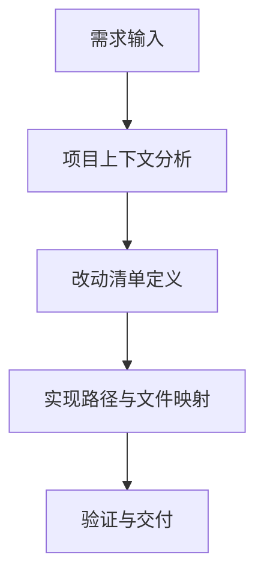

# PRD 编写规范（可视化版）

本规范用于统一本项目的 PRD 产出质量，重点解决“改什么、怎么改”不够直观的问题。  
所有 PRD 文件统一保存到 `tasks/[YYYYMMDD-HHMMSS]-prd-[feature-name].md`。

## 强制区块

每份 PRD 必须包含以下内容：

1. **改动清单表（Change Matrix）**
2. **Mermaid 流程图或架构图**
3. **低保真原型图（ASCII 或 Mermaid）**
4. **ER 图（仅当涉及数据模型变更时）**

## 改动清单表模板

| 改动对象 | 当前状态 | 目标状态 | 修改方式 | 影响文件 |
|---|---|---|---|---|
| [对象] | [现状] | [目标] | [怎么改] | `[path/to/file]` |

## 流程图模板



## 原型图模板（低保真）

```text
+--------------------------------------------------+
| PRD Title                                        |
+--------------------------------------------------+
| 1. Goals                                         |
| 2. Implementation Guide                          |
| 3. DoD                                           |
| 4. User Stories                                  |
| 5. FR                                            |
| 6. Non-Goals                                     |
+--------------------------------------------------+
```

## 交互原型（可操作 UI）规则

当需求评审需要验证流程交互（而不仅是结构布局）时，建议追加可交互原型页面。

- 原型页面路径：`docs/prototypes/*.html`
- 资源路径：`docs/prototypes/assets/`
- 通用入口资源：`docs/prototypes/assets/prototype.css`、`docs/prototypes/assets/prototype.js`
- 若用户明确指定原型页面名称/路径，必须优先使用该目标，禁止自动回退到 `prd-demo.html`
- PRD 中必须明确写出原型入口路径和用途
- 页面必须提供最小交互
- 页面必须支持移动端基础可操作性

推荐在 PRD 的 `Implementation Guide` 中补一节：
- `Interactive Prototype Link`：`docs/prototypes/<feature>-demo.html`

如果任务是通过 `planning-with-files` 工作流完成的，交付前还应：

- 回看现有 PRD 是否与最终实现一致
- 将实际交付物、测试结果、偏差说明补写回 `tasks/` 下的 PRD
- 若当前任务没有现成 PRD，则新建一个时间戳命名的 PRD 文件

如果由 `prd` 技能执行且触发 UI/原型改动条件，要求：

- 在生成 PRD 之前先实际修改原型文件
- 在 PRD 中增加 `Interactive Prototype Change Log`，记录前后行为变化
- 日志需包含真实文件路径（如 `docs/prototypes/*.html`、`docs/prototypes/assets/*.js`）

## ER 图触发条件

当存在以下任一情况时，必须提供 Mermaid `erDiagram`：

- 新增实体/表/模型
- 修改字段或关系
- 修改持久化状态结构

若无数据模型变更，需在 PRD 明确写出：`No data model changes in this PRD.`

## 推荐流程

1. 先扫描代码结构，确认影响范围。
2. 先写改动清单表，再写流程图和原型图。
3. 若有数据结构改动，再补 ER 图。
4. 最后写 User Stories 和 FR，保持可测试、可落地。

## 参考

- 技能说明：`skills/prd/SKILL.md`
- 可复用模板：`skills/prd/templates/prd-visual-template.md`
- 示例 PRD：`tasks/prd-visual-change-spec.md`
- 原型规范入口：`docs/prototypes/index.md`
- 原型示例：`docs/prototypes/prd-demo.html`
