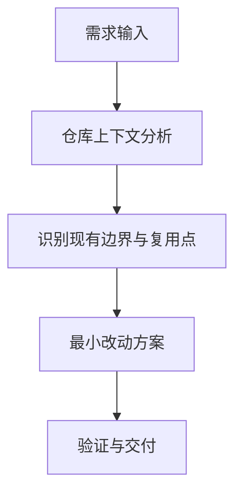

# PRD 编写规范（架构优先版）

本规范用于统一本项目的 PRD 产出质量，目标不是把 PRD 写得更长，而是让方案更贴合现有架构、更少引入冗余实现。
所有 PRD 文件统一保存到 `tasks/[YYYYMMDD-HHMMSS]-prd-[feature-name].md`。

## 核心原则

1. 先看仓库，再谈方案。代码库是第一信源。
2. 先做架构判断，再写图表和模板区块。
3. 默认推荐最小改动方案，而不是最完整、最新潮、最“像架构升级”的方案。
4. 新增模块、服务、表、依赖、页面都必须先过“冗余闸门”。
5. Web 搜索是条件能力，只用于补充仓库中不存在的外部事实。

## 必做分析

每份 PRD 在正式成稿前，必须先明确：

- 当前最接近的现有代码路径是什么
- 哪些模块可以直接复用或扩展
- 现有职责边界和依赖方向是什么
- 如果新增抽象，最可能重复掉的现有职责是什么

如果这些问题没有回答清楚，不应直接进入实现方案细节。

## 强制区块

每份 PRD 必须包含以下内容：

1. **Requirement Shape**
2. **Repository Context And Architecture Fit**
3. **Options And Recommendation**
4. **改动清单表（Change Matrix）**
5. **Mermaid 流程图或架构图**
6. **Non-Goals**
7. **Decision Log**（见下方规则）

以下内容是条件必填：

- **低保真原型图**：仅当需求依赖 UI 布局或多步交互时
- **ER 图**：仅当涉及数据模型或持久化状态变更时
- **External Validation**：仅当确实做了 Web 搜索时
- **Interactive Prototype Change Log**：仅当确实修改了 `docs/prototypes/` 下文件时

## 最小改动优先

每份 PRD 至少要比较两个方案：

1. **最小改动方案**
   直接扩展现有模块、边界和数据流。
2. **更重方案**
   引入新抽象、新层次、新依赖或新入口。

默认推荐最小改动方案。
只有在更重方案明显更安全、更一致、或能避免结构性问题时，才允许推荐它。

如果推荐更重方案，PRD 必须明确写出：

- 为什么现有路径不够用
- 为什么不是在重复已有职责
- 新增复杂度是什么
- 是否能同时删掉旧逻辑或避免并存

## 改动清单表模板

| 改动对象 | 当前状态 | 目标状态 | 修改方式 | 为什么符合现有架构 | 影响文件 |
|---|---|---|---|---|---|
| [对象] | [现状] | [目标] | [怎么改] | [复用/边界说明] | `[path/to/file]` |

## 流程图模板



图的重点应是“改动落在哪个现有边界里”，不是单纯把需求翻译成流程图。

## 原型图规则

低保真原型图不是默认必填项。
只有以下情况才需要补：

- 需求强依赖页面布局
- 需求强依赖多步状态切换
- 没有原型就无法说清范围边界

若不需要，应在 PRD 中明确写出：
- `No low-fidelity prototype required for this PRD.`

## 交互原型（可操作 UI）规则

只有在以下情况才创建或修改 `docs/prototypes/` 下文件：

- 用户明确要求 prototype / wireframe / demo
- 静态图和文字不足以表达待评审行为

禁止因为“这是个 UI 需求”就自动创建交互原型。

如果确实需要：

- 原型页面路径：`docs/prototypes/*.html`
- 资源路径：`docs/prototypes/assets/`
- 若用户明确指定原型页面名称或路径，必须优先使用该目标
- PRD 中必须写出原型入口路径和用途
- PRD 中必须增加 `Interactive Prototype Change Log`

如果没有实际改动原型文件，PRD 中应明确写出：
- `No interactive prototype file changes in this PRD.`

## ER 图触发条件

当存在以下任一情况时，必须提供 Mermaid `erDiagram`：

- 新增实体、表或模型
- 修改字段或关系
- 修改持久化状态结构

若无数据模型变更，需在 PRD 明确写出：
- `No data model changes in this PRD.`

## Decision Log 规则

Decision Log 是本项目替代独立 ADR 目录的决策记录机制。
PRD 归档后，Decision Log 随之永久保存在 `tasks/archive/`，成为持久参考。

### 为什么放在 PRD 里而不是单独的 ADR 文件

任务驱动的项目中，决策和实现是同一件事的两面。把决策记录嵌入 PRD，可以：

- 保留完整上下文（决策 + 方案 + 实现）
- 避免维护两套文档（PRD 和独立 ADR 目录）
- 随任务归档自然沉淀，不需要额外管理

### 格式

```markdown
## 11. Decision Log

| # | 决策问题 | 选择 | 放弃的方案 | 理由 |
|---|---|---|---|---|
| D-01 | [决策问题] | [最终选择] | [放弃的方案] | [一句话具体理由] |
```

### 填写规则

- **每个 Section 4 的 Option A/B 取舍必须对应至少一行。**
- **选择**列必须与 Section 4 的推荐项一致。
- **放弃的方案**必须具名，不得写"其他方案"。
- **理由**必须具体，不得写"符合架构"——应写"因为 X 无法满足 Y，所以选 Z"。
- ID 从 D-01 开始顺序编号，同一 PRD 内不重复。

### 示例

| # | 决策问题 | 选择 | 放弃的方案 | 理由 |
|---|---|---|---|---|
| D-01 | 架构模式 | Clean Architecture 四层 | 扁平 utils 工具集 | 需要支持多模型/多技能编排，扁平结构无法隔离业务规则与具体实现 |
| D-02 | 部署单元 | 模块化单体 | 微服务拆分 | 当前团队规模和流量不需要独立部署，过早拆分只增加运维成本 |

### 与架构文档的关系

Decision Log 记录**某次功能变更时做了什么决策**。
系统级架构原则记录在 [`docs/architecture/system-design.md`](../architecture/system-design.md)。
两者互补：前者是时间轴上的决策快照，后者是当前架构的权威描述。

---

## Web 搜索使用规则

Web 搜索不是默认步骤，只在这些场景启用：

- 第三方 API、SDK、云产品能力确认
- 安全规范、标准、法规
- 依赖版本行为或平台能力差异
- 用户明确要求竞品或行业方案调研

搜索时应遵守：

- 优先官方文档和一手资料
- 搜索结果只用于补充约束、兼容性和风险
- 不得用外部“最佳实践”覆盖仓库已有合理模式
- 所有外部结论必须在 PRD 中注明来源和检查日期

如果不需要搜索，应在 PRD 中明确写出：
- `No external validation required; repository evidence was sufficient.`

## 推荐流程

1. 先把需求改写成明确的行为声明。
2. 扫描代码结构，识别最接近的现有路径和复用点。
3. 先比较最小改动方案与更重方案，再决定推荐项。
4. 确认是否真的需要原型、ER 图、或 Web 搜索。
5. 写 Change Matrix、流程图、User Stories、FR 和 Non-Goals。
6. **填写 Decision Log**：将第 3 步的每个 Option A/B 取舍转换为一行记录。

## 参考

- 技能说明：[`skills/prd/SKILL.md`](../../skills/prd/SKILL.md)
- 可复用模板：[`skills/prd/templates/prd-visual-template.md`](../../skills/prd/templates/prd-visual-template.md)
- 示例 PRD：`tasks/archive/prd-visual-change-spec.md`
- 架构文档：[`docs/architecture/system-design.md`](../architecture/system-design.md)
- 原型规范入口：[`docs/prototypes/index.md`](../prototypes/index.md)
