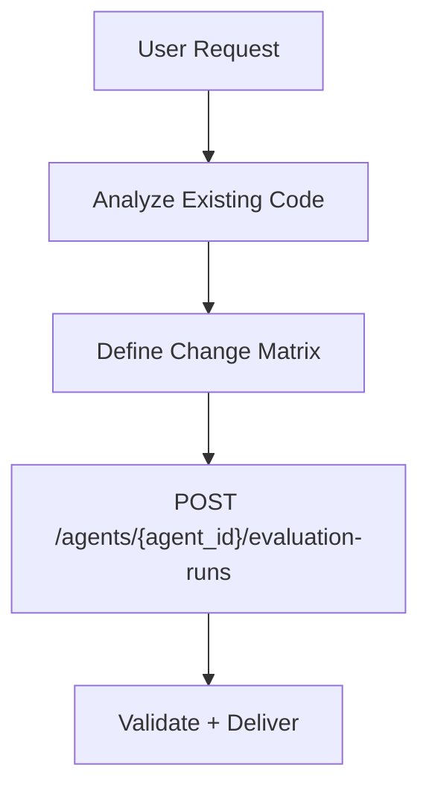

# PRD Generator (Context-Aware)

Create detailed Product Requirements Documents that are clear, actionable, and deeply integrated with the existing codebase.
The output PRD must make changes explicit via visual artifacts (tables + diagrams), not only text.

---

## The Job

1. **Analyze Project Context:** Read project files to understand the tech stack and patterns.
2. **Clarify:** Ask 3-5 *context-aware* questions with recommendations.
3. **Execute Prototype Changes (when needed):** If prototype/UI changes are required, modify prototype files first.
4. **Generate:** Create a structured PRD with technical implementation details, mandatory visuals, and change logs.
5. **Save:** Write to `tasks/[YYYYMMDD-HHMMSS]-prd-[feature-name].md`.

---

## Step 1: Project Context Analysis

**Before asking any questions**, you must scan the current project to understand:
- **Tech Stack:** (Check `package.json`, `requirements.txt`, etc.)
- **Database Schema:** (Check `prisma/schema.prisma`, SQL files, or types)
- **Project Structure:** (Where do components, API routes, and logic live?)
- **Styling Patterns:** (Tailwind? CSS Modules? UI Libraries?)

**Constraint:** Do NOT ask questions that can be answered by reading the code. (e.g., Don't ask "What database are we using?" if a schema file exists).

---

## Step 2: Clarifying Questions

Ask only critical questions that are NOT evident from the code.

- **Problem/Goal:** What problem does this solve?
- **Business Logic:** Specific rules not defined in code.
- **Scope:** What are the boundaries?

**Recommendation Requirement:**
1. You must explicitly state a "Best Choice" based on the **existing project patterns** and standard practices.
2. Cite existing code files to justify your recommendation where possible.

### Format Questions Like This:


```

1. [Question about Business Logic]?
A. [Option A]
B. [Option B]
C. [Option C]
> **Recommended: A** (Matches the pattern found in `src/auth/login.ts`)


2. [Question about Scope]?
...

```

---

## Step 3: Prototype-Aware Execution (Conditional Mandatory)

Before writing the final PRD, detect whether prototype page modifications are required.

### Prototype Target Resolution (Mandatory)
Resolve prototype target before any file edits:
- If user explicitly provides a prototype name/path/screen target, you MUST use that exact target.
- NEVER replace an explicit user target with `prd-demo.html`.
- If user gives only feature intent (no path), derive slug from that feature and use `docs/prototypes/<feature>-demo.html`.
- Only use a generic fallback when no explicit target exists.

### Working Tree Independence (Mandatory)
Do not anchor output to unrelated local modifications:
- Ignore uncommitted workspace changes unless the user explicitly asks to include or continue those exact changes.
- Do not infer prototype target from recently modified files.
- Treat user request text as the primary source of truth for target selection and scope.

### Trigger Conditions
Execute prototype file changes in the same turn when any of these are true:
- User asks for interactive UI/prototype/wireframe updates.
- Change Matrix includes `docs/prototypes/*.html` or `docs/prototypes/assets/*`.
- Requirement needs behavior demonstration (state transitions, button flows, step simulation).

### Required Actions When Triggered
1. Create/modify prototype files under:
   - `docs/prototypes/*.html`
   - `docs/prototypes/assets/*.css`
   - `docs/prototypes/assets/*.js`
2. Ensure prototype has at least:
   - One interaction control (button/toggle/tab)
   - One visible state change in the page
3. If new prototype page is added, update `mkdocs.yml` nav.
4. Run `uv run mkdocs build`.
5. Record actual modifications in the generated PRD section:
   - `2.8 Interactive Prototype Change Log`

If trigger conditions are not met, explicitly state in PRD:
- `No interactive prototype file changes in this PRD.`

---

## Step 4: PRD Structure

Generate the PRD with these sections. Sections 2.1-2.4 are mandatory.

### 1. Introduction & Goals
Brief description and bulleted list of measurable objectives.

### 2. Implementation Guide (Technical Specs) **[CRITICAL]**
Based on your analysis in Step 1, outline the technical path:
- **Core Logic:** How data flows through the **existing** system.
- **Database/State Changes:** Specific fields/tables to modify (e.g., "Add `is_active` to `User` table").
- **Affected Files:** Predict specific file paths (e.g., `src/components/Navbar.tsx`, `server/routers/user.ts`).
- **2.1 Change Matrix (MANDATORY):** A table with columns:
  - `Change Target`
  - `Current State`
  - `Target State`
  - `How to Modify`
  - `Affected Files`
- **2.2 Flow Diagram (MANDATORY):** At least one Mermaid flowchart or architecture diagram.
- **2.3 Low-Fidelity Prototype (MANDATORY):** ASCII wireframe or Mermaid layout diagram.
- **2.4 ER Diagram (CONDITIONAL MANDATORY):** Include Mermaid `erDiagram` when data model/schema/state structure changes are involved.
- **2.8 Interactive Prototype Change Log (CONDITIONAL MANDATORY):**
  - Required when prototype files are created or modified.
  - Must include: file path, what changed, before behavior, after behavior.
- **2.9 Interactive Prototype Link (CONDITIONAL MANDATORY):**
  - Required for UI/prototype related requests.
  - Must point to actual page path under `docs/prototypes/`.

### 3. Global Definition of Done (DoD)
Criteria applicable to **all** User Stories:
- [ ] Typecheck and Lint passes
- [ ] Verify visually in browser (if UI related)
- [ ] Follows existing project coding standards
- [ ] No regressions in existing features

### 4. User Stories
Focus ONLY on the unique business logic.

**Format:**
```markdown
### US-001: [Title]
**Description:** As a [user], I want [feature] so that [benefit].

**Acceptance Criteria:**
- [ ] [Unique Logic 1]
- [ ] [Unique Logic 2]

```

### 5. Functional Requirements

Unambiguous numbered list (FR-1, FR-2...).

### 6. Non-Goals

What is explicitly out of scope.

---

## Step 5: Visual Artifact Rules (Mandatory)

### A. Change Matrix Template
Use this exact structure (add rows as needed):

| Change Target | Current State | Target State | How to Modify | Affected Files |
|---|---|---|---|---|
| Example: Task priority data field | No priority field | Priority enum available | Add enum + wire validation + render badge | `prisma/schema.prisma`, `src/server/routers/task.ts`, `src/components/TaskItem.tsx` |

### B. Flow Diagram Template
At least one Mermaid diagram:

Mermaid label safety rule:
- If a node label contains special characters such as `/`, `{}`, `[]`, `()`, `:`, or `-` (common in API paths), wrap the label with double quotes.
- Correct: `F["POST /agents/{agent_id}/evaluation-runs"]`
- Incorrect: `F[POST /agents/{agent_id}/evaluation-runs]`



### C. Low-Fidelity Prototype Template
Use one of:
- ASCII wireframe in code block, or
- Mermaid layout (flowchart/subgraph) showing module/screen blocks.

### D. ER Diagram Trigger Rule
Include an ER diagram if any of these are true:
- New table/model/entity added
- Existing fields/relationships changed
- Persistent state schema modified (DB or structured storage)

When ER is required, use Mermaid `erDiagram` and ensure entity names match the text/table.

### E. Interactive Prototype Change Log Template
Use this structure when prototype files changed:

| File Path | Change Type | Before | After | Why |
|---|---|---|---|---|
| `docs/prototypes/<requested-feature>-demo.html` | Modify | Static content only | Added Start/Next/Reset interactions | Support behavior review |

Include at least one path under `docs/prototypes/`.

---

## Step 6: Save Location

Write the PRD to:
- `tasks/[YYYYMMDD-HHMMSS]-prd-[feature-name].md`

Feature slug should be lowercase with hyphens.
Timestamp must use local current time in `YYYYMMDD-HHMMSS` format.

---

## Checklist

* [ ] **Analyzed project structure FIRST**
* [ ] Skipped questions already answered by existing code
* [ ] Included recommendations based on current project patterns
* [ ] Included a **Change Matrix** with explicit "How to Modify"
* [ ] Included at least one **Mermaid** flow/architecture diagram
* [ ] Included a **Low-Fidelity Prototype** (ASCII or Mermaid)
* [ ] Added **ER diagram** when schema/data model changes are present
* [ ] Executed prototype file edits when UI/prototype triggers are present
* [ ] Added **Interactive Prototype Change Log** with real file paths and before/after behavior
* [ ] Added **Interactive Prototype Link** when UI/prototype related
* [ ] Listed specific file paths in "Implementation Guide"
* [ ] Saved to `tasks/[YYYYMMDD-HHMMSS]-prd-[feature-name].md`
