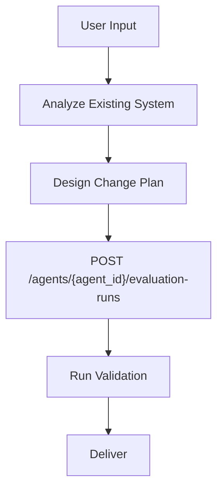
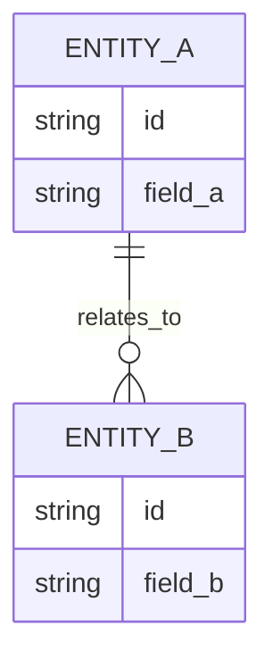

# PRD: [Feature Name]

## 1. Introduction & Goals

[Brief problem statement and feature objective.]

### Measurable Objectives
- [Objective 1]
- [Objective 2]
- [Objective 3]

---

## 2. Implementation Guide (Technical Specs)

### 2.1 Project Context Analysis
- Tech stack: [Detected from repository]
- Existing architecture pattern: [Relevant modules/files]
- Constraints: [Runtime, dependency, coding standard constraints]

### 2.2 Change Matrix (Mandatory)

| Change Target | Current State | Target State | How to Modify | Affected Files |
|---|---|---|---|---|
| [Target 1] | [Current] | [Target] | [Implementation approach] | `[path/a]`, `[path/b]` |
| [Target 2] | [Current] | [Target] | [Implementation approach] | `[path/c]` |

### 2.3 Core Logic Flow (Mandatory)

Use quoted Mermaid labels when text includes special characters (for example API paths with `{}`): `F["POST /agents/{agent_id}/evaluation-runs"]`.



### 2.4 Low-Fidelity Prototype (Mandatory)

```text
+--------------------------------------------------+
| [Main Screen/Module Name]                        |
+--------------------------------------------------+
| [Section A]                                      |
| [Section B]                                      |
| [Section C]                                      |
+--------------------------------------------------+
```

### 2.5 ER Diagram (Required when data model changes)

If schema/state model is changed, include:



If no schema/state model changes:
- No data model changes in this PRD.

### 2.6 Database/State Changes
- [Explicit schema/state modifications or "None"]

### 2.7 Affected Files (Predicted)

| File | Change Type | Description |
|---|---|---|
| `[path/to/file]` | Modify/Add/Delete | [What changes and why] |

### 2.8 Interactive Prototype Change Log (Required when prototype files changed)

| File Path | Change Type | Before | After | Why |
|---|---|---|---|---|
| `docs/prototypes/[feature]-demo.html` | Modify/Add | [Old behavior] | [New behavior] | [Reason] |
| `docs/prototypes/assets/[feature].js` | Modify/Add | [Old behavior] | [New behavior] | [Reason] |

If no prototype changes:
- No interactive prototype file changes in this PRD.

### 2.9 Interactive Prototype Link (Required for UI/prototype requests)

Use the user-requested prototype target when explicitly provided. Do not default to `prd-demo.html` when a target is given.

- Prototype page: `docs/prototypes/[feature]-demo.html`
- Optional index link: `docs/prototypes/index.md`

---

## 3. Global Definition of Done (DoD)

- [ ] Typecheck and lint pass
- [ ] Visual verification completed (if UI related)
- [ ] Follows existing project coding standards
- [ ] No regressions in existing features
- [ ] Change Matrix complete and accurate
- [ ] Mermaid diagram included
- [ ] Low-fidelity prototype included
- [ ] ER diagram included when required
- [ ] Interactive prototype change log included when prototype files changed
- [ ] Interactive prototype link included for UI/prototype requests
- [ ] `uv run mkdocs build` passed after prototype/doc changes

---

## 4. User Stories

### US-001: [Story Title]
**Description:** As a [role], I want [feature], so that [benefit].

**Acceptance Criteria:**
- [ ] [Unique business logic 1]
- [ ] [Unique business logic 2]

---

## 5. Functional Requirements

- FR-1: [Requirement statement]
- FR-2: [Requirement statement]
- FR-3: [Requirement statement]

---

## 6. Non-Goals

- [Out-of-scope item 1]
- [Out-of-scope item 2]
