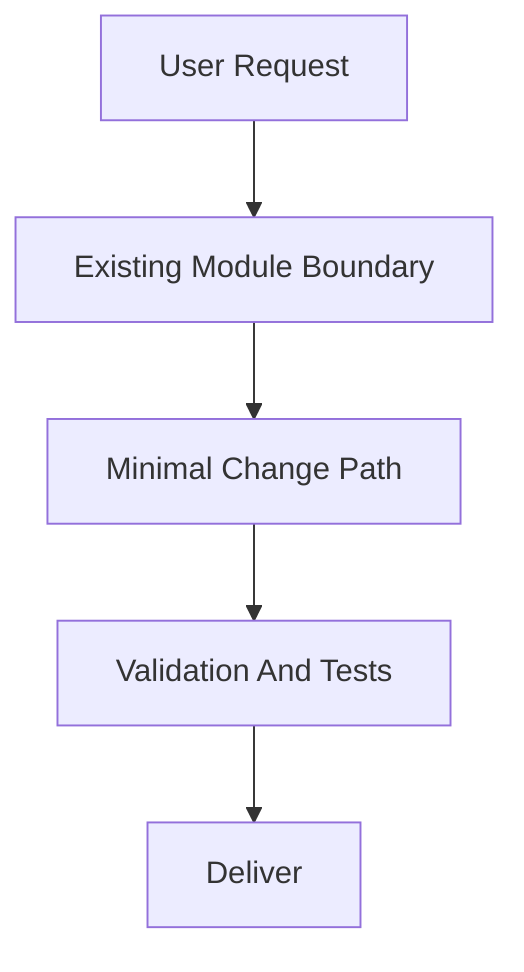
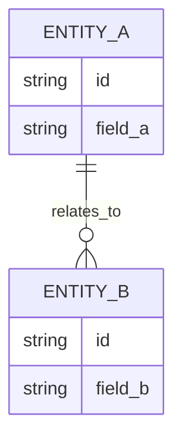

# PRD: [Feature Name]

## 1. Introduction & Goals

[Brief problem statement and feature objective.]

### Measurable Objectives
- [Objective 1]
- [Objective 2]
- [Objective 3]

---

## 2. Requirement Shape

- Actor: [Who needs this behavior]
- Trigger: [When the behavior happens]
- Expected behavior: [What the system should do]
- Scope boundary: [What this PRD does not cover]

---

## 3. Repository Context And Architecture Fit

- Existing path: [Closest current module or code path]
- Reuse candidates: [Files/modules to extend directly]
- Architecture pattern to preserve: [Relevant boundary or dependency direction]
- Constraints: [Runtime, dependency, coding standard, workflow, or rollout constraints]
- Redundancy risks: [Likely duplication or parallel abstraction risks]

---

## 4. Options And Recommendation

### Option A: Minimal Change
- Approach: [Extend existing path]
- Pros: [Why it is smaller/safer]
- Cons: [Known tradeoff]

### Option B: Heavier Change
- Approach: [New abstraction/module/service/dependency]
- Pros: [Potential benefit]
- Cons: [Added complexity]

### Recommendation
- Recommended option: [A or B]
- Why: [Why this best fits the current architecture]
- Rejected redundancy: [What extra layer or file was intentionally avoided]

---

## 5. Implementation Guide

### 5.1 Core Logic
- [How data and control move through the existing system]

### 5.2 Change Matrix

| Change Target | Current State | Target State | How to Modify | Why This Fits Existing Architecture | Affected Files |
|---|---|---|---|---|---|
| [Target 1] | [Current] | [Target] | [Implementation approach] | [Architecture-fit rationale] | `[path/a]`, `[path/b]` |
| [Target 2] | [Current] | [Target] | [Implementation approach] | [Architecture-fit rationale] | `[path/c]` |

### 5.3 Flow Or Architecture Diagram



### 5.4 Low-Fidelity Prototype (Only When Required)

```text
+--------------------------------------------------+
| [Main Screen/Module Name]                        |
+--------------------------------------------------+
| [Section A]                                      |
| [Section B]                                      |
| [Section C]                                      |
+--------------------------------------------------+
```

If not required:
- No low-fidelity prototype required for this PRD.

### 5.5 ER Diagram (Only When Data Model Changes)



If not required:
- No data model changes in this PRD.

### 5.6 Affected Files

| File | Change Type | Description |
|---|---|---|
| `[path/to/file]` | Modify/Add/Delete | [What changes and why] |

### 5.7 Interactive Prototype Change Log (Only When Files Actually Changed)

| File Path | Change Type | Before | After | Why |
|---|---|---|---|---|
| `docs/prototypes/[feature]-demo.html` | Modify/Add | [Old behavior] | [New behavior] | [Reason] |

If no prototype changes:
- No interactive prototype file changes in this PRD.

### 5.8 External Validation (Only When Web Research Was Used)

| Topic | Source | Checked On | Relevant Finding | Impact On Recommendation |
|---|---|---|---|---|
| [Vendor/API/standard] | [URL or doc title] | [YYYY-MM-DD] | [Fact] | [Constraint or risk] |

If no external validation was needed:
- No external validation required; repository evidence was sufficient.

---

## 6. Definition Of Done

- [ ] Typecheck and lint pass
- [ ] Relevant tests pass
- [ ] Docs updated if behavior changes
- [ ] Follows existing project coding standards
- [ ] No regressions in existing features
- [ ] Recommended option still minimizes unnecessary abstraction

---

## 7. User Stories

### US-001: [Story Title]
**Description:** As a [role], I want [feature], so that [benefit].

**Acceptance Criteria:**
- [ ] [Unique business logic 1]
- [ ] [Unique business logic 2]

---

## 8. Functional Requirements

- FR-1: [Requirement statement]
- FR-2: [Requirement statement]
- FR-3: [Requirement statement]

---

## 9. Non-Goals

- [Out-of-scope item 1]
- [Out-of-scope item 2]

---

## 10. Risks And Follow-Ups

- [Risk, migration issue, or deferred cleanup]
