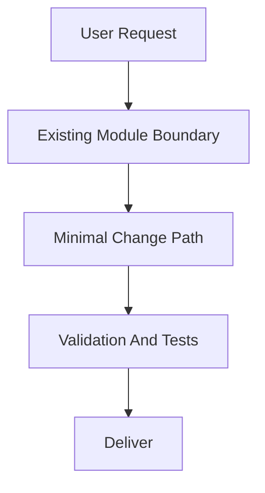
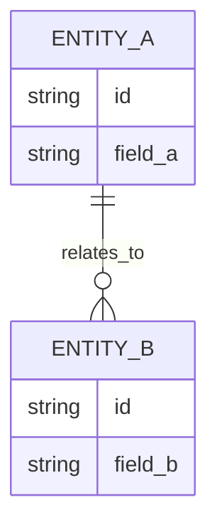

# PRD: [Feature Name]

> 本 PRD 分两个 altitude，分别服务不同读者，自上而下阅读：
>
> - **Part A · 人审层 (Review Layer)** — 需求方 / 验收人读这部分，决定"该不该做、做得对不对"，并通过风险地图知道**哪些地方必须亲自确认**。Part A 不出现实现机制、文件路径、命令。
> - **Part B · 执行器层 (Build Layer)** — 实现者（人或 Agent）读这部分动手。人只在 Part A 风险地图**点名处**下钻审查，其余默认交执行器 + 自动门禁（hook / 测试 / 架构检查）。

---

# Part A · 人审层 (Review Layer)

## 1. Introduction & Goals

### Problem Statement

[痛点：谁、在什么场景、遇到什么问题，现状为什么不够。只讲问题，不讲方案、机制、文件或命令。]

### Interpretation (解读回显)

[Agent 把需求读成了什么——"我理解为 X，而不是 Y";假设的范围 / 边界。这是你**前置批准**的对象:批准这条 = 同意按这个解读自动实现（第一次人类触点）。]

### What The User Gets

[白话描述交付后使用者（终端用户 / 调用方 / 运维）拿到什么能力、什么行为变化。站在使用者视角，禁止出现实现机制、模块路径、命令。机制写在 Part B 第 6 节。]

### Measurable Objectives

- [可度量目标 1]
- [可度量目标 2]
- [可度量目标 3]

---

## 2. Human Review Map (介入与风险地图)

本节决定注意力如何分配：哪些改动**必须人工确认**，哪些交给**执行器 + 自动门禁**（hook / 测试 / 架构检查）。
默认按架构层定介入档（`api`/`infrastructure` 偏自动，`core` 偏人工），再用风险因子 —— **不可逆性、影响面、安全·资金、正确性关键度** —— 上调或下调。
**两次人类触点**模型：前置一次（批准 §1 解读 + 本表 oracle）、终点一次（读 §9 证据包）;中间 Agent 自治自验、不打断人。所以"人工确认" = **高证据负担**（置顶进 §9 证据包、必须有可执行 oracle），不是中途拦你。

判定菜单（逐项对照本次改动是否命中）：

- 固定区域：① Core 业务逻辑 / 编排规则（`core/`）② 数据库结构 / schema / 迁移（即使在 `infrastructure/`）③ 安全 / 鉴权 / 信任边界 ④ 对外 API 契约 / breaking change
- 横切触发器（命中即升级，无视所在层）：⑤ 资金 / 计费 / 额度 ⑥ 不可逆 / 破坏性数据操作（批量删除、回填、降级迁移）⑦ 并发 / 事务 / 幂等性

**命中的人审项**（逐条进下方分级表，需人工确认）：

- [列出本次命中的菜单项，如"② schema 变化、③ 新增鉴权"；若一项都没命中，写 `本次无人工确认项，全部交执行器 + 自动门禁`]

**未命中**（默认执行器 + 自动门禁，无需逐行人审）：

- [一行列出未命中的菜单编号，如"①④⑤⑥⑦ 不涉及"]
- 最坏自检：[每个未命中项一句"假如判断错了最坏会怎样";最坏不可逆 / 重大的，不准留作未命中]

> **清单要保持短**——只把真正命中的列为人审；若什么都标成人审，本节就失去意义。拿不准时用风险因子裁，而不是把清单越加越长。

| 改动点 | 架构层 | 风险 | 介入方式 | 证据 / Oracle（指向 §7.6 oracle 块的 rv-id） |
|---|---|---|---|---|
| [命中的高风险改动点] | api / core / engines / infrastructure / frontend | 高 / 中 | 人工确认（高证据负担） | rv-1, rv-2（详见 §7.6） |
| [常规改动点] | ... | 低 | 执行器+门禁 | rv-3（或能抓住本次失败的具体门禁名；通用 build / lint 不算） |

**如何证明它生效（真实入口，白话）**：

- [通过哪条真实使用路径能确认它生效，例如"跑通某真实流程后看到某结果"。命令级细节见 Part B 第 7.6 节 Realistic Validation Plan。]

**数据库结构评审（schema 变化时必填）**：

- schema 有变化时，把 ER 图放到本节供人审，详细实现见 Part B 第 7.5 节。
- 无 schema 变化则写：`本次无数据库结构变化。`

---

## 3. Usage And Impact After Implementation

写 PRD 时即填写，描述实现后的**目标态使用脚本**（消费者视角），作为构建目标和回头验证的依据；不是事后日志。用户可见或有可执行行为（API/CLI/UI/job/启动/迁移）时必填；纯内部改动只写最后一行兜底说明。保持各角色走查具体，但不要照抄 Goals / FR / Requirement Shape。

### [终端用户 / End User]
- [Which page/route and entry point, which fields, and the resulting identifier or output format]

### [管理员 / Admin]
- [What the admin manages and where; any operational attributes set here]

### [开发者 / Developer]
- [Which existing entry point developers keep using; which DTO/contract to follow when extending]

### Impact On Existing Behavior
- [What stays unchanged for existing users/data/config]
- [Any new optional config/env and its default-off behavior; existing paths must keep working]

If the change is purely internal:
- `No user-facing usage change; internal-only change.`

---

## 4. Requirement Shape

- Actor: [谁需要这个行为]
- Trigger: [何时触发]
- Expected behavior: [系统应做什么]
- Scope boundary: [本 PRD 不覆盖什么]

---

# Part B · 执行器层 (Build Layer)

> 以下供实现者（人或 Agent）使用。人只在 Part A 风险地图点名处下钻审查；其余默认交执行器 + 自动门禁。

## 5. Repository Context And Architecture Fit

- Existing path: [Closest current module or code path]
- Reuse candidates: [Files/modules to extend directly]
- Architecture pattern to preserve: [Relevant boundary or dependency direction]
- Frontend impact: [which frontend app(s) the repo ships and which change + closest routes/components, or "No frontend impact" with reason]
- Existing PRD relationship: [Result of checking tasks/pending/ first and relevant tasks/archive/ second: duplicate / depends on / blocks / independent / none found]
- Redundancy risks: [Likely duplication or parallel abstraction risks]

---

## 6. Recommendation

### Recommended Approach
- Approach: [Extend the best existing path or justify the smallest necessary new piece]
- Why this is the best fit: [Why this best fits the current architecture]
- Rejected redundancy: [What extra layer, module, or dependency was intentionally avoided]

### Proposed Solution Summary (实现机制)

[实现方向，给实现者看：核心机制 / 架构路径、谁提供必要的声明·配置·输入（系统是推断还是只消费显式数据）、插入到哪个现有入口 / 模块边界 / API / 工作流 / UI、主要 state·output·用户可见行为变化、刻意避免的复杂度（如新存储、并行抽象、改动的状态机）。]

### Alternatives Considered (Only When Useful)
- Alternative: [Meaningful non-trivial alternative]
- Why not chosen: [Why it adds unnecessary risk, scope, or complexity]

---

## 7. Implementation Guide

This section is a living implementation guide based on current repository analysis. If implementation discovers additional affected files, hidden dependencies, edge cases, or a better path, update this PRD before proceeding.

### 7.1 Core Logic
- [How data and control move through the existing system]

### 7.2 Change Impact Tree

```text
.
├── [Backend Layer]
│   └── [path/to/file]
│       [新增] / [修改] / [删除]
│       【总结】[One-sentence summary of the file-level change]
│
│       ├── [Concrete logical change 1; use symbol/config/route anchors, not line numbers]
│       ├── [Concrete logical change 2; include rg anchor when useful]
│       └── [Concrete logical change 3]
│
└── Frontend ([repo's frontend app])   # 用户可见改动时必填；纯后端任务写 "No frontend impact"
    └── [frontend-app]/[path/to/component-or-route]
        [新增] / [修改] / [删除]
        【总结】[组件/路由/状态/API 客户端调用的一句话总结]

        ├── [组件或页面改动]
        ├── [调用后端 API 的客户端代码与类型同步]
        └── [状态或交互改动]
```

### 7.3 Executor Drift Guard

The file list above is the expected implementation surface from current repository analysis. During implementation, treat it as a starting point and use these repository searches to catch hidden references or drift before marking the PRD complete.

| Check | Command | Expected Result | If It Fails, Inspect First |
|---|---|---|---|
| [Legacy reference search] | `rg -n "[legacy-symbol-or-path]" [scope]` | [No obsolete references remain / only approved references remain] | [Config keys, build context, working directory, route, import, or docs area] |
| [Target reference search] | `rg -n "[new-symbol-or-path]" [scope]` | [Expected target references exist in the owning files] | [Composition root, entry command, generated config, or docs index] |
| [Hidden entry point search] | `rg -n "[command|env|artifact|route-pattern]" [scope]` | [No unreviewed entry points bypass the new target state] | [CI, scripts, Docker, deployment, README, IDE config] |

### 7.4 Flow Or Architecture Diagram



### 7.5 ER Diagram (Only When Data Model Changes)

> 与 Part A 第 2 节"数据库结构评审"联动：本图是人审依据，schema 变化时必出。



If not required:
- `No data model changes in this PRD.`

### 7.6 Realistic Validation Plan (Oracle 块)

机读 + 人读的**单一 oracle 源**：§2 的证据列、§9 证据包、以及任何确定性抽取器都引用 / 解析这里的 `id`。不要在别处再用散文表格重述 oracle。每个真实可观测行为一条;§2 每个人审项至少对应一条。

```yaml
- id: rv-1
  behavior: 这条证明的用户可见行为(白话)
  real_entry: "用户真正会敲的命令 / URL / 入口"      # 真实入口,不是单测/helper
  expected: "看到什么算它真的成立(可观测)"
  mock_boundary: "什么可 mock、什么必须真"           # under-test 的那层不准 mock
  negative_control: "什么命令 / 种个 bug 能让它变红"  # 判别力:证明这测试会失败
  expected_fail: "红的时候长什么样"
  test_layer: unit|integration|e2e|smoke|sandbox|manual
  required_for_acceptance: true
```

Failure triage:
- `real_entry` 跑挂,先查 `[第一处 config / 路径 / 边界]`,别急着改实现策略。
- 生产 / 供应商 / 需凭据的项标 `opt-in / post-merge`;无凭据时必须有仍可跑的 fallback。

无可执行行为时,本块写：
- `No executable behavior changes; realistic validation is limited to documentation/build checks.`

### 7.7 Low-Fidelity Prototype (Only When Required)

```text
+--------------------------------------------------+
| [Main Screen/Module Name]                        |
+--------------------------------------------------+
| [Section A]                                      |
| [Section B]                                      |
| [Section C]                                      |
+--------------------------------------------------+
```

If not required:
- `No low-fidelity prototype required for this PRD.`

### 7.8 Interactive Prototype Change Log (Only When Files Actually Changed)

| File Path | Change Type | Before | After | Why |
|---|---|---|---|---|
| `docs/prototypes/[feature]-demo.html` | Modify/Add | [Old behavior] | [New behavior] | [Reason] |

If no prototype changes:
- `No interactive prototype file changes in this PRD.`

### 7.9 External Validation (Only When Web Research Was Used)

| Topic | Source | Checked On | Relevant Finding | Impact On Recommendation |
|---|---|---|---|---|
| [Vendor/API/standard] | [URL or doc title] | [YYYY-MM-DD] | [Fact] | [Constraint or risk] |

If no external validation was needed:
- `No external validation required; repository evidence was sufficient.`

---

## 8. Delivery Dependencies

工具中立的排期元数据，不是工具专属队列语法。无依赖时显式写 `none`。

- Group: [logical-delivery-group-or-none]
- Depends on groups:
  - none
- Depends on tasks/issues:
  - none
- Gate type: none
- Notes: [Use tool-neutral dependency names. Do not put tool-specific hidden markers here.]

---

## 9. Acceptance Checklist

这是「人只看一次」的交付物。按 Part A 风险地图排序组织成**验收证据包**，每项必须带证据（命令输出 / 观察 / 工件引用），不是裸勾。Use task-relevant groups; validate the final target state, not only an interim first phase.

### Acceptance Evidence Package（证据包 · 按风险地图排序，终点人审入口）

1. **高风险 oracle 结果**（§2 每个人工确认行的 oracle 跑绿证据，置顶）：[oracle → 通过证据]
2. **风险地图对账 Predicted → Reconciled**：[实现中有无未预测到的高风险面被触发，如何处理]
3. **对抗自检**：[对"未命中"项与关键断言的反方检查结论]
4. **对锁定契约的 diff**：[高风险改动 vs 前置约定的 API 契约 / schema / 行为]
5. **低风险门禁结果（折叠）**：[通用 build / lint / 架构 / 类型检查]

### Human-Confirmed (来自 Part A 风险地图)

> Part A 第 2 节每个"必须人工确认"的改动点，这里都要有对应的已确认验收项。

- [ ] [风险地图中 core 逻辑 / schema / 安全 / 对外契约 等人工确认项已逐条确认]

### Architecture Acceptance

- [ ] [Concrete boundary, directory, ownership, or entry-point outcome]
- [ ] [Concrete layering or composition-root outcome]

### Dependency Acceptance

- [ ] [Concrete import, port, adapter, or dependency-direction constraint]
- [ ] [Concrete contract-compatibility or forbidden-dependency constraint]

### Behavior Acceptance

- [ ] [Concrete API, workflow, runtime, or business behavior outcome]
- [ ] [Concrete compatibility or invariance that must remain true]

### Frontend Acceptance (When A Frontend App Changes)

- [ ] `[frontend-app]/[component or route]` renders/behaves as specified
- [ ] Frontend calls the new/changed backend endpoint with the correct contract and synced types
- [ ] If no frontend changes: `No frontend impact` recorded with a reason

### Documentation Acceptance

- [ ] [Concrete doc page or reference updated to match the target design]
- [ ] [PRD and repository docs stay aligned with the final architecture direction]

### Validation Acceptance

- [ ] `[validation command]` passes
- [ ] `[real entry command]` exercises the changed behavior through `[API/CLI/UI/job/startup/migration]` without bypassing `[critical boundary]`
- [ ] For user-visible changes: the repo's e2e/UI test command or a manual app run confirms the flow end-to-end
- [ ] `[rg search command]` confirms no legacy entry point, duplicate path, or compatibility shim remains
- [ ] `[rg search command]` confirms expected target references exist in the owning files

### Delivery Readiness

- [ ] Recommended approach fully implemented; no unapproved parallel abstraction introduced
- [ ] No open regression or rollout blocker remains

---

## 10. Functional Requirements

- FR-1: [Requirement statement]
- FR-2: [Requirement statement]
- FR-3: [Requirement statement]

---

## 11. Non-Goals

- [Out-of-scope item 1]
- [Out-of-scope item 2]

---

## 12. Risks And Follow-Ups

- [Unavoidable risk or explicitly approved non-blocking follow-up]

---

## 13. Decision Log

每条记录对应本 PRD 中做出的一个关键决策，归档后作为永久参考。

| # | 决策问题 | 选择 | 放弃的方案 | 理由 |
|---|---|---|---|---|
| D-01 | [决策问题，如"架构模式选择"] | [最终选择] | [放弃的方案] | [一句话说明为什么] |
