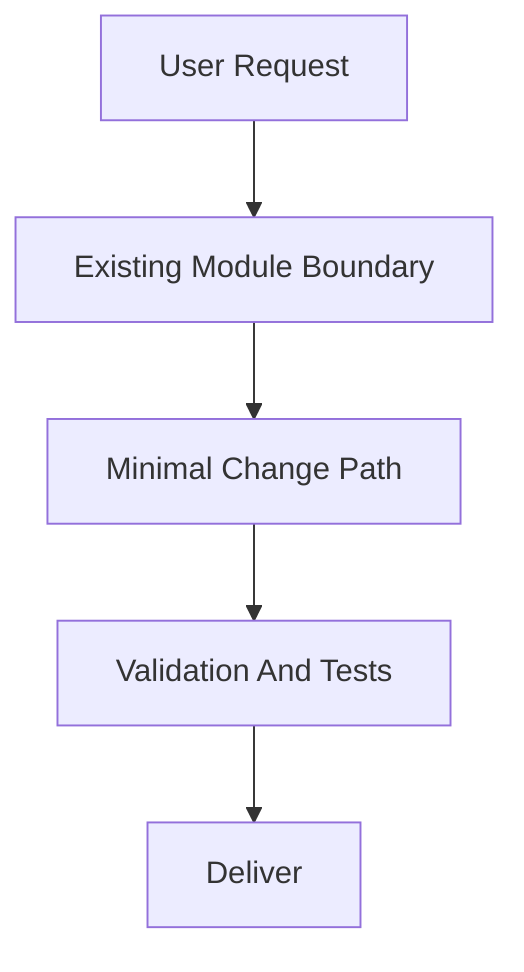
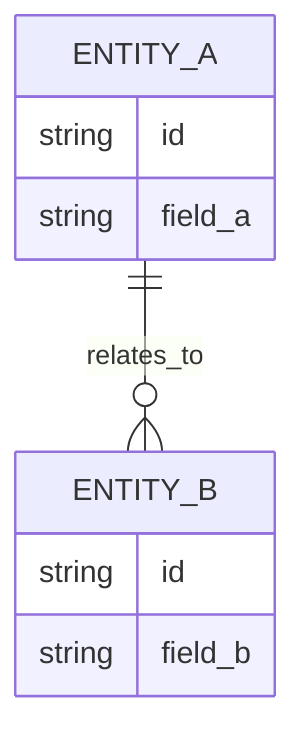

# PRD: [Feature Name]

## 1. Introduction & Goals

### Problem Statement

[Briefly describe the current pain, who experiences it, and why the existing workflow or behavior is insufficient.]

### Proposed Solution Summary

[Summarize the recommended implementation approach in one short paragraph. Name the core mechanism, who supplies any required declaration/configuration/input, where it plugs into the existing system, what state/API/UI changes it makes, and what it intentionally avoids.]

### Measurable Objectives
- [Objective 1]
- [Objective 2]
- [Objective 3]

### Realistic Validation

除单元测试和集成测试外，本 PRD 要求通过**真实项目入口点**验证关键行为，确保真实使用路径生效，而非仅在隔离 fixture 中通过。

- [ ] **[行为名称] 真实验证**：通过 `[真实入口命令或流程]` 验证 `[关键可观察结果]`。
- [ ] **[配置/状态/回退] 真实验证**：通过 `[真实入口命令或流程]` 验证 `[关键可观察结果]`。

**为什么单元测试不够**：说明真实入口验证覆盖了哪些单元测试无法证明的行为。

### Delivery Dependencies

- Group: [logical-delivery-group-or-none]
- Depends on groups:
  - none
- Depends on tasks/issues:
  - none
- Gate type: none
- Notes: [Use tool-neutral dependency names. Do not put tool-specific hidden markers here.]

---

## 2. Usage And Impact After Implementation

写 PRD 时即填写，描述实现后的目标态用户视角，作为构建目标和回头验证的脚本；不是事后日志。用户可见或有可执行行为（API/CLI/UI/job/启动/迁移）时必填；纯内部改动只写最后一行的兜底说明。保持各角色走查具体，但不要照抄 Goals / FR / Non-Goals。

### [终端用户 / End User]
- [Which page/route and entry point, which fields, and the resulting identifier or output format, e.g. `provider/model_id`]

### [管理员 / Admin]
- [What the admin manages and where; any operational attributes set here]

### [开发者 / Developer]
- [Which existing entry point developers keep using; which DTO/contract to follow when extending]

### Entry Commands / API Examples

```bash
# [Create / verify / sync / ...] through the new or changed entry point
curl -X POST /api/[resource] \
  -H "Content-Type: application/json" \
  -d '{ "field": "value" }'
```

### Impact On Existing Behavior
- [What stays unchanged for existing users/data/config]
- [Any new optional config/env and its default-off behavior; existing paths must keep working]

If the change is purely internal:
- `No user-facing usage change; internal-only change.`

---

## 3. Requirement Shape

- Actor: [Who needs this behavior]
- Trigger: [When the behavior happens]
- Expected behavior: [What the system should do]
- Scope boundary: [What this PRD does not cover]

---

## 4. Repository Context And Architecture Fit

- Existing path: [Closest current module or code path]
- Reuse candidates: [Files/modules to extend directly]
- Architecture pattern to preserve: [Relevant boundary or dependency direction]
- Frontend impact: [which frontend app(s) the repo ships and which change + closest routes/components, or "No frontend impact" with reason]
- Constraints: [Runtime, dependency, coding standard, workflow, or rollout constraints]
- Existing PRD relationship: [Result of checking tasks/pending/ first and relevant tasks/archive/ second: duplicate / depends on / blocks / independent / none found]
- Redundancy risks: [Likely duplication or parallel abstraction risks]

---

## 5. Recommendation

### Recommended Approach
- Approach: [Extend the best existing path or justify the smallest necessary new piece]
- Why this is the best fit: [Why this best fits the current architecture]
- Rejected redundancy: [What extra layer, module, or dependency was intentionally avoided]

### Alternatives Considered (Only When Useful)
- Alternative: [Meaningful non-trivial alternative]
- Why not chosen: [Why it adds unnecessary risk, scope, or complexity]

---

## 6. Implementation Guide

This section is a living implementation guide based on current repository analysis. If implementation discovers additional affected files, hidden dependencies, edge cases, or a better path, update this PRD before proceeding.

### 6.1 Core Logic
- [How data and control move through the existing system]

### 6.2 Change Impact Tree

```text
.
├── [Backend Layer]
│   └── [path/to/file]
│       [新增] / [修改] / [删除]
│       【总结】[One-sentence summary of the file-level change]
│
│       ├── [Concrete logical change 1; use symbol/config/route anchors, not line numbers]
│       ├── [Concrete logical change 2; include rg anchor when useful]
│       └── [Concrete logical change 3]
│
└── Frontend ([repo's frontend app])   # 用户可见改动时必填；纯后端任务写 "No frontend impact"
    └── [frontend-app]/[path/to/component-or-route]
        [新增] / [修改] / [删除]
        【总结】[组件/路由/状态/API 客户端调用的一句话总结]

        ├── [组件或页面改动]
        ├── [调用后端 API 的客户端代码与类型同步]
        └── [状态或交互改动]
```

### 6.3 Executor Drift Guard

The file list above is the expected implementation surface from current repository analysis. During implementation, treat it as a starting point and use these repository searches to catch hidden references or drift before marking the PRD complete.

| Check | Command | Expected Result | If It Fails, Inspect First |
|---|---|---|---|
| [Legacy reference search] | `rg -n "[legacy-symbol-or-path]" [scope]` | [No obsolete references remain / only approved references remain] | [Config keys, build context, working directory, route, import, or docs area] |
| [Target reference search] | `rg -n "[new-symbol-or-path]" [scope]` | [Expected target references exist in the owning files] | [Composition root, entry command, generated config, or docs index] |
| [Hidden entry point search] | `rg -n "[command|env|artifact|route-pattern]" [scope]` | [No unreviewed entry points bypass the new target state] | [CI, scripts, Docker, deployment, README, IDE config] |

### 6.4 Flow Or Architecture Diagram



### 6.5 Low-Fidelity Prototype (Only When Required)

```text
+--------------------------------------------------+
| [Main Screen/Module Name]                        |
+--------------------------------------------------+
| [Section A]                                      |
| [Section B]                                      |
| [Section C]                                      |
+--------------------------------------------------+
```

If not required:
- No low-fidelity prototype required for this PRD.

### 6.6 ER Diagram (Only When Data Model Changes)



If not required:
- No data model changes in this PRD.

### 6.7 Realistic Validation Plan

| Behavior | Real Entry Point | Test Layer | Mock Boundary | Data/Env Needed | Command Or Procedure | Required For Acceptance |
|---|---|---|---|---|---|---|
| [changed behavior] | [API/CLI/UI/job/startup/migration/etc.] | [unit/integration/e2e/smoke/sandbox/manual] | [what is mocked vs real] | [fixtures/env/services] | `[exact command]` | Yes/No |

Failure triage:
- If `[high-friction command]` fails, inspect `[first config/path/boundary]` before changing implementation strategy.
- Treat production, vendor, or credential-dependent validation as `[opt-in/post-merge/blocking only if truly required]`.

If the change has no executable behavior:
- No executable behavior changes; realistic validation is limited to documentation/build checks.

### 6.8 Interactive Prototype Change Log (Only When Files Actually Changed)

| File Path | Change Type | Before | After | Why |
|---|---|---|---|---|
| `docs/prototypes/[feature]-demo.html` | Modify/Add | [Old behavior] | [New behavior] | [Reason] |

If no prototype changes:
- No interactive prototype file changes in this PRD.

### 6.9 External Validation (Only When Web Research Was Used)

| Topic | Source | Checked On | Relevant Finding | Impact On Recommendation |
|---|---|---|---|---|
| [Vendor/API/standard] | [URL or doc title] | [YYYY-MM-DD] | [Fact] | [Constraint or risk] |

If no external validation was needed:
- No external validation required; repository evidence was sufficient.

---

## 7. Acceptance Checklist

Use task-relevant groups. For architecture-heavy or refactor work, start with the groups below and rename or replace groups only when another grouping is more precise.
This checklist must validate the final target state, not only an interim first phase.

### Architecture Acceptance

- [ ] [Concrete boundary, directory, ownership, or entry-point outcome]
- [ ] [Concrete layering or composition-root outcome]

### Dependency Acceptance

- [ ] [Concrete import, port, adapter, or dependency-direction constraint]
- [ ] [Concrete contract-compatibility or forbidden-dependency constraint]

### Behavior Acceptance

- [ ] [Concrete API, workflow, runtime, or business behavior outcome]
- [ ] [Concrete compatibility or invariance that must remain true]

### Frontend Acceptance (When A Frontend App Changes)

- [ ] `[frontend-app]/[component or route]` renders/behaves as specified
- [ ] Frontend calls the new/changed backend endpoint with the correct contract and synced types
- [ ] If no frontend changes: `No frontend impact` recorded with a reason

### Documentation Acceptance

- [ ] [Concrete doc page or reference updated to match the target design]
- [ ] [PRD and repository docs stay aligned with the final architecture direction]

### Validation Acceptance

- [ ] `[validation command]` passes
- [ ] `[real entry command]` exercises the changed behavior through `[API/CLI/UI/job/startup/migration]` without bypassing `[critical boundary]`
- [ ] For user-visible changes: the repo's e2e/UI test command or a manual app run confirms the flow end-to-end
- [ ] `[rg search command]` confirms no legacy entry point, duplicate path, or compatibility shim remains
- [ ] `[rg search command]` confirms expected target references exist in the owning files

### Delivery Readiness

- [ ] Recommended approach fully implemented; no unapproved parallel abstraction introduced
- [ ] No open regression or rollout blocker remains

---

## 8. Functional Requirements

- FR-1: [Requirement statement]
- FR-2: [Requirement statement]
- FR-3: [Requirement statement]

---

## 9. Non-Goals

- [Out-of-scope item 1]
- [Out-of-scope item 2]

---

## 10. Risks And Follow-Ups

- [Unavoidable risk or explicitly approved non-blocking follow-up]

---

## 11. Decision Log

每条记录对应本 PRD 中做出的一个关键决策，归档后作为永久参考。

| # | 决策问题 | 选择 | 放弃的方案 | 理由 |
|---|---|---|---|---|
| D-01 | [决策问题，如"架构模式选择"] | [最终选择] | [放弃的方案] | [一句话说明为什么] |
