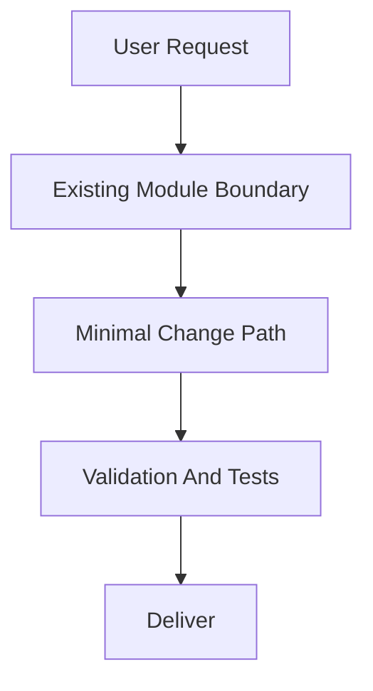
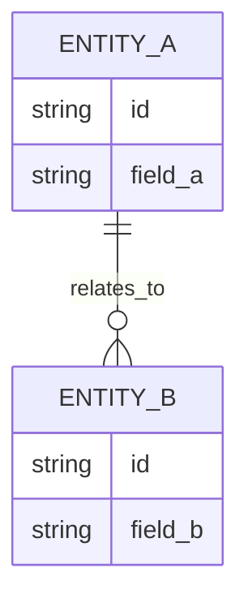

# PRD: [Feature Name]

## 1. Introduction & Goals

[Brief problem statement and feature objective.]

### Measurable Objectives
- [Objective 1]
- [Objective 2]
- [Objective 3]

---

## 2. Requirement Shape

- Actor: [Who needs this behavior]
- Trigger: [When the behavior happens]
- Expected behavior: [What the system should do]
- Scope boundary: [What this PRD does not cover]

---

## 3. Repository Context And Architecture Fit

- Existing path: [Closest current module or code path]
- Reuse candidates: [Files/modules to extend directly]
- Architecture pattern to preserve: [Relevant boundary or dependency direction]
- Constraints: [Runtime, dependency, coding standard, workflow, or rollout constraints]
- Redundancy risks: [Likely duplication or parallel abstraction risks]

---

## 4. Recommendation

### Recommended Approach
- Approach: [Extend the best existing path or justify the smallest necessary new piece]
- Why this is the best fit: [Why this best fits the current architecture]
- Rejected redundancy: [What extra layer, module, or dependency was intentionally avoided]

### Alternatives Considered (Only When Useful)
- Alternative: [Meaningful non-trivial alternative]
- Why not chosen: [Why it adds unnecessary risk, scope, or complexity]

---

## 5. Implementation Guide

This section is a living implementation guide based on current repository analysis. If implementation discovers additional affected files, hidden dependencies, edge cases, or a better path, update this PRD before proceeding.

### 5.1 Core Logic
- [How data and control move through the existing system]

### 5.2 Change Impact Tree

```text
.
├── [Layer]
│   └── [path/to/file]
│       [新增] / [修改] / [删除]
│       【总结】[One-sentence summary of the file-level change]
│
│       ├── [Concrete logical change 1; use symbol/config/route anchors, not line numbers]
│       ├── [Concrete logical change 2; include rg anchor when useful]
│       └── [Concrete logical change 3]
```

### 5.3 Executor Drift Guard

The file list above is the expected implementation surface from current repository analysis. During implementation, treat it as a starting point and use these repository searches to catch hidden references or drift before marking the PRD complete.

| Check | Command | Expected Result | If It Fails, Inspect First |
|---|---|---|---|
| [Legacy reference search] | `rg -n "[legacy-symbol-or-path]" [scope]` | [No obsolete references remain / only approved references remain] | [Config keys, build context, working directory, route, import, or docs area] |
| [Target reference search] | `rg -n "[new-symbol-or-path]" [scope]` | [Expected target references exist in the owning files] | [Composition root, entry command, generated config, or docs index] |
| [Hidden entry point search] | `rg -n "[command|env|artifact|route-pattern]" [scope]` | [No unreviewed entry points bypass the new target state] | [CI, scripts, Docker, deployment, README, IDE config] |

### 5.4 Flow Or Architecture Diagram



### 5.5 Low-Fidelity Prototype (Only When Required)

```text
+--------------------------------------------------+
| [Main Screen/Module Name]                        |
+--------------------------------------------------+
| [Section A]                                      |
| [Section B]                                      |
| [Section C]                                      |
+--------------------------------------------------+
```

If not required:
- No low-fidelity prototype required for this PRD.

### 5.6 ER Diagram (Only When Data Model Changes)



If not required:
- No data model changes in this PRD.

### 5.7 Realistic Validation Plan

| Behavior | Real Entry Point | Test Layer | Mock Boundary | Data/Env Needed | Command Or Procedure | Required For Acceptance |
|---|---|---|---|---|---|---|
| [changed behavior] | [API/CLI/UI/job/startup/migration/etc.] | [unit/integration/e2e/smoke/sandbox/manual] | [what is mocked vs real] | [fixtures/env/services] | `[exact command]` | Yes/No |

Failure triage:
- If `[high-friction command]` fails, inspect `[first config/path/boundary]` before changing implementation strategy.
- Treat production, vendor, or credential-dependent validation as `[opt-in/post-merge/blocking only if truly required]`.

If the change has no executable behavior:
- No executable behavior changes; realistic validation is limited to documentation/build checks.

### 5.8 Interactive Prototype Change Log (Only When Files Actually Changed)

| File Path | Change Type | Before | After | Why |
|---|---|---|---|---|
| `docs/prototypes/[feature]-demo.html` | Modify/Add | [Old behavior] | [New behavior] | [Reason] |

If no prototype changes:
- No interactive prototype file changes in this PRD.

### 5.9 External Validation (Only When Web Research Was Used)

| Topic | Source | Checked On | Relevant Finding | Impact On Recommendation |
|---|---|---|---|---|
| [Vendor/API/standard] | [URL or doc title] | [YYYY-MM-DD] | [Fact] | [Constraint or risk] |

If no external validation was needed:
- No external validation required; repository evidence was sufficient.

---

## 6. Definition Of Done

- [ ] Recommended approach is fully implemented without introducing unapproved parallel abstractions
- [ ] All Acceptance Checklist items are satisfied
- [ ] Relevant tests and validation commands pass
- [ ] Documentation and operational notes are updated where needed
- [ ] No open regression or rollout blocker remains

---

## 7. Acceptance Checklist

Use task-relevant groups. For architecture-heavy or refactor work, start with the groups below and rename or replace groups only when another grouping is more precise.
This checklist must validate the final target state, not only an interim first phase.

### Architecture Acceptance

- [ ] [Concrete boundary, directory, ownership, or entry-point outcome]
- [ ] [Concrete layering or composition-root outcome]

### Dependency Acceptance

- [ ] [Concrete import, port, adapter, or dependency-direction constraint]
- [ ] [Concrete contract-compatibility or forbidden-dependency constraint]

### Behavior Acceptance

- [ ] [Concrete API, workflow, runtime, or business behavior outcome]
- [ ] [Concrete compatibility or invariance that must remain true]

### Documentation Acceptance

- [ ] [Concrete doc page or reference updated to match the target design]
- [ ] [PRD and repository docs stay aligned with the final architecture direction]

### Validation Acceptance

- [ ] `[validation command]` passes
- [ ] `[real entry command]` exercises the changed behavior through `[API/CLI/UI/job/startup/migration]` without bypassing `[critical boundary]`
- [ ] `[rg search command]` confirms no legacy entry point, duplicate path, or compatibility shim remains
- [ ] `[rg search command]` confirms expected target references exist in the owning files

---

## 8. Functional Requirements

- FR-1: [Requirement statement]
- FR-2: [Requirement statement]
- FR-3: [Requirement statement]

---

## 9. Non-Goals

- [Out-of-scope item 1]
- [Out-of-scope item 2]

---

## 10. Risks And Follow-Ups

- [Unavoidable risk or explicitly approved non-blocking follow-up]

---

## 11. Decision Log

每条记录对应本 PRD 中做出的一个关键决策，归档后作为永久参考。

| # | 决策问题 | 选择 | 放弃的方案 | 理由 |
|---|---|---|---|---|
| D-01 | [决策问题，如"架构模式选择"] | [最终选择] | [放弃的方案] | [一句话说明为什么] |
