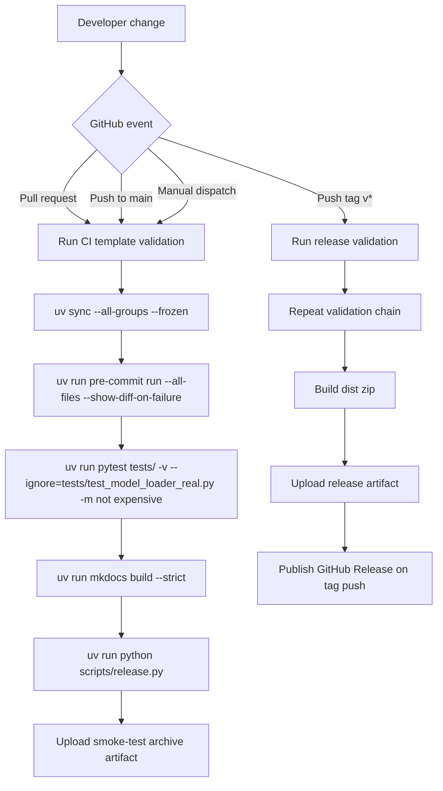

# PRD: GitHub Workflow Template Refactor

## 1. Introduction & Goals

Convert the copied `.github` automation into a reusable workflow template for this Python template registry and record the completed implementation as a technical PRD.

### Measurable Objectives
- Replace application-specific CI logic with repository-native validation steps.
- Replace Dokploy and private-registry deployment logic with GitHub-native release automation.
- Ensure workflow behavior matches the actual toolchain in this repository: `uv`, `pre-commit`, `pytest`, `mkdocs`, and `scripts/release.py`.
- Document the workflow contract for downstream repositories inheriting this template.
- Verify the implemented workflow behavior with local validation commands where sandbox constraints allow it.

---

## 2. Implementation Guide (Technical Specs)

### Tech Stack Analysis
- **Language/runtime:** Python 3.14 declared in `pyproject.toml`
- **Package and command tooling:** `uv`, `just`
- **Quality gates:** `pre-commit`, `pytest`
- **Documentation:** `mkdocs`, `mkdocs-material`, `mkdocstrings`
- **Release packaging:** `scripts/release.py` creates `dist/*.zip` from git-tracked files
- **Workflow scope:** GitHub Actions files under `.github/workflows/`

### Core Logic

The completed implementation changes the automation contract from “deploy a specific app stack” to “validate and package a Python project template.”

1. **CI event path**
   - Trigger on pull requests, pushes to `main`, and manual dispatch.
   - Install the declared Python runtime and `uv`.
   - Sync dependencies from the lock file.
   - Run `pre-commit` across the repository.
   - Run the local pytest selection that excludes real-model tests and expensive cases.
   - Run `mkdocs build --strict`.
   - Build a release zip as a smoke test and upload it as an artifact.

2. **Release event path**
   - Trigger on `v*` tag pushes and manual dispatch.
   - Repeat the same validation chain as CI to keep release publishing gated by identical quality checks.
   - Build the template release archive under `dist/`.
   - Upload the archive as a workflow artifact.
   - On tag pushes, publish a GitHub Release using the generated archive.

3. **Documentation alignment**
   - Update deployment guidance so the docs reflect the implemented GitHub Actions contract.
   - Remove the stale reference to a non-existent `just docs-build` command.

### Database / State Changes

No database, schema, or persistent application state changes are part of this work. The only state changes are GitHub Actions workflow definitions and documentation text.

### Affected Files

- `.github/workflows/ci.yml`
- `.github/workflows/cd.yml`
- `docs/guides/deployment.md`

### 2.1 Change Matrix

| Change Target | Current State | Target State | How to Modify | Affected Files |
|---|---|---|---|---|
| CI workflow contract | Copied CI referenced non-existent frontends, Dockerfiles, and `just lint` | Generic Python template CI validates this repository’s real toolchain | Replace the workflow with a single template-validation job that runs `uv sync`, `pre-commit`, local `pytest`, strict MkDocs build, and release smoke packaging | `.github/workflows/ci.yml` |
| Release workflow contract | Copied CD depended on Dokploy, private registry credentials, and app-specific images | GitHub-native release automation for a reusable template registry | Replace the deployment pipeline with a tag-driven archive build and GitHub Release publish flow | `.github/workflows/cd.yml` |
| Template documentation | Deployment guide referenced stale commands and lacked CI/CD template guidance | Docs describe actual workflow triggers, checks, and downstream customization points | Update the deployment guide to document `ci.yml`, `cd.yml`, `PYTHON_VERSION`, tag rules, and release behavior | `docs/guides/deployment.md` |

### 2.2 Flow Diagram



### 2.3 Low-Fidelity Prototype

```text
+---------------------------------------------------------------+
| GitHub Actions Template                                       |
+---------------------------------------------------------------+
| Event Layer                                                   |
|  - pull_request                                               |
|  - push main                                                  |
|  - push v* tag                                                |
|  - workflow_dispatch                                          |
+---------------------------------------------------------------+
| Validation Layer                                              |
|  [uv sync] -> [pre-commit] -> [pytest local] -> [mkdocs]      |
+---------------------------------------------------------------+
| Packaging Layer                                               |
|  [scripts/release.py] -> [dist/*.zip] -> [artifact upload]    |
+---------------------------------------------------------------+
| Publish Layer                                                 |
|  tag push only -> [GitHub Release]                            |
+---------------------------------------------------------------+
```

### 2.4 ER Diagram

No ER diagram is required in this PRD because no data model, database schema, or structured persistent state was changed.

### 2.5 Implementation Notes

- The workflow audience is downstream repositories cloned from this template.
- GitHub Release publishing remains enabled by default in the template, but downstream projects can remove or extend it.
- The implementation intentionally leaves moderate extension points for matrix expansion, package publishing, or extra job stages without introducing Node, Docker, or deployment assumptions.

### 2.6 Validation Evidence

Completed local verification for the implemented scope:

- `UV_CACHE_DIR=/tmp/uv-cache uv sync --all-groups --frozen`
- `UV_CACHE_DIR=/tmp/uv-cache uv run pytest tests/ -v --ignore=tests/test_model_loader_real.py -m "not expensive"`
- `UV_CACHE_DIR=/tmp/uv-cache uv run mkdocs build --strict`
- `UV_CACHE_DIR=/tmp/uv-cache uv run python scripts/release.py`
- Local YAML parsing for `.github/workflows/ci.yml` and `.github/workflows/cd.yml`

Validation caveat:

- `pre-commit run check-yaml` could not fully bootstrap in the local sandbox because fetching hook repositories from GitHub is network-blocked. The workflow itself remains valid for GitHub-hosted runners.

### 2.8 Interactive Prototype Change Log

No interactive prototype file changes in this PRD.

---

## 3. Global Definition of Done (DoD)

- [x] Typecheck and lint-equivalent quality checks pass for the implemented scope
- [x] Follows existing project coding and documentation standards
- [x] No regressions introduced into existing local test selection
- [x] Workflow YAML parses cleanly
- [x] Documentation reflects the implemented CI/CD template behavior

---

## 4. User Stories

### US-001: Replace Copied CI with Template Validation
**Description:** As a template maintainer, I want the CI workflow to validate the actual repository toolchain so that downstream repositories inherit a useful default pipeline.

**Acceptance Criteria:**
- [x] CI triggers on pull requests, `main`, and manual dispatch
- [x] CI runs `uv sync`, `pre-commit`, local `pytest`, strict MkDocs build, and release smoke packaging
- [x] CI no longer references non-existent frontend or Docker targets

### US-002: Replace App Deployment Logic with Release Automation
**Description:** As a template maintainer, I want the release workflow to package the template and publish a GitHub Release so that template distribution does not depend on private infrastructure.

**Acceptance Criteria:**
- [x] Release triggers on `v*` tag pushes and manual dispatch
- [x] Release reuses the same validation chain as CI
- [x] Release uploads the generated archive and publishes a GitHub Release on tag pushes
- [x] Release no longer references Dokploy, container images, or private registry credentials

### US-003: Document the Workflow Template Contract
**Description:** As a downstream template user, I want the deployment guide to explain the provided workflows so that I can adapt them safely without reverse-engineering the YAML.

**Acceptance Criteria:**
- [x] Deployment documentation describes both workflow files
- [x] The docs list the main downstream customization points
- [x] The docs use the correct strict MkDocs build command

---

## 5. Functional Requirements

### FR-1: CI Trigger Coverage
The template CI workflow MUST run on `pull_request`, pushes to `main`, and `workflow_dispatch`.

### FR-2: Release Trigger Coverage
The release workflow MUST run on pushes of tags matching `v*`, and it MAY also be executed through `workflow_dispatch`.

### FR-3: Repository-Native Validation
Both workflows MUST use the repository’s actual toolchain: `uv`, `pre-commit`, `pytest`, `mkdocs`, and `scripts/release.py`.

### FR-4: Deterministic Dependency Sync
Workflow dependency installation MUST use the lock file through `uv sync --all-groups --frozen`.

### FR-5: Safe Local Test Selection
Automated tests in the template MUST exclude `tests/test_model_loader_real.py` and expensive-only coverage from default CI execution.

### FR-6: Strict Documentation Validation
Automated docs validation MUST use `uv run mkdocs build --strict`.

### FR-7: Release Archive Build
Both workflows MUST verify that `scripts/release.py` produces a zip archive under `dist/`.

### FR-8: GitHub-Native Distribution
The release workflow MUST publish the generated archive through GitHub artifacts, and on tag pushes it MUST publish a GitHub Release.

### FR-9: Downstream Customization Clarity
Repository documentation MUST identify the main customization knobs for downstream consumers, including Python version, tag rules, test commands, and release behavior.

---

## 6. Non-Goals

- Reintroducing Docker image builds for non-existent services
- Reintroducing Dokploy deployment hooks or private registry publishing
- Defining a multi-language workflow framework for Node, Docker, or cloud deployment variants
- Adding UI, prototype, or browser-based review flows
- Changing application code, database schema, or runtime business logic outside workflow/docs alignment
