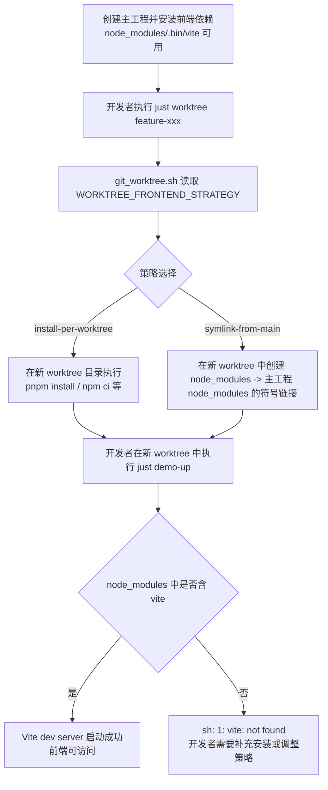
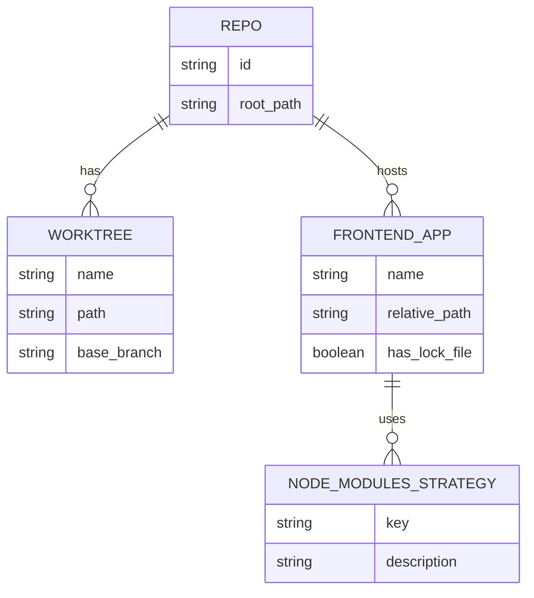

# PRD: Worktree 前端依赖策略（避免重复安装 Vite）

## 1. Introduction & Goals

在当前模板中，通过 `just worktree <branch>` / `scripts/git_worktree.sh` 创建新的 Git worktree 时，只复制代码与 `.env`，不会复制或复用主工程中的前端依赖目录 `node_modules`。
对于包含 Vite 前端（例如 `admin-frontend`）的仓库，新 worktree 中运行 `just demo-up` 或 `npm run dev` 时容易出现：

- `sh: 1: vite: not found`
- 或需要在每个 worktree 中重新执行 `pnpm install` / `npm install` / `yarn install`

本 PRD 目标是在保持模板通用性的前提下，为拥有前端工程的下游项目提供更高效且可配置的前端依赖策略，减少重复安装，并�� `just demo-up` 在新 worktree 中“开箱即用”。

### Measurable Objectives

- 新建 worktree 后，在存在前端工程的项目中，`just demo-up` 成功率显著提升（避免缺少 `vite`）。
- 将“每个 worktree 单独安装依赖”和“复用主工程 `node_modules`（符号链接）”两种策略显式化，并可通过环境变量/配置切换。
- 不破坏当前没有前端工程的仓库使用该模板时的行为（兼容无前端场景）。
- 在文档站点中提供可交互原型，直观展示两种策略对 `vite` 可用性的影响。

---

## 2. Implementation Guide (Technical Specs)

### 2.1 Project Context Analysis

- Tech stack:
  - 后端与基础工具：Python + `uv`（见 `pyproject.toml`、`justfile`）。
  - 文档系统：MkDocs + `mkdocs-material` + `mkdocstrings`（见 `mkdocs.yml`）。
  - Worktree 辅助脚本：`scripts/git_worktree.sh`、`scripts/git_worktree_merge.sh`，通过 `just worktree` 调用。
  - PRD 与原型规范：`docs/guides/prd-standard.md`、`docs/prototypes/index.md`、`docs/prototypes/assets/*`。
- Existing architecture pattern:
  - 所有 DX 能力统一走 `justfile` 与 `scripts/` 下的工具脚本。
  - Worktree 创建逻辑集中在 `scripts/git_worktree.sh`，负责：
    - 根据 `main` 创建新 worktree 目录。
    - 复制 `.env*` 文件到新目录。
    - 执行 `install_frontend_dependencies` 与 `install_python_dependencies` 的“极速模式”安装逻辑。
  - 原型页面统一放在 `docs/prototypes/`，样式与交互脚本复用 `assets/prototype.css` 与 `assets/prototype.js`。
- Constraints:
  - 模板本身不强制包含具体的前端工程目录结构（例如 `admin-frontend` 仅存在于下游项目）。
  - 需要兼容多种包管理器（`pnpm`、`npm`、`yarn`、`bun`），现有脚本已做检测（见 `install_frontend_dependencies` 函数）。
  - 不能强制在每次创建 worktree 时做高成本安装，下游团队希望尽量避免重复 `pnpm install`。

### 2.2 Change Matrix (Mandatory)

| Change Target | Current State | Target State | How to Modify | Affected Files |
|---|---|---|---|---|
| Worktree 创建时的前端依赖策略 | `scripts/git_worktree.sh` 中仅有 `install_frontend_dependencies`，在新 worktree 目录内执行锁文件驱动的安装（每个 worktree 可能都要跑一遍 `pnpm install` / `npm ci`）。 | 引入“依赖策略”概念：默认仍为“单独安装”，但支持配置为“复用主工程 `node_modules`（符号链接）”；当下游项目启用该策略时，新 worktree 自动指向主工程的 `node_modules`。 | 在 `scripts/git_worktree.sh` 中新增一个前端依赖策略选择函数（例如 `resolve_frontend_dependency_strategy`），以及 `setup_frontend_node_modules_links` 帮助函数：遍历仓库内的前端工程目录，若主工程存在 `node_modules` 且新 worktree 中尚无依赖，则在新 worktree 中创建指向主工程 `node_modules` 的符号链接。策略由环境变量（如 `WORKTREE_FRONTEND_STRATEGY`) 或配置文件控制。 | `scripts/git_worktree.sh` |
| 环境/配置层面的策略切换能力 | 当前没有针对 worktree 前端依赖的显式配置开关，下游项目要么接受默认的“极速安装”，要么手动在每个 worktree 自己处理 `node_modules`。 | 提供可配置的策略开关（环境变量优先）：如 `WORKTREE_FRONTEND_STRATEGY=install-per-worktree` / `symlink-from-main`，并在配置文件（如 `config.toml`）中给出默认值说明，保证下游项目可以在 CI 或本地开发中统一控制策略。 | 在 `scripts/git_worktree.sh` 中新增读取环境变量的逻辑（例如 `WORKTREE_FRONTEND_STRATEGY`），若为空则使用脚本内部默认策略；在 `docs` 下新增/更新一篇开发指南，说明如何配置该策略。可选地在 `config.toml` 中新增文档性配置段落（仅做说明，不强绑定运行期读取）。 | `scripts/git_worktree.sh`、`docs/dev/*` 或新增工作流指南文档 |
| 原型演示能力（worktree + frontend） | 目前只有通用的 PRD Demo 原型页面，未针对 worktree 与前端依赖策略提供专用可交互演示。 | 新增 `docs/prototypes/worktree-frontend-demo.html`，使用现有 `assets/prototype.css` / `assets/prototype.js`，提供两种策略（每个 worktree 单独安装 vs 复用主工程 `node_modules`）的切换，并通过时间线和状态标签展示 `just worktree` + `just demo-up` 的不同结果。 | 新建 HTML 原型文件，复用 CSS/JS 样式体系，提供 `Start/Reset` 类交互，使用按钮切换策略并更新“vite 是否可用”“node_modules 是否为符号链接”的可视化状态；在 `mkdocs.yml` 和 `docs/prototypes/index.md` 中挂载入口。 | `docs/prototypes/worktree-frontend-demo.html`、`mkdocs.yml`、`docs/prototypes/index.md` |

### 2.3 Core Logic Flow (Mandatory)



### 2.4 Low-Fidelity Prototype (Mandatory)

```text
+----------------------------------------------------------------------------------+
| Worktree 前端依赖策略 Demo                                                       |
+----------------------------------------------------------------------------------+
| [Header]                                                                         |
|   - Title: Worktree 前端依赖策略 Demo                                            |
|   - Links: [PRD 规范] [返回原型索引]                                             |
+----------------------------------------------------------------------------------+
| 左侧 Panel（控制区）                                                             |
|   [1. 选择依赖模式]                                                              |
|     (o) 每个 worktree 单独安装                                                   |
|     ( ) 复用主工程 node_modules                                                  |
|   [2. 模拟命令按钮]                                                              |
|     [① just worktree feature-frontend]                                          |
|     [② just demo-up] (初始禁用)                                                 |
|     [重置场景]                                                                   |
|                                                                                |
| 中间 Panel（状态区）                                                             |
|   Title: [还未创建 worktree / 已创建 / 成功 / 失败]                               |
|   Description: 当前阶段说明                                                      |
|   Progress bar: 0% -> 40% -> 70-100%                                             |
|   Pills:                                                                          |
|     - 策略：<当前策略>                                                            |
|     - vite: 未检查 / 可执行 / not found                                          |
|     - node_modules: 未创建 / 需要独立安装 / 符号链接到主工程                      |
|                                                                                |
| 右侧 Panel（时间线）                                                             |
|   [时间线列表]                                                                    |
|     - 准备阶段（Completed）                                                       |
|     - 创建 worktree（Completed / Pending）                                       |
|     - just demo-up 执行结果（成功 / 失败 / Blocked）                             |
+----------------------------------------------------------------------------------+
```

### 2.5 ER Diagram (Data Model)

本特性主要涉及工作目录与前端依赖目录之间的关系抽象，可以用逻辑上的 ER 图辅助理解（并非真实数据库表，但可用于后续若落地为配置持久化时的参考）。



### 2.6 Database/State Changes

- 逻辑层面：
  - 引入“前端依赖策略”的概念，可在脚本内部抽象为有限集合：`install-per-worktree` / `symlink-from-main`。
  - 若未来需要将策略持久化，可以映射到配置模型中的字段，例如：
    - `worktree.frontend_strategy: Literal["install-per-worktree", "symlink-from-main"]`
- 当前 PRD 不要求修改数据库模式或持久化存储，仅在脚本与配置层面实现策略切换。

结论：**No data model changes in this PRD.**（现阶段为运行时配置与脚本行为变更）

### 2.7 Affected Files (Predicted)

| File | Change Type | Description |
|---|---|---|
| `scripts/git_worktree.sh` | Modify | 引入前端依赖策略选择逻辑（解析 `WORKTREE_FRONTEND_STRATEGY`）、封装符号链接创建逻辑（遍历前端工程目录，为新 worktree 创建 `node_modules` 符号链接），并在原有 `install_frontend_dependencies` 调用前/后按策略执行。 |
| `config.toml` | Modify (optional, 文档型注释) | 在配置文件中新增注释性段落，说明 `WORKTREE_FRONTEND_STRATEGY` 可选值及推荐策略；不要求运行时直接读取该字段，主要用于帮助下游项目文档化。 |
| `docs/prototypes/worktree-frontend-demo.html` | Add | 新增用于演示“每个 worktree 单独安装 vs 复用主工程 node_modules”的可交互原型页面，展示 `just worktree` + `just demo-up` 在不同策略下的行为差异。 |
| `mkdocs.yml` | Modify | 在 `nav` 的 “原型演示” 部分新增“Worktree 前端依赖策略”入口，指向 `prototypes/worktree-frontend-demo.html`。 |
| `docs/prototypes/index.md` | Modify (optional) | 在原型索引中增加指向工作树前端依赖策略 Demo 的链接，方便评审从文档首页访问。 |
| `tasks/*-prd-worktree-frontend-deps.md` | Add | 本 PRD 文件（时间戳命名），作为该特性的需求与技术说明。 |

### 2.8 Interactive Prototype Change Log

| File Path | Change Type | Before | After | Why |
|---|---|---|---|---|
| `docs/prototypes/worktree-frontend-demo.html` | Add | 不存在对应的 worktree + 前端依赖策略原型页面。 | 新增原型页面，提供策略切换（单独安装 / 符号链接复用）、命令按钮（创建 worktree / 运行 just demo-up / 重置）以及状态与时间线展示。 | 让评审直观理解“为什么会出现 vite: not found”以及通过符号链接复用主工程 `node_modules` 的效果。 |
| `mkdocs.yml` | Modify | 原型演示导航中仅有通用 PRD Demo 入口。 | 在 “原型演示” 下增加 “Worktree 前端依赖策略” 子项，链接到新原型页面。 | 将新原型接入文档导航，确保在构建后的站点中可直接访问。 |

> Note: 本地执行 `uv run mkdocs build` 时当前环境返回 exit code 139（疑似环境/依赖问题），在真实项目环境中落地时，需要确保该命令在 PRD 实施后能够成功通过。

### 2.9 Interactive Prototype Link

- Prototype page: `docs/prototypes/worktree-frontend-demo.html`
- Index link: `docs/prototypes/index.md`

---

## 3. Global Definition of Done (DoD)

- [ ] `scripts/git_worktree.sh` 中新增的策略逻辑有单元测试或脚本级验证用例（例如在空仓库 / 存在前端工程仓库中各跑一遍）。
- [ ] 在包含前端工程的实际项目中，验证：
  - [ ] `WORKTREE_FRONTEND_STRATEGY=install-per-worktree` 时，新 worktree 中如果未安装前端依赖，运行 `just demo-up` 能明确暴露缺少依赖的问题。
  - [ ] `WORKTREE_FRONTEND_STRATEGY=symlink-from-main` 且主工程存在 `node_modules` 时，新 worktree 中的 `just demo-up` 能直接找到 `vite` 并启动 dev server。
- [ ] 在无前端工程的项目中，创建 worktree 不报错，不新增无意义的 `node_modules` 链接。
- [ ] 所有代码变更通过现有 `uv` / 测试脚本（包括 Python 端、脚本端的静态检查，如有）。
- [ ] 文档更新完成（包括本 PRD 与可能新增的开发指南章节）。
- [ ] `uv run mkdocs build` 在目标环境中执行成功，站点可正常访问新原型页面。

---

## 4. User Stories

### US-001: 开发者在带前端工程的仓库中使用 worktree

**Description:**
作为一个在单仓库中同时维护 Python 后端与 Vite 前端的开发者，我希望通过 `just worktree` 创建新分支 worktree 后，可以直接运行 `just demo-up` 启动前端，而不必在每个 worktree 中重复安装前端依赖。

**Acceptance Criteria:**
- [ ] 在主工程中完成一次前端依赖安装后，启用“符号链接复用”策略时，新建 worktree 的前端 dev server 能直接正常启动。
- [ ] 当主工程尚未安装前端依赖时，采��符号链接策略不会造成脚本崩溃，而是给出明确提示（例如记录在日志或控制台输出中）。

### US-002: 平台/模板维护者配置默认策略

**Description:**
作为模板维护者，我希望可以通过环境变量或配置文件控制默认的 worktree 前端依赖策略，以便在不同团队中选择“更安全”（每个 worktree 独立安装）或“更高效”（符号链接复用）的默认方案。

**Acceptance Criteria:**
- [ ] 可以在 CI 或本地 shell 中通过设置 `WORKTREE_FRONTEND_STRATEGY` 切换策略。
- [ ] 在未设置环境变量时，模板提供合理的默认策略，并在文档中明确说明。

### US-003: 评审人员在文档中理解策略差异

**Description:**
作为代码评审或需求评审人员，我希望在文档站点内通过交互原型直观理解不同前端依赖策略对 `just demo-up` 结果的影响，从而更容易评估该方案的价值与风险。

**Acceptance Criteria:**
- [ ] 原型页面展示两种策略下 `just worktree` 与 `just demo-up` 的关键状态差异。
- [ ] 原型中清晰标注 `vite: not found` 出现的场景与推荐的解决策略。

---

## 5. Functional Requirements

- FR-1: `scripts/git_worktree.sh` MUST support at least two frontend dependency strategies:
  - `install-per-worktree`（每个 worktree 单独安装依赖）；
  - `symlink-from-main`（复用主工程 `node_modules` 的符号链接）。
- FR-2: 当 `WORKTREE_FRONTEND_STRATEGY=symlink-from-main` 时，脚本 MUST：
  - 检测主工程是否存在前端工程目录（例如包含 `package.json` 且存在 `node_modules`）；
  - 在新 worktree 中为每个前端工程目录创建 `node_modules` 符号链接（若目标目录不存在或为空）；
  - 在无法创建符号链接时给出清晰的错误或降级提示（例如提示开发者手动安装）。
- FR-3: 当 `WORKTREE_FRONTEND_STRATEGY=install-per-worktree` 时，脚本 MUST 保持当前“极速安装”行为不变，但允许下游项目根据需要禁用该步骤（例如通过额外开关）。
- FR-4: 新增的原型页面 MUST：
  - 提供策略切换按钮；
  - 至少包含三个交互控件（例如 Start、Next/Run、Reset 按钮）；
  - 在不同策略下呈现明显不同的状态描述（特别是 `vite` 是否可用）。
- FR-5: 文档导航 MUST 包含指向新原型页面的入口，并通过 `uv run mkdocs build` 构建成功。

---

## 6. Non-Goals

- 本 PRD 不要求：
  - 为 Node 包管理器（`pnpm` / `npm` / `yarn` / `bun`）引入新的依赖管理工具，只复用现有脚本逻辑。
  - 实现复杂的多版本 `node_modules` 管理（例如为不同分支安装不同版本依赖）。
  - 在模板仓库内强制加入具体的前端目录结构（例如��定添加 `admin-frontend/` 目录）。
  - 处理跨磁盘分区或不支持符号链接的极端文件系统场景（此类场景可通过回退到 `install-per-worktree` 策略解决）。

本 PRD 专注于：通过可配置的 worktree 前端依赖策略与配套的文档/原型，使下游拥有 Vite 等前端工程的项目可以在不增加维护复杂度的前提下，显著减少“新 worktree 中前端依赖重复安装”的摩擦，并减少 `vite: not found` 这类问题的出现频率。
