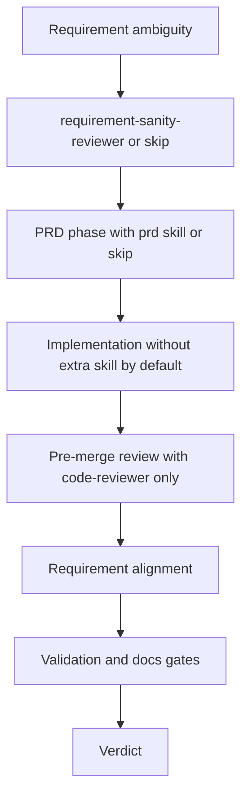

# PRD: Review Skill Delivery Gates Upgrade

## 1. Introduction & Goals

当前仓库中的 `skills/code-reviewer/SKILL.md` 已覆盖通用代码质量、安全、语言模式与部分 docstring 规范，但没有把以下交付风险纳入正式 review 流程：

- 实现是否符合 PRD、ticket 或用户需求
- 改动接口后是否有实际的接口级验证证据
- 是否执行了仓库标准验证命令，例如 `just lint`
- 代码改动后 `docs/`、`mkdocs.yml`、以及 `uv run mkdocs build` 是否同步通过

本 PRD 的目标是让 review skill 从“只看代码问题”升级为“检查交付完整性”，同时保持改动最小，优先扩展现有 `code-reviewer` 路径，而不是立即新增并行 skill 体系。

### Measurable Objectives

- 将需求对齐、接口验证证据、lint/docs 校验纳入 `code-reviewer` 的显式 review 流程
- 让 review 输出能够区分代码问题、需求偏差、验证缺口、文档同步问题
- 复用现有仓库命令和文档体系，不新增不必要的脚本、服务或依赖
- 定义 skill 生命周期，确保每个阶段默认只使用一个主 skill，而不是持续叠加新 skill

---

## 2. Requirement Shape

- Actor: 使用本仓库 skill 进行代码审查的 AI agent 或维护者
- Trigger: 调用 `code-reviewer` 审查已修改代码、PR、或最近提交时
- Expected behavior: reviewer 不仅检查代码质量，还要对照 PRD/需求、检查接口级验证证据、确认 `just lint` 与文档同步情况，并在输出中明确披露缺口
- Scope boundary: 本 PRD 只覆盖 review skill 与相关文档流程升级，不包含新增 CI 工作流、自动化接口测试框架重构、或强制实现新的脚本工具

---

## 3. Repository Context And Architecture Fit

- Existing path: [`skills/code-reviewer/SKILL.md`](../skills/code-reviewer/SKILL.md) 是最接近的现有路径，已经承担 review checklist 与输出格式职责
- Reuse candidates:
  - [`justfile`](../justfile) 已提供 `just lint`
  - [`docs/guides/prd-standard.md`](../docs/guides/prd-standard.md) 已定义 PRD 产出规范
  - [`mkdocs.yml`](../mkdocs.yml) 已有 guides 导航，可挂接 review 流程文档
- Architecture pattern to preserve:
  - skill 作为轻量操作指南，不承担复杂执行编排
  - 仓库标准命令通过 `just` 暴露，避免在 skill 中发明新的命令体系
  - 文档是代码库一等公民，流程更新应同步进入 `docs/`
- Constraints:
  - 现有 `code-reviewer` 已较长，新增内容必须保持结构清晰，避免变成无序的大清单
  - 技能说明应可执行，不能只写原则而无触发条件和输出要求
  - 文档变更需要兼顾 `mkdocs.yml` 导航与 `uv run mkdocs build`
- Redundancy risks:
  - 立即新增 `delivery-reviewer` 可能与现有 `code-reviewer` 形成职责重叠
  - 新增 `just review-check` 脚本若只包装已有命令，早期收益有限，可能先引入维护负担

---

## 4. Options And Recommendation

### Option A: Minimal Change

- Approach:
  - 直接扩展 `skills/code-reviewer/SKILL.md`
  - 在现有 review process 中新增四类检查：
    - Requirement alignment
    - Interface validation evidence
    - Repository validation commands
    - Docs synchronization
  - 补充一份简短的 review 流程文档并加入 MkDocs 导航
- Pros:
  - 与现有 skill 结构一致，学习成本最低
  - 复用 `just lint`、MkDocs 和 PRD 规范，不新增额外层次
  - 能最快解决当前遗漏项
- Cons:
  - `code-reviewer` 会进一步变长
  - 需求审计与代码审计仍在同一 skill 内，后续可能需要再拆分

### Option B: Deferred Split Path

- Approach:
  - 当前不实现新的 reviewer skill
  - 仅在未来 `code-reviewer` 超过维护阈值时，再拆出 repo-local 的 `delivery-reviewer`
  - 仅在团队需要稳定、重复运行统一验证集时，再补 `just review-check` 或 `scripts/review/premerge_check.sh`
- Pros:
  - 作为明确的未来拆分路线，保留演进空间
  - 避免现在就把多-skill 编排复杂度引入主流程
- Cons:
  - 不是当前可交付方案，不能直接解决眼前问题
  - 如果触发条件不清晰，后续仍可能重新滑向 skill 膨胀

### Recommendation

- Recommended option: A
- Why:
  - 现有最近路径就是 `skills/code-reviewer/SKILL.md`，且仓库已具备 `just lint`、MkDocs 文档结构和 PRD 标准，先增强现有 skill 能以最少改动填补真实缺口
  - 需求对照、接口验证证据、docs sync 虽然超出了传统纯代码 review，但仍属于合并前审查流程，可以先作为 `code-reviewer` 的 repository gate 来落地
  - review 阶段应保持单主-skill 入口，避免一个流程里叠加多个 reviewer skill
- Rejected redundancy:
  - 本阶段不新增 `delivery-reviewer`、不新增 `just review-check`，避免在问题尚可由现有 skill 承接时过早拆分并行体系
  - `Option B` 仅作为未来拆分条件，不作为当前实现目标

---

## 5. Implementation Guide

### 5.1 Core Logic

实现应基于现有 `code-reviewer` 流程，改造成以下顺序：

1. 收集代码变更上下文：`git diff --staged`、`git diff`、必要时读取最近提交
2. 收集需求上下文：优先查找对应 PRD、ticket、任务描述、用户请求
3. 提炼 acceptance criteria，并判断改动是否存在漏实现、偏实现、超范围实现
4. 按现有 checklist 检查安全、质量、语言模式、注释与 docstring 规范
5. 识别是否触及接口边界：
   - route / handler / controller
   - request / response schema
   - auth / permission / middleware
   - 数据写路径或外部集成
6. 若触及接口边界，检查是否存在接口级验证证据：
   - 自动化 API/integration test
   - TestClient / HTTP 级测试
   - 手动 `curl` / `httpie` / smoke 测试记录
   - e2e 覆盖
7. 检查是否执行仓库标准验证命令，并记录已运行、部分运行、未运行状态：
   - `just lint`
   - 相关测试
   - `uv run mkdocs build`
8. 检查代码改动是否要求同步更新：
   - `docs/`
   - `mkdocs.yml`
   - 示例命令、配置说明、docstring 或 API 文档
9. 输出 findings 时区分：
   - requirement gaps
   - code issues
   - validation gaps
   - docs sync gaps

### 5.2 Skill Lifecycle And Usage Policy

本次改造除补齐 review gate 外，还需要定义 skill 生命周期，防止同一流程持续堆叠 skill。

默认规则：

1. 一个阶段只允许一个主 skill。
2. 只有当前阶段的主 skill 无法覆盖职责时，才允许进入下一阶段或未来拆分。
3. 不因为“新增了一个重要检查项”就新增一个 skill；只有当职责已经独立成稳定阶段时才拆分。

阶段定义：

- Pre-planning:
  - Primary skill: `requirement-sanity-reviewer`
  - Entry condition: 需求本身存在歧义、冲突、信任边界不清、验收标准缺失
  - Exit artifact: 澄清后的需求假设、风险和边界
  - Do not combine with: 默认不与 `code-reviewer` 同阶段串用
- Planning:
  - Primary skill: `prd`
  - Entry condition: 需要形成可执行的技术方案或交付 PRD
  - Exit artifact: `tasks/[YYYYMMDD-HHMMSS]-prd-[feature-name].md`
  - Do not combine with: 默认不与 `code-reviewer` 同阶段串用
- Implementation:
  - Primary skill: 无
  - Entry condition: 需求和方案已明确，进入代码实现
  - Exit artifact: 代码改动、测试、文档更新
  - Do not combine with: 不默认引入额外 skill 打断主路径
- Pre-merge review:
  - Primary skill: `code-reviewer`
  - Entry condition: 代码已完成，准备做合并前审查
  - Exit artifact: review findings、severity verdict、requirement/validation/docs 状态
  - Do not combine with: 第二个 reviewer skill

未来拆分条件：

- 只有当 `code-reviewer` 明显过长、执行不稳定、或 requirement audit 与 code audit 已形成稳定的独立复用场景时，才允许启用 `Option B`
- 在触发前，不新增 `delivery-reviewer`

### 5.3 Change Matrix

| Change Target | Current State | Target State | How to Modify | Why This Fits Existing Architecture | Affected Files |
|---|---|---|---|---|---|
| Review process skeleton | 仅有 diff 收集、代码阅读、checklist、输出 | 增加 requirement alignment、validation evidence、docs sync 步骤 | 重写 `Review Process` 章节顺序与说明 | 直接扩展现有 skill 主入口，不引入新 skill | `skills/code-reviewer/SKILL.md` |
| PRD / 需求对照 | 未要求将实现与 PRD、ticket、用户需求逐条对照 | reviewer 必须先提炼 acceptance criteria，并报告漏实现或偏实现 | 新增 `Requirement Alignment` 章节与输出要求 | 复用仓库既有 PRD 流程和 `tasks/` 约定 | `skills/code-reviewer/SKILL.md` |
| 接口验证证据 | 只泛化检查 “Missing tests” | 对接口相关改动要求检查 interface-level verification evidence | 新增风险触发型 `Interface Validation` 检查 | 保持 review 为推理层，不强制引入新测试框架 | `skills/code-reviewer/SKILL.md` |
| Repository validation commands | 没有要求运行 `just lint`、`uv run mkdocs build` | 明确优先执行并披露验证状态 | 新增 `Validation Commands` 章节 | 复用 `justfile` 和现有开发工作流 | `skills/code-reviewer/SKILL.md`, `justfile` |
| Docs synchronization | 只检查 docstring，未检查 docs 导航和文档同步 | 对行为、接口、配置、命令变更要求同步检查 `docs/` 与 `mkdocs.yml` | 新增 `Docs Synchronization Checks` 章节 | 符合仓库“文档是一等公民”的现有约束 | `skills/code-reviewer/SKILL.md`, `docs/guides/review-workflow.md`, `mkdocs.yml` |
| Skill lifecycle policy | 缺少阶段化 skill 使用边界，容易在一个流程里持续叠加新 skill | 为需求、规划、实现、review 定义单主-skill 生命周期 | 新增 skill lifecycle 文档并在相关流程文档中引用 | 先约束流程，再扩展 skill，能抑制 skill 膨胀 | `docs/guides/skill-lifecycle.md`, `mkdocs.yml` |
| Review output contract | 只按 severity 输出代码问题 | 结论需包含 requirement / validation / docs 状态 | 调整 `Review Output Format` | 让 skill 输出更适合 merge 决策 | `skills/code-reviewer/SKILL.md` |

### 5.4 Flow Or Architecture Diagram

### 5.5 Low-Fidelity Prototype

- No low-fidelity prototype required for this PRD.

### 5.6 ER Diagram

- No data model changes in this PRD.

### 5.7 Affected Files

| File | Change Type | Description |
|---|---|---|
| `skills/code-reviewer/SKILL.md` | Modify | 扩展 review 流程、增加 requirement alignment、接口验证、validation commands、docs sync、输出格式 |
| `docs/guides/review-workflow.md` | Add | 记录本仓库推荐的 review 流程和验证证据要求 |
| `docs/guides/skill-lifecycle.md` | Add | 定义需求、规划、实现、review 四个阶段的主 skill 生命周期 |
| `mkdocs.yml` | Modify | 将 review workflow 文档纳入 guides 导航 |

### 5.8 Interactive Prototype Change Log

- No interactive prototype file changes in this PRD.

### 5.9 External Validation

- No external validation required; repository evidence was sufficient.

---

## 6. Definition Of Done

- [x] `skills/code-reviewer/SKILL.md` 明确包含 requirement alignment 检查
- [x] `skills/code-reviewer/SKILL.md` 明确包含 interface validation evidence 检查
- [x] `skills/code-reviewer/SKILL.md` 明确包含 `just lint`、相关测试、`uv run mkdocs build` 的验证状态要求
- [x] `skills/code-reviewer/SKILL.md` 明确包含 `docs/` 与 `mkdocs.yml` 同步检查
- [x] review 输出格式能够单独披露 requirement、validation、docs 三类缺口
- [x] 已定义并文档化 skill lifecycle，明确 review 阶段唯一主 skill 是 `code-reviewer`
- [x] 新增或更新的流程文档已进入 MkDocs 导航
- [x] `uv run mkdocs build` 通过
- [x] 改造后未新增并行 skill 或冗余脚本

---

## 7. User Stories

### US-001: 审查实现是否符合需求

**Description:** 作为维护者，我希望 reviewer 在看代码前先对照 PRD、ticket 或用户需求，这样可以更早发现漏实现、偏实现和 scope creep。

**Acceptance Criteria:**
- [x] review 过程要求先寻找需求依据
- [x] 若存在 PRD 或 ticket，review 输出能指出实现是否满足 acceptance criteria
- [x] 若不存在需求依据，review 输出明确说明仅完成代码层审查

### US-002: 审查接口改动是否有真实验证

**Description:** 作为维护者，我希望 reviewer 对接口相关改动要求实际验证证据，而不是只检查代码或单测是否“看起来没问题”。

**Acceptance Criteria:**
- [x] 当变更涉及接口边界时，reviewer 会检查是否有 API/integration/manual smoke evidence
- [x] 当缺少接口级验证证据时，review 输出将其标记为 validation gap
- [x] 非接口边界改动不会被机械性要求做接口测试

### US-003: 审查交付是否包含 lint 与 docs 同步

**Description:** 作为维护者，我希望 reviewer 将 `just lint`、文档更新和 `mkdocs build` 纳入结论，这样合并判断不再只依赖代码表面质量。

**Acceptance Criteria:**
- [x] reviewer 会优先检查 `just lint` 是否已运行
- [x] reviewer 会检查代码行为、接口、配置变更是否同步更新文档
- [x] reviewer 会披露 `uv run mkdocs build` 的运行状态或未运行原因

### US-004: 限制一个流程里的 skill 数量

**Description:** 作为维护者，我希望仓库明确 skill 生命周期和阶段边界，这样 agent 不会因为每出现一个新检查项就叠加更多 skill。

**Acceptance Criteria:**
- [x] 文档明确每个阶段默认只允许一个主 skill
- [x] review 阶段明确只有 `code-reviewer` 作为主 reviewer
- [x] `delivery-reviewer` 之类的拆分只作为未来条件，不作为当前流程的一部分

---

## 8. Functional Requirements

- FR-1: `code-reviewer` 必须在代码级 checklist 之前增加 requirement context 收集步骤。
- FR-2: `code-reviewer` 必须要求在存在 PRD、ticket、用户需求描述时提炼 acceptance criteria，并据此判断实现对齐情况。
- FR-3: `code-reviewer` 必须保留现有安全、质量、语言模式、注释与 docstring 检查能力。
- FR-4: `code-reviewer` 必须在变更触及接口边界时检查接口级验证证据。
- FR-5: `code-reviewer` 必须将缺失接口级验证证据作为显式 validation gap 报告，而不是只笼统报 “missing tests”。
- FR-6: `code-reviewer` 必须要求检查或披露 `just lint`、相关测试、`uv run mkdocs build` 的执行状态。
- FR-7: `code-reviewer` 必须检查行为、配置、接口或命令变更是否同步更新 `docs/`、`mkdocs.yml`、相关 docstring 或 API 文档。
- FR-8: review 输出必须区分 severity findings 与 requirement/validation/docs 状态。
- FR-9: 仓库必须文档化 skill 生命周期，明确需求、规划、实现、review 四个阶段的默认主 skill。
- FR-10: review 阶段必须明确 `code-reviewer` 是唯一主 reviewer skill。
- FR-11: 本次实现不得新增新的 reviewer skill 或脚本作为必需依赖。

---

## 9. Non-Goals

- 不在本 PRD 中引入新的 CI workflow 或强制 pre-merge pipeline
- 不在本 PRD 中要求所有改动都必须有自动化接口测试
- 不在本 PRD 中拆分出新的 `delivery-reviewer` skill
- 不在本 PRD 中新增 `just review-check` 或 `scripts/review/premerge_check.sh`
- 不在本 PRD 中设计多 reviewer 并行编排流程
- 不在本 PRD 中修改具体业务代码、API 实现或测试框架结构

---

## 10. Risks And Follow-Ups

- 风险：继续向 `code-reviewer` 添加规则可能使 skill 过长，触发上下文膨胀与执行不稳定。
- 风险：如果要求写得太绝对，agent 可能在无法运行命令时输出大量形式化免责文本，降低 review 可读性。
- 风险：需求对照若没有明确 PRD 或 ticket，review 结果会依赖用户对话上下文，稳定性略弱。
- Follow-up: 若后续 `code-reviewer` 明显超过可维护范围，可启用本 PRD 中的 `Option B`，将 requirement audit 和 validation gate 拆分为 repo-local `delivery-reviewer`。
- Follow-up: 若团队频繁需要统一执行 lint、tests、docs build，可在不改变单主 reviewer 生命周期的前提下，再补一个 `just review-check` 作为确定性执行入口。
