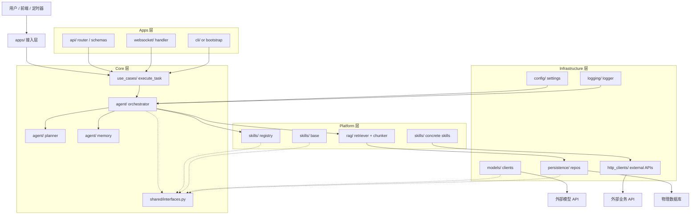

# 从模板到四层 Agent 平台的整洁架构重构 PRD

## 1. Introduction & Goals

当前仓库仍然是一个通用 Python 模板，但已经出现了 AI 模型加载、配置中心、日志能力和业务示例域等“可演进平台”的雏形。如果继续保持现在这种扁平化模板结构，后续一旦接入多模型、多技能、多任务编排和 RAG，代码会快速退化为难以测试、难以替换、难以边界控制的脚本集合。

本次变更的目标是直接将模板升级为一个可长期演进的 **四层模块化单体**，采用清晰的 Clean Architecture 边界：

- `apps/`: 请求接入层
- `core/`: 核心编排与业务规则层
- `platform/`: 技能与业务平台能力层
- `infrastructure/`: 外部系统与具体实现层

本项目遵循的架构原则是：

- **DDD 的边界意识**：按职责和变化率划分模块，而不是按技术堆叠代码。
- **Clean Architecture 的依赖方向**：依赖必须向内，核心业务不能反向依赖具体实现。
- **模块化单体**：保留一个仓库、一个部署单元，但内部结构按层解耦，方便逐步演进。

参考文章提供的是设计方向和结构示例，本 PRD 采用的是“参考其思想、结合本仓库现状做落地”的方式，而不是机械复制它的目录命名。

可衡量目标：

- 所有 AI 编排逻辑都能放入 `core/`，且不直接依赖 SDK、HTTP、数据库或文件系统。
- 所有具体模型、存储、HTTP 客户端、配置读取、日志输出都进入 `infrastructure/`。
- 所有 skill、RAG、注册表和可插拔能力都进入 `platform/`。
- 所有请求入口都进入 `apps/`，入口只负责参数校验、调用用例、返回结果。
- 现有模板文档、测试和运行方式同步升级，不再把当前结构描述成“松散工具集合”。

## 2. Requirement Shape

- Actor: 使用模板创建 AI Agent 平台的新项目开发者、后续架构维护者。
- Trigger: 项目需要支持多模型切换、复杂任务编排、动态 Skill、RAG、可测试的业务流。
- Expected behavior:
  - 业务编排与技术实现彻底分离。
  - 核心逻辑只依赖接口，不依赖具体 SDK。
  - 新增模型、技能、存储方式时，不需要修改核心编排。
  - 接入层与平台层之间通过用例和契约通信，而不是跨层直连。
- Scope boundary:
  - 本次是后端架构重构，不把仓库拆成微服务。
  - 不引入分布式消息系统。
  - 不重做前端 UI，若未来有前端，只作为 `apps/` 的消费者。
  - 不追求“兼容旧结构不动”的表面平滑，迁移期允许使用适配性 shim，但目标结构必须是四层分层。

## 3. Repository Context And Architecture Fit

### Current relevant modules/files

- `main.py`: 当前仅是入口示例，承载不了真实的依赖组装和应用生命周期。
- `utils/settings.py`: 当前是配置中心，但混合了通用基础设施职责，适合迁移到 `infrastructure/config/`。
- `utils/logger.py`: 当前是全局日志工具，适合迁移到 `infrastructure/logging/`。
- `ai_agent/utils/model_loader.py`: 当前同时承担配置加载、provider 推断、模型实例化，职责过重。
- `crawler/`: 当前是独立示例域，但尚未明确放在平台层还是示例层。
- `docs/architecture/system-design.md`: 当前架构文档仍停留在模块总览，不足以约束依赖方向。

### Architecture Reference

本次重构参考的外部设计思路为：

- **整洁架构（Clean Architecture）**
- **领域驱动设计（DDD）**
- **四层模块化单体（Apps / Core / Platform / Infrastructure）**

其中，文章中的层级命名和职责划分可作为可视化参考，但最终实现要以本仓库的运行方式、目录现状和迁移成本为准。

### Existing Path

当前最接近目标场景的路径是：

`main.py` -> `ai_agent/utils/model_loader.py` -> `utils/settings.py` -> `crawler/`

这条路径说明仓库已经拥有模板级基础，但也暴露出问题：

- 入口层和业务实现层边界不清。
- AI provider 适配逻辑和业务逻辑混杂。
- 配置与日志虽然可用，但没有被纳入明确的基础设施边界。
- `crawler/` 作为示例域存在，但没有被明确归类到平台能力或示例能力。

### Reuse Candidates

- `utils/settings.py`: 迁移为 `infrastructure/config/settings.py` 的基础实现，迁移期可保留兼容导出。
- `utils/logger.py`: 迁移为 `infrastructure/logging/logger.py` 的基础实现，迁移期可保留兼容导出。
- `ai_agent/utils/model_loader.py`: 可拆成 `core` 依赖的接口定义与 `infrastructure` 的 provider 工厂。
- `crawler/`: 可重定位到 `platform/ingestion/`、`platform/connectors/` 或独立 `examples/`，具体取决于其是否属于平台运行时能力。
- `docs/`: 用于同步记录边界、迁移原则和禁用规则。

### Architecture Constraints

- `core/` 中不得直接导入具体模型 SDK、数据库驱动、HTTP 客户端或文件系统实现。
- `apps/` 只能依赖 `core/` 暴露的用例与 DTO，不得直连 `platform/` 或 `infrastructure/`。
- `platform/` 只能实现 `core/` 定义的端口，不得反向污染 `core/`。
- `infrastructure/` 可以依赖外部 SDK，但不能引入业务编排逻辑。
- 迁移期允许旧路径保留一层兼容包装，但必须明确标注退场计划。

### Potential Redundancy Risks

- 如果仅在现有目录上“加标签”，会形成 `utils/`、`ai_agent/` 和新四层结构并存的双体系。
- 如果不把 `model_loader` 拆开，`core/` 与 `infrastructure/` 的边界会被持续侵蚀。
- 如果 `crawler/` 不重新归类，它会继续作为跨层示例污染架构感知。
- 如果不同时更新文档和测试，代码即使迁移成功，维护者也会继续按旧结构使用它。

## 4. Options And Recommendation

### Option A: Compatibility-First Retrofit

保留当前目录结构，只在命名和少量文件移动上做修补：

- 继续使用 `utils/` 和 `ai_agent/` 作为主要入口。
- 通过文档约束说明“哪些代码算 core，哪些算 infra”。
- 用少量适配器包装现有逻辑。

优点：

- 迁移成本短期最低。
- 对现有 import 影响较小。

缺点：

- 结构仍然混乱，长期维护成本高。
- 很难真正建立“禁止跨层依赖”的纪律。
- 会拖延真正的边界整理。

### Option B: Four-Layer Modular Monolith

直接建立文章中的四层架构，并把现有功能迁移到新边界：

- 新增 `apps/`
- 新增 `core/`
- 新增 `platform/`
- 新增 `infrastructure/`
- 将 `main.py` 收束为 composition root
- 将 `utils/` 逐步降级为迁移期兼容层或公共工具层

优点：

- 架构边界清晰，和目标方向一致。
- 更适合 AI Agent 平台后续扩展。
- 依赖方向可被工具和测试强制约束。
- 对多模型、多技能、多入口场景的表达力更强。

缺点：

- 需要一次性处理目录迁移和引用更新。
- 会引入短期迁移成本。
- 现有模板的“极简感”会下降，但这是为了换取可维护性。

### Recommendation

推荐 **Option B: Four-Layer Modular Monolith**。

理由：

- 这个仓库已经不只是“脚手架”，而是明显朝 AI Agent 平台方向演化。
- 继续沿用扁平模板结构，只会让未来的能力不断往 `ai_agent/` 和 `utils/` 里堆。
- 文章中的四层结构不是装饰性设计，而是为复杂 Agent 业务准备的边界控制手段。
- 现在重构的代价，远低于后面在业务增长后再补边界的代价。

## 5. Implementation Guide

### Core Logic

推荐的目标控制流：

1. `apps/` 接收 HTTP、WebSocket 或 CLI 请求，只做参数校验和调用。
2. `core/use_cases/` 暴露业务用例，例如 `execute_task`。
3. `core/agent/` 承担 Orchestrator、Planner、Memory 等编排逻辑。
4. `core/shared/interfaces.py` 定义 `ILLMInterface`、`ISkill`、`ISkillRegistry` 等端口。
5. `platform/` 提供 skill、RAG、registry 等平台能力，实现 `core` 契约。
6. `infrastructure/` 提供 OpenAI / DeepSeek 客户端、数据库、HTTP 客户端、配置和日志等具体实现。
7. `main.py` 仅做依赖注入组装，不承载业务规则。

### Target Architecture

### Migration Phases

#### Phase 1: Create Layer Skeleton

- 新增 `apps/`, `core/`, `platform/`, `infrastructure/` 目录。
- 在 `core/shared/interfaces.py` 定义端口契约。
- 把 `main.py` 改成纯组装入口。
- 给旧路径加兼容导出，避免迁移中断。

#### Phase 2: Move Core Logic

- 将业务编排逻辑从 `ai_agent/utils/model_loader.py` 和其他散点位置抽出到 `core/agent/`。
- 将模型选择、工具调用、记忆摘要等逻辑归入 `core/`。
- 将“业务规则”与“provider 实现”拆开。

#### Phase 3: Move Platform Capabilities

- 将 skill 注册表和具体 skill 挪入 `platform/skills/`。
- 将 RAG 检索与切片逻辑挪入 `platform/rag/`。
- 明确 `platform/` 只能实现 `core` 端口，不得反向掌控业务流程。

#### Phase 4: Move Infrastructure Implementations

- 将 `utils/settings.py` 迁移到 `infrastructure/config/settings.py`。
- 将 `utils/logger.py` 迁移到 `infrastructure/logging/logger.py`。
- 将 `ai_agent/utils/model_loader.py` 里和具体 SDK 相关的部分迁移到 `infrastructure/models/`。
- 将数据库、HTTP 客户端等外部实现统一放入 `infrastructure/`。

#### Phase 5: Retire Legacy Shims

- 删除旧的 `utils`/`ai_agent` 兼容包装，或者保留极薄的 re-export 层。
- 更新文档、测试和导入路径到新结构。

### Change Matrix

| Change Target | Current State | Target State | How to Modify | Why This Fits Existing Architecture | Affected Files |
|---|---|---|---|---|---|
| 入口层职责 | `main.py` 仅打印示例 | `main.py` 成为 composition root | 将启动、依赖注入、配置读取保留在最外层 | 入口已经存在，直接升级职责即可 | `main.py` |
| 应用接入层 | 当前没有独立 apps 层 | 新增 `apps/api`, `apps/websocket`, `apps/cli` | 将请求接入从业务逻辑中剥离 | 直接补齐缺失的接入边界 | `apps/*` |
| 核心编排层 | 编排逻辑混在 `ai_agent` 与工具模块中 | 新增 `core/agent`, `core/use_cases`, `core/shared` | 抽出 Orchestrator、Planner、Memory、Use Case | 现有 AI 相关能力可以自然迁移为核心层 | `core/*` |
| 平台能力层 | skill、RAG、注册表未形成独立边界 | 新增 `platform/skills`, `platform/rag` | 将工具插件、检索、注册表统一纳入平台层 | 平台能力属于可插拔生态，适合独立分层 | `platform/*` |
| 基础设施层 | `utils/settings.py`、`utils/logger.py`、SDK 客户端分散 | 新增 `infrastructure/config`, `infrastructure/logging`, `infrastructure/models`, `infrastructure/persistence`, `infrastructure/http_clients` | 将所有具体实现收束到基础设施层 | 让 core 只依赖端口，不依赖具体技术栈 | `infrastructure/*` |
| 模型加载职责 | `ai_agent/utils/model_loader.py` 同时做解析、推断、实例化 | provider factory + config loader + adapter 分离 | 将 SDK 构建迁移到 infrastructure，将接口定义上移到 core | 避免核心层与提供商强耦合 | `ai_agent/utils/model_loader.py`, `core/shared/interfaces.py`, `infrastructure/models/*` |
| 配置与日志 | 作为 `utils/` 公共工具存在 | 迁移到基础设施层并保留兼容期出口 | 先加 re-export，再逐步废弃旧路径 | 复用现有实现，避免重复造轮子 | `utils/settings.py`, `utils/logger.py`, `infrastructure/*` |
| 架构文档 | 只有模块总览，没有边界约束 | 文档明确四层、依赖方向、禁止事项、迁移步骤 | 更新系统设计页与入口文档 | 代码迁移必须伴随文档同步 | `docs/architecture/system-design.md`, `docs/index.md` |
| API 参考 | 只暴露现有模块 API | 暴露新分层下的公开 API | 调整 mkdocstrings 目录与模块引用 | 让文档结构与代码结构一致 | `docs/api/references.md` |
| 边界校验 | 没有架构 import 约束 | 增加导入边界检查 | 使用 `import-linter` 或等价测试 | 现有工具不足以强制跨层隔离 | `pyproject.toml`, `tests/*` |

### Affected Files

- `main.py`
- `apps/api/router.py`
- `apps/api/schemas.py`
- `apps/websocket/handler.py`
- `apps/cli.py`
- `core/shared/interfaces.py`
- `core/agent/orchestrator.py`
- `core/agent/planner.py`
- `core/agent/memory.py`
- `core/use_cases/execute_task.py`
- `platform/skills/base.py`
- `platform/skills/registry.py`
- `platform/skills/*.py`
- `platform/rag/retriever.py`
- `platform/rag/chunker.py`
- `infrastructure/config/settings.py`
- `infrastructure/logging/logger.py`
- `infrastructure/models/*.py`
- `infrastructure/persistence/*.py`
- `infrastructure/http_clients/*.py`
- `utils/settings.py`
- `utils/logger.py`
- `ai_agent/utils/model_loader.py`
- `docs/architecture/system-design.md`
- `docs/index.md`
- `docs/api/references.md`
- `pyproject.toml`
- `tests/*`

### Validation Plan

- 用单元测试验证 `core/` 不导入 `infrastructure/` 的具体实现。
- 用集成测试验证 `apps/` 能通过 `core/` 正常调用平台能力。
- 用文档构建检查验证新架构页和 API 参考页可正常生成。
- 用导入边界检查验证禁止跨层依赖的规则有效。

## 6. Definition Of Done

- 四层目录已建立，并与职责描述一致。
- `main.py` 仅负责应用组装。
- `core/` 不再直接依赖 SDK、DB、HTTP 或文件系统实现。
- `platform/` 与 `infrastructure/` 的职责边界明确，且不互相越权。
- `utils/` 和 `ai_agent/` 的旧职责已被迁移或降级为兼容层。
- 文档、测试和依赖声明已经同步更新。
- `uv run mkdocs build --strict` 通过。
- 关键单元测试和导入边界测试通过。

## 7. User Stories

- 作为模板使用者，我希望后续接入新的模型提供商时，只改基础设施层，不改核心编排。
- 作为维护者，我希望新增一个 Skill 时，只实现平台层契约，不触碰用例逻辑。
- 作为开发者，我希望可以单测业务编排，而不必真实调用外部模型或数据库。
- 作为架构负责人，我希望依赖方向能被目录、文档和测试共同约束。
- 作为未来接手者，我希望仓库结构本身就能告诉我每层该放什么。

## 8. Functional Requirements

- FR-1: `apps/` MUST only handle request ingress, validation, and use case dispatch.
- FR-2: `core/` MUST define use cases, orchestration, and contracts without importing concrete infrastructure.
- FR-3: `platform/` MUST implement reusable business capabilities such as skills and retrieval.
- FR-4: `infrastructure/` MUST host all concrete integrations, configuration, logging, and persistence.
- FR-5: `main.py` MUST act as the composition root and perform dependency injection only.
- FR-6: Legacy `utils/` and `ai_agent/` paths MAY remain temporarily as compatibility shims, but they MUST not remain the canonical architecture.
- FR-7: Architecture boundaries MUST be enforced through tests or import rules, not only by convention.
- FR-8: Documentation MUST describe the four-layer model and the migration path from the old template structure.

## 9. Non-Goals

- 不把这个模板改成微服务架构。
- 不把 `platform/` 设计成需要独立部署的“平台服务”。
- 不引入分布式任务队列作为本次默认目标。
- 不把前端重构作为当前主线。
- 不一次性删除所有旧模块；迁移期间允许薄兼容层存在。
- 不在这一轮同时解决所有业务领域的抽象问题，先把分层和边界做实。

## 10. Risks And Follow-Ups

### Risks

- 迁移期间会出现旧路径与新路径并存的短暂双体系。
- 如果兼容层保留过久，四层结构会被旧入口回流污染。
- 新目录会增加短期认知成本，但这是为了换取长期可维护性。
- 如果缺少 import 规则，四层结构会在实现阶段被重新打穿。

### Follow-Ups

- 为 `utils/` 与 `ai_agent/` 增加明确的废弃时间表。
- 用 `import-linter` 或同类工具建立跨层导入禁令。
- 根据真实业务需求再决定是否扩展 `platform/rag`、`platform/skills` 的细分子域。
- 在迁移完成后清理旧的兼容导出，避免双入口长期存在。
