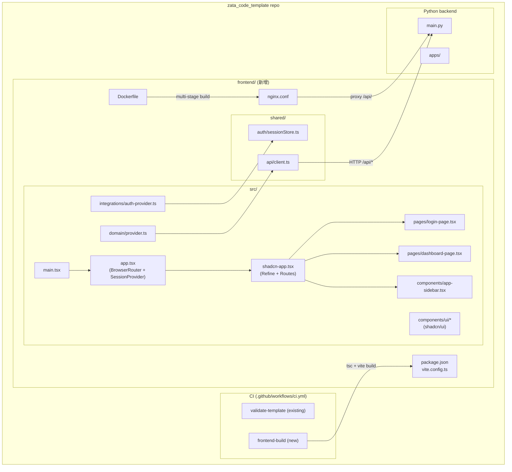

# PRD: Frontend Template Scaffold

**Feature:** frontend-template
**Date:** 2026-04-12
**Status:** Draft

---

## 1. Introduction & Goals

`zata_code_template` 是一个 Python 后端模板，目前没有前端。目标是在同一仓库中添加一个可复用的前端模板，以 `admin-frontend`（`/Users/zata/code/aibot/admin-frontend`）为参照框架，让未来从该模板派生的项目可直接拥有一个生产可用的前端起点。

**可衡量目标：**

1. `frontend/` 目录可以独立 `npm install && npm run dev` 启动。
2. 包含登录页、Sidebar 布局、Dashboard 占位页。
3. API 客户端通过 `/api/*` 代理转发到后端。
4. `npm run build` 产出静态资产，可通过附带的 `Dockerfile` + `nginx.conf` 部署。
5. CI 在 `frontend/**` 变更时执行 `tsc --noEmit` + `npm run build` 验证。

---

## 2. Requirement Shape

| 维度 | 描述 |
|---|---|
| **Actor** | 使用该模板衍生新项目的开发者 |
| **Trigger** | 开发者 `git clone` 或 `just copy` 模板后，需要一个可运行的前端脚手架 |
| **Expected Behavior** | `cd frontend && npm install && npm run dev` → 浏览器打开登录页；输入凭证后进入带侧边栏的 Dashboard |
| **Scope Boundary** | 仅交付脚手架骨架（登录 + Dashboard + API Client 占位）；不实现真实业务页面；不引入后端 API 真实认证逻辑 |

---

## 3. Repository Context And Architecture Fit

### 当前相关模块

| 路径 | 用途 |
|---|---|
| `tests/playwright-e2e/` | E2E 测试包，已有 `LoginPage.ts`，前端上线后可直接扩展 |
| `.github/workflows/ci.yml` | 现有 CI，仅 Python；需要加前端 job |
| `justfile` | 构建任务入口，可添加前端 recipes |
| `Dockerfile`（待添加） | 暂无，需要在 `frontend/` 下新建 |

### 参照框架分析（admin-frontend）

| 层 | 技术 | 版本 |
|---|---|---|
| 构建工具 | Vite | ^8.0 |
| 框架 | React + TypeScript | 19 / 6.x |
| 样式 | TailwindCSS v4 + shadcn/ui | ^4.2 |
| 路由 | React Router | ^7 |
| 数据层 | Refine + TanStack React Query | 5.x / 5.x |
| 认证 | 自定义 AuthProvider（Refine 接口） | — |
| 图标 | Lucide React + Tabler Icons | — |
| Toast | Sonner | — |
| 表单/校验 | Zod | — |
| 部署 | nginx + Docker multi-stage | — |

**目录约定（admin-frontend）：**

```
admin-frontend/          ← 根 workspace（npm scripts 代理）
  package.json           ← postinstall → studio/; dev/build → studio/
  studio/                ← 主 SPA 包
    src/
      app.tsx            ← BrowserRouter + SessionProvider
      main.tsx           ← ReactDOM.createRoot
      shadcn-admin/app.tsx ← Refine + Routes
      components/ui/     ← shadcn/ui 基础组件
      domain/            ← 数据提供者、资源定义、访问控制
      integrations/      ← 外部系统（auth-provider、data-provider）
      pages/             ← 页面组件（懒加载）
      lib/               ← 工具函数
      hooks/             ← 自定义 React hooks
  shared/                ← 跨 app 共享（API clients、auth store、types）
  Dockerfile             ← multi-stage build → nginx
  nginx.conf             ← /api/* 反代 + SPA fallback
```

### 架构约束

- 前端与 Python 后端**松耦合**：前端通过 `/api/*` HTTP 调用，无共享代码。
- 前端包放在仓库根的 `frontend/` 目录下，与 Python 层平级，保持模块边界。
- CI 前端 job 与 Python job **独立**，互不依赖。

---

## 4. Options And Recommendation

### Option A：Minimal Change — 单层 SPA（推荐）

在 `frontend/` 下建一个**单层 npm 包**（不嵌套 studio 子目录），直接包含 `src/`，保留与 admin-frontend 相同的技术栈，但去掉两层 workspace 的嵌套。

**理由：**
- 模板场景下只有一个前端 app，两层嵌套无收益。
- 减少 `npm --prefix` 转发复杂性。
- 直接 `cd frontend && npm run dev` 更简洁。
- 仍保留 `shared/` 目录约定作为 API 客户端存放位置（平级于 `src/`）。

**目录结构：**

```
frontend/
  package.json           ← 直接包含 dev/build/preview scripts
  vite.config.ts         ← 含 /api proxy
  tsconfig.json
  index.html
  components.json        ← shadcn/ui 配置
  .env.example
  Dockerfile
  nginx.conf
  shared/                ← API 客户端、auth store、类型定义
    api/
      client.ts          ← fetch 封装 + error 类
      types.ts
    auth/
      sessionStore.ts
  src/
    main.tsx
    app.tsx              ← BrowserRouter + SessionProvider
    index.css
    components/
      ui/                ← shadcn/ui 基础组件（button, input, card…）
      app-sidebar.tsx
      site-header.tsx
    domain/
      provider.ts        ← Refine dataProvider
      resources.ts       ← 资源定义（dashboard…）
    integrations/
      auth-provider.ts   ← Refine AuthProvider 实现
    pages/
      login-page.tsx
      dashboard-page.tsx
    lib/
      utils.ts           ← cn() 工具
    hooks/
      .gitkeep
```

### Option B：Heavy Change — 镜像两层 Workspace

完全复制 admin-frontend 的 `root → studio/` 两层 workspace 结构。

**为什么不推荐：**
- 模板只有一个前端 app，两层带来的隔离价值为零。
- 增加维护者理解成本。
- `npm --prefix studio` 转发反而是额外的间接层。

---

## 5. Implementation Guide

### 5.1 Core Logic

```
开发者请求 /         → login-page.tsx（若无 session）
登录成功             → AuthProvider.login() → sessionStore.set()
路由守卫检查          → RequireSession.tsx → Outlet
Dashboard 页面       → dataProvider.getList("dashboard") → 展示占位卡片
API 调用             → shared/api/client.ts → fetch(/api/...) → Vite proxy → 后端
生产构建             → npm run build → dist/ → nginx 静态服务 + /api/ 反代
```

### 5.2 Affected Files

| 文件路径 | 变更类型 |
|---|---|
| `frontend/package.json` | 新建 |
| `frontend/vite.config.ts` | 新建 |
| `frontend/tsconfig.json` | 新建 |
| `frontend/index.html` | 新建 |
| `frontend/components.json` | 新建（shadcn/ui） |
| `frontend/.env.example` | 新建 |
| `frontend/Dockerfile` | 新建 |
| `frontend/nginx.conf` | 新建 |
| `frontend/shared/api/client.ts` | 新建 |
| `frontend/shared/api/types.ts` | 新建 |
| `frontend/shared/auth/sessionStore.ts` | 新建 |
| `frontend/src/main.tsx` | 新建 |
| `frontend/src/app.tsx` | 新建 |
| `frontend/src/index.css` | 新建 |
| `frontend/src/components/ui/` | 新建（shadcn/ui 基础组件） |
| `frontend/src/components/app-sidebar.tsx` | 新建 |
| `frontend/src/domain/provider.ts` | 新建 |
| `frontend/src/domain/resources.ts` | 新建 |
| `frontend/src/integrations/auth-provider.ts` | 新建 |
| `frontend/src/pages/login-page.tsx` | 新建 |
| `frontend/src/pages/dashboard-page.tsx` | 新建 |
| `frontend/src/lib/utils.ts` | 新建 |
| `.github/workflows/ci.yml` | 修改（添加 frontend job） |
| `justfile` | 修改（添加 frontend recipes） |
| `.gitignore` | 修改（添加 `frontend/node_modules`、`frontend/dist`） |

### 5.3 Change Matrix

| Change Target | Current State | Target State | How to Modify | Why This Fits Existing Architecture | Affected Files |
|---|---|---|---|---|---|
| 前端目录 | 不存在 | `frontend/` 单层 SPA | 新建目录和文件 | 与 Python 层平级，保持边界清晰 | `frontend/**` |
| CI | 仅 Python job | 新增 `frontend-build` job（path filter） | 在 `ci.yml` 中添加独立 job | 现有 CI 已有 job 分离模式 | `.github/workflows/ci.yml` |
| justfile | Python recipes | 添加 `frontend-dev`、`frontend-build` | 追加 recipe | 符合现有 justfile 命名风格 | `justfile` |
| .gitignore | Python artifacts | 添加 `frontend/node_modules/`、`frontend/dist/` | 追加行 | 标准做法 | `.gitignore` |

### 5.4 Architecture Diagram



### 5.5 Low-Fidelity Prototype

**登录页：**

```
┌─────────────────────────────────┐
│                                 │
│         [Logo / App Name]       │
│                                 │
│   ┌─────────────────────────┐   │
│   │  用户名 / Email          │   │
│   └─────────────────────────┘   │
│   ┌─────────────────────────┐   │
│   │  密码                   │   │
│   └─────────────────────────┘   │
│   [         登录            ]   │
│                                 │
└─────────────────────────────────┘
```

**Dashboard（登录后）：**

```
┌──────────┬──────────────────────────────────┐
│          │  ☰  App Name        [User ▼]     │
│  Sidebar │──────────────────────────────────│
│          │                                  │
│ • Dashboard │  ┌──────┐ ┌──────┐ ┌──────┐  │
│ • ...    │  │ Card1 │ │ Card2 │ │ Card3 │  │
│          │  └──────┘ └──────┘ └──────┘  │
│          │                                  │
│          │  [Content Placeholder]           │
│          │                                  │
└──────────┴──────────────────────────────────┘
```

---

## 6. Definition of Done

- [ ] `cd frontend && npm install && npm run dev` 成功启动，浏览器可访问登录页
- [ ] 登录页渲染正常（含 Email + Password 字段、Submit 按钮）
- [ ] 登录后跳转至 Dashboard，Sidebar 显示导航项
- [ ] `npm run build` 无 TypeScript 错误，产出 `dist/`
- [ ] `docker build -t frontend-template .`（在 `frontend/` 下）构建成功
- [ ] CI `frontend-build` job 在 `frontend/**` 变更时触发并通过
- [ ] `.gitignore` 已更新，`node_modules/` 和 `dist/` 不被追踪
- [ ] `justfile` 添加 `frontend-dev` 和 `frontend-build` recipes

---

## 7. User Stories

1. **作为模板使用者**，我希望 `cd frontend && npm install && npm run dev` 即可看到登录页，无需额外配置。
2. **作为模板使用者**，我希望 API 请求自动代理到 `/api/*`，这样开发时不需要处理 CORS。
3. **作为模板维护者**，我希望 CI 能自动验证前端构建，避免提交破坏性变更。
4. **作为部署者**，我希望通过 Docker 构建一个包含 nginx 的镜像，直接服务静态资产并反代 API。

---

## 8. Functional Requirements

- **FR-1** `frontend/` 目录必须包含完整的 `package.json`，执行 `npm install` 后可独立运行。
- **FR-2** `vite.config.ts` 必须配置 `/api` 开发代理，指向 `http://localhost:8000`（可通过 `.env` 覆盖）。
- **FR-3** 登录页必须通过 Refine `AuthProvider.login()` 提交凭证，成功后重定向到 `/dashboard`。
- **FR-4** `RequireSession` 路由守卫必须保护所有非 `/login` 路由，未认证时重定向到 `/login`。
- **FR-5** `shared/api/client.ts` 必须封装 `fetch`，统一处理 `4xx/5xx` 错误为 `ApiRequestError`。
- **FR-6** 生产 Dockerfile 使用 multi-stage build：`node:22-alpine` 构建，`nginx:stable-alpine` 服务。
- **FR-7** `nginx.conf` 配置 `/api/` 反代（默认上游 `http://backend:8000/`）和 SPA fallback。
- **FR-8** CI 新增 `frontend-build` job，仅在 `frontend/**` 路径变更时触发，执行 `tsc --noEmit` + `npm run build`。

---

## 9. Non-Goals

- **不实现真实后端认证**：`auth-provider.ts` 中的 API 调用为占位，模板用户自行替换。
- **不添加真实业务页面**：Dashboard 仅展示占位卡片。
- **不配置 CD**：部署流程由模板用户根据自身基础设施决定。
- **不引入状态管理库**（如 Zustand/Redux）：TanStack Query 已满足服务端状态需求。
- **不添加 i18n**：国际化由派生项目自行决定。
- **不修改 Python 层代码**：前端与后端完全解耦。

---

## 10. Risks And Follow-Ups

| 风险 | 影响 | 缓解措施 |
|---|---|---|
| Vite 8 / React 19 / TailwindCSS 4 均为最新版，可能有 API 变化 | 构建失败 | 锁定 `package-lock.json`，CI 验证 |
| shadcn/ui 组件需要手动通过 CLI 初始化 | 模板实现复杂度 | 在实现阶段直接复制 admin-frontend 的 `components/ui/` 文件，注明来源 |
| Playwright e2e 测试需要同步更新 | 测试覆盖缺口 | 后续 PRD 扩展 tests/playwright-e2e 的 LoginPage + DashboardPage 覆盖 |
| CI path filter 依赖 GitHub 的 `paths` 触发器 | 若 CI 全量跑会变慢 | 已在设计中使用 `paths: ['frontend/**']` 过滤 |

---

## Appendix

### 关键依赖版本（参照 admin-frontend）

```json
{
  "react": "^19.2.4",
  "react-dom": "^19.2.4",
  "react-router": "^7.13.2",
  "@refinedev/core": "^5.0.11",
  "@refinedev/react-router": "^2.0.4",
  "@tanstack/react-query": "^5.95.2",
  "tailwindcss": "^4.2.2",
  "@tailwindcss/vite": "^4.2.2",
  "lucide-react": "^1.7.0",
  "sonner": "^2.0.7",
  "zod": "^4.3.6",
  "vite": "^8.0.3",
  "typescript": "^6.0.2"
}
```

### No data model changes in this PRD.

### No external validation required; repository evidence was sufficient.

### No interactive prototype file changes in this PRD.
