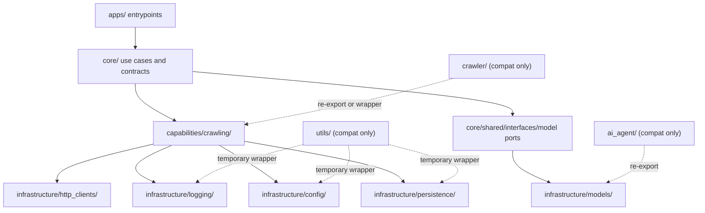

# PRD: Legacy Directory Architecture Alignment

## 1. Introduction & Goals

当前仓库已经定义了 `apps/ -> core/ -> capabilities/ -> infrastructure/` 的四层架构，但 `utils/`、`ai_agent/` 与 `crawler/` 仍以迁移期目录的形式存在，并继续暴露出旧式目录边界。该 PRD 的目标是把这三个目录从“可暂存的遗留目录”收敛为“符合当前架构的正式落点”，并在迁移完成后删除旧目录。

目标：

- 停止把 `utils/`、`ai_agent/` 与 `crawler/` 作为正式架构扩展点。
- 将 `utils/` 中的配置、日志、数据库与通用基础实现迁入 `infrastructure/` 对应子目录。
- 将 `ai_agent/` 中与模型装配相关的职责迁入 `infrastructure/models/`。
- 将 `crawler/` 明确收敛为正式平台能力目录 `capabilities/crawling/`，并把基础设施依赖下沉到 `infrastructure/`。
- 在迁移期允许短暂兼容导出，迁移完成后删除 `utils/`、`ai_agent/` 与 `crawler/` 目录。
- 更新文档与测试，使仓库叙事与代码落点一致。

## 2. Requirement Shape

- actor: 仓库维护者
- trigger: 维护者需要判断并修正 `utils/`、`ai_agent/`、`crawler/` 的目录命名和职责落点，使其与现有四层架构一致
- expected behavior: 代码职责被迁移到正式架构目录；旧目录不再作为新增代码入口；兼容导出仍允许旧测试和旧调用在迁移期运行
- explicit scope boundary: 本 PRD 仅处理目录职责归位、兼容迁移、文档与测试调整，不引入新的业务能力，不重写 Agent 业务流程，不新增外部依赖

## 3. Repository Context And Architecture Fit

### Current Relevant Modules / Files

- `docs/architecture/system-design.md`
- `utils/settings.py`
- `utils/logger.py`
- `utils/database.py`
- `utils/helpers.py`
- `ai_agent/utils/model_loader.py`
- `ai_agent/utils/models.json`
- `tests/test_model_loader_config.py`
- `tests/test_model_loader_real.py`
- `infrastructure/models/__init__.py`
- `crawler/core/crawler.py`
- `crawler/models/database.py`
- `crawler/utils/proxy_manager.py`
- `crawler/environment.py`
- `crawler/README.md`

### Existing Path

- `utils/` 的最近正式承接路径是 `infrastructure/config/`、`infrastructure/logging/`、`infrastructure/persistence/`
- `ai_agent/` 的最近正式承接路径是 `infrastructure/models/`
- `crawler/` 的最近正式承接路径是 `capabilities/`，其数据库、HTTP、日志、配置等实现应分别落到 `infrastructure/`

### Reuse Candidates

- `infrastructure/config/` 可承接当前 `utils/settings.py`
- `infrastructure/logging/` 可承接当前 `utils/logger.py`
- `infrastructure/persistence/` 可承接当前 `utils/database.py`
- `infrastructure/models/` 已明确声明将承接 `ai_agent/utils/model_loader.py` 的职责
- `core/shared/interfaces/` 可作为爬虫能力需要的抽象端口落点
- `infrastructure/http_clients/` 可承接 HTTP 与代理适配
- `infrastructure/persistence/` 可承接爬虫数据持久化
- `infrastructure/logging/` 与 `infrastructure/config/` 可承接当前 `crawler` 对 `utils.*` 的直接依赖

### Existing Architecture Pattern To Follow

- `apps/` 只做接入，不写业务规则
- `core/` 负责用例、编排与契约，不依赖具体 SDK
- `capabilities/` 实现 `core/` 定义的能力接口
- `infrastructure/` 实现模型客户端、数据库、HTTP、日志、配置等具体细节

### Ownership And Dependency Boundaries

- `utils/settings.py`、`utils/logger.py`、`utils/database.py` 当前仍是仓库内多个模块的基础依赖入口，但这些职责本质上都属于 `infrastructure/`
- `ai_agent/utils/model_loader.py` 直接依赖 `langchain_openai`、`langchain_anthropic` 与 `.env` 加载逻辑，这些职责属于 `infrastructure/`
- `crawler/core/crawler.py` 在抽象基类中直接依赖 `utils.settings`、`utils.logger`，同时又内嵌 `requests`、`DrissionPage` 的具体实现，已经跨越 `core`、`capabilities`、`infrastructure` 多层
- `crawler/models/database.py` 直接依赖 `utils.database.Base`，属于持久化实现，不应放在独立顶级目录的 `models/`

### Constraints From Runtime, Docs, Tests, Or Workflows

- 仓库文档已明确 `utils/`、`ai_agent/`、`crawler/` 是迁移期目录，不应继续作为最终架构
- 文档要求：业务逻辑、函数签名、配置变化必须同步更新 `docs/`
- 现有测试仍直接 import `ai_agent.utils.model_loader`
- 仓库内仍有代码直接 import `utils.*`
- 新代码不得继续写入 `utils/`、`ai_agent/`、`crawler/` 作为最终落点

### Architecture Constraints

- 不允许把新的正式能力继续沉积到 `utils/`
- 不允许把新的正式能力继续沉积到 `ai_agent/` 或 `crawler/`
- 不允许 `core/` 直接依赖具体 HTTP 客户端、浏览器自动化库、数据库 Base、日志器或配置实现
- 跨层依赖必须通过 `core/shared/interfaces/` 中的抽象接口表达

### Potential Redundancy Risks

- 如果在 `infrastructure/` 外继续保留 `utils/` 作为实际实现入口，会形成“双入口”
- 在 `ai_agent/` 外再复制一套模型装配逻辑，会形成“双实现”
- 在 `crawler/` 内继续保留 `core/models/utils` 的子架构，会与仓库顶层四层架构并存，形成“架构套架构”
- 如果直接新建 `capabilities/crawling/` 但不清理旧 `crawler/` 导入，会形成双入口、双维护成本

## 4. Options And Recommendation

### Option A: Minimal Change

以“迁移后删除旧目录”为终态，在过渡阶段短暂保留 `utils/`、`ai_agent/` 与 `crawler/` 作为兼容目录，但停止新增正式代码进入这三个目录。将职责逐步归位：

- `utils` 中的配置、日志、数据库和通用基础实现迁入 `infrastructure/`
- `ai_agent` 中的模型装配与配置解析迁入 `infrastructure/models/`
- `crawler` 中的能力抽象与执行入口迁入 `capabilities/crawling/`
- `crawler` 的配置、日志、HTTP、浏览器、持久化适配迁入 `infrastructure/`
- 旧目录只在迁移窗口内保留 re-export、过渡导入、弃用说明，最终删除

优点：

- 变更最小，适配现有测试和导入路径
- 符合文档中“先保持兼容导出，再逐步清理旧路径”的迁移策略
- 能快速停止遗留目录继续扩张

代价：

- 迁移窗口内会暂时存在新旧两套路由
- 需要明确 deprecation 边界，避免继续写错地方

### Option B: Heavier Change

一次性删除 `ai_agent/` 与 `crawler/` 顶级目录，并对所有测试、文档、示例、调用路径做全量重命名和重导入调整。

优点：

- 目录结构立刻变干净
- 不存在兼容层维护成本

代价：

- 回归面大
- 容易一次性打断现有测试与外部脚本
- 在没有先建立稳定新路径前，会放大迁移风险

### Recommendation

推荐 **Option A: Minimal Change**。

理由：

- 仓库文档已经明确这两个目录是迁移期兼容目录，最自然的做法不是“直接硬删”，而是“停止扩张 + 建立正式路径 + 保留过渡导出”
- `utils/` 中的大部分内容都能直接映射到现有 `infrastructure/` 子目录，不需要新增顶级抽象
- `infrastructure/models/__init__.py` 已经给出 `ai_agent` 的明确承接方向
- `crawler/` 当前混合了抽象、执行、数据库、代理、日志依赖；在未先拆职责前直接全量删除，风险高于收益

### Rationale For Rejecting Redundant Abstractions

- 不再保留 `utils/` 作为长期正式入口，因为它只是历史杂项目录，不对应四层中的任何一层
- 不新增 `agents/`、`services/`、`engines/` 等新的顶级目录，因为仓库已有 `core/`、`capabilities/`、`infrastructure/`
- 不保留 `crawler/core` 这种二级子架构命名，因为它重复表达了仓库已存在的 `core/`
- 不再把模型客户端留在 `ai_agent/utils/`，因为 `infrastructure/models/` 已是现成承接点

## 5. Implementation Guide

### Core Logic

本次变更的核心不是改业务功能，而是修正职责落点与依赖方向，并清除遗留顶级目录。

- `utils` 路线：
  `utils/settings.py`、`utils/logger.py`、`utils/database.py`、`utils/helpers.py` 的正式职责迁入 `infrastructure/` 对应子目录；仓内 import 切换完成后删除 `utils/`。
- `ai_agent` 路线：
  `ai_agent/utils/model_loader.py` 的模型配置读取、provider 推断、SDK 实例化迁入 `infrastructure/models/`；旧路径保留兼容导出，并逐步让测试改为引用新路径。
- `crawler` 路线：
  把“爬虫能力”定义为平台能力，正式目录落到 `capabilities/crawling/`；把 HTTP、浏览器、代理、日志、配置、数据库等具体实现下沉到 `infrastructure/`；如需要跨层调用，先在 `core/shared/interfaces/` 定义抽象接口。

### Affected Files

预计涉及：

- `docs/architecture/system-design.md`
- `docs/` 下与目录结构、模型加载、爬虫能力相关的说明页
- `infrastructure/config/`
- `infrastructure/logging/`
- `infrastructure/persistence/`
- `infrastructure/models/__init__.py`
- `infrastructure/models/clients.py` 或同类新文件
- `capabilities/crawling/` 下的新能力模块
- `core/shared/interfaces/` 下新增的能力端口
- `infrastructure/http_clients/` 下的爬虫 HTTP / 代理适配
- `infrastructure/persistence/` 下的爬虫持久化适配
- `utils/settings.py`
- `utils/logger.py`
- `utils/database.py`
- `utils/helpers.py`
- `ai_agent/utils/__init__.py`
- `ai_agent/utils/model_loader.py`
- `crawler/__init__.py`
- `crawler/core/crawler.py`
- `crawler/models/database.py`
- `crawler/utils/proxy_manager.py`
- `tests/test_model_loader_config.py`
- `tests/test_model_loader_real.py`

### Change Matrix

| Change Target | Current State | Target State | How to Modify | Why This Fits Existing Architecture | Affected Files |
|---|---|---|---|---|---|
| `utils/` 顶级目录定位 | 迁移期目录，但仍承载配置、日志、数据库等正式基础设施职责 | 正式职责归位到 `infrastructure/`，旧目录删除 | 将配置、日志、数据库、通用基础实现迁入 `infrastructure/*`，切换 import 后删除 `utils/` | `utils/` 不属于四层中的任何正式层，继续保留只会维持历史杂项入口 | `utils/settings.py`, `utils/logger.py`, `utils/database.py`, `utils/helpers.py`, `infrastructure/*` |
| `ai_agent/` 顶级目录定位 | 迁移期目录，但仍承载正式模型装配逻辑 | 仅保留兼容出口，不再承载正式实现 | 把正式实现迁入 `infrastructure/models/`，旧路径改为 re-export | 模型客户端与 provider 装配属于基础设施层 | `ai_agent/utils/model_loader.py`, `infrastructure/models/*`, `tests/test_model_loader_*` |
| 模型加载职责 | 直接在 `ai_agent/utils/` 中实例化具体 SDK | 基础设施层统一承接模型装配 | 新增或扩展 `infrastructure/models/`，迁移配置读取与客户端构造 | 避免遗留目录继续承担正式职责 | `infrastructure/models/__init__.py`, `ai_agent/utils/model_loader.py` |
| `crawler/` 顶级目录定位 | 自成体系的 legacy 子模块 | 正式能力归位到 `capabilities/crawling/` | 抽离能力入口与适配器，旧目录只保留兼容导出或示例说明 | 平台能力应进入 `capabilities/`，不能再并行维护一套顶级子架构 | `crawler/*`, `capabilities/crawling/*` |
| 爬虫抽象与执行 | `crawler/core/crawler.py` 同时包含抽象和具体实现 | 抽象端口在 `core/shared/interfaces/`，能力实现进入 `capabilities/` | 提取接口，移动具体爬虫能力实现 | 避免 `core` 直接依赖浏览器、HTTP、日志和配置实现 | `crawler/core/crawler.py`, `core/shared/interfaces/*`, `capabilities/crawling/*` |
| 爬虫基础设施依赖 | `crawler` 直接 import `utils.settings`、`utils.logger`、`utils.database` | 日志、配置、HTTP、数据库统一放入 `infrastructure/` | 为爬虫适配器提供基础设施实现；消除对 `utils.*` 的直接依赖 | 保持依赖向内，基础设施职责集中 | `crawler/models/database.py`, `crawler/utils/proxy_manager.py`, `infrastructure/*` |
| 文档与测试 | 文档已说明迁移方向，但代码路径仍未对齐；测试仍指向旧路径 | 文档、测试、代码叙事一致 | 更新架构文档、模块文档和测试导入路径 | 防止“文档说一套，代码还是另一套” | `docs/*`, `tests/*` |

### Flow / Architecture Diagram

### Low-Fidelity Prototype

不适用。本 PRD 不涉及 UI 行为设计。

### ER Diagram

No data model changes in this PRD.

### Interactive Prototype Change Log

No interactive prototype file changes in this PRD.

### External Validation

未使用外部资料。本 PRD 仅基于仓库当前代码与架构文档。

## 6. Definition Of Done

- `utils/` 不再承载新的正式实现，相关职责已迁入 `infrastructure/`
- `ai_agent/` 不再承载新的正式实现，相关职责已迁入 `infrastructure/models/`
- `crawler/` 不再作为正式能力的新增目录；正式爬虫能力已落在 `capabilities/crawling/`
- `crawler` 对 `utils.settings`、`utils.logger`、`utils.database` 的直接依赖被移除或包裹到兼容层
- 旧导入路径只在迁移窗口内可工作，且带有明确弃用说明
- 架构文档、模块文档、README、测试路径同步更新
- 本地验证通过：相关单测通过，文档构建通过，未新增反向依赖
- 迁移完成后，`utils/`、`ai_agent/` 与 `crawler/` 顶级目录被删除

## 7. User Stories

- 作为仓库维护者，我希望一级目录命名直接反映当前四层架构，这样后续开发不会继续把新代码写进遗留目录。
- 作为仓库维护者，我希望 `utils` 中的配置、日志和数据库能力进入 `infrastructure/`，这样基础设施实现有单一权威入口。
- 作为仓库维护者，我希望 `ai_agent` 相关模型装配逻辑进入正式基础设施层，这样模型客户端实现只有一个权威位置。
- 作为仓库维护者，我希望爬虫能力明确归位到 `capabilities/`，这样不会在仓库里同时维护两套不同的“core”定义。
- 作为仓库维护者，我希望迁移期间旧导入路径仍然可用，这样不会一次性打断测试与示例代码。

## 8. Functional Requirements

### FR-1

系统必须停止将 `utils/` 作为正式架构目录，并将其保留为兼容层或最终删除目标。

### FR-2

系统必须停止将 `ai_agent/` 作为正式架构目录，并将其保留为兼容层或最终删除目标。

### FR-3

系统必须将配置、日志、数据库与其他通用基础实现归位到 `infrastructure/`。

### FR-4

系统必须将模型装配、provider 解析、SDK 客户端实例化等职责归位到 `infrastructure/models/`。

### FR-5

系统必须将正式爬虫能力归位到 `capabilities/crawling/`，而不是继续保留在顶级 `crawler/` 目录。

### FR-6

系统必须将爬虫使用的配置、日志、HTTP、数据库、浏览器自动化等具体集成归位到 `infrastructure/`。

### FR-7

系统必须通过 `core/shared/interfaces/` 表达跨层抽象，避免 `core` 或能力抽象直接依赖具体 SDK 或数据库实现。

### FR-8

系统只能在迁移窗口内为旧路径提供兼容导出；调用方与测试完成切换后，必须删除 `utils/`、`ai_agent/` 与 `crawler/`。

### FR-9

系统必须更新文档，明确：

- `utils` 的正式职责已进入 `infrastructure/`
- `ai_agent` 为兼容层，不再接受新功能
- `crawler` 的正式落点为 `capabilities/crawling/`
- 若保留 `crawler/`，其身份仅为兼容壳或示例目录

### FR-10

系统必须更新测试，使新测试优先引用正式路径，而不是遗留目录。

## 9. Non-Goals

- 不在本 PRD 中设计新的爬虫业务流程
- 不在本 PRD 中新增新的 Agent 产品能力
- 不在本 PRD 中重写全部 legacy 代码实现
- 不在本 PRD 中引入新的服务边界、微服务拆分或新的顶级架构层
- 不要求在迁移的第一步提交中立刻删除 `utils/`、`ai_agent/` 与 `crawler/`，但最终交付必须删除

## 10. Risks And Follow-Ups

- `utils` 迁移风险：仓库内大量基础依赖可能仍直接 import `utils.*`
- 迁移期双入口风险：如果兼容层保留过久，团队可能继续错误地向旧目录写代码
- 导入路径风险：测试、示例、脚本可能仍依赖旧模块路径
- 认知风险：如果文档不明确，开发者会把 `crawler/core` 误认为正式 `core/`
- 后续跟进：
  - 为遗留目录加弃用说明
  - 在代码检查或 review 规则中禁止向 `utils/`、`ai_agent/`、`crawler/` 新增正式实现
  - 调用方切换完成后删除旧目录与兼容导出

## 11. Decision Log

| ID | Decision Question | Chosen | Rejected | Rationale |
|---|---|---|---|---|
| D-01 | `utils/` 是否继续作为正式一级目录存在 | 否，正式职责迁入 `infrastructure/` 后删除 | 保留 `utils/` 作为长期正式目录 | `utils/` 不对应四层中的任何正式层，继续保留只会让基础设施实现长期停留在杂项入口。 |
| D-02 | `ai_agent/` 是否继续作为正式一级目录存在 | 否，改为兼容层并把正式实现迁入 `infrastructure/models/` | 保留 `ai_agent/` 作为长期正式目录 | `ai_agent` 承载的是模型装配与 provider 集成，职责天然属于基础设施层而非独立顶级架构层。 |
| D-03 | `crawler/` 的正式落点是什么 | `capabilities/crawling/`，基础设施细节下沉到 `infrastructure/` | 保留顶级 `crawler/` 并继续扩展其内部 `core/models/utils` 结构 | 保留顶级 `crawler/` 会在仓库四层架构之外继续平行维护一套子架构。 |
| D-04 | 迁移策略采用哪种形态 | 渐进迁移到正式目录，完成后删除旧目录 | 一次性删除旧目录并强制全量改路径 | 当前测试与文档仍引用旧路径，先迁移后删除能以更低回归风险达成同样的终态。 |
| D-05 | 是否新增新的顶级抽象目录来承接迁移 | 否，复用现有 `core/`、`capabilities/`、`infrastructure/` | 新增 `agents/`、`services/` 或独立 `crawler_engine/` 顶级目录 | 仓库已有清晰四层边界，新顶级目录只会制造重复边界与额外维护成本。 |
