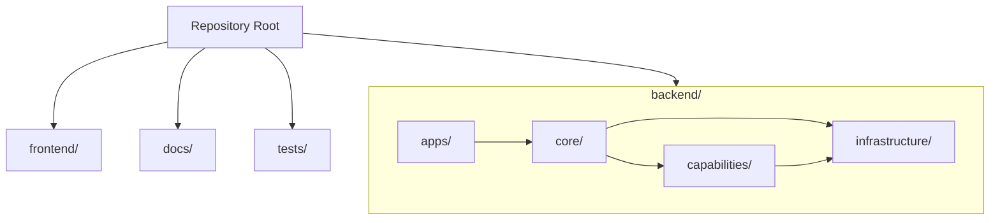

# Backend Directory Migration PRD

## 1. Introduction & Goals

The repository already documents a four-layer backend architecture, but the layer directories were previously placed at repository root. This change moves the backend layers into `backend/` so the backend boundary is explicit and the documented architecture matches the code layout.

Goals:

- make `backend/` the single package boundary for Python backend code
- preserve the existing four-layer dependency direction inside `backend/`
- keep developer workflows working through updated imports, hooks, tests, and docs

## 2. Requirement Shape

- Actor: repository maintainers and AI coding agents
- Trigger: navigating, extending, validating, or documenting backend code
- Expected behavior: backend code lives under `backend/{apps,core,capabilities,infrastructure}` and all references point there consistently
- Scope boundary: this PRD covers repository structure migration and compatibility entrypoints; it does not redesign module boundaries within each layer

## 3. Repository Context And Architecture Fit

Existing path:

- root-level `apps/`, `core/`, `capabilities/`, and `infrastructure/`

Reuse candidates:

- existing four-layer packages, tests, architecture checker, `just run`, MkDocs docs, and root `main.py`

Architecture constraints:

- preserve `apps -> core -> capabilities -> infrastructure` direction
- keep frontend outside the backend four-layer graph
- keep docs and validation tooling synchronized with code structure

Potential redundancy risks:

- introducing `backend/` without updating imports would create two competing path vocabularies
- keeping only `main.py` at repo root would blur whether the backend boundary is the repo root or `backend/`

## 4. Recommendation

### Recommended Approach

Move all four backend layer directories into `backend/`, move the real backend entrypoint to `backend/main.py`, keep a thin root `main.py` wrapper for compatibility, and update every code/test/doc/tool reference to `backend.*`.

This is the best fit because it preserves the existing architecture model with minimal behavioral change while making the repository boundary explicit.

### Alternatives Considered

- Keep the four layer directories at repo root and only rewrite documentation.
  Rejected because the repository would still visually mix backend-internal layers with repo-level directories such as `frontend/`, `docs/`, and `scripts/`.

## 5. Implementation Guide

### Core Logic

1. Move `apps/`, `core/`, `capabilities/`, and `infrastructure/` under `backend/`.
2. Convert imports to `backend.*`.
3. Update root `main.py` to delegate to `backend.main`.
4. Update architecture validation and pre-commit matching to scan `backend/`.
5. Update docs and mkdocstrings targets to the new package paths.

### Affected Files

- `backend/**`
- `main.py`
- `hooks/check_architecture.py`
- `.pre-commit-config.yaml`
- `justfile`
- `tests/*.py`
- `docs/**`
- `README.md`
- `AGENTS.md`

### Change Matrix

| Change Target | Current State | Target State | How to Modify | Why This Fits Existing Architecture | Affected Files |
|---|---|---|---|---|---|
| Backend package boundary | Four backend layers live at repo root | Four backend layers live under `backend/` | Move directories and add `backend/__init__.py` | Preserves the existing layers while clarifying that they are backend-internal | `backend/**` |
| Backend entrypoint | Root `main.py` is the visible backend entrypoint | `backend/main.py` is the real entrypoint, root `main.py` is a wrapper | Move the entrypoint and keep a compatibility launcher | Makes the boundary explicit without breaking common startup habits | `backend/main.py`, `main.py` |
| Import graph | Code/tests reference root-level modules | Code/tests reference `backend.*` | Bulk-update imports and targeted docstring fixes | Prevents parallel path conventions from coexisting | `backend/**`, `tests/*.py`, `README.md` |
| Architecture enforcement | Checker scans root layer directories | Checker scans `backend/` and resolves backend layer imports | Update path resolution and scan roots | Keeps guardrails aligned with the real structure | `hooks/check_architecture.py`, `.pre-commit-config.yaml` |
| Documentation/API refs | Docs describe root-level layers and mkdocstrings targets | Docs describe `backend/` layout and `backend.*` APIs | Update architecture docs, getting-started, README, and API reference pages | Makes docs authoritative again after the migration | `docs/**`, `README.md`, `AGENTS.md` |

### Flow or Architecture Diagram

No low-fidelity prototype required for this PRD.
No data model changes in this PRD.
No interactive prototype file changes in this PRD.
No external validation required for this PRD.

## 6. Definition Of Done

- backend code is imported through `backend.*`
- architecture checker validates `backend/` successfully
- targeted backend tests pass
- MkDocs builds successfully with updated API references
- docs describe `backend/` as the backend system boundary

## 7. Acceptance Checklist

### Architecture Acceptance

- [x] `backend/apps/`, `backend/core/`, `backend/capabilities/`, and `backend/infrastructure/` exist
- [x] `backend/main.py` exists as the real backend entrypoint
- [x] root `main.py` only delegates to `backend.main`

### Dependency Acceptance

- [x] repository search finds no remaining Python imports of root-level `apps.*`, `core.*`, `capabilities.*`, or `infrastructure.*`
- [x] `uv run python hooks/check_architecture.py` passes against `backend/`

### Behavior Acceptance

- [x] `python main.py` runs
- [x] `python backend/main.py` runs

### Documentation Acceptance

- [x] architecture docs describe the backend layers under `backend/`
- [x] `docs/api/references.md` points mkdocstrings at `backend.*`

### Validation Acceptance

- [x] `uv run pytest tests/test_logger.py tests/test_model_loader_config.py tests/test_embedding_model.py tests/test_archive_tasks.py tests/test_release_script.py tests/test_planning_with_files.py -q`
- [x] `uv run mkdocs build`
- [x] `git diff --check`

## 8. User Stories

- As a maintainer, I want backend code grouped under `backend/` so repository-level boundaries are obvious.
- As an AI coding agent, I want imports and docs to agree on package paths so architectural guidance is unambiguous.

## 9. Functional Requirements

- FR-1: The repository must expose backend Python code from a single top-level `backend/` package.
- FR-2: The four-layer architecture must remain intact inside `backend/`.
- FR-3: Tooling and validation must target the migrated paths.
- FR-4: Documentation must describe the migrated structure and package references accurately.
- FR-5: Existing common startup behavior must remain available through a compatibility wrapper.

## 10. Non-Goals

- Redesigning domain/module boundaries inside `core/` or `capabilities/`
- Removing all compatibility affordances immediately
- Reworking frontend structure

## 11. Risks And Follow-Ups

- The codebase still contains some architecture compromises, such as capabilities directly using infrastructure, but those predated this directory migration.
- A future follow-up can decide whether to remove the root `main.py` wrapper once downstream usage is confirmed.

## 12. Decision Log

| # | 决策问题 | 选择 | 放弃的方案 | 理由 |
|---|---|---|---|---|
| D-01 | 后端四层是否放入单独边界目录 | 放入 `backend/` | 继续保留在仓库根目录 | 只有加上 `backend/` 边界，四层才明确是后端内部结构而不是整个仓库的顶层结构。 |
| D-02 | 入口文件如何迁移 | `backend/main.py` 为真实入口，根 `main.py` 保留包装器 | 只保留根 `main.py` | 这样既能表达真实边界，又不会立刻打断已有启动习惯。 |
