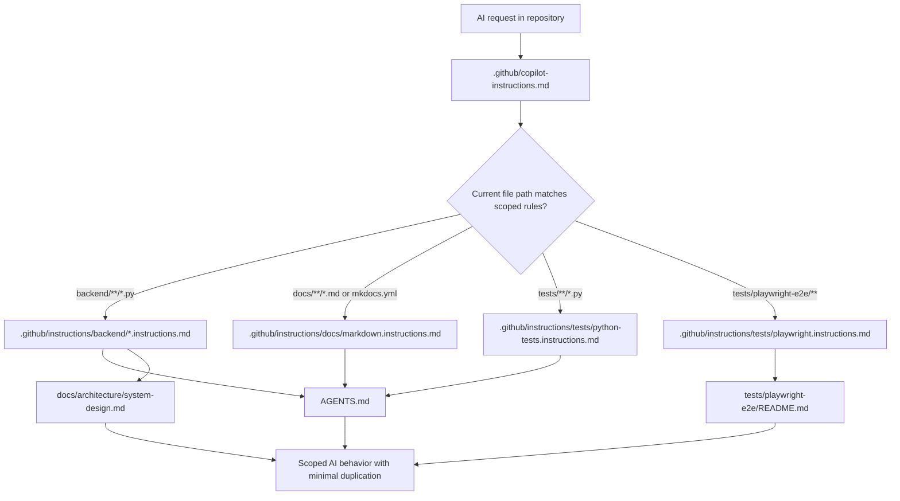

# PRD: GitHub AI Instructions Layout

> Superseded by `tasks/20260422-132546-prd-unified-ai-standards-hub.md`.
> This PRD is kept only as an archived decision branch showing the earlier GitHub-first direction.

## 1. Introduction & Goals

当前仓库已经有较完整的 AI 协作规则来源：

- `AGENTS.md` 作为主规范入口
- `CLAUDE.md` 作为 Claude 侧适配入口
- `docs/architecture/system-design.md` 作为四层架构权威文档
- `.cursor/commands/cursor.md` 作为 Cursor 侧规则入口

但针对 GitHub 官方推荐的 Copilot 自定义指令结构，仓库目前仍是缺失状态：`.github/` 下只有 workflow 文件，没有 `copilot-instructions.md`，也没有 `.github/instructions/*.instructions.md` 这类按路径拆分的规则文件。结果是：

- GitHub Copilot 缺少官方自动发现的仓库级规则入口。
- 现有规范虽然完整，但没有以 GitHub 官方推荐的多文件结构对齐。
- 如果后续直接把所有规则塞进一个超长全局文件，会让维护、冲突控制和路径定向生效都变差。

本 PRD 的目标是为仓库引入一套 **GitHub 官方兼容、按文件职责拆分、且尽量复用现有规范** 的 AI 指令体系。

### Measurable Objectives

- 引入 GitHub 官方可自动发现的仓库级入口：`.github/copilot-instructions.md`
- 引入统一的多文件 AI 规范目录：`.github/instructions/`
- 将后端架构、命名、注释/Docstring、文档编写、测试约束拆为独立 `*.instructions.md` 文件
- 保持 `AGENTS.md` 与 `docs/architecture/system-design.md` 继续作为高价值权威来源，而不是在 GitHub 文件中整份重复
- 避免新增自定义 `ai-guidelines/` 一类非官方目录，减少额外学习成本和同步负担

---

## 2. Requirement Shape

- Actor: 仓库维护者，以及在 GitHub Copilot、Copilot CLI、IDE Copilot 环境中工作的 AI 编码代理
- Trigger: AI 代理进入仓库上下文，或开始修改 `backend/`、`docs/`、`tests/`、`.github/` 等目录下的文件时
- Expected behavior: AI 先加载仓库级规则，再按当前文件路径叠加命中的路径级规则；后端文件自动获得架构、命名、Docstring 约束；文档文件自动获得 MkDocs 与 UTF-8 规则；Playwright 包自动获得 TypeScript/Node 规则而不是错误继承 Python 规则
- Explicit scope boundary: 本 PRD 只定义 GitHub 官方推荐的 AI 规范文件布局、权威来源关系、同步方式和验证方式；不引入新的运行时服务、规则生成器、MCP 服务或多代理编排系统

---

## 3. Repository Context And Architecture Fit

### Current Relevant Modules And Files

- `AGENTS.md`
- `CLAUDE.md`
- `.cursor/commands/cursor.md`
- `docs/architecture/system-design.md`
- `docs/guides/prd-standard.md`
- `mkdocs.yml`
- `hooks/check_guidelines_consistency.py`
- `.github/workflows/ci.yml`
- `.github/workflows/cd.yml`

### Existing Path

当前最接近本需求的现有路径是：

- `AGENTS.md` 已经保存了大部分 AI 开发规范，包括编码、命名、文档、UTF-8、四层架构工作方式
- `CLAUDE.md` 已明确声明 `AGENTS.md` 是完整且权威的主规范
- `docs/architecture/system-design.md` 已经作为后端四层架构的权威说明存在
- `hooks/check_guidelines_consistency.py` 已在维护多入口 AI 指导文件的一致性

也就是说，仓库已经有“规范内容”，缺的是 **GitHub 官方兼容的载体结构**。

### Reuse Candidates

- `AGENTS.md` 中现有的命名、Docstring、UTF-8、开发流程规则
- `docs/architecture/system-design.md` 中现有的架构与依赖方向规则
- `CLAUDE.md` 中现有的“引用主规范文件”模式
- `hooks/check_guidelines_consistency.py` 中现有的一致性校验思路
- `mkdocs.yml` 现有的开发者文档导航结构

### Ownership And Dependency Boundaries

- 架构原则的权威解释应继续放在 `docs/architecture/`
- 跨代理的通用工程规则应继续以 `AGENTS.md` 为主入口
- GitHub Copilot 侧文件应作为 GitHub 官方兼容适配层，而不是重新发明一套并行规范系统
- `.github/instructions/*.instructions.md` 应保持“短、准、按路径聚焦”，避免成长为另一份冗长 `AGENTS.md`

### Constraints

- 仓库已有 `AGENTS.md`、`CLAUDE.md`、`.cursor/commands/cursor.md` 和一致性检查脚本，新增 GitHub 指令文件不能让规范源头变成多头管理
- `docs/` 和 `mkdocs.yml` 是代码库一部分，若新增指导文档页面必须同步导航
- `tests/playwright-e2e/` 明确采用 TypeScript/Node 约定，不应错误复用 Python 的 SSA 命名或 `uv` 约束
- GitHub 官方说明中，仓库级文件和路径级文件会叠加使用，因此规则之间必须互补而不是冲突

### Potential Redundancy Risks

- 新建自定义 `ai-guidelines/` 或 `copilot/` 目录，会与 GitHub 官方自动发现机制平行重复
- 把 `AGENTS.md` 整份复制到多个 `.instructions.md` 文件，会制造高漂移风险
- 额外引入规则生成脚本、模板编译器或同步流水线，会在当前规模下过度设计
- 把后端、文档、测试、Playwright 的规则全部塞入单个 `.github/copilot-instructions.md`，会让路径上下文失效并增加冲突概率

---

## 4. Recommendation

### Recommended Approach

采用 **GitHub 官方兼容的双层结构**：

1. 使用 `.github/copilot-instructions.md` 作为仓库级总入口
2. 使用 `.github/instructions/` 作为统一的多文件、按路径拆分的 AI 规则目录
3. 保持 `AGENTS.md` 与 `docs/architecture/system-design.md` 作为现有高价值权威来源，不把长篇规范整份复制进 GitHub 指令文件
4. 仅把 GitHub 需要自动应用的高信号规则拆入 `*.instructions.md`
5. 为 TypeScript Playwright 包单独设规则文件，避免继承 Python-only 规则

推荐目录树：

```text
.github/
  copilot-instructions.md
  instructions/
    backend/
      architecture.instructions.md
      naming.instructions.md
      docstrings.instructions.md
    docs/
      markdown.instructions.md
    tests/
      python-tests.instructions.md
      playwright.instructions.md
```

各文件职责：

- `.github/copilot-instructions.md`
  - 放仓库级底线规则
  - 说明本仓库已存在 `AGENTS.md` 和 `docs/architecture/system-design.md`
  - 提醒代理在命中路径时叠加读取 `.github/instructions/` 中规则
- `backend/architecture.instructions.md`
  - 四层架构、依赖方向、必须先读 `docs/architecture/system-design.md`
- `backend/naming.instructions.md`
  - Fully Qualified Naming、SSA、禁止泛型变量名
- `backend/docstrings.instructions.md`
  - Google Style Docstrings、类型注解、UTF-8 I/O 约束
- `docs/markdown.instructions.md`
  - 文档与代码同步、MkDocs 导航维护、Markdown UTF-8 要求
- `tests/python-tests.instructions.md`
  - Python 测试使用 `uv` / `just test` 约定，避免直接破坏分层边界
- `tests/playwright.instructions.md`
  - TypeScript/Node 约定、`npm` 包管理、Python SSA 规则不适用

### Why This Best Fits The Current Architecture

- 复用了仓库现有的权威规则，而不是推翻 `AGENTS.md`
- 对 GitHub 官方自动发现机制零偏离，后续 Copilot CLI、IDE、cloud agent 都更容易吃到规则
- 用路径级文件解决“后端 Python”和“Playwright TypeScript”规则不同的问题
- 让 `.github/instructions/` 成为你想要的“统一文件夹下的多个规范文件”，同时保留 GitHub 必需的仓库级入口文件

### Rationale For Rejecting Redundant Abstractions

- 不新增 `ai-guidelines/`、`copilot/`、`conventions/` 这类自定义平行目录，因为 GitHub 官方不会默认消费它们
- 不新增规则生成器或同步脚本，因为当前文件数量很小，手工维护更简单、更透明
- 不新增独立的 `docs/standards/` 作为第一阶段硬要求，因为现有 `AGENTS.md` 与 `docs/architecture/` 已足以承载权威内容

### Alternatives Considered

#### Alternative A: Single Large `.github/copilot-instructions.md`

- 优点：文件数量最少
- 缺点：所有规则混在一处，无法按路径精准叠加，后端/文档/Playwright 规则容易相互污染
- 结论：不推荐；不满足你“统一目录下分几个文件存储”的目标，也不利于长期维护

#### Alternative B: Custom `ai-guidelines/` Folder As Primary Source

- 优点：目录名更自由，看起来更整洁
- 缺点：不属于 GitHub 官方自动发现路径，需要额外在每个工具里手工提示读取
- 结论：不推荐；会让“GitHub 官方推荐”这个前提失效

---

## 5. Implementation Guide

### 5.1 Core Logic

1. 新增 `.github/copilot-instructions.md`，作为 GitHub Copilot 的仓库级入口
2. 在 `.github/instructions/` 下按作用域创建多个 `*.instructions.md`
3. 每个路径级规则文件仅保留当前作用域最关键的 5 到 12 条规则，避免复制整份长文
4. 后端架构规则文件显式要求先阅读 `docs/architecture/system-design.md`
5. 规则文件之间只做互补，不做互相冲突的重复表达
6. `AGENTS.md`、`CLAUDE.md`、`.cursor/commands/cursor.md` 继续保留，但补充说明 GitHub Copilot 侧规则位于 `.github/`
7. 更新 `hooks/check_guidelines_consistency.py`，让它至少感知 `.github/copilot-instructions.md` 的存在与基本引用关系
8. 补一页开发者文档，说明：
   - 哪些内容应该写进 `.github/instructions/`
   - 哪些内容继续放在 `AGENTS.md` 或 `docs/architecture/`
   - 何时新增新的 `*.instructions.md`
   - 如何避免 `applyTo` 重叠冲突

### 5.2 Proposed File Layout

```text
.github/
  copilot-instructions.md
  instructions/
    backend/
      architecture.instructions.md
      naming.instructions.md
      docstrings.instructions.md
    docs/
      markdown.instructions.md
    tests/
      python-tests.instructions.md
      playwright.instructions.md

docs/
  guides/
    github-copilot-instructions.md
```

### 5.3 Change Matrix

| Change Target | Current State | Target State | How to Modify | Why This Fits Existing Architecture | Affected Files |
|---|---|---|---|---|---|
| GitHub AI repository entrypoint | `.github/` 仅有 workflow，没有 Copilot 仓库级规则入口 | 新增 GitHub 官方识别的仓库级规则文件 | 创建 `.github/copilot-instructions.md`，写仓库级底线规则与权威文档入口 | 直接采用 GitHub 官方入口，不引入自定义目录协议 | `.github/copilot-instructions.md` |
| Unified AI rules folder | 仓库没有 GitHub 官方的分文件路径级规则目录 | 在统一目录下按关注点拆分规则文件 | 创建 `.github/instructions/` 及子目录，分别承载 backend/docs/tests 规则 | 满足“统一文件夹下分文件存储”，且与官方结构一致 | `.github/instructions/**` |
| Backend architecture guidance | 架构规则只存在于 `AGENTS.md` 和 `docs/architecture/system-design.md` | 后端 Python 文件自动获得架构指令 | 在 `backend/architecture.instructions.md` 中固化四层边界并引用架构文档 | 不复制整份架构长文，只在 AI 入口层做精简映射 | `.github/instructions/backend/architecture.instructions.md`, `docs/architecture/system-design.md` |
| Naming and docstring guidance | 命名、Docstring、UTF-8 规则集中在 `AGENTS.md` | 后端 Python 文件按规则自动获得命名与注释约束 | 将命名和 Docstring 规则拆为独立 instructions 文件 | 用独立文件减少冲突，便于后续单独演进 | `.github/instructions/backend/naming.instructions.md`, `.github/instructions/backend/docstrings.instructions.md`, `AGENTS.md` |
| Docs and MkDocs guidance | 文档规则主要在 `AGENTS.md` 中，以文本方式存在 | 文档编辑时自动获得同步与导航规则 | 新增 docs 规则文件，并在需要时补充一页指南文档 | 保持 docs 是代码库一部分的原则，并形成明确编辑入口 | `.github/instructions/docs/markdown.instructions.md`, `docs/guides/github-copilot-instructions.md`, `mkdocs.yml` |
| Test-scope rule separation | Python tests 与 Playwright tests 的约定分散，且技术栈不同 | 两类测试按各自技术栈获得不同规则 | 为 Python tests 与 Playwright tests 分别创建 instructions 文件 | 避免 Python 规则污染 TypeScript 包，符合现有仓库说明 | `.github/instructions/tests/python-tests.instructions.md`, `.github/instructions/tests/playwright.instructions.md` |
| Cross-guide consistency | 现有一致性检查仅覆盖 `AGENTS.md`、`CLAUDE.md`、Cursor 指南 | GitHub 新入口也纳入一致性维护 | 扩展检查脚本和必要的交叉引用 | 复用现有治理方式，不新增另一套治理工具 | `hooks/check_guidelines_consistency.py`, `AGENTS.md`, `CLAUDE.md`, `.cursor/commands/cursor.md` |

### 5.4 Flow Or Architecture Diagram



### 5.5 Low-Fidelity Prototype

No low-fidelity prototype required for this PRD.

### 5.6 ER Diagram

No data model changes in this PRD.

### 5.7 Affected Files

| File | Change Type | Description |
|---|---|---|
| `.github/copilot-instructions.md` | Add | GitHub Copilot 仓库级总入口 |
| `.github/instructions/backend/architecture.instructions.md` | Add | 后端四层架构与依赖方向规则 |
| `.github/instructions/backend/naming.instructions.md` | Add | 后端变量命名与 SSA 规则 |
| `.github/instructions/backend/docstrings.instructions.md` | Add | Google Style Docstrings、类型注解、UTF-8 I/O 规则 |
| `.github/instructions/docs/markdown.instructions.md` | Add | 文档同步、MkDocs 导航和 Markdown 规则 |
| `.github/instructions/tests/python-tests.instructions.md` | Add | Python 测试规则 |
| `.github/instructions/tests/playwright.instructions.md` | Add | Playwright TypeScript/Node 规则 |
| `AGENTS.md` | Modify | 增补 GitHub Copilot 侧规则入口与权威来源关系说明 |
| `CLAUDE.md` | Modify | 补充 GitHub 侧文件关系说明，继续保持引用 `AGENTS.md` |
| `.cursor/commands/cursor.md` | Modify | 补充 GitHub 侧规则入口说明或保持交叉引用一致 |
| `hooks/check_guidelines_consistency.py` | Modify | 将 GitHub Copilot 规则入口纳入一致性检查 |
| `docs/guides/github-copilot-instructions.md` | Add | 说明文件树、维护规则、何时新增 scoped instructions |
| `mkdocs.yml` | Modify | 将新增指导页面加入导航 |

### 5.8 Interactive Prototype Change Log

No interactive prototype file changes in this PRD.

### 5.9 External Validation

以下外部事实于 **2026-04-22** 核对：

- GitHub Docs 说明仓库级自定义指令文件位于 `.github/copilot-instructions.md`
  - Source: <https://docs.github.com/en/copilot/how-tos/copilot-on-github/customize-copilot/add-custom-instructions/add-repository-instructions>
- GitHub Docs 说明路径级自定义指令文件位于 `.github/instructions/` 下的一个或多个 `NAME.instructions.md`，且仓库级与路径级规则会叠加生效，因此应避免冲突
  - Source: <https://docs.github.com/en/copilot/how-tos/copilot-cli/customize-copilot/add-custom-instructions>
- GitHub Docs 说明 `.github/prompts/*.prompt.md` 属于 prompt files 机制，适合按需调用，不是 always-on 仓库规范入口
  - Source: <https://docs.github.com/en/copilot/how-tos/configure-custom-instructions-in-your-ide/add-repository-instructions-in-your-ide>

Inference:

- 因此，若目标是“给 AI 持续参考的分文件规范”，主结构应选择 `.github/instructions/`，而不是只依赖 `.github/prompts/`
- 若目标是“GitHub 官方推荐且兼容面最广”，则仍必须保留 `.github/copilot-instructions.md` 作为总入口

---

## 6. Definition Of Done

- [ ] `.github/copilot-instructions.md` 已创建并作为 GitHub 规则总入口存在
- [ ] `.github/instructions/` 已创建，并至少包含 backend/docs/tests 三类作用域
- [ ] 后端规则已拆分为架构、命名、Docstring 三个独立文件
- [ ] Playwright 规则已单独成文件，没有错误继承 Python-only 规范
- [ ] `AGENTS.md`、`CLAUDE.md`、Cursor 入口与 GitHub 入口关系已同步说明
- [ ] 一致性检查脚本已覆盖 GitHub 新入口或至少校验其存在与交叉引用
- [ ] 新增说明文档已加入 `mkdocs.yml` 导航
- [ ] 仓库中未引入额外自定义的并行 AI 规范目录

---

## 7. Acceptance Checklist

### Architecture Acceptance

- [ ] 仓库存在 `.github/copilot-instructions.md`
- [ ] 仓库存在 `.github/instructions/backend/architecture.instructions.md`
- [ ] 仓库不存在新的自定义主规范目录，例如 `ai-guidelines/`、`copilot/`、`conventions/`
- [ ] `backend/architecture.instructions.md` 明确要求遵守 `backend/apps/ -> backend/core/ -> backend/capabilities/ -> backend/infrastructure/` 依赖方向

### Dependency Acceptance

- [ ] `backend` 规则文件未整份复制 `AGENTS.md` 内容，而是聚焦当前作用域
- [ ] `tests/playwright-e2e/**` 的规则文件未强加 Python `uv` / SSA 命名规则
- [ ] 仓库级文件与路径级文件不存在互相矛盾的规则表述

### Behavior Acceptance

- [ ] 后端 Python 文件编辑时，AI 会命中 backend 架构、命名、Docstring 三类规则
- [ ] 文档文件编辑时，AI 会命中 Markdown/MkDocs 规则
- [ ] Python 测试与 Playwright 测试分别命中不同规则文件

### Documentation Acceptance

- [ ] `docs/guides/github-copilot-instructions.md` 已存在并说明文件职责和维护规则
- [ ] `mkdocs.yml` 已将该文档加入导航
- [ ] `AGENTS.md`、`CLAUDE.md`、`.cursor/commands/cursor.md` 与 GitHub 入口的关系描述保持一致

### Validation Acceptance

- [ ] `rg --files .github | sort` 可列出新增的 `copilot-instructions.md` 与 `instructions/` 文件
- [ ] `uv run python hooks/check_guidelines_consistency.py` 通过
- [ ] `uv run mkdocs build` 通过

---

## 8. User Stories

### US-001: Repository Maintainer Wants A GitHub-Official AI Entry

As a repository maintainer, I want GitHub Copilot to discover repository guidance through official file locations, so that the AI can use project rules without depending on custom prompts.

### US-002: Backend Maintainer Wants Split Guidance By Concern

As a backend maintainer, I want architecture, naming, and Docstring rules split into separate files, so that I can update one concern without editing a monolithic instruction file.

### US-003: Documentation Maintainer Wants Docs Rules To Apply Only To Docs

As a documentation maintainer, I want MkDocs and Markdown rules to apply only when editing docs, so that code-focused rules do not pollute documentation tasks.

### US-004: Playwright Maintainer Wants TypeScript Rules To Stay Isolated

As a Playwright maintainer, I want the standalone TypeScript package to receive Node/TypeScript guidance instead of Python guidance, so that AI suggestions match the actual stack.

---

## 9. Functional Requirements

- FR-1: The repository MUST provide a GitHub-recognized repository-wide instruction file at `.github/copilot-instructions.md`.
- FR-2: The repository MUST provide path-specific instruction files under `.github/instructions/`.
- FR-3: Backend Python guidance MUST be split into at least architecture, naming, and docstring concerns.
- FR-4: Backend architecture guidance MUST require reading `docs/architecture/system-design.md` before implementing new backend features.
- FR-5: Naming guidance MUST enforce descriptive variable naming and reject generic placeholder names.
- FR-6: Docstring guidance MUST require Google Style docstrings and explicit UTF-8 file I/O handling where applicable.
- FR-7: Documentation guidance MUST require syncing relevant `docs/` content and `mkdocs.yml` navigation when new guide pages are added.
- FR-8: Python test guidance and Playwright guidance MUST be separated by scope.
- FR-9: The repository MUST document which files remain authoritative sources and which GitHub files are concise adapters.
- FR-10: The repository MUST provide at least one maintainers’ guide describing how to add, split, or de-conflict future `.instructions.md` files.
- FR-11: Consistency validation MUST cover the new GitHub instruction entrypoint.

---

## 10. Non-Goals

- 不在本 PRD 中引入 `.github/prompts/` 作为主要规范承载方式
- 不在本 PRD 中创建自定义 `ai-guidelines/`、`copilot/`、`conventions/` 等平行目录
- 不在本 PRD 中把所有现有长文档迁移或重写为 GitHub instruction files
- 不在本 PRD 中新增规则生成器、模板编译器、同步机器人或 MCP 服务
- 不在本 PRD 中改变现有后端四层架构本身，只改变 AI 如何读取这些规则

---

## 11. Risks And Follow-Ups

- 如果 `.github/copilot-instructions.md` 与路径级文件写出重复但略有不同的规则，GitHub 侧叠加后可能产生冲突
- 如果 backend 规则拆得过细，维护成本会反而上升；因此应控制在少量高信号文件
- 如果没有把 Playwright 规则单独隔离，AI 仍可能把 Python 风格错误带入 TypeScript 包
- 如果一致性检查只验证文件存在而不验证关键引用，后续仍可能发生长期漂移
- 后续若前端 React 目录逐步增大，可能需要补一类 `frontend/*.instructions.md`，但这不应阻塞当前交付

---

## 12. Decision Log

| # | 决策问题 | 选择 | 放弃的方案 | 理由 |
|---|---|---|---|---|
| D-01 | GitHub 侧 AI 规则主入口放在哪里 | `.github/copilot-instructions.md` + `.github/instructions/` | 自定义 `ai-guidelines/` 目录 | 只有 GitHub 官方路径能被 Copilot 默认发现，额外自定义目录会增加手工提示成本 |
| D-02 | 多文件规范应如何拆分 | 按作用域与关注点拆为 backend/docs/tests 子目录和多个 `*.instructions.md` | 单个超长 `.github/copilot-instructions.md` | 当前仓库同时包含 Python、Markdown、TypeScript 场景，单文件无法精确按路径施加规则 |
| D-03 | 权威来源应保留在哪里 | `AGENTS.md` 与 `docs/architecture/system-design.md` 继续做权威来源，GitHub 文件做精简适配 | 把全部长文复制进 `.github/instructions/` | 复制长文会造成高漂移风险，且不利于长期维护 |
| D-04 | Playwright 包是否应复用 Python 测试规则 | 否，单独建立 `playwright.instructions.md` | 直接沿用 Python 测试规则 | `tests/playwright-e2e/` 是独立 TypeScript/Node 包，技术栈和包管理方式不同 |
