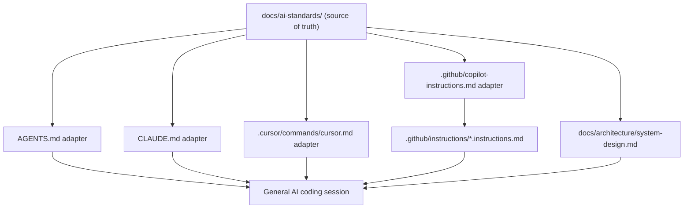

# PRD: Unified AI Standards Hub

## 1. Introduction & Goals

上一版草案把问题收窄成了 “如何为 GitHub Copilot 布置规则文件”，这不符合本需求的本质。

你真正要解决的问题是：

- 为仓库建立一套**通用的 AI 可读规范源**
- 把架构、变量命名、注释/Docstring、文档、测试等规则拆成多个文件
- 让 GitHub Copilot、Claude、Cursor、Codex 之类不同入口都能消费同一套规范
- 避免某一个工具自己的入口文件反客为主，变成新的单点权威来源

因此，本 PRD 不再把 `.github/` 视为规范本体，而是把它视为 **GitHub 适配层**。规范本体应放在一个统一目录中，由各 AI 工具入口文件去引用或映射。

### Measurable Objectives

- 建立一个统一的 AI 规范源目录，用于集中存放拆分后的规则文件
- 将至少以下主题拆成独立文件：架构、命名、注释/Docstring、文档、测试、工具与命令
- 保证 `AGENTS.md`、`CLAUDE.md`、`.github/copilot-instructions.md`、`.cursor/commands/cursor.md` 都不再是唯一权威来源
- 保证 GitHub 官方推荐结构仍然被支持，但只作为一个消费者
- 保证新增规范目录可以被纳入 MkDocs 文档导航，便于人类维护

---

## 2. Requirement Shape

- Actor: 仓库维护者，以及在不同 AI 工具入口中工作的编码代理
- Trigger: AI 代理进入仓库，或开始编辑 `backend/`、`docs/`、`tests/`、`.github/` 等目录文件时
- Expected behavior: AI 先通过当前工具入口定位统一规范源，再根据任务路径叠加相关规则；后端任务读取架构/命名/Docstring 规则，文档任务读取 Markdown/MkDocs 规则，Playwright 任务读取 TypeScript/Node 规则
- Explicit scope boundary: 本 PRD 只定义“统一规范源目录 + 多工具适配入口”的文档与文件布局；不引入运行时服务、规则生成器、自动同步机器人或新的 agent orchestration

---

## 3. Repository Context And Architecture Fit

### Current Relevant Modules And Files

- `AGENTS.md`
- `CLAUDE.md`
- `.cursor/commands/cursor.md`
- `docs/architecture/system-design.md`
- `docs/guides/prd-standard.md`
- `mkdocs.yml`
- `hooks/check_guidelines_consistency.py`
- `.github/workflows/ci.yml`
- `.github/workflows/cd.yml`

### Existing Path

当前仓库已经存在多种 AI 入口和多类权威规则：

- `AGENTS.md` 保存了跨任务的主要工程规范
- `CLAUDE.md` 已被设计成指向 `AGENTS.md` 的较薄入口
- `.cursor/commands/cursor.md` 也是现有 AI 指导文件体系的一部分
- `docs/architecture/system-design.md` 是后端四层架构的权威文档
- `hooks/check_guidelines_consistency.py` 已经在维护多入口指导文件一致性

也就是说，仓库缺的不是“规则内容”，而是：

1. 一个**集中、拆分、工具中立**的规范源目录
2. 一个明确的“规范本体 vs 工具入口”关系

### Reuse Candidates

- `AGENTS.md` 中已有的编码、命名、UTF-8、测试、文档规则
- `docs/architecture/system-design.md` 中已有的架构边界与依赖方向
- `CLAUDE.md` 中现有的“薄入口”模式
- `hooks/check_guidelines_consistency.py` 中现有的一致性校验思路
- `mkdocs.yml` 中已有的文档导航体系

### Ownership And Dependency Boundaries

- 架构权威解释继续属于 `docs/architecture/`
- 通用 AI 规范本体应集中到一个独立目录，供不同工具入口复用
- `AGENTS.md`、`CLAUDE.md`、GitHub 和 Cursor 文件应变成入口/适配层，而不是新的并行权威来源
- 工具适配层只保留高信号入口说明与必要差异，不整份复制规范本体

### Constraints

- 不能为了“统一目录”而把现有所有长文档都强行搬迁，造成无意义重构
- 不能让 GitHub 官方路径要求主导整个规范体系
- 不能让 Playwright 的 TypeScript/Node 约定被 Python 规范污染
- 新增规范目录如果是长期维护资产，应进入 MkDocs 导航
- 现有一致性脚本需要扩展到新的主从关系，而不是继续只检查旧三件套

### Potential Redundancy Risks

- 新增统一目录后，如果 `AGENTS.md`、`.github/copilot-instructions.md`、`CLAUDE.md` 仍分别维护完整规则，会形成三到四份漂移文本
- 如果统一目录只是“文档副本”，而真正规则仍散落各入口，等于没有建立 source of truth
- 如果把 GitHub 的 `.github/instructions/` 当作主规范目录，Claude/Cursor/Codex 仍会被 GitHub 结构反向绑架

---

## 4. Recommendation

### Recommended Approach

建立 **“统一规范源 + 多工具适配层”** 结构。

推荐目标态：

```text
docs/
  ai-standards/
    index.md
    architecture.md
    naming.md
    comments-docstrings.md
    documentation.md
    testing.md
    tooling.md

AGENTS.md
CLAUDE.md
.cursor/commands/cursor.md
.github/copilot-instructions.md
.github/instructions/
  backend.instructions.md
  docs.instructions.md
  python-tests.instructions.md
  playwright.instructions.md
```

其中：

- `docs/ai-standards/` 是**规范本体**
- `AGENTS.md` 是通用代理入口，负责把代理引导到规范本体
- `CLAUDE.md` 是 Claude 适配入口
- `.github/copilot-instructions.md` 和 `.github/instructions/*.instructions.md` 是 GitHub 适配入口
- `.cursor/commands/cursor.md` 是 Cursor 适配入口

推荐每个规范文件职责如下：

- `index.md`
  - 规范目录概览
  - 哪些文件是权威来源
  - 哪些工具入口会消费这些规范
- `architecture.md`
  - AI 视角下的架构边界摘要
  - 必须引用并指向 `docs/architecture/system-design.md`
- `naming.md`
  - Fully Qualified Naming
  - SSA / immutability
  - 禁止泛型变量名
- `comments-docstrings.md`
  - Google Style Docstrings
  - 注释何时该写、何时不该写
  - UTF-8 I/O 明确要求
- `documentation.md`
  - 文档与代码同步要求
  - `mkdocs.yml` 导航维护规则
  - Markdown UTF-8 约束
- `testing.md`
  - Python 测试、分层边界、回归校验要求
- `tooling.md`
  - `uv`、`just`、`mkdocs`、Playwright 包边界说明

### Why This Best Fits The Current Architecture

- 不推翻现有 `AGENTS.md` / `CLAUDE.md` / 架构文档体系，只重新整理权威来源关系
- 把“统一目录”做成真正的 source of truth，而不是另一个 consumer-specific 文件夹
- GitHub 官方入口结构仍然保留，因此不会失去 GitHub 兼容性
- Claude、Cursor、Codex 等入口可以共享同一套规范，而不必各自维护长文副本

### Rationale For Rejecting Redundant Abstractions

- 不新增规则生成器：当前规则文件数量小，人工维护更透明
- 不新增 `ai-guidelines/` 和 `docs/ai-standards/` 两套并行目录：统一目录只能有一套主规范源
- 不把 `.github/instructions/` 当主规范源：那会让 GitHub 专属结构绑架通用规范设计

### Alternatives Considered

#### Alternative A: GitHub Files As Primary Source

- 优点：直接对齐 GitHub 官方自动发现路径
- 缺点：本质上仍然是 GitHub-first，不适合作为所有 AI 工具共享的权威规范源
- 结论：不推荐

#### Alternative B: Keep `AGENTS.md` As The Only Source

- 优点：入口最少
- 缺点：单文件会持续膨胀，无法把架构、命名、测试、文档规则按主题拆开，也不适合被多工具路径级复用
- 结论：不推荐

#### Alternative C: Unified Standards Hub + Thin Adapters

- 优点：既满足“统一目录下分文件”，又保留 GitHub/Claude/Cursor 等工具兼容入口
- 缺点：需要一次性理顺 source-of-truth 关系，并扩展一致性检查
- 结论：推荐

---

## 5. Implementation Guide

### 5.1 Core Logic

1. 在 `docs/` 下创建统一规范源目录 `docs/ai-standards/`
2. 按主题拆分规则文件，而不是按工具拆分
3. `AGENTS.md` 改造成：
   - 简短入口说明
   - 少量必须最先读取的关键规则
   - 指向 `docs/ai-standards/index.md`
4. `CLAUDE.md` 改造成 Claude 入口适配层：
   - 保留其入口地位
   - 引导 Claude 读取统一规范源
   - 如需保留工具特定语法，只写 Claude 特有补充，不复制通用规范
5. `.github/copilot-instructions.md` 改造成 GitHub 仓库级适配层：
   - 指向统一规范源
   - 只保留 GitHub 侧必须的全局底线
6. `.github/instructions/*.instructions.md` 仅承载路径级叠加规则：
   - backend
   - docs
   - python tests
   - playwright
7. `.cursor/commands/cursor.md` 改造成 Cursor 入口适配层，与统一规范源保持引用关系
8. 扩展 `hooks/check_guidelines_consistency.py`：
   - 校验统一规范源目录存在
   - 校验入口文件引用统一规范源
   - 校验关键短规则在各入口之间不冲突
9. 更新 `mkdocs.yml`，把 `docs/ai-standards/` 加入导航

### 5.2 Change Matrix

| Change Target | Current State | Target State | How to Modify | Why This Fits Existing Architecture | Affected Files |
|---|---|---|---|---|---|
| AI source of truth | 规则散落在 `AGENTS.md`、`CLAUDE.md`、架构文档和 Cursor 文件中 | 有一个统一规范源目录作为主规范本体 | 新增 `docs/ai-standards/` 并按主题拆分文件 | 复用现有内容并明确主从关系，不新增运行时机制 | `docs/ai-standards/**` |
| AGENTS entry | `AGENTS.md` 同时承担入口和大部分规范正文 | `AGENTS.md` 成为通用入口适配层 | 收紧为入口说明 + 最关键规则 + 指向统一规范源 | 保留兼容性，减少继续膨胀 | `AGENTS.md` |
| Claude entry | `CLAUDE.md` 已较薄，但仍是独立文本入口 | `CLAUDE.md` 明确变成 Claude 适配层 | 补充与统一规范源的引用关系，删除不必要重复正文 | 延续现有模式，减少漂移 | `CLAUDE.md` |
| GitHub adapter | 仓库没有 GitHub 官方指令文件结构 | GitHub 成为统一规范源的一个 consumer | 新增 `.github/copilot-instructions.md` 与 `.github/instructions/*.instructions.md` | 满足 GitHub 官方兼容，又不让 GitHub 反客为主 | `.github/copilot-instructions.md`, `.github/instructions/**` |
| Cursor entry | Cursor 指导文件存在，但未挂到统一规范源 | Cursor 成为统一规范源的一个 consumer | 更新 `.cursor/commands/cursor.md` 的引用与说明 | 保持现有工具链兼容 | `.cursor/commands/cursor.md` |
| Architecture guidance | 架构长文在 `docs/architecture/system-design.md` | 统一规范源中提供 AI 视角入口并指向权威架构文档 | 新增 `docs/ai-standards/architecture.md`，摘要化而非复制整份长文 | 不破坏现有架构文档权威地位 | `docs/ai-standards/architecture.md`, `docs/architecture/system-design.md` |
| Validation | 一致性检查只覆盖旧入口文件关系 | 一致性检查覆盖“统一规范源 + 多入口适配层” | 扩展 `hooks/check_guidelines_consistency.py` | 沿用现有治理方式，不增新工具 | `hooks/check_guidelines_consistency.py` |
| Documentation visibility | 规范正文主要分散在根文件中，MkDocs 中不可系统浏览 | 统一规范目录可在文档站点中浏览 | 更新 `mkdocs.yml` 并添加导航 | 让人类和 AI 共享同一套长期文档 | `mkdocs.yml`, `docs/ai-standards/**` |

### 5.3 Flow Or Architecture Diagram



### 5.4 Low-Fidelity Prototype

No low-fidelity prototype required for this PRD.

### 5.5 ER Diagram

No data model changes in this PRD.

### 5.6 Affected Files

| File | Change Type | Description |
|---|---|---|
| `docs/ai-standards/index.md` | Add | 统一规范源目录首页与权威来源说明 |
| `docs/ai-standards/architecture.md` | Add | AI 视角架构规则摘要，指向现有架构长文 |
| `docs/ai-standards/naming.md` | Add | 变量命名与 SSA 规则 |
| `docs/ai-standards/comments-docstrings.md` | Add | 注释、Docstring、UTF-8 I/O 规则 |
| `docs/ai-standards/documentation.md` | Add | 文档同步与 MkDocs 规则 |
| `docs/ai-standards/testing.md` | Add | 测试与回归验证规则 |
| `docs/ai-standards/tooling.md` | Add | `uv`、`just`、Playwright 包边界说明 |
| `AGENTS.md` | Modify | 收紧为通用 AI 入口适配层 |
| `CLAUDE.md` | Modify | 收紧为 Claude 适配层 |
| `.cursor/commands/cursor.md` | Modify | 收紧为 Cursor 适配层 |
| `.github/copilot-instructions.md` | Add | GitHub 仓库级适配入口 |
| `.github/instructions/backend.instructions.md` | Add | GitHub 后端路径级叠加规则 |
| `.github/instructions/docs.instructions.md` | Add | GitHub 文档路径级叠加规则 |
| `.github/instructions/python-tests.instructions.md` | Add | GitHub Python 测试规则 |
| `.github/instructions/playwright.instructions.md` | Add | GitHub Playwright 规则 |
| `hooks/check_guidelines_consistency.py` | Modify | 扩展为统一规范源 + 多入口一致性检查 |
| `mkdocs.yml` | Modify | 将 `docs/ai-standards/` 加入导航 |

### 5.7 Interactive Prototype Change Log

No interactive prototype file changes in this PRD.

### 5.8 External Validation

以下外部事实于 **2026-04-22** 核对：

- GitHub Copilot 仓库级自定义指令文件使用 `.github/copilot-instructions.md`
  - Source: <https://docs.github.com/en/copilot/how-tos/copilot-on-github/customize-copilot/add-custom-instructions/add-repository-instructions>
- GitHub Copilot 路径级自定义指令文件使用 `.github/instructions/` 下的 `*.instructions.md`，并与仓库级规则叠加生效
  - Source: <https://docs.github.com/en/copilot/how-tos/copilot-cli/customize-copilot/add-custom-instructions>
- Claude Code 支持项目级 `CLAUDE.md`，并支持通过 `@path` 导入额外文件
  - Source: <https://docs.claude.com/en/docs/claude-code/memory>

Inference:

- GitHub 入口文件必须保留，但应该视为统一规范源的适配层，而不是唯一规范本体
- Claude 入口可以天然承担“薄入口 + 导入统一规范源”的角色，因此“统一规范源 + 多入口适配层”对多工具是可行的

---

## 6. Definition Of Done

- [ ] `docs/ai-standards/` 已创建，并成为 AI 规范的主规范源目录
- [ ] 架构、命名、注释/Docstring、文档、测试、工具规则均已拆分为独立文件
- [ ] `AGENTS.md` 已明确声明统一规范源路径
- [ ] `CLAUDE.md` 已明确声明统一规范源路径
- [ ] `.cursor/commands/cursor.md` 已明确声明统一规范源路径
- [ ] `.github/copilot-instructions.md` 已存在，但不再被视为唯一权威来源
- [ ] `.github/instructions/` 已存在并仅承载 GitHub 的路径级叠加规则
- [ ] `hooks/check_guidelines_consistency.py` 已覆盖统一规范源与各适配入口
- [ ] `mkdocs.yml` 已将 `docs/ai-standards/` 加入导航

---

## 7. Acceptance Checklist

### Architecture Acceptance

- [ ] 仓库存在 `docs/ai-standards/` 目录
- [ ] 仓库存在 `docs/ai-standards/architecture.md`
- [ ] `docs/ai-standards/architecture.md` 明确引用 `docs/architecture/system-design.md`
- [ ] 统一规范源目录被定义为 source of truth，而不是某个工具入口文件

### Dependency Acceptance

- [ ] `AGENTS.md`、`CLAUDE.md`、`.github/copilot-instructions.md`、`.cursor/commands/cursor.md` 均未各自维护一整套重复长文
- [ ] `.github/instructions/playwright.instructions.md` 未错误复用 Python-only 规则
- [ ] GitHub 适配层文件内容与 `docs/ai-standards/` 不冲突

### Behavior Acceptance

- [ ] 通用 AI 入口可通过 `AGENTS.md` 定位到统一规范源
- [ ] Claude 入口可通过 `CLAUDE.md` 定位到统一规范源
- [ ] GitHub 入口可通过 `.github/copilot-instructions.md` 与 `.github/instructions/*.instructions.md` 消费统一规范
- [ ] 文档任务、后端任务、测试任务命中不同范围的规则，而不是共享一份臃肿总规则

### Documentation Acceptance

- [ ] `mkdocs.yml` 已将 `docs/ai-standards/` 相关页面加入导航
- [ ] 统一规范源页面对“权威来源 vs 适配入口”关系有明确说明
- [ ] 现有 `docs/architecture/system-design.md` 的权威地位在新体系中未被模糊化

### Validation Acceptance

- [ ] `rg --files docs/ai-standards .github | sort` 能列出统一规范源和 GitHub 适配层文件
- [ ] `uv run python hooks/check_guidelines_consistency.py` 通过
- [ ] `uv run mkdocs build` 通过

---

## 8. User Stories

### US-001: Maintainer Wants One Canonical Standards Folder

As a maintainer, I want architecture, naming, comment, and testing guidance stored in one canonical folder, so that all AI tools can read the same standards instead of diverging.

### US-002: Maintainer Wants Tool-Specific Files To Be Thin Adapters

As a maintainer, I want `AGENTS.md`, `CLAUDE.md`, GitHub, and Cursor files to act as entry adapters, so that no single tool dictates the structure of the actual standards.

### US-003: Backend Contributor Wants Scoped Guidance

As a backend contributor, I want backend work to automatically surface architecture, naming, and docstring rules, so that AI changes respect layer boundaries and coding standards.

### US-004: Playwright Contributor Wants TypeScript Rules To Stay Separate

As a Playwright contributor, I want Node/TypeScript guidance to stay separate from Python guidance, so that AI suggestions match the package’s real stack.

---

## 9. Functional Requirements

- FR-1: The repository MUST provide one canonical AI standards directory.
- FR-2: The canonical standards directory MUST split guidance into multiple topic-based files rather than one monolithic file.
- FR-3: The canonical standards directory MUST include architecture, naming, comment/docstring, documentation, testing, and tooling guidance.
- FR-4: `AGENTS.md` MUST point to the canonical standards directory and remain a concise adapter.
- FR-5: `CLAUDE.md` MUST point to the canonical standards directory and remain a concise adapter.
- FR-6: The repository MUST support GitHub Copilot via `.github/copilot-instructions.md` and `.github/instructions/*.instructions.md`, but these files MUST NOT be treated as the sole source of truth.
- FR-7: `.cursor/commands/cursor.md` MUST point to the canonical standards directory.
- FR-8: The architecture standards page MUST reference `docs/architecture/system-design.md` as the detailed architecture authority.
- FR-9: Path-specific guidance MUST remain scoped so that Playwright rules do not inherit Python-only constraints.
- FR-10: Consistency validation MUST cover both the canonical standards directory and each adapter entrypoint.
- FR-11: The canonical standards directory MUST be visible in MkDocs navigation.

---

## 10. Non-Goals

- 不在本 PRD 中引入自动规则生成或同步机器人
- 不在本 PRD 中把所有历史文档路径一次性迁移重命名
- 不在本 PRD 中把 GitHub、Claude、Cursor 的所有细节能力做完全等价抽象
- 不在本 PRD 中改变现有后端四层架构本身
- 不在本 PRD 中新增运行时 agent 平台或配置服务

---

## 11. Risks And Follow-Ups

- 如果统一规范源写得过长、过教科书化，工具入口虽然变薄，但 AI 实际阅读成本仍会偏高
- 如果入口文件压缩过度，部分工具可能只吃到过少上下文，需要保留极少量关键规则在入口层
- Claude 支持导入文件，但 GitHub 主要依赖自身固定路径，因此 GitHub 适配层仍需要保留一部分重复摘要
- 后续如果前端 React 约束进一步复杂化，可能需要在统一规范源里新增 `frontend.md`，同时增加 GitHub scoped instructions

---

## 12. Decision Log

| # | 决策问题 | 选择 | 放弃的方案 | 理由 |
|---|---|---|---|---|
| D-01 | 规范本体放在哪里 | `docs/ai-standards/` | `.github/instructions/` | 统一规范源必须工具中立，而 `.github/` 天然是 GitHub 专属入口 |
| D-02 | 多工具入口如何处理 | 保留 `AGENTS.md`、`CLAUDE.md`、Cursor、GitHub 入口，但降级为适配层 | 让某一个入口文件继续承担全部权威规范 | 多入口现实无法回避，但可以通过“thin adapter”避免多份规范正文长期漂移 |
| D-03 | 架构规则是否整体迁移到统一目录 | 否，只在统一目录提供 AI 视角摘要并指向现有架构长文 | 强行搬迁 `docs/architecture/system-design.md` | 当前仓库已将该文件作为权威架构入口，整体搬迁收益低且会制造无意义改动 |
| D-04 | GitHub 是否仍要支持官方结构 | 是，作为适配层支持 | 放弃 `.github/copilot-instructions.md` 与 `.github/instructions/` | 你要的是通用体系，不是放弃 GitHub；保留官方入口才能兼容 GitHub 生态 |

## 13. Implementation Outcome (2026-04-22)

### Delivered Files

- `docs/ai-standards/index.md`
- `docs/ai-standards/architecture.md`
- `docs/ai-standards/naming.md`
- `docs/ai-standards/comments-docstrings.md`
- `docs/ai-standards/documentation.md`
- `docs/ai-standards/testing.md`
- `docs/ai-standards/tooling.md`
- `AGENTS.md`
- `CLAUDE.md`
- `.cursor/commands/cursor.md`
- `.github/copilot-instructions.md`
- `.github/instructions/backend.instructions.md`
- `.github/instructions/docs.instructions.md`
- `.github/instructions/python-tests.instructions.md`
- `.github/instructions/playwright.instructions.md`
- `hooks/check_guidelines_consistency.py`
- `mkdocs.yml`
- `tasks/archive/20260422-131319-prd-github-ai-instructions-layout.md`

### Verification Evidence

- Passed: `uv run python hooks/check_guidelines_consistency.py`
- Passed: `uv run mkdocs build`
- Passed: `git diff --check`

### Deviations From The Planned Shape

- No material architecture deviation. The implementation matched the PRD target state of `docs/ai-standards/` as the canonical standards hub plus thin adapter files.

### Lessons Learned

- The old consistency checker had been enforcing duplicated guidance across entry files, so the main implementation risk was governance drift rather than file creation.
- A thin-adapter model is practical only if the consistency checker is updated at the same time; otherwise the repository keeps rewarding duplication.

### Follow-Up

- If frontend-specific React or design-system rules become substantial, add a dedicated `docs/ai-standards/frontend.md` page and a matching GitHub scoped instruction file instead of inflating the existing backend or docs rules.
