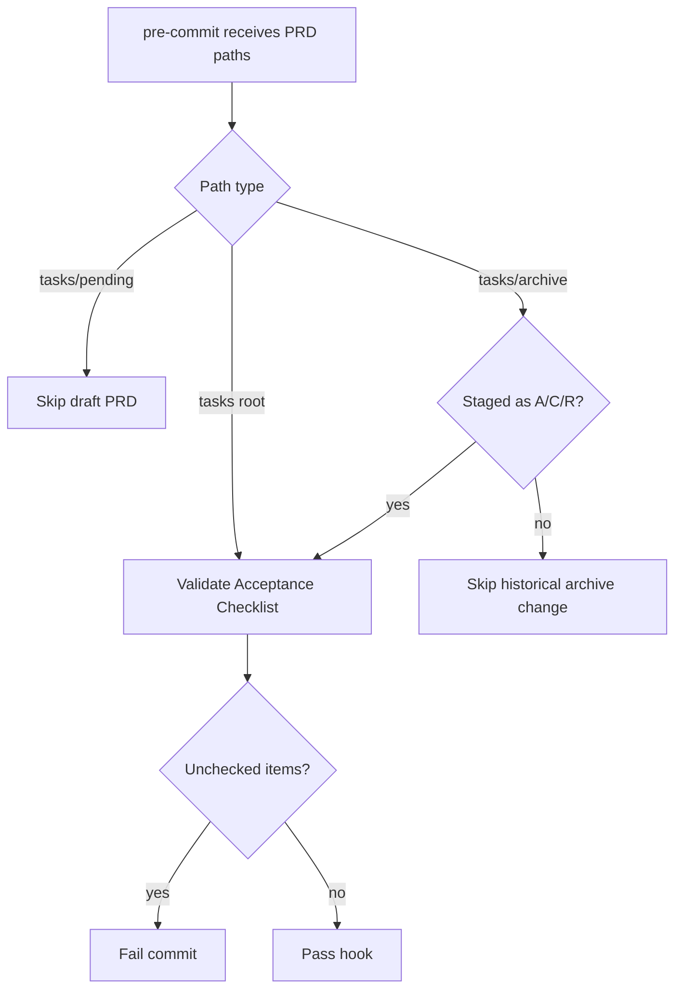

# PRD: Archive-Aware PRD Checklist Hook

## 1. Introduction & Goals

本需求把 `aibot` 仓库中已经验证过的 PRD 交付治理规则同步到当前模板仓库。

目标是让模板仓库也具备同样的工作流语义：

- `tasks/pending/` 是草稿区，可以保留未完成验收项
- `tasks/` 根目录是 active PRD 区，提交前必须完成验收清单
- `tasks/archive/` 是完成态沉淀区，新进入 archive 的 PRD 必须完成验收清单
- 历史 archive PRD 不因为普通修改被新规则批量翻旧账
- 中英文或双语验收清单标题都能被 hook 识别

### Measurable Objectives

- `check-prd-acceptance-checklist` pre-commit hook 能匹配 `tasks/archive/` 下的 PRD 文件
- hook 仅验证 Git index 中新增、复制或重命名进入 archive 的 PRD
- pending PRD 继续不参与验收清单检查
- 新增回归测试覆盖 active、pending、archive staged 和双语标题解析
- 文档说明同步到 AI standards 与 PRD 编写规范

---

## 2. Requirement Shape

- Actor: 仓库维护者、Codex/Claude/Cursor 等编码代理
- Trigger: 提交 active PRD 或把 PRD 归档到 `tasks/archive/`
- Expected behavior: 未完成验收项阻止 active 或新归档 PRD 进入提交；pending 草稿不阻止提交；历史 archive 文档不会被新规则扰动
- Explicit scope boundary: 只调整现有 hook、pre-commit 匹配、测试和文档；不新增独立任务状态系统、不改 `archive_tasks.py` 的移动逻辑

---

## 3. Repository Context And Architecture Fit

### Current Relevant Modules And Files

- `.pre-commit-config.yaml`
- `hooks/check_prd_acceptance_checklist.py`
- `hooks/archive_tasks.py`
- `tests/test_prd_acceptance_checklist.py`
- `docs/ai-standards/tooling.md`
- `docs/guides/prd-standard.md`

### Existing Path

当前仓库已经具备基础 PRD 治理能力：

- `archive_tasks.py` 会把 staged root-level task Markdown 归档到 `tasks/archive/`
- `check_prd_acceptance_checklist.py` 会检查 root-level active PRD 的验收清单
- `.pre-commit-config.yaml` 已经把两个 hook 接入本地 pre-commit
- `tests/test_prd_acceptance_checklist.py` 已经有基础回归测试

缺口是 archive 入口语义不完整：PRD 新进入 archive 时没有再次作为完成态边界被检查，且中文/双语验收清单标题无法识别。

### Reuse Candidates

- 复用现有 `hooks/check_prd_acceptance_checklist.py`，仅扩展候选路径判定
- 复用现有 `.pre-commit-config.yaml` 本地 hook
- 复用现有 `tests/test_prd_acceptance_checklist.py` importlib 测试风格
- 复用 `docs/ai-standards/tooling.md` 作为工具链规则入口

### Constraints

- 不检查 `tasks/pending/`，避免草稿 PRD 在尚未交付时阻塞提交
- 不全量重检历史 archive PRD，避免新规范制造历史债务爆炸
- Python 文本 I/O 必须显式使用 `encoding="utf-8"`
- 文档流程变更必须同步 `docs/`

---

## 4. Options And Recommendation

### Option A: Extend The Existing Hook In Place

在现有 hook 中增加：

- repo-relative path helper
- archived PRD path 判定
- Git index 中 `A/C/R` archive PRD 收集
- bilingual checklist heading regex

优点：

- 最小改动
- 与现有 pre-commit 和测试结构一致
- 不引入新抽象或新命令

缺点：

- hook 需要理解一小段 Git index 语义

### Option B: Add A Separate Archive PRD Hook

新增第二个 local hook 专门检查 archive PRD。

优点：

- 单个 hook 名称语义更窄

缺点：

- 增加 pre-commit 配置复杂度
- 与现有 checklist 解析逻辑重复
- 更容易出现 active 和 archive 检查行为漂移

### Recommendation

选择 Option A。当前已有 hook 的职责就是 PRD 验收清单检查，archive-aware 行为只是候选文件选择的增强，不需要新增并行 hook。

---

## 5. Change Matrix

| 改动对象 | 当前状态 | 目标状态 | 修改方式 | 为什么符合现有架构 | 影响文件 |
|---|---|---|---|---|---|
| PRD checklist hook | 只检查 root-level active PRD | 检查 active PRD 和新进入 archive 的 PRD | 扩展候选路径和 staged archive 识别 | 复用现有 hook 边界 | `hooks/check_prd_acceptance_checklist.py` |
| pre-commit 匹配 | 排除 archive 和 pending | 匹配 root PRD 与 archive PRD，继续不匹配 pending | 更新 `files` regex | pre-commit 仍是统一入口 | `.pre-commit-config.yaml` |
| Hook 回归测试 | 覆盖 active 与 checklist 基础行为 | 覆盖 active、pending、archive staged、双语标题 | 扩展现有测试文件 | 保留现有测试风格 | `tests/test_prd_acceptance_checklist.py` |
| 工具链文档 | 未说明 archive-aware 规则 | 说明 pending、active、archive 的提交流程语义 | 更新 tooling standards 和 PRD 标准 | 规则在 source of truth 可发现 | `docs/ai-standards/tooling.md`, `docs/guides/prd-standard.md` |

---

## 6. Flow

No low-fidelity prototype required for this PRD.

No interactive prototype file changes in this PRD.

No data model changes in this PRD.

---

## 7. Definition Of Done

- PRD checklist hook validates active root PRDs and newly staged archive PRDs
- Pending PRDs remain exempt
- Existing archive PRDs are not rechecked unless newly staged into archive as add/copy/rename
- English, Chinese, and bilingual acceptance checklist headings are accepted
- Targeted pytest coverage passes
- Documentation and PRD are synchronized with delivered behavior

---

## 8. Acceptance Checklist

### Behavior Acceptance

- [x] `tasks/` root-level PRDs are still checklist validation candidates
- [x] `tasks/pending/` PRDs remain exempt from checklist validation
- [x] `tasks/archive/` PRDs are candidates only when staged as added, copied, or renamed archive targets
- [x] Bilingual headings such as `## 7. Acceptance Checklist（验收清单）` are parsed correctly

### Documentation Acceptance

- [x] `docs/ai-standards/tooling.md` documents the pending/active/archive PRD hook semantics
- [x] `docs/guides/prd-standard.md` explains the updated checklist validation scope

### Validation Acceptance

- [x] `uv run pytest tests/test_prd_acceptance_checklist.py -q` passes
- [x] `uv run pytest tests/test_archive_tasks.py tests/test_prd_acceptance_checklist.py -q` passes
- [x] `uv run pytest -q` passes
- [x] `uv run python hooks/check_prd_acceptance_checklist.py` passes
- [x] `uv run python hooks/check_guidelines_consistency.py` passes
- [x] `uv run mkdocs build` passes
- [x] `git diff --check` passes

---

## 9. Non-Goals

- Do not redesign `archive_tasks.py`
- Do not introduce a new task status database or metadata file
- Do not rewrite historical archived PRDs
- Do not add a separate duplicate hook for archive-only checklist validation

---

## 10. User Stories

### Story 1: Maintainer Archives A Completed PRD

As a maintainer, I want a PRD newly entering `tasks/archive/` to be checked for completed acceptance items so that archive represents a completed delivery state.

Acceptance criteria:

- A staged archive PRD with unchecked acceptance items fails the checklist hook
- A staged archive PRD with all acceptance items checked passes the checklist hook

### Story 2: Agent Keeps Draft Work In Pending

As an AI coding agent, I want draft PRDs under `tasks/pending/` to remain exempt so that incomplete planning does not block unrelated commits.

Acceptance criteria:

- Pending PRDs are ignored by the checklist candidate selector

---

## 11. Functional Requirements

- FR-1: The pre-commit hook MUST match PRD files under `tasks/` root and `tasks/archive/`.
- FR-2: The hook MUST exclude `tasks/pending/`.
- FR-3: The hook MUST validate archive PRDs only when they are staged as added, copied, or renamed archive targets.
- FR-4: The hook MUST support `Acceptance Checklist`, `验收清单`, and bilingual headings.
- FR-5: The hook MUST ignore unchecked boxes outside the acceptance checklist section.

---

## 12. Decision Log

| # | 决策问题 | 选择 | 放弃的方案 | 理由 |
|---|---|---|---|---|
| D-01 | Hook 结构 | 扩展现有 checklist hook | 新增 archive-only hook | archive-aware 行为只影响候选文件选择，新增 hook 会重复 checklist 解析逻辑 |
| D-02 | Archive 检查范围 | 只检查 staged A/C/R archive PRD | 全量检查所有 archive PRD | 全量检查会让历史归档文档承担新规则债务 |
| D-03 | 文档落点 | 更新 AI tooling standards 和 PRD standard | 只改代码和测试 | 提交流程语义属于长期维护规则，必须让维护者和 AI 代理可发现 |

---

## 13. Delivery Notes

- Implemented archive-aware PRD candidate selection in `hooks/check_prd_acceptance_checklist.py`.
- Updated pre-commit matching so archive PRDs can enter the hook while pending PRDs remain excluded.
- Added regression tests for active, pending, staged archive, Git-index archive discovery, and bilingual heading parsing.
- Updated documentation in `docs/ai-standards/tooling.md` and `docs/guides/prd-standard.md`.
- `uv run ruff check ...` and `uv run ruff format --check ...` were attempted, but the current uv environment does not provide a `ruff` executable.
