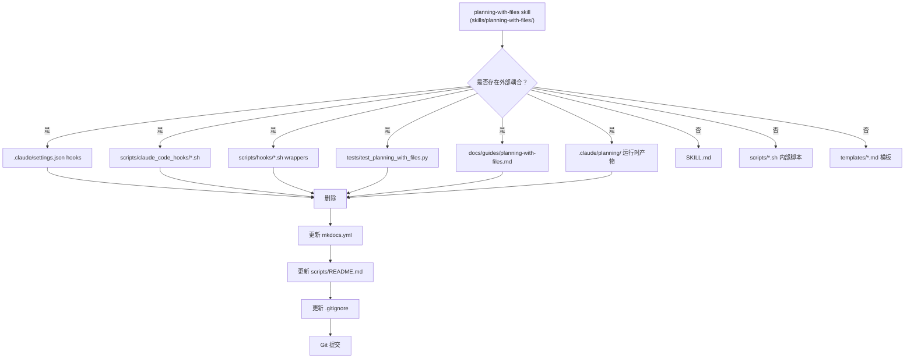

# PRD: Decouple planning-with-files from Project-Level Assistants

## 1. Introduction & Goals

`planning-with-files` skill 当前通过多个项目层面的外部组件获得辅助支持：Claude Code settings hooks、wrapper 脚本、项目级测试、MkDocs 文档引用等。这些耦合使得 skill 的行为不仅由其内部文件定义，还依赖于项目层面的隐式配置。

本 PRD 的目标是**识别并移除 `skills/planning-with-files/` 目录外部的全部耦合点**，使 skill 完全自洽——即其行为仅由 `SKILL.md` 和 `scripts/`、`templates/` 内部文件定义，项目其余部分不为其提供任何特殊支持。

**可衡量目标：**
- 项目根目录（排除 `skills/planning-with-files/`）中针对该 skill 的引用数量降为 0
- skill 内部文件零修改
- 删除后 `init-session.sh` 和 `archive-session.sh` 仍可独立运行

---

## 2. Requirement Shape

| 属性 | 描述 |
|---|---|
| **执行者** | 仓库维护者 |
| **触发条件** | `planning-with-files` skill 需要解耦，消除项目层面的外部辅助 |
| **预期行为** | 删除/修改所有 `skills/planning-with-files/` 目录外部的引用和辅助文件 |
| **范围边界** | 仅处理 skill 目录外部的耦合；skill 内部文件（SKILL.md、scripts/、templates/、examples.md、reference.md）完全不动 |

---

## 3. Worth-Doing Justification

**为什么现在做这件事：**
- 当前 skill 与项目存在隐式耦合：`.claude/settings.json` 中的 hooks、转发 wrapper 脚本、外部测试。维护者必须同时理解项目层面的 hook 配置和 skill 内部逻辑，才能完整掌握 skill 的行为。
- 这种耦合违背了 skill 作为"可移植、自包含能力单元"的设计意图。

**解决的具体问题：**
- 消除隐式依赖后，阅读 `skills/planning-with-files/SKILL.md` 即可完整理解 skill 的行为和生命周期。
- skill 的调试不再受项目层面 hook 的干扰。

**不做的代价：**
- 项目层面的 hook 配置（如 `.claude/settings.json`）会随 AI 工具版本变化而失效，导致 skill 的行为 unexpectedly 变化。
- 外部测试 `tests/test_planning_with_files.py` 需要同时维护技能脚本路径和测试文件路径，增加维护负担。

---

## 4. Repository Context And Architecture Fit

### Current External Coupling Structure

```
.claude/settings.json --> scripts/claude_code_hooks/session-start.sh
                        |-- scripts/claude_code_hooks/session-end.sh
                        +-- scripts/claude_code_hooks/pre-compact.sh

scripts/hooks/session-start.sh --> scripts/claude_code_hooks/session-start.sh
scripts/hooks/session-end.sh   --> scripts/claude_code_hooks/session-end.sh
scripts/hooks/pre-compact.sh   --> scripts/claude_code_hooks/pre-compact.sh

tests/test_planning_with_files.py --> skills/planning-with-files/scripts/*.sh
docs/guides/planning-with-files.md --> skill 使用指南
mkdocs.yml --> guides/planning-with-files.md (导航)
.gitignore --> .claude/planning/
```

### Architecture Reality
- `planning-with-files` **核心已自包含**：`SKILL.md` 定义了完整的初始化、归档、状态更新流程；`scripts/` 包含全部可执行脚本；`templates/` 包含全部模板。
- 上述所有外部组件都是**项目层面对 skill 的辅助包装**，而非 skill 运行所必需。

---

## 5. Responsibility Landing Zone

| 问题 | 答案 |
|---|---|
| **目标模块/层/文件** | 分散的删除型变更：配置（`.claude/settings*.json`）、脚本（`scripts/claude_code_hooks/`、`scripts/hooks/*.sh`）、测试（`tests/`）、文档（`docs/`、`mkdocs.yml`）、忽略规则（`.gitignore`） |
| **目标文件健康状况** | 所有目标文件均职责单一，删除不会波及其他功能 |
| **变更是否可直接进入目标文件？** | 是。本次变更以删除为主，无需提取模块 |

---

## 6. Options And Recommendation

**为什么不需要正式对比：**
- 本需求只有一个明确目标：移除 skill 外部的全部耦合点。不存在架构分支或多路径选择。
- 所有外部组件均为辅助性质，删除后 skill 核心功能不受影响。

**推荐方案：**
1. 删除 Claude Code hook 配置和脚本
2. 删除运行时产物目录
3. 删除外部测试和文档
4. 更新 `mkdocs.yml`、`scripts/README.md`、`.gitignore`

---

## 7. Implementation Guide

### Core Logic
1. 删除 `.claude/settings.json`（仅含 hooks，全部与 planning-with-files 相关）
2. 修改 `.claude/settings.local.json`，移除 planning-with-files 相关权限行
3. 删除 `.claude/planning/current/` 和 `.claude/planning/sessions/` 运行时产物
4. 删除 `scripts/claude_code_hooks/` 目录及其 3 个脚本
5. 删除 `scripts/hooks/` 下的 3 个 wrapper 脚本
6. 删除 `tests/test_planning_with_files.py`
7. 删除 `docs/guides/planning-with-files.md`
8. 从 `mkdocs.yml` 移除 `Planning Skill` 导航项
9. 从 `scripts/README.md` 移除 `claude_code_hooks` 提及
10. 从 `.gitignore` 移除 `.claude/planning/` 规则

### Change Matrix

| 变更目标 | 当前状态 | 目标状态 | 修改方式 | 为何适配现有架构 | 影响文件 |
|---|---|---|---|---|---|
| Claude Code hooks 配置 | `.claude/settings.json` 定义了 SessionStart/Stop/PreCompact hooks | 无 hooks | 删除文件 | skill 不应依赖特定 AI 工具的 settings 配置 | `.claude/settings.json` |
| Claude Code 权限 | `.claude/settings.local.json` 包含 planning 相关权限 | 移除这些行 | 编辑文件 | 权限配置不应为单个 skill 特例 | `.claude/settings.local.json` |
| Hook 脚本 | `scripts/claude_code_hooks/*.sh` + `scripts/hooks/*.sh` wrappers | 无 | 删除目录 + wrappers | 项目不应为 skill 提供生命周期 hook 包装 | `scripts/claude_code_hooks/`、`scripts/hooks/session-{start,end}.sh`、`scripts/hooks/pre-compact.sh` |
| Planning 运行时 | `.claude/planning/current/` 和 `sessions/` 存在 | 无 | 删除全部内容 | 运行时产物由 skill 在使用时按需创建 | `.claude/planning/current/`、`.claude/planning/sessions/` |
| 外部测试 | `tests/test_planning_with_files.py` 测试 skill 脚本 | 无 | 删除文件 | 测试应内聚于 skill 内部 | `tests/test_planning_with_files.py` |
| 外部文档 | `docs/guides/planning-with-files.md` 解释 skill 用法 | 无 | 删除文件 | 使用说明应在 SKILL.md 中自包含 | `docs/guides/planning-with-files.md` |
| MkDocs 导航 | `mkdocs.yml` 引用了 planning-with-files 指南 | 无引用 | 删除第61行 | 导航不应包含已删除的文档 | `mkdocs.yml` |
| scripts/README | 提及 `claude_code_hooks/` | 不提及 | 修改第6行 | README 不应描述已删除的目录 | `scripts/README.md` |
| .gitignore | 忽略 `.claude/planning/` | 不忽略 | 删除第60行 | 项目不应为 skill 运行时产物提供 git 忽略规则 | `.gitignore` |

### Flow / Architecture Diagram



### ER Diagram
- 本 PRD 无数据模型变更。

### Interactive Prototype Change Log
- 本 PRD 无交互式原型文件变更。

### External Validation
- 无需外部验证；仓库内部证据已充分。

---

## 8. Definition Of Done

- [x] `.claude/settings.json` 已删除
- [x] `.claude/settings.local.json` 中 planning-related 权限已移除
- [x] `.claude/planning/` 运行时产物已清理
- [x] `scripts/claude_code_hooks/` 目录已删除
- [x] `scripts/hooks/` wrappers 已删除
- [x] `tests/test_planning_with_files.py` 已删除
- [x] `docs/guides/planning-with-files.md` 已删除
- [x] `mkdocs.yml` 中 Planning Skill 导航已移除
- [x] `scripts/README.md` 中 claude_code_hooks 提及已移除
- [x] `.gitignore` 中 `.claude/planning/` 规则已移除
- [x] `skills/planning-with-files/` 内部文件未被修改
- [x] Git 提交记录了清理变更

---

## 9. Acceptance Checklist

### Architecture Acceptance
- [x] `.claude/settings.json` 不存在
- [x] `scripts/claude_code_hooks/` 目录不存在
- [x] `scripts/hooks/` 下不存在 `session-start.sh`、`session-end.sh`、`pre-compact.sh`
- [x] `tests/test_planning_with_files.py` 不存在
- [x] `docs/guides/planning-with-files.md` 不存在

### Dependency Acceptance
- [x] `mkdocs.yml` 中未引用 `guides/planning-with-files.md`
- [x] `scripts/README.md` 中未提及 `claude_code_hooks`
- [x] `.gitignore` 中不包含 `.claude/planning/`
- [x] `.claude/settings.local.json` 中不包含 `archive-session.sh` 或 `.claude/planning/current` 相关权限

### Behavior Acceptance
- [x] `bash skills/planning-with-files/scripts/init-session.sh` 仍可独立运行
- [x] `bash skills/planning-with-files/scripts/archive-session.sh` 仍可独立运行
- [x] `skills/planning-with-files/SKILL.md` 未被修改

### Validation Acceptance
- [x] 在项目根目录执行全局搜索，`planning-with-files`、`claude_code_hooks`、`.claude/planning` 在 `skills/planning-with-files/` 外的匹配数为 0

---

## 10. User Stories

- **US-1**：作为仓库维护者，我希望 `planning-with-files` skill 不依赖项目层面的 `.claude/settings.json` hooks，以便 skill 在任何宿主项目中的行为完全一致，不受宿主项目 AI 工具配置的影响。
- **US-2**：作为开发者，我希望通过阅读 `skills/planning-with-files/SKILL.md` 就能完整理解 skill 的工作原理，无需同时查看项目层面的 wrapper 脚本和 hook 配置。

---

## 11. Functional Requirements

- **FR-1**：删除 `.claude/settings.json`。
- **FR-2**：从 `.claude/settings.local.json` 中移除 `"Bash(mkdir -p .claude/planning/current)"` 和 `"Bash(bash skills/planning-with-files/scripts/archive-session.sh \"test-project\")"` 权限行。
- **FR-3**：删除 `scripts/claude_code_hooks/` 目录及其全部内容。
- **FR-4**：删除 `scripts/hooks/session-start.sh`、`scripts/hooks/session-end.sh`、`scripts/hooks/pre-compact.sh`。
- **FR-5**：删除 `.claude/planning/current/` 及 `.claude/planning/sessions/` 的全部内容。
- **FR-6**：删除 `tests/test_planning_with_files.py`。
- **FR-7**：删除 `docs/guides/planning-with-files.md`。
- **FR-8**：从 `mkdocs.yml` 中移除 `Planning Skill: guides/planning-with-files.md`。
- **FR-9**：从 `scripts/README.md` 中移除对 `claude_code_hooks/` 的提及。
- **FR-10**：从 `.gitignore` 中移除 `.claude/planning/` 忽略规则。

---

## 12. Non-Goals

- 不修改 `skills/planning-with-files/` 内部的任何文件。
- 不删除其他与 `planning-with-files` 无关的项目文件。
- 不修改 skill 的核心逻辑、脚本或模板。
- 不将外部测试移至 skill 内部。
- 不修改 `.claude/settings.local.json` 中与 planning-with-files 无关的权限。

---

## 13. Risks And Follow-Ups

| 风险 | 可能性 | 影响 | 缓解措施 |
|---|---|---|---|
| `.claude/settings.local.json` 中误删非 planning-with-files 权限 | 低 | 中 | 仅精确删除两行 |
| 删除后项目层面的 Claude Code 失去 session 恢复功能 | 高（设计如此） | 低 | 预期行为——skill 自身管理生命周期 |
| `docs/guides/planning-with-files.md` 在其他地方被引用 | 低 | 低 | 已检查，仅被 `mkdocs.yml` 引用 |

**后续跟进：**
- 如果后续需要为 skill 添加内部测试，可在 `skills/planning-with-files/` 内创建 `tests/` 目录，不依赖项目层面的 `tests/`。

---

## 14. Decision Log

| ID | 决策问题 | 选择 | 拒绝 | 理由 |
|---|---|---|---|---|
| D-01 | 是否保留 `.claude/settings.json` 中 hooks 以外的内容？ | 删除整个文件 | 仅删除 hooks 部分 | 该文件仅包含 hooks，全部与 planning-with-files 相关 |
| D-02 | 是否删除整个 `.claude/settings.local.json`？ | 仅删除 planning-with-files 相关行 | 删除整个文件 | 文件中包含大量项目通用权限，删除整个文件会影响其他功能 |
| D-03 | 是否保留 `.claude/planning/` 作为示例？ | 删除全部运行时产物 | 保留 | 运行时产物应由 skill 在使用时创建 |
| D-04 | 删除 wrapper 后是否保留空的 `scripts/hooks/` 目录？ | 删除空目录 | 保留空目录 | 空目录无意义 |
| D-05 | 是否将外部测试移至 skill 内部？ | 删除（不移动） | 移至 skill 内部 | skill 当前无测试目录结构，不引入新结构 |

---

## Appendix: Post-Execution Correction

执行过程中发现了一处初始仓库扫描未识别的额外外部耦合：

| 发现 | 位置 | 已执行操作 |
|---|---|---|
| Git post-commit hook | `hooks/archive_planning_session.sh` | **已删除** |
| Pre-commit 配置 | `.pre-commit-config.yaml` 第83-89行（`archive-planning-session` hook） | **已移除** |

**理由**：`archive_planning_session.sh` 是项目层面的 git hook，在每次提交时自动调用 skill 的 `archive-session.sh`。这正是本 PRD 旨在移除的"项目层面辅助"。skill 的 `archive-session.sh` 在手动调用时仍然完全可用。

**更新后的验证命令**（勘误后）：
```bash
grep -rn "planning-with-files\|planning_with_files\|claude_code_hooks\|archive_planning_session\|\.claude/planning" \
  --include="*.json" --include="*.py" --include="*.sh" --include="*.md" --include="*.yml" --include="*.yaml" \
  . | grep -v "skills/planning-with-files/"
# 结果：0 匹配
```
