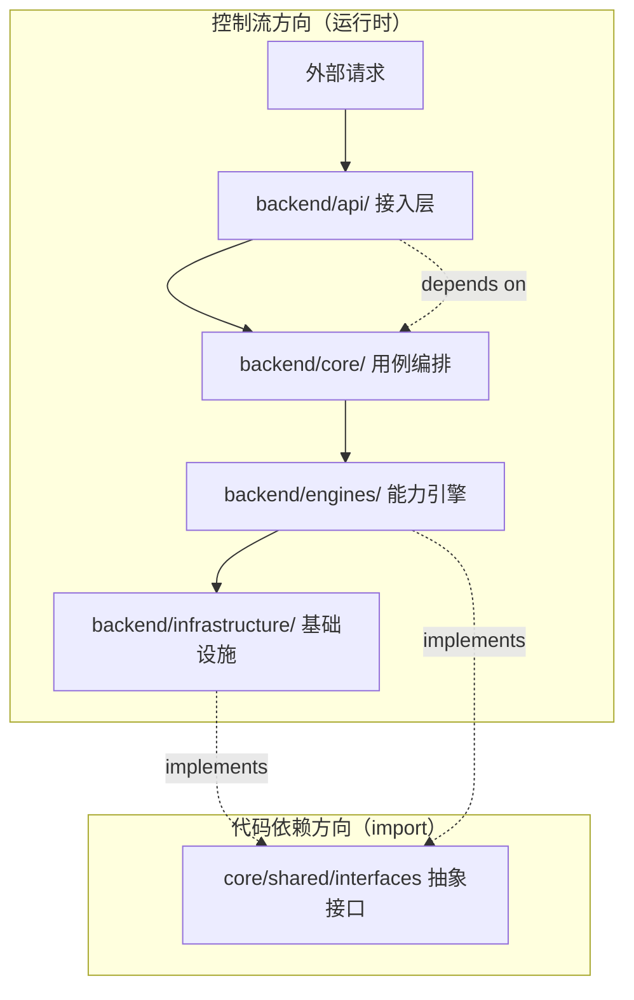

# PRD: Rename `apps` → `api` & `capabilities` → `engines` & Clarify Dependency Direction

## 1. Introduction & Goals

当前后端四层架构已经建立，但存在三个命名与文档层面的问题：

1. **`backend/apps/` 命名不清晰**：该层职责是 HTTP/WebSocket/CLI 请求接入、参数校验和 DTO 转换，但 `apps` 在 Django/FastAPI 生态中通常指「应用实例」或「业务模块」，容易与「可独立部署的 app」混淆。改名为 `api` 能更直接地表达「系统边界外的请求接入点」这层含义。
2. **`backend/capabilities/` 排序不协调**：字母排序为 `apps < capabilities < core < infrastructure`，`capabilities` 排在 `core` 之前，与「核心编排 → 能力实现」的控制流方向相悖。改为 `engines` 后排序为 `api < core < engines < infrastructure`，使目录顺序与控制流方向一致。
3. **架构文档的依赖方向图存在歧义**：`docs/architecture/system-design.md` 与 `docs/ai-standards/architecture.md` 中使用的箭头图 `Apps -> Core -> Capabilities -> Infrastructure` 在 Clean Architecture 语境下容易被误解为「内层依赖外层」，与实际的 import 规则（内层不得导入外层）矛盾。

### Measurable Objectives

- 将 `backend/apps/` 目录及所有引用重命名为 `backend/api/`，不遗留旧路径或兼容层
- 将 `backend/capabilities/` 目录及所有引用重命名为 `backend/engines/`，不遗留旧路径或兼容层
- 修正所有文档中的依赖方向图示与文字描述，消除歧义
- 更新自动化架构检查脚本，使其基于新层名执行验证
- 重命名后的目录结构保持四层边界清晰，不引入新的架构违规

---

## 2. Requirement Shape

- **Actor**: 维护架构规范的开发者、AI 编码代理
- **Trigger**: 开发新功能时受到层名误导（`apps` 语义模糊、`capabilities` 排序反直觉）
- **Expected behavior**:
  - 目录 `backend/apps/` 物理重命名为 `backend/api/`
  - 目录 `backend/capabilities/` 物理重命名为 `backend/engines/`
  - 所有文档、脚本、入口文件中的旧层名引用同步替换
  - 文档中的依赖方向图明确标注为「依赖/导入方向」或「控制流方向」，二者不可混用
- **Scope boundary**:
  - 不涉及 `backend/core/`、`backend/engines/`、`backend/infrastructure/` 内部模块的业务逻辑变更
  - 不涉及新增 HTTP 路由、用例或能力实现
  - 不改 frontend 目录或前后端通信协议

---

## 3. Repository Context And Architecture Fit

- **Existing paths**: `backend/apps/`（仅含 `__init__.py`，为空模块占位）；`backend/capabilities/`（含 `__init__.py`，为空扩展点）
- **Reuse candidates**: 无业务逻辑可复用；仅迁移目录和文档引用
- **Architecture pattern to preserve**: Clean Architecture 四层边界（接入层 → 核心编排层 → 平台能力/引擎层 → 基础设施层），依赖方向始终向内
- **Constraints**:
  - `hooks/check_architecture.py` 通过 AST 扫描 `backend/` 下的 import，层名硬编码在 `LAYER_ORDER` 和 `FORBIDDEN_IMPORTS` 中
  - `docs/architecture/system-design.md` 被多处入口文件（`CLAUDE.md`、`AGENTS.md`、`docs/ai-standards/architecture.md`）引用
  - `pre-commit` 会对 `tasks/` 根目录下的 active PRD 检查 Acceptance Checklist 完成状态
- **Redundancy risks**:
  - 若保留旧名作为兼容层或符号链接，会造成同一职责的双路径，增加架构检查复杂度
  - 若只改目录不改文档，规范与代码将长期脱节

---

## 4. Recommendation

### Recommended Approach

采用**最小改动重命名 + 文档一致性修复**：

1. 物理重命名 `backend/apps/` → `backend/api/`
2. 物理重命名 `backend/capabilities/` → `backend/engines/`
3. 全局搜索替换所有文档和脚本中的旧层名引用（路径 + Python 模块引用）
4. 修正 `docs/architecture/system-design.md` 和 `docs/ai-standards/architecture.md` 中的依赖方向描述：
   - 如果箭头表示「控制流/运行时调用链」，应明确标注
   - 补充正确的「代码依赖/ import 方向」图（外层向内层）
5. 更新 `hooks/check_architecture.py` 的 `LAYER_ORDER` 和 `FORBIDDEN_IMPORTS`，将 `apps` 替换为 `api`、`capabilities` 替换为 `engines`
6. 更新各层 `__init__.py` 的模块 docstring，使用新层名

**Why this is the best fit**:
- 当前 `backend/apps/` 和 `backend/capabilities/` 近乎为空，不存在业务逻辑迁移风险
- 不需要引入兼容层或 shim，一次性完成目标态成本最低
- 重命名本身不改变 Clean Architecture 的边界规则
- `engines` 命名更贴合「引擎驱动的可插拔能力」这一语义

### Alternatives Considered

- **Alternative: 保留旧名，仅更新文档**
  - **Why not chosen**: 命名本身的歧义（`apps`）和排序问题（`capabilities` 排在 `core` 前）不解决，文档修正只能缓解症状，不能根除误解。

- **Alternative: 只改目录不改文档中的箭头图**
  - **Why not chosen**: 箭头图的歧义是本次架构治理要一并解决的问题，只改目录属于半吊子交付，后续仍会引发新的误解。

---

## 5. Implementation Guide

### 5.1 Core Logic

本次改动无业务逻辑变更，核心工作流是「目录迁移 → 引用替换 → 文档修正 → 脚本更新 → 验证」。

### 5.2 Change Matrix

| Change Target | Current State | Target State | How to Modify | Affected Files |
|---|---|---|---|---|
| Ingress layer directory | `backend/apps/` | `backend/api/` | `git mv backend/apps backend/api` | `backend/apps/*` → `backend/api/*` |
| Platform capability layer directory | `backend/capabilities/` | `backend/engines/` | `git mv backend/capabilities backend/engines` | `backend/capabilities/*` → `backend/engines/*` |
| Ingress layer docstring | 描述 `backend/apps/` 职责 | 描述 `backend/api/` 职责 | 修改 `__init__.py` 中的 docstring 层名 | `backend/api/__init__.py` |
| Platform capability layer docstring | 描述 `backend/capabilities/` 职责 | 描述 `backend/engines/` 职责 | 修改 `__init__.py` 中的 docstring 层名 | `backend/engines/__init__.py` |
| Architecture check script | 层名 `apps`, `capabilities` | 层名 `api`, `engines` | 替换 `LAYER_ORDER`、`FORBIDDEN_IMPORTS`、注释中的层名 | `hooks/check_architecture.py` |
| System design doc | 箭头图 `Apps -> Core -> Capabilities -> Infrastructure`，未标注方向含义 | 补充「控制流方向」与「代码依赖方向」两组图示，避免混用 | 修改 Mermaid 图表和周围说明文字 | `docs/architecture/system-design.md` |
| AI standards doc | 引用旧层名和旧箭头图 | 引用新层名和修正后的图示 | 同步替换路径和图示 | `docs/ai-standards/architecture.md` |
| Claude/Agents entry files | 引用旧层名 | 引用新层名 | 同步替换路径 | `CLAUDE.md`, `AGENTS.md` |
| Copilot / Cursor / GitHub instructions | 引用旧层名 | 引用新层名 | 同步替换路径 | `.github/copilot-instructions.md`, `.github/instructions/backend.instructions.md` |
| README / docs index | 引用旧层名 | 引用新层名 | 同步替换路径 | `README.md`, `docs/index.md`, `docs/getting-started.md` |
| Guarantee checker script | 检查 `backend/apps/` 的存在 | 检查 `backend/api/` 的存在 | 更新 `check_guidelines_consistency.py` 中的短语表 | `hooks/check_guidelines_consistency.py` |
| Composition root | `backend/main.py` 未引用旧层名 | 确保无残留引用 | 全局搜索确认 | `backend/main.py` |

### 5.3 Flow Or Architecture Diagram

### 5.4 Low-Fidelity Prototype

No low-fidelity prototype required for this PRD.

### 5.5 ER Diagram

No data model changes in this PRD.

### 5.6 Affected Files

| File | Change Type | Description |
|---|---|---|
| `backend/apps/__init__.py` | Delete | 随 `apps` 目录迁移删除 |
| `backend/api/__init__.py` | Modify | docstring 更新层名为 `api` |
| `backend/capabilities/__init__.py` | Delete | 随 `capabilities` 目录迁移删除 |
| `backend/engines/__init__.py` | Modify | docstring 更新层名为 `engines` |
| `backend/core/__init__.py` | Modify | docstring 中路径引用更新 |
| `backend/core/shared/__init__.py` | Modify | docstring 中路径引用更新 |
| `backend/core/shared/interfaces/__init__.py` | Modify | docstring 中路径引用更新 |
| `backend/infrastructure/__init__.py` | Modify | docstring 中路径引用更新 |
| `backend/infrastructure/http_clients/__init__.py` | Modify | docstring 中路径引用更新 |
| `hooks/check_architecture.py` | Modify | 层名 `apps` → `api`, `capabilities` → `engines` |
| `hooks/check_guidelines_consistency.py` | Modify | 检查短语 `backend/apps/` → `backend/api/` |
| `docs/architecture/system-design.md` | Modify | 替换层名；修正依赖方向图歧义 |
| `docs/architecture/frontend-architecture.md` | Modify | 替换层名引用 |
| `docs/ai-standards/architecture.md` | Modify | 替换层名；同步图示和依赖方向描述 |
| `CLAUDE.md` | Modify | 替换层名引用 |
| `AGENTS.md` | Modify | 替换层名引用 |
| `.github/copilot-instructions.md` | Modify | 替换层名引用 |
| `.github/instructions/backend.instructions.md` | Modify | 替换层名引用 |
| `README.md` | Modify | 替换层名引用 |
| `docs/index.md` | Modify | 替换层名引用 |
| `docs/getting-started.md` | Modify | 替换层名引用 |
| `tasks/archive/20260518-164340-prd-decouple-template-from-business.md` | Modify | 路径引用更新 |
| `tests/test_sync_template.py` | Modify | 路径引用更新 |

### 5.7 Interactive Prototype Change Log

No interactive prototype file changes in this PRD.

### 5.8 External Validation

No external validation required; repository evidence was sufficient.

---

## 6. Definition Of Done

- [x] `backend/apps/` 已物理重命名为 `backend/api/`，无旧目录残留
- [x] `backend/capabilities/` 已物理重命名为 `backend/engines/`，无旧目录残留
- [x] `backend/api/__init__.py` 的 docstring 已更新为 `api` 层名
- [x] `backend/engines/__init__.py` 的 docstring 已更新为 `engines` 层名
- [x] `hooks/check_architecture.py` 的层名与注释已全部替换为 `api` 和 `engines`
- [x] 架构文档（`system-design.md`、`architecture.md`）中的旧层名引用和歧义箭头图已修正
- [x] 所有工具入口文件（`CLAUDE.md`、`AGENTS.md`、Copilot instructions 等）中的旧层名引用已同步
- [x] 依赖方向图已补充「控制流方向」与「代码依赖方向」两组说明
- [x] Acceptance Checklist 全部勾选通过
- [x] 无新的架构违规引入

---

## 7. Acceptance Checklist

### Architecture Acceptance

- [x] 目录 `backend/apps/` 不存在于仓库中
- [x] 目录 `backend/api/` 存在且包含原 `backend/apps/` 的全部内容（含 `__init__.py`）
- [x] 目录 `backend/capabilities/` 不存在于仓库中
- [x] 目录 `backend/engines/` 存在且包含原 `backend/capabilities/` 的全部内容（含 `__init__.py`）
- [x] `backend/api/` 的模块 docstring 明确描述「请求接入层 / Ingress Layer」职责
- [x] `backend/engines/` 的模块 docstring 明确描述「平台能力引擎层」职责
- [x] 未新增除 `api`、`core`、`engines`、`infrastructure` 以外的第五层或兼容层

### Dependency Acceptance

- [x] `hooks/check_architecture.py` 的 `LAYER_ORDER` 中包含 `"api"` 和 `"engines"` 而非 `"apps"` 和 `"capabilities"`
- [x] `hooks/check_architecture.py` 的 `FORBIDDEN_IMPORTS` 中 `"api"` 的禁止目标与旧 `"apps"` 一致
- [x] `hooks/check_architecture.py` 的 `FORBIDDEN_IMPORTS` 中 `"engines"` 的禁止目标与旧 `"capabilities"` 一致
- [x] 运行 `uv run python hooks/check_architecture.py` 输出「架构依赖方向全部合法，无违规」
- [x] 仓库全局搜索（`grep -r "backend/apps\|backend.apps" --include="*.py" --include="*.md"`）无残留引用
- [x] 仓库全局搜索（`grep -r "backend/capabilities\|backend.capabilities" --include="*.py" --include="*.md"`）无残留引用

### Behavior Acceptance

- [x] `backend/api/__init__.py` 作为 Python 模块可正常 import（`python -c "import backend.api"` 不报错）
- [x] `backend/engines/__init__.py` 作为 Python 模块可正常 import（`python -c "import backend.engines"` 不报错）
- [x] `backend/main.py` 作为 composition root 可正常启动（若有启动命令则运行验证）

### Documentation Acceptance

- [x] `docs/architecture/system-design.md` 中的依赖方向图已补充「控制流」与「代码依赖」两组说明
- [x] `docs/ai-standards/architecture.md` 与 `docs/architecture/system-design.md` 在层名和图示上保持一致
- [x] `CLAUDE.md`、`AGENTS.md` 中引用的接入层路径已更新为 `backend/api/`，能力层路径已更新为 `backend/engines/`

### Validation Acceptance

- [x] `uv run python hooks/check_architecture.py` 通过
- [x] `just test` 或 `uv run pytest` 通过（确保无 import 路径断裂）
- [x] `uv run mkdocs build` 通过（确保文档内部链接无死链）
- [x] `git grep -n "apps" backend/ docs/ hooks/ CLAUDE.md AGENTS.md` 无与层名相关的误报残留
- [x] `git grep -n "capabilities" backend/ docs/ hooks/ CLAUDE.md AGENTS.md` 无与层名相关的误报残留

---

## 8. User Stories

### US-001: 开发者识别入口层职责
**Description:** As a 后端开发者，I want 接入层目录名直接反映「API 边界」职责，so that 我能在不看文档的情况下判断新路由应该放在哪一层。

**Acceptance Criteria:**
- [x] `backend/api/` 目录名明确对应「HTTP/WebSocket/CLI 请求接入」
- [x] 不存在 `backend/apps/` 这一旧路径造成混淆

### US-002: AI 编码代理遵循正确架构方向
**Description:** As a AI 编码代理，I want 架构文档中的箭头图不再把「控制流」和「依赖方向」混为一谈，so that 我不会在生成代码时错误地认为 core 可以 import engines。

**Acceptance Criteria:**
- [x] 文档中同时存在「控制流方向」和「代码依赖方向」两组图示或文字说明
- [x] `backend/core/` 不得 import `backend/engines/` 的规则在图示和文字中一致

### US-003: 自动化检查与目录名保持同步
**Description:** As a CI 维护者，I want 架构检查脚本使用 `api` 和 `engines` 作为层名，so that 重命名后的目录仍能被自动验证。

**Acceptance Criteria:**
- [x] `hooks/check_architecture.py` 扫描 `backend/api/` 和 `backend/engines/` 而非旧目录
- [x] 脚本对非法跨层 import 的报错信息中使用的层名为 `api` 和 `engines`

---

## 9. Functional Requirements

- FR-1: `backend/apps/` 目录必须物理重命名为 `backend/api/`，不得保留符号链接或兼容 shim
- FR-2: `backend/capabilities/` 目录必须物理重命名为 `backend/engines/`，不得保留符号链接或兼容 shim
- FR-3: `backend/api/__init__.py` 必须包含更新后的模块级 docstring，声明该层为「请求接入层 / Ingress Layer」
- FR-4: `backend/engines/__init__.py` 必须包含更新后的模块级 docstring，声明该层为「平台能力引擎层」
- FR-5: `hooks/check_architecture.py` 必须将层名 `apps` 全局替换为 `api`，`capabilities` 全局替换为 `engines`，检查逻辑本身保持不变
- FR-6: `docs/architecture/system-design.md` 和 `docs/ai-standards/architecture.md` 必须同步替换层名，并修正依赖方向图的歧义
- FR-7: 所有工具入口文件（`CLAUDE.md`、`AGENTS.md` 以及 `.github/` 下的指令文件）必须同步替换旧层名引用

---

## 10. Non-Goals

- 不在本次重命名中新增 HTTP 路由、CLI 命令、WebSocket handler 或任何业务逻辑
- 不改 `backend/core/`、`backend/engines/`、`backend/infrastructure/` 的内部模块名
- 不引入新的依赖注入框架或改变 `backend/main.py` 的 composition root 模式
- 不修改 `frontend/` 目录结构或前后端通信协议
- `engines` 仅表达「能力引擎层」语义，不代表引入独立的引擎注册/发现机制

---

## 11. Risks And Follow-Ups

- **Risk: 全局搜索替换可能误伤无关词汇**（如 "applications"、"perhaps" 中包含的 "apps" 子串）。缓解措施：使用路径匹配（`backend/apps`、`backend.apps`）进行替换。
- **Risk: 存在未扫描到的隐藏入口文件**引用了旧层名。缓解措施：交付前运行 `git grep -n "backend/apps\|backend/capabilities"` 做最终确认。
- **Follow-Up: 当 `backend/api/` 和 `backend/engines/` 开始填充实际代码后**，需补充各层的单元测试和接口契约文档。本次 PRD 不覆盖。

---

## 12. Decision Log

| # | 决策问题 | 选择 | 放弃的方案 | 理由 |
|---|---|---|---|---|
| D-01 | 重命名策略 | 物理重命名，不保留兼容层 | 保留旧名作为兼容 shim，逐步迁移 | 旧目录近乎为空，无业务逻辑需要过渡；双路径并存会增加架构检查复杂度 |
| D-02 | 文档箭头图修正方式 | 补充「控制流方向」和「代码依赖方向」两组说明 | 仅把箭头反向，不解释含义 | 单箭头图无法同时表达两种方向，补充双说明才能根治歧义 |
| D-03 | 是否同步修改所有入口文件 | 同步修改所有入口文件中的引用 | 仅修改 `docs/architecture/system-design.md` | 入口文件是 AI 代理读取规范的高频路径，路径不一致会降低规范信噪比 |
| D-04 | 是否在本次填充业务代码 | 不填充，仅保留 `__init__.py` | 趁重命名机会新增路由或用例 | 超出本次 PRD 范围，新增业务逻辑应单独规划，避免重命名 PRD 膨胀 |
| D-05 | `capabilities` 新层名选择 | `engines` | `extensions` / `providers` / `features` | `engines` 排序在 `core` 之后；语义贴切（RAG engine、OCR engine 等） |
