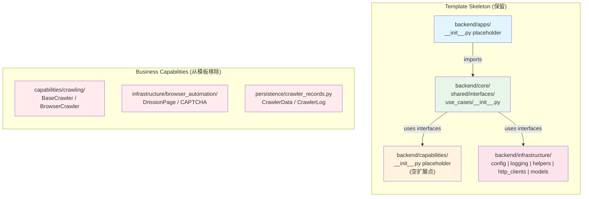
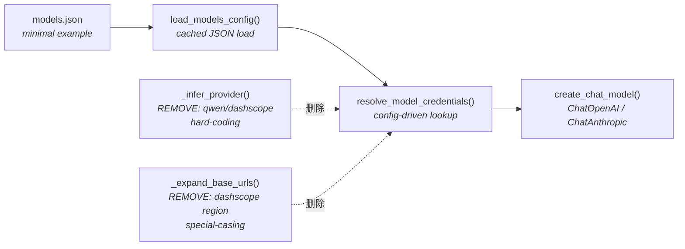

# PRD: Decouple Template Repository from Business Capabilities

## 1. Introduction & Goals

### Problem Statement

`zata_code_template` 已从纯净的项目骨架演变为一个"胖模板"，内嵌了具体的业务能力：爬虫（HTTP + 浏览器自动化）、硬编码的 LLM 提供商目录（DashScope/Qwen、OpenRouter）、RAG/Embedding 配置以及爬虫专用的持久化 schema。当通过 `just copy <name>` 创建新项目时，即使新项目只需要一个干净的后端 + 前端脚手架，它也会继承所有这些业务逻辑。

这种耦合带来了三个问题：

1. **污染新项目**：从模板生成的每个项目都自带用不到的爬虫、浏览器自动化和 RAG 代码，必须手动删除。
2. **漂移风险**：模板中的业务代码与骨架的演进速度不同。`just sync-template` 的更新可能会覆盖项目特定的爬虫修改，或强制引入不相关的变更。
3. **边界模糊**：四层架构（`apps/` → `core/` → `capabilities/` → `infrastructure/`）被稀释，因为 `capabilities/` 和 `infrastructure/` 的部分目录已经包含具体实现而非扩展点。

### Goals

- 将模板还原为**纯净骨架**：四层目录结构、通用工具链、AI 编码规范和项目管理脚本。
- 从模板中移除所有具体业务能力（爬虫、浏览器自动化、硬编码模型目录、RAG 默认值）。
- 保留**模型加载框架**（配置驱动的凭据解析），但剥离提供商特定的硬编码。
- 确保解耦后 `just copy`、`just sync-template`、`just test` 和 `just run` 仍能正常工作。

## 2. Requirement Shape

| 维度 | 详情 |
|---|---|
| **Actor** | 仓库维护者（创建/更新模板的人员）和下游开发者（从模板创建新项目的人员） |
| **Trigger** | 在下游项目中运行 `just copy <new-project>` 或 `just sync-template` |
| **Expected behavior** | 新项目只接收骨架。业务能力由项目团队显式添加，而非静默继承。 |
| **Explicit scope boundary** | 仅后端 Python 代码、测试、配置默认值和文档在范围内。前端脚手架（Vite + React + 通用 admin 布局）**不**属于业务特定代码，予以保留。Playwright E2E 包保留。`scripts/`、`hooks/`、`docs/ai-standards/` 保留。 |

## 3. Repository Context And Architecture Fit

### Current Tech Stack

- **Python 3.11+**，`uv` 包管理器，`just` 任务运行器
- `pre-commit` + Ruff 负责代码检查与格式化
- `pytest` 用于测试，`mkdocs` + `mkdocstrings` 用于文档
- 前端：Vite + React + TypeScript（独立，保留）
- Playwright E2E：独立的 TypeScript 包（保留）

### Current Architecture Boundaries

```text
backend/apps/           -> HTTP/CLI 入口（目前仅有 __init__.py）
backend/core/           -> 用例、共享接口、Agent 编排占位
backend/capabilities/   -> 具体能力：crawling/、rag/、skills/
backend/infrastructure/ -> 配置、日志、辅助函数、HTTP 客户端、模型、持久化、浏览器自动化
```

依赖方向（来自 `docs/ai-standards/architecture.md`）：

```text
apps/ -> core/ -> capabilities/ -> infrastructure/ -> 第三方包
```

### Existing Path Closest to the Change

`just copy` 和 `just sync-template` 脚本已经实现了模板分发机制。`config.toml` 中已有 `[template_sync]` 段列出 `project_skip_paths`。模板分发机制已存在；缺少的是一个**干净的模板载荷**。

### Reuse Candidates

| 模块 | 复用决策 | 理由 |
|---|---|---|
| `backend/infrastructure/config/settings.py` | **保留并中性化** | 通用的 pydantic-settings 框架是核心基础设施 |
| `backend/infrastructure/logging/logger.py` | **保留** | 通用日志工具 |
| `backend/infrastructure/helpers.py` | **保留** | 无状态通用辅助函数（时间、JSON、重试） |
| `backend/infrastructure/http_clients/` | **保留** | 代理管理是通用功能 |
| `backend/infrastructure/models/model_loader.py` | **保留框架，移除硬编码** | 配置驱动的 LLM 加载可复用；dashscope/qwen 特殊处理不可复用 |
| `scripts/release.py`、`scripts/sync_template.sh`、`scripts/worktree/` | **保留** | 项目管理脚本是模板的核心价值 |
| `hooks/check_architecture.py`、`hooks/check_guidelines_consistency.py` | **保留** | 架构守卫是模板的核心价值 |
| `tests/test_sync_template.py`、`tests/test_release_script.py`、`tests/test_logger.py` | **保留** | 验证模板机制本身 |
| `tests/test_model_loader_config.py` | **重构** | 移除 qwen/dashscope 断言，保留通用配置加载测试 |
| `tests/test_model_loader_real.py`、`tests/test_embedding_model.py` | **删除** | 依赖特定提供商/模型/API 密钥 |

### Architecture Constraints

- 四层目录结构必须保持完整。
- 跨层导入必须继续严格向内流动。
- `backend/core/shared/interfaces/` 必须保持为契约边界。
- 不应引入新的抽象层（插件、动态加载）；简单删除 + 占位符即可。

### Potential Redundancy Risks

- **风险**：如果 `model_loader.py` 保留但被大幅削弱，它可能与 `langchain` 本身提供的功能重复。
  - **缓解**：仅保留轻量的 config-to-client 包装器（JSON 配置 → 凭据 → ChatOpenAI/ChatAnthropic）。不在 langchain 之上添加新抽象。
- **风险**：删除 `crawler_records.py` 但保留 `database.py` 可能留下一个未使用的数据库工具。
  - **缓解**：`database.py` 是通用的 SQLAlchemy/会话工具；作为基础设施保留。如果后来发现它是爬虫专用的，则一并删除。

## 4. Recommendation

### Recommended Approach: Direct Deletion + Neutralization

删除具体业务文件，将配置默认值替换为中性占位符，并重构 `model_loader.py` 以移除提供商硬编码。**不要**引入插件系统或子包；现有的 `just copy` / `just sync-template` 工作流已足够用于分发。

**为什么这是最佳方案：**

- 它是实现目标的最小变更。
- 模板已经具备分发机制（`just copy`、`just sync-template`）；不需要新基础设施。
- 删除是可逆的——如果某项能力日后需要回升，可以通过 git 历史恢复。
- 它尊重现有的四层边界：`capabilities/` 变为空扩展点，`infrastructure/` 只保留通用工具。

### Alternatives Considered

| 替代方案 | 拒绝理由 |
|---|---|
| **将业务代码移到 `extras/` 或 `examples/` 文件夹** | 仍会随模板一起分发；新项目仍然继承膨胀。`just copy` 还需要学习排除这些路径，增加复杂度。 |
| **拆分为多个模板**（`template-backend`、`template-crawling`、`template-rag`） | 维护开销高。当前单模板 + `just sync-template` 模式更简单。业务能力可以作为独立包添加到下游项目中。 |
| **在 `capabilities/` 中引入插件注册表** | 对于当前需求过度设计。插件系统会增加间接性和运行时复杂度。目标是干净的静态骨架，而非运行时能力加载器。 |

## 5. Implementation Guide

### 5.1 Core Logic

1. **识别业务文件**：任何以非通用方式引用 `crawler`、`drissionpage`、`captcha`、`slider`、`qwen`、`dashscope`、`openrouter`、`embedding`、`qdrant` 或 `document_vectors` 的文件。
2. **删除或清空**：删除纯业务实现的文件/目录。对于必须保留为扩展点的目录，替换为空 `__init__.py` + docstring。
3. **中性化默认值**：编辑 `config.toml` 和 `settings.py`，使用 `my-app`、`app_database`、`gpt-4`、`default_collection` 替代项目特定名称。
4. **重构 `model_loader.py`**：移除 `_infer_provider` 硬编码和 `_expand_base_urls` 中的 dashscope 特殊处理。将 `models.json` 替换为最小 openai 示例。
5. **精简测试**：删除依赖特定模型或 API 密钥的测试。重构 `test_model_loader_config.py` 仅测试通用配置加载。
6. **更新文档**：移除 `docs/database/schema.md` 中的爬虫内容。更新 `README.md`（如果引用了已删除的模块）。
7. **验证**：运行 `just test`、`just run backend`、`uv run mkdocs build` 和试运行的 `just copy`。

### 5.2 Affected Files

#### Files to Delete

```
backend/capabilities/crawling/
    __init__.py
    crawler.py
    examples.py
    helpers.py

backend/infrastructure/browser_automation/
    __init__.py
    drission_page_utils.py
    captcha_recognizer/
        __init__.py
        drissionpage.py
        slider.py

backend/infrastructure/persistence/crawler_records.py
backend/infrastructure/config/crawling_env.py

tests/test_model_loader_real.py
tests/test_embedding_model.py
```

#### Files to Refactor

```
config.toml                              # 中性化默认值
backend/infrastructure/config/settings.py # 中性化默认值
backend/infrastructure/models/model_loader.py  # 移除提供商硬编码
backend/infrastructure/models/models.json      # 替换为最小示例
tests/test_model_loader_config.py        # 移除 qwen/dashscope 断言
docs/database/schema.md                  # 移除爬虫 schema，保留占位符
docs/core/prompt_engineering.md          # 检查是否有业务特定内容
pyproject.toml                           # 将 langchain 依赖移至 optional
```

#### Files to Create / Update Placeholders

```
backend/capabilities/__init__.py         # 添加占位 docstring
backend/capabilities/rag/__init__.py     # 如果已是空文件则保留
backend/core/use_cases/__init__.py       # 确保占位 docstring 存在
```

### 5.3 Change Matrix

| 变更目标 | 当前状态 | 目标状态 | 修改方式 | 为什么符合现有架构 | 影响文件 |
|---|---|---|---|---|---|
| 爬虫能力模块 | `capabilities/crawling/` 中包含完整实现（`BaseCrawler`、`SimpleHttpCrawler`、`BrowserCrawler`） | `capabilities/` 层仅保留 `__init__.py` 占位符 | 删除 `capabilities/crawling/` 目录；为 `capabilities/__init__.py` 添加 docstring | 能力层用于项目特定技能，而非模板骨架 | `backend/capabilities/crawling/*` → 已删除 |
| 浏览器自动化基础设施 | `DrissionPage` 包装器、CAPTCHA 识别器、滑块求解器 | 已移除；项目按需自行添加 | 删除 `infrastructure/browser_automation/` 目录 | 浏览器自动化是具体能力实现，不是通用基础设施 | `backend/infrastructure/browser_automation/*` → 已删除 |
| 爬虫持久化 | `CrawlerData` 和 `CrawlerLog` 实体定义 | 已移除 | 删除 `crawler_records.py`；将 `docs/database/schema.md` 更新为中性占位符 | 特定实体 schema 是业务逻辑，不属于基础设施 | `backend/infrastructure/persistence/crawler_records.py`、`docs/database/schema.md` |
| 模型加载器提供商目录 | 368 行的 `models.json`，包含 DashScope/Qwen/OpenRouter/VECTORENGINE 模型；硬编码的 `_infer_provider` 逻辑 | 最小示例配置（< 20 行），仅包含通用 openai 条目；提供商推断简化 | 替换 `models.json` 内容；重构 `_infer_provider` 移除 qwen/dashscope 硬编码；移除 `_expand_base_urls` 中的 dashscope 区域特殊处理 | 提供商目录是项目数据，不是模板基础设施；加载框架本身可复用 | `backend/infrastructure/models/models.json`、`backend/infrastructure/models/model_loader.py` |
| 配置默认值 | 业务名称：`chameleon_meta`、`qwen-flash`、`document_vectors`、`raw-documents` | 中性占位符：`app_database`、`gpt-4`、`default_collection`、`default-bucket` | 编辑 `settings.py` 和 `config.toml` 中的默认值 | 配置框架保留；默认值变为项目无关 | `config.toml`、`backend/infrastructure/config/settings.py` |
| pyproject.toml 中的 LLM 依赖 | `langchain-anthropic`、`langchain-core`、`langchain-openai` 在主 `dependencies` 中 | 移至 `[project.optional-dependencies]` 下的 `llm` extra | 编辑 `pyproject.toml`；更新 `uv.lock` | 模板骨架不需要强制绑定 LLM SDK；项目按需选择 | `pyproject.toml`、`uv.lock` |
| 测试套件 | 测试依赖特定模型（qwen-flash）、embedding 维度、真实 API 密钥 | 仅模板测试：发布脚本、PRD 清单、规划、同步、日志、归档、通用配置加载 | 删除 `test_model_loader_real.py`、`test_embedding_model.py`；重构 `test_model_loader_config.py` 移除提供商特定断言 | 模板测试应验证骨架，而非业务行为 | `tests/test_model_loader_real.py`、`tests/test_embedding_model.py`、`tests/test_model_loader_config.py` |

### 5.4 Flow / Architecture Diagram

#### Target State: Decoupled Template Architecture



#### Model Loader Refactoring Flow



### 5.5 Low-Fidelity Prototype

无需。本次是后端重构，无 UI 变更。

### 5.6 ER Diagram

本 PRD 不涉及数据模型变更。现有的 `CrawlerData`/`CrawlerLog` schema 被删除，不做迁移。

### 5.7 Interactive Prototype Change Log

本 PRD 无交互式原型文件变更。

### 5.8 External Validation

无需外部验证；仓库现有证据已足够。

## 6. Definition Of Done

- [x] 所有列出的业务文件已删除或清空。
- [x] `config.toml` 和 `settings.py` 使用中性占位默认值。
- [x] `model_loader.py` 不再包含针对特定供应商的硬编码提供商推断。
- [x] `models.json` 已缩减为最小通用示例。
- [x] `pyproject.toml` 主依赖不再包含 langchain 包。
- [x] 剩余测试无需 API 密钥即可通过。
- [x] `just run backend` 可启动并打印占位消息。
- [x] `just copy /tmp/test-decoupled` 创建的项目不包含已删除文件。
- [x] `uv run mkdocs build` 成功。
- [x] `uv run pre-commit run --all-files` 通过。
- [x] `docs/database/schema.md` 不再引用爬虫实体。

## 7. Acceptance Checklist

### Architecture Acceptance

- [x] `backend/capabilities/crawling/` 目录已不存在于仓库中。
- [x] `backend/infrastructure/browser_automation/` 目录已不存在于仓库中。
- [x] `backend/infrastructure/persistence/crawler_records.py` 已不存在。
- [x] `backend/infrastructure/config/crawling_env.py` 已不存在。
- [x] `backend/capabilities/` 仅包含 `__init__.py`、`rag/__init__.py` 和 `skills/__init__.py`（空占位符）。
- [x] `backend/core/use_cases/` 仅包含 `__init__.py`。
- [x] 四层依赖方向保持完整：`infrastructure/` 中的文件不导入 `core/`、`capabilities/` 或 `apps/`。

### Dependency Acceptance

- [x] `pyproject.toml` 主 `dependencies` 数组不包含 `langchain-anthropic`、`langchain-core` 或 `langchain-openai`。
- [x] `[project.optional-dependencies]` 包含 `llm` extra，内含 `langchain-openai>=0.1.0`（或等效最小集合）。
- [x] `uv.lock` 已在依赖变更后重新生成并提交。
- [x] `just test` 在无需任何 API 密钥的新环境中通过。

### Behavior Acceptance

- [x] `backend/infrastructure/models/model_loader.py` 在提供商推断逻辑中不包含字符串 `qwen`（不区分大小写）。
- [x] `backend/infrastructure/models/model_loader.py` 不包含 dashscope 区域特殊处理（`beijing`、`singapore`、`intl`）。
- [x] `backend/infrastructure/models/models.json` 在 30 行以内，且仅包含通用 openai 示例。
- [x] `config.toml` `[app]` 段为 `name = "my-app"`。
- [x] `config.toml` `[database]` 段为 `name = "app_database"`。
- [x] `config.toml` `[chat_model]` 段为 `name = "gpt-4"` 且 `provider = "openai"`。
- [x] `config.toml` `[qdrant]` 段为 `collection_name = "default_collection"`。
- [x] `backend/infrastructure/config/settings.py` 默认值与中性化后的 `config.toml` 一致。

### Documentation Acceptance

- [x] `docs/database/schema.md` 不再包含 `CrawlerData`、`CrawlerLog` 或 `crawler_records.py` 引用。
- [x] `docs/database/schema.md` 包含中性占位符，说明 schema 文档是项目特定的。
- [x] `README.md` 未将 `backend/infrastructure/browser_automation/` 或 `backend/capabilities/crawling/` 列为现有模块。

### Validation Acceptance

- [x] `uv run pytest tests/ -v` 通过，零失败（排除 skipped 测试）。
- [x] `uv run pre-commit run --all-files --show-diff-on-failure` 通过。
- [x] `just run backend` 执行 `backend/main.py` 并无误打印占位消息。
- [x] `just copy /tmp/decouple-test-project` 成功，且生成的目录不包含第 5.2 节列出的任何已删除文件。
- [x] `uv run mkdocs build` 完成，无警告或错误。

## 8. User Stories

### US-1: Developer creating a new API service

> 作为开发者，我希望运行 `just copy my-api-service`，以便新项目仅包含四层脚手架、通用配置/日志和前端外壳——不包含任何我永远用不到的爬虫或 RAG 代码。

**验收标准：**
- 新项目不包含 `backend/capabilities/crawling/`。
- 新项目不包含 `backend/infrastructure/browser_automation/`。
- 新项目的 `config.toml` 以中性默认值启动。

### US-2: Maintainer updating the template toolchain

> 作为模板维护者，我希望添加新的 pre-commit hook 或 just recipe，而无需担心破坏下游爬虫逻辑，以便模板演进独立于业务能力演进。

**验收标准：**
- 模板中的 `hooks/` 和 `scripts/` 变更可以同步到下游项目，无需接触任何爬虫相关文件。
- `just sync-template` 的 skip-path 配置保持有效，无需为新的业务模块扩展。

### US-3: AI agent scaffolding a greenfield project

> 作为 AI 编码代理，我希望模板提供清晰的空扩展点（`capabilities/__init__.py`、`core/use_cases/__init__.py`）并带有 docstring 说明在哪里添加业务逻辑，以便我不必猜测 `crawler.py` 这样的现有文件是应该修改还是忽略。

**验收标准：**
- `backend/capabilities/__init__.py` 包含 docstring："在此挂载项目特定能力（如爬虫、OCR、RAG）。"
- `backend/core/use_cases/__init__.py` 包含 docstring："在此定义编排用例。"

## 9. Functional Requirements

**FR-1** 模板不得包含任何爬虫实现（HTTP、浏览器或 CAPTCHA 处理）。

**FR-2** 模板不得包含针对 DashScope、OpenRouter 或 VectorEngine 的硬编码 LLM 提供商目录。

**FR-3** 模板应保留通用的配置驱动模型加载框架，能够从外部 JSON 文件读取提供商凭据。

**FR-4** 模板的默认配置（`config.toml` 和 `settings.py`）应使用供应商中性的占位符表示所有应用名称、数据库名称、模型名称和集合名称。

**FR-5** 模板的 `pyproject.toml` 不应在默认安装中要求 langchain 依赖；它们应作为可选 extras 提供。

**FR-6** 模板的测试套件应无需任何外部 API 密钥或模型下载即可通过。

**FR-7** `just copy` 命令应生成一个不包含任何已删除业务文件的项目。

## 10. Non-Goals

- **不在范围内**：替换前端脚手架。当前的 Vite + React + 通用 admin 布局（登录、Dashboard、侧边栏）不属于业务特定代码，予以保留。
- **不在范围内**：移除 Playwright E2E 测试。`tests/playwright-e2e/` 包是独立的 TypeScript 项目，予以保留。
- **不在范围内**：重写 `docs/ai-standards/`。AI 编码标准是模板的核心价值，保持原样。
- **不在范围内**：创建插件系统或动态能力加载器。简单删除 + 空占位符已足够。
- **不在范围内**：将 `model_loader.py` 移到 `capabilities/`。轻量的 config-to-client 包装器属于基础设施；只有提供商目录是项目特定的。
- **不在范围内**：移除 `backend/core/agent/` 空目录。这些是架构占位符，应保留。

## 11. Risks And Follow-Ups

| 风险 | 可能性 | 影响 | 缓解措施 |
|---|---|---|---|
| 已 fork 模板并修改了爬虫代码的下游项目将失去这些文件的上游同步能力 | 中 | 低 | 这些项目已经分化；`just sync-template` 的 skip-path 本来就会忽略 `capabilities/crawling/`。 |
| `model_loader.py` 重构会破坏依赖 `_infer_provider("qwen-flash")` 的现有项目 | 低 | 中 | 下游项目应自行维护 `models.json`，不应依赖模板级别的提供商推断。模板的 `models.json` 始终是数据而非 API。 |
| 依赖变更后重新生成 `uv.lock` 引入意外版本跳升 | 中 | 低 | 作为实施验证的一部分运行 `uv sync` 并提交 lockfile。 |
| `infrastructure/persistence/` 中的 `database.py` 可能包含未在文件列表中显现的爬虫特定逻辑 | 低 | 中 | 实施期间检查 `database.py`；如果是通用 SQLAlchemy 设置则保留，如果导入自 `crawler_records.py` 则重构或删除。 |

## 12. Decision Log

| ID | 决策问题 | 已选择 | 已拒绝 | 理由 |
|---|---|---|---|---|
| D-01 | 如何处理 `model_loader.py`：完全删除还是保留框架？ | 保留通用框架，移除提供商硬编码和大型目录 | 删除整个 `models/` 目录 | 模型加载是跨领域基础设施关注点；只有硬编码目录和供应商特定推断是项目特定的。 |
| D-02 | langchain 依赖放在哪里？ | 移至 `[project.optional-dependencies]` 下的 `llm` extra | 保留在主 `dependencies` 中或完全删除 | 新项目通常需要 LLM 支持，但模板骨架不应强制特定 SDK。可选 extras 让项目按需选择。 |
| D-03 | 如何处理 `capabilities/rag/` 和 `capabilities/skills/`？ | 保留空 `__init__.py` 占位符 | 删除整个目录 | `rag/` 和 `skills/` 旨在作为扩展点；它们的空 `__init__.py` 文件已起到占位符作用。 |
| D-04 | `docs/database/schema.md` 应删除还是重写？ | 重写为中性占位符 | 完全删除 | Schema 文档是新项目的标准需求；占位符文档可在不强制特定 schema 的情况下传授约定。 |
| D-05 | 是否应为能力引入插件注册表？ | 否；使用空目录 + docstring | 添加动态插件加载器或注册表模块 | 插件系统增加运行时间接性和复杂度。目标是干净的静态骨架，而非运行时能力框架。 |
| D-06 | `tests/test_model_loader_config.py` 应删除还是重构？ | 重构为仅测试通用配置加载 | 完全删除 | 该测试验证基础设施框架（配置路径解析、凭据解析）；只需移除 qwen/dashscope 断言。 |
| D-07 | `database.py` 应保留还是移除？ | 保留；实施期间检查是否有爬虫特定导入 | 预先删除 | `database.py` 未经完全检查；如果是通用的，它是宝贵的基础设施。如果是爬虫特定的，则作为实施的一部分删除。 |
