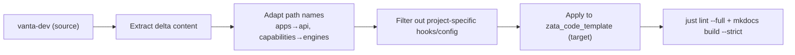

# PRD: 向 `zata_code_template` 反向同步 `vanta-dev` 的 AI Standards 改进

## 1. Introduction & Goals

`zata_code_template` 是个人项目模板仓库，`vanta-dev` 是基于该模板衍生的实际项目。
经过一段时间的使用，`vanta-dev` 在 AI Standards 体系上积累了大量超出模板的改进——包括全新的 `code-reuse.md` 标准页、大幅增强的 `tooling.md`/`testing.md`、更完善的 AGENTS.md 摘要、以及 `prd-standard.md`/`review-workflow.md` 的文档增强。

本 PRD 的目标是将这些已验证有效的改进**反向同步**回模板仓库，使模板获得相同级别的 AI 编码规范质量，为后续新项目提供更好的起始点。

### 关键指标

- 新增 1 个标准页（`code-reuse.md`）
- 增强 5 个以上已有文档的内容
- 保持模板仓库的通用性（路径名、入口适配不破坏）
- 同步完成后模板仓库的 `just lint --full` 和 `uv run mkdocs build --strict` 通过

---

## 2. Requirement Shape

- **Actor**: 维护者（zata）
- **Trigger**: 决定将 vanta-dev 已验证的 standards 改进回灌模板
- **Expected Behavior**:
  1. 模板仓库新增 `docs/ai-standards/code-reuse.md`，内容源自 vanta-dev 但适配模板路径名
  2. 模板仓库的 `docs/ai-standards/tooling.md` 补充 Lint Modes、Quality Check Flags、Duplicate Detection、PRD Workflow、Codex macOS 通知段落
  3. 模板仓库的 `docs/ai-standards/testing.md` 补充 just test 含 SKIP 流程、交付前三级建议
  4. 模板仓库的 `docs/ai-standards/index.md` Standards Map 补充 Code Reuse 链接
  5. 模板仓库的 `AGENTS.md` Critical Summary 补齐复用优先、参数收敛、Git 安全、文件行数、PRD 归档规则
  6. 模板仓库的 `docs/guides/prd-standard.md` 同步 Change Matrix 树状格式、生命周期、PRD 完成同步、Decision Log 增强
  7. 模板仓库的 `docs/guides/review-workflow.md` 验证命令清单同步为 vanta-dev 的详细版本
- **Scope Boundary**:
  - 只同步 AI Standards、AGENTS.md、guides 三类文档内容
  - 不同步 `scripts/`、`.claude/`、`hooks/` 等基础设施（这些是项目特定的）
  - 不同步 vanta-dev 项目特有的业务文档（`cost-based-recommendation.md`、`port-pair-recommendation-algorithm.md` 等）
  - 不同步 `.pre-commit-config.yaml`、`justfile`、`pyproject.toml` 等工具配置文件（它们各自独立演化）

---

## 3. Repository Context And Architecture Fit

### 3.1 模板仓库结构

| 模块 | 路径 | 状态 |
|---|---|---|
| AI 标准库 | `docs/ai-standards/` | 已有 6 个标准页，缺 `code-reuse.md` |
| 后端分层 | `backend/api/`、`core/`、`engines/`、`infrastructure/` | 与 vanta-dev 命名不同 |
| AI 入口 | `AGENTS.md` | 缺少复用/Git/PRD 规则摘要 |
| 协作指南 | `docs/guides/` | review-workflow/prd-standard 版本较旧 |
| MkDocs | `mkdocs.yml` | 需检查是否需要更新 nav |

### 3.2 需适配的路径名差异

| 概念 | vanta-dev 用词 | 模板用词 | 导入模板时保留 |
|---|---|---|---|
| 接入层 | `backend/apps/` | `backend/api/` | 模板的 `backend/api/` |
| 能力层 | `backend/capabilities/` | `backend/engines/` | 模板的 `backend/engines/` |

### 3.3 可复用的源文件

所有需要导入的内容都来自 vanta-dev 的以下文件：
- `docs/ai-standards/code-reuse.md` — 全新，直接适配
- `docs/ai-standards/tooling.md` — 增量段落可提取
- `docs/ai-standards/testing.md` — 增量段落可提取
- `docs/ai-standards/index.md` — 一行链接
- `AGENTS.md` — Critical Summary 多行文字
- `docs/guides/prd-standard.md` — Change Matrix/完成同步/Decision Log 段落
- `docs/guides/review-workflow.md` — 第 6 步命令清单

---

## 4. Recommendation

### 4.1 Recommended Approach

**逐文件增量同步**。每个目标文件独立编辑，不做批量复制——部分段落需要适配路径名，不能直接覆盖。

具体策略：
1. **`code-reuse.md`** — 全新文件，从 vanta-dev 复制后全局替换路径名（`apps`→`api`、`capabilities`→`engines`），再去除 vanta-dev 特定的 hook 配置描述
2. **`tooling.md`** — 在模板现有内容后追加章节，不做覆盖
3. **`testing.md`** — 在模板现有内容后追加段落
4. **`index.md`** — 仅补一行链接
5. **`AGENTS.md`** — 补入 Critical Summary 条目
6. **`prd-standard.md`** — 替换/追加 Change Matrix 和完成同步相关段落
7. **`review-workflow.md`** — 更新第 6 步命令清单

### 4.2 Why This Is The Best Fit

- 增量编辑比全量覆盖风险低，不会误改模板已有的独立内容
- 每个文件的改动量都很小（`index.md` 一行、`AGENTS.md` 数行），不值得引入独立分支或脚本工具
- 路径名适配是机械替换，纯文本操作即可完成

### 4.3 Alternatives Considered

| 方案 | 理由弃用 |
|---|---|
| 全量文件覆盖 | 风险大，模板的 `tooling.md`/`testing.md` 已有独立内容，覆盖会丢失 |
| 用 sync 脚本自动同步 | 内容需要人工判断（路径适配、段落选择），自动化成本高于收益 |
| 先验收再同步代码 | 文档同步不需要等待代码逻辑变化，两件事互相独立 |

---

## 5. Implementation Guide

### 5.1 Core Logic

每次变更在目标仓库（`zata_code_template`）的文件上直接编辑，源内容从 `vanta-dev` 对应文件提取。

适配规则：
1. 全局搜索替换路径名：`backend/apps/` → `backend/api/`，`backend/capabilities/` → `backend/engines/`
2. 删除 vanta-dev 特有的 hook 描述行（如 `hooks/check_cross_layer_duplication.py` 的路径细节）
3. 增量添加的内容排在原有章节之后，不破坏段落顺序

### 5.2 Affected Files

| 文件 | 动作 | 源内容来源 |
|---|---|---|
| `zata_code_template/docs/ai-standards/code-reuse.md` | **新增** | 复制 vanta-dev 同名文件后适配 |
| `zata_code_template/docs/ai-standards/tooling.md` | **追加** | vanta-dev tooling.md 的 Lint Modes / Flags / Duplicate / PRD / Codex 段落 |
| `zata_code_template/docs/ai-standards/testing.md` | **追加** | vanta-dev testing.md 的 just test 流程 / 交付前建议段落 |
| `zata_code_template/docs/ai-standards/index.md` | **修改** | Standards Map 加一行 Code Reuse |
| `zata_code_template/AGENTS.md` | **修改** | Critical Summary 补入 5 条规则 |
| `zata_code_template/docs/guides/prd-standard.md` | **修改** | Change Matrix / 完成同步 / Decision Log 段落 |
| `zata_code_template/docs/guides/review-workflow.md` | **修改** | 第 6 步命令清单 |
| `zata_code_template/mkdocs.yml` | **检查** | 需确认 nav 是否有 code-reuse 条目 |

### 5.3 Change Matrix

| Change Target | Current State | Target State | How to Modify | Why This Fits Existing Architecture | Affected Files |
|---|---|---|---|---|---|
| code-reuse.md | 不存在 | 新增完整的复用规范 | 从 vanta-dev 复制并适配路径名 | 补全模板缺失的标准页，模板的 docs/ai-standards/ 框架已预留位置 | `docs/ai-standards/code-reuse.md` |
| tooling.md | 仅基础命令表 | 增加 Lint Modes / Flags / Duplicate / PRD / Codex 章节 | 追加增量段落 | 所有内容对模板用户同样适用 | `docs/ai-standards/tooling.md` |
| testing.md | 基础命令 | 增加 just test 流程 / 交付前策略 | 追加段落 | 测试工作流通用 | `docs/ai-standards/testing.md` |
| index.md | Standards Map 无 Code Reuse | 补入链接 | 加一行 | 保持目录完整性 | `docs/ai-standards/index.md` |
| AGENTS.md | 缺少复用/Git/PRD 规则 | 补齐 | 插入数行到 Critical Summary | AGENTS.md 本身就是适配摘要，补充缺漏合理 | `AGENTS.md` |
| prd-standard.md | 仅有表格 Change Matrix | 增加树状格式 + 生命周期 + 完成同步 + Decision Log | 段落替换/追加 | Decision Log 和完成同步规则对模板用户同样有价值 | `docs/guides/prd-standard.md` |
| review-workflow.md | 简单命令清单 | 详细验证命令清单 | 替换第 6 步内容 | 验证命令是通用实践 | `docs/guides/review-workflow.md` |
| mkdocs.yml | 可能缺少 code-reuse | 补入 | 编辑 nav 一节 | 新增页面必须出现在导航中 | `mkdocs.yml` |

### 5.4 Flow Diagram

### 5.5 Low-Fidelity Prototype

Not required — no UI changes in this PRD.

### 5.6 ER Diagram

`No data model changes in this PRD.`

### 5.7 Interactive Prototype Change Log

`No interactive prototype file changes in this PRD.`

### 5.8 External Validation

`No external validation required; repository evidence was sufficient.`

---

## 6. Definition Of Done

- [x] 所有目标文件已完成内容同步
- [x] 路径名已正确适配（`api`/`engines` 取代 `apps`/`capabilities`）
- [x] `just lint --full` 通过（模板仓库）
- [x] `uv run mkdocs build --strict` 通过
- [x] 没有误改模板已有的独立内容

---

## 7. Acceptance Checklist

### Architecture Acceptance

- [x] `zata_code_template/docs/ai-standards/code-reuse.md` 存在且路径名已适配为 `backend/api/` 和 `backend/engines/`
- [x] `zata_code_template/docs/ai-standards/code-reuse.md` 中不包含 vanta-dev 特有的 hook 路径引用（如 `hooks/check_cross_layer_duplication.py`）
- [x] `zata_code_template/docs/ai-standards/tooling.md` 保留了模板原有的独立内容，追加没有破坏已有段落
- [x] `zata_code_template/docs/ai-standards/testing.md` 保留了模板原有的独立内容，追加没有破坏已有段落

### Behavior Acceptance

- [x] 逐个文件验证：`index.md` 的 Standards Map 多了一行 `- [Code Reuse](code-reuse.md)`
- [x] 逐个文件验证：`AGENTS.md` 的 Critical Summary 包含 "新增或修改代码前先搜索现有实现"、"参数超过 4 个时收敛到对象"、"除非用户明确要求，否则不要自动执行 Git 变更操作"、"单代码文件非空行不超过 1000 行"、"PRD 归档规则"
- [x] 逐个文件验证：`prd-standard.md` 包含树状 Change Matrix 格式文档
- [x] 逐个文件验证：`prd-standard.md` 包含 "PRD 完成同步" 章节
- [x] 逐个文件验证：`prd-standard.md` 包含 Decision Log 的生命周期和理由说明增强
- [x] 逐个文件验证：`review-workflow.md` 第 6 步包含 `just lint --reuse`、`just lint --full`、`just lint --repo`

### Documentation Acceptance

- [x] `uv run mkdocs build --strict` 在模板仓库通过
- [x] mkdocs.yml 的 nav 包含 `Code Reuse` 条目
- [x] `just lint --full` 在模板仓库通过（无 pre-commit 或 lint 错误）

### Validation Acceptance

- [x] 使用搜索确认模板仓库没有残留 `backend/apps/` 或 `backend/capabilities/` 引用
- [x] 使用搜索确认模板仓库的 `code-reuse.md` 中指向 ai-standards 的链接是正确的相对路径

---

## 8. User Stories

作为模板维护者，我希望将 vanta-dev 中已实践验证的 AI Standards 改进同步回模板，使后续基于模板创建的新项目无需重复积累同样的改进。

作为模板使用者，当我基于模板创建新项目时，我希望 `code-reuse.md` 等防范重复的规范页已经就位，而不需要自己从零补充。

---

## 9. Functional Requirements

| FR-ID | Description |
|---|---|
| FR-1 | 模板仓库新增 `docs/ai-standards/code-reuse.md`，内容来自 vanta-dev 并适配路径名 |
| FR-2 | 模板仓库的 `docs/ai-standards/tooling.md` 增加 Lint Modes、Quality Check Flags、Duplicate Detection Hooks、PRD Workflow Hooks、Codex macOS 通知五个段落 |
| FR-3 | 模板仓库的 `docs/ai-standards/testing.md` 增加 "just test 内含 SKIP=check-test-flag just lint --full" 说明和"交付前三级建议" |
| FR-4 | 模板仓库的 `docs/ai-standards/index.md` Standards Map 增加 Code Reuse 链接 |
| FR-5 | 模板仓库的 `AGENTS.md` Critical Summary 补齐 5 条缺漏的通用规则 |
| FR-6 | 模板仓库的 `docs/guides/prd-standard.md` 同步 Change Matrix 树状格式、生命周期、"PRD 完成同步"章节、Decision Log 增强 |
| FR-7 | 模板仓库的 `docs/guides/review-workflow.md` 第 6 步验证命令增加 `just lint --reuse`、`--full`、`--repo` |
| FR-8 | 搜索确认无 `backend/apps/` 或 `backend/capabilities/` 残留路径引用 |
| FR-9 | 模板仓库的 `mkdocs.yml` nav 包含 code-reuse 条目 |

---

## 10. Non-Goals

- 不同步 `.pre-commit-config.yaml`、`justfile`、`pyproject.toml` 等工具配置文件
- 不同步 `scripts/`、`hooks/`、`.claude/` 等可执行基础设施
- 不同步 vanta-dev 项目特有的业务文档
- 不做 vanta-dev 与模板之间的自动化双向同步机制
- 不修改 vanta-dev 已有的文档（方向是 vanta-dev → 模板，单向）

---

## 11. Risks And Follow-Ups

无。所有改动都在模板仓库的文档层，不涉及运行时逻辑或数据变更。回滚方式为 `git checkout -- <file>` 恢复单个文件。最大风险是误改模板已有内容，通过逐文件 diff 确认可控制。

---

## 12. Decision Log

| # | 决策问题 | 选择 | 放弃的方案 | 理由 |
|---|---|---|---|---|
| D-01 | 同步策略 | 逐文件增量编辑 | 全量覆盖 | 模板已有独立内容，全量覆盖会丢失，增量编辑可保留哪些内容 |
| D-02 | 路径名适配 | 手动替换 `apps`→`api`、`capabilities`→`engines` | 保持原样或写自动化脚本 | 手动替换精确可控，自动化脚本的判断开销高于一次替换收益 |
| D-03 | `code-reuse.md` 的 AI 自检清单 | 保留但移除 vanta-dev 特有 hook 引用 | 删掉整个清单 | 自检清单是通用价值，对模板用户同样有意义；仅需移除指向特定文件路径的引用 |
