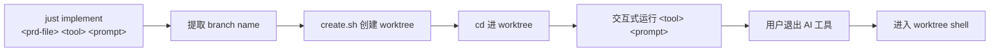

# PRD: Add `just implement` Recipe

## 1. Introduction & Goals

### Problem Statement

在使用 PRD 驱动开发的流程中，从 PRD 到开始编码的常见操作链是：

1. 手动推导 branch name（去掉日期前缀 + `.md` 后缀）
2. 执行 `just worktree <branch>` 创建 worktree
3. 手动 cd 进 worktree 后执行 `clauded "基于这个 PRD 实现..."`

这个过程涉及多次人工判断和操作步骤，可以自动化。

### Goals

- 新增 `just implement` recipe：一个复合命令，将"从 PRD 创建 worktree → 调用 AI 工具"合并为一条指令
- 自动从 PRD 文件名推导 branch name
- 创建 worktree 后，在 worktree 中交互式执行指定的 AI 工具（clauded/kim）并传入 prompt
- AI 工具退出后，自动进入 worktree shell

## 2. Requirement Shape

| 维度 | 详情 |
|---|---|
| **Actor** | 开发者，使用 PRD 驱动开发流程 |
| **Trigger** | 拿到一份 PRD 需要开工实现 |
| **Expected behavior** | 指定 PRD 文件、AI 工具和 prompt 后，自动完成 worktree 创建 → AI 工具调用 → worktree shell 进入全流程 |
| **Explicit scope boundary** | 仅修改 `justfile`。不修改 `scripts/worktree/` 下的脚本。不涉及 PRD 内容解析。 |

## 3. Usage

```bash
just implement tasks/pending/20260518-193000-prd-xxx.md clauded "请根据 PRD 实现该功能"
```

### Branch Name Derivation

从 PRD 文件名推导 branch name：

1. 去掉日期前缀（`YYYYMMDD-HHMMSS-`）——如果存在
2. 去掉 `.md` 后缀
3. 结果作为 branch name

示例：

| PRD 文件名 | 推导出的 branch name |
|---|---|
| `20260518-193000-prd-xxx.md` | `prd-xxx` |
| `feature-x.md` | `feature-x` |
| `20260518-my-feature.md` | `my-feature` |

## 4. Implementation Guide

### 4.1 Core Logic

在 `justfile` 中新增独立的 `implement` recipe，内部调用 `scripts/worktree/create.sh` 创建 worktree。

流程：

1. 接受三个参数：`<prd-file> <ai-tool> "<prompt>"`
2. 验证 `prd-file` 存在
3. 验证 `ai-tool` 是 `clauded` 或 `kim`
4. 从 `prd-file` 提取文件名 → 去掉日期前缀 → 去掉 `.md` → 得到 branch name
5. 调用 `create.sh` 创建 worktree
6. 确定 worktree 路径
7. 在 worktree 目录中执行 AI 工具 + prompt（交互式，阻塞直到用户退出）
8. 进入 worktree shell（复用已有的 enter_shell 逻辑）

### 4.2 Affected Files

| 文件 | 变更方式 |
|---|---|
| `justfile` | 新增 `implement` recipe |

### 4.3 Flow



## 5. Definition Of Done

- [x] `just implement <prd-file> clauded "<prompt>"` 完成全流程（待真实运行验证交互部分）
- [x] `just implement <prd-file> kim "<prompt>"` 完成全流程
- [x] branch name 从文件名正确推导（含日期前缀和无日期前缀两种情况）
- [x] 不存在的 PRD 文件给出明确错误提示
- [x] 不支持的 AI 工具名称给出明确错误提示
- [x] AI 工具退出后正确进入 worktree shell

## 6. Acceptance Checklist

### Behavior Acceptance

- [x] `just implement`（无参数）提示用法
- [x] `just implement /nonexistent/file.md clauded "test"` 报错文件不存在
- [x] `just implement tasks/pending/some-prd.md unknown-tool "test"` 报错不支持的 AI 工具
- [x] `just implement tasks/pending/20260518-xxx.md clauded "hello"` branch name 正确推导为 `xxx`
- [x] `just implement tasks/pending/xxx.md clauded "hello"` branch name 正确推导为 `xxx`
- [x] AI 工具交互式运行，用户退出后进入 worktree shell（代码逻辑已实现）

### Validation Acceptance

- [x] 已有 `just worktree` 子模式（`-o`, `-d`, `-m`, `--doctor`, 默认 create/enter）不受影响
- [x] `just --list` 显示 implement recipe

## 7. Non-Goals

- **不在范围内**：解析 PRD 文件内容。仅从文件名推导 branch name。
- **不在范围内**：修改 `scripts/worktree/` 下的脚本。
- **不在范围内**：支持 prompt 模板展开或变量替换。

## 8. Decision Log

| ID | 决策问题 | 已选择 | 已拒绝 | 理由 |
|---|---|---|---|---|
| D-01 | prompt 参数如何传递 | 用户自行用引号包裹，整个 prompt 为一个参数 | 从文件读取、多参数拼接 | 标准 CLI 行为，简单直观 |
| D-02 | 子模式 vs 独立 recipe | 独立 `just implement` recipe | `just worktree --prd` 子模式 | 语义更清晰，"实现 PRD" 是一个独立的高层意图，不是 worktree 管理操作 |
