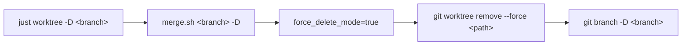

# PRD: Add `just worktree -D` Force Delete

## 1. Introduction & Goals

### Problem Statement

`just worktree -d <branch>` 通过 `merge.sh -d` 路径执行 worktree 清理和分支删除，遇到脏工作区或未合并分支时 `git worktree remove` 和 `git branch -d` 会失败退出，无法完成清理。用户需要手动执行 `git worktree remove --force` 和 `git branch -D` 收尾。

### Goals

- 新增 `just worktree -D <branch>` 子模式：强制删除 worktree 和本地分支
- `git worktree remove` 带上 `--force` 参数，绕过脏工作区检查
- `git branch -D` 强制删除分支，绕过未合并检查
- 跳过权限预检（force 场景不需要）

## 2. Requirement Shape

| 维度 | 详情 |
|---|---|
| **Actor** | 开发者，worktree 处于脏状态或分支未合并但需要强制清理 |
| **Trigger** | `just worktree -d <branch>` 因 dirty/unmerged 失败 |
| **Expected behavior** | 一条命令完成强制删除 worktree 和本地分支，不阻塞不报错 |
| **Explicit scope boundary** | 不涉及远程分支删除。不修改 create/open/merge 流程。仅处理本地 worktree + 本地分支。 |

## 3. Usage

```bash
just worktree -D <branch_name>
```

等价于手动执行：

```bash
git worktree remove --force <path>
git branch -D <branch_name>
```

## 4. Implementation Guide

### 4.1 Core Logic

`merge.sh` 新增 `--force-delete`（短名 `-D`）选项。与现有的 `-d`/`--delete` 流程相同，但在清理步骤中：

- `git worktree remove` 附加 `--force` 参数
- `git branch -d` 替换为 `git branch -D`
- 跳过 `preflight_check_worktree_permissions` 预检

`justfile` 的 `worktree` recipe 新增 `-D` 分支，参数转发给 `merge.sh <branch> -D`。

### 4.2 Affected Files

| 文件 | 变更方式 |
|---|---|
| `justfile` | 新增 `-D` 分支处理 |
| `scripts/worktree/merge.sh` | 新增 `force_delete_mode` 变量、`-D`/`--force-delete` 选项解析、force 标志应用 |

### 4.3 Flow



## 5. Definition Of Done

- [x] `just worktree -D <branch>` 强制删除 worktree 目录和 .git/worktrees 元数据
- [x] `just worktree -D <branch>` 强制删除本地分支
- [x] 脏工作区场景下 `-D` 成功，`-d` 失败（验证行为差异）
- [x] 不存在的分支给出合理提示

## 6. Acceptance Checklist

### Behavior Acceptance

- [x] `just worktree -D <branch>` worktree 清理成功
- [x] `just worktree -D <branch>` 本地分支删除成功（含未合并情况）
- [x] `just worktree -D`（无参数）提示用法
- [x] `just worktree -d <branch>` 正常删除流程不受影响
- [x] `merge.sh` 的 `-D` / `--force-delete` / 长名均有效
- [x] `merge.sh` 的 `-d` / `--delete` / `--delete-only` 行为不变

### Validation Acceptance

- [x] `merge.sh` 的 usage/help 中已包含 `-D, --force-delete` 文档
- [x] `just --list` 正确显示 worktree recipe
- [x] 已有子模式（`-o`, `-d`, `-m`, `--doctor`, 默认 create/enter）不受影响

## 7. Non-Goals

- **不在范围内**：删除远程分支（已有 `--delete-remote` 单独控制）
- **不在范围内**：修改 create/open/merge 子模式
- **不在范围内**：添加交互式确认提示（force 语义本身就是确认）

## 8. Decision Log

| ID | 决策问题 | 已选择 | 已拒绝 | 理由 |
|---|---|---|---|---|
| D-01 | force-delete 逻辑放哪里 | 复用 `merge.sh` 的 `cleanup_feature_branch`，加 force 分支 | 独立脚本或在 justfile 内内联 | 复用已有的 worktree path 解析、branch 检测逻辑；改动最小 |
| D-02 | 执行 `git worktree remove --force` vs `rm -rf` | `git worktree remove --force` | 直接 `rm -rf` 目录 + `git worktree prune` | `git worktree remove --force` 同时清理目录和元数据，单步完成 |
