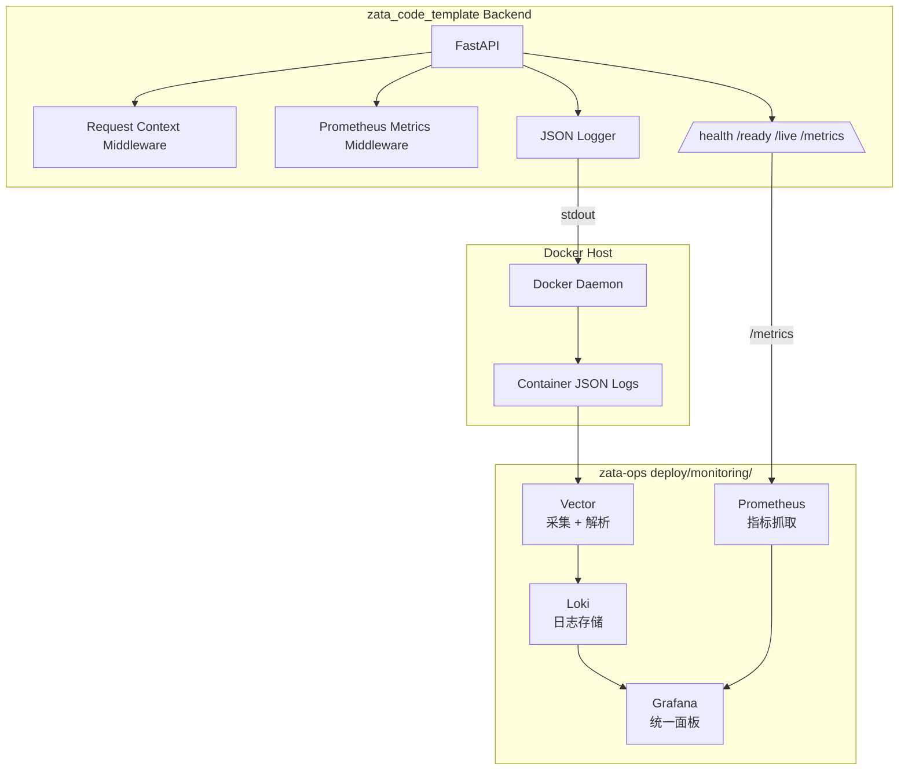

# PRD：zata_code_template + zata-ops 云原生可观测性栈（Vector + Loki + Prometheus + Grafana）

## 1. Introduction & Goals

### Problem Statement

`zata_code_template` 后端当前无可观测性输出：日志是文本格式、无请求标识、无 Prometheus 指标、无健康检查端点。`zata-ops` 虽有 `MONITORING-STACK-PRIMER.md` 规划了 Vector + Loki + Prometheus + Grafana，但尚未落地任何代码、配置或 CLI 集成。结果是：生产环境出问题后，无法快速在统一面板中查看"这个服务在某个时间点发生了什么、请求量和错误率如何"。

### Proposed Solution Summary

采用**最小改动、分仓库职责**的方式：

- `zata_code_template` 扩展现有 `Logger` 和 FastAPI 应用，产生**结构化 JSON 日志**、**RED 指标**、**request_id** 和**健康检查端点**；所有监控能力通过 `config.toml` 的 `[observability]` section 开关化，默认开启但可彻底关闭。
- `zata-ops` 新增 `deploy/monitoring/` 目录，提供 Vector + Loki + Prometheus + Grafana 的**一键启动 compose 栈**，并集成到 `env provision --profile vps-traefik --with-monitoring`。
- 两者通过约定对接：Docker logging driver 把容器 stdout 交给 Vector，Vector 解析 JSON 后写入 Loki；Prometheus 主动 scrape 后端 `/metrics`；Grafana 自动 provisioning 两个数据源和默认面板。

本方案 intentionally 避免一步到位引入 OpenTelemetry Collector + Tempo，以降低首次落地风险和与现有 `MONITORING-STACK-PRIMER.md` 的冲突。JSON 日志和 Prometheus 指标 already 使用社区标准格式，未来叠加 OTel 时只需替换采集层，业务代码改动很小。

### Measurable Objectives

1. `zata_code_template` 容器运行时，stdout 输出包含 `request_id`、`service_name`、`level`、`message` 等字段的 JSON 日志。
2. `zata_code_template` 暴露 `/metrics` 端点，可被 Prometheus scrape，包含 `http_requests_total` 和 `http_request_duration_seconds`。
3. `zata_code_template` 暴露 `/health`、`/ready`、`/live` 端点，HTTP 200。
4. 每个 HTTP 请求响应头返回 `X-Request-ID`。
5. `zata-ops/deploy/monitoring/` 能通过 `docker compose up -d` 一键启动完整监控栈。
6. `zata-ops env provision --profile vps-traefik --with-monitoring --dry-run` 输出包含监控栈部署的 plan。
7. 本地联调时，Grafana Explore 能同时查到应用日志和 RED 指标。

### Realistic Validation

除单元测试和集成测试外，本 PRD 要求通过**真实项目入口点**验证关键行为，确保真实使用路径生效，而非仅在隔离 fixture 中通过。

- [x] **JSON 日志真实验证**：通过 `LOG_FORMAT=json uv run python -m backend.main` + `curl http://localhost:8000/health`，验证 stdout 输出合法 JSON 且包含 `request_id` 和 `service_name`。
- [x] **Prometheus 指标真实验证**：通过 `curl http://localhost:8000/metrics` 验证返回 Prometheus 文本格式，且包含 `http_requests_total` 和 `http_request_duration_seconds`。
- [x] **监控栈端到端真实验证**：通过 `cd zata-ops/deploy/monitoring && docker compose up -d`，启动代码模板后端容器，验证 Grafana Explore 能查到 Loki 日志和 Prometheus 指标。
- [x] **VPS  provision dry-run 真实验证**：通过 `zata-ops env provision --host <sandbox> --profile vps-traefik --with-monitoring --dry-run` 验证 plan 包含监控目录复制和 compose 启动。

**为什么单元测试不够**：单元测试只能验证 logger formatter 类型和中间件返回值，无法证明 Docker → Vector → Loki 的完整日志通路、Prometheus scrape 行为、Grafana 数据源自动注册以及跨仓库的部署约定真正生效。

### Delivery Dependencies

- Group: observability-stack
- Depends on groups:
  - none
- Depends on tasks/issues:
  - none
- Gate type: none
- Notes: 本 PRD 覆盖 `zata_code_template` 和 `zata-ops` 两个仓库的协同改动，两个仓库可以并行开发，但全链路验证必须在两者都完成后才能进行。

---

## 2. Requirement Shape

- **Actor**：部署和运维 Zata 下游项目的工程师，以及值班排查线上问题的工程师。
- **Trigger**：
  - 新 VPS 初始化时执行 `zata-ops env provision --profile vps-traefik --with-monitoring`。
  - 本地开发时执行 `docker compose up -d` 启动监控栈。
  - 线上告警或用户反馈时打开 Grafana 排查。
- **Expected Behavior**：
  - 应用容器输出结构化 JSON 日志。
  - Prometheus 定期抓取应用 `/metrics`。
  - Vector 采集容器 stdout 并推送到 Loki。
  - Grafana 自动展示日志和 RED 指标面板。
- **Explicit Scope Boundary**：
  - 本次只覆盖后端可观测性（Logs + Metrics）。
  - 不包含 OpenTelemetry Trace、Tempo、SLO 告警、eBPF、持续剖析、前端可观测性。
  - 监控栈按单机 VPS 设计，不做集群高可用。

---

## 3. Repository Context And Architecture Fit

### Current Relevant Modules/Files

**zata_code_template**：
- `src/backend/main.py`：FastAPI 应用入口，当前只注册 `auth_router`。
- `src/backend/infrastructure/logger.py`：单例 `Logger`，文本格式输出到 stdout 和 `logs/app.log`。
- `src/backend/infrastructure/config/settings.py`：`AppSettings` 使用 pydantic-settings，三层配置来源。
- `src/backend/api/auth_router.py`：现有路由示例，可用于验证 middleware 效果。
- `deploy/vps-traefik/docker-compose.yml`：生产部署 compose，包含 backend/admin/public 服务。
- `tests/test_logger.py`：验证 `TimedRotatingFileHandler` 和 suffix。
- `tests/repo/test_compose_parity.py`：要求本地与 Dokploy compose 的环境变量声明一致。

**zata-ops**：
- `MONITORING-STACK-PRIMER.md`：已规划 Vector + Loki + Prometheus + Grafana，但无实现。
- `deploy/vps-traefik/`：Traefik 部署目录，`install-docker-traefik.sh` 和 `docker-compose.yml`。
- `src/zata_ops/cli/`：CLI 入口目录（具体 `env provision` 实现需进一步查看）。
- `docs/architecture/`：架构文档目录，预期新增 `monitoring-stack.md`。
- `mkdocs.yml`：文档导航。

### Architecture Pattern To Follow

- **四层依赖方向**（`api -> core -> engines -> infrastructure`）：
  - HTTP middleware 放 `src/backend/api/middleware/`。
  - 日志 formatter 和配置保留在 `src/backend/infrastructure/`。
  - metrics router 和 health router 放 `src/backend/api/`。
- **配置分层**：新增字段通过 `AppSettings` 管理，支持 env / `.env`/`.env.local` / `config.toml`。
- **服务命名**：Docker 服务名使用项目 slug 前缀（`zata-codes-template-`），避免跨项目冲突。
- **约定优于配置**：代码模板与 zata-ops 通过日志格式、标签、端口约定对接，不引入双向依赖。

### Ownership And Dependency Boundaries

- `zata_code_template` 只负责"产生遥测数据"，不感知监控栈部署细节。
- `zata-ops` 只负责"采集、存储、展示"，不感知业务代码实现。
- 两者通过以下约定对接：
  - 日志：应用 stdout 输出 JSON，Vector 解析。
  - 指标：应用暴露 `/metrics`，Prometheus scrape `http://<service>:8000/metrics`。
  - 标签：`com.docker.compose.project` 和 `com.docker.compose.service` 用于 Vector 分组。

### Constraints

- `tests/repo/test_compose_parity.py` 要求 `docker-compose.yml` 与 `docker-compose.dokploy.yml` 中共享服务的显式 `environment` 键一致。
- `just lint --full` 对文件大小有警告（>500 行）和硬限制（>1000 行）。
- 新代码需通过 `just test`、`just lint --reuse`。
- 公共 API 使用 Google Style docstring；文件 I/O 显式 `encoding="utf-8"`。
- zata-ops 当前 `env provision` 命令入口需先查看后再修改。

### Existing PRD Relationship

- **zata_code_template/tasks/pending/**：本次 PRD 本身即为最新待执行 PRD；无其他重叠或依赖的可观测性 PRD。
- **zata_code_template/tasks/archive/**：无直接相关 PRD。
- **zata-ops/tasks/pending/**：`P1-FEAT-20260612-144533-zata-ops-agent-terminal.md` 与本次任务独立，无依赖关系。
- **zata-ops/tasks/archive/**：无直接相关 PRD。
- **关系**：独立任务，无 hard/soft 依赖。

---

## 4. Recommendation

### Recommended Approach

**最小改动方案：先实现 Logs + Metrics 可观测性栈。**

`zata_code_template` 侧：
1. 扩展 `logger.py` 支持 `LOG_FORMAT=json|text`，JSON 模式输出结构化字段。
2. 新增 `src/backend/api/middleware/request_context.py`，生成/透传 `request_id` 并注入日志上下文。
3. 新增 `src/backend/api/middleware/prometheus_metrics.py`，记录 RED 指标。
4. 新增 `src/backend/api/metrics_router.py` 暴露 `/metrics`。
5. 新增 `src/backend/api/health_router.py` 暴露 `/health`、`/ready`、`/live`。
6. 新增 `ObservabilitySettings` 对应 `config.toml` 的 `[observability]` section；扩展 `.env.example`、compose 文件。
7. 更新测试和文档。

`zata-ops` 侧：
1. 新增 `deploy/monitoring/` 目录，包含 Vector + Loki + Prometheus + Grafana 的 compose 和配置。
2. 配置 Vector 解析业务 JSON 日志并写入 Loki。
3. 配置 Prometheus scrape 目标应用 `/metrics`。
4. 配置 Grafana 自动 provisioning 数据源和默认 RED/Logs 面板。
5. 扩展 `env provision --profile vps-traefik --with-monitoring`。
6. 更新测试和文档。

### Why This Is The Best Fit

1. **与现有规划对齐**：`MONITORING-STACK-PRIMER.md` 已经明确规划了 Vector + Loki + Prometheus + Grafana，且声明 Trace 不在范围。本方案直接落地该规划，不产生规划碎片。
2. **最小侵入**：复用现有 `Logger` 单例和 pydantic-settings，不引入新抽象层。
3. **可验证**：1-2 周内即可在 Grafana 看到真实数据，团队能快速获得价值。
4. **未来兼容**：JSON 日志 + Prometheus 指标是 OTel 也支持的标准输出，未来上 Collector 时只需替换采集层。

### Alternatives Considered

**更重方案：直接上 OpenTelemetry Collector + LGTM（Loki + Grafana + Tempo + Mimir/Prometheus）。**

- 优点：统一数据模型，Trace/Metric/Log 一体化，与用户提供的长文架构完全对齐。
- 缺点：
  - 引入 OTel SDK、Collector、Tempo 等多个新组件，调试链路长。
  - 推翻现有 `MONITORING-STACK-PRIMER.md` 规划，产生实施方向分歧。
  - zata-ops 当前无 OTel/Tempo 基础，从零搭建工作量大。
- **拒绝理由**：当前仓库已有明确且更轻量的监控规划，先让 Logs + Metrics 跑通再用真实数据驱动 Trace 决策，风险更低。

---

## 5. Implementation Guide

> This section is a living implementation guide based on current repository analysis. If implementation discovers additional affected files, hidden dependencies, edge cases, or a better path, update this PRD before proceeding.

### Core Logic

1. **日志通路**：
   - 应用容器运行时，Python logger 将 JSON 日志写到 stdout。
   - Docker daemon 通过 `json-file` logging driver 把 stdout 持久化到 `/var/lib/docker/containers/...`。
   - Vector 通过挂载 `docker.sock`，调用 Docker API 读取所有容器日志。
   - Vector 用 `json_parser` 解析业务 JSON 日志，提取低基数 label（`compose_project`、`compose_service`、`level`）。
   - Vector 将日志推送到 Loki。
   - Grafana 从 Loki 查询日志。

2. **指标通路**：
   - `create_app()` 读取 `config.observability.metrics_enabled`。
   - 若开启，注册 Prometheus metrics middleware 并 include `/metrics` router。
   - 每个 HTTP 请求结束后，middleware 更新 `http_requests_total` 和 `http_request_duration_seconds`。
   - `/metrics` 端点返回 Prometheus 文本格式。
   - Prometheus 按 `scrape_interval` 抓取后端 `/metrics`。
   - Grafana 从 Prometheus 查询指标并展示 RED 面板。

3. **请求关联**：
   - `create_app()` 读取 `config.observability.request_id_enabled`。
   - 若开启，注册 Request context middleware，为每个请求生成 UUID4 作为 `request_id`。
   - `request_id` 通过 `contextvars` 注入 logger formatter。
   - 响应头 `X-Request-ID` 返回给客户端。
   - 日志中的 `request_id` 字段使同一请求的所有日志行可关联。

4. **开关行为**：
   - `observability.enabled = false` 时，不注册任何可观测性中间件和 `/metrics` router，但业务功能完全正常。
   - `metrics_enabled` 和 `request_id_enabled` 可独立开关。
   - `/health`、`/ready`、`/live` 不受开关影响，始终可用。

### Change Impact Tree

```text
zata_code_template
├── Infrastructure
│   ├── src/backend/infrastructure/logger.py
│   │   [修改]
│   │   【总结】支持 text/json 双模式，JSON 模式输出结构化字段。
│   │   ├── 新增 JsonFormatter / TextFormatter 切换
│   │   ├── JSON 字段：timestamp, level, logger, message, request_id, trace_id(预留), span_id(预留), service_name, service_version, deployment_environment, source_file, source_line
│   │   └── 保留 TimedRotatingFileHandler 和现有 suffix 行为
│   │
│   ├── src/backend/infrastructure/config/settings.py
│   │   [修改]
│   │   【总结】新增 ObservabilitySettings 类，支持总开关和独立子开关。
│   │   ├── 新增 ObservabilitySettings（enabled, metrics_enabled, request_id_enabled, log_format, service_name, service_version, deployment_environment）
│   │   ├── AppSettings 聚合 observability 字段
│   │   └── 保持现有配置加载优先级
│   │
│   ├── config.toml
│   │   [修改]
│   │   【总结】新增 [observability] section 作为开关和格式的默认来源。
│   │   ├── enabled = true
│   │   ├── metrics_enabled = true
│   │   ├── request_id_enabled = true
│   │   ├── log_format = "text"
│   │   ├── service_name = "zata-codes-template-backend"
│   │   ├── service_version = "0.1.0"
│   │   └── deployment_environment = "development"
│   │
├── API
│   ├── src/backend/api/middleware/request_context.py
│   │   [新增]
│   │   【总结】生成/透传 request_id，注入日志上下文，响应头返回 X-Request-ID。
│   │   ├── 从 X-Request-ID 读取或生成 UUID4
│   │   ├── 使用 contextvars 存储 request_id
│   │   └── 注册为 FastAPI middleware
│   │
│   ├── src/backend/api/middleware/prometheus_metrics.py
│   │   [新增]
│   │   【总结】记录 RED 指标到 Prometheus。
│   │   ├── http_requests_total{method,status,path}
│   │   ├── http_request_duration_seconds{method,status,path}
│   │   └── path 使用路由模板，避免高基数
│   │
│   ├── src/backend/api/metrics_router.py
│   │   [新增]
│   │   【总结】暴露 /metrics 端点。
│   │
│   ├── src/backend/api/health_router.py
│   │   [新增]
│   │   【总结】暴露 /health、/ready、/live 端点。
│   │
│   ├── src/backend/api/middleware/__init__.py
│   │   [新增]
│   │   【总结】middleware 包初始化。
│   │
│   ├── src/backend/main.py
│   │   [修改]
│   │   【总结】注册中间件和路由。
│   │   ├── 注册 request_context middleware
│   │   ├── 注册 prometheus_metrics middleware
│   │   ├── include metrics_router (/metrics)
│   │   └── include health_router (/health, /ready, /live)
│   │
├── Configuration & Deployment
│   ├── pyproject.toml
│   │   [修改]
│   │   【总结】新增 python-json-logger 和 prometheus-client 依赖。
│   │
│   ├── .env.example
│   │   [修改]
│   │   【总结】新增可选环境变量覆盖，主要配置已落到 config.toml 的 [observability]。
│   │   ├── LOG_FORMAT（可选覆盖）
│   │   ├── SERVICE_NAME（可选覆盖）
│   │   ├── SERVICE_VERSION（可选覆盖）
│   │   └── DEPLOYMENT_ENVIRONMENT（可选覆盖）
│   │
│   ├── deploy/vps-traefik/docker-compose.yml
│   │   [修改]
│   │   【总结】backend 服务增加监控标签和环境变量（主要配置来自 config.toml）。
│   │   ├── 新增 com.docker.compose.project/service label
│   │   ├── 新增可选环境变量覆盖：SERVICE_NAME, SERVICE_VERSION, DEPLOYMENT_ENVIRONMENT
│   │   └── 保持与 docker-compose.dokploy.yml 的 parity
│   │
│   ├── docker-compose.yml
│   │   [修改]
│   │   【总结】本地开发 compose 同步新增可选环境变量覆盖。
│   │
│   ├── docker-compose.dokploy.yml
│   │   [修改]
│   │   【总结】Dokploy compose 同步新增可选环境变量覆盖，满足 parity 测试。
│   │
├── Tests
│   ├── tests/test_logger.py
│   │   [修改]
│   │   【总结】验证 text/json 两种 formatter 行为。
│   │
│   ├── tests/test_request_context.py
│   │   [新增]
│   │   【总结】验证 request_id 生成、透传、响应头。
│   │
│   ├── tests/test_metrics.py
│   │   [新增]
│   │   【总结】验证 /metrics 可访问且包含 RED 指标。
│   │
│   └── tests/test_health.py
│       [新增]
│       【总结】验证 /health、/ready、/live 返回正确。
│
├── Docs
│   ├── docs/guides/observability.md
│   │   [新增]
│   │   【总结】应用侧可观测性说明。
│   │
│   └── mkdocs.yml
│       [修改]
│       【总结】新增 observability 导航项。
│
zata-ops
├── Deployment
│   ├── deploy/monitoring/docker-compose.yml
│   │   [新增]
│   │   【总结】Vector + Loki + Prometheus + Grafana 一键启动。
│   │
│   ├── deploy/monitoring/.env.example
│   │   [新增]
│   │   【总结】监控栈专用环境变量模板。
│   │
│   ├── deploy/monitoring/vector/vector.yaml
│   │   [新增]
│   │   【总结】Vector 采集 Docker 日志、解析 JSON、推送 Loki。
│   │
│   ├── deploy/monitoring/loki/local-config.yaml
│   │   [新增]
│   │   【总结】Loki 单机 TSDB 配置。
│   │
│   ├── deploy/monitoring/prometheus/prometheus.yml
│   │   [新增]
│   │   【总结】Prometheus scrape 配置。
│   │
│   ├── deploy/monitoring/grafana/provisioning/datasources/datasources.yaml
│   │   [新增]
│   │   【总结】自动注册 Prometheus 和 Loki 数据源。
│   │
│   ├── deploy/monitoring/grafana/provisioning/dashboards/default.yml
│   │   [新增]
│   │   【总结】自动加载默认面板目录。
│   │
│   ├── deploy/monitoring/grafana/dashboards/red-dashboard.json
│   │   [新增]
│   │   【总结】RED 指标面板。
│   │
│   └── deploy/monitoring/grafana/dashboards/logs-dashboard.json
│       [新增]
│       【总结】日志浏览面板。
│
├── CLI & Provisioning
│   └── src/zata_ops/cli/env_provision.py（或实际入口文件）
│       [修改]
│       【总结】新增 --with-monitoring flag，部署监控栈到 /opt/apps/monitoring。
│
├── Tests
│   └── tests/test_env_provision.py
│       [修改]
│       【总结】新增 --with-monitoring --dry-run 测试。
│
└── Docs
    ├── docs/architecture/monitoring-stack.md
    │   [新增]
    │   【总结】正式监控栈文档。
    │
    ├── mkdocs.yml
    │   [修改]
    │   【总结】新增 monitoring-stack 导航项。
    │
    ├── MONITORING-STACK-PRIMER.md
    │   [修改]
    │   【总结】从临时草稿改为指向正式文档或归档。
    │
    └── README.md
        [修改]
        【总结】增加监控栈部署链接。
```

### Executor Drift Guard

- **FastAPI middleware 注册顺序**：实现后运行 `rg -n "add_middleware" src/backend/main.py` 确认中间件已注册；若请求 ID 未出现在日志中，先检查 middleware 是否在 `create_app()` 早期注册。
- **Prometheus path 标签高基数**：实现后运行 `curl -s http://localhost:8000/metrics | rg 'http_request_duration_seconds_bucket\{.*path="/'` 检查 path 是否包含 ID；若包含，需改用 `request.scope["route"].path` 而非 `request.url.path`。
- **Docker Compose parity 漂移**：修改 `deploy/vps-traefik/docker-compose.yml` 后，必须同步 `docker-compose.yml` 和 `docker-compose.dokploy.yml` 中共享服务的 `environment` 键；运行 `uv run pytest tests/repo/test_compose_parity.py -q` 验证。
- **zata-ops CLI 入口漂移**：`env provision` 的实际入口可能不是 `src/zata_ops/cli/env_provision.py`；实现前用 `rg -n "def provision" src/zata_ops/` 和 `rg -n "env provision" src/zata_ops/` 定位真实入口。
- **Vector label 高基数**：实现后检查 Loki 中是否出现大量 `compose_service` 唯一值；若 Vector 把容器名（含随机后缀）当 label，需改用 `com.docker.compose.service` 标签。
- **Grafana 数据源未注册**：若 Grafana 启动后无数据源，检查 `deploy/monitoring/grafana/provisioning/datasources/datasources.yaml` 是否挂载到 `/etc/grafana/provisioning/datasources/` 且文件名以 `.yaml` 结尾。

### Flow / Architecture Diagram



### Realistic Validation Plan

| Behavior | Real Entry Point | Test Layer | Mock Boundary | Data/Env Needed | Command Or Procedure | Required For Acceptance |
|---|---|---|---|---|---|---|
| 后端输出 JSON 日志 | 应用启动 + HTTP 请求 | 集成测试 | 数据库可 mock | `LOG_FORMAT=json` | `LOG_FORMAT=json uv run python -m backend.main` 后 `curl http://localhost:8000/health`，检查 stdout 输出合法 JSON | Yes |
| request_id 生成与透传 | HTTP API | 单元/集成测试 | 无 | 无 | `curl -v http://localhost:8000/health` 检查响应头 `X-Request-ID` | Yes |
| `/metrics` 暴露 RED 指标 | HTTP API | 集成测试 | 无 | 无 | `curl http://localhost:8000/metrics` 包含 `http_requests_total` 和 `http_request_duration_seconds` | Yes |
| `/health` `/ready` `/live` 可访问 | HTTP API | 集成测试 | 无 | 无 | `curl http://localhost:8000/health` 返回 200 | Yes |
| 监控栈一键启动 | docker compose | smoke | 真实容器 | Docker + 端口 3000/3100/9090 | `cd zata-ops/deploy/monitoring && docker compose up -d` | Yes |
| Grafana 能看到 Loki 日志 | Grafana UI / API | smoke | 真实 Loki | 代码模板后端产生日志 | 触发请求后，Grafana Explore Loki 查询 `{service_name="zata-codes-template-backend"}` | Yes |
| Grafana 能看到 Prometheus 指标 | Grafana UI / API | smoke | 真实 Prometheus | 代码模板后端 `/metrics` | Grafana Explore Prometheus 查询 `http_requests_total` | Yes |
| VPS provision 集成 | zata-ops CLI | 集成测试（dry-run） | SSH 可 mock | 无 | `zata-ops env provision --host <sandbox> --profile vps-traefik --with-monitoring --dry-run` | Yes |
| 全链路本地联调 | docker compose + 应用 | 手动 end-to-end | 真实容器 | Docker、本地 build 的 backend 镜像 | 启动 monitoring compose，启动应用 compose，访问 Grafana 验证 RED 面板 | Yes |

**Failure Triage Notes**：
- 若 Loki 查不到日志：先检查 Vector 日志是否有 parse error；再检查 Vector 是否正确挂载 `docker.sock`；最后检查业务容器是否输出 stdout（本地开发默认文件日志时不会输出到 stdout）。
- 若 Prometheus 查不到指标：先 `curl http://<backend>:8000/metrics` 从监控网络内部访问；再检查 Prometheus targets 页面是否显示 backend 为 UP。
- 若 Grafana 无数据源：检查 provisioning 文件挂载路径和文件扩展名；Grafana 只读取 `.yaml` 或 `.yml`。

### Low-Fidelity Prototype

No low-fidelity prototype required for this PRD.

### ER Diagram

No data model changes in this PRD.

### Interactive Prototype Change Log

No interactive prototype file changes in this PRD.

### External Validation

No external validation required; repository evidence was sufficient.

---

## 6. Definition Of Done

- `zata_code_template` 后端在容器中以 JSON 格式输出结构化日志，包含 `request_id`、`service_name`、`level`、`message` 等字段。
- `zata_code_template` 暴露 `/metrics`、`/health`、`/ready`、`/live` 端点，且 `/metrics` 能被 Prometheus scrape。
- `zata_code_template` 所有新增/修改代码通过 `just lint --full`、`just lint --reuse`、`just test`。
- `zata-ops` 的 `deploy/monitoring/` 能通过 `docker compose up -d` 一键启动 Vector + Loki + Prometheus + Grafana。
- `zata-ops` 的 `env provision --profile vps-traefik --with-monitoring --dry-run` 输出正确的监控栈部署 plan。
- 在本地联调环境中，Grafana 能同时查到应用日志和 RED 指标。
- 两个仓库的 MkDocs 文档和导航已更新。
- PRD 的 Acceptance Checklist 全部完成并归档到 `tasks/archive/`。

---

## 7. Acceptance Checklist

### Architecture Acceptance

- [x] `src/backend/api/middleware/` 仅包含 HTTP 层横切关注点，不依赖业务 use case。
- [x] `src/backend/infrastructure/logger.py` 保持四层架构位置，不向上泄漏到 `core/` 或 `engines/`。
- [x] 新增配置项通过 `AppSettings` / `ObservabilitySettings` 统一管理，支持 env / `.env` / `.env.local` / `config.toml` 四层来源。
- [x] 可观测性中间件和 `/metrics` router 的注册由 `config.observability.enabled` 等开关控制，不得硬编码为始终启用。
- [x] zata-ops 的监控栈部署与代码模板完全解耦，仅通过约定（标签、端口、日志格式）对接。
- [x] 仓库搜索确认无重复的可观测性中间件、metrics router 或 health router 实现。

### Dependency Acceptance

- [x] `pyproject.toml` 新增 `python-json-logger` 和 `prometheus-client`，无多余依赖。
- [x] `uv.lock` 已同步更新。
- [x] 无 OpenTelemetry 相关依赖（本次范围）。

### Behavior Acceptance

- [x] `LOG_FORMAT=text` 时日志保持原有文本格式；`LOG_FORMAT=json` 时输出 JSON。
- [x] JSON 日志字段包含 `timestamp`、`level`、`logger`、`message`、`request_id`、`service_name`、`service_version`、`deployment_environment`、`source_file`、`source_line`。
- [x] 每个 HTTP 请求响应头带 `X-Request-ID`。
- [x] `/metrics` 返回 Prometheus 格式，包含 `http_requests_total` 和 `http_request_duration_seconds`。
- [x] `/health`、`/ready`、`/live` 均返回 HTTP 200，且不受可观测性开关影响。
- [x] 当 `[observability].enabled = false` 时，应用不注册 request_id middleware、metrics middleware 和 `/metrics` router，业务 API 仍正常响应。
- [x] 当 `[observability].metrics_enabled = false` 但 `enabled = true` 时，`/metrics` 端点不可访问，但 request_id 仍生效。
- [x] 当 `[observability].request_id_enabled = false` 但 `enabled = true` 时，日志中无 `request_id` 字段，但 `/metrics` 仍生效。
- [x] Vector 能正确解析业务 JSON 日志并推送到 Loki。
- [x] Prometheus 能 scrape 到代码模板后端的 `/metrics`。
- [x] Grafana 自动注册 Prometheus 和 Loki 数据源。

### Documentation Acceptance

- [x] `docs/guides/observability.md` 已新增并加入 `mkdocs.yml` 导航。
- [x] `zata-ops/docs/architecture/monitoring-stack.md` 已新增并加入 `mkdocs.yml` 导航。
- [x] `MONITORING-STACK-PRIMER.md` 已更新为指向正式文档或归档。
- [x] `config.toml` 已新增 `[observability]` section，`.env.example` 已同步新增可选环境变量覆盖。

### Validation Acceptance

- [x] `uv run pytest tests/test_logger.py tests/test_request_context.py tests/test_metrics.py tests/test_health.py` 全部通过。
- [x] `just lint --full` 和 `just lint --reuse` 无新增警告。
- [x] 本地 `docker compose up -d` 启动 monitoring 栈后，Grafana Explore 能查到日志和指标。
- [x] `zata-ops env provision --profile vps-traefik --with-monitoring --dry-run` 输出包含监控目录复制和 compose 启动的 plan。
- [x] 搜索仓库确认不存在旧的文本日志唯一路径假设或缺失的 compose parity 同步。

---

## 8. Functional Requirements

- **FR-1**：`zata_code_template` 后端必须支持通过 `config.toml` 的 `[observability].log_format` 或环境变量 `LOG_FORMAT` 切换日志格式为 `json` 或 `text`，默认 `text`。
- **FR-2**：JSON 日志必须包含 `timestamp`、`level`、`logger`、`message`、`request_id`、`service_name`、`service_version`、`deployment_environment`、`source_file`、`source_line` 字段。
- **FR-3**：每个 HTTP 请求必须生成或透传 `request_id`，并在响应头 `X-Request-ID` 中返回。
- **FR-4**：`request_id` 必须自动注入到同一次请求产生的所有日志记录中。
- **FR-5**：后端必须暴露 `/metrics` 端点，返回 Prometheus 文本格式，包含 `http_requests_total` 计数器和 `http_request_duration_seconds` 直方图。
- **FR-6**：`/metrics` 中的 `path` 标签必须使用路由模板（如 `/auth/login`），不得包含路径参数或查询字符串。
- **FR-7**：后端必须暴露 `/health`、`/ready`、`/live` 端点，均返回 HTTP 200。
- **FR-8**：`zata-ops/deploy/monitoring/docker-compose.yml` 必须能一键启动 Vector、Loki、Prometheus、Grafana 四个服务。
- **FR-9**：Vector 必须采集所有 Docker 容器 stdout 日志，解析 JSON 后写入 Loki，并为日志附加 `compose_project` 和 `compose_service` label。
- **FR-10**：Prometheus 必须配置 scrape job 抓取代码模板后端 `/metrics`。
- **FR-11**：Grafana 必须通过 provisioning 自动注册 Prometheus 和 Loki 数据源，并加载默认 RED 指标面板和日志浏览面板。
- **FR-12**：`zata-ops env provision --profile vps-traefik --with-monitoring` 必须在部署 Traefik 后，将 `deploy/monitoring/` 复制到 VPS 的 `/opt/apps/monitoring` 并启动监控栈。
- **FR-13**：当 `config.toml` 中 `[observability].enabled = false` 时，应用不得注册任何可观测性中间件和 `/metrics` router，但业务功能必须完全正常。
- **FR-14**：`[observability].metrics_enabled` 和 `[observability].request_id_enabled` 必须可独立开关，且仅影响对应功能。

---

## 9. Non-Goals

- **OpenTelemetry Trace**：本次不引入 OTel SDK、Tempo、Collector。Trace 属于后续 PRD。
- **SLO / Error Budget 告警**：本次只产生指标和日志，不写 Prometheus alert rules 或 SLO 定义。
- **eBPF / 持续剖析**：Pixie、Pyroscope、Falco 等不在本次范围。
- **日志长期归档**：Loki retention 默认 7 天，不接入 S3/对象存储长期备份。
- **多副本/高可用**：监控栈按单机 VPS 设计，不做 Prometheus/Loki 集群化。
- **前端可观测性**：本次只覆盖后端，admin/public 前端不埋点。
- **业务日志全文检索增强**：Loki 只索引 label，全文检索能力按 Loki 默认行为使用。

---

## 10. Risks And Follow-Ups

### Risks

| Risk | Impact | Mitigation |
|---|---|---|
| JSON 日志改动破坏现有 `test_logger.py` 假设 | 测试失败 | 保留 text 模式默认行为，现有测试继续覆盖 text 模式；新增 json 模式测试 |
| Prometheus `path` 标签高基数导致内存爆炸 | Prometheus OOM | 中间件使用路由模板而非实际 URL；实现后通过 `/metrics` 输出检查 |
| Vector 采集监控容器自身日志造成噪音 | Loki 存储浪费、查询干扰 | 配置 `include_images_glob` / `exclude` 过滤监控镜像 |
| 两个仓库改动不同步导致全链路验证困难 | 无法一次性验证 | 先在各自仓库本地跑通，再联调；PRD 明确分仓库提交顺序 |
| zata-ops CLI `env provision` 入口与预期不同 | 集成改动位置错误 | 实现前用 `rg` 定位真实入口（见 Executor Drift Guard） |
| Grafana 面板未纳入 GitOps | 面板丢失或版本不一致 | 面板 JSON 放 `deploy/monitoring/grafana/dashboards/` 并进入版本控制 |

### Follow-Ups

- **Trace 集成**：在 Logs + Metrics 稳定运行后，评估引入 OpenTelemetry SDK + Tempo + Collector 的成本和收益。
- **SLO 告警**：基于 `http_requests_total` 和 `http_request_duration_seconds` 定义可用性和延迟 SLO，编写 Prometheus alert rules。
- **日志采样与保留调优**：根据实际日志量调整 Loki retention 和 Vector 过滤规则。
- **前端可观测性**：为 admin/public 前端增加错误上报和性能指标。

---

## 11. Decision Log

| # | 决策问题 | 选择 | 放弃的方案 | 理由 |
|---|---|---|---|---|
| D-01 | 可观测性数据产生方式 | 代码模板直接输出 JSON 日志 + Prometheus 指标 | 直接引入 OpenTelemetry SDK 统一输出 traces/metrics/logs | 仓库已有 `MONITORING-STACK-PRIMER.md` 明确规划 Vector + Loki + Prometheus + Grafana，且 OTel 引入依赖和运行时复杂度更高；先让 Logs + Metrics 跑通再演进更稳妥 |
| D-02 | 日志输出目标 | stdout（容器运行时）+ 文件（本地开发） | 仅文件日志 | Docker 默认通过 stdout 收集容器日志，Vector 需要读 Docker logging driver 输出；保留文件日志用于本地开发调试 |
| D-03 | 指标中间件实现 | 基于 `prometheus-client` 自行写 FastAPI middleware | 使用 `starlette-prometheus` 等封装库 | 自行实现控制更精确，能避免记录 `/metrics`/`/health` 等路径，且依赖更少；未来如需高级功能可再评估封装库 |
| D-04 | 监控栈部署位置 | zata-ops 新增 `deploy/monitoring/` | 放在 zata_code_template 里 | 监控栈是运维基础设施，不应耦合到业务代码模板；zata-ops 是运维 CLI 的专属仓库 |
| D-05 | path 标签处理 | 使用 FastAPI 路由模板（如 `/auth/login`） | 使用实际 URL path（如 `/auth/login?x=1`） | 实际 path 会引入查询参数和高基数 ID，导致 Prometheus cardinality 爆炸；路由模板稳定且低基数 |
| D-06 | Trace 范围 | 本次不实现，放入 Non-Goals | 本次同时实现 OTel Trace | zata-ops 当前监控栈 primer 明确 Trace 不在范围；且 Trace 需要 Collector、Tempo、Grafana 数据源关联等额外工作，分阶段交付风险更低 |
| D-07 | PRD 处理方式 | 更新现有 pending PRD | 创建新的重复 PRD | 相同工作的 PRD 已存在于 `tasks/pending/`，按规范应复用并更新而非重复创建 |
| D-08 | 可观测性开关配置位置 | `config.toml` 的 `[observability]` section | `.env.example` 作为唯一开关来源 | 开关属于非敏感应用行为配置，应使用仓库版本化的 `config.toml`；`.env` 仅用于环境覆盖和敏感值，避免每个下游项目都复制一份开关配置 |
