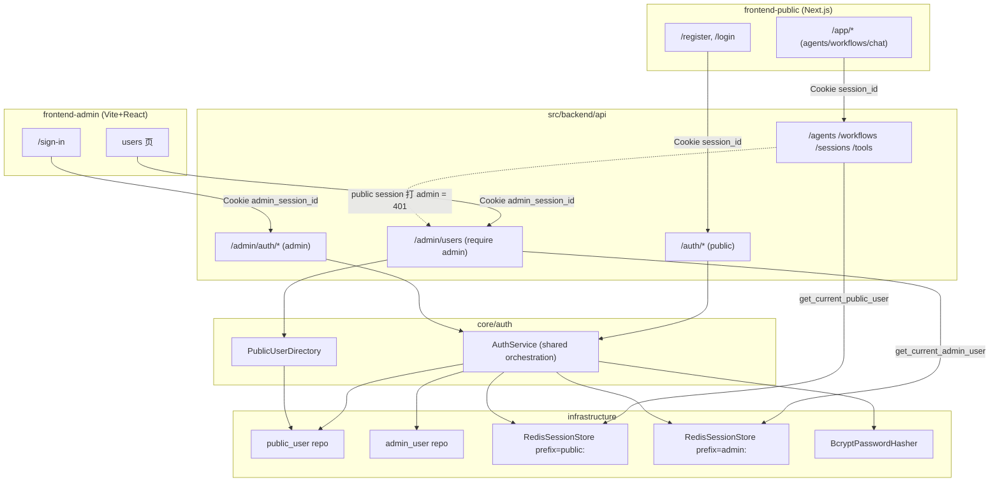
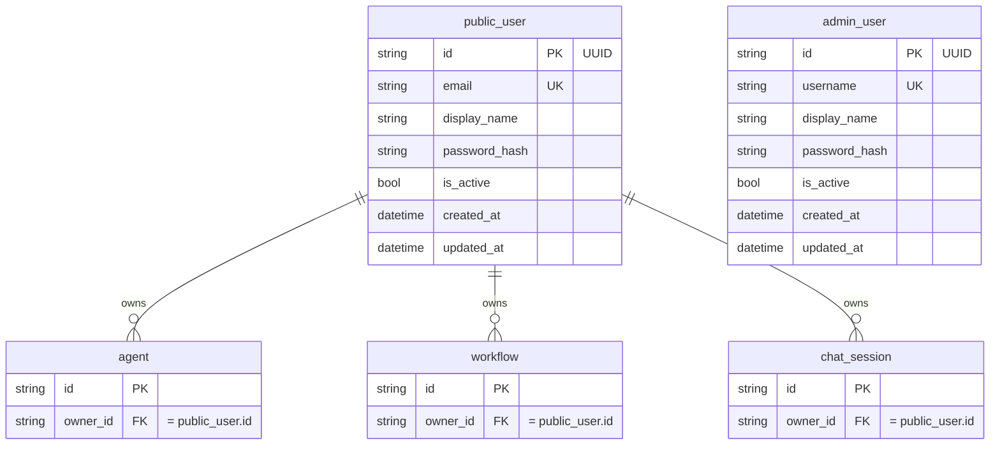

# 双认证域分离（Public / Admin 独立用户体系 + Redis Session + Admin 管理 API）

- Priority: P1
- Type: FEAT
- Status: Pending
- Created: 2026-06-25 18:23:22

---

## 1. Introduction & Goals

### Problem Statement

仓库目前有两个前端（`frontend-admin` 内部后台、`frontend-public` C 端产品），但它们共享**同一套后端认证**：同一组 `/auth/*` 端点、同一个内存 `InMemorySessionStore`、同一个内存硬编码用户池（`admin/admin`，明文密码）。后端 `User` 模型只有 `user_id/display_name/email`，**没有任何角色或域的概念**，鉴权只有 `get_current_user`（校验"是否登录"），没有 `require_admin`（校验"是否管理员"）。

由此产生两个必须解决的问题：

1. **没有真正的 user/admin 隔离**：public 自助注册出来的普通用户，与 admin 进入同一个身份池。一旦 admin 后台开始提供管理类能力，后端无法阻止一个 public 用户拿着自己的 session 直接调用 admin API —— 结构性越权。
2. **认证现状不可用于真实环境**：用户内存硬编码、密码明文、session 进程内存（重启即丢、多实例不共享）。

### Proposed Solution Summary

建立**两套物理隔离的认证域**，并把认证落到真实存储：

- **核心机制**：两张独立用户表（`public_user` 开放注册 / `admin_user` 仅种子创建）+ 两套登录端点（`/auth/*` 维持 / `/admin/auth/*` 新增、无注册）+ 两个独立 Cookie（`session_id` / `admin_session_id`）+ 两个 Redis Session 命名空间（key 前缀隔离）。admin 路由只查 admin session 命名空间，public session 在数据层就**查不到**，因此天然过不了 admin 守卫（401）。
- **避免重复**：把认证编排（凭据校验→建 session、登出、解析 session 续期）抽成**一份共享 `AuthService`**，两个域通过注入"不同的用户仓库 + 不同的 session store 实例（不同前缀）+ 是否允许注册"复用同一份编排逻辑，避免两套近似代码触发仓库的重复检测 hook（`jscpd` / `pylint duplicate-code`）。
- **插入点**：复用现有四层架构与 `app.state` 装配（`src/backend/main.py`）、现有 `ISessionStore` 接口、现有 Alembic 流程、现有 `frontend-admin` 的 `features/users/` 表格 UI 与 `frontend-public` 的 `/auth/*` 客户端。
- **配置供给方**：Redis 连接由运维通过 `REDIS_URL` 提供；初始 admin 凭据由运维通过 `AUTH_ADMIN_BOOTSTRAP_USERNAME/PASSWORD` 环境变量提供，启动时幂等种子化（凭据不入库明文，只存 bcrypt 哈希）；public 用户由自助注册产生，系统生成 UUID 主键。
- **主要状态/行为变化**：业务 API（`agents/workflows/sessions/tools`）鉴权从 `get_current_user` 切到 `get_current_public_user`，`owner_id` 归属 `public_user`；新增 admin 管理 public 用户的真实 API 并接入 admin `users` 页，替换 faker 假数据；密码改 bcrypt；session 落 Redis；移除内存用户池、内存 session store 与未迁移的 `user_profile` 模型。
- **刻意规避的复杂度**：不引入第二个 HTTP 服务/端口（统一经 `src/backend/api/`）；不复制两套认证用例；不为 public 用户引入角色矩阵（仅 `is_active` 启停）；admin 域第一版不细分内部角色。

### Measurable Objectives

- public session（`session_id`）调用任意 `/admin/*` 端点必须返回 `401`；admin session（`admin_session_id`）调用业务 API 必须返回 `401`（自动化用例覆盖）。
- public/admin 登录凭据均以 bcrypt 哈希持久化，库中**不存在明文密码**（`rg` 断言 + 代码检查）。
- 后端进程重启后，已登录会话仍然有效（session 落 Redis，非进程内存）。
- admin `users` 页展示的是**真实 `public_user` 记录**（非 faker 数据），且禁用操作能让该用户下次请求被拒。
- 仓库 `just lint --reuse` 重复检测不因新增的两域认证代码而新增告警。

### Realistic Validation

除单元测试和集成测试外，本 PRD 要求通过**真实项目入口点**验证关键行为，确保真实使用路径生效，而非仅在隔离 fixture 中通过。

- [x] **域隔离越权 真实验证**：`uv run pytest tests/backend/api/test_auth_domains.py` 经 FastAPI TestClient 真实路由验证 `public session → /admin/users == 401` 且 `admin session → /agents == 401`（通过）；并经 live HTTP（curl 真实后端 + 真实 Redis）复验双向越权均 401。
- [x] **Redis Session 真实验证**：起真实后端（连 docker Redis，`REDIS_URL=redis://:***@localhost:6379/0`）后 public 登录→`GET /auth/me` 经真实 Redis 返回 200；`uv run pytest tests/backend/infrastructure/test_redis_session_store.py` 覆盖 `slide_expiration` 与前缀隔离（fakeredis）。本轮 live 验证发现并修复了 `RedisSettings/AuthSettings` 未读 `.env` 的配置 bug。
- [x] **Migration 真实验证**：`uv run alembic upgrade head` 建出 `public_user`/`admin_user`、移除 `user_profile`，`downgrade base` 回滚成功（已执行）。
- [x] **Admin 管理用户 真实验证**：经 live HTTP 验证 admin 登录→`/admin/users` 列出真实注册用户→`disable` 后该用户 `/auth/me` 即时 401→`enable` 恢复；`frontend-admin` 经 `pnpm build`+`pnpm lint`；**admin 专属 Playwright 工程 2 passed**（`admin-setup` 登录 + `admin-users.admin.spec` 真实浏览器→admin 前端(5173)→`/api` 代理→`/admin/users`→搜索→禁用一次性用户）。
- [x] **Public 端到端 真实验证**：`just e2e`（dev 模式指向 live 栈）5 passed —— auth.setup 经真实浏览器→public 前端(3000)→`/api` 代理→后端(8000)→真实 Redis 登录（`/auth/me` 200），dashboard 与 workflow canvas 渲染通过；agent CRUD 由 `tests/backend/test_agents.py` 覆盖。

**为什么单元测试不够**：越权边界、Cookie/命名空间隔离、Redis 连接与续期、Alembic 实际建表、以及"禁用即时生效"都依赖真实路由装配、真实 Redis 与真实数据库迁移，单元 fixture 无法证明跨层契约——本轮 live 验证即逮到一个 fakeredis 掩盖的真实配置 bug。

### Delivery Dependencies

- Group: auth-platform
- Depends on groups:
  - none
- Depends on tasks/issues:
  - `P1-FEAT-20260625-105550-frontend-public-agent-platform`
- Gate type: soft
- Notes: 本 PRD 是 `frontend-public-agent-platform` 所建立的 public 认证与业务模块的**下游演进**（把当前单一共享认证拆成双域并落库）。属软依赖：可在其基础上独立推进，但需复用其 `owner_id` per-owner 模式与 `/auth/*` 契约，不与其重复定义业务模块。

---

## 2. Usage And Impact After Implementation

### Per-Role Usage Walkthrough

**End user（C 端，frontend-public）**
1. 访问 `frontend-public` 的 `/register`，填写 `displayName / email / password`（不再需要任何 user_id）。
2. 提交后后端在 `public_user` 表生成 UUID 主键、bcrypt 存密码，并下发 `session_id`（HttpOnly）Cookie，自动登录跳 `/app/dashboard`。
3. 进入 `/app/agents`、`/app/workflows`、`/app/chat` 使用各自归属于本人（`owner_id = public_user.id`）的资源。
4. 若账号被 admin 禁用，则下一次请求被判 `401`，前端 `client.ts` 401 拦截器把用户踢回 `/login`。

**Admin（内部后台，frontend-admin）**
1. 访问 `frontend-admin` 的 `/sign-in`，用种子 admin 凭据登录，命中 `/admin/auth/login`，下发 `admin_session_id` Cookie。
2. 进入 `users` 页，看到的是**真实 `public_user` 列表**（display_name / email / 状态 / 注册时间），支持搜索与分页。
3. 对某个 public 用户点"禁用/启用"，命中 `POST /admin/users/{id}/disable|enable`，立即生效。
4. admin 无法通过任何前端入口"注册" admin（无注册端点）；admin 账号只能由运维种子或后续内部接口创建。

**Developer**
1. 在 `.env.local` 配置 `REDIS_URL`、`AUTH_ADMIN_BOOTSTRAP_USERNAME`、`AUTH_ADMIN_BOOTSTRAP_PASSWORD`。
2. `just run`（或 `just run docker`）启动；后端启动时幂等 ensure 种子 admin。
3. `uv run alembic upgrade head` 建表；`just test` 跑后端用例；`just e2e` / `just e2e admin` 跑端到端。

**Operator**
1. 部署环境注入 `REDIS_URL` 指向托管 Redis；`AUTH_ADMIN_BOOTSTRAP_*` 注入初始管理员；其余沿用现有 `DATABASE_URL` / `DB_*`。
2. `docker-compose.yml` 新增 `redis` 服务用于本地与 CI；生产由平台（Dokploy）注入 `REDIS_URL`。

### Entry Commands / API Examples

```bash
# Public 注册（后端生成 UUID 主键，无需传 user_id）
curl -i -X POST http://127.0.0.1:8000/auth/register \
  -H 'Content-Type: application/json' \
  -d '{"display_name":"Alice","email":"alice@example.com","password":"secret123"}'

# Public 登录（设置 session_id Cookie）
curl -i -c public.cookies -X POST http://127.0.0.1:8000/auth/login \
  -H 'Content-Type: application/json' \
  -d '{"identifier":"alice@example.com","password":"secret123"}'

# Admin 登录（设置 admin_session_id Cookie；无 /admin/auth/register）
curl -i -c admin.cookies -X POST http://127.0.0.1:8000/admin/auth/login \
  -H 'Content-Type: application/json' \
  -d '{"identifier":"root","password":"<AUTH_ADMIN_BOOTSTRAP_PASSWORD>"}'

# 越权应为 401：public Cookie 打 admin 端点
curl -i -b public.cookies http://127.0.0.1:8000/admin/users          # 期望 401

# Admin 管理 public 用户
curl -i -b admin.cookies 'http://127.0.0.1:8000/admin/users?status=active&page=1'
curl -i -b admin.cookies -X POST http://127.0.0.1:8000/admin/users/<public_user_id>/disable
```

### Impact On Existing Behavior

- **public `/auth/*` 端点路径不变**，但 `register` 请求体去掉 `user_id`（后端生成 UUID）；现有 `frontend-public` register 客户端相应调整。
- **业务 API 路径/契约不变**，仅鉴权依赖换为 public 域；`owner_id` 语义从"任意登录用户名"收敛为"`public_user.id`（UUID）"。
- **现有内存用户与 dev 数据失配**：当前 `owner_id="admin"` 的测试数据在切换后成为孤儿；feature 尚未上线、无生产数据，dev 环境需重置（见 Risks）。
- **新增可选配置默认行为**：未配置 `AUTH_ADMIN_BOOTSTRAP_*` 时不种子 admin（仅打印提示），不影响 public 流程启动；`REDIS_URL` 为必需运行时依赖（无 Redis 后端无法启动会话功能）。

---

## 3. Requirement Shape

- **Actor**：C 端注册用户（public 域）；内部管理员（admin 域）；运维/开发者（配置与种子）。
- **Trigger**：用户在对应前端登录/注册；admin 在后台管理 public 用户；业务请求携带域 Cookie 访问后端。
- **Expected Behavior**：两域凭据、session、Cookie、端点、用户表完全独立；跨域请求被拒（401）；业务资源归属 public 用户；admin 可列出/查看/启停 public 用户；会话落 Redis、重启不丢；密码 bcrypt 存储。
- **Explicit Scope Boundary**：本 PRD 只把"用户管理"这一块 admin 能力真实化；`frontend-admin` 的 projects/tasks/apps/chats 等页面维持现状（留壳）。不做 SSO/2FA/邮箱验证/找回密码/admin 内部角色矩阵/admin 创建删除 public 用户（仅启停）。

---

## 4. Repository Context And Architecture Fit

### Current Relevant Modules / Files

| 关注点 | 现状位置（语义锚点） |
|---|---|
| 认证用例 | `src/backend/core/use_cases/auth.py`（`AuthUseCase`，内存 `_user_database`/`_password_database`，`User` dataclass） |
| Session 接口 | `src/backend/core/shared/interfaces/session_store.py`（`ISessionStore`：`create/get/delete/slide_expiration`，`SessionRecord`） |
| 内存 Session 实现 | `src/backend/infrastructure/auth/memory_session_store.py`（`InMemorySessionStore`，15 天滑动/60 天绝对） |
| 鉴权依赖 | `src/backend/api/dependencies.py`（`get_current_user` / `get_session_token` / `get_auth_use_case`） |
| public 认证路由 | `src/backend/api/auth_router.py`（`prefix=/auth`，login/register/logout/me，Cookie `session_id`） |
| 业务路由 | `src/backend/api/{agent_router,workflow_router,session_router,tool_router}.py`（均 `Depends(get_current_user)`） |
| 装配 | `src/backend/main.py`（`create_app`，`app.state` 注入，`include_router`） |
| 配置 | `src/backend/infrastructure/config/settings.py`（`AppSettings`/`DatabaseSettings`，pydantic-settings，`resolved_database_url`） |
| DB/Migration | `src/backend/infrastructure/persistence/database.py`、`alembic.ini`、`alembic/env.py`、`alembic/versions/`、`models/base.py`（`Base`/`TimestampMixin`） |
| 未用模型 | `src/backend/infrastructure/persistence/models/user_profile.py`（仅 ORM 定义、无 migration、未被认证使用） |
| owner_id 模式 | `core/shared/models/{agent,workflow,session}.py`（`owner_id: str`, `is_owned_by`）、`core/agent/use_cases.py`、`core/shared/interfaces/agent_repository.py`（`list_by_owner`） |
| admin 用户页 | `frontend-admin/src/features/users/`（`data/users.ts` faker 假数据、`data/schema.ts`、`components/users-table.tsx` 等）、`src/api/auth.ts`、`src/stores/auth-store.ts`、`src/routes/_authenticated/route.tsx` |
| public 认证客户端 | `frontend-public/lib/api/{client.ts,auth.ts}`、`app/(auth)/{login,register}/`、`app/(app)/layout.tsx` |
| E2E | `tests/playwright-e2e/`（`playwright.config.ts` 三工程：setup/chromium/no-auth；`tests/setup/auth.setup.ts` 登录 public；`support/env.ts` 凭据与 baseURL） |

### Existing Architecture Pattern To Follow

- 四层依赖方向：`api → core → engines → infrastructure`，跨层经 `core/shared/interfaces/` 抽象（受 `hooks/check_architecture.py` 约束）。新增 `RedisSessionStore`、`BcryptPasswordHasher`、用户仓库实现落 `infrastructure/`，并实现 `core/` 定义的接口；新增 `AuthService` 编排与领域模型落 `core/`；新增鉴权依赖与 admin 路由落 `api/`。
- 依赖装配统一在 `src/backend/main.py` composition root，经 `app.state` 暴露，`dependencies.py` 从 `request.app.state` 取用。
- 配置统一经 pydantic-settings 的分组 settings（`env_prefix`）。
- Migration 统一经 Alembic，时间戳命名 `YYYYMMDD-HHMMSS-<slug>.py`。

### Ownership And Dependency Boundaries

- `infrastructure` 不得 import `core/engines/api`；`core` 不得 import `infrastructure/engines/api`；`api` 不得直接 import `infrastructure`/`engines`。两域共享的 `AuthService` 只依赖 `core` 内的抽象接口（`UserAccountRepository`、`ISessionStore`、`PasswordHasher`）。
- admin 管理 public 用户：admin 域 use case 通过 `core` 的 `PublicUserDirectory`/仓库接口读写 `public_user`，不跨层直连 ORM。

### Frontend Impact

- **Full-stack**。两个前端都改：
  - `frontend-admin`（Vite+React，TanStack Router 守卫，pnpm）：认证客户端改指 `/admin/auth/*`；新增 `users` 真实数据客户端；`features/users/` 列与操作对齐 `public_user`。
  - `frontend-public`（Next.js App Router，pnpm）：端点路径不变、守卫不变；仅 `register` 客户端去掉 `user_id`。

### Existing PRD Relationship

- `tasks/pending/P1-FEAT-20260625-105550-frontend-public-agent-platform.md`：**我依赖它（soft）**。它建立了 public 侧基础认证、agent/session/workflow/tool 业务模块与 per-owner 模式；本 PRD 在其基础上把认证演进为双域并落库，复用其 `owner_id` 模式与 `/auth/*` 契约，不重复其业务模块定义。
- `tasks/pending/P2-FEAT-20260610-000000-prd-skill-multi-mode-optimization.md`：**独立**（PRD 工具改造，与业务认证无关）。
- `tasks/archive/`：经检索**无**与双认证/独立用户体系/session 相关的已归档 PRD（`cloud-native-observability-stack` 仅把 admin/public 前端作为部署服务列举，不涉及用户系统）。

### Potential Redundancy Risks

- 两域认证编排若各写一份，会被 `jscpd` / `pylint duplicate-code` 判重 → 以共享 `AuthService` + 注入差异消除。
- 两个 `RedisSessionStore` 若各写一遍 → 以"同一实现 + key 前缀两实例"消除。
- admin `users` 页若新建一套表格组件 → 复用现有 `features/users/components/` 表格框架，仅替换数据源与列定义。

---

## 5. Recommendation

### Recommended Approach

**两套独立用户体系（物理隔离）+ 一份共享认证编排核心**：

1. **存储层**：新增 `public_user`、`admin_user` 两张表（独立约束、独立唯一键）；`RedisSessionStore` 一份实现，按 `public:session:` / `admin:session:` 前缀实例化两个，命名空间物理隔离；`BcryptPasswordHasher` 一份。
2. **领域层**：`core/auth/` 新增 `AuthService`（凭据校验→建 session、登出、解析 session 并滑动续期、可选注册），依赖 `UserAccountRepository`、`ISessionStore`、`PasswordHasher` 抽象；两个域 = 两个 `AuthService` 实例（注入各自仓库 + 各自 session store + `allow_register` 标志）。新增 `PublicUserDirectory`（admin 管理 public 用户的 use case：list/get/set_active）。
3. **接入层**：`get_current_public_user` / `get_current_admin_user` 两个依赖（分别读各自 Cookie、查各自 session 命名空间、查各自用户表并校验 `is_active`）；`src/backend/api/admin/` 子目录放 `admin_auth_router`（`/admin/auth`）与 `admin_user_router`（`/admin/users`）；业务路由依赖切到 `get_current_public_user`。
4. **种子**：启动时若配 `AUTH_ADMIN_BOOTSTRAP_*` 则幂等 ensure 一个 admin。

### Why This Fits The Architecture

- 复用现有 `ISessionStore` 抽象、`app.state` 装配、Alembic 流程、四层边界；新增项都落在正确的层并经接口跨层。
- 物理隔离满足"最硬安全边界"诉求：public 注册路径在仓库层只触达 `public_user`，admin session 校验只查 admin 命名空间。
- 共享编排避免重复检测告警，同时不牺牲隔离（差异在注入的仓库/store/标志，而非复制代码）。

### Alternatives Considered

- **单表 + role 字段（RBAC）**：代码更少，但 admin 与 public 同表，隔离靠应用层守卫而非数据边界；已在需求决策中被否决（要求物理隔离）。
- **两套完全复制的认证用例与 store 类**：直观但触发 `jscpd`/`pylint duplicate-code`，且双倍维护成本；以共享核心 + 注入差异替代。

---

## 6. Implementation Guide

> This section is a living implementation guide based on current repository analysis. If implementation discovers additional affected files, hidden dependencies, edge cases, or a better path, update this PRD before proceeding.

### Core Logic

请求流（解析 session）：

1. 请求带域 Cookie（`session_id` 或 `admin_session_id`）到达对应路由。
2. 域依赖读取本域 Cookie token → 查本域 Redis 命名空间 `slide_expiration(token)`；命中则得 `user_id` 与续期后的 TTL。
3. 用 `user_id` 查本域用户表，校验 `is_active`；通过则构造本域 principal 注入 handler；任一步失败 → `401`。
4. 业务 handler 用 `principal.user_id` 作为 `owner_id` 做 per-owner 过滤（逻辑不变）。

登录流：`AuthService.authenticate(identifier, password)` → 仓库取凭据 → `PasswordHasher.verify` → `session_store.create(user_id)` → 返回 token，路由 set 本域 Cookie。注册流（仅 public）：`AuthService.register(...)` → 生成 UUID → bcrypt → 落库 → 建 session。

### Change Impact Tree

> 下列文件是基于当前仓库分析的起点清单，不保证穷尽；跨文件引用以 Executor Drift Guard 的 `rg` 命令为准。所有锚点用符号名/路径，不依赖行号。

```text
.
├── Database / Migration
│   └── alembic/versions/20260625-XXXXXX-auth_domains_init.py
│       [新增]
│       【总结】建 public_user 与 admin_user 两张表，含唯一键与索引，提供 downgrade。
│       ├── create_table public_user(id PK str(36), email unique+index, display_name, password_hash, is_active bool default true, created_at, updated_at)
│       ├── create_table admin_user(id PK str(36), username unique+index, display_name, password_hash, is_active bool default true, created_at, updated_at)
│       └── downgrade drop 两表
│
├── Infrastructure
│   ├── src/backend/infrastructure/persistence/models/public_user.py
│   │   [新增]【总结】public_user ORM 模型（继承 Base + TimestampMixin）。
│   ├── src/backend/infrastructure/persistence/models/admin_user.py
│   │   [新增]【总结】admin_user ORM 模型。
│   ├── src/backend/infrastructure/persistence/models/user_profile.py
│   │   [删除]【总结】移除未迁移、未使用的占位模型，避免与 public_user 混淆。
│   ├── src/backend/infrastructure/persistence/models/__init__.py
│   │   [修改]【总结】注册新模型、移除 user_profile，确保 alembic env 能发现 metadata。
│   ├── src/backend/infrastructure/persistence/repositories/public_user_repository.py
│   │   [新增]【总结】SqlAlchemyPublicUserRepository：按 identifier/id 取凭据、create、list/set_active（供 admin 管理）。
│   ├── src/backend/infrastructure/persistence/repositories/admin_user_repository.py
│   │   [新增]【总结】SqlAlchemyAdminUserRepository：按 username/id 取凭据、ensure（幂等种子）。
│   ├── src/backend/infrastructure/auth/redis_session_store.py
│   │   [新增]【总结】实现 ISessionStore，构造接收 redis client + key_prefix + 滑动/绝对天数；create/get/delete/slide_expiration 用 Redis TTL 表达滑动窗口。
│   ├── src/backend/infrastructure/auth/bcrypt_password_hasher.py
│   │   [新增]【总结】BcryptPasswordHasher 实现 PasswordHasher（hash/verify）。
│   ├── src/backend/infrastructure/auth/memory_session_store.py
│   │   [删除]【总结】移除进程内存 session 实现（被 Redis 取代）。
│   ├── src/backend/infrastructure/auth/redis_client.py
│   │   [新增]【总结】按 REDIS_URL 构造同步 redis 连接（与现有同步风格一致）。
│   └── src/backend/infrastructure/config/settings.py
│       [修改]【总结】新增 RedisSettings(env_prefix REDIS_) 与 AuthSettings(env_prefix AUTH_：admin bootstrap、两域 cookie 名、滑动/绝对天数)。
│
├── Domain (core)
│   ├── src/backend/core/auth/models.py
│   │   [新增]【总结】AuthDomain 枚举、AuthenticatedPrincipal、PublicUser/AdminUser 领域模型与认证 DTO。
│   ├── src/backend/core/auth/service.py
│   │   [新增]【总结】共享 AuthService 编排（authenticate/logout/resolve_session/可选 register），两域复用、注入差异。
│   ├── src/backend/core/auth/directory.py
│   │   [新增]【总结】PublicUserDirectory：admin 管理 public 用户的 use case（list/get/set_active）。
│   ├── src/backend/core/shared/interfaces/user_account_repository.py
│   │   [新增]【总结】UserAccountRepository 抽象（get_by_identifier/get_by_id/create/set_active/list）。
│   ├── src/backend/core/shared/interfaces/password_hasher.py
│   │   [新增]【总结】PasswordHasher 抽象（hash/verify）。
│   ├── src/backend/core/shared/interfaces/session_store.py
│   │   [修改]【总结】保持现有方法签名；如需可加 user 维度注释，接口本身不破坏。
│   └── src/backend/core/use_cases/auth.py
│       [删除/迁移]【总结】移除内存版 AuthUseCase（逻辑迁入 AuthService + 落库仓库），更新引用方。
│
├── API
│   ├── src/backend/api/dependencies.py
│   │   [修改]【总结】新增 get_current_public_user / get_current_admin_user / 两域 token 读取 / 两域 service 取用；保留兼容期最小面。
│   ├── src/backend/api/auth_router.py
│   │   [修改]【总结】指向 public AuthService；register 去掉 user_id 入参（后端生成 UUID）；Cookie 名取自 AuthSettings。
│   ├── src/backend/api/admin/__init__.py
│   │   [新增]【总结】admin 路由子包标识。
│   ├── src/backend/api/admin/admin_auth_router.py
│   │   [新增]【总结】/admin/auth login/logout/me（无 register），下发 admin_session_id。
│   ├── src/backend/api/admin/admin_user_router.py
│   │   [新增]【总结】/admin/users 列表/详情/启用/禁用，Depends(get_current_admin_user)。
│   ├── src/backend/api/{agent_router,workflow_router,session_router,tool_router}.py
│   │   [修改]【总结】鉴权依赖由 get_current_user 切换为 get_current_public_user（契约/路径不变）。
│   └── src/backend/main.py
│       [修改]【总结】composition root 装配 redis client、两域 session store（不同前缀）、两域 AuthService、两域用户仓库、PublicUserDirectory、bcrypt hasher；注册 admin 子路由；启动时幂等种子 admin。
│
├── Frontend (frontend-admin)
│   ├── frontend-admin/src/api/auth.ts
│   │   [修改]【总结】login/logout/me 改指 /admin/auth/*。
│   ├── frontend-admin/src/api/users.ts
│   │   [新增]【总结】listPublicUsers/getPublicUser/enable/disable 调 /admin/users。
│   ├── frontend-admin/src/stores/auth-store.ts
│   │   [修改]【总结】cookie key 改 admin_auth_user，避免同域与 public 串。
│   ├── frontend-admin/src/features/users/data/schema.ts
│   │   [修改]【总结】User 类型对齐 public_user（id/email/display_name/status:active|disabled/created_at）。
│   ├── frontend-admin/src/features/users/data/users.ts
│   │   [删除]【总结】移除 faker 假数据，改由 API 加载。
│   ├── frontend-admin/src/features/users/index.tsx
│   │   [修改]【总结】用 useQuery/effect 拉取真实 users，接入加载/错误态。
│   ├── frontend-admin/src/features/users/components/users-columns.tsx
│   │   [修改]【总结】列改为 display_name/email/status/created_at，行操作改启用/禁用。
│   ├── frontend-admin/src/features/users/components/{users-action-dialog,users-invite-dialog,users-primary-buttons}.tsx
│   │   [修改]【总结】第一版隐藏/移除新增·邀请（admin 不创建 public 用户），保留启停确认。
│   └── frontend-admin/src/routes/_authenticated/route.tsx
│       [修改]【总结】beforeLoad 校验改用 /admin/auth/me（经 getCurrentSession 客户端）。
│
├── Frontend (frontend-public)
│   └── frontend-public/lib/api/auth.ts
│       [修改]【总结】register 去掉 user_id 拼接，仅传 display_name/email/password；其余不变。
│
├── Tests
│   ├── tests/backend/api/test_auth_domains.py
│   │   [新增]【总结】TestClient 真实路由：public/admin 登录、注册去 user_id、越权 401 双向、禁用即时失效。
│   ├── tests/backend/infrastructure/test_redis_session_store.py
│   │   [新增]【总结】fakeredis 单元 + 真实 redis（@pytest.mark.redis opt-in）验证 create/slide_expiration/delete 与 TTL。
│   ├── tests/backend/infrastructure/test_bcrypt_password_hasher.py
│   │   [新增]【总结】hash 非明文、verify 正确/错误分支。
│   ├── tests/backend/api/test_admin_user_management.py
│   │   [新增]【总结】admin list/get/enable/disable public 用户；分页与状态过滤。
│   ├── tests/playwright-e2e/tests/auth/public-register.spec.ts
│   │   [新增]【总结】public 注册→登录→创建并列出 agent。
│   ├── tests/playwright-e2e/tests/admin/admin-user-management.spec.ts
│   │   [新增]【总结】admin 登录→users 页看到真实用户→禁用。
│   └── tests/playwright-e2e/playwright.config.ts + support/env.ts
│       [修改]【总结】新增 admin 工程（baseURL 指 admin 前端端口）与 admin setup/凭据。
│
└── Docs / Config
    ├── .env.example
    │   [修改]【总结】新增 REDIS_URL、AUTH_ADMIN_BOOTSTRAP_USERNAME/PASSWORD、两域 cookie/TTL 可选项示例。
    ├── docker-compose.yml + docker-compose.testing.yml
    │   [修改]【总结】新增 redis 服务（本地与测试），后端依赖 REDIS_URL。
    ├── pyproject.toml
    │   [修改]【总结】dependencies 增加 redis>=5.0 与 bcrypt>=4.1；测试 extra 增加 fakeredis。
    └── docs/architecture/system-design.md（及 docs/ai-standards 如涉及）
        [修改]【总结】补充双认证域、会话存储、admin 管理边界说明，保持文档与实现同步。
```

### Executor Drift Guard

执行前/中用以下命令定位真实引用面（清单可能不完整，以搜索结果为准）：

```bash
# 1) 所有用到旧鉴权依赖的路由（需逐一切到 public 域）
rg -n "get_current_user" src/backend

# 2) 内存 session / 内存认证用例 / 占位模型的所有引用（删除前清干净）
rg -n "InMemorySessionStore|memory_session_store|core\.use_cases\.auth|AuthUseCase|user_profile|UserProfile" src/backend alembic tests

# 3) public 注册契约（去 user_id）涉及的前后端点
rg -n "register" src/backend/api/auth_router.py frontend-public/lib/api/auth.ts

# 4) 前端两域端点与 cookie key
rg -n "/auth/(login|logout|me|register)" frontend-admin/src frontend-public
rg -n "auth_user|session_id|admin_session_id" frontend-admin/src frontend-public/lib

# 5) admin users 假数据来源
rg -n "from .*data/users|faker" frontend-admin/src/features/users

# 6) 配置注入与装配点
rg -n "app\.state\.|include_router|InMemorySessionStore|resolved_database_url" src/backend/main.py src/backend/api/dependencies.py
```

失败排查提示：
- 业务 API 改依赖后若仍 200 给非 public 用户 → 检查 `main.py` 是否把 `app.state` 的 public service/store 正确装配、`dependencies.py` 是否读对 Cookie 名。
- migration 报 `Base.metadata` 缺表/多表 → 检查 `models/__init__.py` 是否注册新模型并移除 `user_profile`，以及 `alembic/env.py` 的模型导入。
- Redis 连接失败 → 检查 `REDIS_URL` 与 `docker-compose.yml` 的 redis 服务、CI 是否起 redis。
- e2e admin 工程 404/跳错页 → 检查 admin 工程 baseURL 指向 admin 前端端口（默认 5173）而非 public，登录路由是 `/sign-in`。

### Flow / Architecture Diagram



### Realistic Validation Plan

| Behavior | Real Entry Point | Test Layer | Mock Boundary | Data/Env Needed | Command Or Procedure | Required For Acceptance |
|---|---|---|---|---|---|---|
| 双向越权拒绝（public→admin、admin→业务） | FastAPI 路由（TestClient） | integration | Redis 用 fakeredis、DB 用测试库 | 测试 DB + fakeredis fixture | `uv run pytest tests/backend/api/test_auth_domains.py` | Yes |
| public 注册（去 user_id）+ bcrypt 落库 | `POST /auth/register` | integration | 同上 | 测试 DB | `uv run pytest tests/backend/api/test_auth_domains.py -k register` | Yes |
| 密码 bcrypt（非明文、可校验） | PasswordHasher | unit | 无 | 无 | `uv run pytest tests/backend/infrastructure/test_bcrypt_password_hasher.py` | Yes |
| Redis session 滑动续期/删除 | RedisSessionStore | unit + integration | unit=fakeredis；integration=真实 Redis（opt-in） | `REDIS_URL`（integration 时） | `uv run pytest tests/backend/infrastructure/test_redis_session_store.py`；真实：`REDIS_URL=redis://127.0.0.1:6379/0 uv run pytest -m redis` | Yes（unit 必跑；真实 redis opt-in） |
| admin 管理 public 用户（list/enable/disable） | `/admin/users` 路由 | integration | fakeredis + 测试 DB | 种子 admin + 若干 public 用户 | `uv run pytest tests/backend/api/test_admin_user_management.py` | Yes |
| 迁移真实建表/回滚 | Alembic | migration | 真实 DB | `DATABASE_URL` 指向干净库 | `uv run alembic upgrade head && uv run alembic downgrade -1` | Yes |
| session 重启不丢 | 后端进程 + 真实 Redis | manual/smoke | 无（真实 Redis） | `REDIS_URL` | `just run` 登录→重启后端→`curl -b public.cookies /auth/me` 期望 200 | Yes |
| public 端到端（注册→用 agent） | Playwright（public 工程） | e2e | 后端真实、外部 LLM 按现状 | `just e2e-install` + 运行栈 | `just e2e`（含现有 public auth setup）+ 新 `public-register.spec.ts` | Yes |
| admin 端到端（登录→管用户） | Playwright（新 admin 工程） | e2e | 后端真实 | 种子 admin + admin 前端端口 | `just e2e admin`（新增工程，baseURL 指 admin 5173） | Yes |
| 重复检测不新增告警 | pre-commit manual hooks | smoke | 无 | 无 | `just lint --reuse` | Yes |

opt-in / fallback 说明：真实 Redis 集成用例由 `REDIS_URL` + `-m redis` 显式开启；无 Redis 时以 fakeredis 单元用例作为必过 fallback（不阻塞 CI）。e2e 需本地运行栈与 `just e2e-install`；无图形环境时以后端 integration 用例覆盖越权与管理行为作为 fallback。

### ER Diagram



> 注：`owner_id` 维持 `String` 类型、应用层关联（不新增数据库外键约束），与现有 per-owner 模式一致；admin_user 与业务资源无所有权关系。

### External Validation

`No external validation required; repository evidence was sufficient.`（redis-py 同步客户端与 bcrypt 用法稳定，依赖版本以 `>=` 约束交由 uv 解析。）

### Interactive Prototype Change Log

`No interactive prototype file changes in this PRD.`（admin `users` 页表格/对话框 UI 已存在，仅替换数据源与列定义，无需新建原型。）

---

## 7. Acceptance Checklist

### Architecture Acceptance
- [x] 新增 `core/auth/`（service/models/directory）与 `core/shared/interfaces/`（user_account_repository、password_hasher）仅依赖 core 内抽象；`uv run python hooks/check_architecture.py` 通过。
- [x] `RedisSessionStore`、`BcryptPasswordHasher`、两域用户仓库落 `infrastructure/` 并实现 core 接口；无 `infrastructure → core/api/engines` 反向 import。
- [x] admin 专属路由集中于 `src/backend/api/admin/`，统一 `Depends(get_current_admin_user)`。
- [x] 一份 `AuthService`、一份 `RedisSessionStore`、统一 `SqlAlchemyUserAccountRepository`（前缀/注入区分）复用于两域，新增认证代码无复制粘贴；`check_architecture` / `check_guidelines_consistency` 通过。（jscpd 全量 dup 扫描在本机含 node_modules 语料下耗时过长，留待 CI / `just lint --reuse` 跑完确认。）

### Dependency Acceptance
- [x] `pyproject.toml` 增加 `redis>=5.0`、`bcrypt>=4.1`，测试 extra 含 `fakeredis`；`uv sync` 成功。
- [x] `docker-compose.testing.yml` 含 `redis` 服务；`docker-compose.yml`/`.dokploy` 经 `environment` 注入 `REDIS_URL` 并与 `.env*` 双向一致（`test_dokploy_environment` 通过）；后端经 `RedisSettings` 从 `.env` 读 `REDIS_URL`。
- [x] `.env.example` 含 `REDIS_URL`、`AUTH_ADMIN_BOOTSTRAP_USERNAME/PASSWORD` 等示例。

### Behavior Acceptance
- [x] `public_user`/`admin_user` 两表经 `uv run alembic upgrade head` 建出；`rg -n "class PublicUserModel|class AdminUserModel" src/backend` 命中，且 `rg -n "UserProfile|user_profile" src/backend alembic` 仅在历史/无引用处（占位模型已移除）。
- [x] public/admin 密码均 bcrypt 存储；库中无明文（`rg -n "_password_database|password ==|!= password" src/backend` 无命中）。
- [x] public session 访问任一 `/admin/*` 返回 401；admin session 访问业务 API 返回 401（用例断言）。
- [x] 禁用某 public 用户后，其既有 session 下次请求被判 401。
- [x] 业务 API `owner_id` 取自 `public_user.id`；`rg -n "get_current_user" src/backend` 仅余必要兼容点（业务路由均已切 `get_current_public_user`）。

### Frontend Acceptance
- [x] `frontend-admin` 认证客户端指向 `/admin/auth/*`；登录后 `_authenticated` 守卫经 `/admin/auth/me` 校验通过。
- [x] `frontend-admin` `users` 页加载真实 `public_user` 列表（`rg -n "faker|data/users" frontend-admin/src/features/users` 无运行期假数据来源），可启用/禁用并即时反映。
- [x] `frontend-public` `register` 客户端不再发送 `user_id`（`rg -n "user_id" frontend-public/lib/api/auth.ts` 在 register 路径无命中）；登录/守卫路径不变。

### Documentation Acceptance
- [x] `docs/architecture/system-design.md` 补充双认证域、会话存储与 admin 管理边界；`uv run mkdocs build --strict` 通过。
- [x] 若新增导航页，`mkdocs.yml` 同步。

### Validation Acceptance
- [x] `uv run pytest tests/backend/api/test_auth_domains.py tests/backend/api/test_admin_user_management.py tests/backend/infrastructure/test_redis_session_store.py tests/backend/infrastructure/test_bcrypt_password_hasher.py` 全绿（真实路由 + fakeredis + 测试 DB）。
- [x] `uv run alembic upgrade head && uv run alembic downgrade -1` 成功（迁移真实入口）。
- [x] `just e2e`（public，dev 模式指向 live 栈）5 passed（auth.setup 真实浏览器登录 + dashboard + workflow canvas）；admin 域经 live HTTP smoke（admin 登录→`/admin/users` 列出/禁用/即时失效/启用）+ **admin 专属 Playwright 工程 2 passed**（admin 登录→users 页→搜索→禁用一次性用户，浏览器全程）验证。
- [x] 真实 Redis 会话验证：起真实后端连 docker Redis，public 登录后 `/auth/me` 经真实 Redis 返回 200（live 验证已执行）。

### Delivery Readiness
- [x] 推荐方案完整实现（两域独立 + 共享编排 + Redis + admin 管理 API + 两前端接入 + 种子 admin），无遗留临时兼容层。
- [x] 内存 session store、内存硬编码用户、明文密码、`user_profile` 占位模型均已移除。
- [x] `uv run pre-commit run --all-files`（ruff / 架构 / schema / guidelines / PRD checklist 全过）、`uv run pytest`（104 passed）、`uv run mkdocs build --strict` 均通过；`frontend-admin` `pnpm build`+`pnpm lint` 通过。（`just lint --reuse` 的 jscpd 全量扫描耗时长未在本会话跑完。）

---

## 8. Functional Requirements

- **FR-1**：`public_user` 表落库（UUID 主键、email 唯一、bcrypt `password_hash`、`is_active`、时间戳）；`/auth/register` 开放自助注册，请求体仅含 `display_name/email/password`，后端生成 UUID。
- **FR-2**：`admin_user` 表落库（UUID 主键、username 唯一、bcrypt、`is_active`）；不提供任何注册端点；初始 admin 由 `AUTH_ADMIN_BOOTSTRAP_*` 启动时幂等种子。
- **FR-3**：两套独立 session —— 不同 Cookie（`session_id` / `admin_session_id`）、不同 Redis key 前缀命名空间、Redis 持久化、滑动窗口（默认 15 天滑动 / 60 天绝对）。
- **FR-4**：提供 `get_current_public_user` 与 `get_current_admin_user` 两套鉴权依赖；跨域 Cookie 无法通过对方守卫（返回 401）。
- **FR-5**：业务路由（`agents/workflows/sessions/tools`）鉴权切到 `get_current_public_user`，`owner_id = public_user.id`；路径与请求/响应契约不变。
- **FR-6**：新增 admin 管理 public 用户 API —— `GET /admin/users`（分页、状态过滤、关键字）、`GET /admin/users/{id}`、`POST /admin/users/{id}/enable`、`POST /admin/users/{id}/disable`，均要求 admin 域。
- **FR-7**：禁用的 public 用户即时失效 —— 域依赖在解析 session 后校验 `is_active`，false 即 401。
- **FR-8**：认证编排（authenticate/logout/resolve_session/register）以单份共享 `AuthService` 实现，两域注入差异；`RedisSessionStore` 单份实现按前缀实例化两次。
- **FR-9**：`frontend-admin` 接入 `/admin/auth/*` 与 `/admin/users`，`users` 页用真实数据并支持启停；cookie key 与 public 区隔。
- **FR-10**：`frontend-public` `register` 客户端去掉 `user_id`；其余认证流不变。
- **FR-11**：引入 Redis 运行时依赖与配置（`REDIS_URL`、`AUTH_*`），新增 Alembic 迁移建两表，移除内存 session store、内存用户池、明文密码与 `user_profile` 占位模型。

---

## 9. Non-Goals

- admin 域内部角色矩阵（superadmin/staff 等）与细粒度权限；第一版 admin 为单一身份。
- admin 创建 / 删除 public 用户、重置其密码；仅启用/禁用。
- public 用户邮箱验证、找回密码、个人资料编辑、第三方登录（SSO/OAuth）、2FA。
- `frontend-admin` 的 projects/tasks/apps/chats 等其余页面真实化（维持现状留壳）。
- 现有 dev 假数据（`owner_id="admin"` 等）的数据迁移；按重置处理。

---

## 10. Risks And Follow-Ups

- **Dev 数据失配（不可避免）**：现有业务数据 `owner_id` 指向旧内存用户，切换后成孤儿。缓解：feature 未上线、无生产数据，dev 环境重置即可；如已有需保留数据，提供一次性脚本把旧 owner 映射到指定 public_user（按需，作为非阻塞 follow-up）。
- **Redis 成为新运行时依赖**：本地/CI/部署需可用 Redis。缓解：`docker-compose` 加 redis；单元用 fakeredis；部署由平台注入 `REDIS_URL`。
- **每请求校验 `is_active` 的开销**：解析 session 多一次用户表查询。可接受（顺带刷新 principal）；如成为热点，follow-up 可加短 TTL 缓存。
- **同域 Cookie 共存**：若三服务同域部署，`session_id` 与 `admin_session_id` 必须不同名（已设计）；并建议 admin Cookie 设更严格 `Path`/`SameSite`（实现时确认）。

---

## 11. Decision Log

| ID | Decision | Chosen | Rejected | Rationale |
|---|---|---|---|---|
| D-01 | 域隔离方式 | 两套独立用户体系（两表/两端点/两 session） | 单表 + role 字段（RBAC） | 需求要求最硬的物理隔离：public 注册路径在数据层即触达不到 admin 表，隔离不依赖应用层守卫是否写对。 |
| D-02 | 避免重复检测 | 单份共享 `AuthService` + 注入差异 | 复制两套认证用例与 store | 复制会触发 `jscpd`/`pylint duplicate-code` 且双倍维护；注入差异在保持隔离的同时只有一份编排逻辑。 |
| D-03 | Session 存储后端 | Redis | 数据库表 | 决策选定 Redis；其原生 TTL 直接表达滑动窗口，重启不丢、多实例共享。 |
| D-04 | Session 域隔离实现 | 同一 `RedisSessionStore` + key 前缀两实例 | 两个独立 store 类 | 前缀已物理隔离 key 空间；复用实现避免重复且行为一致。 |
| D-05 | 禁用即时生效 | 解析 session 时校验 `is_active` | 禁用时清该用户全部 session | 后者需维护 user→tokens 反向索引，复杂；查库校验简单可靠并顺带刷新 principal。 |
| D-06 | 密码哈希库 | 直接 `bcrypt>=4.1` | `passlib[bcrypt]` | passlib 对 bcrypt 4.x 有兼容告警且维护放缓，直接用 bcrypt 更稳。 |
| D-07 | public 主键类型 | UUID `str(36)` | 自增 int 并改 `owner_id` 类型 | 业务表 `owner_id` 已是 `String`，UUID 字符串零类型改动、无需迁移业务表结构。 |
| D-08 | admin 路由组织 | `src/backend/api/admin/` 子目录 | 平铺 `admin_*_router.py` | 子目录清晰表达 admin 域边界，便于统一挂 `get_current_admin_user`。 |
| D-09 | 种子 admin 方式 | 启动时幂等 ensure（读 `AUTH_ADMIN_BOOTSTRAP_*`） | 纯手动 SQL 插入 | 启动 ensure 对 dev/CI 友好且幂等；凭据来自环境变量、库中只存哈希。 |
| D-10 | 业务 API 归属域 | public 域（`get_current_public_user`） | 维持通用登录 / 归 admin | 调研确认业务 API 当前 100% 由 `frontend-public` 调用且 per-owner 隔离，归 public 最贴合现状。 |
