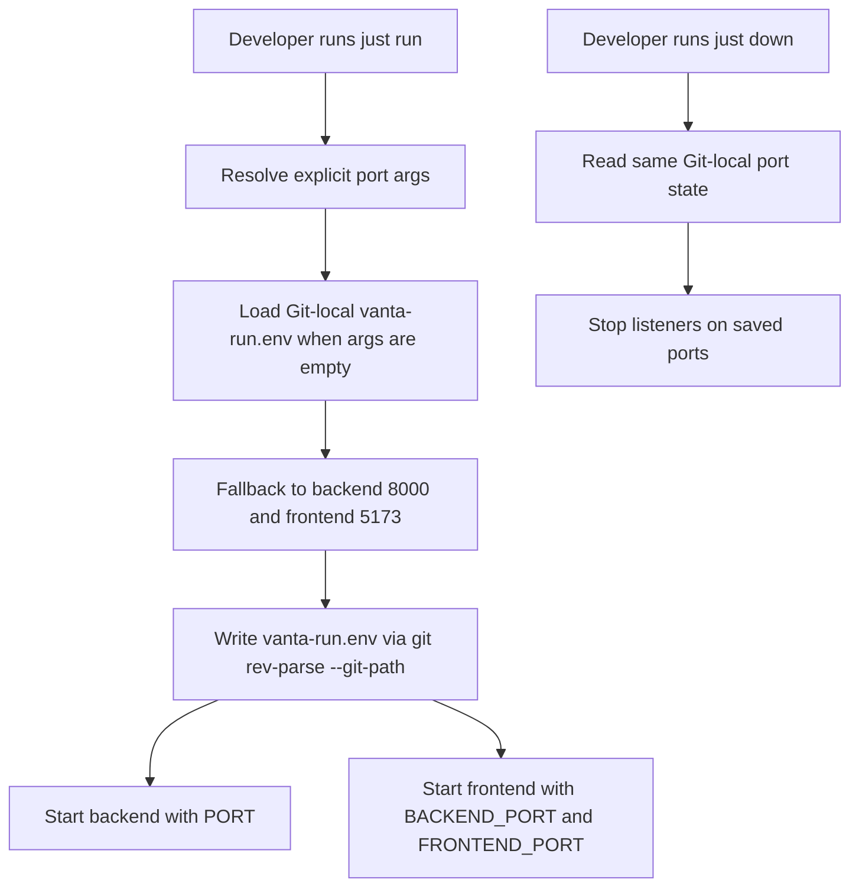

# P2-FEAT-20260604-191912 Remember Run Ports

## 1. Introduction & Goals

Developers need `just run` to remember custom backend and frontend ports per Git worktree, then reuse those ports on later `just run` and `just down` calls without repeating arguments. The change should keep the existing `just run` developer entry point, avoid tracked runtime files, and work in both the main repository checkout and linked worktrees.

Goals:

- Let `just run backend_port=8010 frontend_port=5178` persist the selected ports for the current Git worktree.
- Let later `just run` reuse the saved ports when no port arguments are provided.
- Add `just down` so local backend and frontend processes can be stopped by the saved ports.
- Keep Vite from silently moving to a different port, so saved-port shutdown remains accurate.

### Realistic Validation

- [x] **Run command real validation**: through `just run backend_port=8010 frontend_port=5178`, verify the Git-local state file is written with both ports.
- [x] **Remembered port real validation**: through a later `just run` or dry-run command inspection, verify no-argument startup resolves the saved ports.
- [x] **Down command real validation**: through `just down`, verify the command reads the saved ports and attempts to stop those listeners.
- [x] **为什么单元测试不够**：端口记忆 depends on real `just`, shell expansion, Git worktree path resolution, and Vite startup behavior, which isolated tests cannot fully prove.

## 2. Requirement Shape

- **Actor**: A developer running the template app locally.
- **Trigger**: The developer starts services with `just run`, optionally passing `backend_port` and `frontend_port`, then later starts or stops services again.
- **Expected behavior**: Explicit port arguments are saved in a Git-local runtime state file; later `just run` and `just down` reuse those values by default.
- **Scope boundary**: This is a local development workflow change only. It does not change Docker Compose port mapping, production deployment, backend API behavior, or application data models.

## 3. Repository Context And Architecture Fit

Current relevant paths:

- `justfile`: owns developer task entry points such as `run`, `test`, `lint`, and `docs-serve`.
- `frontend/vite.config.ts`: already reads `BACKEND_PORT`, `FRONTEND_PORT`, and `BACKEND_URL` from environment variables.
- `docs/getting-started.md`, `docs/ai-standards/tooling.md`, and `README.md`: document local development commands.

Existing architecture pattern:

- Runtime developer workflow belongs in `justfile`.
- Frontend dev server configuration belongs in Vite config and should be driven by environment variables.
- Local state that should not be committed belongs under Git-local paths, not normal repository files.

Ownership and dependency boundaries:

- No backend layer changes are required.
- No frontend business code changes are required.
- The persisted port file is runtime state and must remain outside version control.

Constraints:

- `git rev-parse --git-path vanta-run.env` must be used so the state path resolves correctly in both main checkouts and linked worktrees.
- Vite must use `strictPort` so the saved frontend port remains the actual frontend port.
- `just down` must handle Uvicorn reload mode, where multiple Python processes may listen on the same port.

## 4. Recommendation

### Recommended Approach

Extend the existing `run` recipe with optional `backend_port` and `frontend_port` parameters, persist resolved ports to `$(git rev-parse --git-path vanta-run.env)`, and add a `down` recipe that reads the same file and stops listeners on the resolved ports. Set Vite `strictPort: true` to prevent automatic port drift.

This is the best fit because the behavior is entirely a local task-runner concern and the repository already uses `just` as the canonical developer command surface. The frontend already has environment-variable based port configuration, so no new frontend abstraction is needed.

### Alternatives Considered

- **Tracked `.env` defaults**: rejected because per-developer and per-worktree runtime state should not be committed or create working-tree noise.
- **`.claude` runtime file**: rejected because this is not Claude-specific and should work for all tools and plain terminal usage.
- **Killing broad process name patterns**: rejected because it risks stopping unrelated services; port-based shutdown is more targeted.

## 5. Implementation Guide

This section is a living implementation guide based on current repository analysis. If implementation discovers additional affected files, hidden dependencies, edge cases, or a better path, update this PRD before proceeding.

### Core Logic

`just run` resolves ports in this order:

1. Explicit `backend_port` and `frontend_port` arguments.
2. Existing `BACKEND_PORT` and `FRONTEND_PORT` from the Git-local state file.
3. Defaults: backend `8000`, frontend `5173`.

After resolution, `just run` writes:

```env
BACKEND_PORT=<resolved backend port>
FRONTEND_PORT=<resolved frontend port>
```

to `git rev-parse --git-path vanta-run.env`.

`just down` resolves the same state and stops listeners on the selected ports using `lsof -tiTCP:<port> -sTCP:LISTEN`. It supports `all`, `backend`, `frontend`, and `docker` targets.

### Change Impact Tree

```text
.
├── justfile
│   [修改]
│   【总结】Adds per-worktree port memory to local run commands and introduces targeted local shutdown.
│
│   ├── Extends `run` with `backend_port` and `frontend_port`.
│   ├── Persists resolved ports under `git rev-parse --git-path vanta-run.env`.
│   ├── Injects `PORT`, `BACKEND_PORT`, and `FRONTEND_PORT` into backend and frontend commands.
│   └── Adds `down` with `all`, `backend`, `frontend`, and `docker` targets.
│
├── frontend/
│   └── vite.config.ts
│       [修改]
│       【总结】Pins Vite to the configured frontend port so saved-port shutdown stays reliable.
│
│       └── Sets `server.strictPort` to `true`.
│
├── docs/
│   ├── getting-started.md
│   │   [修改]
│   │   【总结】Documents custom run ports, saved port reuse, and the new shutdown command.
│   │
│   └── ai-standards/tooling.md
│       [修改]
│       【总结】Records Git-local run port state as part of the shared tooling standard.
│
└── README.md
    [修改]
    【总结】Adds quick command references for saved ports and `just down`.
```

### Executor Drift Guard

Start with the listed files, but verify hidden references before delivery:

```bash
rg -n "just run|just down|BACKEND_PORT|FRONTEND_PORT|strictPort|vanta-run.env" justfile README.md docs frontend
```

If `just run` changes are copied to a project with a different frontend command, confirm that command still respects `BACKEND_PORT` and `FRONTEND_PORT` or update the project-specific Vite configuration.

If `just down` fails to stop a backend in reload mode, inspect `lsof -nP -iTCP:<backend_port> -sTCP:LISTEN` and verify all listener PIDs are collected.

### Flow Or Architecture Diagram



### Realistic Validation Plan

| Behavior | Real Entry Point | Test Layer | Mock Boundary | Data/Env Needed | Command Or Procedure | Required For Acceptance |
|---|---|---|---|---|---|---|
| Save explicit run ports | `just run` | smoke | Use short-lived startup or command interruption; real Git path resolution remains active | Local Git checkout | `PORT=8010 just run backend backend_port=8010 frontend_port=5178`, then inspect `$(git rev-parse --git-path vanta-run.env)` | Yes |
| Reuse saved ports | `just run` | smoke | No external services mocked; process can be interrupted after startup log | Existing `vanta-run.env` | `just run backend`, then confirm backend starts on saved backend port | Yes |
| Stop saved ports | `just down` | smoke | No mock; uses local listener discovery | A service listening on saved backend or frontend port | `just down` and then `lsof -nP -iTCP:<port> -sTCP:LISTEN` should show no listener | Yes |
| Vite strict port | `npm run dev` via `just run frontend` | smoke | No mock; local frontend dev server only | Frontend dependencies installed | Occupy the configured frontend port, then run `just run frontend`; Vite should fail instead of drifting | Yes |
| Documentation and task syntax | `just --list` and repository search | static/smoke | None | Local checkout | `just --list` and `rg -n "just down|backend_port=8010|vanta-run.env|strictPort" justfile README.md docs frontend` | Yes |

Failure triage:

- If `just run` does not remember ports, inspect `run_state_file`, `load_run_ports`, and `save_run_ports` in `justfile`.
- If frontend requests proxy to the wrong backend, inspect `BACKEND_PORT`, `BACKEND_URL`, and `frontend/vite.config.ts`.
- If `just down` leaves processes running, inspect `lsof` output and Uvicorn reload parent/worker processes.

### Low-Fidelity Prototype

No UI prototype required; this is a CLI workflow change.

### ER Diagram

No data model changes in this PRD.

### Interactive Prototype Change Log

No interactive prototype file changes in this PRD.

### External Validation

No external validation required; repository evidence was sufficient.

## 6. Definition Of Done

- `just run` supports optional `backend_port` and `frontend_port` arguments.
- Explicit run ports persist to a Git-local, untracked state file resolved by `git rev-parse --git-path vanta-run.env`.
- Later `just run` and `just down` reuse saved ports when no port arguments are supplied.
- `just down` can stop backend, frontend, all local services, or Docker Compose.
- Vite uses strict port binding.
- README and docs describe the new behavior.
- `just --list`, command smoke checks, and repository searches validate the new command surface.

## 7. Acceptance Checklist

### Architecture Acceptance

- [x] `justfile` remains the owner of local developer workflow behavior.
- [x] No backend API, domain, infrastructure, or database model changes were introduced.
- [x] Runtime state is written through `git rev-parse --git-path vanta-run.env`, not tracked repository files.

### Behavior Acceptance

- [x] `just run backend_port=8010 frontend_port=5178` resolves and saves both ports.
- [x] `just run` without port arguments reuses the saved ports when the state file exists.
- [x] `just down` reads the saved ports and stops local listeners for backend and frontend targets.
- [x] `just down docker` delegates to `docker compose down`.
- [x] Vite uses `strictPort: true` to avoid automatic port drift.

### Documentation Acceptance

- [x] `README.md` includes `just run backend_port=... frontend_port=...` and `just down`.
- [x] `docs/getting-started.md` explains saved port reuse.
- [x] `docs/ai-standards/tooling.md` documents the Git-local run port state file.

### Validation Acceptance

- [x] `just --list` shows the `run` and `down` recipes.
- [x] `rg -n "just down|vanta-run.env|strictPort" justfile README.md docs frontend` finds expected references.
- [x] A real `just run` smoke check proves port persistence through the task runner.
- [x] A real `just down` smoke check proves listener shutdown through the task runner.

## 8. Functional Requirements

- **FR-1**: `just run` MUST accept optional `backend_port` and `frontend_port` parameters.
- **FR-2**: `just run` MUST save resolved ports to `git rev-parse --git-path vanta-run.env`.
- **FR-3**: `just run` MUST reuse saved ports when parameters are omitted.
- **FR-4**: Backend startup MUST receive the resolved backend port through `PORT`.
- **FR-5**: Frontend startup MUST receive the resolved frontend and backend ports through `FRONTEND_PORT` and `BACKEND_PORT`.
- **FR-6**: `just down` MUST stop local backend and frontend listeners using saved or explicitly supplied ports.
- **FR-7**: Vite MUST fail on an occupied configured frontend port rather than silently switching ports.
- **FR-8**: Documentation MUST describe custom ports, saved reuse, and shutdown behavior.

## 9. Non-Goals

- Do not change Docker Compose port mappings.
- Do not add a cross-worktree shared port registry.
- Do not add a tracked `.env` file for local runtime state.
- Do not change backend API behavior or frontend application routing.
- Do not implement Windows-specific process shutdown semantics beyond the existing shell-oriented `justfile` support.

## 10. Risks And Follow-Ups

- Port-based shutdown can stop any local process listening on the saved port, even if it was started outside this repository. This is acceptable because the command is explicit and scoped to configured development ports.
- Projects copied from the template with non-Vite frontends may need to adapt the frontend command or config so `FRONTEND_PORT` and `BACKEND_PORT` are honored.

## 11. Decision Log

| ID | Decision | Chosen | Rejected | Rationale |
|---|---|---|---|---|
| D-01 | Where should remembered ports be stored? | Git-local `vanta-run.env` from `git rev-parse --git-path` | Tracked `.env` defaults or `.claude` state | Git-local storage is untracked and works independently in main and linked worktrees. |
| D-02 | How should frontend port drift be handled? | Set Vite `strictPort: true` | Allow Vite to auto-select the next free port | Strict binding keeps `just down` aligned with the saved frontend port. |
| D-03 | How should local services be stopped? | Stop listeners by saved ports | Kill broad process-name patterns | Port-based shutdown is targeted to the configured local services and avoids unrelated process names. |
