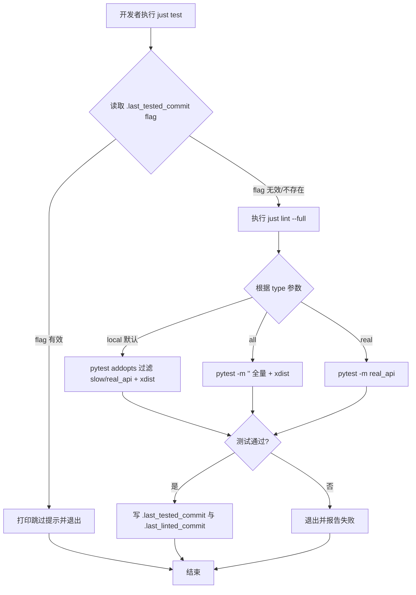

# 模板层加速 `just test`：默认跳过慢测试并支持测试标记与并行执行

## 1. Introduction & Goals

本仓库是上游模板项目，`justfile.shared` 通过 `just sync-template` 同步到下游项目（如 `keda`）。当前 `justfile.shared` 中的 `test` recipe 每次都会先跑 `just lint --full`，再无条件跑 `uv run pytest tests/ -v`，最后才写 `.last_tested_commit` flag；项目也没有 pytest marker 区分真实 git/子进程/网络等耗时测试。随着下游项目测试数量增长（例如 `keda` 已达 1072 个测试、完整运行约 34 秒），`just test` 会越来越慢。

本 PRD 在 **模板层** 提供通用的提速机制：让默认 `just test` 跳过慢测试与真实 API 测试、启用并行执行、并在代码未变时直接跳过；同时保留 `just test all` 全量回归与 `just test real` 真实 API 测试的能力。下游项目同步模板后，只需给各自的耗时测试加 `slow` marker 即可见效。

### Proposed Solution Summary

在 `pyproject.toml` 模板与 `justfile.shared` 中引入 pytest marker（`slow`、`real_api`）与 `pytest-xdist` 并行执行，并在 `justfile.shared` 的 `test` recipe 入口复用已有的 `.last_tested_commit` flag 机制实现代码未变跳过。

- **谁提供声明**：模板提供 `pyproject.toml` 中的 marker 定义、默认 `addopts`、dev 依赖；模板提供 `justfile.shared` 中的 `test [local|all|real]` 三种模式与 flag 跳过逻辑；下游项目开发者给各自的耗时测试加 `@pytest.mark.slow` 或 `@pytest.mark.real_api`。
- **系统变化**：默认 `just test` 只跑非 slow / 非 real_api 测试，并使用 xdist 并行；代码未变时二次运行直接跳过；`just test all` 与 `just test real` 保留原有全量/真实 API 能力。
- **刻意避免的复杂度**：不引入新的缓存数据库或持久化服务；不拆分 `tests/` 目录；不改动现有 pre-commit hook 的 flag 文件格式。

### Realistic Validation

除单元测试和集成测试外，本 PRD 要求通过 **真实项目入口点** 验证关键行为，确保真实使用路径生效，而非仅在隔离 fixture 中通过。

- [x] **默认 `just test` 真实验证**：通过 `just test` 验证其受默认 addopts 过滤且使用 xdist 并行（输出中出现 `10 workers [80 items]` 与 `LoadGroupScheduling`）。
- [x] **flag 跳过真实验证**：通过连续运行两次 `just test` 验证第二次直接打印标记有效并退出（耗时从约 8.7s 降至约 0.5s）。
- [x] **全量回归真实验证**：通过 `just test all` 验证模板自身全部 80 个测试仍能通过。
- [x] **pre-commit 兼容真实验证**：在代码未变时执行 `uv run pre-commit run check-test-flag` 验证 `.last_tested_commit` 仍被正确识别（Passed）。

**为什么单元测试不够**：`just test` 的加速效果、flag 跳过逻辑、marker 默认过滤行为都发生在 just recipe、pytest config 和 shell flag 的交互层，单独的 pytest 测试无法证明这些真实入口行为。

### Delivery Dependencies

- Group: none
- Depends on groups:
  - none
- Depends on tasks/issues:
  - none
- Gate type: none
- Notes: 本任务独立，不阻塞也不依赖当前 `tasks/pending/` 中的其他 PRD。模板落地后，下游项目通过 `just sync-template` 引入。

## 2. Requirement Shape

- **Actor**：本地开发者、CI、下游项目维护者。
- **Trigger**：执行 `just test`、`just test all` 或 `just test real`。
- **Expected behavior**：
  - `just test` 默认只跑非 slow、非 real_api 的测试，使用 xdist 并行；若当前 branch/HEAD/effective tree 与 `.last_tested_commit` flag 一致，则跳过测试并打印提示。
  - `just test all` 跑全部测试，不使用 marker 过滤。
  - `just test real` 只跑 `real_api` marker 的测试。
  - 测试通过后更新 `.last_tested_commit` 与 `.last_linted_commit` flag。
- **Scope boundary**：只改动 `pyproject.toml`、`justfile.shared`、相关文档；不删除、不拆分现有测试；不动 pre-commit hook 脚本；下游项目的具体 marker 应用不属于本 PRD 实施范围。

## 3. Repository Context And Architecture Fit

### 当前相关模块/文件

- `pyproject.toml`：项目依赖与工具配置模板，当前无 `[tool.pytest.ini_options]` 段。
- `justfile.shared`：模板级共享 just recipe，包含 `@test type="local"` recipe（第 906 行附近）。目前先跑 `just lint --full`，再无条件跑 `uv run pytest tests/ -v`，最后写 `.last_tested_commit` flag。
- `scripts/shared/hooks/quality_flag.sh`：提供 `quality_effective_tree`、`quality_write_flag`、`quality_flag_matches` 等函数，已被 `check_test_flag.sh` 使用。
- `scripts/shared/hooks/check_test_flag.sh`：pre-commit hook，读取 `.last_tested_commit` 并比对当前 staged/working tree。

### 现有架构模式

- just recipe 使用 shebang 脚本组织命令序列。
- quality flag 机制已经存在，但 `just test` 只负责写 flag，不负责读 flag 跳过自身；pre-commit hook 负责读。
- 测试分类目前没有 marker，仅通过 `just test real` 里的 `-k "expensive or not expensive"` 做无意义过滤（因为所有测试都匹配）。
- `justfile.shared` 是模板文件，通过 `just sync-template` 同步到下游项目。

### 所有权与边界

- `pyproject.toml` 属于模板级工具配置，会随模板同步。
- `justfile.shared` 属于模板级构建/任务入口层，会随模板同步。
- 下游项目具体的测试 marker 应用由各项目自行完成，不在本 PRD 范围内。
- pre-commit hook 脚本保持只读 flag，不被本 PRD 修改。

### 相关 PRD

- `tasks/pending/` 中未找到与测试性能、pytest marker、xdist 相关的待处理 PRD。
- `tasks/archive/` 中未检索到与本任务直接相关的已完成 PRD。
- 结论：独立任务，无重复、依赖或阻塞关系。

## 4. Recommendation

### Recommended Approach

采用 **最小改动路径**：

1. 在 `pyproject.toml` 新增 `[tool.pytest.ini_options]`，定义 `slow` 和 `real_api` 两个 marker，并设置默认 `addopts = "-m 'not slow and not real_api' -n auto"`。
2. 在 `[dependency-groups] dev` 中加入 `pytest-xdist>=3.6.0`。
3. 改造 `justfile.shared` 的 `test` recipe：
   - 进入时先 source `quality_flag.sh`，计算当前 branch/HEAD/effective tree，与 `.last_tested_commit` flag 比对；若一致则打印跳过提示并退出。
   - 否则跑 `just lint --full`。
   - 根据参数选择范围：
     - `local`（默认）：直接 `uv run pytest tests/ -v`（受 `pyproject.toml` 的 `addopts` 过滤 + xdist）。
     - `all`：`uv run pytest tests/ -v -m '' -n auto`（强制全量，仍并行）。
     - `real`：`uv run pytest tests/ -v -m 'real_api' -n auto`。
   - 通过后写 `.last_tested_commit` 与 `.last_linted_commit` flag。
4. 在模板文档中说明：下游项目需给真实 git/子进程/网络等 I/O 密集型测试加 `slow` marker，给需要真实 API key 的测试加 `real_api` marker。

### Why this is the best fit

- 复用已有的 `quality_flag.sh` 函数，不新增缓存层。
- marker + xdist 是 pytest 生态标准方案，学习成本与维护成本最低。
- 改动集中在模板层，下游项目同步后即可受益，无需逐个项目改 just recipe。
- 保留 `just test all` 与 `just test real`，不破坏 CI 或全量回归路径。

### Alternatives Considered

- **拆分 `tests/` 为 unit/integration/e2e 目录**：更符合 Clean Architecture 分层，但改动面大，移动文件会破坏 git blame 和大量相对导入/路径引用；本任务目标只是提速，不需要重组目录。
- **引入 pytest-cache 的 `--lf` / `--ff` 机制**：只能优化失败用例重跑，无法解决首次/日常全量运行慢的问题。
- **在 pre-commit 里跳过 `just test`**：与现有流程冲突，且会削弱提交前验证。

## 5. Implementation Guide

> This section is a living implementation guide based on current repository analysis. If implementation discovers additional affected files, hidden dependencies, edge cases, or a better path, update this PRD before proceeding.

### Core Logic

1. `just test` 入口首先读取 `.last_tested_commit` flag（复用 `quality_flag.sh` 的 `quality_flag_matches`）。
2. 仅在默认 `local` 模式下检查 flag：若 flag 有效，直接退出，避免重复 lint 与 pytest。`all` 与 `real` 模式总是执行，避免全量回归或真实 API 测试被局部测试的 flag 跳过。
3. 若 flag 无效或不存在，先执行 `just lint --full`。
4. 根据 `{{type}}` 参数决定 pytest 命令：
   - 默认 `local`：依赖 `pyproject.toml` 的默认 `addopts` 自动排除 `slow` / `real_api` 并启用 xdist。
   - `all`：显式 `-m ''` 取消 marker 过滤，保留 `-n auto` 并行。
   - `real`：显式 `-m 'real_api'` 只跑真实 API 测试；若当前无 `real_api` 测试，pytest 退出码为 5，视为成功并提示。
5. pytest 通过后，使用 `quality_write_flag` 更新 `.last_tested_commit` 与 `.last_linted_commit`。

### Change Impact Tree

```text
.
├── pyproject.toml
│   [修改]
│   【总结】新增 pytest markers、默认 addopts 过滤与 xdist 并行，并在 dev 依赖组加入 pytest-xdist。
│   ├── 在 [tool.pytest.ini_options] 定义 slow / real_api markers
│   ├── 设置 addopts = "-m 'not slow and not real_api' -n auto --dist=loadgroup"
│   └── 在 [dependency-groups] dev 追加 pytest-xdist>=3.6.0
│
├── justfile.shared
│   [修改]
│   【总结】改造 test recipe，在入口检查 .last_tested_commit flag，支持 local/all/real 三种模式，测试通过后写 flag。
│   ├── 进入时 source quality_flag.sh 并调用 quality_flag_matches 判断是否需要执行（仅 local 模式跳过）
│   ├── 默认 local 模式直接调用 uv run pytest tests/ -v（由 addopts 控制过滤与并行）
│   ├── all 模式显式 -m '' 强制全量
│   ├── real 模式显式 -m 'real_api' 只跑真实 API 测试；无收集时把 pytest 退出码 5 视为成功
│   └── 成功后同时写 .last_tested_commit 与 .last_linted_commit
│
└── docs/dev/just-commands.md（如存在）
    [修改]
    【总结】更新 just test 用法说明，补充 all/real 模式与默认跳过行为。
    ├── 说明 just test 默认排除 slow 与 real_api 测试
    ├── 说明 just test all 用于全量回归
    └── 说明 just test real 用于真实 API 测试
```

### Executor Drift Guard

- 使用 `rg -n "^@test" justfile.shared` 定位 test recipe。
- 使用 `rg -n "QUALITY_TEST_EXCLUDED_FILE_PATTERN|quality_flag_matches|quality_write_flag" scripts/shared/hooks/quality_flag.sh` 确认 flag 函数签名。
- 使用 `rg -n "^\[tool.pytest" pyproject.toml` 确认是否已有 pytest 配置段，避免重复。
- 使用 `uv run pytest tests/ --collect-only -q -m 'not slow and not real_api' | wc -l` 验证默认过滤后的测试数量。
- 若 `pytest-xdist` 导致某些测试因共享全局状态而失败，可改用 `--dist=loadfile` 或移除该文件的 xdist（在 marker 上加 `xdist_group`）。

### Flow or Architecture Diagram



### Realistic Validation Plan

| Behavior | Real Entry Point | Test Layer | Mock Boundary | Data/Env Needed | Command Or Procedure | Required For Acceptance |
|---|---|---|---|---|---|---|
| 默认 `just test` 使用 xdist 并过滤 marker | just recipe | 真实入口 | 无需外部服务 | 本地 Python/uv 环境 | `time just test` | Yes |
| flag 有效时 `just test` 直接跳过 | just recipe + `.last_tested_commit` | 真实入口 | 无需外部服务 | 先成功运行一次 `just test` | `just test` 连续执行两次，第二次应打印跳过 | Yes |
| 全量测试仍通过 | just recipe | 真实入口 | 无需外部服务 | 本地 Python/uv 环境 | `just test all` | Yes |
| 真实 API 测试入口可用 | just recipe | 真实入口 | 无需外部服务 | 本地 Python/uv 环境 | `just test real`（当前模板若无 real_api 测试，结果应为 0 collected） | Yes |
| pre-commit hook 仍认可 flag | pre-commit hook | 真实入口 | 无需外部服务 | `.last_tested_commit` 存在 | `pre-commit run check-test-flag` | Yes |

**Failure triage notes**：
- 若 `just test` 仍跑全部测试，检查 `pyproject.toml` 的 `addopts` 是否被覆盖，或下游项目是否未给慢测试加 marker。
- 若 flag 跳过不生效，检查 `quality_flag_matches` 的 tree 计算是否与 `check_test_flag.sh` 一致。
- 若 xdist 导致测试失败，检查是否存在全局共享状态，可改用 `--dist=loadfile`。

### Low-Fidelity Prototype

不需要。本任务不改动 UI。

### ER Diagram

No data model changes in this PRD.

### Interactive Prototype Change Log

No interactive prototype file changes in this PRD.

### External Validation

No external validation required; repository evidence was sufficient.

## 6. Definition Of Done

- `pyproject.toml` 已配置 pytest markers、默认过滤与 xdist 并行。
- `justfile.shared` 的 `test` recipe 已支持 flag 跳过与 `local/all/real` 三种模式。
- 文档已更新（若 `docs/dev/just-commands.md` 或类似文档存在）。
- `just test`、`just test all`、`just test real` 与 `pre-commit run check-test-flag` 均通过真实入口验证。
- 无回归：默认 `just test all` 仍能通过模板自身全部测试。

## 7. Acceptance Checklist

### Architecture Acceptance

- [x] `pyproject.toml` 中新增 `[tool.pytest.ini_options]`，包含 `slow` 与 `real_api` markers，且默认 `addopts` 排除这两个 marker。
- [x] `[dependency-groups] dev` 中已加入 `pytest-xdist>=3.6.0`。
- [x] `justfile.shared` 的 `test` recipe 在入口复用 `quality_flag.sh` 检查 `.last_tested_commit`，有效时直接跳过。
- [x] `just test all` 显式取消 marker 过滤，`just test real` 显式只跑 `real_api` marker。

### Behavior Acceptance

- [x] 默认 `just test` 使用 xdist 并行执行（输出中出现 `[gwX]` 或 `pytest-xdist` 相关 workers 信息）。
- [x] 当存在 `slow` marker 的测试时，默认 `just test` 不收集这些测试（模板当前无 slow 测试；已通过 `-m 'not slow and not real_api'` collect-only 验证默认范围）。
- [x] 连续两次 `just test` 中，第二次打印 flag 有效并直接退出。
- [x] 修改任意被 `QUALITY_TEST_EXCLUDED_FILE_PATTERN` 排除的文件（如 `.md`）后，`just test` 仍跳过。
- [x] 修改任意测试相关代码后，`just test` 重新执行。
- [x] `just test all` 仍通过模板自身全部测试。

### Documentation Acceptance

- [x] 若 `docs/dev/just-commands.md` 或类似文档存在，已更新 `just test` 的用法说明（新增 `all` / `real` 模式与默认跳过行为）。
- [x] `mkdocs.yml` 导航未因文档变更而破坏（如新增/重命名文档页）。

### Validation Acceptance

- [x] 通过 `time just test` 验证默认入口行为与耗时（首次约 8.7s，第二次约 0.5s）。
- [x] 通过连续两次 `just test` 验证 flag 跳过行为。
- [x] 通过 `just test all` 验证全量回归能力。
- [x] 通过 `uv run pre-commit run check-test-flag` 验证 flag 文件仍被 pre-commit 认可。

## 8. Functional Requirements

- **FR-1** `just test` 默认只运行未被标记为 `slow` 或 `real_api` 的测试。
- **FR-2** `just test` 默认使用 `pytest-xdist` 并行执行测试。
- **FR-3** 当当前 branch、HEAD hash 与 effective test tree 均与 `.last_tested_commit` flag 一致时，`just test` 直接跳过 lint 与 pytest，并输出提示信息。
- **FR-4** `just test all` 运行全部测试，不受默认 marker 过滤影响，但仍可使用 xdist 并行。
- **FR-5** `just test real` 只运行带有 `real_api` marker 的测试。
- **FR-6** 测试通过后，`just test` 必须更新 `.last_tested_commit` 与 `.last_linted_commit` flag。
- **FR-7** 模板文档必须说明下游项目应如何给真实 git/子进程/网络等 I/O 密集型测试加 `slow` marker，以及如何给需要真实 API key 的测试加 `real_api` marker。
- **FR-8** 现有 pre-commit hook `check_test_flag.sh` 无需修改即可继续工作。
- **FR-9** `just sync-template` 同步本模板后，下游项目的 `just test` 行为应自动升级（前提是下游 `pyproject.toml` 已继承模板配置）。

## 9. Non-Goals

- 不删除、不合并、不重命名模板或下游项目的任何测试文件或测试函数。
- 不拆分 `tests/` 目录。
- 不改动 pre-commit hook 脚本。
- 不引入新的数据库、缓存服务或分布式任务队列。
- 不为下游项目逐一向每个测试加 marker（本 PRD 只负责模板机制，具体 marker 应用由各下游项目自行完成）。
- 不保证 xdist 在所有机器上都能线性加速；仅保证默认启用并行。

## 10. Risks And Follow-Ups

| Risk | Mitigation | Follow-Up |
|---|---|---|
| `pytest-xdist` 导致共享全局状态的测试失败 | 首次启用时运行 `just test all` 观察；必要时改用 `--dist=loadfile` 或对有状态测试使用 `xdist_group` | 若出现不稳定，单独开一个 PRD 修复并发问题 |
| 下游项目未同步或未给慢测试加 marker，导致提速不明显 | 在模板文档中明确说明 marker 约定；建议下游项目通过 `--durations=20` 定期识别慢测试 | 下游项目同步后自行补充 marker |
| 开发者误以为 `just test` 等于全量测试 | 在文档和 just recipe 注释中明确说明 `all` 模式 | 更新内部 onboarding 文档 |
| 模板 `pyproject.toml` 与下游项目已有个性化 pytest 配置冲突 | 使用 `[tool.pytest.ini_options]` 标准段；下游项目可在其 `pyproject.toml` 覆盖或合并 | 在同步说明中提示下游检查 pytest 配置 |

## 11. Decision Log

| ID | Decision | Chosen | Rejected | Rationale |
|---|---|---|---|---|
| D-01 | 如何区分慢测试 | 使用 pytest markers (`slow`, `real_api`) + `addopts` 默认排除 | 拆分 tests/ 目录或使用 `-k` 关键字过滤 | marker 是 pytest 标准机制，改动最小且语义清晰；拆分目录会破坏大量引用和历史 |
| D-02 | 如何并行执行 | 引入 `pytest-xdist` 并在 addopts 默认启用 `-n auto` | 手动拆分测试文件并行跑多个 pytest 进程 | xdist 是 pytest 官方并行方案，与 marker/flag 机制无缝集成 |
| D-03 | 如何实现代码未变跳过 | 在 `just test` 入口复用已有的 `quality_flag.sh` 函数读取 `.last_tested_commit` | 新增 Makefile 级缓存或数据库表 | 已有 flag 机制被 pre-commit 使用，复用可避免新增抽象和状态层 |
| D-04 | 默认测试范围 | 默认排除 `slow` 和 `real_api` | 默认跑全量 | 日常开发不需要真实 git/API 测试，排除后能显著提速；CI 或提交前可用 `just test all` |
| D-05 | 是否保留 `just test real` | 保留，显式 `-m 'real_api'` | 删除或合并到 `all` | 保留与未来真实 API 测试的兼容性，且不破坏现有参数接口 |
| D-06 | PRD 作用范围 | 模板层（`zata_code_template`） | 直接针对下游 keda 项目 | `justfile.shared` 与 `pyproject.toml` 是模板文件，通过 `sync-template` 同步，模板层改动可让多个下游项目受益 |
