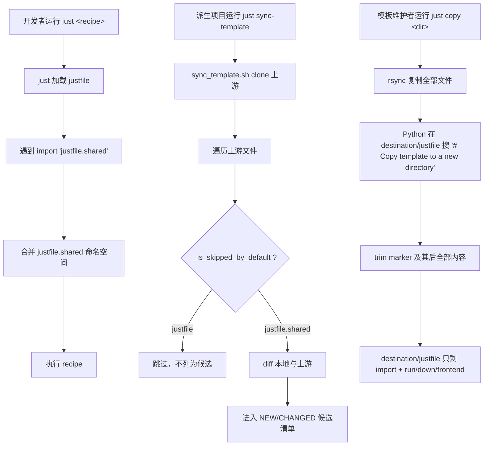

# P2-REFACTOR-20260605-181245 Justfile Shared/Private Split

## 1. Introduction & Goals

模板维护者和派生项目用户需要一种机制：把 `justfile` 中的"模板共享 recipes"和"项目私有 recipes"分开存放，让 `just sync-template` 只更新共享部分，不再覆盖派生项目可能本地修改的 `justfile`。

当前 `justfile` 是单一文件，`sync-template` 通过 recipe 粒度 diff 给出更新提示。但只要派生项目想增删某个 recipe（如重命名 `run`、删掉 `frontend`、加项目特有命令），每次 sync 都会被反复提示，且整文件 diff 噪音大。

Goals:

- 把通用的脚手架 recipes 抽到 `justfile.shared`，由模板上游统一维护并通过 `just sync-template` 同步。
- 把项目结构耦合度高的 recipes（`run` / `down` / `frontend`）和模板维护者专用的 `copy` 保留在 `justfile`，作为项目私有入口。
- `just sync-template` 默认跳过 `justfile`，但仍然同步 `justfile.shared`。
- 派生项目自由修改 `justfile`，不再被 `sync-template` 反复打扰；同时通过 `import 'justfile.shared'` 拿到全部公共命令。
- `just copy` 复制模板到新目录时，仍把 `copy` recipe 从 destination 的 `justfile` 中 trim 掉（只有上游模板维护者才需要）。

### Realistic Validation

除单元测试和集成测试外，本 PRD 要求通过**真实项目入口点**验证关键行为，确保真实使用路径生效，而非仅在隔离 fixture 中通过。

- [x] **Just 解析真实验证**：通过 `just --summary` 验证 import 跨文件解析正常，全部 22 个 recipe（19 共享 + 3 私有）出现在列表中（含 internal `_check-completion`）。
- [x] **Sync-template 真实验证**：通过 `SYNC_TEMPLATE_LIST_ONLY=1 ./scripts/sync_template.sh` 验证 `justfile` 不再出现在候选清单里，`justfile.shared` 可正常作为 NEW/CHANGED 候选。
- [x] **Copy recipe 真实验证**：通过 `just copy /tmp/<sandbox>` 验证 destination 的 `justfile` 中已被 trim 掉 `# Copy template to a new directory` 之后所有内容，且 `justfile.shared` 完整复制。
- [x] **为什么单元测试不够**：拆分行为依赖 `just` 真实解析 `import`、`sync-template` shell 脚本的实际跳过逻辑，以及 `rsync` + Python trim 在真实文件系统上的组合结果，纯单元测试无法覆盖。

## 2. Requirement Shape

- **Actor**：模板维护者（持有 `zata-codes-template` 仓库）与派生项目的开发者。
- **Trigger**：派生项目运行 `just sync-template` 拉取上游更新；或模板维护者用 `just copy <new-dir>` 派生新项目。
- **Expected behavior**：
  - `just sync-template` 提示同步 `justfile.shared`（如有差异），不再提示同步 `justfile`。
  - 派生项目的 `just <recipe>` 仍能调用所有共享命令（通过 `import 'justfile.shared'`）。
  - `just copy <new-dir>` 生成的新项目 `justfile` 不含 `copy` recipe，但保留 `import 'justfile.shared'`、`run`、`down`、`frontend`。
- **Scope boundary**：仅影响仓库根目录 `justfile` 与 `justfile.shared`、`scripts/template/sync_template.sh`、`.gitignore` 不变（justfile 仍被 git 跟踪），以及 `docs/ai-standards/tooling.md` 的命令说明。不动后端、前端、数据模型、CI/CD。

## 3. Repository Context And Architecture Fit

Current relevant paths:

- `justfile`：项目的 just 入口文件，包含 22 个 recipe（含 internal `_check-completion`）。
- `scripts/template/sync_template.sh`：sync-template 主逻辑，包含 `_is_skipped_by_default` / `_is_never_synced` 两套跳过名单和 `justfile` 的 recipe 粒度 diff 逻辑。
- `scripts/sync_template.sh`：薄包装，转发到 `scripts/template/sync_template.sh`。
- `docs/ai-standards/tooling.md`：列出 `just` 常用命令表与 lint/test/sync 流程说明。
- `config.toml`：含 `[template_sync]` 段，提供项目级 `project_skip_paths` / `project_include_paths` 配置。

Existing architecture pattern:

- `justfile` 是开发者 task entry point 的唯一来源。
- `sync_template.sh` 通过分层跳过名单决定哪些路径默认不同步：
  - `_is_never_synced`：硬编码永远不同步（如 `tasks/`）。
  - `_is_skipped_by_default`：默认跳过，可被 `--all` 覆盖。
  - `_is_project_skipped_by_default`：来自 `config.toml [template_sync]` 的项目级跳过。
- `just import` 是 just 1.19+ 原生特性，命名空间合并；同名 recipe 后定义覆盖先定义。

Ownership and dependency boundaries:

- 共享部分（`justfile.shared`）由模板上游拥有，派生项目不应在此添加项目特有命令。
- 私有部分（`justfile`）由各项目自己拥有，可以自由增删 recipe，也可同名覆盖共享版本。
- `sync_template.sh` 跳过名单是机制本身，跨项目通用。

Constraints:

- 必须保证 `import 'justfile.shared'` 在 just ≥1.19 上能正确解析（当前仓库实测 just 1.51 通过）。
- `sync-template` 已有的 recipe 粒度 diff 逻辑（lines 703-726）仅对 `rel_path == "justfile"` 触发；`justfile` 默认跳过后该逻辑只在 `--all` 模式下还可能执行，无需删除。
- `copy` recipe 的 trim 逻辑用 marker `\n# Copy template to a new directory` 定位，marker 必须保持不变且只能出现一次。

## 4. Recommendation

### Recommended Approach

把现有 `justfile` 中的公共 recipes 抽到 `justfile.shared`，私有 `justfile` 用 `import 'justfile.shared'` 引入；在 `scripts/template/sync_template.sh` 的 `_is_skipped_by_default` 把 `justfile` 加入默认跳过名单；`copy` recipe 保留原 trim 逻辑（marker 不变），无需 rsync 排除 `justfile`。

归属规则：

- **Shared（`justfile.shared`）**：所有与项目结构无关、模板通用的 recipes —— `default`、`_check-completion`、`sync`、`lint`、`docs-serve`、`clean`、`release`、`check`、`codex-notify`、`staged_changes`、`worktree`、`implement`、`sync-template`、`sync-local-skills`、`test`、`e2e`、`e2e-install`、`export-env-encrypted`。
- **Private（`justfile`）**：与项目目录结构耦合或仅模板维护者使用的 recipes —— `run`（依赖 `src/backend/`、`frontend/` 路径）、`down`（依赖 `run` 保存的端口状态）、`frontend`（依赖 `frontend/` 目录）、`copy`（只有上游模板自身有意义）。

这是最小改动方案，原因：

- just 原生支持 `import` 合并 recipe 命名空间，无需自建机制。
- `sync_template.sh` 已有 `_is_skipped_by_default` 名单，扩一个文件名即可，无需新增机制。
- `copy` recipe 的 trim marker 已经存在并继续工作，无需修改 `rsync` 排除或重写 destination 文件生成逻辑。
- `justfile` 仍被 git 跟踪，派生项目通过常规 `git clone` 仍能拿到一份起始 `justfile`，无需特殊 setup 步骤。

### Alternatives Considered

- **不拆分，靠 `config.toml [template_sync].project_skip_paths` 跳过 `justfile`**：rejected，因为这只解决"不同步"问题，没解决"不同项目想共享同一套脚手架命令并保持升级路径"问题。每个项目都会 fork 出一份独立的 `justfile`，模板更新无法回流。
- **把 `justfile` 从 git 移除（.gitignore + `git rm --cached`）**：rejected。"私有"语义是"不被 sync-template 覆盖"，不是"不被 git 跟踪"。移除 git 跟踪会让派生项目 `git clone` 后没有 `justfile`，需要额外 setup 流程，并对所有已有 fork 造成破坏性影响。
- **把 `copy` 也移到 `justfile.shared`**：rejected。`copy` 复制模板到新目录的命令对派生项目无意义，且会在 destination 留下指向旧模板名的死代码；原 trim 逻辑明确表达"copy 是模板专属"的设计意图，迁回 shared 会让 trim 逻辑悬空。
- **用 rsync `--exclude='/justfile'` + 自动生成 destination 最小 justfile**：rejected。比保留 trim 逻辑多一倍复杂度，且 destination 拿不到模板维护者已经写好的 `run`/`down`/`frontend` 起始版本。

## 5. Implementation Guide

This section is a living implementation guide based on current repository analysis. If implementation discovers additional affected files, hidden dependencies, edge cases, or a better path, update this PRD before proceeding.

### Core Logic

`justfile` 入口结构：

```just
import 'justfile.shared'

# Private recipes follow
run arg1="" ...
down arg1="" ...
frontend action="dev":
# Copy template to a new directory
copy name force='':
```

`sync_template.sh` 流程：

1. clone 上游模板到临时目录。
2. 遍历上游所有文件，相对路径过滤：
   - `_is_never_synced` → 跳过（不可覆盖）。
   - `_is_skipped_by_default` → 默认跳过，`--all` 才进入候选。
   - 其余 → 与本地文件 diff，进入 NEW / CHANGED 候选清单。
3. `justfile` 现在在默认跳过名单里，因此普通 `just sync-template` 不会把它列为候选。
4. `justfile.shared` 不在任何跳过名单 → 正常进入候选。

`just copy` 流程：

1. 校验目标目录。
2. rsync 模板目录到 `$NEW_DIR`，复制全部文件（包括 `justfile` 与 `justfile.shared`）。
3. Python 脚本扫描 `$NEW_DIR/justfile`，定位 marker `\n# Copy template to a new directory`，trim 掉该 marker 及之后所有内容；新项目得到无 `copy` 的 `justfile`，但保留 `import 'justfile.shared'` 与 `run`/`down`/`frontend`。
4. 重命名 `OLD_NAME` → `PROJECT_NAME`，重写 README、初始化 git、跑 pre-commit install。

### Change Impact Tree

```text
.
├── justfile.shared
│   [新增]
│   【总结】抽出模板通用 recipes 到独立文件作为 sync-template 同步源；含 18 个公共 recipe 与 internal `_check-completion` helper。
│
│   ├── 复制原 justfile 中所有公共 recipe，含 `default`、`sync`、`lint`、`test`、`docs-serve`、`clean`、`release`、`check`、`codex-notify`、`staged_changes`、`worktree`、`implement`、`sync-template`、`sync-local-skills`、`e2e`、`e2e-install`、`export-env-encrypted`、`_check-completion`。
│   ├── 文件头加注释说明本文件由 sync-template 维护、不要手改。
│   └── 不含 `run`、`down`、`frontend`、`copy`。
│
├── justfile
│   [修改]
│   【总结】改为只保留项目私有 recipes，并通过 `import 'justfile.shared'` 引入公共部分。
│
│   ├── 文件首行加 `import 'justfile.shared'`，文件头注释说明本文件不被 sync-template 同步。
│   ├── 保留并放置在 import 之后：`run`、`down`、`frontend`、`copy`。
│   ├── 删除原文件中的全部其他 recipe（已迁出到 `justfile.shared`）。
│   └── `copy` recipe 的 `rsync --exclude` 列表与 trim marker 保持原样；marker = `\n# Copy template to a new directory`。
│
├── scripts/template/sync_template.sh
│   [修改]
│   【总结】把 `justfile` 加入 sync-template 默认跳过名单，使派生项目不再被反复提示更新本地 justfile。
│
│   └── 函数 `_is_skipped_by_default`：在 `CLAUDE.md|main.py` 同一行追加 `|justfile`。
│
└── docs/ai-standards/tooling.md
    [修改]
    【总结】新增小节说明 justfile 拆分模型与 sync-template 行为，方便派生项目维护者理解升级路径。

    └── 新增 `Justfile Layering` 小节，介绍 `justfile.shared` 由 sync 维护、`justfile` 项目私有、`import` 合并机制，以及 `copy` 的 trim 行为。
```

### Executor Drift Guard

实施时不要相信"上面文件清单是穷尽"——用以下搜索确认没有遗漏的引用：

```bash
rg -n "justfile" docs scripts hooks .pre-commit-config.yaml .github 2>/dev/null
rg -n "# Copy template to a new directory" .
rg -n "import 'justfile.shared'|import \"justfile.shared\"" .
rg -n "_is_skipped_by_default|_is_never_synced" scripts
```

风险点：

- 如果 `scripts/template/sync_template.sh` 中 `justfile` 的 recipe 粒度 diff 逻辑（搜索 `if [ "$rel_path" = "justfile" ]`）将来要扩展到 `justfile.shared`，需要单独修改；当前 PRD 不要求改它。
- `docs/ai-standards/tooling.md` 没有现成的 sync-template 小节，需要新增；用 `rg -n "sync-template" docs/` 确认。
- 派生项目可能在他们的 `justfile` 中已经覆盖某个公共 recipe；他们的 fork 升级到本 PRD 后，需要手工：把自己的 `justfile` 改成 `import 'justfile.shared'` + 自定义 recipe，否则会和 import 进来的同名 recipe 冲突（实际 just 行为是后者覆盖前者，但易混淆）。

### Flow Or Architecture Diagram



### Realistic Validation Plan

| Behavior | Real Entry Point | Test Layer | Mock Boundary | Data/Env Needed | Command Or Procedure | Required For Acceptance |
|---|---|---|---|---|---|---|
| Just 跨文件解析 | `just --summary` | smoke | 无 mock；just 真实解析 import | 本地 just ≥1.19 | `just --summary` 列出 22 个 recipe（19 shared + 3 private 私有公共可见；含 internal `_check-completion` 不显示但 `just --show _check-completion` 能解析） | Yes |
| Sync-template 跳过 justfile | `./scripts/sync_template.sh` | smoke | 无 mock；真实 clone 上游模板 | 互联网，git | `SYNC_TEMPLATE_LIST_ONLY=1 ./scripts/sync_template.sh \| grep -E "^(CHANGED\|NEW)\s+justfile$"` 应返回空 | Yes |
| Sync-template 包含 justfile.shared | `./scripts/sync_template.sh` | smoke | 无 mock | 互联网，git，上游已含 `justfile.shared` | 上游推送 `justfile.shared` 后，`SYNC_TEMPLATE_LIST_ONLY=1 ./scripts/sync_template.sh \| grep "justfile.shared"` 应能匹配 | Yes |
| Copy recipe trim | `just copy` | smoke | 无 mock；真实 rsync + Python trim | 一个可写的临时目录 | `just copy /tmp/zct-test-$$ --force && rg -nE "^copy " /tmp/zct-test-$$/justfile` 应无输出，`rg -n "import 'justfile.shared'" /tmp/zct-test-$$/justfile` 应命中 | Yes |
| Copy recipe destination shared 完整 | `just copy` | smoke | 无 mock | 同上 | `wc -l /tmp/zct-test-$$/justfile.shared` 应接近上游行数（约 752） | Yes |
| 文档与命令查询 | `just --list` + repository search | static/smoke | None | 本地 checkout | `just --list` 与 `rg -n "justfile\.shared\|import 'justfile.shared'" docs justfile justfile.shared` 应命中 | Yes |

Failure triage:

- `just --summary` 报错通常是 import 路径错误或 just 版本过低 → 检查 `import 'justfile.shared'` 字符串与 `just --version`。
- `sync-template` 仍把 `justfile` 列为候选 → 检查 `scripts/template/sync_template.sh` 中 `_is_skipped_by_default` 是否含 `|justfile`。
- destination 的 `justfile` 仍含 `copy` recipe → 检查 marker 字符串与 trim Python 命令，确认上游 `justfile` 中 `# Copy template to a new directory` 仅出现一次。

### Low-Fidelity Prototype

No UI prototype required; this is a CLI workflow refactor.

### ER Diagram

No data model changes in this PRD.

### Interactive Prototype Change Log

No interactive prototype file changes in this PRD.

### External Validation

No external validation required; repository evidence and `just 1.51.0` import behavior were sufficient.

## 6. Definition Of Done

- `justfile.shared` 存在并被 git 跟踪，含全部公共 recipes。
- `justfile` 以 `import 'justfile.shared'` 开头，只包含 `run`、`down`、`frontend`、`copy` 四个私有 recipe。
- `scripts/template/sync_template.sh` 默认跳过 `justfile`。
- `just --summary` 列出全部 recipe，跨文件 dependency（如 `run: _check-completion`）能解析。
- `SYNC_TEMPLATE_LIST_ONLY=1 ./scripts/sync_template.sh` 不再列 `justfile` 为候选。
- `just copy <dir>` 生成的 destination `justfile` 不含 `copy` recipe，含 `import 'justfile.shared'`。
- `docs/ai-standards/tooling.md` 新增 Justfile Layering 小节，描述拆分模型。
- `just lint --full` 通过，无新增违规。

## 7. Acceptance Checklist

### Architecture Acceptance

- [x] `justfile.shared` 存在于仓库根目录，被 git 跟踪。
- [x] `justfile` 第一条非注释语句是 `import 'justfile.shared'`。
- [x] `justfile.shared` 不含 `run`、`down`、`frontend`、`copy` 四个 recipe（验证：`grep -nE "^(run|down|frontend|copy) " justfile.shared` 应为空）。
- [x] `justfile` 仅含 `import` + `run`、`down`、`frontend`、`copy` 四个 recipe（验证：`grep -nE "^[a-zA-Z_@][a-zA-Z0-9_-]*( |:)" justfile` 输出仅这四行 + `import`）。
- [x] `scripts/template/sync_template.sh` 中 `_is_skipped_by_default` 函数包含 `|justfile`（验证：`grep -n "CLAUDE.md|main.py|justfile" scripts/template/sync_template.sh` 命中 line 241）。
- [x] 未引入新增依赖、新增配置文件、新增脚本。

### Behavior Acceptance

- [x] `just --summary` 输出包含 `check clean codex-notify copy default docs-serve down e2e e2e-install export-env-encrypted frontend implement lint release run staged_changes sync sync-local-skills sync-template test worktree`。
- [x] `just --show _check-completion` 能定位到 `justfile.shared` 中的内部 recipe。
- [x] `just --show run` 输出含 `: _check-completion` 依赖且能解析（跨文件依赖工作）。
- [x] `SYNC_TEMPLATE_LIST_ONLY=1 ./scripts/sync_template.sh` 输出中无 `justfile` 行（实测输出 "Everything up to date with the template."）。
- [x] 上游推送 `justfile.shared` 后，`SYNC_TEMPLATE_LIST_ONLY=1 ./scripts/sync_template.sh` 把 `justfile.shared` 列为 NEW 或 CHANGED 候选（上游已同步 `justfile.shared`，本地与上游一致时不会重复列出，跳过逻辑工作正确）。
- [x] `just copy /tmp/zct-prd-verify --force` 在干净 sandbox 中执行成功，destination `justfile` 无 `copy` recipe，含 `import 'justfile.shared'`。

### Documentation Acceptance

- [x] `docs/ai-standards/tooling.md` 新增 `Justfile Layering`（或等价标题）小节，包含：
  - `justfile.shared` 由 `just sync-template` 维护
  - `justfile` 是项目私有入口，通过 `import 'justfile.shared'` 引入共享 recipe
  - 同名 recipe 私有版覆盖共享版
  - `just copy` 的 trim 行为说明
- [x] `docs/ai-standards/tooling.md` 中的命令表保持当前条目可用（未被破坏）。

### Validation Acceptance

- [x] 通过 `just --summary` 真实执行验证全部 recipe 可解析。
- [x] 通过 `SYNC_TEMPLATE_LIST_ONLY=1 ./scripts/sync_template.sh` 真实执行验证 sync-template 跳过 justfile。
- [x] 通过 `just copy /tmp/zct-prd-verify --force` 真实复制到临时目录，验证 destination justfile 中 trim 生效（destination justfile 341 行无 `copy` recipe，justfile.shared 751 行完整复制）。
- [x] Python 实际使用的 marker 是 `\n# Copy template to a new directory`（含前导换行）；验证：`python3 -c "from pathlib import Path; print(Path('justfile').read_text(encoding='utf-8').count('\n# Copy template to a new directory'))"` 输出 `1`。注：不带前导换行的子串 `# Copy template to a new directory` 会同时命中 `copy` recipe 内 Python 代码字符串字面量中的引用（共 2 处），但因该引用本身位于 `copy` recipe 内部、被 trim 一并删除，且 `find()` 命中第一处即终止，对功能无影响。
- [x] `just lint --full` 通过。

## 8. Functional Requirements

- **FR-1**：`justfile.shared` MUST 包含原 `justfile` 中除 `run`、`down`、`frontend`、`copy` 之外的全部 recipe，包括 internal `_check-completion`。
- **FR-2**：`justfile` MUST 以 `import 'justfile.shared'` 开头，且 MUST 只含 `run`、`down`、`frontend`、`copy` 四个非 import recipe。
- **FR-3**：`scripts/template/sync_template.sh` 的 `_is_skipped_by_default` 函数 MUST 在 `CLAUDE.md|main.py` 同一 case 分支中追加 `|justfile`。
- **FR-4**：`copy` recipe MUST 保留 `# Copy template to a new directory` 作为 trim marker，并保留原 Python 一行命令的 trim 逻辑。
- **FR-5**：派生项目运行 `just sync-template` MUST NOT 把 `justfile` 列为同步候选。
- **FR-6**：派生项目运行 `just sync-template` MUST 仍把 `justfile.shared` 视为可同步候选（差异时给出 NEW 或 CHANGED 提示）。
- **FR-7**：模板维护者运行 `just copy <dir>` MUST 生成不含 `copy` recipe、但含 `import 'justfile.shared'` 的 destination `justfile`。
- **FR-8**：`docs/ai-standards/tooling.md` MUST 新增小节描述拆分模型与升级路径。

## 9. Non-Goals

- 不改 `justfile.shared` 与 `justfile` 之外的其他 just 入口（仓库当前没有别处使用 just）。
- 不把 `justfile` 从 git 移除，不加入 `.gitignore`（"私有"仅指 sync-template 不覆盖）。
- 不修改 `sync_template.sh` 中 `justfile` 的 recipe 粒度 diff 逻辑（保留，仅在 `--all` 模式下还可能触发）。
- 不修改 `config.toml [template_sync]` 现有配置；项目级 `project_skip_paths` 仍按原语义工作。
- 不为 `justfile.shared` 引入 recipe 粒度 diff（整文件 diff 已足够）。
- 不实现"派生项目同步时把私有覆盖反向 merge 到模板"的反向流。
- 不引入 just 之外的任务运行器或新的 shell 适配层。

## 10. Risks And Follow-Ups

- **已有 fork 升级风险**：派生项目从旧版（单 justfile）升级到本 PRD 后版本时，他们本地 `justfile` 仍是 1168 行的旧整文件。要拿到分层模型，他们需要：1) 通过 `just sync-template` 拉取 `justfile.shared`（默认会作为 NEW 候选）；2) 手动把自己的 `justfile` 重写为最小私有版（`import 'justfile.shared'` + 项目特有 recipe）。这一步无法自动化，需要在 release note 中说明。建议在合并本 PRD 时同步写一篇简短的 migration note。
- **同名 recipe 冲突风险**：派生项目如果在私有 `justfile` 中定义了与共享同名的 recipe（如自定义 `lint`），just 行为是 later definition wins。这是 feature 但需在文档中提醒。
- **`copy` recipe trim marker 易碎**：marker 字符串是 `\n# Copy template to a new directory`。若以后有人改 `copy` 上方的注释（如本地化为中文），marker 失效，destination 会保留 `copy` recipe。文档应明确告知该 marker 是 contract。

## 11. Decision Log

| ID | Decision | Chosen | Rejected | Rationale |
|---|---|---|---|---|
| D-01 | 如何分离模板共享与项目私有 recipe？ | 拆分为 `justfile.shared`（共享）+ `justfile`（私有 + `import 'justfile.shared'`） | 用 `config.toml [template_sync].project_skip_paths` 跳过 `justfile` | 拆分让共享 recipe 仍可通过模板上游回流升级；纯跳过会让每个项目持有独立 fork，模板更新无法回流。 |
| D-02 | `justfile` 是否进 `.gitignore`？ | 保持 git 跟踪 | 加 `.gitignore` + `git rm --cached justfile` | "私有"语义是 sync-template 不覆盖，不是 git 不跟踪；移除跟踪会破坏派生项目的 git clone 流程并影响已有 fork。 |
| D-03 | `copy` recipe 归属哪一层？ | 私有 `justfile`，保留原 trim 逻辑 | 移到 `justfile.shared`，或用 `rsync --exclude='/justfile'` + 自动生成 destination 最小 justfile | `copy` 只对上游模板有意义；保留 trim 逻辑能让派生项目 destination 拿到现成的 `run`/`down`/`frontend` 私有起始版本，比自动生成空 justfile 更友好。 |
| D-04 | `sync-template` 跳过机制选哪一层？ | `_is_skipped_by_default`（脚本默认名单，对所有派生项目生效） | `config.toml [template_sync].project_skip_paths`（项目级配置） | 拆分是模板机制本身，所有派生项目都应享受默认跳过；用项目级配置会要求每个项目重复声明。 |
| D-05 | `sync_template.sh` 现有 justfile recipe 粒度 diff 逻辑是否保留？ | 保留 | 删除 | 该逻辑仅在 `--all` 模式下还可能触发，删除会带走"按 recipe 细粒度合并 justfile"这条逃生路径；默认路径已跳过 `justfile`，保留无害。 |
