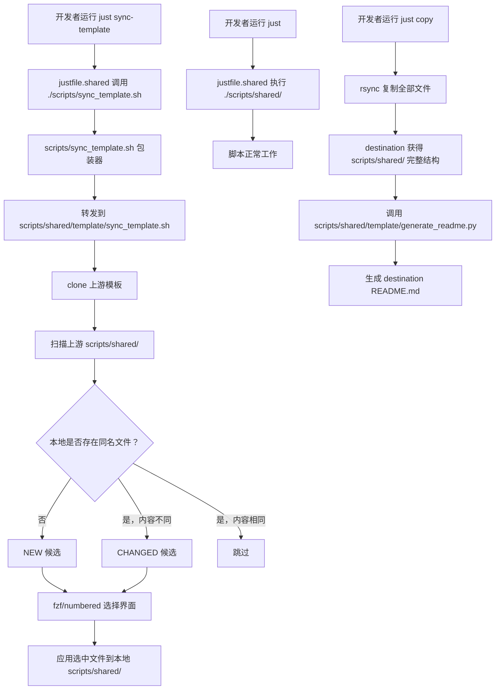

# P2-REFACTOR-20260615-110433 Isolate Template Scripts

## 1. Introduction & Goals

模板仓库中 `scripts/` 根目录目前混合了"由上游模板维护并随 `just sync-template` 同步的共享脚本"与"项目入口包装器"。随着派生项目需要在本地添加项目私有脚本，这种混合会导致：

- 派生项目不敢在 `scripts/` 下新增文件，因为 sync-template 会把它当作候选与上游比对。
- 模板维护者每次新增共享脚本都要考虑是否污染派生项目的 `scripts/` 根目录命名空间。
- `scripts/` 与 `scripts/template/` 的边界不清晰：`scripts/template/` 里只有模板维护脚本，但其他共享脚本（如 `scripts/worktree/`、`scripts/codex/`）却散落在 `scripts/` 根目录下。

### Proposed Solution Summary

新建 `scripts/shared/` 目录作为**模板共享脚本的唯一容器**：把所有会随 `just sync-template` 同步的脚本（包括目前 `scripts/` 根目录下的共享脚本和 `scripts/template/` 下的模板维护脚本）整体迁入 `scripts/shared/`。保留 `scripts/sync_template.sh` 作为项目入口包装器留在 `scripts/` 根目录（类似 `justfile` 之于 `justfile.shared` 的入口角色）。

为了让 `scripts/` 根目录真正留给项目私有脚本，在 `scripts/shared/template/sync_template.sh` 的默认跳过规则中新增：**跳过 `scripts/` 根目录下所有文件，但 `scripts/shared/` 下的文件除外**。这样派生项目可以自由在 `scripts/` 根目录添加私有脚本，而 `scripts/shared/` 仍由 sync-template 同步。`hooks/`（项目根目录）保持不动。

Goals:

- 明确 `scripts/shared/` 由上游模板维护并通过 `just sync-template` 同步。
- 明确 `scripts/` 根目录留给项目私有脚本和入口包装器（如 `scripts/sync_template.sh`）。
- 通过 sync-template 跳过规则实现 `scripts/` 根目录默认不同步、`scripts/shared/` 正常同步。
- 消除 `scripts/` 与 `scripts/template/` 的语义重叠。
- 保持 `just <recipe>`、`just sync-template`、`just copy` 等真实入口行为不变。

### Realistic Validation

除单元测试和集成测试外，本 PRD 要求通过**真实项目入口点**验证关键行为，确保真实使用路径生效，而非仅在隔离 fixture 中通过。

- [x] **Just recipe 解析真实验证**：通过 `just --summary` 验证所有 recipe 仍能正常加载，无路径解析错误。
- [x] **Sync-template 真实验证**：通过 `SYNC_TEMPLATE_LIST_ONLY=1 ./scripts/sync_template.sh` 验证迁移后 sync-template 的候选清单符合预期（`scripts/shared/` 下文件进入 NEW/CHANGED 候选，`scripts/` 根目录下新增私有脚本不被同步）。
- [x] **Copy 派生真实验证**：通过 `just copy /tmp/<sandbox>` 验证派生项目获得的 `scripts/shared/` 结构完整，且 `copy` recipe 的 README 生成与 trim 逻辑正常。
- [x] **CI workflow 真实验证**：通过 `.github/workflows/ci.yml` 中的 `release` job 路径检查或本地等效命令验证 `scripts/shared/release.py` 可被正确调用。

**为什么单元测试不够**：路径迁移影响的是 `just`、`sync-template` shell 脚本、CI workflow 在真实文件系统上的解析与调用行为；纯单元测试无法覆盖 just 的 import 路径、rsync 复制结果、GitHub Actions 的 working-directory 解析等真实入口行为。

### Delivery Dependencies

- Group: template-tooling
- Depends on groups:
  - none
- Depends on tasks/issues:
  - none
- Gate type: none
- Notes: 与已完成的 `P2-REFACTOR-20260605-181245-justfile-shared-private-split.md` 思路一致，但针对 `scripts/` 目录；无硬依赖。

## 2. Requirement Shape

- **Actor**：模板维护者（持有 `zata-codes-template` 仓库）与派生项目的开发者。
- **Trigger**：派生项目运行 `just sync-template` 拉取上游更新；或模板维护者用 `just copy <new-dir>` 派生新项目；或派生项目开发者在 `scripts/` 根目录添加私有脚本。
- **Expected behavior**：
  - `just sync-template` 默认同步 `scripts/shared/` 下的文件，跳过 `scripts/` 根目录下的项目私有脚本和包装器。
  - `just <recipe>` 调用的所有共享脚本路径指向 `scripts/shared/` 后仍能正常工作。
  - `just copy <new-dir>` 生成的新项目包含完整的 `scripts/shared/` 结构，且 `scripts/sync_template.sh` 包装器正确转发到 `scripts/shared/template/sync_template.sh`。
  - 项目根目录 `hooks/` 保持原状，pre-commit 配置无需改动。
- **Scope boundary**：
  - 仅移动/重命名 `scripts/` 下的共享脚本并更新引用路径。
  - 不涉及 `src/backend/`、`frontend/`、`docs/`、`tests/`、`deploy/` 等业务目录。
  - 不修改 `hooks/`（项目根目录）的位置或内容。
  - 不引入新的构建依赖或脚本运行时行为变更（脚本逻辑保持不变，仅路径变化）。

## 3. Repository Context And Architecture Fit

Current relevant paths:

- `scripts/`：当前包含共享脚本和子目录（`codex/`、`hooks/`、`just/`、`release/`、`secrets/`、`template/`、`worktree/`、`README.md`、`git_worktree.sh`、`release.py`、`sync_template.sh`）。
- `scripts/sync_template.sh`：薄包装器，转发到 `scripts/template/sync_template.sh`。
- `scripts/template/sync_template.sh`：`just sync-template` 的完整实现，决定哪些路径进入同步候选清单。
- `scripts/template/generate_readme.py`：`just copy` 生成新项目 README 时调用。
- `justfile`：项目私有 just 入口，含 `copy` recipe。
- `justfile.shared`：模板共享 just recipes，大量引用 `scripts/` 下的文件。
- `.github/workflows/ci.yml` 和 `.github/workflows/cd.yml`：引用 `scripts/release.py`。
- `docs/`：多处引用 `scripts/worktree/create.sh`、`scripts/codex/*.sh`、`scripts/template/sync_template.sh`。

Existing architecture pattern:

- 仓库已采用 `justfile` / `justfile.shared` 分层模型：共享层由 sync-template 同步，私有层由项目维护。
- `sync_template.sh` 通过 `_is_skipped_by_default` 和 `_is_never_synced` 决定同步范围。
- `just copy` 使用 rsync 复制全部文件（配合 `--exclude` 列表），并用 Python trim 掉 destination `justfile` 中的 `copy` recipe。

Ownership and dependency boundaries:

- `scripts/shared/` 将由模板上游拥有，派生项目不应在其中添加私有脚本。
- `scripts/` 根目录由各项目自己拥有，可自由添加私有脚本；`scripts/sync_template.sh` 作为薄包装器保留在根目录，属于项目入口的一部分。
- `hooks/`（项目根目录）与 `scripts/hooks/` 是不同目录；本次仅移动 `scripts/hooks/` 到 `scripts/shared/hooks/`，根目录 `hooks/` 不动。

Constraints:

- 所有脚本路径变更必须同步更新 `justfile.shared` 中的调用点。
- `scripts/sync_template.sh` 作为 `just sync-template` 的入口，其路径不能变（否则已习惯 `just sync-template` 的用户无需关心内部路径，但包装器代码需要更新转发目标）。
- `just copy` 的 README 生成脚本路径需要更新。
- GitHub Actions 对 `scripts/release.py` 的引用需要更新。
- 文档中的脚本路径需要更新。

Matching or related PRDs:

- `tasks/archive/P2-REFACTOR-20260605-181245-justfile-shared-private-split.md`：已完成，将 `justfile` 拆分为共享层 `justfile.shared` 和私有层 `justfile`。本 PRD 是其直接延伸，把同样的分层思想应用到 `scripts/` 目录。
- `tasks/pending/` 中无重复或依赖的待处理 PRD。

## 4. Recommendation

### Recommended Approach

新建 `scripts/shared/` 目录，把所有当前会随 `just sync-template` 同步的脚本整体迁入；保留 `scripts/sync_template.sh` 作为项目入口包装器（默认不被 sync-template 同步）留在 `scripts/` 根目录，并让它转发到 `scripts/shared/template/sync_template.sh`。

迁入 `scripts/shared/` 的内容：

- `scripts/codex/` → `scripts/shared/codex/`
- `scripts/hooks/`（`check_test_flag.sh`、`quality_flag.sh`）→ `scripts/shared/hooks/`
- `scripts/just/` → `scripts/shared/just/`
- `scripts/release/` → `scripts/shared/release/`
- `scripts/secrets/` → `scripts/shared/secrets/`
- `scripts/template/` → `scripts/shared/template/`
- `scripts/worktree/` → `scripts/shared/worktree/`
- `scripts/README.md` → `scripts/shared/README.md`
- `scripts/git_worktree.sh` → `scripts/shared/git_worktree.sh`
- `scripts/release.py` → `scripts/shared/release.py`

留在 `scripts/` 根目录的内容：

- `scripts/sync_template.sh`（薄包装器，项目入口，默认不被 sync-template 同步，类似 `justfile`）。

更新所有内部引用：

- `justfile.shared` 中所有 `./scripts/...` 路径改为 `./scripts/shared/...`（`sync_template.sh` 包装器除外）。
- `justfile` 的 `copy` recipe 中 `scripts/template/generate_readme.py` 改为 `scripts/shared/template/generate_readme.py`。
- `scripts/sync_template.sh` 包装器转发路径改为 `scripts/shared/template/sync_template.sh`。
- `.github/workflows/ci.yml` 和 `.github/workflows/cd.yml` 中 `scripts/release.py` 改为 `scripts/shared/release.py`。
- `README.md` 和 `docs/` 中相关脚本路径更新。

这是最小改动方案，原因：

- 复用 `sync_template.sh` 已有的 `_is_skipped_by_default` 机制，新增一条 `scripts/` 跳过规则并除外 `scripts/shared/`，无需引入新的配置层或抽象。
- 保留 `scripts/sync_template.sh` 包装器，使 `just sync-template` 的入口路径不变，对下游用户透明。
- 与已有的 `justfile` / `justfile.shared` 分层模型对称，降低认知负担。

### Alternatives Considered

- **复用现有 `scripts/template/` 目录**：rejected。`scripts/template/` 语义上是"模板维护脚本"（如 `generate_readme.py`、`sync_template.sh`），若把所有共享脚本都塞进去，会混淆"模板维护"与"模板共享"的边界；且 `scripts/template/` 已深度参与 `sync_template.sh` 和 `copy` recipe，扩展其语义会增加理解成本。
- **把 `scripts/sync_template.sh` 也迁入 `scripts/shared/`**：rejected。这样 `just sync-template` 的入口路径会变成 `scripts/shared/sync_template.sh`，需要修改 `justfile.shared` 中的入口；更重要的是，派生项目可能希望自定义包装器行为（如添加环境变量、日志前缀），保留根目录包装器与 `justfile` 入口的设计一致；默认不被 sync-template 同步，派生项目可自由修改。
- **通过 `config.toml [template_sync]` 实现 `scripts/` 跳过和 `scripts/shared/` 例外**：rejected。`config.toml` 当前在 `_is_skipped_by_default` 中默认被跳过，sync-template 不会自动把新的 project_skip_paths / project_include_paths 推送给已有 fork；把规则硬编码到 `sync_template.sh` 才能对所有派生项目一致生效，与 `justfile` 加入默认跳过名单的做法一致。
- **同时移动项目根目录 `hooks/`**：rejected。用户明确选择只动 `scripts/`；移动 `hooks/` 会触发 `.pre-commit-config.yaml`、文档、CI 中大量引用变更，范围过大，收益与本次目标无关。
- **不移动文件，仅扩展 sync-template 跳过规则**：rejected。这不能解决"派生项目想在 `scripts/` 根目录自由添加私有脚本"的根本问题；模板维护者新增共享脚本仍会污染派生项目的命名空间。

## 5. Implementation Guide

This section is a living implementation guide based on current repository analysis. If implementation discovers additional affected files, hidden dependencies, edge cases, or a better path, update this PRD before proceeding.

### Core Logic

`scripts/shared/` 成为模板共享脚本的根目录：

```text
scripts/
├── sync_template.sh          # 项目入口包装器（保留在根目录，默认不被 sync-template 同步）
└── shared/                   # 由 just sync-template 同步
    ├── README.md
    ├── codex/
    ├── git_worktree.sh
    ├── hooks/
    ├── just/
    ├── release.py
    ├── release/
    ├── secrets/
    ├── template/
    │   ├── generate_readme.py
    │   └── sync_template.sh
    └── worktree/
```

`scripts/sync_template.sh` 包装器逻辑：

```bash
REPO_ROOT="$(cd "$(dirname "$0")/.." && pwd)"
exec bash "${REPO_ROOT}/scripts/shared/template/sync_template.sh" "$@"
```

`scripts/shared/template/sync_template.sh` 默认跳过规则：

- 在 `_is_skipped_by_default` 函数中新增对 `scripts/` 的匹配：
  - `scripts/shared/*` → 不跳过，正常进入同步候选。
  - `scripts/*` 其他路径（包括 `scripts/sync_template.sh`）→ 跳过，默认不同步。
- `--all` 模式下该跳过规则失效，仍可手动同步 `scripts/` 根目录下的包装器或私有脚本。

`justfile.shared` 中的脚本引用全部指向 `scripts/shared/`：

- `source ./scripts/hooks/quality_flag.sh` → `source ./scripts/shared/hooks/quality_flag.sh`
- `bash ./scripts/hooks/check_test_flag.sh` → `bash ./scripts/shared/hooks/check_test_flag.sh`
- `uv run python scripts/release.py` → `uv run python scripts/shared/release.py`
- `./scripts/codex/install_macos_notify.sh` → `./scripts/shared/codex/install_macos_notify.sh`
- `./scripts/codex/notify_shortcut.sh` → `./scripts/shared/codex/notify_shortcut.sh`
- `./scripts/worktree/*.sh` → `./scripts/shared/worktree/*.sh`
- `./scripts/secrets/export_env_encrypted.sh` → `./scripts/shared/secrets/export_env_encrypted.sh`
- `./scripts/sync_template.sh {{flags}}` → 保持不变（调用根目录包装器）

`justfile` 的 `copy` recipe 更新：

- `python3 "$TEMPLATE_DIR/scripts/template/generate_readme.py"` → `python3 "$TEMPLATE_DIR/scripts/shared/template/generate_readme.py"`
- rsync 的 `--exclude='scripts/template/generate_readme.py'` 可以移除（因为路径已变，且 `scripts/shared/` 整体应被复制）；若保留，需改为 `--exclude='scripts/shared/template/generate_readme.py'`。建议移除该条排除，因为模板生成脚本对派生项目无害。

### Change Impact Tree

```text
.
├── scripts/shared/
│   [新增目录]
│   【总结】模板共享脚本的统一容器；会随 just sync-template 同步。
│
│   ├── [移动] codex/、hooks/、just/、release/、secrets/、template/、worktree/
│   │   从 scripts/ 根目录移入，保持子目录结构不变。
│   ├── [移动] scripts/README.md → scripts/shared/README.md
│   ├── [移动] scripts/git_worktree.sh → scripts/shared/git_worktree.sh
│   └── [移动] scripts/release.py → scripts/shared/release.py
│
├── scripts/sync_template.sh
│   [修改]
│   【总结】保留为项目入口包装器，更新转发目标到 scripts/shared/template/sync_template.sh；默认不被 sync-template 同步，派生项目可自定义。
│
│   └── exec bash "${REPO_ROOT}/scripts/shared/template/sync_template.sh" "$@"
│
├── scripts/shared/template/sync_template.sh
│   [移动并修改]
│   【总结】从 scripts/template/sync_template.sh 移入；新增 scripts/ 根目录默认跳过规则，但 scripts/shared/ 正常同步；修复 list-only 模式下空数组在 Bash 3.2 下的展开错误。
│
│   ├── 函数 `_is_skipped_by_default`：匹配 "scripts/*" 时，仅 "scripts/shared/*" 不跳过，其余跳过。
│   └── list-only 模式：在遍历 `changed_entries` / `new_entries` 前先判断长度，避免 macOS Bash 3.2 中 `"${empty_array[@]}"` 报 unbound variable。
│
├── justfile.shared
│   [修改]
│   【总结】更新所有共享 recipe 中的脚本引用路径到 scripts/shared/。
│
│   ├── source ./scripts/shared/hooks/quality_flag.sh
│   ├── bash ./scripts/shared/hooks/check_test_flag.sh
│   ├── uv run python scripts/shared/release.py
│   ├── ./scripts/shared/codex/install_macos_notify.sh
│   ├── ./scripts/shared/codex/notify_shortcut.sh
│   ├── ./scripts/shared/worktree/*.sh
│   ├── ./scripts/shared/secrets/export_env_encrypted.sh
│   └── ./scripts/sync_template.sh（入口不变）
│
├── justfile
│   [修改]
│   【总结】更新 copy recipe 中对 generate_readme.py 的路径引用。
│
│   └── python3 "$TEMPLATE_DIR/scripts/shared/template/generate_readme.py"
│
├── .github/workflows/ci.yml
│   [修改]
│   【总结】release job 调用 scripts/shared/release.py。
│
├── .github/workflows/cd.yml
│   [修改]
│   【总结】release step 调用 scripts/shared/release.py。
│
├── .pre-commit-config.yaml
│   [修改]
│   【总结】check-test-flag hook 的 entry 指向 scripts/shared/hooks/check_test_flag.sh。
│
├── README.md
│   [修改]
│   【总结】更新 just release 命令对应的脚本路径说明。
│
├── tests/
│   [修改]
│   【总结】更新所有硬编码脚本路径，并新增 scripts/ 根目录跳过规则的回归测试。
│
│   ├── test_release_script.py：scripts/release.py → scripts/shared/release.py
│   ├── test_quality_flag_hooks.py：scripts/hooks/*.sh → scripts/shared/hooks/*.sh
│   ├── test_sync_template.py：scripts/template/sync_template.sh → scripts/shared/template/sync_template.sh；测试用例中的 scripts/tool.sh 改为 scripts/shared/tool.sh
│   └── 新增 test_sync_template_skips_scripts_root_by_default 和 test_sync_template_all_includes_scripts_root
│
└── docs/
    [修改]
    【总结】更新所有引用 scripts/ 下已迁移脚本路径的文档。

    ├── docs/ai-standards/tooling.md: scripts/template/sync_template.sh → scripts/shared/template/sync_template.sh
    ├── docs/getting-started.md: scripts/worktree/create.sh → scripts/shared/worktree/create.sh
    ├── docs/guides/configuration.md: scripts/worktree/create.sh → scripts/shared/worktree/create.sh
    ├── docs/guides/codex-notifications.md: scripts/codex/*.sh → scripts/shared/codex/*.sh
    └── docs/guides/idea-inbox.md: scripts/template/sync_template.sh → scripts/shared/template/sync_template.sh
```

### Executor Drift Guard

实施时不要相信"上面文件清单是穷尽"——用以下搜索确认没有遗漏的引用：

```bash
# 查找 scripts/ 根目录下所有非 sync_template.sh 的引用
rg -n "scripts/(codex|hooks|just|release|secrets|template|worktree|git_worktree|release\.py)" . \
  --glob '!tasks/pending/*' --glob '!tasks/archive/*'

# 确认 sync_template.sh 包装器仍是唯一入口
rg -n "scripts/sync_template\.sh" justfile.shared justfile .github docs

# 确认没有遗留对旧 scripts/template/ 的引用
rg -n "scripts/template/" . --glob '!tasks/pending/*' --glob '!tasks/archive/*'

# 确认没有遗留对旧 scripts/worktree/ 的引用
rg -n "scripts/worktree/" . --glob '!tasks/pending/*' --glob '!tasks/archive/*'

# 确认没有遗留对旧 scripts/codex/ 的引用
rg -n "scripts/codex/" . --glob '!tasks/pending/*' --glob '!tasks/archive/*'
```

风险点：

- `scripts/shared/template/sync_template.sh` 自身扫描上游模板时，会按新路径 `scripts/shared/` 处理文件；本地旧路径 `scripts/` 下的共享脚本在首次 sync 后会被视为"本地不存在的新文件"，这是预期行为。
- 派生项目可能已在 `scripts/` 根目录添加同名文件（如 `scripts/release.py`）；迁移后这些文件不会冲突，因为共享版本已移入 `scripts/shared/release.py`，但派生项目应清理旧路径避免混淆。
- `just copy` 的 rsync `--exclude` 列表中若有针对旧路径的条目，需要同步更新或移除。

### Flow Or Architecture Diagram



### Realistic Validation Plan

| Behavior | Real Entry Point | Test Layer | Mock Boundary | Data/Env Needed | Command Or Procedure | Required For Acceptance |
|---|---|---|---|---|---|---|
| Just recipe 路径解析 | `just --summary` | smoke | none | 无 | `cd /repo/root && just --summary` | Yes |
| Sync-template 候选清单 | `SYNC_TEMPLATE_LIST_ONLY=1 ./scripts/sync_template.sh` | manual/sandbox | 上游模板仓库（真实 clone） | git、网络或本地模板源 | `SYNC_TEMPLATE_LIST_ONLY=1 ./scripts/sync_template.sh` | Yes |
| Copy 派生结构完整 | `just copy /tmp/zata-test-<timestamp>` | manual | none | /tmp 可写 | `just copy /tmp/zata-test-$$ && find /tmp/zata-test-$$/scripts/shared -type f | sort` | Yes |
| CI release 路径 | `.github/workflows/ci.yml` 中 `uv run python scripts/shared/release.py --help` 等效 | smoke | none | uv 环境 | `uv run python scripts/shared/release.py --help` | Yes |
| 脚本语法检查 | `bash -n` | smoke | none | bash | `bash -n scripts/shared/template/sync_template.sh && bash -n scripts/sync_template.sh` | Yes |

If live upstream validation is unavailable, fallback to local validation: set `SYNC_TEMPLATE_TEMPLATE_REPO` to a local clone of the template and run `SYNC_TEMPLATE_LIST_ONLY=1 ./scripts/sync_template.sh`.

### External Validation

No external validation required; repository evidence was sufficient.

## 6. Definition Of Done

- [x] `scripts/shared/` 目录已创建，所有共享脚本已迁入，旧路径已删除。
- [x] `scripts/sync_template.sh` 包装器已更新转发路径。
- [x] `scripts/shared/template/sync_template.sh` 已新增 `scripts/` 根目录跳过规则（`scripts/shared/` 除外）。
- [x] `justfile.shared` 中所有共享脚本引用已更新到 `scripts/shared/`。
- [x] `justfile` 的 `copy` recipe 中 `generate_readme.py` 路径已更新。
- [x] `.github/workflows/ci.yml` 和 `.github/workflows/cd.yml` 中 `scripts/release.py` 路径已更新。
- [x] `.pre-commit-config.yaml` 中 `check-test-flag` hook 路径已更新为 `scripts/shared/hooks/check_test_flag.sh`。
- [x] `tests/test_release_script.py`、`tests/test_quality_flag_hooks.py`、`tests/test_sync_template.py` 中的脚本路径已更新，并新增 scripts 根目录跳过规则测试。
- [x] `README.md` 和 `docs/` 中相关脚本路径已更新。
- [x] `just --summary` 能正常列出所有 recipe。
- [x] `SYNC_TEMPLATE_LIST_ONLY=1 ./scripts/sync_template.sh` 能正常执行并返回符合预期的候选清单。
- [x] `just copy /tmp/<sandbox>` 能生成结构完整的新项目。
- [x] 已运行 `bash -n` 检查所有被移动的 shell 脚本语法。
- [x] 已运行 `rg` 搜索确认没有遗留的旧路径引用。

## 7. Acceptance Checklist

### Architecture Acceptance

- [x] `scripts/shared/` 成为模板共享脚本的唯一容器，`scripts/` 根目录仅保留 `scripts/sync_template.sh` 包装器和未来项目私有脚本。
- [x] `scripts/sync_template.sh` 作为项目入口包装器，转发到 `scripts/shared/template/sync_template.sh`，与 `justfile` / `justfile.shared` 的分层模型对称。
- [x] `scripts/shared/template/sync_template.sh` 的 `_is_skipped_by_default` 规则实现：`scripts/shared/*` 同步，`scripts/` 根目录其他文件跳过。
- [x] 项目根目录 `hooks/` 保持不动，`.pre-commit-config.yaml` 无需修改。

### Dependency Acceptance

- [x] 无新增第三方依赖。
- [x] `just` 版本要求不变（当前仓库使用 just 1.51）。

### Behavior Acceptance

- [x] `just --summary` 输出包含所有原有 recipe，无路径解析错误。
- [x] `just sync-template` 入口行为不变，对下游用户透明。
- [x] `SYNC_TEMPLATE_LIST_ONLY=1 ./scripts/sync_template.sh` 不将 `scripts/sync_template.sh` 自身列为候选，但会将 `scripts/shared/` 下的差异文件列为候选。
- [x] `just copy <dir>` 生成的新项目包含完整的 `scripts/shared/` 目录结构。
- [x] `scripts/shared/template/sync_template.sh` 的扫描逻辑按新路径工作，且 `scripts/` 根目录跳过规则生效。

### Documentation Acceptance

- [x] `README.md` 中 `just release` 对应的脚本路径已更新为 `scripts/shared/release.py`。
- [x] `docs/ai-standards/tooling.md` 中 `scripts/template/sync_template.sh` 引用已更新为 `scripts/shared/template/sync_template.sh`。
- [x] `docs/getting-started.md`、`docs/guides/configuration.md` 中 `scripts/worktree/create.sh` 引用已更新为 `scripts/shared/worktree/create.sh`。
- [x] `docs/guides/codex-notifications.md` 中 `scripts/codex/*.sh` 引用已更新为 `scripts/shared/codex/*.sh`。
- [x] `docs/guides/idea-inbox.md` 中 `scripts/template/sync_template.sh` 引用已更新为 `scripts/shared/template/sync_template.sh`。

### Validation Acceptance

- [x] 通过 `just --summary` 验证 recipe 解析正常。
- [x] 通过 `SYNC_TEMPLATE_LIST_ONLY=1 ./scripts/sync_template.sh` 验证 sync-template 候选清单符合预期（本地模板测试：scripts/shared/ 下文件进入候选，scripts/ 根目录文件被跳过）。
- [x] 通过 `just test` 验证全部测试通过且 lint/test flag 已更新。
- [x] 通过 `just copy /tmp/<sandbox>` 验证派生项目结构完整。
- [x] 通过 `uv run python scripts/shared/release.py --help` 验证 release 脚本路径正确。
- [x] 通过 `bash -n` 验证所有被移动的 shell 脚本语法正确。
- [x] 通过 `rg` 搜索验证无遗留旧路径引用。

## 8. Functional Requirements

- **FR-1**：新建 `scripts/shared/` 目录，并将所有会随 `just sync-template` 同步的脚本迁入该目录。
- **FR-2**：保留 `scripts/sync_template.sh` 作为项目入口包装器（默认不被 sync-template 同步），其转发目标更新为 `scripts/shared/template/sync_template.sh`。
- **FR-3**：`justfile.shared` 中所有共享 recipe 的脚本引用路径更新为 `scripts/shared/` 下的对应路径。
- **FR-4**：`justfile` 的 `copy` recipe 中对 `generate_readme.py` 的引用更新为 `scripts/shared/template/generate_readme.py`。
- **FR-5**：`.github/workflows/ci.yml` 和 `.github/workflows/cd.yml` 中对 `scripts/release.py` 的引用更新为 `scripts/shared/release.py`。
- **FR-6**：`README.md` 和 `docs/` 中对已迁移脚本路径的引用全部更新。
- **FR-7**：`just sync-template`、`just copy`、`just --summary` 等真实入口行为保持不变。
- **FR-8**：`scripts/shared/template/sync_template.sh` 的 `_is_skipped_by_default` 规则更新为：默认跳过 `scripts/` 根目录下所有文件，`scripts/shared/` 除外。
- **FR-9**：`.pre-commit-config.yaml` 中 `check-test-flag` hook 的 entry 更新为 `scripts/shared/hooks/check_test_flag.sh`。
- **FR-10**：`tests/test_release_script.py`、`tests/test_quality_flag_hooks.py`、`tests/test_sync_template.py` 中的脚本路径更新，并新增验证 `scripts/` 根目录跳过规则的回归测试。
- **FR-11**：`scripts/shared/template/sync_template.sh` 的 list-only 模式兼容 Bash 3.2，空数组不触发 unbound variable 错误。

## 9. Non-Goals

- 不修改任何脚本的业务逻辑（仅移动文件和更新路径）。
- 不移动项目根目录 `hooks/` 下的文件。
- 不引入新的构建依赖或第三方工具。
- 不改写 `tasks/inbox/ideas.md` 中的原始想法条目。
- 不修改 `src/backend/`、`frontend/`、`tests/` 等业务代码目录。

## 10. Risks And Follow-Ups

- **已有 fork 的迁移风险**：从旧版升级到本 PRD 后，已有 fork 的 `scripts/` 根目录可能仍有旧路径文件（如 `scripts/release.py`）。这些文件不会被 sync-template 自动删除，派生项目需要手动清理，避免与 `scripts/shared/release.py` 混淆。建议在 release note 中说明迁移步骤。
- **文档引用遗漏风险**：`docs/` 中可能存在未发现的脚本路径引用。实施时必须执行 Executor Drift Guard 中的 `rg` 搜索确认。
- **CI 路径失效风险**：`.github/workflows/ci.yml` 和 `cd.yml` 中的 `scripts/release.py` 路径若未同步更新，会导致 release job 失败。必须在 PR 中验证 CI 配置。
- **sync-template 自身实现路径风险**：`scripts/shared/template/sync_template.sh` 在新版本中扫描上游时，会按 `scripts/shared/` 路径与本地比对；本地旧路径文件在首次 sync 后会作为 NEW 候选出现，这是预期行为，但需要模板维护者知晓。

## 11. Decision Log

| ID | Decision | Chosen | Rejected | Rationale |
|---|---|---|---|---|
| D-01 | 模板共享脚本目录名 | `scripts/shared/`（新建） | `scripts/template/`（复用） | `scripts/template/` 语义是"模板维护脚本"，若扩展为所有共享脚本会混淆边界；`scripts/shared/` 与 `justfile.shared` 命名一致，表达"模板共享层"更清晰。 |
| D-02 | 是否保留根目录包装器 | 保留 `scripts/sync_template.sh` 作为项目入口包装器（默认不被 sync-template 同步） | 把包装器也迁入 `scripts/shared/` | 与 `justfile` / `justfile.shared` 分层对称；派生项目可自定义包装器行为，且 `just sync-template` 入口路径不变。 |
| D-03 | 是否移动项目根目录 `hooks/` | 不动 | 一起移入 `scripts/shared/hooks/` | 用户明确选择只动 `scripts/`；移动 `hooks/` 会触发 pre-commit、CI、文档大量变更，超出本次范围。 |
| D-04 | `just copy` 中旧 exclude 条目处理 | 移除 `--exclude='scripts/template/generate_readme.py'` | 改为 `--exclude='scripts/shared/template/generate_readme.py'` | 该脚本对派生项目无害，保留 exclude 反而增加维护负担；移除后 rsync 自然复制完整 `scripts/shared/`。 |
| D-05 | 如何实现 scripts/ 根目录默认不同步 | 在 `scripts/shared/template/sync_template.sh` 的 `_is_skipped_by_default` 中硬编码规则：`scripts/shared/*` 不跳过，其余 `scripts/*` 跳过 | 通过 `config.toml [template_sync]` 配置 project_skip_paths + project_include_paths | `config.toml` 默认被 sync-template 跳过，无法自动推送给已有 fork；硬编码规则与 `justfile` 加入默认跳过名单的做法一致，对所有派生项目一致生效。 |
