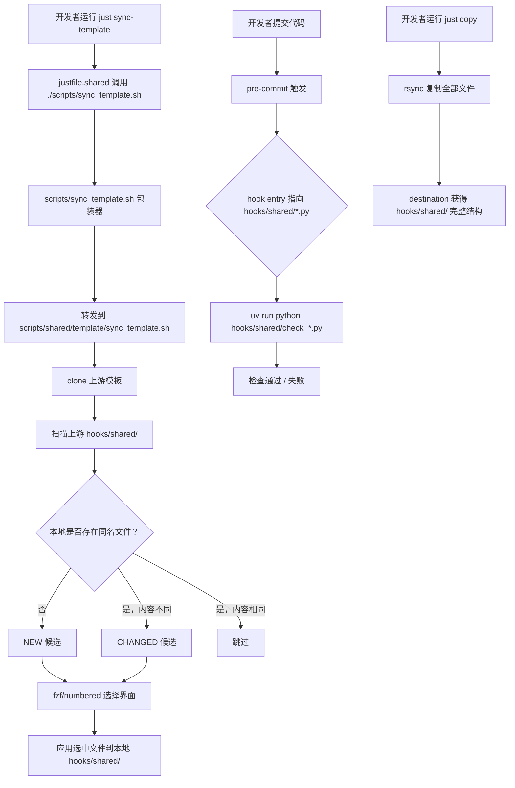

# P2-REFACTOR-20260626-141117 Isolate Template Hooks

## 1. Introduction & Goals

模板仓库根目录 `hooks/` 目前混合了所有模板共享的 pre-commit / 架构 / 规范检查脚本（如 `check_architecture.py`、`archive_tasks.py`、`run_jscpd_duplication_check.py` 等）与潜在的项目私有 hook。随着派生项目需要在本地添加项目私有 hook，这种混合会导致：

- 派生项目不敢在 `hooks/` 根目录新增文件，因为 `just sync-template` 可能把它当作候选与上游比对。
- 模板维护者每次新增共享 hook 都要考虑是否污染派生项目的 `hooks/` 根目录命名空间。
- `hooks/` 与 `scripts/shared/` 的隔离语义不一致：`scripts/shared/` 已是模板共享脚本的统一容器，而 `hooks/` 仍是扁平目录。

### Proposed Solution Summary

新建 `hooks/shared/` 目录作为**模板共享 hook 的唯一容器**：把所有会随 `just sync-template` 同步的 Python hook 脚本整体迁入 `hooks/shared/`。保留 `hooks/` 根目录给派生项目放置私有 hook。

为了让 `hooks/` 根目录真正留给项目私有 hook，在 `scripts/shared/template/sync_template.sh` 中同步更新两条规则：

1. `_is_always_skipped`：默认跳过 `hooks/` 根目录下所有文件，但 `hooks/shared/` 除外。
2. `_is_upstream_owned`：把上游拥有的 hook 路径从 `hooks/check_*.py` 扩大到 `hooks/shared/*`，使默认模式正常展示 `hooks/shared/` 下的变更候选。

同时更新 `.pre-commit-config.yaml`、CI workflow、文档和指令文件中对这些 hook 的路径引用，使其指向 `hooks/shared/`。

Goals:

- 明确 `hooks/shared/` 由上游模板维护并通过 `just sync-template` 同步。
- 明确 `hooks/` 根目录留给项目私有 hook。
- 通过 sync-template 跳过规则实现 `hooks/` 根目录默认不同步、`hooks/shared/` 正常同步。
- 与已完成的 `scripts/shared/` 隔离策略保持语义一致。
- 保持 `uv run pre-commit run --all-files`、`just test`、`just sync-template` 等真实入口行为不变。

### Realistic Validation

除单元测试和集成测试外，本 PRD 要求通过**真实项目入口点**验证关键行为，确保真实使用路径生效，而非仅在隔离 fixture 中通过。

- [x] **Pre-commit hook 真实验证**：通过 `uv run pre-commit run --all-files` 验证所有本地 hook 仍能从 `hooks/shared/` 正常执行，无路径解析错误。
- [x] **Sync-template 真实验证**：通过 `SYNC_TEMPLATE_LIST_ONLY=1 ./scripts/sync_template.sh` 验证迁移后 sync-template 的候选清单符合预期（`hooks/shared/` 下文件进入 NEW/CHANGED 候选，`hooks/` 根目录下新增私有 hook 不被同步）。
- [x] **CI workflow 真实验证**：通过 `.github/workflows/ci.yml` 中的 `check_max_file_lines` job 路径检查或本地等效命令验证 `uv run python hooks/shared/check_max_file_lines.py --help` 可被正确调用。
- [x] **Just recipe 解析真实验证**：通过 `just --summary` 验证所有 recipe 仍能正常加载，无路径解析错误。

**为什么单元测试不够**：路径迁移影响的是 `pre-commit`、shell 脚本、CI workflow 在真实文件系统上的解析与调用行为；纯单元测试无法覆盖 pre-commit 的 entry 路径、sync-template 的 allowlist 行为、GitHub Actions 的 working-directory 解析等真实入口行为。

### Delivery Dependencies

- Group: template-tooling
- Depends on groups:
  - none
- Depends on tasks/issues:
  - none
- Gate type: none
- Notes: 与已完成的 `P2-REFACTOR-20260615-110433-isolate-template-scripts.md` 思路一致，但针对 `hooks/` 目录；无硬依赖。

## 2. Requirement Shape

- **Actor**：模板维护者（持有 `zata-codes-template` 仓库）与派生项目的开发者。
- **Trigger**：派生项目运行 `just sync-template` 拉取上游更新；或模板维护者用 `just copy <new-dir>` 派生新项目；或派生项目开发者在 `hooks/` 根目录添加私有 hook。
- **Expected behavior**：
  - `just sync-template` 默认同步 `hooks/shared/` 下的文件，跳过 `hooks/` 根目录下的项目私有 hook。
  - `uv run pre-commit run --all-files` 调用的所有共享 hook entry 指向 `hooks/shared/` 后仍能正常工作。
  - 派生项目获得的新项目包含完整的 `hooks/shared/` 结构。
  - 文档、CI workflow 和 IDE 指令中对这些 hook 的路径引用指向 `hooks/shared/`。
- **Scope boundary**：
  - 只迁移 `hooks/` 根目录下的模板共享 Python 脚本到 `hooks/shared/`。
  - 不移动 `scripts/shared/hooks/` 下的 shell hook（已在上一个 PRD 中完成）。
  - 不修改 hook 的检查逻辑，仅修改路径和调用点。

## 3. Repository Context And Architecture Fit

### Current relevant modules/files

- `hooks/`：根目录下存放所有模板共享的 Python hook 脚本。
  - `archive_tasks.py`
  - `check_architecture.py`
  - `check_guidelines_consistency.py`
  - `check_max_file_lines.py`
  - `check_prd_acceptance_checklist.py`
  - `check_schema_conventions.py`
  - `duplication_check_utils.py`
  - `run_jscpd_duplication_check.py`
  - `run_pylint_duplication_check.py`
- `scripts/shared/template/sync_template.sh`：模板同步脚本，决定哪些文件是上游拥有、哪些默认跳过。
- `.pre-commit-config.yaml`：pre-commit 配置，直接引用 `hooks/*.py` 作为本地 hook 的 entry。
- `.github/workflows/ci.yml` 和 `.github/workflows/cd.yml`：CI/CD workflow，直接调用 `hooks/check_max_file_lines.py`。
- `.github/instructions/python-tests.instructions.md`：GitHub Copilot 指令文件，`applyTo` 包含 `hooks/**/*.py`。
- `config.toml`：`[template_sync]` 注释说明默认模式会展示 `hooks/check_*.py`。
- `docs/ai-standards/*.md`、`docs/guides/idea-inbox.md`、`src/backend/infrastructure/persistence/models/*.py`：多处引用具体 hook 路径。
- `tests/test_sync_template.py`：sync-template 回归测试，目前未覆盖 `hooks/` 目录的跳过行为。
- `tests/test_quality_flag_hooks.py`：测试 `scripts/shared/hooks/*.sh`，不受本次迁移影响。

### Existing architecture pattern to follow

- `scripts/shared/` 已完成相同的隔离：模板共享脚本集中在 `scripts/shared/`，`scripts/` 根目录留给项目私有脚本和入口包装器。
- `scripts/shared/template/sync_template.sh` 中通过 `_is_always_skipped` 和 `_is_upstream_owned` 控制同步范围。
- 四层架构、规范文档、pre-commit 配置均依赖这些 hook 作为静态检查入口。

### Ownership and dependency boundaries

- `hooks/shared/` 将由模板上游拥有，派生项目不应在其中添加私有脚本。
- `hooks/` 根目录由派生项目拥有，默认不会被 sync-template 覆盖。
- `scripts/shared/hooks/`（shell hook）保持不动，与 `hooks/shared/`（Python hook）并存，职责不重叠。

### Constraints from runtime, docs, tests, or workflows

- `.pre-commit-config.yaml` 中 `entry` 必须指向真实存在的可执行路径；迁移后需同步更新。
- `uv run python <path>` 要求 `<path>` 相对于仓库根目录可解析。
- GitHub Copilot 指令文件 `applyTo` 使用 glob 匹配；迁移后需更新以继续覆盖共享 hook。
- 文档中的路径引用需要同步更新，否则会导致新用户按旧路径执行失败。

### Matching or related PRDs

- `tasks/archive/P2-REFACTOR-20260615-110433-isolate-template-scripts.md`：已完成 `scripts/shared/` 隔离，是本次 PRD 的对标蓝本。本次迁移直接复用其规则设计（`_is_always_skipped` 例外、`_is_upstream_owned` allowlist）。
- `tasks/pending/P1-FEAT-20260625-105550-frontend-public-agent-platform.md`：引用 `hooks/check_architecture.py` 和 `hooks/check_schema_conventions.py`。该 PRD 为 pending 状态，**不应修改其内容**；本次迁移完成后，该 PRD 中的旧路径引用将成为历史记录，不影响目标状态。
- `tasks/pending/P1-FEAT-20260625-182322-dual-auth-domain-separation.md`：同上，pending PRD 中保留旧路径引用，不修改。

**Existing PRD Relationship**：本次 PRD 与 pending PRDs 无执行依赖；pending PRDs 中的旧路径引用会在其实施时由执行者按当前仓库状态自然使用 `hooks/shared/`。本次 PRD 独立可实施。

## 4. Recommendation

### Recommended Approach

采用与 `scripts/shared/` 完全一致的隔离模式：

1. 新建 `hooks/shared/`。
2. 将 `hooks/` 根目录下所有模板共享的 `.py` 文件迁入 `hooks/shared/`（保持文件名不变）。
3. 在 `scripts/shared/template/sync_template.sh` 中：
   - `_is_always_skipped` 新增 `hooks/*` 跳过规则，但 `hooks/shared/*` 除外。
   - `_is_upstream_owned` 将 `hooks/check_*.py` 替换为 `hooks/shared/*`。
4. 更新 `.pre-commit-config.yaml` 中所有 `hooks/*.py` entry 为 `hooks/shared/*.py`。
5. 更新 `.github/workflows/ci.yml`、`.github/workflows/cd.yml`、`.github/instructions/python-tests.instructions.md`、文档和源码注释中的 hook 路径。
6. 更新 `tests/test_sync_template.py`，新增 `hooks/` 根目录跳过与 `hooks/shared/` 同步的回归测试。

### Why this is the best fit

- 直接复用已验证的 `scripts/shared/` 模式，降低认知和维护成本。
- 只涉及文件移动和路径替换，不引入新抽象或配置层。
- `sync_template.sh` 的硬编码规则对所有派生项目一致生效，无需依赖 `config.toml` 推送更新。

### Alternatives Considered

- **把 Python hook 也移入 `scripts/shared/hooks/`，与 shell hook 合并**：rejected。`hooks/` 作为 pre-commit local hook 的存放位置是社区惯例，且 `.pre-commit-config.yaml` 已大量引用 `hooks/`；强行合并会制造长路径 `scripts/shared/hooks/*.py` 并混淆 shell hook 与 Python hook 的边界。
- **通过 `config.toml [template_sync]` 配置 `hooks/` 跳过和 `hooks/shared/` 例外**：rejected。`config.toml` 当前在 `_is_skipped_by_default` 中默认被跳过，且 sync-template 不会自动把新的 project_skip_paths / project_include_paths 推送给已有 fork；把规则硬编码到 `sync_template.sh` 才能对所有派生项目一致生效，与 `scripts/shared/` 的做法一致。
- **保留 `hooks/check_*.py` 在 `_is_upstream_owned` 中作为兼容模式**：rejected。迁移后这些文件已不存在于 `hooks/check_*.py`，保留旧模式会产生 dead pattern，增加未来维护者困惑。

## 5. Implementation Guide

> This section is a living implementation guide based on current repository analysis. If implementation discovers additional affected files, hidden dependencies, edge cases, or a better path, update this PRD before proceeding.

### Core Logic

1. `hooks/` 根目录下的模板共享 Python 脚本全部物理移动到 `hooks/shared/`。
2. `scripts/shared/template/sync_template.sh` 在扫描上游模板时：
   - 遇到 `hooks/*.py`（根目录）→ `_is_always_skipped` 返回 true → 永不同步。
   - 遇到 `hooks/shared/*.py` → `_is_always_skipped` 返回 false；默认模式下 `_is_upstream_owned` 返回 true → 进入同步候选。
3. `.pre-commit-config.yaml` 的 local hook entry 从 `hooks/*.py` 改为 `hooks/shared/*.py`，pre-commit 继续正常调用。
4. CI workflow、Copilot 指令、文档注释同步改路径，保持可读性。

### Change Impact Tree

```text
.
├── hooks/shared/
│   [新增目录]
│   【总结】模板共享 Python hook 的统一容器；会随 just sync-template 同步。
│
│   ├── [移动] archive_tasks.py ← hooks/archive_tasks.py
│   ├── [移动] check_architecture.py ← hooks/check_architecture.py
│   ├── [移动] check_guidelines_consistency.py ← hooks/check_guidelines_consistency.py
│   ├── [移动] check_max_file_lines.py ← hooks/check_max_file_lines.py
│   ├── [移动] check_prd_acceptance_checklist.py ← hooks/check_prd_acceptance_checklist.py
│   ├── [移动] check_schema_conventions.py ← hooks/check_schema_conventions.py
│   ├── [移动] duplication_check_utils.py ← hooks/duplication_check_utils.py
│   ├── [移动] run_jscpd_duplication_check.py ← hooks/run_jscpd_duplication_check.py
│   └── [移动] run_pylint_duplication_check.py ← hooks/run_pylint_duplication_check.py
│
├── scripts/shared/template/sync_template.sh
│   [修改]
│   【总结】更新跳过规则与上游拥有规则，使 hooks/shared/ 同步、hooks/ 根目录跳过。
│
│   ├── _is_always_skipped：新增 hooks/shared/* 例外，hooks/* 默认跳过。
│   └── _is_upstream_owned：将 hooks/check_*.py 替换为 hooks/shared/*。
│
├── .pre-commit-config.yaml
│   [修改]
│   【总结】所有本地 Python hook 的 entry 指向 hooks/shared/ 下的对应文件。
│
│   ├── check-prd-acceptance-checklist → uv run python hooks/shared/check_prd_acceptance_checklist.py
│   ├── check-guidelines-consistency → uv run python hooks/shared/check_guidelines_consistency.py
│   ├── archive-tasks → uv run python hooks/shared/archive_tasks.py
│   ├── check-architecture → uv run python hooks/shared/check_architecture.py
│   ├── check-schema-conventions → uv run python hooks/shared/check_schema_conventions.py
│   ├── check-max-file-lines → uv run python hooks/shared/check_max_file_lines.py ...
│   ├── jscpd → uv run python hooks/shared/run_jscpd_duplication_check.py
│   └── pylint-duplicate-code → uv run python hooks/shared/run_pylint_duplication_check.py
│
├── .github/workflows/ci.yml
│   [修改]
│   【总结】check_max_file_lines 步骤调用 hooks/shared/check_max_file_lines.py。
│
├── .github/workflows/cd.yml
│   [修改]
│   【总结】check_max_file_lines 步骤调用 hooks/shared/check_max_file_lines.py。
│
├── .github/instructions/python-tests.instructions.md
│   [修改]
│   【总结】applyTo glob 与示例命令中的 hooks/ 路径更新为 hooks/shared/。
│
├── config.toml
│   [修改]
│   【总结】template_sync 注释中的 hooks/check_*.py 更新为 hooks/shared/*.py。
│
├── docs/
│   [修改]
│   【总结】更新所有引用 hooks/ 下已迁移脚本路径的文档。
│
│   ├── docs/ai-standards/testing.md: hooks/check_architecture.py → hooks/shared/check_architecture.py
│   ├── docs/ai-standards/testing.md: hooks/check_guidelines_consistency.py → hooks/shared/check_guidelines_consistency.py
│   ├── docs/ai-standards/code-reuse.md: hooks/check_max_file_lines.py → hooks/shared/check_max_file_lines.py
│   ├── docs/ai-standards/architecture.md: hooks/check_architecture.py → hooks/shared/check_architecture.py
│   ├── docs/ai-standards/tooling.md: hooks/check_prd_acceptance_checklist.py → hooks/shared/check_prd_acceptance_checklist.py
│   └── docs/guides/idea-inbox.md: hooks/check_prd_acceptance_checklist.py → hooks/shared/check_prd_acceptance_checklist.py
│
├── src/backend/infrastructure/persistence/models/
│   [修改]
│   【总结】源码注释中引用的 check_schema_conventions.py 路径更新为 hooks/shared/。
│
│   ├── base.py
│   └── __init__.py
│
└── tests/test_sync_template.py
    [修改]
    【总结】新增 hooks/ 根目录跳过与 hooks/shared/ 同步的回归测试，并更新已有测试中若涉及 hooks/ 的路径。

    ├── 新增 test_sync_template_skips_hooks_root_by_default
    └── 新增 test_sync_template_all_includes_hooks_shared
```

### Executor Drift Guard

实施时不要相信“上面文件清单是穷尽”——用以下搜索确认没有遗漏的引用：

```bash
# 查找所有对 hooks/ 根目录下已迁移 Python 脚本的引用（排除 tasks/pending 和 tasks/archive 中的历史 PRD）
rg -n "hooks/(archive_tasks|check_|duplication_check|run_jscpd|run_pylint)" . \
  --glob '!tasks/pending/*' --glob '!tasks/archive/*'

# 查找所有对 hooks/ 根目录的泛化引用（需要人工判断是否是调用点）
rg -n "\bhooks/[^/]+\.py\b" . \
  --glob '!tasks/pending/*' --glob '!tasks/archive/*'

# 确认 sync_template.sh 中不存在旧的 hooks/check_*.py 模式
rg -n "hooks/check_\*\.py" scripts/shared/template/sync_template.sh

# 确认 pre-commit 配置中的 entry 全部指向 hooks/shared/
rg -n "entry:.*hooks/" .pre-commit-config.yaml
```

风险点：

- `scripts/shared/template/sync_template.sh` 自身扫描上游模板时，会按新路径 `hooks/shared/` 处理文件；本地旧路径 `hooks/*.py` 下的共享脚本在首次 sync 后会被视为“本地不存在的新文件”，这是预期行为。
- 派生项目可能已在 `hooks/` 根目录添加同名文件（如 `hooks/check_architecture.py`）；迁移后这些文件不会冲突，因为共享版本已移入 `hooks/shared/check_architecture.py`，但派生项目应清理旧路径避免混淆。
- `hooks/__pycache__/` 是构建输出，不在 git 跟踪范围内；迁移后首次运行 hook 会重新生成，无需手动迁移。

### Flow Or Architecture Diagram



### Realistic Validation Plan

| Behavior | Real Entry Point | Test Layer | Mock Boundary | Data/Env Needed | Command Or Procedure | Required For Acceptance |
|---|---|---|---|---|---|---|
| Pre-commit hook 路径解析 | `uv run pre-commit run --all-files` | smoke/manual | none | pre-commit 已安装 | `cd /repo/root && uv run pre-commit run --all-files` | Yes |
| Sync-template 候选清单 | `SYNC_TEMPLATE_LIST_ONLY=1 ./scripts/sync_template.sh` | manual/sandbox | 上游模板仓库（真实 clone） | git、网络或本地模板源 | `SYNC_TEMPLATE_LIST_ONLY=1 ./scripts/sync_template.sh` | Yes |
| CI max-file-lines 路径 | `uv run python hooks/shared/check_max_file_lines.py --help` | smoke | none | uv 环境 | `uv run python hooks/shared/check_max_file_lines.py --help` | Yes |
| Just recipe 解析 | `just --summary` | smoke | none | just 已安装 | `cd /repo/root && just --summary` | Yes |
| Hook 脚本语法检查 | `bash -n` / `uv run python -m py_compile` | smoke | none | bash、uv | `bash -n scripts/shared/template/sync_template.sh && uv run python -m py_compile hooks/shared/*.py` | Yes |

If live upstream validation is unavailable, fallback to local validation: set `SYNC_TEMPLATE_TEMPLATE_REPO` to a local clone of the template and run `SYNC_TEMPLATE_LIST_ONLY=1 ./scripts/sync_template.sh`.

### External Validation

No external validation required; repository evidence was sufficient.

### Low-Fidelity Prototype

Not required; this is a path-migration refactor with no UI changes.

### ER Diagram

No data model changes in this PRD.

### Interactive Prototype Change Log

No interactive prototype file changes in this PRD.

## 6. Definition Of Done

- [x] 所有模板共享 Python hook 脚本已迁入 `hooks/shared/`。
- [x] `scripts/shared/template/sync_template.sh` 的跳过规则和上游拥有规则已更新。
- [x] `.pre-commit-config.yaml` 中所有相关 hook entry 已指向 `hooks/shared/`。
- [x] CI workflow、Copilot 指令、文档、源码注释中的路径引用已更新。
- [x] `tests/test_sync_template.py` 已新增 `hooks/` 目录隔离的回归测试，且全部通过。
- [x] `uv run pre-commit run --all-files` 在仓库根目录成功执行。
- [x] `SYNC_TEMPLATE_LIST_ONLY=1 ./scripts/sync_template.sh` 输出符合预期（`hooks/shared/` 可见，`hooks/` 根目录不可见）。
- [x] `just --summary` 无错误。
- [x] 无回归：现有 `just test`、`uv run pytest` 全部通过。
- [x] 文档与 `mkdocs.yml` 同步更新（如新增文档页或导航变更）。

## 7. Acceptance Checklist

### Architecture Acceptance

- [x] `hooks/shared/` 存在且包含所有已迁移的模板共享 Python hook 脚本。
- [x] `hooks/` 根目录下不再存在模板共享的 `.py` 脚本（`__pycache__` 除外）。
- [x] `scripts/shared/template/sync_template.sh` 的 `_is_always_skipped` 中，`hooks/*` 被跳过但 `hooks/shared/*` 为例外。
- [x] `scripts/shared/template/sync_template.sh` 的 `_is_upstream_owned` 中，`hooks/shared/*` 被标记为上游拥有。
- [x] `scripts/shared/hooks/`（shell hook）保持不动，与 `hooks/shared/`（Python hook）职责分离。

### Dependency Acceptance

- [x] 本次迁移不新增外部依赖。
- [x] 本次迁移不修改 hook 脚本的业务逻辑，仅修改路径和调用点。

### Behavior Acceptance

- [x] `.pre-commit-config.yaml` 中 8 个本地 Python hook 的 `entry` 全部指向 `hooks/shared/` 下的对应文件。
- [x] `.github/workflows/ci.yml` 的 `check_max_file_lines` 步骤调用 `hooks/shared/check_max_file_lines.py`。
- [x] `.github/workflows/cd.yml` 的 `check_max_file_lines` 步骤调用 `hooks/shared/check_max_file_lines.py`。
- [x] `.github/instructions/python-tests.instructions.md` 的 `applyTo` 与示例命令中的路径更新为 `hooks/shared/`。
- [x] `config.toml` 的 `[template_sync]` 注释中不再出现 `hooks/check_*.py`，改为 `hooks/shared/*.py`。
- [x] `docs/ai-standards/testing.md`、`docs/ai-standards/code-reuse.md`、`docs/ai-standards/architecture.md`、`docs/ai-standards/tooling.md`、`docs/guides/idea-inbox.md` 中相关 hook 路径已更新。
- [x] `src/backend/infrastructure/persistence/models/base.py` 和 `__init__.py` 中引用的 `check_schema_conventions.py` 路径已更新为 `hooks/shared/check_schema_conventions.py`。

### Documentation Acceptance

- [x] 相关文档中的路径引用与目标状态一致。
- [x] 若新增或修改了文档页，`mkdocs.yml` 导航同步更新（本次迁移预计无需新增页面）。

### Validation Acceptance

- [x] `uv run pre-commit run --all-files` 成功执行，所有 hook 从 `hooks/shared/` 正常调用。
- [x] `SYNC_TEMPLATE_LIST_ONLY=1 ./scripts/sync_template.sh` 输出中，`hooks/shared/` 下文件进入候选，`hooks/` 根目录下文件不进入候选。
- [x] `uv run python hooks/shared/check_max_file_lines.py --help` 成功加载。
- [x] `just --summary` 无路径解析错误。
- [x] `uv run pytest tests/test_sync_template.py -v` 全部通过，包括新增的 `hooks/` 隔离测试。

## 8. Functional Requirements

- **FR-1**：`hooks/shared/` 目录必须存在，并包含从 `hooks/` 根目录迁移的所有模板共享 Python 脚本，文件名保持不变。
- **FR-2**：`scripts/shared/template/sync_template.sh` 的 `_is_always_skipped` 函数必须默认跳过 `hooks/` 根目录下的文件，但 `hooks/shared/*` 除外。
- **FR-3**：`scripts/shared/template/sync_template.sh` 的 `_is_upstream_owned` 函数必须将 `hooks/shared/*` 识别为上游拥有文件，使默认模式展示其同步候选。
- **FR-4**：`.pre-commit-config.yaml` 中所有本地 Python hook 的 `entry` 路径必须从 `hooks/*.py` 更新为 `hooks/shared/*.py`。
- **FR-5**：`.github/workflows/ci.yml` 和 `.github/workflows/cd.yml` 中调用 `hooks/check_max_file_lines.py` 的位置必须更新为 `hooks/shared/check_max_file_lines.py`。
- **FR-6**：`.github/instructions/python-tests.instructions.md` 中的 `applyTo` glob 和示例命令必须更新为引用 `hooks/shared/`。
- **FR-7**：`config.toml`、`docs/`、`src/backend/infrastructure/persistence/models/*.py` 中对已迁移 hook 的路径引用必须更新为 `hooks/shared/`。
- **FR-8**：`tests/test_sync_template.py` 必须新增回归测试，验证 `hooks/` 根目录被默认跳过且 `hooks/shared/` 被同步。
- **FR-9**：迁移后的所有 hook 脚本在 `uv run pre-commit run --all-files` 中必须能正常执行，行为与迁移前一致。

## 9. Non-Goals

- 不修改任何 hook 脚本的检查逻辑、规则或输出格式。
- 不迁移 `scripts/shared/hooks/` 下的 shell hook。
- 不修改 pending PRDs（`tasks/pending/P1-FEAT-20260625-105550-frontend-public-agent-platform.md`、`tasks/pending/P1-FEAT-20260625-182322-dual-auth-domain-separation.md`）中的历史路径引用。
- 不引入新的配置层（如 `config.toml` 新增项目级 hook 路径配置）。
- 不将 `hooks/shared/` 下的脚本合并到 `scripts/shared/` 或其他目录。
- 不修改 `tasks/inbox/ideas.md` 中的原始想法记录。

## 10. Risks And Follow-Ups

- **首次 sync 后派生项目可能残留旧路径文件**：派生项目本地若存在 `hooks/check_architecture.py` 等旧路径文件，迁移后不会被自动删除；这些文件将与 `hooks/shared/check_architecture.py` 并存，可能导致混淆。缓解：在 PRD 实施后的首次 sync 时，模板维护者应通知派生项目清理旧路径文件。
- **pre-commit 缓存可能导致旧路径报错**：如果开发者本地的 pre-commit 缓存了旧的 entry 路径，首次运行可能报错。缓解：运行 `uv run pre-commit clean` 后重新安装 hook。
- **IDE / Copilot 指令文件路径匹配失效**：`.github/instructions/python-tests.instructions.md` 的 `applyTo` 若未更新，可能导致 Copilot 在共享 hook 上不再加载对应指令。缓解：确保该文件同步更新。
- **文档引用遗漏**：非代码文件（如 pending PRDs、外部笔记）可能仍引用旧路径，但不会影响执行。缓解：实施时使用 Executor Drift Guard 中的搜索命令全局检查。

## 11. Decision Log

| ID | Decision | Chosen | Rejected | Rationale |
|---|---|---|---|---|
| D-01 | 隔离目录命名 | `hooks/shared/` | `scripts/shared/hooks/` 或 `hooks/template/` | 与已完成的 `scripts/shared/` 保持语义一致；`hooks/shared/` 直接对应 pre-commit 的 `hooks/` 惯例，路径最短。 |
| D-02 | 同步规则实现位置 | 硬编码在 `scripts/shared/template/sync_template.sh` 的 `_is_always_skipped` / `_is_upstream_owned` | 通过 `config.toml [template_sync]` 配置 | 硬编码规则对所有派生项目一致生效，无需依赖 config 文件同步，复用 `scripts/shared/` 的成功模式。 |
| D-03 | 上游拥有 allowlist 范围 | `hooks/shared/*` | 仅 `hooks/shared/check_*.py` | 所有迁入 `hooks/shared/` 的脚本都是模板共享的，统一 allowlist 减少未来新增 hook 时漏配的风险。 |
| D-04 | 是否保留旧路径兼容模式 | 不保留 | 在 `_is_upstream_owned` 中同时保留 `hooks/check_*.py` | 迁移后旧路径文件已不存在，保留 dead pattern 会增加维护困惑。 |
| D-05 | 是否迁移 `__pycache__` | 不迁移 | 手动移动 `__pycache__` | `__pycache__` 是构建输出，不在 git 跟踪范围内，运行 hook 后会自动重建。 |
