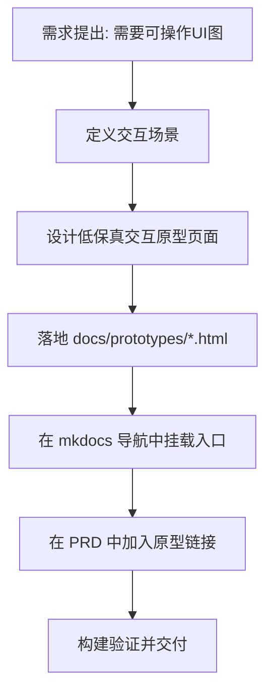

# PRD: 交互式 UI 原型支持（Docs 内可操作演示）

## 1. Introduction & Goals

在当前 PRD 规范中，已支持表格、Mermaid、ASCII 原型等静态可视化。
本需求目标是在文档站点内新增“可操作 UI 原型”能力，让评审者可直接点击、切换状态、模拟流程，从而减少“只看静态图仍有理解偏差”的问题。

### Measurable Objectives
- 在文档站点提供至少 1 个可交互原型页面（按钮、切换、导航等）。
- PRD 能明确链接到原型页面路径，评审可在 2 次点击内进入原型。
- 原型页面支持桌面与移动端基础可用（布局不破坏、交互可触发）。
- 文档构建 `uv run mkdocs build` 通过。

---

## 2. Implementation Guide (Technical Specs)

### 2.1 Project Context Analysis
- 技术栈：Python + MkDocs Material（`mkdocs.yml` 已配置）。
- 可视化能力：Mermaid 已启用，支持图表表达流程和关系。
- 现有文档结构：`docs/guides/` 作为规范文档目录，适合挂接“原型规范与入口”。
- 现状缺口：暂无 `docs/prototypes/` 专用目录，也无“交互原型”导航入口。

### 2.2 Change Matrix (Mandatory)

| Change Target | Current State | Target State | How to Modify | Affected Files |
|---|---|---|---|---|
| 原型页面承载目录 | 无专用目录 | 有可复用原型目录 | 新增 `docs/prototypes/` 并放入 HTML 原型页面 | `docs/prototypes/prd-demo.html`（新增） |
| 文档导航入口 | 无原型入口 | 可在文档站点访问原型 | 在 `mkdocs.yml` 增加 “原型演示” 导航 | `mkdocs.yml` |
| PRD 与原型联动规范 | 仅静态图规范 | 支持 PRD 链接到交互原型 | 在规范页增加“交互原型链接规则” | `docs/guides/prd-standard.md` |
| 示例 PRD 指引 | 已有静态示例 | 提供交互原型示例引用 | 增加示例说明与路径映射 | `tasks/prd-interactive-ui-prototype-support.md` |

### 2.3 Core Logic Flow (Mandatory)



### 2.4 Low-Fidelity Prototype (Mandatory)

```text
+------------------------------------------------------------+
| Prototype: PRD Demo UI                                    |
+------------------------------------------------------------+
| Header: [Feature Title] [Version]                         |
| Left Nav: Overview | Flow | Data | DoD                    |
|------------------------------------------------------------|
| Main Panel                                                 |
|  - Scenario Switch: [Normal] [Edge Case]                  |
|  - Action Buttons: [Start] [Next] [Reset]                 |
|  - State Card: current_step / expected_result             |
|------------------------------------------------------------|
| Footer: Link back to PRD / docs                           |
+------------------------------------------------------------+
```

### 2.5 ER Diagram (Required when data model changes)

本需求不涉及数据库/持久化 schema 变更，ER 图不作为必需交付。
No data model changes in this PRD.

### 2.6 Database/State Changes
- 无数据库结构变更。
- 仅前端原型页面内部状态（页面级交互状态）变化，不写入持久层。

### 2.7 Affected Files (Predicted)

| File | Change Type | Description |
|---|---|---|
| `docs/prototypes/prd-demo.html` | Add | 新增可交互原型页面（按钮、状态切换、响应式布局） |
| `docs/prototypes/assets/prototype.css` | Add | 原型样式文件，统一视觉与移动端适配 |
| `docs/prototypes/assets/prototype.js` | Add | 原型交互逻辑（状态机/事件绑定） |
| `mkdocs.yml` | Modify | 导航增加原型入口 |
| `docs/guides/prd-standard.md` | Modify | 增加交互原型使用规范与链接方式 |

### 2.8 Interactive Prototype Change Log

| File Path | Change Type | Before | After | Why |
|---|---|---|---|---|
| `docs/prototypes/prd-demo.html` | Add | 无可操作原型页 | 新增页面骨架，提供场景切换和 Start/Next/Reset 控件 | 支持评审直接验证交互流程 |
| `docs/prototypes/assets/prototype.css` | Add | 无专用样式 | 新增页面视觉系统与响应式布局样式 | 保证桌面/移动端可读可操作 |
| `docs/prototypes/assets/prototype.js` | Add | 无前端交互状态逻辑 | 新增场景状态机、步骤推进、时间线事件更新 | 让原型具备可演示行为 |
| `docs/prototypes/index.md` | Add | 无原型目录页 | 新增原型说明与入口链接 | 统一原型入口与使用说明 |
| `mkdocs.yml` | Modify | 导航无原型分组 | 新增 `原型演示` 导航分组 | 在文档站点可直接访问原型 |
| `docs/guides/prd-standard.md` | Modify | 无“可操作 UI 规则” | 增加原型路径、最小交互和链接约束 | 规范 PRD 与原型联动方式 |

### 2.9 Interactive Prototype Link

- Prototype page: `docs/prototypes/prd-demo.html`
- Prototype index: `docs/prototypes/index.md`
- Related standard: `docs/guides/prd-standard.md`

---

## 3. Global Definition of Done (DoD)

- [ ] Change Matrix 已完整填写并映射到具体文件
- [ ] 至少 1 个 Mermaid 流程图已提供
- [ ] 低保真原型图已提供（ASCII 或 Mermaid）
- [ ] 明确声明本次是否有数据模型变更
- [ ] 原型页面可在文档站点正常访问
- [ ] 桌面/移动端下原型页面均可操作
- [ ] PRD 已包含 `Interactive Prototype Change Log` 且写明前后行为变化
- [ ] PRD 已包含可访问的 `Interactive Prototype Link`
- [ ] `uv run mkdocs build` 通过

---

## 4. User Stories

### US-001: 评审可直接操作原型
**Description:** 作为需求评审者，我希望在文档里直接点击原型页面进行交互，以更快确认需求行为是否符合预期。

**Acceptance Criteria:**
- [ ] 文档站点中可访问原型入口
- [ ] 原型包含至少 3 个可触发交互动作（如 Start/Next/Reset）
- [ ] 交互后界面状态可见变化

### US-002: PRD 与原型强关联
**Description:** 作为开发者，我希望 PRD 能直接指向对应原型页面，避免“文档和演示脱节”。

**Acceptance Criteria:**
- [ ] PRD 中包含原型页面路径
- [ ] 原型页面回链到 PRD 或规范页
- [ ] 改动清单中的文件路径与实际文件一致

### US-003: 原型可维护复用
**Description:** 作为团队成员，我希望原型具备统一的目录与资源组织方式，便于后续复制扩展。

**Acceptance Criteria:**
- [ ] 采用 `docs/prototypes/assets/` 资源组织结构
- [ ] 样式与脚本拆分，避免单文件过度膨胀
- [ ] 新增第二个原型时无需改动已有原型核心代码

---

## 5. Functional Requirements

- FR-1: 必须提供至少 1 个 HTML 交互原型页面并可在 MkDocs 站点中访问。
- FR-2: 原型页面必须提供可触发状态变化的交互控件（按钮或切换）。
- FR-3: 原型页面必须支持移动端基础布局（不溢出、可点击）。
- FR-4: PRD 文档中必须出现原型路径和用途说明。
- FR-5: 文档导航必须新增原型入口，且名称清晰可识别。
- FR-6: 文档构建必须通过 `uv run mkdocs build`。

---

## 6. Non-Goals

- 不在本阶段接入 Figma/Sketch 等外部设计平台同步。
- 不在本阶段实现高保真视觉稿，仅提供可交互低/中保真原型。
- 不在本阶段引入后端 API 作为原型数据源（使用前端模拟状态）。
- 不在本阶段实现自动截图或录像导出流程。
