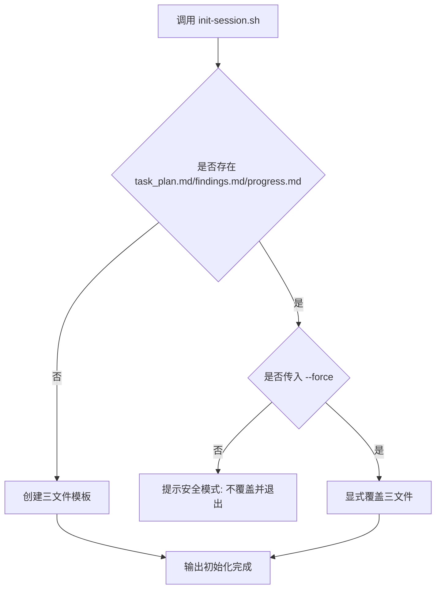

# PRD: planning-with-files 安全初始化与显式重置

## 1. 背景与目标

当前 `planning-with-files` 在会话开始时存在“初始化行为预期不一致”问题：
- 预期是开始新任务时先重置 `task_plan.md`、`findings.md`、`progress.md`。
- 实际使用中可能在旧文件上继续追加，导致上下文混杂。
- 若把重置动作绑定到 `SessionStart` 自动执行，又会引入“每次会话都覆盖历史记录”的高风险。

本次需求目标是将初始化流程改为“默认安全、显式覆盖”。

### 可衡量目标
- 默认执行初始化脚本时，**已有 planning 文件不被覆盖**。
- 仅当显式传入 `--force` 时，允许覆盖三文件。
- `SessionStart` 仅做检测与提示，不做隐式覆盖。
- 文档与脚本行为保持一致，避免误操作。

---

## 2. 实施方案（技术规格）

### 2.1 Change Matrix（强制）

| Change Target | Current State | Target State | How to Modify | Affected Files |
|---|---|---|---|---|
| 初始化脚本默认行为 | 脚本默认覆盖三文件 | 默认安全模式：检测到已有文件即退出，不覆盖 | 在脚本中新增存在性检测与保护退出分支 | `skills/planning-with-files/scripts/init-session.sh` |
| 强制覆盖机制 | 无显式强制重置开关 | 新增 `--force`/`-f` 作为唯一覆盖入口 | 新增参数解析逻辑，force 模式下允许覆盖 | `skills/planning-with-files/scripts/init-session.sh` |
| 脚本健壮性 | `set -e`，参数处理较弱 | 增强为严格模式并提供 usage/help | 使用 `set -euo pipefail` + `--help` + 非法参数返回码 | `skills/planning-with-files/scripts/init-session.sh` |
| SessionStart 行为 | 仅提示 ready + phase status | 新增“存在性检查 + 指令提示”，不自动覆盖 | 在 hook 中加入 if 检查，提示 `init-session.sh --force` | `skills/planning-with-files/SKILL.md` |
| 使用文档一致性 | Quick Start 未明确安全模式与 force 策略 | 明确“默认安全 + 显式 force 重置” | 更新 Quick Start 与 Scripts 用法示例 | `skills/planning-with-files/SKILL.md` |
| 版本标识 | 旧版本号 | 小版本递增，反映行为升级 | 更新 skill 版本号 | `skills/planning-with-files/SKILL.md` |

### 2.2 Flow Diagram（强制）



### 2.3 低保真原型（强制）

```text
+--------------------------------------------------------+
| planning-with-files 初始化决策面板                     |
+--------------------------------------------------------+
| Input: init-session.sh [--force] [project-name]        |
+--------------------------------------------------------+
| Check existing files:                                  |
| - task_plan.md                                         |
| - findings.md                                          |
| - progress.md                                          |
+---------------------------+----------------------------+
| Exists + no --force       | Exists + --force          |
| -> print warning          | -> overwrite templates    |
| -> exit safely            | -> print success          |
+---------------------------+----------------------------+
| Not exists                |                            |
| -> create templates       |                            |
+--------------------------------------------------------+
| SessionStart Hook: only check + suggest command        |
+--------------------------------------------------------+
```

### 2.4 ER Diagram（条件）

No data model changes in this PRD.

### 2.5 核心逻辑变更说明

1. 初始化脚本行为重构
- 默认行为从“总是覆盖”改为“安全退出优先”。
- 引入 `--force` 作为覆盖闸门，避免误删历史 planning 内容。
- 增加 `--help` 与错误参数处理，提升可用性。

2. 会话启动策略调整
- `SessionStart` 只负责提示当前状态与下一步动作。
- 明确区分：
  - 新任务：人工触发 `--force` 重置。
  - 非新任务：保留 existing planning 历史。

3. 文档与行为对齐
- Quick Start 和脚本说明同步更新，降低认知偏差。
- 使用 `${CLAUDE_PLUGIN_ROOT}` 路径示例，避免在项目目录误定位脚本。

### 2.6 影响文件

- `skills/planning-with-files/scripts/init-session.sh`
- `skills/planning-with-files/SKILL.md`

### 2.7 兼容性与迁移

- 向后兼容：旧命令 `init-session.sh [project-name]` 仍可用（但默认不覆盖）。
- 行为变更点：曾依赖“默认覆盖”的工作流需改为显式 `--force`。

### 2.8 Interactive Prototype Change Log（条件）

No interactive prototype file changes in this PRD.

### 2.9 Interactive Prototype Link（条件）

Not applicable for this PRD.

---

## 3. 全局 Definition of Done (DoD)

- [ ] 默认执行初始化脚本时，已有 planning 文件不会被覆盖。
- [ ] `--force` 能显式覆盖三文件。
- [ ] `SessionStart` 不触发任何覆盖写入动作。
- [ ] `SKILL.md` 的 Quick Start 与 Scripts 文案和脚本行为一致。
- [ ] `uv run mkdocs build` 通过。
- [ ] 改动未影响 `update_phase_status.py` 与 `check-complete.sh` 既有能力。

---

## 4. User Stories

### US-001: 安全初始化
**Description:** 作为使用 planning-with-files 的开发者，我希望默认初始化不覆盖已有计划文件，以避免误删历史上下文。

**Acceptance Criteria:**
- [ ] 当任一 planning 文件存在且未传入 `--force` 时，脚本退出并提示。
- [ ] 原有文件内容保持不变。

### US-002: 显式重置
**Description:** 作为开启新任务的开发者，我希望在明确意图下重置 planning 文件，以获得干净起点。

**Acceptance Criteria:**
- [ ] 传入 `--force` 时覆盖 `task_plan.md`、`findings.md`、`progress.md`。
- [ ] 输出明确提示“force 模式覆盖已执行”。

### US-003: 会话启动防误触
**Description:** 作为技能使用者，我希望 SessionStart 只提醒而不修改文件，避免会话切换时误覆盖。

**Acceptance Criteria:**
- [ ] SessionStart 检测到已有文件时，只输出提示命令。
- [ ] SessionStart 未检测到文件时，只提示初始化命令。
- [ ] SessionStart 不执行 `init-session.sh --force`。

### US-004: 文档一致性
**Description:** 作为协作者，我希望文档准确反映脚本真实行为，避免误用。

**Acceptance Criteria:**
- [ ] Quick Start 明确默认安全模式。
- [ ] 文档包含 `--force` 场景说明。
- [ ] 示例命令可直接运行。

---

## 5. Functional Requirements

- FR-1: `init-session.sh` 默认模式下，若发现任意 planning 文件存在，必须退出且不写入覆盖。
- FR-2: `init-session.sh --force` 必须覆盖三文件，并输出覆盖提示。
- FR-3: `init-session.sh` 必须支持 `--help`，并对非法参数返回非零退出码。
- FR-4: `SessionStart` hook 必须仅执行检查与提示，禁止触发覆盖写入。
- FR-5: `SKILL.md` 文档内容必须与脚本实现保持一致。
- FR-6: 脚本执行路径示例应指向 `${CLAUDE_PLUGIN_ROOT}/scripts/init-session.sh`。

---

## 6. Non-Goals

- 不改动 planning 文件模板内容结构（仅改初始化策略）。
- 不改动 `update_phase_status.py` 的自动推进逻辑。
- 不新增数据库/持久化层。
- 不引入交互式 UI 原型页面。

---

## 7. 风险与缓解

- 风险: 团队成员沿用旧习惯，误以为默认会重置。
- 缓解: SessionStart 提示与文档双重强化，明确 `--force` 才覆盖。

- 风险: 自动化脚本链路依赖旧覆盖语义导致行为变化。
- 缓解: 在 CI/脚本中显式追加 `--force`，并更新调用方说明。

---

## 8. 验证记录（本次实现）

- 场景 1: 首次运行，成功创建三文件。
- 场景 2: 已有文件 + 默认模式，成功拒绝覆盖。
- 场景 3: 已有文件 + `--force`，成功覆盖。
- 文档构建: `uv run mkdocs build` 通过。
