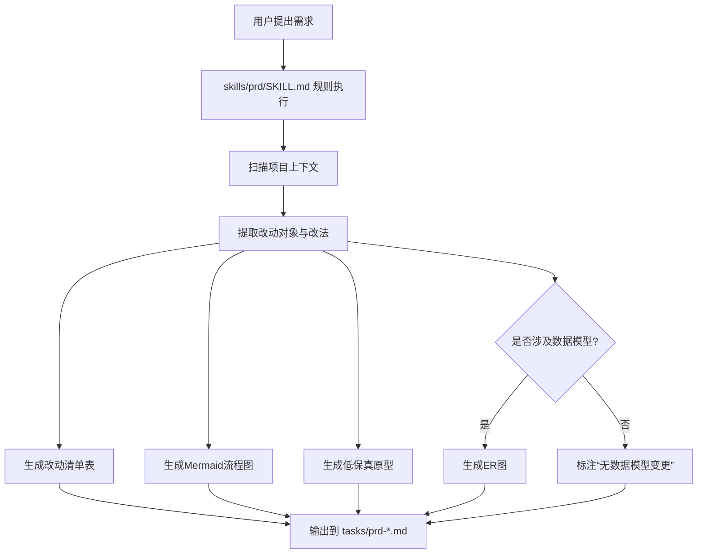
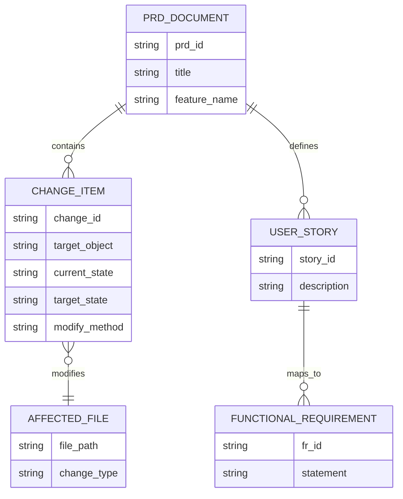

# PRD: PRD 产物可视化改造（明确“改什么、怎么改”）

## 1. Introduction & Goals

当前 `prd` 技能可输出结构化需求文档，但对“将修改哪些内容、如何修改”的可视化表达约束不足。目标是将 PRD 产物升级为“可执行设计说明”，强制包含表格、流程图、原型图和（在涉及数据模型时）ER 图。

### Measurable Objectives
- 每份 PRD 必须包含 `改动清单表`，覆盖率达到 100%（对象、现状、目标、修改方式）。
- 每份 PRD 必须包含至少 1 个 Mermaid 图（流程图或架构图）。
- 涉及数据结构变更的 PRD 必须包含 1 个 Mermaid `erDiagram`。
- 每份 PRD 必须包含 1 个低保真原型（ASCII 或 Mermaid）。
- 产出的 PRD 存放在 `tasks/prd-[feature-name].md`，并通过 `uv run mkdocs build` 无警告。

---

## 2. Implementation Guide (Technical Specs)

### 2.1 Project Context Analysis
- 技术栈：Python + `uv`；文档使用 MkDocs Material（见 `pyproject.toml`、`mkdocs.yml`）。
- 文档能力：`mkdocs.yml` 已启用 Mermaid 渲染，可直接在 Markdown 中使用 Mermaid 代码块。
- 现有模式：`tasks/archive/prd-configuration-system-refactor.md` 已有高质量 PRD 样式，可作为结构基线。

### 2.2 Core Logic: PRD 生成流程改造



### 2.3 改动清单（How-to-Change Matrix）

| 改动对象 | 当前状态 | 目标状态 | 修改方式 | 影响文件 |
|---|---|---|---|---|
| PRD 结构约束 | 仅文字说明为主 | 强制可视化区块 | 在 `skills/prd/SKILL.md` 增加必填章节规则 | `skills/prd/SKILL.md` |
| PRD 模板复用 | 无固定可视化模板 | 提供统一模板片段 | 新增模板文件并在技能中引用 | `skills/prd/templates/prd-visual-template.md`（新增） |
| 数据变更表达 | 不强制 ER 图 | 涉及 schema 时必须 ER 图 | 增加“触发条件+校验项” | `skills/prd/SKILL.md` |
| 输出质量门禁 | 仅 DoD 通用项 | 增加可视化完整性检查 | DoD 增加图表完整性条目 | `skills/prd/SKILL.md`、`tasks/prd-*.md` |

### 2.4 原型图（低保真布局）

```text
+--------------------------------------------------------------+
| PRD Title                                                    |
+--------------------------------------------------------------+
| 1. Goals                                                     |
| 2. Implementation Guide                                      |
|    2.1 改动清单表 (必须)                                     |
|    2.2 Mermaid流程图 (必须)                                  |
|    2.3 原型图/页面草图 (必须)                                |
|    2.4 ER图 (有数据改动时必须)                               |
| 3. Global DoD                                                |
| 4. User Stories                                              |
| 5. FR                                                        |
| 6. Non-Goals                                                 |
+--------------------------------------------------------------+
```

### 2.5 ER 图规范（当 PRD 涉及数据结构修改）



### 2.6 Database/State Changes
- 不引入业务数据库变更。
- 文档状态变更：PRD 输出规范从“纯文本优先”升级为“可视化强制+文本说明”双轨。
- 可选增强：后续可为 PRD 增加 YAML Front Matter（如 `has_er_diagram: true/false`）用于自动化检查。

### 2.7 Affected Files (Predicted)

| File | Change Type | Description |
|---|---|---|
| `skills/prd/SKILL.md` | Modify | 增加可视化强制规则与触发条件 |
| `skills/prd/templates/prd-visual-template.md` | Add | 提供标准化 PRD 可视化模板 |
| `tasks/prd-visual-change-spec.md` | Add | 本次需求的基准 PRD |
| `docs/guides/configuration.md` 或新增 `docs/guides/prd-standard.md` | Modify/Add | 记录 PRD 编写与评审规范 |
| `mkdocs.yml` | Modify（可选） | 若新增文档页，更新 `nav` |

---

## 3. Global Definition of Done (DoD)

- [ ] PRD 包含改动清单表（对象/现状/目标/改法/影响文件）
- [ ] PRD 包含至少 1 个 Mermaid 流程图
- [ ] PRD 包含低保真原型图（ASCII 或 Mermaid）
- [ ] 若存在数据结构变更，PRD 包含 ER 图；否则明确写出“无数据结构变更”
- [ ] 用户故事仅描述业务特有逻辑，不重复全局 DoD
- [ ] 功能需求按 `FR-1...` 编号且可测试
- [ ] 文档变更后执行 `uv run mkdocs build` 并通过

---

## 4. User Stories

### US-001: 改动点可视化总览
**Description:** 作为需求评审者，我希望在 PRD 中看到统一的改动清单表，以便快速判断影响范围和改造方式。

**Acceptance Criteria:**
- [ ] PRD 含改动清单表
- [ ] 每个改动项都有“当前状态/目标状态/修改方式”
- [ ] 每个改动项映射到具体文件路径

### US-002: 架构与流程可视化
**Description:** 作为开发者，我希望通过 Mermaid 流程图理解需求落地路径，以减少实现歧义。

**Acceptance Criteria:**
- [ ] 至少 1 个 Mermaid 流程图
- [ ] 图中节点覆盖“输入、分析、改动生成、输出”
- [ ] 图中的关键节点能对应到 Implementation Guide 文本说明

### US-003: 数据模型变更透明化
**Description:** 作为架构师，我希望当需求涉及模型变更时自动看到 ER 图，以便做一致性校验。

**Acceptance Criteria:**
- [ ] 涉及 schema 变更时必须提供 `erDiagram`
- [ ] ER 图中实体与字段名称和文本描述一致
- [ ] 不涉及 schema 时明确标注“无数据结构变更”

### US-004: 原型先行
**Description:** 作为产品和前端协作者，我希望在 PRD 中先看到低保真原型，减少版面理解偏差。

**Acceptance Criteria:**
- [ ] PRD 包含低保真原型
- [ ] 原型中的模块顺序与文档章节一致
- [ ] 原型可被直接转为详细设计任务

---

## 5. Functional Requirements

- FR-1: PRD 必须包含改动清单表，字段至少包括“改动对象、当前状态、目标状态、修改方式、影响文件”。
- FR-2: PRD 必须包含至少 1 个 Mermaid 图用于表达流程或架构。
- FR-3: 若需求涉及数据模型变更，PRD 必须包含 Mermaid `erDiagram`。
- FR-4: PRD 必须包含低保真原型图（ASCII 或 Mermaid）。
- FR-5: PRD 的 “Affected Files” 必须列出可定位路径，且与改动清单保持一致。
- FR-6: User Stories 仅承载业务特异逻辑；通用质量项放入 Global DoD。
- FR-7: PRD 必须保存到 `tasks/prd-[feature-name].md` 命名格式。
- FR-8: 文档相关改动必须可通过 `uv run mkdocs build`。

---

## 6. Non-Goals

- 不在本阶段实现自动生成高保真 UI 设计稿。
- 不在本阶段引入新的数据库或持久化系统保存 PRD 元数据。
- 不在本阶段构建 PRD 全自动 lint 工具（先以人工评审 + DoD 为主）。
- 不在本阶段修改业务代码逻辑，仅定义 PRD 产出规范。
