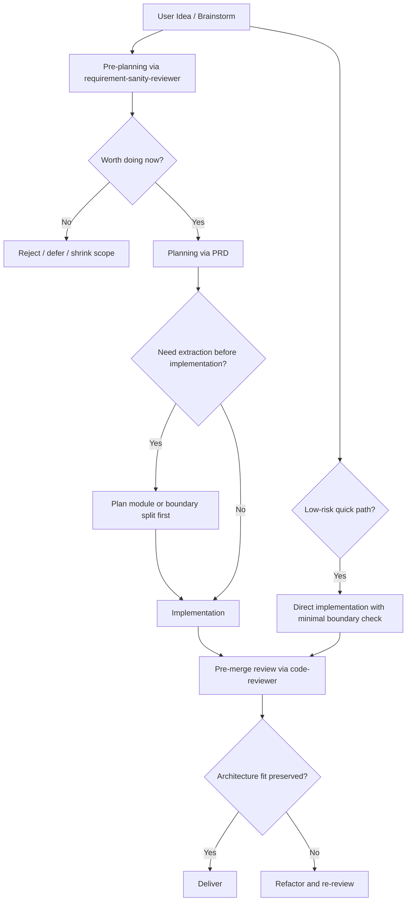

# PRD: AI Coding Architecture Guardrails

## 1. Introduction & Goals

当前仓库已经有四层架构、skill lifecycle、PRD、review skill 等治理规则，但脑暴型需求仍可能未经必要性筛选就直接进入 PRD 和实现。AI 在这种情况下会自然沿着“最快完成任务”的路径继续往已有文件追加逻辑，导致职责边界逐步失真、文件持续膨胀、修改成本上升。

本 PRD 的目标是把“泼冷水”和“架构落点判断”前移到 planning 之前与 planning 阶段本身：先由 `requirement-sanity-reviewer` 判断想法是否值得做，再由 `prd` 只为通过筛选的需求收敛最小改动方案和职责边界，减少 AI 直接把脑暴想法实现为长期结构负担的概率。

### Measurable Objectives
- 脑暴型需求默认先经过必要性审查，而不是直接进入 PRD。
- 为低风险、小范围改动保留清晰的快速路径，避免所有需求都走完整流程。
- `prd` 只处理已经通过 sanity check 的需求，并明确职责落点与最小改动边界。
- `prd` 必须在有真实路径分歧时做架构比较，而不是为了模板要求制造假比较。
- 当改动会把不同职责继续塞进同一文件时，implementation 和 review 都能据 PRD 明确拒绝直接追加。

---

## 2. Requirement Shape

- Actor: 仓库维护者，以及在本仓库内执行 planning 和 implementation 的 AI 编码代理。
- Trigger: 用户提出一个新想法、脑暴方向或潜在需求，准备进入规划与实现流程时。
- Expected behavior: 脑暴型需求必须先经过 `requirement-sanity-reviewer` 判断是否值得做；只有通过筛选的需求才进入 `prd`。低风险、小范围改动可按明确标准走快速路径。`prd` 必须明确职责落点、最小改动路径，并且只在存在真实方案分歧时进行架构比较，同时明确何时必须先拆模块再实现。
- Scope boundary: 本 PRD 只定义仓库内的需求筛选、规划守门与配套 review 对齐，不引入新的运行时服务、模型能力或自动重写系统。

---

## 3. Repository Context And Architecture Fit

- Existing path: `AGENTS.md` 定义了 AI 开发约束，`docs/architecture/system-design.md` 定义了四层边界，`docs/guides/skill-lifecycle.md` 定义了 planning/implementation/review 生命周期，`skills/requirement-sanity-reviewer/SKILL.md` 已负责前置需求审查，`skills/prd/SKILL.md` 已负责规划阶段，`skills/code-reviewer/SKILL.md` 负责合并前审查闸门。
- Reuse candidates:
  - `AGENTS.md`
  - `docs/architecture/system-design.md`
  - `docs/guides/skill-lifecycle.md`
  - `skills/requirement-sanity-reviewer/SKILL.md`
  - `skills/prd/SKILL.md`
  - `skills/code-reviewer/SKILL.md`
- Architecture pattern to preserve: 继续沿用现有四层架构和单阶段单主 skill 策略，不新增并行治理层。
- Constraints:
  - 不能把治理问题变成新的重型运行时机制。
  - 不能破坏现有 phase map，但可以把 brainstorming 更明确地前置到 `requirement-sanity-reviewer`。
  - 不能让所有细小改动都被迫走完整 brainstorming -> sanity -> PRD 流程。
  - 文档是产品的一部分，规则变更需要同步到 docs。
- Redundancy risks:
  - 把“需求值不值得做”完全塞给 `prd`，会让 `prd` 与 `requirement-sanity-reviewer` 职责重叠。
  - 额外新增一个“architecture-reviewer”类长期 skill，会与 `prd` 和 `code-reviewer` 发生职责重叠。
  - 新增独立 lint/agent orchestration 子系统会超出当前问题规模。

---

## 4. Options And Recommendation

### Option A: Minimal Change
- Approach: 调整 skill lifecycle 和 planning 规则，要求脑暴型需求先经过 `requirement-sanity-reviewer`，通过后才进入 `prd`；为低风险改动定义快速路径；同时让 `prd` 明确承担职责落点、架构方案比较和“为什么不能继续堆到原文件”的规划义务，再由 implementation 和 `code-reviewer` 执行与兜底。
- Pros:
  - 直接复用现有治理入口，不新增新的长期主 skill。
  - 把问题前移到“要不要做”和“怎么落边界”两个阶段，而不是等实现后才发现。
  - 与当前仓库的 skill lifecycle 一致。
- Cons:
  - 仍然主要依赖流程纪律和 skill 说明质量，自动化约束较弱。
  - 需要认真定义快速路径边界，否则容易重新滑回“什么都直接做”。

### Option B: Heavier Change
- Approach: 新增独立的 architecture-review skill、文件复杂度扫描器或实现前强制分析器，把每次 AI 改动都串入新的专用阶段，或让 `prd` 直接兼任需求劝退与方案设计双重职责。
- Pros:
  - 形式上更强制，理论上更容易统一执行。
  - 可以进一步自动化复杂度判断。
- Cons:
  - 会引入新的阶段和职责重叠。
  - 与“一个阶段只允许一个主 skill”的仓库策略冲突风险较高。
  - 为当前问题引入了过重治理结构。

### Recommendation
- Recommended option: A
- Why: 当前问题首先是脑暴想法未经筛选就进入规划与实现，其次才是实现期继续堆代码。最小改动是把“需求必要性判断”和“边界落点判断”前移并写清，而不是再造一个新 skill。
- Why: 当前问题首先是脑暴想法未经筛选就进入规划与实现，其次才是实现期继续堆代码。最小改动是把“需求必要性判断”和“边界落点判断”前移并写清，同时保留小改动快速路径，而不是再造一个新 skill。
- Rejected redundancy: 不新增独立 `architecture-reviewer`，也不让 `prd` 吞掉完整的需求劝退职责，避免与 `requirement-sanity-reviewer`、`code-reviewer` 重叠。

---

## 5. Implementation Guide

### 5.1 Core Logic

- 在 `docs/guides/skill-lifecycle.md` 中明确默认入口：
  - 脑暴、模糊想法、冲动型需求先进入 `requirement-sanity-reviewer`
  - 只有通过必要性筛选的需求才进入 `prd`
  - 为低风险、小范围、单边界改动定义可跳过完整 PRD 的快速路径标准
- 在 `skills/requirement-sanity-reviewer/SKILL.md` 中加强“泼冷水”职责：
  - 判断需求是否只是短期补偿性修补
  - 判断不做会怎样
  - 判断是否只是为 AI 的局部实现习惯擦屁股
  - 输出“建议不做/延后/缩小范围”的能力
- 在 `skills/prd/SKILL.md` 中收紧 planning 职责：
  - `prd` 不是默认起点
  - `prd` 只处理通过 sanity check 的需求
  - `prd` 只在存在真实方案分歧时显式比较最小改动与更重架构方案
  - 若现有路径明显足够，`prd` 必须说明为什么无需正式方案比较
  - `prd` 必须回答为什么现在值得做，而不是仅回答怎么做
  - `prd` 必须显式回答为什么不能继续向现有大文件追加逻辑
  - `prd` 必须写清是否需要先拆模块再实现
- 在 `AGENTS.md` 和相关架构文档中补充实现期约束：
  - implementation 不得绕过 PRD 中已经做出的边界决策
  - 不允许仅因“最小 diff”而继续扩大单文件职责
- 在 `skills/code-reviewer/SKILL.md` 中增加兜底检查：
  - 是否跳过了需求必要性筛选
  - 是否违背了 PRD 中的职责落点与拆分要求
  - 是否继续向已混合职责的大文件追加逻辑

### 5.2 Change Matrix

| Change Target | Current State | Target State | How to Modify | Why This Fits Existing Architecture | Affected Files |
|---|---|---|---|---|---|
| Idea intake lifecycle | 脑暴型需求容易直接进入 PRD 或实现，细小改动也缺少明确分流标准 | 脑暴型需求默认先经过 sanity review，低风险改动可走快速路径 | 在 lifecycle 文档中补充默认入口、快速路径和转阶段条件 | 利用现有 phase，不新增新阶段 | `docs/guides/skill-lifecycle.md` |
| Requirement sanity gate | 当前已强调需求审查，但“劝退无必要需求”还不够锋利 | 明确承担泼冷水、缩范围、建议不做的职责 | 在 `requirement-sanity-reviewer` 中补充检查项和输出格式 | 复用现有 pre-planning 主 skill | `skills/requirement-sanity-reviewer/SKILL.md` |
| PRD boundary planning | 当前 PRD 偏重方案收敛，但未明确前提、条件化架构比较和反追加约束 | `prd` 只处理通过筛选的需求，并强制写职责落点、按需架构比较与先拆后做判断 | 在 `skills/prd/SKILL.md` 中增加前提和必答区块 | 保持 planning 仍由 `prd` 主导 | `skills/prd/SKILL.md` |
| AI implementation instructions | 当前强调架构优先，但 implementation 仍可能绕过前置判断 | 实现期必须遵守前置 PRD 边界决定 | 在 `AGENTS.md` 增加执行约束 | 复用现有主入口，不新增并行治理层 | `AGENTS.md` |
| Pre-merge review gate | 当前 review 还未显式检查是否跳过前置筛选与 PRD 边界 | 把绕过 sanity/PRD 决策视为显式 review 风险 | 在 `skills/code-reviewer/SKILL.md` 增加具体检查项 | 保持 pre-merge review 仍由单一主 skill 负责 | `skills/code-reviewer/SKILL.md` |

### 5.3 Flow Or Architecture Diagram

### 5.4 Low-Fidelity Prototype (Only When Required)

- No low-fidelity prototype required for this PRD.

### 5.5 ER Diagram (Only When Data Model Changes)

- No data model changes in this PRD.

### 5.6 Affected Files

| File | Change Type | Description |
|---|---|---|
| `docs/guides/skill-lifecycle.md` | Modify | 明确脑暴需求先走 sanity review，并定义快速路径 |
| `skills/requirement-sanity-reviewer/SKILL.md` | Modify | 强化“泼冷水”和需求劝退职责 |
| `skills/prd/SKILL.md` | Modify | 收紧 PRD 前提，增加条件触发的架构方案比较、职责落点与先拆后做要求 |
| `AGENTS.md` | Modify | 增加 implementation 必须遵守前置边界决策的约束 |
| `skills/code-reviewer/SKILL.md` | Modify | 增加对跳过 sanity/PRD 决策的 review gate |

### 5.7 Interactive Prototype Change Log (Only When Files Actually Changed)

- No interactive prototype file changes in this PRD.

### 5.8 External Validation (Only When Web Research Was Used)

- No external validation required; repository evidence was sufficient.

---

## 6. Definition Of Done

- [ ] `docs/guides/skill-lifecycle.md` 已明确脑暴需求默认先进入 `requirement-sanity-reviewer`
- [ ] `docs/guides/skill-lifecycle.md` 已定义哪些低风险改动可以走快速路径
- [ ] `skills/requirement-sanity-reviewer/SKILL.md` 已明确承担需求必要性筛选与劝退职责
- [ ] `skills/prd/SKILL.md` 已明确 PRD 的前提是需求先通过 sanity check
- [ ] `skills/prd/SKILL.md` 已把架构方案比较改为条件触发，而不是模板化强制比较
- [ ] `skills/prd/SKILL.md` 已要求写清职责落点以及是否必须先拆模块再实现
- [ ] `AGENTS.md` 已要求 implementation 遵守前置 PRD 边界决策
- [ ] `skills/code-reviewer/SKILL.md` 已把绕过 sanity/PRD 决策视为显式审查项
- [ ] `uv run mkdocs build` 通过
- [ ] 修改后的规则未引入新的长期 skill 重叠

---

## 7. User Stories

### US-001: Filter Low-Value Brainstormed Requests Before PRD
**Description:** As a repository maintainer, I want brainstorming ideas to be challenged before they become planned work, so that the team does not spend time formalizing unnecessary or compensatory changes.

**Acceptance Criteria:**
- [ ] 脑暴型需求默认先经过 sanity review
- [ ] 审查结果可以明确建议“不做 / 延后 / 缩小范围”

### US-002: Force PRD To Make Boundary Decisions
**Description:** As a planner, I want PRDs to explicitly decide where a change belongs, whether it is worth doing now, and whether extraction is required first, so that implementation does not default to patching large mixed-responsibility files or inventing fake design comparisons.

**Acceptance Criteria:**
- [ ] `prd` 必须写清职责落点
- [ ] 只有在存在真实分歧时，`prd` 才比较最小改动方案与更重架构方案
- [ ] 如果不需要正式比较，`prd` 必须说明为什么现有路径足够
- [ ] `prd` 必须回答为什么不能继续向原有大文件追加

### US-003: Preserve A Fast Path For Small Changes
**Description:** As a maintainer, I want low-risk changes to avoid unnecessary planning overhead, so that the governance process does not become so heavy that people bypass it.

**Acceptance Criteria:**
- [ ] 生命周期文档明确列出快速路径条件
- [ ] 快速路径仍要求最小边界检查，而不是完全跳过架构思考

### US-004: Review Deviations From Pre-Planning And PRD Decisions
**Description:** As a reviewer, I want pre-merge review to catch cases where implementation bypassed requirement filtering or ignored PRD boundary decisions, so that AI-generated code does not silently erode architecture boundaries.

**Acceptance Criteria:**
- [ ] Review 规则明确包含跳过 sanity review / 偏离 PRD 决策的检查
- [ ] 审查输出能把这类问题作为高优先级交付风险提出

---

## 8. Functional Requirements

- FR-1: Brainstormed or weakly-formed requests MUST pass through `requirement-sanity-reviewer` before entering `prd`.
- FR-2: `requirement-sanity-reviewer` MUST be able to recommend rejecting, deferring, or narrowing a request when the change is unnecessary or compensatory.
- FR-3: The lifecycle MUST define a quick path for low-risk, small-scope, single-boundary changes.
- FR-4: The quick path MUST still require a minimal architecture/boundary check.
- FR-5: `prd` MUST explicitly document the architecture boundary where the change belongs.
- FR-6: `prd` MUST compare a minimal-change option and a heavier option only when a real architecture branch or meaningful alternative exists.
- FR-7: When no real branch exists, `prd` MUST explicitly state why the existing path is sufficient and why no formal option comparison is needed.
- FR-8: `prd` MUST explicitly state whether implementation may extend an existing file directly or must first extract a module/boundary.
- FR-9: AI implementation guidance MUST require adherence to the boundary decisions made in PRD.
- FR-10: Pre-merge review MUST treat bypassing sanity review or violating PRD boundary decisions as an explicit review concern.

---

## 9. Non-Goals

- 不在本 PRD 中引入新的运行时 agent orchestration 机制。
- 不在本 PRD 中实现自动重构器或全仓复杂度扫描平台。
- 不在本 PRD 中新增独立的长期 architecture-review skill。
- 不让 `prd` 完整吞并 `requirement-sanity-reviewer` 的前置劝退职责。
- 不要求所有微小改动都强制编写完整 PRD。

---

## 10. Risks And Follow-Ups

- 即使增加了前置筛选，如果 `requirement-sanity-reviewer` 的输出不够锋利，脑暴需求仍可能被“温和通过”。
- 如果快速路径定义不够严格，团队可能会把大量本应进入 sanity/PRD 的需求伪装成“小改动”绕过前置判断。
- 如果 `prd` 只复述需求而不真正做边界判断，implementation 仍会回到按最近文件补丁式追加的路径。
- 如果 `prd` 的方案比较触发条件写得不清楚，它仍可能为了满足模板而制造无意义的假比较。
- 如果 `prd` 在存在真实分歧时仍不做架构比较，可能会把本应拆分的改动继续压进旧边界。
- 如果后续多次验证发现现有 guardrails 不足，再评估是否增加轻量自动化检查，但应优先避免新增 phase。
- 需要后续通过真实改动案例验证这些 guardrails 是否足够具体，不然仍可能被 AI 用宽泛解释绕过。

---

## 11. Decision Log

每条记录对应本 PRD 中做出的一个关键决策，归档后作为永久参考。

| # | 决策问题 | 选择 | 放弃的方案 | 理由 |
|---|---|---|---|---|
| D-01 | 脑暴型需求应先进入哪个阶段 | `requirement-sanity-reviewer` | 直接进入 `prd` | 先判断值不值得做，再判断怎么做，更符合当前问题本质 |
| D-02 | 是否所有需求都必须走完整 sanity + PRD 流程 | 否，为低风险小改动保留快速路径 | 所有需求一律走完整流程 | 否则流程摩擦过大，最终会促使团队绕过治理 |
| D-03 | `prd` 是否承担完整的需求劝退职责 | 否，只承担通过筛选后的方案收敛与架构边界决策 | 让 `prd` 同时负责劝退和规划 | 这样可以避免 `prd` 与 `requirement-sanity-reviewer` 职责重叠 |
| D-04 | `prd` 应该如何处理架构方案比较 | 仅在存在真实分歧时做正式比较 | 每次都强制写 Option A/B | 没有真实分歧时强行比较只会制造低信息量文书劳动 |
| D-05 | 如何约束 AI 继续向职责混合文件堆代码 | 由 sanity review 前置筛选，PRD 明确边界，implementation 遵守，review 兜底 | 新增独立 architecture-review skill | 当前仓库已有足够治理载体，缺的是前置判断和明确边界语言 |
| D-06 | 由哪个阶段承担这类交付风险的最终拦截 | `code-reviewer` 作为 pre-merge review 主 gate | 新增第二个 reviewer skill | 仓库已明确 pre-merge review 只保留一个主 skill |
