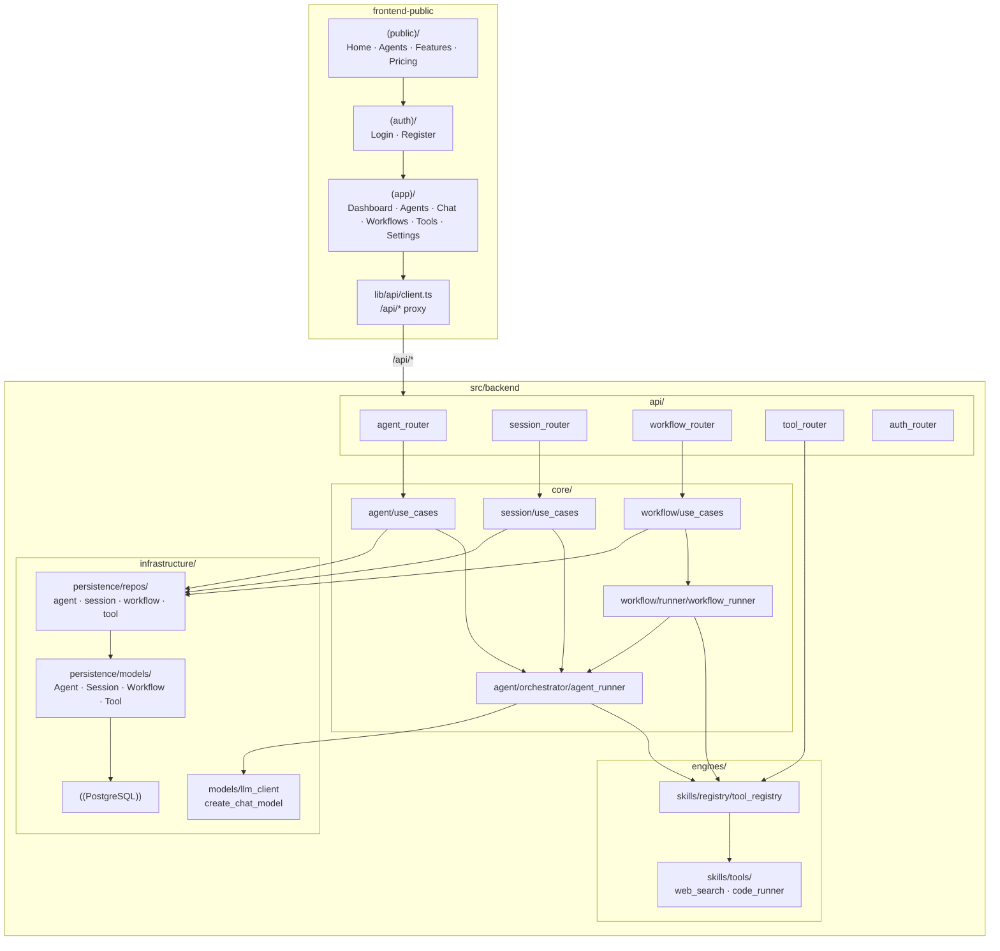
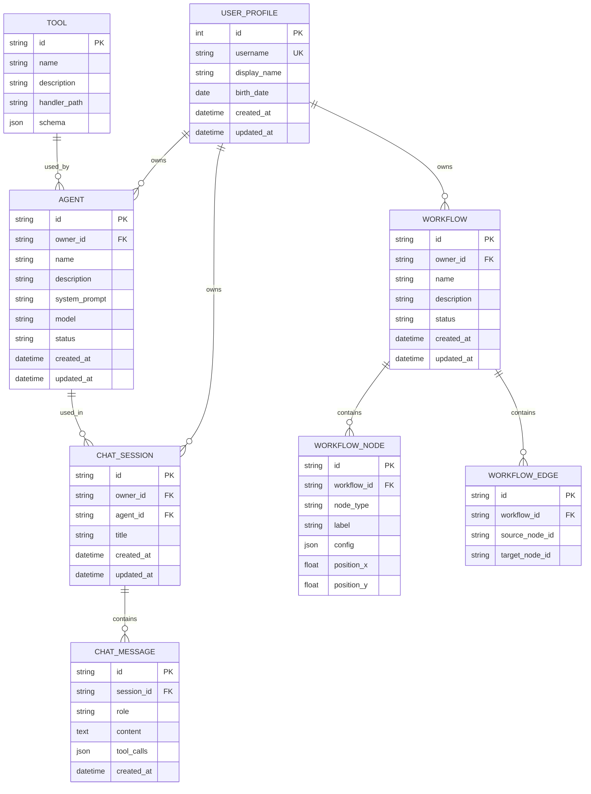

# PRD: 将 frontend-public 改造为 Zata Agent 平台

> 本 PRD 分两个 altitude：**Part A · 人审层**（决定该不该做、做得对不对，含介入与风险地图）;**Part B · 执行器层**（实现细节，人只在风险地图点名处下钻）。

---

# Part A · 人审层 (Review Layer)

## 1. Introduction & Goals

### Problem Statement

当前 `frontend-public/` 是一个通用 SaaS 前台官网（项目/任务协作方向），营销页、应用区路由和组件都围绕「团队协作」设计。随着产品定位转向 **AI Agent Platform**，现有页面、文案、路由和应用内工作区已无法承载「Agent 广场、Agent 配置、多轮会话、工具调用、工作流编排」等核心能力。同时，后端目前仅提供认证 API，缺少 Agent、会话、工作流的真实数据接口，无法支撑前端直接对接真实 API 的目标。

### Interpretation (解读回显)

我把需求读成：**把 frontend-public 从"团队协作官网"改造成"Agent 平台"，且前端直接对接后端真实 API（非 mock）**——因此后端要同步新建 Agent/会话/工作流/工具的真实接口。假设范围限 `frontend-public/` + `src/backend/` 内新增模块，不动 `frontend-admin/`、不引独立服务/端口;LLM 真实调用为可选（结构必须真、执行可 mock 开关）。如果你其实只想前端换皮、后端留到下一阶段，这条解读就是错的——请在此纠正（第一次人类触点）。

### What The User Gets

访问者在营销页 5 秒内理解「Zata Agent Platform」定位;登录开发者进入 Agent 工作区，完成「创建 Agent → 配置模型/工具 → 发起会话 → 观察工具调用过程 → 可视化编排并运行工作流」的完整闭环，数据全部通过真实后端 API 持久化（非 mock）。

### Measurable Objectives

- 营销首页在 5 秒内让访问者理解「Zata Agent Platform」定位（Hero 文案 + 动效）。
- 登录用户可在应用区内完成「创建 Agent → 配置模型/工具 → 发起会话 → 查看工具调用过程」的完整闭环。
- 工作流编辑器支持：添加节点、连接边、删除节点/边、保存/读取工作流、运行工作流（至少触发并返回运行状态）。
- 后端 API 覆盖 Agent CRUD、Session CRUD、Message CRUD、Workflow CRUD、Tool 列表，且通过真实 HTTP 入口可验证。
- `pnpm build`（前端）和 `pytest tests/`（后端）均通过，无新增架构违规（`hooks/check_architecture.py`）。

---

## 2. Human Review Map (介入与风险地图)

默认按架构层定介入档（`api`/`infrastructure` 偏自动，`core` 偏人工），再用风险因子（不可逆性 / 影响面 / 安全·资金 / 正确性关键度）调整。本特性是全栈新平台，高风险面密集。

判定菜单：固定区域 ① Core 逻辑/编排 ② schema/迁移 ③ 安全/鉴权/信任边界 ④ 对外 API 契约;横切触发器 ⑤ 资金/计费 ⑥ 不可逆/破坏性数据操作 ⑦ 并发/幂等。

**命中的人审项**（逐条进下表，需人工确认）：①②③④⑦。

**未命中**（默认执行器 + 自动门禁）：⑤（无计费/额度逻辑，LLM 成本未计量）、⑥（仅新建表不删既有数据;删旧前端页面属代码删除非数据操作）。

- 最坏自检：⑤ 一旦将来加配额/计费即升人审;⑥ 删 tasks/projects **前**确认无生产数据依赖（最坏=误删用户数据）——本次仅删前端代码与文案、无数据迁移，故仍属未命中。

| 改动点 | 架构层 | 风险 | 介入方式 | 证据 / Oracle（可执行、能证伪本项；进 §9 证据包） |
|---|---|---|---|---|
| ① Agent/Session/Workflow 编排用例（建 Agent 规则、消息→工具/LLM 调用链、workflow runner 拓扑执行） | core | 高 | 人工确认 | characterization 测试：固定输入断言编排步骤序列与最终消息;runner 对样例图断言拓扑顺序与终止 |
| ② 7 张新表 schema + Alembic 迁移（Agent/Session/Message/Workflow/Node/Edge/Tool） | infrastructure (schema) | 高 | 人工确认 | `alembic upgrade head && alembic downgrade base` 往返通过 + 每表 round-trip 插入/读出;断言 owner_id 外键与级联（ER 见 §7.6） |
| ③ 鉴权/信任边界：所有 /api/* 写 + 敏感读校验 session cookie、按 owner 隔离（FR-15） | api/core | 高 | 人工确认 | 越权测试：无 cookie→401/403;A 用户读写 B 的资源→拒绝（每个新 router 各一条） |
| ④ 对外 API 契约：/api/agents·sessions·workflows·tools 的请求/响应 DTO（前端强耦合） | api | 中 | 人工确认 | 响应 snapshot/contract 测试 + 前端 `lib/api` 类型与同一 schema 校验一致 |
| ⑦ 消息发送 / 工作流运行的幂等性 | core | 中 | 人工确认 | 双提交测试：同一请求发两次→只产生一条消息 / 一次 LLM 调用 |
| 营销页/应用区 UI、路由、文案（(public)/(app) 改造） | frontend | 低 | 执行器+门禁 | `pnpm build` + Playwright 首页/导航断言 |
| React Flow 画布交互（拖拽/连边/保存） | frontend | 中 | 执行器+门禁 | e2e：拖拽加节点→连边→保存→刷新，断言结构还原 |
| 前端 API 客户端 `lib/api/*` + 类型同步 | frontend | 低 | 执行器+门禁 | `pnpm build`（tsc 类型）+ e2e 命中真实端点 |
| 后端四层依赖方向 | backend | 低 | 执行器+门禁 | `python hooks/check_architecture.py` |
| ORM 列/表注释 | infrastructure | 低 | 执行器+门禁 | 列注释 hook（check_schema_conventions / check_sqlalchemy_model_comments） |

**如何证明它生效（真实入口，白话）**：前后端同时跑，真人走「注册 → 建 Agent → 发消息看到工具调用 → 存工作流刷新还原」闭环;后端 `curl /api/*` 看真实数据。命令级见 §7.7。

**数据库结构评审（schema 变化，必审）**：本次新增 7 张表（Agent / ChatSession / ChatMessage / Workflow / WorkflowNode / WorkflowEdge / Tool），均以 `owner_id` 关联 `user_profile` 做按用户隔离。人审重点：owner 外键与级联、`ChatMessage.tool_calls` JSON 结构、Workflow 节点/边的引用完整性、可空性与索引。完整 ER 图见 §7.6。

---

## 3. Usage And Impact After Implementation

### 终端用户（开发者）
- 营销页 `/` 了解平台 → `/register` 注册 → 登录进入 `/app/dashboard`。
- `/app/agents` 新建/编辑 Agent（系统提示词、模型、工具）→ Agent 详情「开始会话」→ `/app/chat/[sessionId]` 多轮对话并看到 tool call 卡片。
- `/app/workflows/new` 拖拽节点编排工作流，保存后在详情页运行。

### 开发者（扩展）
- 后端按四层扩展;新增能力经 `core/shared/interfaces/` 抽象接口接入，前端统一走 `lib/api/*`。入口命令示例见 §7.7 验证表。

### 对既有行为的影响
- 删除原 tasks/projects 页面与文案;`user_profile` 表不变，新增 7 表向后兼容。
- 认证沿用现有 session cookie;LLM 调用可经 mock 开关在无 key 时验证流程。
- 不改 `frontend-admin/`。

---

## 4. Requirement Shape

- **Actor**: 访问 Zata 官网的潜在用户、已注册并登录的开发者用户。
- **Trigger**:
  - 未登录用户访问营销页或被 Agent 广场吸引。
  - 登录用户进入应用区，需要管理 Agent、进行会话、编排工作流。
- **Expected behavior**:
  - 营销页清晰展示 Agent 平台价值、预置 Agent、功能特性、定价。
  - 登录后进入 Agent 工作区，左侧导航为 Agent、会话、工作流、工具、设置。
  - 用户可创建/编辑/删除 Agent，配置系统提示词、模型、工具、知识库。
  - 用户可在会话中与 Agent 多轮对话，观察到工具调用过程和结果。
  - 用户可在可视化画布中拖拽编排工作流，保存后可在工作流详情页运行。
- **Scope boundary**:
  - 前端范围限定在 `frontend-public/`。
  - 后端范围限定在 `src/backend/` 内新增模块，不引入独立服务或新端口。
  - 不改造 `frontend-admin/`。
  - LLM 真实调用为可选，工作流节点执行可先返回 mock 结果以验证流程；但 API 结构和数据流必须支持真实 LLM/tool 调用。

---

# Part B · 执行器层 (Build Layer)

> 以下供实现者使用;人只在 Part A 风险地图点名处下钻。

## 5. Repository Context And Architecture Fit

### Current relevant modules/files

- **前端框架与入口**：
  - `frontend-public/app/layout.tsx`：根布局，含 ThemeProvider、Toaster、Geist 字体。
  - `frontend-public/app/(public)/layout.tsx` → `components/layout/public-layout.tsx` → `site-header.tsx` / `site-footer.tsx`。
  - `frontend-public/app/(app)/layout.tsx`：当前为简单顶部导航 + container 主内容。
  - `frontend-public/app/(app)/dashboard/page.tsx`：当前展示项目/任务/设置入口。
  - `frontend-public/app/globals.css`：Tailwind v4 + shadcn 主题变量。
  - `frontend-public/lib/api/client.ts`：axios 封装，`/api/*` 代理到后端。
  - `frontend-public/lib/api/auth.ts`：认证相关 API。
  - `frontend-public/package.json`：依赖 next 16.2.6、react 19、tailwind v4、shadcn 基础组件。

- **后端框架与入口**：
  - `src/backend/main.py`：composition root，目前仅挂载 auth_router、health_router、metrics_router。
  - `src/backend/api/auth_router.py`：认证路由，使用 HttpOnly session cookie。
  - `src/backend/api/dependencies.py`：提供 `get_auth_use_case`、`get_session_token`。
  - `src/backend/api/schemas.py`：当前只有 Login/Register/UserSession DTO。
  - `src/backend/core/agent/`：已存在空目录（`__init__.py`、`planner/`、`orchestrator/`、`memory/`），可作为本次 Agent 核心模块起点。
  - `src/backend/infrastructure/persistence/database.py`：SQLAlchemy engine、SessionLocal、Alembic 迁移入口。
  - `src/backend/infrastructure/persistence/models/base.py`：`TimestampMixin`。
  - `src/backend/infrastructure/persistence/models/user_profile.py`：示例 UserProfile 模型。
  - `src/backend/infrastructure/config/settings.py`：配置与 `create_chat_model` 工厂。

- **基础设施**：
  - Alembic 已配置，但 `alembic/versions/` 为空（只有 `.gitkeep`）。
  - 数据库使用 PostgreSQL（默认配置），开发可用 `DATABASE_URL` 指向本地或 SQLite。
  - 后端测试在 `tests/` 目录。

### Existing architecture pattern to follow

- 后端四层依赖方向：`src/backend/api/ → src/backend/core/ → src/backend/engines/ → src/backend/infrastructure/`。
- `api/` 只做 HTTP 适配、DTO 校验、调用 core 用例。
- `core/` 包含用例、领域模型、抽象接口，不依赖具体 SDK/数据库。
- `engines/` 实现 core 定义的端口，如 skill registry、tool registry。
- `infrastructure/` 包含 ORM 模型、repository 实现、LLM 客户端、配置。
- 跨层依赖必须通过 `src/backend/core/shared/interfaces/` 中的抽象接口。
- 前端通过 `/api/*` 与后端通信，遵循 Next.js 16 App Router 约定。

### Ownership and dependency boundaries

- `frontend-public/` 是独立前端，不受后端四层约束，但所有后端调用必须走 `lib/api/*`。
- 后端新增模块必须遵守 `hooks/check_architecture.py` 的依赖方向检查。
- 数据库模型与 Alembic 迁移由基础设施层拥有。
- LLM 调用由 `infrastructure/config/settings.py` 的 `create_chat_model` 工厂提供，core 层通过接口调用。

### Constraints from runtime, docs, tests, or workflows

- `frontend-public/AGENTS.md` 提醒：Next.js 16 有重大变更，编码前需查阅 `node_modules/next/dist/docs/` 的相关指南。
- `docs/ai-standards/code-reuse.md`：新增代码前先搜索现有实现，禁止复制粘贴后微调；参数超过 4 个时收敛到对象。
- `docs/ai-standards/naming.md`：命名必须有来源、类型或状态语义，避免 `data`、`item`、`res`。
- `docs/ai-standards/testing.md`：改动 API/前端流程/持久化时必须写真实入口验证。
- `hooks/check_architecture.py`：会检查后端模块间 import 方向。
- `hooks/check_schema_conventions.py`：所有 ORM 列必须带 `comment=`。
- pre-commit 会检查文件行数（单文件非空行不超过 1000 行）。

### Matching or related PRDs

- `tasks/pending/P2-FEAT-20260610-000000-prd-skill-multi-mode-optimization.md`：与本次任务无关，无依赖或冲突。
- `tasks/archive/` 中无与本任务直接相关的已归档 PRD。
- 结论：本 PRD 独立创建，无需更新现有 pending PRD。

---

## 6. Recommendation

### Proposed Solution Summary (实现机制)

前后端同步的一站式改造：
- **前端**：保留 `(public)` 营销壳与 `(auth)` 认证壳，把 `(app)` 改造成 Agent 工作区;新增 Agent 广场/详情/编辑、会话聊天、可视化工作流编辑器、工具管理;更新设计 Token、文案、导航。
- **后端**：按四层（`api/ → core/ → engines/ → infrastructure/`）新增 Agent / ChatSession / Message / Workflow / ToolRegistry 模块;SQLAlchemy + Alembic 持久化;FastAPI 暴露 `/api/agents·sessions·workflows·tools`。
- **可视化工作流**：前端 `@xyflow/react` 可拖拽画布;后端持久化节点（Agent/Tool/Condition/Start/End）与边。
- **核心机制**：前端经 `lib/api/client.ts` 调后端 REST;core 编排业务规则;infrastructure 提供仓库与 LLM 客户端;engines 提供工具注册表供 core 调用。

### Recommended Approach

采用**前后端同步的一站式改造**，一次性达到目标态：

1. **前端**：
   - 更新 `globals.css` 设计 Token，引入 Agent 平台科技感（深色可用、violet/cyan/emerald 强调色）。
   - 重写 `(public)` 营销页：首页 Hero、Agent 广场、功能、定价、FAQ。
   - 改造 `(app)` 应用区：新增 `AppShell` + `Sidebar` 布局，替换旧 dashboard/tasks/projects。
   - 新增 Agent、会话聊天、工作流编辑器页面。
   - 引入 `@xyflow/react` 实现可视化工作流画布。
   - 新增 `lib/types/` 和 `lib/api/` 下 agents/sessions/workflows/tools 模块。

2. **后端**：
   - 在 `src/backend/core/shared/interfaces/` 定义 `AgentRepository`、`SessionRepository`、`WorkflowRepository`、`ToolRegistry` 等抽象接口。
   - 在 `src/backend/core/` 实现 Agent/Session/Workflow 用例和领域模型。
   - 在 `src/backend/engines/skills/registry/` 扩展为工具注册表，提供工具元数据。
   - 在 `src/backend/infrastructure/persistence/models/` 新增 SQLAlchemy 模型：`AgentModel`、`SessionModel`、`MessageModel`、`WorkflowModel`、`WorkflowNodeModel`、`WorkflowEdgeModel`、`ToolModel`。
   - 在 `src/backend/infrastructure/persistence/repos/` 实现 repository。
   - 在 `src/backend/api/` 新增 routers：`agent_router.py`、`session_router.py`、`workflow_router.py`、`tool_router.py`，以及对应的 Pydantic schemas。
   - 在 `src/backend/main.py` 挂载新 routers，注入 repository 和 use case 实例到 `app.state`。
   - 新增 Alembic 迁移脚本，创建对应表。

### Why this is the best fit for the current architecture

- 直接复用已有的认证、配置、数据库、LLM 工厂基础设施，不引入新服务或端口。
- 按四层架构扩展，与仓库设计意图一致，避免未来重构。
- 前端在现有 Next.js 16 + shadcn/ui 基础上改造，不替换技术栈。
- 一次性达到目标态，避免先 mock 再替换的二次返工。

### Rationale for rejecting redundant abstractions

- 不新建独立的「Agent 服务」或「Workflow 服务」：仓库采用模块化单体，独立服务违反现有架构约束。
- 不新建前端状态管理库：优先使用 React Server Component + Server Actions + 局部 context，必要时再用 zustand。
- 不重复封装 axios：直接使用 `lib/api/client.ts` 和已存在的错误处理模式。

### Alternatives Considered

- **Alternative A：前端先用 mock 数据，后端后续单独做**
  - Why not chosen：用户明确要求直接对接真实 API，且 mock 数据后续替换成本高，会造成前端组件和 API 层二次调整。
- **Alternative B：工作流第一版先用列表 + 表单**
  - Why not chosen：用户明确要求可视化节点画布；React Flow 与 Next.js 16 兼容，可直接引入。
- **Alternative C：在后端引入 LangGraph 等外部编排框架**
  - Why not chosen：增加外部依赖和学习成本；当前 core/agent 目录已为编排层预留，先自研轻量编排更符合「可替换实现」原则。

---

## 7. Implementation Guide

> This section is a living implementation guide based on current repository analysis. If implementation discovers additional affected files, hidden dependencies, edge cases, or a better path, update this PRD before proceeding.

### 7.1 Core Logic

#### 前端数据流

1. 用户访问营销页或应用区页面。
2. 应用区页面通过 `useEffect` 或 Server Component 调用 `lib/api/auth.ts` 的 `getCurrentSession()` 校验登录态；未登录重定向到 `/login`。
3. 已登录页面调用 `lib/api/agents.ts`、`lib/api/sessions.ts`、`lib/api/workflows.ts`、`lib/api/tools.ts` 与后端通信。
4. axios client 发送请求到 `/api/*`，Next.js dev server 通过 `next.config.ts` 的 rewrites 代理到 `http://localhost:8000`。
5. 后端 FastAPI 路由接收请求，校验 session cookie，调用 core 用例。
6. core 用例调用 repository（基础设施实现）或 tool registry（engines 实现）完成业务逻辑。
7. 结果沿原路返回，前端更新 UI。

#### 后端数据流

1. `api/` routers 接收 HTTP 请求，用 Pydantic schemas 校验，从 `request.app.state` 获取 use case / repository 实例。
2. `core/` use cases 执行业务规则（如：创建 Agent 时必须指定模型；发送消息时调用 Agent 编排器生成回复）。
3. `core/agent/orchestrator/` 负责 Agent 执行：读取 Agent 配置 → 调用 tool registry → 调用 LLM → 生成回复和 tool calls。
4. `engines/skills/registry/` 提供可用工具列表和执行入口。
5. `infrastructure/persistence/repos/` 实现数据持久化。
6. `infrastructure/config/settings.py` 的 `create_chat_model` 提供 LLM 客户端实例。

### 7.2 Change Impact Tree

```text
.
├── frontend-public/
│   ├── app/
│   │   ├── layout.tsx
│   │   │   [修改]
│   │   │   【总结】更新 metadata 标题/描述为 Agent 平台
│   │   │
│   │   ├── globals.css
│   │   │   [修改]
│   │   │   【总结】调整 light/dark 主题变量，强化科技感强调色
│   │   │
│   │   ├── (public)/
│   │   │   ├── page.tsx
│   │   │   │   [重写]
│   │   │   │   【总结】改造为 Agent 平台首页 Hero + 能力展示 + CTA
│   │   │   │
│   │   │   ├── agents/
│   │   │   │   └── page.tsx
│   │   │   │       [新增]
│   │   │   │       【总结】Agent 广场/市场页面，展示预置与公开 Agent
│   │   │   │
│   │   │   ├── features/page.tsx
│   │   │   │   [重写]
│   │   │   │   【总结】功能特性页聚焦 Agent、工具、工作流
│   │   │   │
│   │   │   ├── pricing/page.tsx
│   │   │   │   [重写]
│   │   │   │   【总结】定价页适配 Agent 用量模型
│   │   │   │
│   │   │   ├── about/page.tsx
│   │   │   │   [重写]
│   │   │   │   【总结】关于页更新为 Agent 平台愿景
│   │   │   │
│   │   │   └── layout.tsx
│   │   │       [修改]
│   │   │       【总结】更新 SiteHeader 导航项
│   │   │
│   │   ├── (app)/
│   │   │   ├── layout.tsx
│   │   │   │   [重写]
│   │   │   │   【总结】改造为 AppShell + Sidebar 工作区布局
│   │   │   │
│   │   │   ├── dashboard/page.tsx
│   │   │   │   [重写]
│   │   │   │   【总结】工作区首页：最近会话、我的 Agent、运行统计
│   │   │   │
│   │   │   ├── agents/
│   │   │   │   ├── page.tsx
│   │   │   │   │   [新增]
│   │   │   │   │   【总结】我的 Agent 列表页
│   │   │   │   │
│   │   │   │   ├── [id]/page.tsx
│   │   │   │   │   [新增]
│   │   │   │   │   【总结】Agent 详情页，可发起会话
│   │   │   │   │
│   │   │   │   ├── [id]/edit/page.tsx
│   │   │   │   │   [新增]
│   │   │   │   │   【总结】Agent 编辑页
│   │   │   │   │
│   │   │   │   └── new/page.tsx
│   │   │   │       [新增]
│   │   │   │       【总结】创建 Agent 页
│   │   │   │
│   │   │   ├── chat/
│   │   │   │   ├── page.tsx
│   │   │   │   │   [新增]
│   │   │   │   │   【总结】会话中心列表页
│   │   │   │   │
│   │   │   │   └── [sessionId]/page.tsx
│   │   │   │       [新增]
│   │   │   │       【总结】单会话聊天页
│   │   │   │
│   │   │   ├── workflows/
│   │   │   │   ├── page.tsx
│   │   │   │   │   [新增]
│   │   │   │   │   【总结】工作流列表页
│   │   │   │   │
│   │   │   │   ├── [id]/page.tsx
│   │   │   │   │   [新增]
│   │   │   │   │   【总结】工作流详情/运行页
│   │   │   │   │
│   │   │   │   ├── [id]/edit/page.tsx
│   │   │   │   │   [新增]
│   │   │   │   │   【总结】可视化工作流编辑器
│   │   │   │   │
│   │   │   │   └── new/page.tsx
│   │   │   │       [新增]
│   │   │   │       【总结】创建工作流页
│   │   │   │
│   │   │   ├── tools/page.tsx
│   │   │   │   [新增]
│   │   │   │   【总结】工具/插件管理页
│   │   │   │
│   │   │   ├── settings/page.tsx
│   │   │   │   [重写]
│   │   │   │   【总结】用户设置页适配 Agent 平台
│   │   │   │
│   │   │   ├── tasks/page.tsx
│   │   │   │   [删除]
│   │   │   │   【总结】原任务页不再符合 Agent 平台定位
│   │   │   │
│   │   │   └── projects/page.tsx
│   │   │       [删除]
│   │   │       【总结】原项目页不再符合 Agent 平台定位
│   │   │
│   │   └── (auth)/
│   │       └── layout.tsx
│   │           [修改（可选）]
│   │           【总结】如需要可同步认证页背景风格
│   │
│   ├── components/
│   │   ├── layout/
│   │   │   ├── site-header.tsx
│   │   │   │   [重写]
│   │   │   │   【总结】更新导航为 Agent 平台菜单
│   │   │   │
│   │   │   ├── site-footer.tsx
│   │   │   │   [重写]
│   │   │   │   【总结】更新页脚链接与文案
│   │   │   │
│   │   │   ├── app-shell.tsx
│   │   │   │   [新增]
│   │   │   │   【总结】应用区整体框架（侧边栏 + 主内容）
│   │   │   │
│   │   │   └── app-sidebar.tsx
│   │   │       [新增]
│   │   │       【总结】应用区侧边栏导航
│   │   │
│   │   ├── agent/
│   │   │   ├── agent-card.tsx
│   │   │   │   [新增]
│   │   │   │   【总结】Agent 展示卡片
│   │   │   │
│   │   │   ├── agent-status-badge.tsx
│   │   │   │   [新增]
│   │   │   │   【总结】Agent 状态徽章
│   │   │   │
│   │   │   ├── agent-form.tsx
│   │   │   │   [新增]
│   │   │   │   【总结】Agent 创建/编辑表单
│   │   │   │
│   │   │   └── model-selector.tsx
│   │   │       [新增]
│   │   │       【总结】模型选择器
│   │   │
│   │   ├── chat/
│   │   │   ├── chat-layout.tsx
│   │   │   │   [新增]
│   │   │   │   【总结】聊天界面布局
│   │   │   │
│   │   │   ├── chat-message.tsx
│   │   │   │   [新增]
│   │   │   │   【总结】单条消息气泡
│   │   │   │
│   │   │   ├── chat-input.tsx
│   │   │   │   [新增]
│   │   │   │   【总结】聊天输入框
│   │   │   │
│   │   │   ├── tool-call-card.tsx
│   │   │   │   [新增]
│   │   │   │   【总结】工具调用过程卡片
│   │   │   │
│   │   │   └── session-list.tsx
│   │   │       [新增]
│   │   │       【总结】会话历史列表
│   │   │
│   │   └── workflow/
│   │       ├── workflow-canvas.tsx
│   │       │   [新增]
│   │       │   【总结】React Flow 可视化画布封装
│   │       │
│   │       ├── workflow-node.tsx
│   │       │   [新增]
│   │       │   【总结】可拖拽节点组件
│   │       │
│   │       └── workflow-toolbar.tsx
│   │           [新增]
│   │           【总结】工作流工具栏
│   │
│   ├── lib/
│   │   ├── types/
│   │   │   ├── agent.ts
│   │   │   │   [新增]
│   │   │   │   【总结】Agent 相关 TypeScript 类型
│   │   │   │
│   │   │   ├── session.ts
│   │   │   │   [新增]
│   │   │   │   【总结】会话/消息类型
│   │   │   │
│   │   │   ├── workflow.ts
│   │   │   │   [新增]
│   │   │   │   【总结】工作流/节点/边类型
│   │   │   │
│   │   │   └── tool.ts
│   │   │       [新增]
│   │   │       【总结】工具类型
│   │   │
│   │   └── api/
│   │       ├── agents.ts
│   │       │   [新增]
│   │       │   【总结】Agent API 调用
│   │       │
│   │       ├── sessions.ts
│   │       │   [新增]
│   │       │   【总结】会话/消息 API 调用
│   │       │
│   │       ├── workflows.ts
│   │       │   [新增]
│   │       │   【总结】工作流 API 调用
│   │       │
│   │       └── tools.ts
│   │           [新增]
│   │           【总结】工具 API 调用
│   │
│   └── package.json
│       [修改]
│       【总结】新增 @xyflow/react 依赖
│
├── src/backend/
│   ├── main.py
│   │   [修改]
│   │   【总结】挂载 agents/sessions/workflows/tools routers，注入 repository/use case
│   │
│   ├── api/
│   │   ├── dependencies.py
│   │   │   [修改]
│   │   │   【总结】新增 get_agent_repository、get_session_repository、get_workflow_repository、get_tool_registry、get_current_user 等依赖
│   │   │
│   │   ├── schemas.py
│   │   │   [修改]
│   │   │   【总结】新增 Agent/Session/Message/Workflow/Tool DTOs
│   │   │
│   │   ├── agent_router.py
│   │   │   [新增]
│   │   │   【总结】Agent CRUD HTTP 路由
│   │   │
│   │   ├── session_router.py
│   │   │   [新增]
│   │   │   【总结】Session/Message HTTP 路由
│   │   │
│   │   ├── workflow_router.py
│   │   │   [新增]
│   │   │   【总结】Workflow CRUD + run HTTP 路由
│   │   │
│   │   └── tool_router.py
│   │       [新增]
│   │       【总结】Tool 列表 HTTP 路由
│   │
│   ├── core/
│   │   ├── shared/interfaces/
│   │   │   ├── agent_repository.py
│   │   │   │   [新增]
│   │   │   │   【总结】Agent Repository 抽象接口
│   │   │   │
│   │   │   ├── session_repository.py
│   │   │   │   [新增]
│   │   │   │   【总结】Session/Message Repository 抽象接口
│   │   │   │
│   │   │   ├── workflow_repository.py
│   │   │   │   [新增]
│   │   │   │   【总结】Workflow Repository 抽象接口
│   │   │   │
│   │   │   ├── tool_registry.py
│   │   │   │   [新增]
│   │   │   │   【总结】Tool Registry 抽象接口
│   │   │   │
│   │   │   └── llm_client.py
│   │   │       [新增]
│   │   │       【总结】LLM Client 抽象接口
│   │   │
│   │   ├── agent/
│   │   │   ├── models.py
│   │   │   │   [新增]
│   │   │   │   【总结】Agent 领域模型（纯 Python dataclass）
│   │   │   │
│   │   │   ├── use_cases.py
│   │   │   │   [新增]
│   │   │   │   【总结】Agent 用例（CRUD + run）
│   │   │   │
│   │   │   ├── orchestrator/
│   │   │   │   └── agent_runner.py
│   │   │   │       [新增]
│   │   │   │       【总结】Agent 执行编排器
│   │   │   │
│   │   │   └── planner/
│   │   │       └── step_planner.py
│   │   │           [新增]
│   │   │           【总结】可选：步骤规划器（MVP 可简化）
│   │   │
│   │   ├── session/
│   │   │   ├── models.py
│   │   │   │   [新增]
│   │   │   │   【总结】Session/Message 领域模型
│   │   │   │
│   │   │   └── use_cases.py
│   │   │       [新增]
│   │   │       【总结】会话用例（CRUD + 发送消息）
│   │   │
│   │   └── workflow/
│   │       ├── models.py
│   │       │   [新增]
│   │       │   【总结】Workflow/Node/Edge 领域模型
│   │       │
│   │       ├── use_cases.py
│   │       │   [新增]
│   │       │   【总结】工作流用例（CRUD + run）
│   │       │
│   │       └── runner/
│   │           └── workflow_runner.py
│   │               [新增]
│   │               【总结】工作流执行器
│   │
│   ├── engines/
│   │   └── skills/
│   │       ├── registry/
│   │       │   └── tool_registry.py
│   │       │       [新增]
│   │       │       【总结】工具注册表实现
│   │       │
│   │       └── tools/
│   │           ├── web_search.py
│   │           │   [新增]
│   │           │   【总结】示例工具：网页搜索（mock 实现）
│   │           │
│   │           └── code_runner.py
│   │               [新增]
│   │               【总结】示例工具：代码执行（mock 实现）
│   │
│   └── infrastructure/
│       ├── persistence/
│       │   ├── models/
│       │   │   ├── agent.py
│       │   │   │   [新增]
│       │   │   │   【总结】Agent ORM 模型
│       │   │   │
│       │   │   ├── session.py
│       │   │   │   [新增]
│       │   │   │   【总结】Session/Message ORM 模型
│       │   │   │
│       │   │   ├── workflow.py
│       │   │   │   [新增]
│       │   │   │   【总结】Workflow/Node/Edge ORM 模型
│       │   │   │
│       │   │   ├── tool.py
│       │   │   │   [新增]
│       │   │   │   【总结】Tool ORM 模型（可用预置种子数据）
│       │   │   │
│       │   │   └── __init__.py
│       │   │       [修改]
│       │   │       【总结】导入新增模型，使其被 Alembic 发现
│       │   │
│       │   └── repos/
│       │       ├── agent_repo.py
│       │       │   [新增]
│       │       │   【总结】Agent Repository SQLAlchemy 实现
│       │       │
│       │       ├── session_repo.py
│       │       │   [新增]
│       │       │   【总结】Session Repository SQLAlchemy 实现
│       │       │
│       │       ├── workflow_repo.py
│       │       │   [新增]
│       │       │   【总结】Workflow Repository SQLAlchemy 实现
│       │       │
│       │       └── tool_repo.py
│       │           [新增]
│       │           【总结】Tool Repository SQLAlchemy 实现
│       │
│       └── models/
│           └── llm_client.py
│               [新增]
│               【总结】基于 create_chat_model 的 LLM Client 基础设施实现
│
├── alembic/versions/
│   └── 20260625_105550_agent_platform_init.py
│       [新增]
│       【总结】创建 agent/session/message/workflow/tool 表
│
├── tests/
│   ├── backend/
│   │   ├── test_agents.py
│   │   │   [新增]
│   │   │   【总结】Agent API/用例测试
│   │   │
│   │   ├── test_sessions.py
│   │   │   [新增]
│   │   │   【总结】Session/Message API/用例测试
│   │   │
│   │   └── test_workflows.py
│   │       [新增]
│   │       【总结】Workflow API/用例测试
│   │
│   └── playwright-e2e/
│       └── agent-platform.spec.ts
│           [新增]
│           【总结】端到端：注册 → 创建 Agent → 发送消息 → 保存工作流
│
└── docs/
    └── architecture/
        └── frontend-architecture.md
            [新增或更新]
            【总结】补充 frontend-public 应用区架构说明
```

### 7.3 Executor Drift Guard

The file list above is the expected implementation surface from current repository analysis. During implementation, treat it as a starting point and use these repository searches to catch hidden references or drift before marking the PRD complete.

| Check | Command | Expected Result | If It Fails, Inspect First |
|---|---|---|---|
| 旧路由引用 | `rg -n "/app/(tasks\|projects)" frontend-public/` | 无引用或引用已更新 | `frontend-public/app/(app)/dashboard/page.tsx`、`components/layout/app-sidebar.tsx` |
| 旧营销文案 | `rg -n "团队协作\|项目管理" frontend-public/` | 无残留或仅历史无关文件 | 营销页、SiteHeader、SiteFooter |
| 后端路由挂载 | `rg -n "include_router" src/backend/main.py` | 包含新 routers | `src/backend/main.py` 是否遗漏挂载 |
| 模型导入 | `rg -n "AgentModel\|SessionModel\|WorkflowModel" src/backend/infrastructure/persistence/models/__init__.py` | 命中导入行 | Alembic autogenerate 是否能看到新表 |
| 架构违规 | `python hooks/check_architecture.py` | 通过 | 检查是否有 api/ 直接导入 infrastructure/ 等反向依赖 |
| 前端 API 代理 | `rg -n "rewrites" frontend-public/next.config.ts` | 命中 `/api/:path*` 规则 | 开发时前端请求无法到达后端 |

### 7.4 Flow / Architecture Diagram



### 7.5 Low-Fidelity Prototype

#### 应用区布局

```text
+--------------------------------------------------+
|  ≡  Zata Agent Platform    [通知] [用户头像 ▼]   |
+----------+---------------------------------------+
| Dashboard|                                       |
| Agents   |  [Page Title]        [Primary Button] |
| Chat     |                                       |
| Workflows|  +---------------------------------+  |
| Tools    |  |                                 |  |
| Settings |  |        Main Content Area        |  |
|          |  |                                 |  |
|          |  +---------------------------------+  |
+----------+---------------------------------------+
```

#### 会话聊天页

```text
+----------+---------------------------------------+
| Sessions |  Agent: Code Reviewer                 |
| ───────  |  ───────────────────────────────────  |
| Session1 |  User: 帮我检查这段代码               |
| Session2 |  AI:   好的，我将使用 code_runner...  |
| Session3 |        [▶ 运行 code_runner]           |
|          |        → 结果：无语法错误             |
|          |                                       |
|          |  [输入消息...] [工具] [发送]          |
+----------+---------------------------------------+
```

#### 工作流编辑器

```text
+--------------------------------------------------+
|  Workflow: Onboarding           [保存] [运行]    |
+--------------------------------------------------+
|                                                  |
|   [Start] ──► [Agent: Greeter] ──► [Tool: Search]| |
|                          │                       |
|                          ▼                       |
|                   [Condition] ──► [End]          |
|                                                  |
|  [节点面板]  [Agent] [Tool] [Condition] [End]    |
+--------------------------------------------------+
```

### 7.6 ER Diagram



### 7.7 Realistic Validation Plan

| Behavior | Real Entry Point | Test Layer | Mock Boundary | Data/Env Needed | Command Or Procedure | Required For Acceptance |
|---|---|---|---|---|---|---|
| 后端服务启动并暴露新 API | `python -m backend.main` | smoke | 无 | PostgreSQL 或 SQLite（`DATABASE_URL`） | `curl -s http://localhost:8000/api/agents` 返回列表（空数组或预置数据） | Yes |
| Agent CRUD | HTTP API `/api/agents` | integration | 数据库真实；LLM 不触发 | 已登录用户的 session cookie | `curl -X POST -b session_id=... -H "Content-Type: application/json" -d '{"name":"Tester","system_prompt":"You are a tester.","model":"openai/gpt-4o-mini"}' http://localhost:8000/api/agents` | Yes |
| 会话消息发送 | HTTP API `/api/sessions/:id/messages` | integration | LLM 返回 mock 结果 | 已创建的 Agent 和 Session | `curl -X POST .../api/sessions/{session_id}/messages -d '{"content":"hello"}'` 返回 assistant 回复 | Yes |
| 工作流保存与读取 | HTTP API `/api/workflows` | integration | 数据库真实 | 已登录用户 | POST 创建 → GET 读取 → 验证 nodes/edges 结构一致 | Yes |
| 前端营销页渲染 | `pnpm dev` 浏览器 | e2e | 无 | 前端 dev server | 访问 `http://localhost:3000/`，确认 Hero 文案含「Agent Platform」 | Yes |
| 前端应用区登录后访问 | `pnpm dev` + `python -m backend.main` | e2e | 无 | 前后端同时运行 | Playwright 跑 `tests/playwright-e2e/agent-platform.spec.ts` | Yes |
| 可视化工作流画布 | `pnpm dev` 浏览器 | e2e | 后端真实或 mock | 前端 dev server | 访问 `/app/workflows/new`，拖拽添加节点，保存后刷新结构不变 | Yes |

Failure triage:
- 如果后端启动失败，先检查 `DATABASE_URL` 和 Alembic 迁移是否已运行。
- 如果前端请求 404，检查 `next.config.ts` 的 rewrites 和后端 router 是否已挂载。
- 如果架构检查失败，检查新模块 import 方向是否违反四层规则。
- 如果 LLM 调用失败（非必须阻塞项），确认 `config.toml` 中 `[providers]` 配置和对应环境变量存在；可先用 mock 工具返回验证流程。

### 7.8 Interactive Prototype Change Log

No interactive prototype file changes in this PRD.

### 7.9 External Validation

No external validation required; repository evidence was sufficient.

---

## 8. Delivery Dependencies

- Group: frontend-public-agent-platform
- Depends on groups:
  - none
- Depends on tasks/issues:
  - none（`tasks/pending/P2-FEAT-20260610-000000-prd-skill-multi-mode-optimization.md` 与本任务无关，无依赖）
- Gate type: none
- Notes: 本 PRD 同时涉及 frontend-public 前端改造和 src/backend 后端新增模块，但无外部服务依赖。LLM 调用为可选能力，工作流运行可先用 mock tool 返回验证流程。

---

## 9. Acceptance Checklist

这是「人只看一次」的终点交付物：按 §2 风险地图排序的验收证据包，每项带证据（命令输出 / 观察 / 工件），不是裸勾。

### Acceptance Evidence Package（证据包 · 按风险地图排序）

1. **高风险 oracle 结果（置顶）**：① 编排 characterization、② `alembic up/down` 往返、③ 越权 401/403、④ 契约 snapshot、⑦ 双提交幂等 —— 全绿输出。
2. **风险地图对账 Predicted → Reconciled**：实现中是否冒出未预测的高风险面（如新加计费、删了数据），如何处理。
3. **对抗自检**：⑤⑥ 两个未命中项的最坏情况复核结论。
4. **对锁定契约的 diff**：/api/* DTO 与前端 `lib/api` 类型 vs 前置约定;schema vs ER。
5. **低风险门禁（折叠）**：`pnpm build`、`pytest`、`check_architecture`、Playwright e2e。

### Human-Confirmed（来自 §2 风险地图）

- [ ] ① core 编排用例（Agent/Session/Workflow）业务规则经人工确认（发消息鉴权+owner 校验、编排器调用顺序、workflow runner 终止/错误处理）。
- [ ] ② 7 张新表 schema + Alembic 迁移经人工确认（关系/外键/可空性/索引、owner 隔离、revision 不冲突;ER 见 §2 与 §7.6）。
- [ ] ③ 鉴权/信任边界经人工确认（所有 /api/* 写 + 敏感读校验 session cookie、防 owner 越权;FR-15）。
- [ ] ④ 对外 API 契约（/api/agents·sessions·workflows·tools 的 DTO）经人工确认并与前端类型同步。
- [ ] ⑦ 消息发送/工作流运行的幂等性经人工确认（重复提交不产生重复消息/重复 LLM 花费）。

### Delivery Readiness（原 Definition Of Done）

- [ ] 前端营销页和应用区所有目标页面实现并可通过 `pnpm build`。
- [ ] 后端新增 Agent/Session/Workflow/Tool 模块实现并通过 `pytest tests/backend/`。
- [ ] Alembic 迁移脚本可成功创建所有新表。
- [ ] 前后端同时运行时，前端可完成注册、登录、创建 Agent、发送消息、保存工作流的完整闭环。
- [ ] `hooks/check_architecture.py` 无新增架构违规。
- [ ] 相关文档（如 `frontend-public/README.md`、`docs/architecture/frontend-architecture.md`）已更新。
- [ ] 所有 Acceptance Checklist 条目完成。

### Architecture Acceptance

- [ ] 后端新增模块严格遵循 `api/ → core/ → engines/ → infrastructure/` 依赖方向。
- [ ] `src/backend/api/` 不直接导入 `src/backend/infrastructure/` 或 `src/backend/engines/` 的具体实现。
- [ ] `src/backend/core/shared/interfaces/` 已定义 Agent/Session/Workflow/Tool/LLM 抽象接口。
- [ ] `src/backend/infrastructure/persistence/models/__init__.py` 已导入新增 ORM 模型，Alembic 可发现。
- [ ] 前端 API 调用统一走 `lib/api/client.ts`，不直接引入 axios 新实例。

### Dependency Acceptance

- [ ] `frontend-public/package.json` 已添加 `@xyflow/react` 依赖并可 `pnpm install` 成功。
- [ ] 后端无新增不必要的外部依赖（LLM 调用复用 `langchain_openai`，数据库复用 SQLAlchemy）。
- [ ] `src/backend/main.py` 已正确注入并挂载所有新 routers。

### Behavior Acceptance

- [ ] 访问 `http://localhost:3000/` 显示 Agent 平台首页，导航包含「Agent 广场」。
- [ ] 注册/登录后可进入 `/app/dashboard`，侧边栏包含 Dashboard、Agents、Chat、Workflows、Tools、Settings。
- [ ] `/app/agents` 可创建 Agent，`/app/agents/[id]/edit` 可编辑 Agent。
- [ ] `/app/chat/[sessionId]` 可发送消息并观察到 assistant 回复与 tool call 卡片。
- [ ] `/app/workflows/new` 可拖拽添加节点、连接边、保存工作流；刷新后结构还原。
- [ ] `/app/tools` 展示可用工具列表。
- [ ] 后端 `/api/agents`、`/api/sessions`、`/api/workflows`、`/api/tools` 返回真实数据。

### Documentation Acceptance

- [ ] `frontend-public/README.md` 已更新为 Agent 平台相关描述和路由结构。
- [ ] 如 `docs/architecture/frontend-architecture.md` 存在，已补充 frontend-public 应用区说明。
- [ ] 新增公共 API/组件的 TypeScript 类型和函数已添加注释。

### Validation Acceptance

- [ ] `pnpm build`（在 `frontend-public/` 下）成功通过，无 TS 错误。
- [ ] `python -m backend.main` 启动成功，`curl http://localhost:8000/api/agents` 返回 JSON 数组。
- [ ] `pytest tests/backend/test_agents.py tests/backend/test_sessions.py tests/backend/test_workflows.py` 通过。
- [ ] `python hooks/check_architecture.py` 通过。
- [ ] Playwright E2E `tests/playwright-e2e/agent-platform.spec.ts` 通过（至少覆盖注册 → 创建 Agent → 发送消息）。
- [ ] `rg -n "/app/(tasks|projects)" frontend-public/` 无残留引用。

---

## 10. Functional Requirements

- **FR-1**: 营销首页须明确传达「Zata Agent Platform」定位，Hero 区包含 Agent 平台主标语、核心能力 CTA、动态光晕或渐变视觉。
- **FR-2**: `SiteHeader` 须包含「Agent 广场、功能、定价、文档、关于」导航，未登录用户可见登录/注册入口。
- **FR-3**: 应用区须使用 `AppShell` + `Sidebar` 布局，左侧导航包含 Dashboard、Agents、Chat、Workflows、Tools、Settings。
- **FR-4**: Agent 列表页须展示用户创建的所有 Agent，包含名称、描述、状态、最近更新时间，并支持新建 Agent。
- **FR-5**: Agent 创建/编辑页须支持配置：名称、描述、系统提示词、模型（下拉选择）、工具（多选）、知识库（可选，MVP 仅 UI 占位）。
- **FR-6**: Agent 详情页须展示 Agent 配置摘要，并提供「开始会话」按钮，点击后跳转会话页。
- **FR-7**: 会话聊天页须支持：消息列表、用户输入、assistant 回复、tool call 过程卡片（展开/折叠）、会话标题编辑。
- **FR-8**: 后端 Agent API 须支持：创建、读取、更新、删除 Agent，以及根据 owner 过滤列表。
- **FR-9**: 后端 Session API 须支持：创建会话、读取会话列表、读取会话消息、发送消息并生成 assistant 回复。
- **FR-10**: 发送消息时，后端 Agent 编排器须根据 Agent 配置调用工具注册表和 LLM，返回 assistant 消息及 tool calls（MVP 可用 mock 工具结果）。
- **FR-11**: 后端 Workflow API 须支持：创建、读取、更新、删除工作流，工作流包含 nodes 和 edges。
- **FR-12**: 工作流编辑器须基于 React Flow 实现：拖拽节点面板、画布添加/删除节点、连接边、节点配置侧边栏、保存/运行按钮。
- **FR-13**: 工作流运行器须按节点拓扑顺序执行，调用对应 Agent/Tool，返回运行结果（MVP 可用 mock 执行）。
- **FR-14**: 后端 Tool API 须返回可用工具列表（名称、描述、参数 schema）。
- **FR-15**: 认证保护：所有 `/api/agents`、`/api/sessions`、`/api/workflows`、`/api/tools` 写操作和敏感读操作须校验 session cookie。

---

## 11. Non-Goals

- 不改造 `frontend-admin/`。
- 不引入第三方认证（OAuth、SSO），继续使用现有 session cookie 认证。
- 不实现真实 LLM 流式输出（SSE）的 MVP；assistant 回复可一次性返回，流式作为后续优化。
- 不实现知识库文件上传的真实存储；MVP 仅保留 UI 占位，后续接入 RAG。
- 不实现工作流条件节点的复杂表达式引擎；MVP 条件节点可用固定规则或 mock。
- 不实现多用户共享 Agent/工作流；MVP 按 owner 隔离。
- 不实现生产级权限角色；MVP 仅区分登录/未登录。

---

## 12. Risks And Follow-Ups

- **Risk**: 工作流可视化编辑器引入 `@xyflow/react` 后可能与 Next.js 16 / React 19 存在兼容性问题。
  - Mitigation: 优先使用最新稳定版 `@xyflow/react`，在 SSR 场景使用 `"use client"` 包裹画布组件，必要时动态导入。
- **Risk**: LLM 调用需要真实 provider 配置，开发环境可能缺失 API key，导致消息发送失败。
  - Mitigation: 在 orchestrator 中提供 `MOCK_LLM_RESPONSE` 环境变量开关，无 key 时返回 mock 回复，确保流程可验证。
- **Risk**: 同时开发前后端范围较大，可能超时会话。
  - Mitigation: 按「后端 API → 前端页面 → 工作流编辑器 → E2E 测试」分阶段交付，优先保证核心闭环可用。
- **Risk**: 数据库迁移脚本在已有数据环境运行时可能冲突。
  - Mitigation: 本次为新表创建，不影响已有 `user_profile`；迁移脚本使用独立 revision id，并在本地/CI 验证。
- **Follow-Up**: 流式输出（SSE）优化。
- **Follow-Up**: 真实 RAG 知识库接入。
- **Follow-Up**: Agent 广场支持社区/公开 Agent 发布与订阅。

---

## 13. Decision Log

| # | 决策问题 | 选择 | 放弃的方案 | 理由 |
|---|---|---|---|---|
| D-01 | 是否同时开发前后端？ | 是，按四层架构同步开发 | 前端先用 mock 数据 | 用户明确要求直接对接真实 API，且避免二次返工 |
| D-02 | 工作流编辑器第一版是否做可视化画布？ | 是，引入 `@xyflow/react` | 先用列表 + 表单 | 用户明确要求可视化节点画布，React Flow 与当前栈兼容 |
| D-03 | Agent 执行是否使用外部编排框架（如 LangGraph）？ | 否，基于现有 core/agent 目录自研轻量编排器 | 引入 LangGraph | 降低外部依赖，保持四层架构内可替换实现 |
| D-04 | LLM 调用在 MVP 是否必须真实？ | 结构必须真实，执行可用 mock 开关 | 完全移除 LLM 调用或强制真实调用 | 开发环境可能无 API key，mock 开关保证流程可验证 |
| D-05 | 知识库文件上传在 MVP 是否实现？ | 否，仅 UI 占位 | 实现真实上传与 RAG | 超出核心闭环范围，后续单独迭代 |
| D-06 | 是否保留原 tasks/projects 页面？ | 否，删除 | 保留并改文案 | 与 Agent 平台定位冲突，避免残留旧概念 |
| D-07 | 前端状态管理是否引入 zustand？ | 否，优先用 RSC + Server Actions + 局部 context | 引入 zustand | 当前复杂度不需要全局状态库，减少依赖 |
