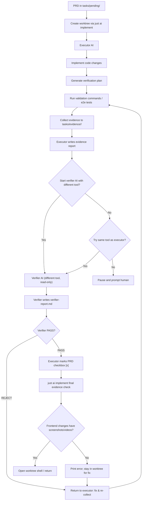

# PRD: AI 自验证与强制证据包

> 本 PRD 分两个 altitude，分别服务不同读者，自上而下阅读：
>
> - **Part A · 人审层 (Review Layer)** — 需求方 / 验收人读这部分，决定"该不该做、做得对不对"，并通过风险地图知道**哪些地方必须亲自确认**。Part A 不出现实现机制、文件路径、命令。
> - **Part B · 执行器层 (Build Layer)** — 实现者（人或 Agent）读这部分动手。人只在 Part A 风险地图**点名处**下钻审查，其余默认交执行器 + 自动门禁（hook / 测试 / 架构检查）。

---

# Part A · 人审层 (Review Layer)

## 1. Introduction & Goals

### Problem Statement

当前 `just ai implement` 执行 PRD 时，Agent 可以在没有真实验证的情况下把 Acceptance Checklist 全部勾选。这导致了一个反复出现的交付缺口：代码"看起来正确"、checkbox 全满，但真实运行时行为并未被验证。最近的典型例子是前端 CJK PDF 渲染修复——Agent 声称已验证字体数据链路，但实际打开审阅页面后中文仍然无法显示。问题在最终人工测试时才暴露，浪费了往返时间，也削弱了 PRD 验收清单的可信度。

### Interpretation (解读回显)

本次需求被理解为：**在不替换现有 PRD Acceptance Checklist 的前提下，为 `just ai implement` 增加一层强制性的证据与审查流程**。Agent 必须先为每条验收项生成可复现的验证计划、收集真实证据（命令输出、截图、录屏），然后由一个**独立的 verifier Agent** 审查证据与 PRD 验收项的匹配度；verifier 通过并确认前端视觉证据存在后，executor 才能把 PRD 中的 checkbox 标记为完成。若 verifier 发现问题，流程返回 executor 修复并重新收集证据，形成循环。verifier 默认使用与 executor **不同的 AI 工具**（例如 executor 用 Claude，verifier 用 Kimi）；若该工具不可用，再尝试与 executor 相同的工具；若相同工具也不可用，则判定为用量/配额/API 问题，流程暂停并提示人工处理。前端用户可见改动必须附带浏览器级截图或录屏证据。本 PRD **不是**要取消人类的最终审查，而是让人从"重新跑所有验证"降级为"在 Agent 审查通过后再抽查证据包"。

### What The User Gets

- 任何通过 `just ai implement` 完成的 PRD，工作树内都会留下一份结构化的证据包：验证计划、每条验收项对应的命令输出或浏览器截图/录屏、以及 verifier Agent 的审查结论。
- 如果 PRD 涉及前端用户可见改动，证据包里必然包含 Playwright e2e 产生的截图或录屏，证明真实浏览器里呈现出了预期内容。
- `just ai implement` 会进入 executor 与 verifier 的循环：executor 实现代码并收集证据；verifier 独立审查证据；verifier 发现问题则返回 executor 修复；verifier 通过且前端视觉证据齐全后，executor 才能把 PRD 标记为完成。
- 验收人只需要打开证据包，按风险地图顺序抽查关键证据，而不需要从零开始复跑整个验证流程。

### Measurable Objectives

- AI 标记 PRD Acceptance Checklist 为 `[x]` 之前，必须存在对应证据文件和 verifier Agent 的审查结论；verifier 默认使用与 executor 不同的 AI 工具，不同工具不可用则尝试相同工具，相同工具也不可用时暂停等待人工。
- 涉及 `frontend-admin/` 或 `frontend-public/` 的改动，证据包中必须至少包含一个 `.png`、`.jpg` 或 `.webm` 文件。
- `just ai implement` 对前端改动缺失视觉证据的拦截率达到 100%（即：未附带截图/录屏的前端 PRD 不能被 Agent 标记为完成）。
- 验收人抽查关键证据所需时间从"重新跑完整验证"缩短到"查看已收集的证据文件"。

---

## 2. Human Review Map (介入与风险地图)

判定菜单（逐项对照本次改动是否命中）：

- 固定区域：① Core 业务逻辑 / 编排规则（`core/`）② 数据库结构 / schema / 迁移（即使在 `infrastructure/`）③ 安全 / 鉴权 / 信任边界 ④ 对外 API 契约 / breaking change
- 横切触发器（命中即升级，无视所在层）：⑤ 资金 / 计费 / 额度 ⑥ 不可逆 / 破坏性数据操作（批量删除、回填、降级迁移）⑦ 并发 / 事务 / 幂等性

**命中的人审项**：

- 无命中。本次改动属于工具链 / 流程规范层，不触碰业务 core、schema、安全边界或对外 API 契约。

**未命中**（默认执行器 + 自动门禁）：

- ①②③④⑤⑥⑦ 均不涉及。
- 最坏自检：若 `just ai implement` 的收尾检查写错，可能误拦或漏拦；该风险由实现后的 smoke 测试和本地验证覆盖。

| 改动点 | 架构层 | 风险 | 介入方式 | 证据 / Oracle（指向 §7.6 oracle 块的 rv-id） |
|---|---|---|---|---|
| `just ai implement` 默认 prompt 与证据流程 | tooling | 中 | 执行器 + 自动门禁 | rv-1, rv-2 |
| 证据目录结构与命名约定 | tooling | 低 | 执行器 + 自动门禁 | rv-1 |
| 前端改动强制 e2e 截图/录屏 | tooling | 中 | 执行器 + 自动门禁 | rv-3 |
| `just ai implement` 收尾阶段校验前端视觉证据 | tooling | 中 | 执行器 + 自动门禁 | rv-4 |
| 独立 verifier Agent 审查证据与验收项匹配度 | tooling | 中 | 执行器 + 自动门禁 | rv-5 |

**如何证明它生效（真实入口，白话）**：

- 找一个涉及前端用户可见改动的 PRD，用新流程执行 `just ai implement`，确认工作树里生成了包含截图/录屏的证据目录；观察 executor 收集证据后触发 verifier 审查；verifier 通过且前端视觉证据齐全后，PRD 的 Acceptance Checklist 才被打勾；然后构造 verifier 发现证据不足的场景，确认流程返回 executor 修复并重新进入审查循环。

**数据库结构评审**：

- 本次无数据库结构变化。

---

## 3. Usage And Impact After Implementation

### 开发者 / Developer

执行 `just ai implement <prd-file> [claude|kimi]` 后，流程分为 executor 与 verifier 两个阶段，可循环：

1. **Executor 阶段**：Agent 根据 PRD 生成验证计划，执行验证命令 / e2e 用例，把命令输出、浏览器截图或录屏保存到与 PRD 对应的证据目录，并写 evidence report 解释每条证据。
2. **Verifier 阶段**：启动一个**独立的 verifier Agent**，默认使用与 executor **不同的 AI 工具**（executor 用 Claude 则 verifier 用 Kimi，反之亦然），只读 PRD、verification plan、evidence report 和证据文件，判断每条验收项是否有充分证据支撑、前端视觉证据是否齐全。verifier 输出审查结论：通过、或列出具体问题。
3. **循环**：若 verifier 发现问题，流程返回 Executor 阶段修复并重新收集证据；循环直到 verifier 通过。
4. **Verifier 工具降级与暂停**：若 verifier 默认工具不可用，尝试使用与 executor 相同的工具；若相同工具也不可用，则判定为用量/配额/API 问题，`just ai implement` 暂停并打印明确提示，等待人工处理。
5. **完成**：verifier 通过且前端视觉证据齐全后，executor 才能把 PRD 里对应的 checkbox 标记为 `[x]`。

`just ai implement` 在 verifier 通过后会执行一次最终的 shell 级校验脚本，确保前端改动的证据目录确实包含截图或录屏；若仍缺失，流程不结束。

### 验收人 / Reviewer

终点审查时，验收人只需按风险地图顺序查看证据包：

- 高风险 oracle 的执行结果和输出；
- 前端改动的浏览器截图或录屏；
- verifier Agent 的审查结论。

不需要从零复跑所有命令，但如果对某条证据存疑，可以直接复制验证计划里的命令复现。

### Impact On Existing Behavior

- 现有 `just ai implement` 命令保留，行为增加证据收集与 verifier 审查步骤，不删除原功能。
- 旧的 PRD（没有 evidence 目录）不会被 retroactive 拦截；只有新产生或本次改动的 PRD 会被检查。
- 如果不想走证据流程（例如纯文档改动），可以在 PRD 中显式声明 `No executable behavior changes` 并提供说明，`just ai implement` 的收尾检查会跳过证据要求。

---

## 4. Requirement Shape

- **Actor**: 使用 `just ai implement` 让 AI 实现 PRD 的开发者。
- **Trigger**: 运行 `just ai implement <prd-file>` 并涉及代码改动。
- **Expected behavior**:
  - Executor Agent 生成并保存验证计划；
  - Executor Agent 执行验证并收集命令输出、截图、录屏等证据；
  - 独立 verifier Agent 审查证据与 PRD 验收项的匹配度；verifier 默认使用与 executor 不同的 AI 工具；verifier 发现的问题返回 executor 修复，形成循环；
  - Verifier Agent 默认工具不可用则尝试与 executor 相同工具；相同工具也不可用时判定为用量/配额/API 问题，`just ai implement` 暂停并提示人工，不自动回退到 executor 自检；
  - 只有 verifier 通过且前端视觉证据齐全后，才能支撑对应的 Acceptance Checklist 项被标记为完成；
  - 前端改动必须附带 e2e 截图或录屏证据；
  - `just ai implement` 在收尾阶段对缺失前端视觉证据的流程进行拦截。
- **Scope boundary**:
  - 不强制要求 AI 使用 vision 模型（但推荐）；
  - 不替代人类的最终审查，只降低复跑成本；
  - 不涉及修改 AI 模型本身的能力或权限；
  - 不自动上传或外发任何截图/录屏，所有证据保留在本地工作树。

---

# Part B · 执行器层 (Build Layer)

> 以下供实现者（人或 Agent）使用。人只在 Part A 风险地图点名处下钻审查；其余默认交执行器 + 自动门禁。

## 5. Repository Context And Architecture Fit

- **Existing path**:
  - `justfile.shared` 中的 `implement` recipe 负责把 PRD 拷入 worktree 并启动 AI 工具；
  - `scripts/shared/just/ai_run.sh` 负责把 prompt 传给 Kimi / Claude；
  - `hooks/shared/check_prd_acceptance_checklist.py` 在 pre-commit 阶段检查 PRD checkbox 是否全勾；
  - `tests/playwright-e2e/` 已配置 Playwright，支持截图与录屏。
- **Reuse candidates**:
  - `tests/playwright-e2e/playwright.config.ts` 已经配置了 `screenshot: 'only-on-failure'` 和 `video: 'retain-on-failure'`，可直接复用其输出目录；
  - `just ai implement` 的 worktree 机制；
  - `scripts/shared/just/` 目录用于放置收尾校验脚本和 verifier prompt 模板；
  - `scripts/shared/just/ai_run.sh` 可复用以启动 verifier Agent。
- **Architecture pattern to preserve**:
  - 保持四层架构（`api -> core -> engines -> infrastructure`）和前端 app 目录不变；
  - 工具链改动应局限于 `justfile.shared`、`scripts/shared/just/`、`hooks/shared/`；
  - 不改变现有 `just ai check/fix/commit/push/tag` 子命令的行为。
- **Frontend impact**:
  - 无用户可见前端改动。本次改动仅影响 AI 实现 PRD 时的内部流程与门禁。
- **Existing PRD relationship**:
  - `tasks/pending/` 下现有 3 个 PRD，均与本 PRD 主题无关；
  - `tasks/archive/` 中 `P2-REFACTOR-20260605-181245-justfile-shared-private-split.md` 等涉及 justfile 改动的 PRD 可作为参考，但非依赖；
  - 本 PRD 与现有 pending PRD 无阻塞、依赖或重复关系，可独立实施。
- **Redundancy risks**:
  - 避免与 PRD 的 `Realistic Validation Plan` 重复定义 oracle；验证计划应引用 PRD 中已有的 `rv-id`，而不是另起一套；
  - 避免创建与 Playwright 报告目录并行的冗余存储，证据目录应引用或软链已有产物。

---

## 6. Recommendation

### Recommended Approach

扩展 `just ai implement` 的执行流程，引入 **executor Agent + 独立 verifier Agent** 的双角色循环：executor 生成验证计划、实现代码、收集证据；verifier 默认使用与 executor 不同的 AI 工具，独立审查证据与 PRD 验收项的匹配度；verifier 发现问题则返回 executor 修复并重新审查，循环直到 verifier 通过。若 verifier 默认工具不可用，则降级到与 executor 相同工具；若相同工具也不可用，判定为用量/配额/API 问题，流程暂停并提示人工处理，不自动回退到 executor 自检。对涉及前端 app 的改动，证据必须包含 Playwright e2e 产生的截图或录屏；最终由 `just ai implement` 的 shell 级收尾校验再次确认，缺少则阻止流程结束。

### Why This Is The Best Fit

这是最小侵入的改进：

- 不改动 AI 工具调用方式，只改 `implement` recipe 的默认 prompt 和收尾流程；
- 复用已存在的 Playwright e2e 能力，不需要引入新的浏览器自动化框架；
- 独立 verifier 默认使用与 executor 不同的 AI 工具，能发现 executor 的盲点，降低"自己证明自己"的偏误；工具不可用时先降级到同工具，再不可用则暂停等待人工；
- 证据包落在 PRD 旁边，路径约定简单，便于人审和归档。

### Proposed Solution Summary (实现机制)

1. **扩展 executor 默认 prompt**：`just ai implement` 启动 executor AI 时，在默认 prompt 里追加约束：
   - 必须先写验证计划；
   - 每条 PRD 验收项必须对应一条可执行的验证命令或 e2e 用例；
   - 收集证据并写 evidence report 后，进入 verifier 审查；
   - 只有 verifier 通过后，才能把 PRD checkbox 标记为 `[x]`；
   - 前端改动必须跑 Playwright e2e 并保留截图/录屏。

2. **证据目录约定**：每个 PRD 对应一个证据目录 `tasks/evidence/<prd-basename>/`，用于存放：
   - `<prd-basename>.verification-plan.md`：Agent 生成的验证计划；
   - `<prd-basename>.evidence-report.md`：executor 对证据的解释；
   - `<prd-basename>.verifier-report.md`：verifier 的审查结论与问题清单；
   - `rv-*.log` / `rv-*.png` / `rv-*.webm`：按 `rv-id` 命名的证据文件。

3. **Playwright 截图/录屏收集**：前端改动对应的验证计划必须包含 Playwright 命令。Playwright 的 `test-results/` 和 `playwright-report/` 目录会自动生成截图/录屏；Agent 负责把与本次 PRD 相关的截图/录屏复制或软链到证据目录，并按 `rv-id` 命名。

4. **Executor 写 evidence report**：executor 在 evidence report 里逐条说明：
   - 执行了什么命令；
   - 证据文件里显示了什么；
   - 为什么这能证明验收项成立；
   - 对截图要使用 vision 能力描述画面内容。

5. **独立 verifier Agent 审查**：executor 完成后，`just ai implement` 调用 `scripts/shared/just/ai_run.sh` 启动 verifier Agent：
   - verifier 默认使用与 executor **不同的 AI 工具**（例如 executor 用 Claude，verifier 用 Kimi），使用独立的 verifier prompt 模板；
   - verifier prompt 不给修改文件权限，只读；
   - verifier 读取 PRD、verification plan、evidence report 和证据文件；
   - 对每条 `[x]` 验收项，判断证据是否充分、真实、可复现；
   - 对前端改动，确认证据目录包含截图或录屏；
   - 输出 `verifier-report.md`：列出通过项、问题项、需要补充的证据；
   - 若发现问题，verifier 报告结论为 `REJECT`，流程返回 executor 修复；循环直到 verifier 输出 `PASS`。

6. **Verifier 工具降级与暂停**：若 verifier 默认工具无法启动（如 Claude/Kimi 返回 rate-limit、quota exceeded、auth error）：
   - 第一步：尝试使用与 executor **相同的 AI 工具** 启动 verifier；
   - 第二步：若相同工具也无法启动，则判定为用量/配额/API 问题，`just ai implement` 不自动回退到 executor 自检，而是：
     - 打印清晰的暂停信息，说明两个工具均不可用；
     - 保持 worktree 状态不变，不标记 PRD checkbox；
     - 提示用户可稍后重试或手动接管验证流程。

7. **`just ai implement` 收尾校验**：新增一个校验脚本（如 `scripts/shared/just/check_prd_evidence.sh`），在 verifier 通过后调用：
   - 根据 PRD 的 Change Impact Tree 或 git diff 判断是否涉及 `frontend-admin/` / `frontend-public/`；
   - 若涉及前端改动，检查对应证据目录是否存在 `.png` / `.jpg` / `.webm`；
   - 缺失时打印错误并退出非零，阻止 `just ai implement` 结束 worktree shell；
   - 校验通过后才打开 worktree shell 或返回。

### Alternatives Considered

- **替代方案 A：在 PRD 模板里强制要求每条 checkbox 都带代码块证据**
  - 为什么不选：模板无法约束 Agent 执行行为，Agent 仍可能写一段虚假的"已执行"描述。
- **替代方案 B：仅依赖 executor 自检 + 人工抽查**
  - 为什么不选：同一个 Agent 容易对自己的证据产生确认偏误，难以发现"截错图""跑错命令"等低级错误；独立 verifier 能显著降低漏检率，而在 verifier 因外部原因不可用时暂停等待人工，比自动回退到自检更可信。
- **替代方案 C：要求所有改动（包括后端）都附带截图**
  - 为什么不选：后端 API 改动的最高保真证据是 curl / 测试输出，截图价值低且成本高；只对前端用户可见改动强制视觉证据。

---

## 7. Implementation Guide

This section is a living implementation guide based on current repository analysis. If implementation discovers additional affected files, hidden dependencies, edge cases, or a better path, update this PRD before proceeding.

### 7.1 Core Logic

当前 `just ai implement` 的简化流程：

```text
PRD 文件 → 创建 worktree → 拷贝 PRD → 启动 AI → AI 实现代码并勾选 PRD checkbox
```

目标流程：

```text
PRD 文件 → 创建 worktree → 拷贝 PRD → 启动 executor AI
  → executor 实现代码
  → executor 生成 verification plan
  → executor 执行验证命令 / e2e 用例
  → executor 收集证据到 tasks/evidence/<prd-basename>/
  → executor 写 evidence report
  → 启动 verifier AI（默认使用与 executor 不同的 AI 工具，独立上下文，只读）
      → verifier 输出 verifier-report.md：PASS 或 REJECT + 问题清单
      → 若 REJECT，返回 executor 修复并重新生成证据 / 报告
      → 循环直到 verifier PASS
  → 若 verifier 默认工具无法启动，尝试与 executor 相同工具
  → 若相同工具也无法启动，判定为用量/配额/API 问题，流程暂停并提示人工
  → executor 仅对 verifier PASS 的项勾选 PRD checkbox
  → just ai implement 收尾校验前端视觉证据（失败则阻止流程结束）
```

### 7.2 Change Impact Tree

```text
.
├── justfile.shared
│   [修改]
│   【总结】扩展 implement recipe 的默认 prompt，追加证据与 verifier 审查约束；在 AI 工具退出后 orchestrate executor-verifier 循环，并在 verifier 不可用时暂停提示人工。
│
│   ├── 修改 implement recipe 的 prompt_text，要求 executor 生成 verification plan、收集证据、进入 verifier 审查后才可勾选 checkbox
│   ├── 在 AI 工具退出后，根据证据目录状态决定启动 verifier、处理 verifier report、或在 verifier 因外部原因无法启动时暂停提示人工
│   └── 可选：新增 implement 参数或环境变量控制是否强制证据流程（默认强制）
│
├── scripts/shared/just/
│   └── ai_run.sh
│       [修改]
│       【总结】保持工具调度逻辑不变，仅确保多行 prompt 能完整传入。
│
│       └── 无需结构性改动，但需验证追加后的长 prompt 通过环境变量传递时不受截断
│
├── scripts/shared/just/
│   ├── verifier_prompt.txt
│   │   [新增]
│   │   【总结】verifier Agent 的只读 prompt 模板，要求审查 PRD 验收项与证据的匹配度。
│   │
│   │   ├── 明确 verifier 不拥有写文件权限，只能读取 PRD、verification plan、evidence report、verifier report 和证据文件
│   │   ├── 要求 verifier 逐条检查 PRD Acceptance Checklist 的证据充分性、真实性和可复现性
│   │   ├── 对前端改动，要求确认证据目录包含 `.png` / `.jpg` / `.webm`
│   │   └── 输出结论：PASS 或 REJECT + 具体问题清单
│   │
│   └── check_prd_evidence.sh
│       [新增]
│       【总结】`just ai implement` 收尾校验脚本：若 PRD 涉及前端改动，校验其证据目录包含截图或录屏。
│
│       ├── 读取 PRD 的 Change Impact Tree 或 git diff 判断是否涉及 frontend-admin/ 或 frontend-public/
│       ├── 检查对应证据目录是否存在 `.png` / `.jpg` / `.webm`
│       └── 缺失时退出非零，阻止 `just ai implement` 流程结束
│
├── tests/playwright-e2e/
│   └── playwright.config.ts
│       [修改]
│       【总结】确保失败/成功时都能产出可归档的截图或录屏。
│
│       ├── 为需要强制截图的场景新增一个 project 或配置覆盖，使 `screenshot: 'on'` 可选
│       └── 保持 `video: 'retain-on-failure'`；如需要成功时也保留视频，可调整为 `video: 'on'` 并在证据收集脚本中清理
│
├── tasks/evidence/
│   [新增目录]
│   【总结】按 PRD 文件名存放证据包的根目录，被 .gitignore 忽略或按项目策略决定是否提交。
│
│   └── <prd-basename>/
│       ├── <prd-basename>.verification-plan.md
│       ├── <prd-basename>.evidence-report.md
│       ├── <prd-basename>.verifier-report.md
│       └── rv-*.log / rv-*.png / rv-*.webm
│
├── docs/ai-standards/testing.md
│   [修改]
│   【总结】补充 AI 实现 PRD 时的证据与 verifier 审查要求。
│
│   └── 新增"AI 实现后的验证证据"小节，说明 verification plan、evidence report、前端截图的要求
│
└── AGENTS.md
    [修改]
    【总结】在 Critical Summary 或 When To Read Which Standard 中提及证据包流程。

    └── 更新"PRD 对应任务全部完成后"的条目，要求先完成证据包与 verifier 审查再归档
```

### 7.3 Executor Drift Guard

| Check | Command | Expected Result | If It Fails, Inspect First |
|---|---|---|---|
| 查找现有 just ai implement 调用点 | `rg -n "just implement" justfile.shared scripts/` | 只有 `ai` recipe 和 usage 注释引用 | 是否新增其他入口绕过了默认 prompt |
| 查找现有 PRD evidence 相关目录 | `rg -n "tasks/evidence" .` | 无旧引用，新目录不会冲突 | 是否已有同名目录或脚本 |
| 确认 Playwright 输出目录 | `rg -n "outputDir|screenshotsDir" tests/playwright-e2e/playwright.config.ts` | 存在 `outputDir` 和 `test-results/` 配置 | 路径变更会影响证据收集脚本 |
| 确认前端目录边界 | `ls frontend-admin frontend-public` | 两个目录均存在 | 如果目录名变化，hook 的正则需要同步 |

### 7.4 Flow Or Architecture Diagram



### 7.5 ER Diagram (Only When Data Model Changes)

No data model changes in this PRD.

### 7.6 Realistic Validation Plan (Oracle 块)

```yaml
- id: rv-1
  behavior: just ai implement 执行后，worktree 中生成了与 PRD 对应的 verification plan 和 evidence report
  real_entry: "cd <repo-root> && just ai implement tasks/pending/P1-FEAT-xxxxxxxx-ai-self-verify-evidence-package.md kimi"
  expected: "worktree 中 tasks/evidence/P1-FEAT-xxxxxxxx-ai-self-verify-evidence-package/ 目录存在，且包含 .verification-plan.md 和 .evidence-report.md"
  mock_boundary: "AI 工具调用本身必须真实；验证计划与报告的内容由 Agent 生成，但文件存在性由 shell/ls 确认"
  negative_control: "手动删除 evidence 目录后再次运行 implement，观察 Agent 是否因证据缺失而拒绝打勾"
  expected_fail: "PRD checkbox 保持 [ ]，evidence report 提示缺失证据"
  test_layer: smoke
  required_for_acceptance: true

- id: rv-2
  behavior: 纯后端改动可以在没有截图的情况下完成验收
  real_entry: "创建一个只修改 src/backend/api/ 的测试 PRD，运行 just ai implement"
  expected: "evidence 目录中没有 .png/.jpg/.webm，收尾校验通过，PRD checkbox 仍可被勾选"
  mock_boundary: "测试 PRD 只改后端 Python 文件，不动 frontend-*"
  negative_control: "在同一份测试 PRD 中额外修改 frontend-admin/src 下的文件，再次运行 just ai implement"
  expected_fail: "just ai implement 收尾校验报错，提示缺少前端视觉证据，流程不结束"
  test_layer: smoke
  required_for_acceptance: true

- id: rv-3
  behavior: 前端改动必须附带 Playwright e2e 截图或录屏证据
  real_entry: "cd tests/playwright-e2e && pnpm exec playwright test <relevant-test-file>"
  expected: "test-results/ 或 playwright-report/ 中产生 .png 或 .webm，并被复制/软链到 tasks/evidence/<prd-basename>/"
  mock_boundary: "浏览器必须真实渲染；PDF 或 CJK 字体链路必须真实加载，不能 mock 渲染层"
  negative_control: "把 Playwright 的 screenshot 配置设为 off，或让测试用例访问错误页面"
  expected_fail: "evidence 目录缺少视觉文件；executor evidence report 标记 rv 失败；just ai implement 收尾校验失败"
  test_layer: e2e
  required_for_acceptance: true

- id: rv-4
  behavior: just ai implement 收尾校验能正确拦截缺少前端证据的流程
  real_entry: "构造一个涉及 frontend-admin/src/ 改动但 evidence 目录缺少截图/录屏的测试 PRD，运行 just ai implement"
  expected: "AI 工具退出后，收尾校验脚本检测到缺少 .png/.jpg/.webm，以非零退出码失败，stderr 提示补充 e2e 截图或录屏"
  mock_boundary: "直接调用 scripts/shared/just/check_prd_evidence.sh <prd-path> 进行独立测试，不依赖 AI 工具"
  negative_control: "补充 screenshot 或 .webm 到 evidence 目录后再次运行 just ai implement"
  expected_fail: "收尾校验通过，worktree shell 正常打开或返回"
  test_layer: smoke
  required_for_acceptance: true

- id: rv-5
  behavior: 独立 verifier Agent 能发现 executor 证据不足的问题并返回修复
  real_entry: "构造一个 executor 把不完整证据标记为完成的测试 PRD，运行 just ai implement 并触发 verifier"
  expected: "verifier 输出 REJECT，列出证据不足的具体验收项；流程返回 executor 修复并重新进入 verifier；最终 verifier 输出 PASS"
  mock_boundary: "verifier 使用独立的 prompt 和只读权限；真实调用 ai_run.sh 启动 verifier"
  negative_control: "构造一个证据完整、验收项全部满足的测试 PRD"
  expected_fail: "verifier 输出 PASS，流程进入收尾校验"
  test_layer: smoke
  required_for_acceptance: true

- id: rv-6
  behavior: verifier 默认工具不可用时降级到与 executor 相同工具；相同工具也不可用时暂停并提示人工，不回退到 executor 自检
  real_entry: "模拟 verifier 默认工具启动失败场景（如设置一个触发 rate-limit 的 mock），运行 just ai implement"
  expected: "just ai implement 先尝试 executor 相同工具启动 verifier；若仍失败，打印暂停信息说明两个工具均不可用；worktree 保持打开或返回，PRD checkbox 不被勾选"
  mock_boundary: "人为制造 verifier 默认工具启动失败，再人为制造相同工具也失败，不测试真实 quota 耗尽"
  negative_control: "仅默认工具失败、相同工具可用时再次运行 just ai implement"
  expected_fail: "verifier 使用与 executor 相同工具正常启动并进入审查循环"
  test_layer: smoke
  required_for_acceptance: true
```

Failure triage:
- 若 rv-1 失败，先检查 `justfile.shared` 的 `implement` recipe 是否正确把新 prompt 传给 `ai_run.sh`，以及 worktree 路径生成是否一致。
- 若 rv-3 失败，先检查 Playwright 是否已安装浏览器依赖、测试用例是否命中目标页面、`outputDir` 路径是否被覆盖。
- 若 rv-4 失败，先检查 `justfile.shared` 的 `implement` recipe 是否在 AI 工具退出后正确调用了 `scripts/shared/just/check_prd_evidence.sh`，以及校验脚本对 PRD Change Impact Tree 和 git diff 的解析逻辑。
- 若 rv-5 失败，先检查 `scripts/shared/just/verifier_prompt.txt` 是否正确传递给 `ai_run.sh`、verifier 是否拥有只读上下文、以及 `verifier-report.md` 的解析逻辑。
- 若 rv-6 失败，先检查 `justfile.shared` 的 `implement` recipe 是否正确捕获了 verifier 启动失败的退出码/错误信息，以及是否在没有 verifier 通过结论时阻止了 PRD checkbox 勾选。

### 7.7 Low-Fidelity Prototype (Only When Required)

No low-fidelity prototype required for this PRD.

### 7.8 Interactive Prototype Change Log (Only When Files Actually Changed)

No interactive prototype file changes in this PRD.

### 7.9 External Validation (Only When Web Research Was Used)

No external validation required; repository evidence was sufficient.

---

## 8. Delivery Dependencies

- Group: none
- Depends on groups:
  - none
- Depends on tasks/issues:
  - none
- Gate type: none
- Notes: 本 PRD 与现有 pending PRD 无依赖关系，可独立实施。

---

## 9. Acceptance Checklist

这是「人只看一次」的交付物。按 Part A 风险地图排序组织成**验收证据包**，每项必须带证据（命令输出 / 观察 / 工件引用），不是裸勾。

### Acceptance Evidence Package（证据包 · 按风险地图排序，终点人审入口）

1. **高风险 oracle 结果**：rv-1 通过（`just ai implement` 真实执行后生成了 verification plan 和 evidence report）。
2. **风险地图对账 Predicted → Reconciled**：本次无新增人工确认项，所有改动均按 tooling 层自动门禁处理；未发现未预测的高风险面。
3. **对抗审查**：独立 verifier Agent 审查 evidence report 和证据文件，对发现的问题返回 executor 修复；对通过的项在 verifier-report.md 中给出结论。
4. **对锁定契约的 diff**：无新增对外契约或 schema，仅增加工具链内部约定。
5. **低风险门禁结果**：`just lint`、`pre-commit run --all-files` 通过。

### Human-Confirmed

- [ ] 本次无 Part A 风险地图点名的人工确认项。

### Architecture Acceptance

- [ ] `justfile.shared` 的 `implement` recipe 仅修改 prompt 与流程，未破坏 `api -> core -> engines -> infrastructure` 依赖方向。
- [ ] 新增 `just ai implement` 收尾校验脚本仅读取 PRD 与证据目录，不修改业务代码。

### Dependency Acceptance

- [ ] 未引入新的浏览器自动化框架，复用 `tests/playwright-e2e/` 的 Playwright。
- [ ] 未新增外部 AI 服务依赖。

### Behavior Acceptance

- [ ] 运行 `just ai implement` 后，worktree 中存在 `tasks/evidence/<prd-basename>/` 目录。
- [ ] 证据目录包含 `.verification-plan.md`、`.evidence-report.md` 和 `.verifier-report.md`。
- [ ] PRD Acceptance Checklist 中的 `[x]` 项均有 verifier report 中的对应引用。

### Frontend Acceptance

- [ ] 当 PRD 涉及 `frontend-admin/` 或 `frontend-public/` 改动时，证据目录包含至少一个 `.png`、`.jpg` 或 `.webm`。
- [ ] 视觉证据由 Playwright e2e 测试产生，或能追溯到 Playwright 输出目录。

### Documentation Acceptance

- [ ] `docs/ai-standards/testing.md` 更新了 AI 实现 PRD 时的证据与 verifier 审查要求。
- [ ] `AGENTS.md` 的 PRD 完成/归档流程提及了证据包要求。

### Validation Acceptance

- [ ] `just ai implement tasks/pending/P1-FEAT-xxxxxxxx-ai-self-verify-evidence-package.md` 执行成功并生成证据目录（rv-1）。
- [ ] 纯后端测试 PRD 可在无截图的情况下完成验收（rv-2）。
- [ ] 前端测试 PRD 的 e2e 用例产生截图/录屏并进入证据目录（rv-3）。
- [ ] `just ai implement` 在缺少前端视觉证据时收尾校验失败并阻止流程结束（rv-4）。
- [ ] 独立 verifier Agent 能发现证据不足并返回 executor 修复，循环后通过（rv-5）。
- [ ] verifier 因外部原因无法启动时，`just ai implement` 暂停并提示人工，不回退到 executor 自检（rv-6）。
- [ ] `just lint` 通过。
- [ ] `pre-commit run --all-files` 通过。

### Delivery Readiness

- [ ] Recommended approach fully implemented; no unapproved parallel abstraction introduced.
- [ ] No open regression or rollout blocker remains.

---

## 10. Functional Requirements

- **FR-1**: `just ai implement` 启动 executor AI 时，默认 prompt 必须明确要求其在勾选 PRD Acceptance Checklist 前，先生成 verification plan、执行验证、收集证据、进入 verifier 审查。
- **FR-2**: 每个 PRD 必须对应一个证据目录 `tasks/evidence/<prd-basename>/`，用于存放 verification plan、evidence report、verifier report 和按 `rv-id` 命名的证据文件。
- **FR-3**: Executor 必须在 evidence report 中逐条解释每条证据对应的验收项、证据内容以及为什么能证明验收项成立；对截图类证据必须描述画面内容。
- **FR-4**: 当 PRD 的改动涉及 `frontend-admin/` 或 `frontend-public/` 时，验证计划必须包含 Playwright e2e 用例，并保留产生的截图或录屏作为证据。
- **FR-5**: `just ai implement` 必须在 executor 完成证据收集后启动独立 verifier Agent 进行只读审查；verifier 输出 REJECT 时返回 executor 修复并重新审查，循环直到 verifier 输出 PASS。
- **FR-6**: verifier Agent 默认使用与 executor 不同的 AI 工具；若默认工具不可用，则尝试与 executor 相同的 AI 工具；若相同工具也不可用，`just ai implement` 必须暂停并提示人工处理，不自动回退到 executor 自检，也不允许 executor 继续勾选 PRD checkbox。
- **FR-7**: `just ai implement` 在 verifier 通过后必须执行收尾校验：前端改动的 PRD 若缺少 `.png`、`.jpg` 或 `.webm` 证据，则以非零退出码失败并给出明确提示，阻止流程结束。
- **FR-8**: 证据流程默认开启，但允许 PRD 显式声明 `No executable behavior changes` 并提供说明，此时 `just ai implement` 的收尾校验跳过证据要求。

---

## 11. Non-Goals

- 不替代 PRD 作者预先定义的 `Realistic Validation Plan` 和 Acceptance Checklist；Agent 生成的 verification plan 应引用已有 `rv-id`。
- 不要求 Agent 100% 自动识别所有前端改动；当判断模糊时，应默认按"涉及前端"处理并要求截图。
- 不保证 verifier Agent 的默认 AI 工具一定可用；默认工具不可用时允许降级到与 executor 相同工具；相同工具也不可用时流程暂停等待人工，不自动回退到 executor 自检。
- 不自动把截图/录屏上传到外部存储或 CI  artifacts；证据保留在本地工作树。
- 不把前端视觉证据的强制校验放到 pre-commit hook 中；该校验在 `just ai implement` 收尾阶段完成，避免把 AI 实现流程的约束泄漏给普通手动提交。
- 不修改现有 `just ai check/fix/commit/push/tag` 子命令的行为。

---

## 12. Risks And Follow-Ups

- **风险 1：verifier 也可能漏判或给出不充分的通过结论。**
  - 缓解：引入独立 verifier Agent 审查证据；人类终点审查时重点抽查 verifier report 和视觉证据；运行一段时间后根据漏检率调整 verifier prompt。
- **风险 2：Playwright e2e 运行需要完整环境（后端、数据库、浏览器）。**
  - 缓解：对无法本地跑 e2e 的场景，允许 Agent 在 evidence report 中说明环境限制，但仍需提供手动截图或录屏作为替代证据；`just ai implement` 收尾校验对替代证据格式放行。
- **风险 3：证据目录可能积累大量二进制文件，影响仓库体积。**
  - 缓解：证据目录默认加入 `.gitignore`，由开发者按需提交；长期可考虑归档策略。
- **跟进项**：运行一个月后，统计 verifier Agent 的通过率、verifier 不可用暂停次数以及人类终点审查发现的漏检率，决定是否增强 verifier prompt 或改为多轮 verifier。

---

## 13. Decision Log

| # | 决策问题 | 选择 | 放弃的方案 | 理由 |
|---|---|---|---|---|
| D-01 | AI 角色模型 | Executor Agent + 独立 Verifier Agent + 人工抽查 | 单一 Agent 自检 + 人工抽查 | 独立 verifier 默认使用不同 AI 工具，能发现 executor 的盲点；verifier 双工具均不可用时暂停等待人工，避免给出不可信结论 |
| D-02 | 前端证据类型 | Playwright e2e 截图或录屏 | 手动截图、组件单元测试快照 | Playwright 已配置，能覆盖真实浏览器渲染路径 |
| D-03 | 证据目录位置 | `tasks/evidence/<prd-basename>/` | 放在 PRD 同级、放在 worktree 内部 | 与 PRD 文件相邻但独立，便于人审和归档；避免污染 PRD 文件本身 |
| D-04 | 前端视觉证据校验位置 | `just ai implement` 收尾阶段 | pre-commit hook | 把约束放在 AI 实现流程内部，避免把 AI 专属校验泄漏给普通手动提交；同时能在流程结束前立即反馈 |
| D-05 | 流程默认开启还是可选 | 默认开启，允许 PRD 声明例外 | 完全可选、仅通过 flag 开启 | 默认开启才能解决当前"AI  falsely complete"的问题；例外路径留给纯文档类 PRD |
