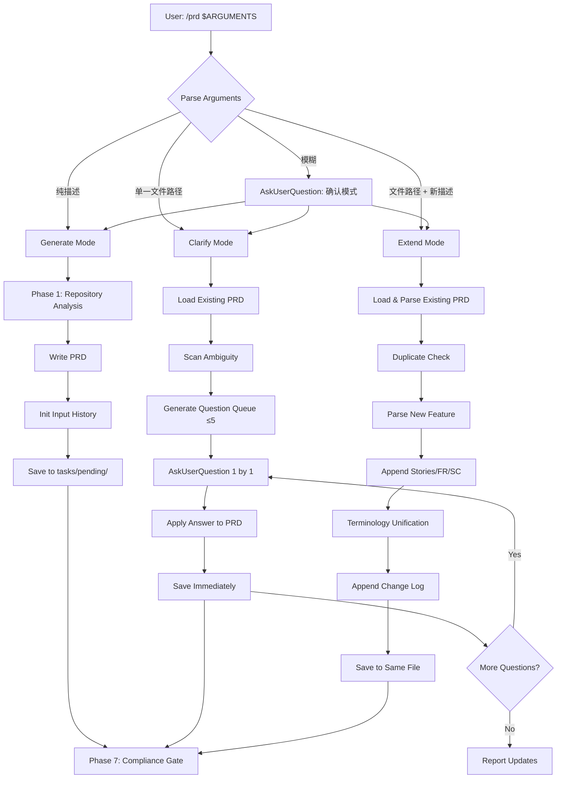

# PRD: PRD Skill Multi-Mode Optimization

## 1. Introduction & Goals

### Problem Statement

当前 `skills/prd/SKILL.md` 仅覆盖**生成模式**（Generate），即从零开始基于代码库分析创建一份新的 PRD。但在实际使用中，PRD 的演进往往是迭代式的：用户可能在生成后发现模糊点需要澄清，或在实现过程中需要追加新功能。现有 skill 缺乏对这两种高频场景的结构化支持，导致用户要么手动修改 PRD（容易破坏格式一致性），要么重复走生成流程（产生冗余文档）。

### Proposed Solution Summary

在现有 `skills/prd/SKILL.md` 中引入**三模式工作流**：生成（Generate）、澄清（Clarify）、扩展（Extend）。生成模式保持现有行为不变；澄清模式通过扫描已有 PRD 的模糊点，以 ≤5 个针对性问题与用户交互，**每答一问即时写回 PRD**；扩展模式在保持既有编号、术语和结构一致性的前提下追加新功能。两种新模式均强制维护 `## 输入历史 (Input History)` 章节，逐字保留用户原始输入作为可追溯凭据。模板 `skills/prd/templates/prd-visual-template.md` 同步增加 `输入历史` 和 `Change Log` 章节占位。

### Measurable Objectives
- 澄清模式能识别并解决已有 PRD 中 ≥80% 的高影响模糊点（以用户确认或文件更新为信号）。
- 扩展模式追加新功能时，FR/SC 编号与既有编号保持连续且无冲突（由 PRD Compliance Gate 验证）。
- 所有模式生成的 PRD 均包含完整的 `输入历史` 章节，用户原始输入逐字保留率 100%。
- 澄清模式下单个问题从提问到写回 PRD 的平均交互轮次 ≤2（含可能的消歧重试）。

### Realistic Validation

除单元测试和集成测试外，本 PRD 要求通过**真实项目入口点**验证关键行为，确保真实使用路径生效，而非仅在隔离 fixture 中通过。

- [ ] **生成模式端到端验证**：通过 `claude /prd "some feature description"` 验证生成的新 PRD 包含 `输入历史` 章节且 `$ARGUMENTS` 逐字保留。
- [ ] **澄清模式即时写回验证**：通过 `claude /prd tasks/pending/some-prd.md` 验证回答一个问题后 PRD 文件立即更新，且 `Clarifications` 章节追加结构化 Q→A。
- [ ] **扩展模式一致性验证**：通过 `claude /prd tasks/pending/some-prd.md "add new feature"` 验证新 FR 编号从既有最大值连续递增，术语与原文一致。
- [ ] **为什么单元测试不够**：模式切换涉及 `$ARGUMENTS` 解析、文件存在性检查、多轮对话状态管理，这些依赖 Claude Code skill 运行时的真实行为，mock 无法覆盖 skill 入口到文件写回的完整链路。

### Delivery Dependencies

- Group: none
- Depends on groups:
  - none
- Depends on tasks/issues:
  - none
- Gate type: none
- Notes: 本 PRD 仅涉及 skill 文件和模板的修改，不触及后端四层架构或前端运行时。

---

## 2. Requirement Shape

- Actor: 使用 Claude Code PRD skill 的开发者/产品经理
- Trigger: 用户调用 `/prd` 并传入 `$ARGUMENTS`，或明确表达澄清/扩展意图
- Expected behavior: skill 根据输入自动路由到生成、澄清或扩展模式，并输出符合规范的 PRD 文件
- Scope boundary: 不涉及 `prd-review` 或 `prd-audit` 配套 skill；不涉及 skill 市场发布流程

---

## 3. Repository Context And Architecture Fit

- Existing path: `skills/prd/SKILL.md`（skill 定义）、`skills/prd/templates/prd-visual-template.md`（输出模板）
- Reuse candidates:
  - `skills/prd/SKILL.md` 中的 Phase 0-7 工作流程可直接作为生成模式的核心骨架
  - `skills/prd/templates/prd-visual-template.md` 中的章节结构可作为扩展模式的追加基准
- Architecture pattern to preserve: skill 文件保持自包含（self-contained），不依赖外部 Python 脚本或运行时状态；模板保持 Markdown 纯文本，不引入 YAML frontmatter 之外的元数据
- Constraints:
  - skill 内不能使用持久化内存或会话存储，所有状态必须通过文件系统（Read/Write/Edit）传递
  - `$ARGUMENTS` 是唯一的动态输入，模式判定必须基于它及文件存在性
  - 必须兼容 Claude Code 的 `AskUserQuestion` 工具用于多轮交互
- Redundancy risks:
  - 澄清模式的问题分类可能与 `requirement-sanity-reviewer` skill 重叠，需明确边界：前者聚焦 PRD 内部模糊点，后者聚焦需求与代码库的冲突
  - 扩展模式的编号递增逻辑可能与未来 `prd-review` 的编号检查重复，需保持简单可复用

---

## 4. Recommendation

### Recommended Approach
- Approach: 在现有 `skills/prd/SKILL.md` 的 Core Rules 后新增 `## Mode Detection` 章节，随后分三个子章节详述 Generate/Clarify/Extend 的执行流程；在模板中新增 `输入历史` 和 `Change Log` 占位；更新 `Phase 6: Generate And Save The PRD` 以支持三模式下的文件写入路径
- Why this is the best fit: 最小变更现有结构，不破坏已有的 Phase 0-7 框架和 Compliance Gate；通过新增章节而非重写，降低引入回归的风险
- Rejected redundancy: 不新建独立的 `skills/prd-clarify/SKILL.md` 或 `skills/prd-extend/SKILL.md`——当前 skill 的复杂度尚不值得拆分为多个 skill，且统一入口更便于用户记忆

### Alternatives Considered (Only When Useful)
- Alternative: 为澄清和扩展各建独立 skill（如 `prd-clarify`、`prd-extend`）
- Why not chosen: 增加用户认知负担（需要记忆三个 skill 名），且共享的模板、Compliance Gate 和输入历史规范需要跨 skill 同步，维护成本高于单文件扩展

---

## 5. Implementation Guide

This section is a living implementation guide based on current repository analysis. If implementation discovers additional affected files, hidden dependencies, edge cases, or a better path, update this PRD before proceeding.

### 5.1 Core Logic

现有 skill 的工作流是线性的：Phase 0（重写请求）→ Phase 1（代码库分析）→ Phase 2（澄清问题）→ ... → Phase 6（保存 PRD）。引入三模式后，入口变成一个路由器：

1. 解析 `$ARGUMENTS` 和对话上下文
2. 判定模式：若参数是纯描述 → 生成；若参数是单一文件路径 → 澄清；若参数是文件路径 + 新描述 → 扩展
3. 各模式执行各自的流程，但共享：输入历史规范、Compliance Gate、保存路径规则

### 5.2 Change Impact Tree

```text
.
├── skills/prd/
│   └── SKILL.md
│       [修改]
│       【总结】在 Core Rules 后新增 Mode Detection 章节，拆分 Generate/Clarify/Extend 三模式流程，更新 Phase 6 和 Compliance Gate
│
│       ├── 新增 `## Mode Detection` 章节（路由逻辑）
│       ├── 将现有 Phase 0-7 包装为 `### Generate Mode` 子章节
│       ├── 新增 `### Clarify Mode` 子章节（扫描 → 问题队列 → 即时写回）
│       ├── 新增 `### Extend Mode` 子章节（加载 → 重复检查 → 追加 → 变更日志）
│       ├── 更新 `## Input History Spec` 通用规范章节
│       ├── 更新 Phase 6 保存路径逻辑，支持三模式
│       └── 更新 Phase 7 Compliance Gate，增加输入历史和变更日志检查项
│
│   └── templates/prd-visual-template.md
│       [修改]
│       【总结】在现有章节中插入 `输入历史` 和 `Change Log` 占位，保持其余结构不变
│
│       ├── 在 `## 1. Introduction & Goals` 后插入 `## Input History (Input History)` 章节
│       └── 在 `## 7. Acceptance Checklist` 附近插入 `## Change Log` 章节占位
│
└── tasks/pending/
    └── P2-FEAT-20260610-000000-prd-skill-multi-mode-optimization.md
        [新增]
        【总结】本 PRD 文件自身
```

### 5.3 Executor Drift Guard

The file list above is the expected implementation surface from current repository analysis. During implementation, treat it as a starting point and use these repository searches to catch hidden references or drift before marking the PRD complete.

| Check | Command | Expected Result | If It Fails, Inspect First |
|---|---|---|---|
| skill 入口引用 | `rg -n "skills/prd/SKILL" .` | 仅 `CLAUDE.md`、`AGENTS.md` 等入口文件引用 | 是否有其他自动化脚本硬编码了 skill 路径 |
| PRD 模板引用 | `rg -n "prd-visual-template" .` | 仅 `skills/prd/SKILL.md` 引用 | 是否有 CI 或文档生成脚本依赖模板结构 |
| 输入历史关键字 | `rg -n "Input History" skills/` | 无既有引用（新章节） | 确认不与现有文档章节名冲突 |
| Compliance Gate 引用 | `rg -n "Phase 7" skills/prd/SKILL.md` | 仅 skill 文件自身引用 | 无外部依赖 |

### 5.4 Flow Or Architecture Diagram



### 5.5 Low-Fidelity Prototype (Only When Required)

No low-fidelity prototype required for this PRD.

### 5.6 ER Diagram (Only When Data Model Changes)

No data model changes in this PRD.

### 5.7 Realistic Validation Plan

| Behavior | Real Entry Point | Test Layer | Mock Boundary | Data/Env Needed | Command Or Procedure | Required For Acceptance |
|---|---|---|---|---|---|---|
| 生成模式含输入历史 | Claude Code skill 运行时 | manual | 无 | 一份功能描述文本 | 在 Claude Code 中输入 `/prd "添加用户登录功能"`，检查生成的 PRD 文件是否包含 `## Input History` 且原始描述逐字保留 | Yes |
| 澄清模式即时写回 | Claude Code skill 运行时 | manual | 无 | 一份已有的 pending PRD | 输入 `/prd tasks/pending/some-prd.md`，回答第一个问题后，用 `Read` 检查该 PRD 文件是否已更新 | Yes |
| 扩展模式编号连续 | Claude Code skill 运行时 | manual | 无 | 一份已有 FR 编号的 PRD + 扩展描述 | 输入 `/prd tasks/pending/some-prd.md "新增分享功能"`，检查新 FR 编号是否为 `FR-(max+1)` 且无冲突 | Yes |
| 模板结构一致性 | 文件系统 | unit | 无 | `skills/prd/templates/prd-visual-template.md` | `rg -n "## Input History" skills/prd/templates/prd-visual-template.md` 应命中 | Yes |
| Compliance Gate 通过 | 文件系统 | unit | 无 | 更新后的 `skills/prd/SKILL.md` | `rg -n "^## " skills/prd/SKILL.md` 检查新增章节存在 | Yes |

Failure triage:
- If skill 入口不响应模式切换，检查 `skills/prd/SKILL.md` 的 Mode Detection 章节是否位于 `$ARGUMENTS` 可解析的位置。
- If 输入历史未逐字保留，检查 Write/Edit 工具调用时的字符串转义逻辑。

### 5.8 Interactive Prototype Change Log (Only When Files Actually Changed)

No interactive prototype file changes in this PRD.

### 5.9 External Validation (Only When Web Research Was Used)

No external validation required; repository evidence was sufficient.

---

## 6. Definition Of Done

- [ ] `skills/prd/SKILL.md` 包含完整的三模式工作流和 Mode Detection 路由
- [ ] `skills/prd/templates/prd-visual-template.md` 包含 `输入历史` 和 `Change Log` 占位章节
- [ ] 所有 Acceptance Checklist items are satisfied
- [ ] Relevant validation commands pass
- [ ] Documentation and operational notes are updated where needed
- [ ] No open regression or rollout blocker remains

---

## 7. Acceptance Checklist

### Architecture Acceptance

- [ ] Mode Detection 逻辑位于 skill 入口显眼位置，不 buried 在深层子章节中
- [ ] Generate/Clarify/Extend 三模式共享统一的 `输入历史` 规范，无重复定义
- [ ] 现有 Phase 0-7 框架未被破坏，生成模式行为与修改前一致

### Dependency Acceptance

- [ ] 新增内容仅修改 `skills/prd/SKILL.md` 和 `skills/prd/templates/prd-visual-template.md`，不引入新依赖
- [ ] skill 不自建外部存储或会话状态，所有持久化通过 Read/Write/Edit 完成

### Behavior Acceptance

- [ ] 生成模式输出的 PRD 包含 `## Input History` 章节，且 `$ARGUMENTS` 逐字保留
- [ ] 澄清模式一次只问一个问题，回答后立即写回 PRD 并保存
- [ ] 澄清模式最多问 5 个问题，同一问题的消歧重试不计入配额
- [ ] 扩展模式追加的 FR/SC 编号与既有编号连续，无冲突或重排
- [ ] 扩展模式保持既有用户故事、术语和结构不变

### Documentation Acceptance

- [ ] `skills/prd/SKILL.md` 的变更在 `CLAUDE.md` 或 `AGENTS.md` 中无需额外说明（skill 自描述）
- [ ] 模板变更同步到 `skills/prd/templates/prd-visual-template.md`

### Validation Acceptance

- [ ] `rg -n "## Mode Detection" skills/prd/SKILL.md` 命中
- [ ] `rg -n "## Input History" skills/prd/templates/prd-visual-template.md` 命中
- [ ] `rg -n "## Change Log" skills/prd/templates/prd-visual-template.md` 命中
- [ ] `just lint` passes on modified files
- [ ] 至少一次真实 skill 运行时验证通过（生成/澄清/扩展任一模式）

---

## 8. Functional Requirements

- FR-001: skill 必须根据 `$ARGUMENTS` 和文件存在性自动判定进入生成、澄清或扩展模式
- FR-002: 生成模式必须在 PRD 中初始化 `## Input History` 章节，将用户原始输入逐字保留
- FR-003: 澄清模式必须对已有 PRD 执行结构化扫描，识别模糊点并生成 ≤5 个优先级问题
- FR-004: 澄清模式必须一次只向用户提出一个问题，且回答后立即将结果写回 PRD 文件
- FR-005: 澄清模式必须在 `## Input History` 中逐字追加用户回答，在 `## Clarifications` 中追加结构化 Q→A 摘要
- FR-006: 扩展模式必须加载已有 PRD 的上下文（最大编号、术语、实体），并执行重复检查
- FR-007: 扩展模式追加的新 FR/SC 编号必须从既有最大值连续递增，不得重排已有内容
- FR-008: 扩展模式必须在 `## Input History` 中追加原始功能描述，在 `## Change Log` 中追加结构化变更摘要
- FR-009: 模板 `prd-visual-template.md` 必须包含 `## Input History` 和 `## Change Log` 占位章节

---

## 9. Non-Goals

- 不实现独立的 `prd-review` 或 `prd-audit` skill
- 不修改 PRD 保存路径规范（仍为 `tasks/pending/`）
- 不引入外部数据库或会话存储机制
- 不修改现有 Compliance Gate 的硬性规则，仅追加输入历史和变更日志的检查项

---

## 10. Risks And Follow-Ups

- Risk: 澄清模式的即时写回可能在多轮交互中导致文件版本不一致（如用户同时手动编辑 PRD）。Mitigation: 每次写回前重新 `Read` 文件，基于最新内容应用修改。
- Risk: 扩展模式的重复检查误判（将真正的新功能识别为重复）。Mitigation: 遇到疑似重复时停下来向用户说明并请求确认，而非静默跳过。
- Follow-Up: 未来若三模式复杂度继续增长，可拆分为独立 skill（`prd-clarify`、`prd-extend`），届时需重新评估本 PRD 的架构决策。

---

## 11. Decision Log

| # | 决策问题 | 选择 | 放弃的方案 | 理由 |
|---|---|---|---|---|
| D-01 | 三模式放在单一 skill 还是拆分为多个 skill？ | 单一 skill，在 `SKILL.md` 中新增 Mode Detection 路由 | 拆分为 `prd-clarify` 和 `prd-extend` 两个独立 skill | 降低用户认知负担和跨 skill 维护成本，当前复杂度不值得拆分 |
| D-02 | 澄清模式是攒齐所有问题再统一修改，还是每答一问即时写回？ | 每答一问即时写回 PRD | 先全部问完再批量修改 | 用户可以实时看到文档进化，更符合交互预期，且降低中途丢失上下文的风险 |
| D-03 | 输入历史是结构化摘要还是逐字原话？ | 逐字原话，不改写、不翻译、不美化 | 压缩或改写为结构化摘要 | 作为需求来源的可追溯凭据，原始输入的保真度高于可读性 |
