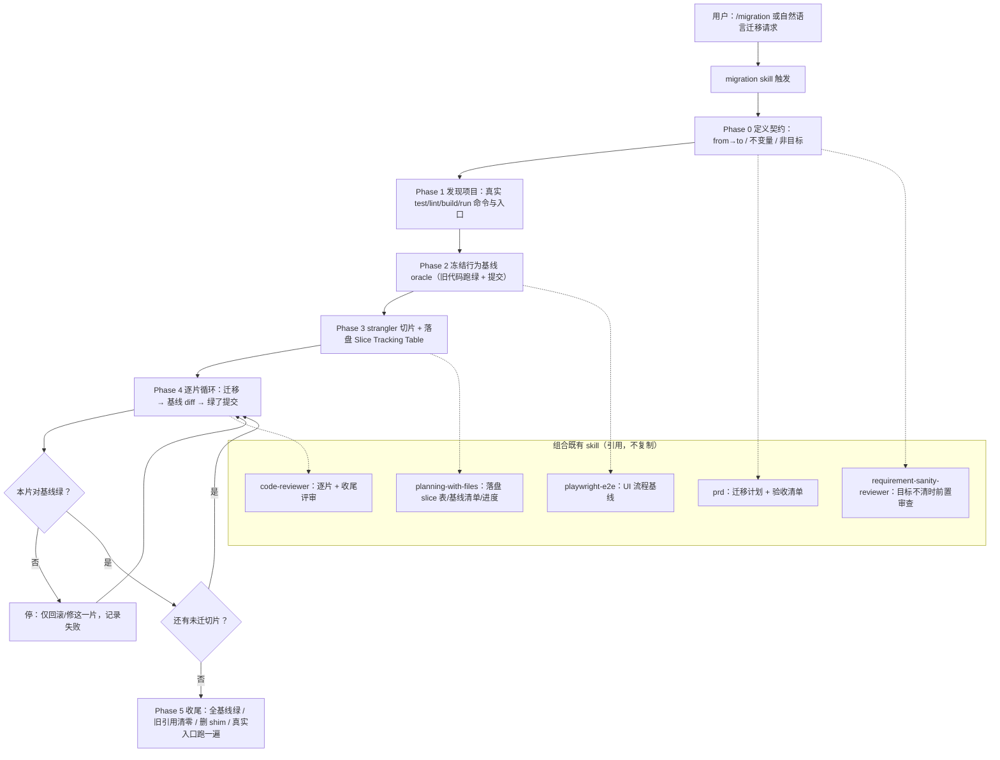

# P2-FEAT-20260627-195649 新增 Migration Skill（行为保持型迁移）

> 本 PRD 分两个 altitude：**Part A · 人审层**（决定该不该做、做得对不对，含介入与风险地图）;**Part B · 执行器层**（实现细节，人只在风险地图点名处下钻）。
>
> **实现状态**：本 PRD 记录的工作已在创建时完成并通过可行的验证（见 §7.6 与 §9）。唯一未完成项是"端到端引导真实验证"——需在一个真实迁移任务上实际调用 `/migration` 才能勾选，列为跟进项。

---

# Part A · 人审层 (Review Layer)

## 1. Introduction & Goals

### Problem Statement

AI 代理在大型项目迁移（框架迁移、大版本升级、库/运行时替换）中产生大量错误，根因不是模型能力，而是两类方法缺陷：

- **一次性大改（big-bang）**：把整个迁移一把梭丢给模型，diff 大到不可审，错误隐藏，且一旦工作量超出单次上下文就失控。
- **缺少行为基线（oracle）**：迁移前没有可执行的东西定义"功能正常"，于是"迁移后保持功能"无法被证明，只能靠运气。

仓库已有 `prd`、`planning-with-files`、`code-reviewer`、`playwright-e2e`、`requirement-sanity-reviewer` 等 skill，但没有一个把"行为保持型迁移"这一特定形态固化为 AI 代理必须遵守的流程。

### Interpretation (解读回显)

我把需求读成：**新增一个把"行为保持型迁移"方法论固化成硬流程的 skill（markdown/yaml 指引），不是去执行某次具体迁移、也不改任何运行时**。假设保持 project-agnostic、以引用而非复制组合既有 skill、随模板 `just copy` 传播。若你其实想要的是直接迁某个具体模块（而非沉淀方法论），这条解读就是错的——请在此纠正（第一次人类触点）。

### What The User Gets

开发者输入 `/migration` 或用自然语言描述迁移意图（如"把后端从 Flask 迁到 FastAPI，迁移后功能完全一致"），即被一套硬流程接管：先在最高可观测层冻结行为基线 → 把迁移切成可独立验证、可回滚的小片 → 每片迁移后对基线做行为 diff、绿了才进下一片（"上一片没绿不准开下一片"）。在任何 `just copy` 派生项目里零改写可用。交付的是 AI 编排能力，不改变任何运行时或产品行为。

### Measurable Objectives

- 用"基线 oracle + strangler 切片 + 逐片基线验证门禁"系统性消除 big-bang 与无 oracle 两类根因。
- 保持 project-agnostic，使其在所有 `just copy` 派生项目零改写可用。
- 以引用方式组合既有 skill，不制造重复职责。
- 结构与既有兄弟 skill（`requirement-sanity-reviewer`）完全对齐，支持 Claude / Codex / Cursor 多入口。

## 2. Human Review Map (介入与风险地图)

按架构层定默认介入档，再用风险因子（不可逆性 / 影响面 / 安全·资金 / 正确性关键度）调整。

判定菜单：固定区域 ① Core 逻辑 ② schema/迁移 ③ 安全/信任边界 ④ 对外 API 契约;横切触发器 ⑤ 资金/计费 ⑥ 不可逆/破坏性数据操作 ⑦ 并发/幂等。

**命中的人审项**：仅 ① 的一个变体——"方法论本身是否完备可执行"（见下表;严格说不是 `core/` 代码，而是 skill 正文的正确性，属正确性关键度因子）。

**未命中**：②③④⑤⑥⑦ 均不涉及（纯 markdown/yaml 方法论指引，不碰 DB / 鉴权 / 对外契约 / 资金 / 数据 / 并发）→ 默认执行器 + 自动门禁。

- 最坏自检：均为方法论指引文本，最坏情况是"指引写错/不被采纳"，由 frontmatter 解析 + 一致性 hook + 评审兜底，无运行时或数据风险。

| 改动点 | 架构层 | 风险 | 介入方式 | 证据 / Oracle（可执行、能证伪本项；进 §9 证据包） |
|---|---|---|---|---|
| 方法论是否真能消除 big-bang / 无-oracle 根因 | 文档（skill 正文） | 中 | 人工确认 | **无干净可执行 oracle**——属内容正确性判断;退而求其次=作者评审 + 首个真实迁移端到端跑通（跟进项）。按新规则:无 oracle 的高证据项要标红旗，不当已过。 |
| `SKILL.md` frontmatter 可被加载器解析 | 工具集成 | 低 | 执行器+门禁 | `python -c "...yaml.safe_load..."` 输出 `migration` |
| 三件套结构与兄弟 skill 对齐 | 文件结构 | 低 | 执行器+门禁 | `find skills/migration -type f` |
| project-agnostic（无硬编码仓库值） | 文档 | 低 | 执行器+门禁 | `rg` 断言无 `just test` / `src/backend/...` 硬编码 |
| 文件卫生 + 跨工具入口一致性 | 工具集成 | 低 | 执行器+门禁 | `pre-commit` + `check_guidelines_consistency.py` |

**如何证明它生效（真实入口，白话）**：跑通 skill 加载解析、pre-commit 卫生、规范一致性 hook、三件套结构检查（均不需凭据，必须通过）;最高保真是在一次真实迁移里调 `/migration`，看它产出 Baseline Manifest + Slice Tracking Table 并按逐片门禁推进（列为跟进项，不阻塞验收）。命令级细节见 §7.6。

**数据库结构评审**：`本次无数据库结构变化。`

## 3. Usage And Impact After Implementation

### 各角色走查

- **开发者 / AI 使用者**：输入 `/migration`，或自然语言描述迁移意图。skill 触发后按 6 阶段引导：(1) 把迁移定义为契约（from→to + 不变量 + 非目标）;(2) 发现项目真实命令与入口;(3) 冻结行为基线 oracle，在旧代码跑绿并提交;(4) strangler 切片，落盘 Slice Tracking Table;(5) 逐片"迁移→基线 diff→绿了提交"硬门禁推进;(6) 收尾：全基线绿、旧引用清零、删 shim、真实入口跑一遍。
- **模板维护者**：`skills/migration/` 随模板存在，`just copy` 派生新项目时一并带走;因 project-agnostic，派生项目无需改写即可使用。
- **其他 AI 工具（Codex / Cursor）**：通过 `skills/migration/agents/openai.yaml` 的 `default_prompt` 获得统一触发入口。

### 入口命令

```text
/migration
# 或自然语言触发：
把 <模块/服务> 从 <框架A> 迁到 <框架B>，迁移后保持功能完全一致。
```

### 对既有行为的影响

- 纯新增：不修改任何既有 skill、文档入口或运行时行为。
- `No frontend impact`：只新增 AI 代理编排用的 markdown/yaml 指引，无任何用户可见界面或后端行为。
- 新增内容仅在 AI 代理显式（`/migration`）或语义触发时生效，默认不改变其他流程;既有派生项目拉取更新后获得该能力，行为向后兼容。

## 4. Requirement Shape

- **Actor**：使用 AI 代理执行迁移的开发者;以及在此模板派生项目中工作的代理。
- **Trigger**：用户请求框架迁移 / 大版本升级 / 库或运行时替换 / 要求"迁移后保持功能"的大型重构;或显式调用 `/migration`。
- **Expected behavior**：代理按行为保持型迁移流程工作——先建基线 oracle，再 strangler 小步迁移，每步对基线验证，逐片门禁推进，最后收尾删除旧路径与脚手架。
- **Scope boundary**：仅覆盖"替换实现、保持行为"的迁移类工作;不覆盖新增功能或借机重构（这些应在独立提交中完成）。skill 本身保持 project-agnostic，不硬编码任何仓库特定命令 / 目录 / 端口。

---

# Part B · 执行器层 (Build Layer)

> 以下供实现者使用;人只在 Part A 风险地图点名处下钻。

## 5. Repository Context And Architecture Fit

### 当前相关模块/文件

- `skills/`：仓库面向多 AI 工具的 skill 容器;skill 通过落在此目录被自动发现，无中央注册表。
- 兄弟 skill（本 skill 引用，不修改）：`skills/planning-with-files/`（落盘进度/状态，承载 Slice Tracking Table、Baseline Manifest、进度/错误日志）、`skills/prd/`（迁移计划与 Acceptance Checklist）、`skills/code-reviewer/`（逐片与收尾 diff 评审）、`skills/playwright-e2e/`（UI 用户流程基线）、`skills/requirement-sanity-reviewer/`（目标不清时的上游需求审查）。
- 结构范式：`skills/requirement-sanity-reviewer/` = `SKILL.md` + `references/*.md` + `agents/openai.yaml`，本 skill 完全对齐。

### 既有架构模式

- skill 靠落在 `skills/` 被发现，无需更新任何注册表/索引（已确认 AGENTS.md、mkdocs.yml、README.md 均不枚举单个 skill）。
- 跨工具入口通过 `agents/openai.yaml` 适配（Codex / Cursor）。
- 组合优先、禁止重复（仓库 code-reuse 标准 + manual 重复检测 hook）：方法论引用既有 skill，不复制其职责。

### 归属与依赖边界

- `skills/migration/` 由模板上游拥有，随 `just sync-template` / `just copy` 传播。
- 保持 project-agnostic 以便派生项目零改写复用（与既有 skill 保持项目无关性的原则一致）。
- 本 skill 仅"引用"兄弟 skill 的名字与职责边界，不引入对其内部文件的硬编码依赖。

### Frontend impact

- `No frontend impact`：纯新增 AI 代理用的 markdown/yaml 指引，无用户可见界面或后端行为。

### 约束

- skill 是 markdown/yaml：受基础卫生 hook（trailing-whitespace / end-of-file-fixer / check-yaml）约束;不受四层架构 hook 约束（`hooks/shared/check_architecture.py` 的 `files` 正则只匹配 `src/<module>/(api|core|engines|infrastructure)/*.py`）。
- skills 不在 mkdocs `nav` 中（既有 skill 均未登记），无需更新导航。
- 跨工具入口一致性由 `hooks/shared/check_guidelines_consistency.py` 守护，但其 `files` 只匹配 AGENTS.md / CLAUDE.md / cursor.md;新增 skill 不触发该 hook，亦不破坏其断言（已实跑确认通过）。

### 相关 PRD 与关系

- `tasks/pending/P2-FEAT-20260610-000000-prd-skill-multi-mode-optimization.md`：关于 `prd` skill 的多模式优化;与本 PRD 同属 ai-tooling-skills 域但目标不同，无依赖、无重复。
- `tasks/archive/20260516-184900-prd-decouple-planning-with-files.md`：planning-with-files 解耦的历史 PRD;本 skill 引用 planning-with-files，但不修改它。
- **Existing PRD Relationship**：本 PRD 独立可实施，与上述 PRD 无重复、无执行依赖。

### 重复风险

- 组合既有 skill 时可能与 planning-with-files / prd 职责重叠 → 已通过"引用不复制"规避;manual 重复检测 hook（jscpd / pylint-duplicate-code）兜底。

## 6. Recommendation

### Recommended Approach

新增独立 `skills/migration/`，采用与 `requirement-sanity-reviewer` 一致的三件套结构（`SKILL.md` + `references/migration-checklist.md` + `agents/openai.yaml`）。方法论核心 = **行为基线 oracle + strangler 切片 + 逐片基线验证门禁**;保持 project-agnostic;以引用方式组合既有 skill。

### Why this is the best fit

- 与既有 skill 的结构和触发机制完全一致，零新增基础设施。
- 不复制既有 skill 职责（落盘 / PRD / 评审 / E2E 全部引用），符合 no-duplication 标准与重复检测 hook 约束。
- project-agnostic 使其在所有派生项目可直接复用，契合模板仓库定位。

### Proposed Solution Summary (实现机制)

把行为保持型迁移固化为硬流程：先在**最高可观测层**冻结行为基线（oracle）并在旧代码上跑绿、提交;再用 **strangler** 模式把迁移切成小到可独立验证、可独立回滚的增量;每个增量迁移后对基线做**行为 diff**，绿了才提交并进入下一片——**"上一片没绿不准开下一片"为硬门禁**。skill 保持 **project-agnostic**：运行时自行发现项目的 test/lint/build/run 命令与真实入口，不硬编码任何仓库特定值;并以**引用而非复制**的方式与既有 skill 组合。

- **谁提供输入**：使用者通过 `/migration` 或自然语言迁移请求触发;项目特定信息（命令、入口、目录）由 skill 在运行时发现，使用者无需预先声明。
- **接入点**：落在 `skills/` 即被 AI 工具自动发现;跨工具入口通过 `agents/openai.yaml`。
- **主要状态/行为变化**：纯新增 AI 编排能力，不改变任何运行时或产品行为。
- **有意避免的复杂度**：不新增注册表、不新增配置层、不复制既有 skill 的落盘/PRD/评审/E2E 职责。

### Alternatives Considered

- **把迁移指引塞进既有 `prd` 或 `planning-with-files` skill**：rejected。迁移有独特的 "oracle-before-edit" 与"逐片门禁"语义，混入会稀释那些 skill 的职责，且无法被"迁移"语义单独触发。
- **只写一个 `SKILL.md`、不带 `references/` 和 `agents/`**：rejected。失去 Codex / Cursor 跨工具入口，且把 checklist 与可嵌入工件挤进主文件会降低可读性，与兄弟 skill 不一致。
- **在 skill 中硬编码本仓库命令（如 `just test`、`src/backend/api/`）**：rejected。模板会被 `just copy` 派生，硬编码会在改了结构/端口的派生项目中失效;改为运行时发现真实命令与入口。

## 7. Implementation Guide

> This section is a living implementation guide based on current repository analysis. If implementation discovers additional affected files, hidden dependencies, edge cases, or a better path, update this PRD before proceeding.

### 7.1 Core Logic

1. 新增 3 个文件，构成与兄弟 skill 一致的三件套。
2. skill 被 AI 工具发现并加载后，按 `SKILL.md` 的 6 阶段流程编排迁移;`references/migration-checklist.md` 提供分阶段 checklist 与可嵌入工件（Baseline Manifest、Slice Tracking Table）;`agents/openai.yaml` 提供跨工具触发入口。
3. 方法论在运行时发现项目的真实命令与入口，并通过名字引用兄弟 skill 完成落盘、PRD、评审、E2E 等职责，自身不重复实现。

### 7.2 Change Impact Tree

```text
.
└── skills/migration/
    [新增目录]
    【总结】行为保持型迁移方法论 skill；随 just sync-template / just copy 传播。

    ├── [新增] SKILL.md
    │   【总结】方法论正文：6 阶段流程 + 非协商规则 + 护栏 + 验证 + 与其他 skill 的关系。
    │
    │   ├── frontmatter：name=migration，带 [Updated 2026-06-27] 与中英双语触发词
    │   ├── 核心原则：先让"功能"可执行，再小步迁移、每步验证
    │   ├── 6 阶段：契约 → 发现项目 → 冻结基线 oracle → strangler 切片 → 逐片门禁 → 收尾
    │   └── 组合点：引用 planning-with-files / prd / code-reviewer / playwright-e2e / requirement-sanity-reviewer / deep-research
    │
    ├── [新增] references/migration-checklist.md
    │   【总结】分阶段 checklist + 可嵌入工件模板 + AI 迁移反模式。
    │
    │   ├── 各阶段选择性 checklist
    │   ├── Baseline Manifest 表模板
    │   ├── Slice Tracking Table 表模板
    │   └── AI 迁移 anti-patterns（big-bang / 无 oracle / 内部层基线 / 幻觉 API 等）
    │
    └── [新增] agents/openai.yaml
        【总结】Codex / Cursor 跨工具适配器：display_name / short_description / default_prompt。
```

### 7.3 Executor Drift Guard

实施时不要假设"上面清单是穷尽"——用以下检查确认：

```bash
# 确认 skill 三件套结构与兄弟 skill 对齐
find skills/migration -type f | sort

# 确认 SKILL.md frontmatter 可被加载器解析（无 YAML 错误）
uv run python -c "import re,yaml,pathlib;t=pathlib.Path('skills/migration/SKILL.md').read_text(encoding='utf-8');m=re.match(r'^---\n(.*?)\n---\n',t,re.S);print(yaml.safe_load(m.group(1))['name'])"

# 确认未引入对不存在 skill 的引用（被引用的兄弟 skill 必须真实存在）
rg -n "planning-with-files|requirement-sanity-reviewer|playwright-e2e|code-reviewer" skills/migration/SKILL.md
ls skills/planning-with-files skills/requirement-sanity-reviewer skills/playwright-e2e skills/code-reviewer skills/prd

# 确认没有中央 skill 注册表需要同步（应无命中）
rg -n "requirement-sanity-reviewer|playwright-e2e" AGENTS.md mkdocs.yml README.md
```

风险点：

- skill 内引用的兄弟 skill 名若被重命名/删除，会变成悬挂引用——本 PRD 已用 `ls` 断言其存在。
- `references/migration-checklist.md` 内的命令为占位（`<discovered test cmd>` 等），是有意为之的 project-agnostic 设计，不是遗漏。

### 7.4 Flow Or Architecture Diagram



### 7.5 ER Diagram

`No data model changes in this PRD.`

### 7.6 Realistic Validation Plan

| Behavior | Real Entry Point | Test Layer | Mock Boundary | Data/Env Needed | Command Or Procedure | Required For Acceptance |
|---|---|---|---|---|---|---|
| SKILL.md frontmatter 可被加载器解析 | skill 加载（frontmatter 解析） | smoke | none | uv + PyYAML | `uv run python -c "import re,yaml,pathlib;t=pathlib.Path('skills/migration/SKILL.md').read_text(encoding='utf-8');m=re.match(r'^---\n(.*?)\n---\n',t,re.S);print(yaml.safe_load(m.group(1))['name'])"` | Yes |
| 文件卫生（空白/结尾/yaml 语法） | `pre-commit run` | smoke | none | pre-commit 已安装 | `uv run pre-commit run --files skills/migration/SKILL.md skills/migration/references/migration-checklist.md skills/migration/agents/openai.yaml` | Yes |
| 跨工具入口一致性未被破坏 | `check_guidelines_consistency.py` | smoke | none | uv 环境 | `uv run python hooks/shared/check_guidelines_consistency.py` | Yes |
| 结构与兄弟 skill 对齐 | 文件系统结构 | smoke | none | none | `find skills/migration -type f \| sort` | Yes |
| 端到端：真实迁移中产出基线/切片表并按门禁推进 | `/migration` 真实调用 | manual | 取决于目标迁移（依赖项可 mock） | 一个真实迁移任务 | 在真实迁移任务上调用 `/migration`，人工核对产物与门禁行为 | No（跟进项） |

无凭据/无真实迁移任务时的 fallback：前四行（加载解析、pre-commit、一致性、结构）不依赖任何外部服务或凭据，必须通过;端到端真实调用为跟进项，不阻塞本 PRD 验收。

### 7.7 Low-Fidelity Prototype

`No low-fidelity prototype required for this PRD.`（AI 工具 skill，无 UI 面）

### 7.8 Interactive Prototype Change Log

`No interactive prototype file changes in this PRD.`

### 7.9 External Validation

`No external validation required; repository evidence was sufficient.`

## 8. Delivery Dependencies

- Group: ai-tooling-skills
- Depends on groups:
  - none
- Depends on tasks/issues:
  - none
- Gate type: none
- Notes: 引用既有 skill（planning-with-files / prd / code-reviewer / playwright-e2e / requirement-sanity-reviewer）作为组合点，但仅为引用关系，无执行硬依赖。

## 9. Acceptance Checklist

「人只看一次」的终点交付物：按 §2 风险地图排序、每项带证据（命令输出 / 观察）。

### Acceptance Evidence Package（证据包 · 按风险地图排序）

1. **高风险 oracle 结果（置顶）**：方法论完备性——无干净可执行 oracle，以作者评审结论 +（跟进项）首个真实迁移的端到端记录代替。
2. **风险地图对账 Predicted → Reconciled**：实现后确认未冒出 DB / 鉴权 / 对外契约等高风险面（本次确为纯文本指引）。
3. **对抗自检**：未命中项最坏情况复核（均为文本，无运行时/数据风险）。
4. **低风险门禁结果**：frontmatter 解析、pre-commit 卫生、`check_guidelines_consistency.py`、三件套结构检查 —— 全绿。

### Human-Confirmed（来自 §2 风险地图）

- [x] 作者已确认 6 阶段流程 + 不可协商规则覆盖 big-bang 与无-oracle 两类根因，且每阶段可执行（§2 唯一人工确认项）。

### Architecture Acceptance

- [x] `skills/migration/` 存在且包含 `SKILL.md`、`references/migration-checklist.md`、`agents/openai.yaml` 三件套，结构与 `skills/requirement-sanity-reviewer/` 对齐。
- [x] `SKILL.md` 保持 project-agnostic：未硬编码 `just test`、`src/backend/...` 等仓库特定命令/目录/端口，改为运行时发现。
- [x] 方法论以"引用"方式组合既有 skill，未复制其落盘/PRD/评审/E2E 职责。
- [x] 未新增任何中央注册表/索引依赖（skill 靠落在 `skills/` 自动发现）。

### Dependency Acceptance

- [x] 不新增任何外部依赖。
- [x] skill 内引用的兄弟 skill（planning-with-files / prd / code-reviewer / playwright-e2e / requirement-sanity-reviewer）在仓库中真实存在，无悬挂引用。

### Behavior Acceptance

- [x] `SKILL.md` frontmatter 含 `name: migration` 与带 `[Updated 2026-06-27]` 的触发式 `description`（含中英双语触发词）。
- [x] `SKILL.md` 包含完整 6 阶段流程，并明确"上一片没绿不准开下一片"的硬门禁。
- [x] `references/migration-checklist.md` 含 Baseline Manifest 与 Slice Tracking Table 可嵌入模板，以及 AI 迁移反模式清单。
- [x] `agents/openai.yaml` 含 `display_name` / `short_description` / `default_prompt` 且 YAML 合法。

### Documentation Acceptance

- [x] 无需更新 `mkdocs.yml` 导航（既有 skill 均不登记于 nav，本 skill 一致）。
- [x] 无需更新跨工具入口文件（AGENTS.md / CLAUDE.md / cursor.md 不枚举单个 skill）。

### Validation Acceptance

- [x] `uv run python -c "...frontmatter parse..."` 成功输出 `migration`（加载器可解析）。
- [x] `uv run pre-commit run --files skills/migration/...` 中 trailing-whitespace / end-of-file / check-yaml 全部 Passed。
- [x] `uv run python hooks/shared/check_guidelines_consistency.py` 全部检查通过。
- [x] `find skills/migration -type f` 输出的结构与兄弟 skill 一致。
- [ ] 端到端：在一个真实迁移任务上调用 `/migration`，确认产出 Baseline Manifest、Slice Tracking Table 并按逐片门禁推进（跟进项，不阻塞本 PRD）。

### Delivery Readiness

- [x] 推荐方案已完整实现（三件套已落地并通过上述验证）。
- [x] 无已知回归或发布阻塞项（纯新增、向后兼容）。
- [ ] 端到端真实调用验证完成（列为跟进项;属"最高保真"验证，建议在首个真实迁移任务中补齐）。

## 10. Functional Requirements

- **FR-1**：`skills/migration/SKILL.md` 必须存在，frontmatter 含 `name: migration` 与触发式 `description`，可被 skill 加载器解析。
- **FR-2**：`SKILL.md` 必须定义行为保持型迁移的 6 阶段流程（契约 → 发现项目 → 冻结基线 oracle → strangler 切片 → 逐片门禁 → 收尾），并明确"上一片没绿不准开下一片"的硬门禁。
- **FR-3**：`SKILL.md` 必须保持 project-agnostic——指示代理运行时发现项目真实命令与入口，不硬编码仓库特定值。
- **FR-4**：`skills/migration/references/migration-checklist.md` 必须提供分阶段 checklist、Baseline Manifest 与 Slice Tracking Table 可嵌入模板，以及 AI 迁移反模式清单。
- **FR-5**：`skills/migration/agents/openai.yaml` 必须提供 `display_name`、`short_description`、`default_prompt` 的跨工具适配，且为合法 YAML。
- **FR-6**：skill 必须以引用方式组合既有 skill（planning-with-files / prd / code-reviewer / playwright-e2e / requirement-sanity-reviewer / deep-research），不复制其职责。
- **FR-7**：新增内容必须通过仓库基础卫生 hook 与规范一致性检查，且不破坏跨工具入口一致性。

## 11. Non-Goals

- 不修改任何既有 skill 的内容或职责。
- 不在 skill 中实现落盘进度、PRD 生成、代码评审、E2E 等已有 skill 已覆盖的能力（仅引用）。
- 不在 skill 中硬编码本仓库的命令、目录或端口。
- 不新增 mkdocs 文档页或导航项，不修改跨工具入口文件。
- 不在本 PRD 内执行任何真实框架迁移（skill 是方法论，不是某次具体迁移）。
- 不修改 `tasks/pending/`、`tasks/archive/` 中既有 PRD。

## 12. Risks And Follow-Ups

- **端到端方法论未在真实迁移中验证**：当前仅验证了 skill 结构、可加载性与规范一致性，未在真实迁移任务上跑过完整流程。缓解/跟进：在下一个真实迁移任务中以 `/migration` 实跑，补齐 §9 端到端项，并据使用反馈迭代 SKILL.md。
- **兄弟 skill 重命名导致悬挂引用**：若 planning-with-files / prd / code-reviewer / playwright-e2e / requirement-sanity-reviewer 之一被重命名或删除，`SKILL.md` 中的引用会失效。缓解：重命名 skill 时全局搜索引用并同步更新。
- **派生项目结构差异**：极端结构差异的派生项目里，"运行时发现命令/入口"可能仍需人工确认。缓解：skill 已要求显式发现并记录实际命令，发现失败时应向用户澄清而非猜测。

## 13. Decision Log

| ID | Decision | Chosen | Rejected | Rationale |
|---|---|---|---|---|
| D-01 | 迁移方法论的承载形式 | 新增独立 `skills/migration/` | 塞进既有 `prd` 或 `planning-with-files` skill | 迁移有独特的 "oracle-before-edit" 与"逐片门禁"语义，独立 skill 才能被"迁移"语义单独触发，且不稀释其他 skill 职责。 |
| D-02 | 是否 project-agnostic | project-agnostic，运行时发现命令/入口 | 硬编码 `just test`、`src/backend/api/` 等本仓库值 | 模板会被 `just copy` 派生，硬编码会在改了结构/端口的派生项目中失效;project-agnostic 才能零改写复用。 |
| D-03 | skill 解剖结构 | 三件套：SKILL.md + references/ + agents/openai.yaml | 仅单个 SKILL.md | 对齐兄弟 skill;保留 Codex/Cursor 跨工具入口;把 checklist 与工件模板抽到 references 提升主文件可读性。 |
| D-04 | 行为基线（oracle）锁定层级 | 最高可观测层（API/CLI/UI/公共 API 快照） | 单元/内部实现层 | 框架迁移改的就是内部实现，绑在旧框架内部的测试会随代码一起被重写，无法充当"功能不变"的标尺。 |
| D-05 | PRD 的 TYPE 归类 | FEAT（新增 AI 编排能力） | CHORE / DOCS | 这是一项可被触发、可编排的新能力，与既有 `P2-FEAT-...-prd-skill-multi-mode-optimization` 的归类先例一致。 |
