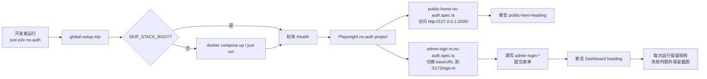

# PRD: 为仓库添加第一条可运行的 Playwright E2E 冒烟测试

> 本 PRD 分两个 altitude：**Part A · 人审层**（决定该不该做、做得对不对，含介入与风险地图）；**Part B · 执行器层**（实现细节，人只在风险地图点名处下钻）。

---

# Part A · 人审层 (Review Layer)

## 1. Introduction & Goals

### Problem Statement

当前仓库已经配备了 `tests/playwright-e2e/` Playwright 测试包、`just e2e*` 命令以及公共/admin 双认证域，但该包仍是模板状态：URL/端口/健康检查路径与项目实际 `just run` 默认不一致，前端页面缺少稳定的 E2E 选择器，也没有覆盖「public 首页可访问 + admin 登录成功」的真实冒烟测试。开发者和 CI 无法通过一条 `just e2e` 命令快速确认关键用户入口是否可用。

### Interpretation (解读回显)

我把需求读成：**在现有 Playwright 框架上，为当前项目适配并落地两条真实 E2E 冒烟用例**——

1. 不登录即可访问 public 前端首页，并能看到核心 Hero 文案/元素；
2. 通过 admin 前端登录表单，使用真实管理员凭据登录后进入 Dashboard。

为此需要：补齐前端 `data-testid` 锚点、修正 E2E 环境默认值（端口/健康路径）、增加测试文件，并确保 `just e2e` 入口可用。不涉及改造认证服务、不新增业务表、不做视觉回归。如果你其实想同时覆盖 public 用户注册/登录流程或 Docker Compose 一键 E2E，这条解读就是错的——请在此纠正（第一次人类触点）。

### What The User Gets

- 开发者运行 `just e2e-install && just e2e no-auth` 即可验证 public 首页可用。
- 开发者运行 `just e2e smoke` 即可验证 admin 前端登录链路可用。
- 测试运行后可在 `tests/playwright-e2e/playwright-report/` 查看 HTML 报告，且每个测试都保留视频（便于对比通过/失败上下文）。
- 后续新 E2E 用例可直接复用本次建立的 admin no-auth 模式、`data-testid` 约定和 `tests/playwright-e2e/.env.e2e.local` 凭据样例。

### Measurable Objectives

- `just e2e no-auth` 在本地 stack 就绪后 90 秒内通过 public 首页断言。
- `just e2e smoke` 在本地 stack 就绪后 90 秒内通过 admin 表单登录断言。
- `tests/playwright-e2e/playwright-report/index.html` 在运行后生成，且每次运行都保留视频（便于回放通过/失败用例）。
- 不引入新的后端服务、数据库迁移或外部依赖。

---

## 2. Human Review Map (介入与风险地图)

判定菜单：固定区域 ① Core 逻辑/编排 `core/`；② 数据库结构/schema/迁移（即使在 `infrastructure/` 下）；③ 安全/鉴权/信任边界；④ 对外 API 契约/破坏性变更。横切触发器 ⑤ 资金/计费；⑥ 不可逆/破坏性数据操作；⑦ 并发/事务/幂等。

**命中的人审项**：本次无人工确认项。

**未命中**（默认执行器 + 自动门禁）：①②③④⑤⑥⑦。

- ① Core 逻辑：本次只增加测试，不修改任何业务编排。
- ② 数据库结构：无 schema/迁移变更。
- ③ 安全/鉴权：只复用现有登录端点，凭据来自环境变量，不改动信任边界。
- ④ 对外 API 契约：不新增、不修改 API 契约。
- ⑤ 资金/计费：无关。
- ⑥ 不可逆/破坏性数据操作：测试不写不可逆批量操作；admin 登录只读自己的会话 Cookie。
- ⑦ 并发/事务/幂等：无关。

| 改动点 | 架构层 | 风险 | 介入方式（人工确认=高证据负担 / 执行器+门禁=兜底） | 证据 / Oracle |
|---|---|---|---|---|
| public 首页 `data-testid` 与 no-auth 冒烟测试 | frontend-public / tests | 低 | 执行器 + 自动门禁 | `rv-1`：HTML 报告与视频；`just e2e no-auth` 通过 |
| admin 登录表单 `data-testid` 与 smoke 冒烟测试 | frontend-admin / tests | 低 | 执行器 + 自动门禁 | `rv-2`：HTML 报告与视频；`just e2e smoke` 通过 |
| Playwright 环境默认值与 just 入口适配 | tests / tooling | 低 | 执行器 + 自动门禁 | `rv-3`：`just e2e-install` 成功；`just e2e` 命令不报错退出 |

**如何证明它生效（真实入口，白话）**：启动本地后端 + 两个前端后，直接跑 `just e2e-install && just e2e no-auth` 看到 public 首页断言通过；再跑 `just e2e smoke` 看到 admin 登录表单提交后进入 Dashboard。也可以用通用证据收集器 `just e2e-evidence <prd> rv-2` 自动跑 rv-2 并把报告/日志/视频放到 `tasks/evidence/<prd>/`。故意把 admin 密码改错或删掉 `data-testid` 时，对应测试会失败并保留视频。

**数据库结构评审**：本次无数据库结构变化。

---

## 3. Usage And Impact After Implementation

### 开发者（运行 E2E）

1. 准备环境：
   ```bash
   cp .env.example .env.local
   # 编辑 .env.local，确保 AUTH_ADMIN_BOOTSTRAP_USERNAME / AUTH_ADMIN_BOOTSTRAP_PASSWORD 有真实值
   # 并配置好 DATABASE_URL / REDIS_URL

   cp tests/playwright-e2e/.env.e2e.example tests/playwright-e2e/.env.e2e.local
   # 编辑 .env.e2e.local（仅覆盖凭据；URL 默认会从 `just run` 写入的 git run-state 读取）
   ```
2. 启动本地服务（端口会自动写入 `.git/vanta-run.env`，E2E 会据此自动定位）：
   ```bash
   just run
   ```
3. 首次安装 Playwright：
   ```bash
   just e2e-install
   ```
4. 运行冒烟测试：
   ```bash
   just e2e no-auth   # public 首页
   just e2e smoke     # admin 登录
   just e2e           # 全部（不含视觉回归）
   just e2e report    # 查看 HTML 报告
   ```
5. 一键收集某条 PRD 的 E2E 验收证据（通用能力，复用于未来 PRD）：
   ```bash
   just e2e-evidence tasks/pending/P2-FEAT-20260701-133736-playwright-e2e-smoke-tests.md rv-2
   just e2e-evidence tasks/pending/P2-FEAT-20260701-133736-playwright-e2e-smoke-tests.md     # 跑全部 e2e/smoke/manual oracle
   ```

### 对既有行为的影响

- 两个前端各增加若干 `data-testid` HTML 属性，不改变可见 UI、文案或交互逻辑。
- `just e2e-install` 改用 `pnpm`，与 `frontend-admin/`、`frontend-public/` 的包管理器一致，不影响原有 `npm` 用户（仅 e2e 包自身使用 pnpm）。
- 不修改后端认证、会话、数据库迁移或 API 路由。

---

## 4. Requirement Shape

- **actor**：开发者 / CI。
- **trigger**：执行 `just e2e*` 命令，或在本地运行 Playwright。
- **expected behavior**：无需登录即可验证 public 首页；使用真实管理员凭据可通过 admin 前端登录并看到 Dashboard；失败时保留视频与 HTML 报告。
- **explicit scope boundary**：
  - 仅覆盖 public 首页可见性和 admin 登录成功路径；
  - 不覆盖 public 用户注册/登录、密码错误提示、登出、admin 业务功能；
  - 不修改认证服务实现；
  - 不引入视觉回归或截图基线。

---

# Part B · 执行器层 (Build Layer)

## 5. Repository Context And Architecture Fit

### 当前相关模块

- **E2E 包**：`tests/playwright-e2e/`
  - `playwright.config.ts`：已配置 `chromium`（public 认证）、`no-auth`、`admin`、`admin-setup` 四个 project，视频策略已改为 `video: 'on'`（通过/失败均保留视频）。
  - `support/env.ts`：解析 `PLAYWRIGHT_*` 环境变量与凭据；dev 模式默认 URL 优先读取 `just run` 写入的 git run-state（`.git/vanta-run.env`）中的端口，避免硬编码。
  - `scripts/stack-control.mjs`：docker/dev 启动与就绪轮询；默认健康检查路径已从 `/healthz` 修正为 `/health`。
  - `tests/setup/auth.setup.ts`、`tests/setup/admin-auth.setup.ts`：已通过 `/api/auth/login`、`/api/admin/auth/login` 完成 API 登录并持久化 storage state。
  - `tests/workflows/no-auth-example.no-auth.spec.ts`：已有的 no-auth 示例，指向 `/login`。
- **前端应用**：
  - `frontend-public/`：Next.js 16 + React 19，public 首页为 `app/(marketing)/page.tsx`，登录表单 `app/(auth)/login/login-form.tsx` 已带 `data-testid`。
  - `frontend-admin/`：TanStack Router + Vite，登录路由 `src/routes/(auth)/sign-in.tsx`，表单组件 `src/features/auth/sign-in/components/user-auth-form.tsx` 已添加 `admin-login-identifier-input`、`admin-login-password-input`、`admin-login-submit-button` 三个 `data-testid`。
- **后端认证**：
  - `src/backend/api/auth_router.py`：`POST /auth/login`。
  - `src/backend/api/admin/admin_auth_router.py`：`POST /admin/auth/login`。
  - `src/backend/main.py`：启动时按 `AUTH_ADMIN_BOOTSTRAP_USERNAME/PASSWORD` 幂等创建 admin 用户。
- **本地运行入口**：`justfile`
  - `just run` 默认启动 backend:8000、admin:5173、public:3000，并把实际端口写入 `.git/vanta-run.env`；`scripts/shared/worktree/create.sh` 为新 worktree 分配随机端口并写入对应 run-state，防止多 worktree 冲突。
  - `just e2e-install` 在 `justfile.shared` 中写死 `npm install && npx playwright install chromium`。

### 架构约束

- 不改变后端四层依赖方向（`api -> core -> engines -> infrastructure`）。
- 不修改认证核心逻辑；E2E 只通过已有 HTTP 入口和浏览器表单验证行为。
- `data-testid` 仅作为测试锚点，不能用于样式或业务逻辑。
- `frontend-admin/` 与 `frontend-public/` 均使用 `pnpm`（`packageManager: pnpm@11.3.0`）。

### 前端影响

- `frontend-public/app/(marketing)/page.tsx`：为 Hero 主标题增加 `data-testid="public-hero-heading"`。
- `frontend-admin/src/features/auth/sign-in/components/user-auth-form.tsx`：为账号输入框、密码输入框、提交按钮增加 `data-testid`（`admin-login-identifier-input`、`admin-login-password-input`、`admin-login-submit-button`）。
- 其余前端 UI、路由、状态、API 调用不变。

### 相关 PRD 关系

- `tasks/archive/P1-FEAT-20260625-182322-dual-auth-domain-separation.md`：已实现 admin/public 双域认证与独立 storage state，本次直接复用其结论。
- `tasks/pending/P1-FEAT-20260625-105550-frontend-public-agent-platform.md`：正在把 `frontend-public` 改造成 Agent 平台；本次 E2E 只验证首页可访问，不依赖其业务 API 完成状态，二者独立。
- 未发现重复或待前置的 E2E 相关 pending PRD。

---

## 6. Recommendation

### Recommended Approach

采用**最小改动路径**：

1. 在两个前端的关键元素上添加 `data-testid`（public 首页 Hero、admin 登录表单）。
2. 新增两个 Playwright spec 文件：`public-home.no-auth.spec.ts` 和 `admin-sign-in.no-auth.spec.ts`。
3. 修正 `support/env.ts` 与 `scripts/stack-control.mjs` 的默认端口/健康路径，使其与 `just run` 和 Docker Compose 对齐；`support/env.ts` 动态读取 `just run` 写入的 git run-state 端口。
4. 在 `scripts/shared/worktree/create.sh` 中为新 worktree 分配随机端口并写入 run-state，避免多 worktree 同时运行时的端口冲突。
5. 在项目 `justfile` 中覆盖 `e2e-install`，改用 `pnpm` 安装依赖和浏览器。
6. 新增通用 PRD E2E 证据收集器 `scripts/e2e/run-prd-evidence.sh` + `just e2e-evidence <prd> [rv-id]`，任何后续 PRD 的 e2e/smoke/manual oracle 都能复用。

### 为什么这是最小且最贴合当前架构的方案

- 现有 Playwright 包已具备 project 划分、storage state、global setup/teardown；不需要新建框架或 CI 工作流。
- 仅添加 `data-testid` 不影响用户可见界面，是最稳定的 E2E 选择器策略（与现有 public 登录表单保持一致）。
- admin 登录使用真实表单提交，验证的是浏览器端到 API 的完整链路；复用现有 `admin-auth.setup.ts` 可继续为其他 admin 测试提供已认证 storage state。
- 修正 env 默认值是必要的，否则 `just e2e` 在本地 dev 模式会连错端口或健康检查 404；改为读取 `just run` 的 run-state 后，无需在 `.env.e2e.local` 中写死端口，也能兼容 worktree 随机端口。

### Proposed Solution Summary (实现机制)

- **核心机制**：在现有 Playwright 框架内新增 no-auth 项目用例，直接通过浏览器访问真实前端 URL 并断言页面元素。
- **输入/配置**：环境变量 `PLAYWRIGHT_ADMIN_IDENTIFIER` / `PLAYWRIGHT_ADMIN_PASSWORD`（或 fallback 到 `AUTH_ADMIN_BOOTSTRAP_*`）提供 admin 凭据；`support/env.ts` 提供默认 URL，优先读取 `just run` 写入 git run-state 的实际端口，避免硬编码。
- **入口/边界**：
  - public 首页测试挂在 `no-auth` project，使用默认 `baseURL`。
  - admin 登录测试也挂在 `no-auth` project，但在 spec 内通过 `test.use({ baseURL: getAdminBaseUrl() })` 切换到 admin 前端 URL。
- **输出/行为变化**：`just e2e no-auth` 和 `just e2e smoke` 会产生可运行的真实入口断言；失败时 `tests/playwright-e2e/test-results/` 与 `playwright-report/` 保留视频/截图。新增 `just e2e-evidence` 命令会自动把日志、报告和视频收集到 `tasks/evidence/<prd>/`。
- **刻意避免的复杂度**：不改后端、不做视觉回归基线、不新增独立服务、不引入新的 page-object 抽象（先保持单文件测试）。

### Alternatives Considered

- ** heavier：新建一个 `admin-form-login` project 并复用 admin-setup 依赖**。 rejected：admin-setup 已经是 API 登录；要测表单登录必须从头开始访问 `/sign-in`，放在 `no-auth` project 并用 `test.use` 切换 baseURL 更简单。
- ** heavier：为 admin 登录新增独立的 page object 和 fixture**。rejected：当前只有一条 admin 登录测试，直接 inline selector 即可；等用例增多再提取 page object。

---

## 7. Implementation Guide

> This section is a living implementation guide based on current repository analysis. If implementation discovers additional affected files, hidden dependencies, edge cases, or a better path, update this PRD before proceeding.

### Core Logic

数据/控制流：

1. 开发者运行 `just e2e-install` → 在 `tests/playwright-e2e/` 执行 `pnpm install && pnpm exec playwright install chromium`。
2. 开发者运行 `just e2e no-auth` → Playwright global setup 根据 `PLAYWRIGHT_STACK_MODE`/`PLAYWRIGHT_SKIP_STACK_BOOT` 决定启动/等待本地 stack；`support/env.ts` 从 `.git/vanta-run.env` 读取 `just run` 端口；然后运行 `*.no-auth.spec.ts`。
3. `public-home.no-auth.spec.ts`：访问 `/`，断言 `data-testid="public-hero-heading"` 可见且文本包含核心定位。
4. `admin-sign-in.no-auth.spec.ts`：通过 `test.use` 切换 baseURL 到 admin 前端，访问 `/sign-in`，填写 `admin-login-*` 输入框，点击提交，等待 URL 不再是 `/sign-in` 并断言 Dashboard 标题可见。
5. 测试完成后 Playwright `video: 'on'` 保留所有用例视频，`screenshot: 'only-on-failure'` 在失败时保留截图。

### Change Impact Tree

```text
.
├── frontend-public/
│   └── app/(marketing)/page.tsx
│       [修改]
│       【总结】为 Hero 主标题添加 data-testid="public-hero-heading"，供 E2E 冒烟测试稳定断言。
│
│       ├── 在 <h1> 让 Agent … 为你工作 </h1> 上增加 data-testid="public-hero-heading"
│
├── frontend-admin/
│   └── src/features/auth/sign-in/components/user-auth-form.tsx
│       [修改]
│       【总结】为 admin 登录表单的账号、密码、提交按钮添加 data-testid，与 public 登录表单约定保持一致。
│
│       ├── 账号输入框 <Input> 增加 data-testid="admin-login-identifier-input"
│       ├── 密码输入框 <PasswordInput> 增加 data-testid="admin-login-password-input"
│       └── 提交按钮 <Button> 增加 data-testid="admin-login-submit-button"
│
├── tests/playwright-e2e/
│   ├── support/env.ts
│   │   [修改]
│   │   【总结】默认 URL 不再硬编码端口，而是读取 `just run` 写入的 git run-state（`.git/vanta-run.env`）中的 `BACKEND_PORT/FRONTEND_PORT/FRONTEND_PUBLIC_PORT`；未找到 run-state 时仍使用原固定端口 fallback。
│   │
│   │   ├── 新增 readRunState() 通过 `git rev-parse --git-path vanta-run.env` 定位并解析 run-state
│   │   ├── getBaseUrl() dev fallback 使用 runState.FRONTEND_PUBLIC_PORT ?? '3000'
│   │   ├── getAdminBaseUrl() dev fallback 使用 runState.FRONTEND_PORT ?? '5173'（Vite dev 只绑 localhost）
│   │   ├── getApiBaseUrl() dev fallback 使用 runState.BACKEND_PORT ?? '8000'
│   │   └── getHealthUrl() 默认改为 ${apiBaseUrl}/health
│   │
│   ├── playwright.config.ts
│   │   [修改]
│   │   【总结】将 video 策略改为 'on'，确保通过/失败用例都保留视频证据。
│   │
│   │   ├── use.video 从 'retain-on-failure' 改为 'on'
│   │
│   ├── scripts/stack-control.mjs
│   │   [修改]
│   │   【总结】修正就绪轮询默认健康路径为 /health，与 backend health_router 一致。
│   │
│   │   ├── resolveModeDefaults() 中 readinessUrlList 的 health URL 从 /healthz 改为 /health
│   │
│   ├── tests/smoke/public-home.no-auth.spec.ts
│   │   [新增]
│   │   【总结】public 首页 no-auth 冒烟测试，断言 Hero 标题可见且包含关键文案。
│   │
│   │   ├── test('public home page loads and shows hero heading')
│   │   └── 使用 page.goto('/') + getByTestId('public-hero-heading')
│   │
│   ├── tests/smoke/admin-sign-in.no-auth.spec.ts
│   │   [新增]
│   │   【总结】admin 前端登录表单冒烟测试，使用真实凭据提交并验证进入 Dashboard。
│   │
│   │   ├── test.use({ baseURL: getAdminBaseUrl() })
│   │   ├── test('admin sign-in form logs in and redirects to dashboard')
│   │   ├── 填写 admin-login-identifier-input / admin-login-password-input
│   │   ├── 点击 admin-login-submit-button
│   │   └── 断言 URL 不再是 /sign-in 且页面出现 heading "Dashboard"
│   │
│   └── README.md
│       [修改]
│       【总结】更新适配清单与运行示例，说明 public/admin 默认端口、凭据来源、新冒烟测试文件、通用证据收集器用法。
│
├── scripts/e2e/run-prd-evidence.sh
│   [新增]
│   【总结】通用 PRD Realistic Validation Plan 执行器，解析 PRD 中的 YAML oracle 块并运行指定 rv-id，自动收集报告/视频/日志到 tasks/evidence/。
│
│   ├── 接收参数 <prd-file> [rv-id]
│   ├── 加载 `tests/playwright-e2e/.env.e2e.local`
│   ├── 使用 Python + yaml 解析 oracle 块
│   ├── 执行 real_entry 命令并捕获输出
│   └── 复制 playwright-report / test-results 到 tasks/evidence/<prd-basename>/<rv-id>-*/
│
├── tests/playwright-e2e/.env.e2e.example
│   [新增]
│   【总结】E2E 凭据覆盖模板，使用者复制为 `tests/playwright-e2e/.env.e2e.local` 后填入真实密码；该文件只包含凭据，不包含 URL，URL 由 `support/env.ts` 根据 git run-state 动态决定。`tests/playwright-e2e/.env.e2e.local` 已被 gitignore。
│
├── scripts/shared/worktree/create.sh
│   [修改]
│   【总结】创建 worktree 后自动生成随机运行端口并写入该 worktree 的 git run-state（`.git/vanta-run.env`），避免多个 worktree 同时 `just run` 时端口冲突。
│
├── justfile
│   [修改]
│   【总结】覆盖 justfile.shared 的 e2e-install，并新增通用证据收集入口 just e2e-evidence <prd> [rv-id]。
│
│   ├── 新增 e2e-install recipe：cd tests/playwright-e2e && pnpm install && pnpm exec playwright install chromium
│   └── 新增 e2e-evidence recipe：调用 scripts/e2e/run-prd-evidence.sh
│
└── docs/guides/e2e.md
    [新增]
    【总结】补充 E2E 快速开始文档，包含环境准备、启动顺序、常用命令、凭据配置、通用证据收集器用法。
```

### Executor Drift Guard

- 如果 `frontend-public/` 首页文案或路由发生大改，`data-testid="public-hero-heading"` 仍应保留；测试只断言该 testid 可见，不依赖具体文案。
- 如果 admin 前端登录后落地页变化，可改为断言 `page.getByRole('heading', { name: 'Dashboard' })` 不存在失败；Executor 应检查 `frontend-admin/src/routes/_authenticated/index.tsx` 是否仍指向 Dashboard。
- 若后端健康路径又改为 `/healthz` 以外的值，用 `rg "@health_router.get" src/backend/api/health_router.py` 确认真实路径。
- 若 `just run` 默认端口调整，同步更新 `support/env.ts` 的 fallback 与 `scripts/shared/worktree/create.sh` 的随机端口范围。
- 在多 worktree 场景下，确认每个 worktree 的 `.git/vanta-run.env` 端口互不冲突。
- 搜索现有 testid 避免命名冲突：
  ```bash
  rg "data-testid=\"[^\"]*login" frontend-public frontend-admin tests/playwright-e2e
  ```

### Flow or Architecture Diagram



### ER Diagram

No data model changes in this PRD.

### Realistic Validation Plan

```yaml
- id: rv-1
  behavior: public 首页在浏览器中加载并显示 Hero 主标题
  real_entry: |
    cd /Users/zata/code/zata_code_template/tests/playwright-e2e && \
    PLAYWRIGHT_SKIP_STACK_BOOT=1 \
    pnpm exec playwright test tests/smoke/public-home.no-auth.spec.ts
  expected: |
    控制台输出类似 "1 passed"；playwright-report/index.html 中 public home page loads 测试为绿色。URL 默认从 `just run` 写入的 git run-state 读取，无需在命令中硬编码端口。
  mock_boundary: 无需 mock；测试直接访问真实 public 前端与后端健康检查。
  negative_control: |
    临时删除 frontend-public/app/(marketing)/page.tsx 中的 data-testid="public-hero-heading" 再运行同一命令。
  expected_fail: |
    测试 RED，报错 "Error: strict mode violation: getByTestId('public-hero-heading') resolved 0 elements"。
  test_layer: e2e
  required_for_acceptance: true

- id: rv-2
  behavior: admin 前端登录表单提交后重定向到 Dashboard
  real_entry: |
    # 需要 tests/playwright-e2e/.env.e2e.local 或环境变量中已设置 PLAYWRIGHT_ADMIN_PASSWORD
    cd /Users/zata/code/zata_code_template/tests/playwright-e2e && \
    PLAYWRIGHT_SKIP_STACK_BOOT=1 \
    pnpm exec playwright test tests/smoke/admin-sign-in.no-auth.spec.ts
  expected: |
    控制台输出类似 "1 passed"；playwright-report/index.html 中 admin sign-in form 测试为绿色，且未停留在 /sign-in。admin 前端 URL 默认从 git run-state 读取，不再在命令或 .env 样例中硬编码端口；该命令只跑这一条 spec，不跑整个 smoke 目录。
  mock_boundary: 无需 mock；表单通过真实 admin 前端调用真实 /api/admin/auth/login。
  negative_control: |
    复制 tests/playwright-e2e/.env.e2e.example 为 tests/playwright-e2e/.env.e2e.local 并将 PLAYWRIGHT_ADMIN_PASSWORD 改为错误值，再运行同一命令（或 just e2e-evidence ... rv-2）。
  expected_fail: |
    测试 RED，停留在 /sign-in 或提交按钮重新可用，报告附带失败视频。
  test_layer: e2e
  required_for_acceptance: true

# 注：rv-1 / rv-2 / rv-3 均可用通用收集器复用：
#   just e2e-evidence tasks/pending/P2-FEAT-20260701-133736-playwright-e2e-smoke-tests.md rv-2
# 该命令会读取 PRD 中的 real_entry、加载 tests/playwright-e2e/.env.e2e.local、并把报告/视频/日志放到 tasks/evidence/<prd>/。

- id: rv-3
  behavior: e2e 入口与依赖安装命令可执行且通过
  real_entry: |
    # 需要本地 stack 已运行（如 just run），且 tests/playwright-e2e/.env.e2e.local 中已配置凭据
    cd /Users/zata/code/zata_code_template && \
    just e2e-install && \
    PLAYWRIGHT_SKIP_STACK_BOOT=1 \
    just e2e
  expected: |
    just e2e-install 成功安装 Chromium；PLAYWRIGHT_SKIP_STACK_BOOT=1 just e2e 完成所有测试（不含 visual regression）并生成 playwright-report/index.html。
  mock_boundary: 安装过程从网络下载 Playwright 浏览器；测试运行时访问本地真实服务。
  negative_control: |
    本地 stack 运行的情况下，设置错误的健康检查地址：PLAYWRIGHT_HEALTH_URL=http://127.0.0.1:99999/health PLAYWRIGHT_SKIP_STACK_BOOT=1 just e2e。
  expected_fail: |
    global-setup 就绪轮询超时，测试套件报错 "Timed out waiting for Playwright stack readiness"。
  test_layer: smoke
  required_for_acceptance: true
```

**Failure Triage Note**：若 `rv-1`/`rv-2` 失败，首先检查本地服务是否真在运行（`just run` 会写入 `.git/vanta-run.env`，可用 `cat $(git rev-parse --git-path vanta-run.env)` 查看实际端口）以及 `PLAYWRIGHT_HEALTH_URL` 是否指向 `/health`；其次确认命令确实只跑了目标 spec（如 `tests/smoke/admin-sign-in.no-auth.spec.ts`），而不是被其他 smoke 测试的副作用影响。在多 worktree 场景下确认各 worktree 的 run-state 端口没有冲突。若 `rv-3` 安装失败，检查 Node/pnpm 版本与网络代理。

### Low-Fidelity Prototype

Not required. UI 改动仅为不可见的 `data-testid` 属性。

### Interactive Prototype Change Log

No interactive prototype file changes in this PRD.

### External Validation

No external validation required; repository evidence was sufficient.

---

## 8. Delivery Dependencies

### Delivery Dependencies

- Group: none
- Depends on groups:
  - none
- Depends on tasks/issues:
  - none
- Gate type: none
- Notes: 双认证域分离 PRD 已归档完成，本 PRD 独立运行；frontend-public Agent 平台改造不影响本次冒烟测试。

---

## 9. Acceptance Checklist

### Human-Confirmed

本次无人工确认项，本节为空。

### Architecture Acceptance

- [ ] `frontend-public/` 与 `frontend-admin/` 仅增加 `data-testid`，无业务逻辑、路由或状态变化（`git diff -- frontend-public frontend-admin` 仅出现 data-testid 相关行）。
- [ ] 后端 `src/backend/` 无代码变更。
- [ ] 未新增数据库表或 Alembic 迁移文件（`ls alembic/versions/` 与基线一致）。

### Dependency Acceptance

- [ ] `tests/playwright-e2e/` 使用 `pnpm` 锁定依赖，无新增 `package-lock.json`（`ls tests/playwright-e2e/package-lock.json` 应不存在）。
- [ ] `just e2e-install` 执行后 `tests/playwright-e2e/node_modules/.bin/playwright` 存在并可运行。
- [ ] 通用证据收集脚本 `scripts/e2e/run-prd-evidence.sh` 可执行（`test -x scripts/e2e/run-prd-evidence.sh`）。

### Behavior Acceptance

- [ ] public 首页测试通过：`cd tests/playwright-e2e && PLAYWRIGHT_SKIP_STACK_BOOT=1 pnpm exec playwright test tests/smoke/public-home.no-auth.spec.ts` → 控制台显示 1 passed，HTML 报告绿色。
- [ ] admin 登录测试通过：方式 A（需提前在 `tests/playwright-e2e/.env.e2e.local` 或环境变量中设置 PLAYWRIGHT_ADMIN_PASSWORD）`cd tests/playwright-e2e && PLAYWRIGHT_SKIP_STACK_BOOT=1 pnpm exec playwright test tests/smoke/admin-sign-in.no-auth.spec.ts` → 控制台显示 1 passed；方式 B（复用收集器）`just e2e-evidence tasks/pending/P2-FEAT-20260701-133736-playwright-e2e-smoke-tests.md rv-2` → 退出码 0 并在 `tasks/evidence/P2-FEAT-20260701-133736-playwright-e2e-smoke-tests/` 下生成 `rv-2-output.log`、`rv-2-playwright-report/`、`rv-2-test-results/`。
- [ ] 故意改错 admin 密码后 `pnpm exec playwright test tests/smoke/admin-sign-in.no-auth.spec.ts` 或 `just e2e-evidence ... rv-2` 失败，并能在对应 `test-results/` 目录找到失败视频。
- [ ] worktree 随机端口生效：创建一个新 worktree 后，`.git/vanta-run.env` 被写入与主仓库不同的 `BACKEND_PORT/FRONTEND_PORT/FRONTEND_PUBLIC_PORT`，且 `just run` 在该 worktree 中实际监听这些端口。

### Frontend Acceptance

- [ ] `rg "data-testid=\"public-hero-heading\"" frontend-public/app/(marketing)/page.tsx` 命中。
- [ ] `rg "data-testid=\"admin-login-(identifier|password|submit)" frontend-admin/src/features/auth/sign-in/components/user-auth-form.tsx` 命中三处。

### Documentation Acceptance

- [ ] `tests/playwright-e2e/README.md` 已更新，说明 `just run` 会写入 git run-state、E2E 默认 URL 从 run-state 读取、凭据来源（`tests/playwright-e2e/.env.e2e.local`）、新增 smoke 文件位置。
- [ ] `docs/guides/e2e.md` 已新增，包含 "环境准备 → 启动服务 → 运行测试 → 查看报告" 的完整命令流，并说明 worktree 场景下的随机端口行为。

### Validation Acceptance

- [ ] `rv-1` 已执行并通过（真实入口：`cd tests/playwright-e2e && PLAYWRIGHT_SKIP_STACK_BOOT=1 pnpm exec playwright test tests/smoke/public-home.no-auth.spec.ts`）。
- [ ] `rv-2` 已执行并通过（真实入口：`cd tests/playwright-e2e && PLAYWRIGHT_SKIP_STACK_BOOT=1 pnpm exec playwright test tests/smoke/admin-sign-in.no-auth.spec.ts` 或 `just e2e-evidence ... rv-2`）。
- [ ] `rv-3` 已执行并通过（真实入口：`just e2e-install && PLAYWRIGHT_SKIP_STACK_BOOT=1 just e2e`，本地 stack 已运行且凭据已配置）。
- [ ] `rv-3` 的 negative control 已执行：设置错误的 `PLAYWRIGHT_HEALTH_URL` 后，`global-setup` 轮询超时并报错。
- [ ] 通用证据收集器已验证：对任意其他 pending PRD 的 e2e oracle，运行 `just e2e-evidence <other-prd>.md <rv-id>` 能解析 YAML、执行命令并输出证据到 `tasks/evidence/<prd>/`。
- [ ] `rv-1` / `rv-2` / `rv-3` 的 negative control 至少各执行一次，确认测试会失败并保留视频（rv-3 主要验证超时行为）。

### Delivery Readiness

- [ ] `just e2e-install && PLAYWRIGHT_SKIP_STACK_BOOT=1 just e2e` 在本地完整 stack 就绪、凭据已配置后通过。
- [ ] 无新增 lint/typecheck 错误：在 `tests/playwright-e2e/` 执行 `pnpm run lint && pnpm run typecheck` 通过。
- [ ] PRD 已保存到 `tasks/pending/P2-FEAT-20260701-133736-playwright-e2e-smoke-tests.md`。

---

## 10. Functional Requirements

- **FR-1**：public 首页无需登录即可加载，且页面上存在 `data-testid="public-hero-heading"` 的元素。
- **FR-2**：admin 登录表单在填写正确凭据并提交后，浏览器 URL 离开 `/sign-in` 并显示 Dashboard 页面核心标题。
- **FR-3**：`support/env.ts` 与 `scripts/stack-control.mjs` 的默认 URL/健康路径与 `just run` 保持一致；`support/env.ts` 优先读取 `just run` 写入 git run-state 的实际端口，并在无 run-state 时 fallback 到 backend:8000、admin:5173、public:3000、health:/health。
- **FR-4**：项目 `justfile` 提供 `e2e-install` recipe，使用 `pnpm` 安装 `tests/playwright-e2e/` 依赖并下载 Chromium。
- **FR-5**：每次 E2E 运行都会生成视频并保留到 `tests/playwright-e2e/test-results/`；失败时额外保留截图（`video: 'on'`、`screenshot: 'only-on-failure'`）。
- **FR-6**：项目提供通用 PRD E2E 证据收集器 `just e2e-evidence <prd-file> [rv-id]`，能解析 PRD 中的 YAML oracle 块、执行 `real_entry` 命令，并将日志/报告/视频收集到 `tasks/evidence/<prd-basename>/`。

---

## 11. Non-Goals

- 不覆盖 public 用户注册/登录成功/失败流程。
- 不覆盖 admin 登出、密码重置或多因素认证。
- 不做视觉回归测试或截图基线管理（现有 `@visual` 测试保持原样）。
- 不修改 CI 工作流或 Docker Compose 服务定义。
- 不引入新的外部测试服务或 SaaS（BrowserStack、Percy 等）。
- 不改动后端认证、会话、权限核心逻辑。

---

## 12. Risks And Follow-Ups

- **风险 1：本地 stack 未就绪导致测试失败**。缓解：README 与 docs/guides/e2e.md 明确前置步骤；`global-setup` 会轮询 `/health` 并在超时后给出清晰错误。
- **风险 2：admin 凭据未配置或密码强度不满足未来策略**。缓解：测试优先读取 `PLAYWRIGHT_ADMIN_IDENTIFIER/PASSWORD`，fallback 到 `AUTH_ADMIN_BOOTSTRAP_*`；文档说明需在 `tests/playwright-e2e/.env.e2e.local` 或 `.env.local` 设置真实值。
- **风险 3：前端路由/文案重构后测试变脆**。缓解：使用 `data-testid` 锚点，不依赖具体文案；后续若 Dashboard 标题变化，同步调整 `admin-sign-in.no-auth.spec.ts` 中的 heading 断言。
- **风险 4：多 worktree 同时运行时端口冲突**。缓解：`scripts/shared/worktree/create.sh` 已为每个 worktree 分配随机端口；运行 `just run` 前可检查 `.git/vanta-run.env` 确认端口未被占用。
- **非阻塞后续**：当 public 注册/登录流程稳定后，可新增 `public-login.spec.ts` 覆盖完整用户登录路径。

---

## 13. Decision Log

| ID | Decision | Chosen | Rejected | Rationale |
|---|---|---|---|---|
| D-01 | 前端测试锚点策略 | 使用 `data-testid`（与现有 public 登录表单一致） | 使用 CSS class 或文本选择器 | `data-testid` 不受样式重构影响，且项目 Playwright 已配置 `testIdAttribute: 'data-testid'`。 |
| D-02 | admin 表单登录测试挂哪个 project | 放在 `no-auth` project，通过 `test.use({ baseURL: getAdminBaseUrl() })` 切换 URL | 新增独立 project 或复用 `admin` project | `no-auth` project 不跑 setup，最符合"从登录页开始"的测试；避免与现有 `admin-setup` API 登录冲突。 |
| D-03 | 是否更新 Playwright env 默认值 | 更新为项目实际端口（public:3000/admin:5173/health） | 保持模板默认值并在文档中说明手动覆盖 | 默认值错误会让首次 `just e2e` 直接失败，更新默认值是最小修复。 |
| D-04 | e2e-install 使用 npm 还是 pnpm | 在项目 `justfile` 覆盖为 `pnpm install` | 保持 `justfile.shared` 的 `npm install` | `frontend-admin`/`frontend-public` 与 e2e 包均声明 `packageManager: pnpm`，统一工具链减少锁文件冲突。 |
| D-05 | rv-2 证据收集是一次性脚本还是通用能力 | 通用收集器 `scripts/e2e/run-prd-evidence.sh` + `just e2e-evidence <prd> [rv-id]` | 为 rv-2 单独写一个硬编码脚本 | 通用收集器可被任何后续 PRD 的 e2e/smoke/manual oracle 复用，避免每个 PRD 都重复造轮子。 |
| D-06 | E2E 凭据样例与默认 URL 放在哪里 | `tests/playwright-e2e/.env.e2e.example` 只放凭据；URL 由 `support/env.ts` 从 `just run` 的 git run-state 动态读取 | 在仓库根目录放 `.env.e2e.example` 并写死 `PLAYWRIGHT_ADMIN_BASE_URL` | worktree 和随机端口场景下，硬编码 URL 会导致冲突；凭据与 URL 解耦后，`.env.e2e.local` 只需要改密码。 |
| D-07 | worktree 如何防止端口冲突 | `scripts/shared/worktree/create.sh` 在创建时分配随机端口并写入该 worktree 的 run-state | 保持固定端口，依赖用户手动覆盖 | 多 worktree 并行开发常见，自动随机端口能显著降低 `just run` 冲突概率，且与 `support/env.ts` 的动态读取自然衔接。 |

---

## Checklist (Internal PRD Compliance)

- [x] Rewrote the request into a concrete behavior change.
- [x] Inspected the repository before asking questions.
- [x] Searched existing `tasks/pending/` PRDs for duplicates or dependencies.
- [x] Checked relevant `tasks/archive/` PRD for dual-auth context.
- [x] Structured as Part A (Sections 1-4) and Part B (Sections 5-13).
- [x] Section 1 contains no mechanism/commands/dependencies.
- [x] Section 2 Human Review Map includes menu, hits, misses, classification table, plain-language proof, and schema note.
- [x] Every Review Map row references an `rv-id` or concrete gate.
- [x] Section 6 includes Proposed Solution Summary.
- [x] Section 8 includes tool-neutral Delivery Dependencies.
- [x] Section 9 is an evidence-ordered Acceptance Evidence Package.
- [x] Realistic Validation Plan is a structured YAML oracle block with `id/real_entry/expected/mock_boundary/negative_control/expected_fail`.
- [x] No line-number-dependent edit instructions; anchors are semantic or `rg` searches.
- [x] Frontend impact explicitly stated with components/routes.
- [x] Saved to `tasks/pending/P2-FEAT-20260701-133736-playwright-e2e-smoke-tests.md`.
