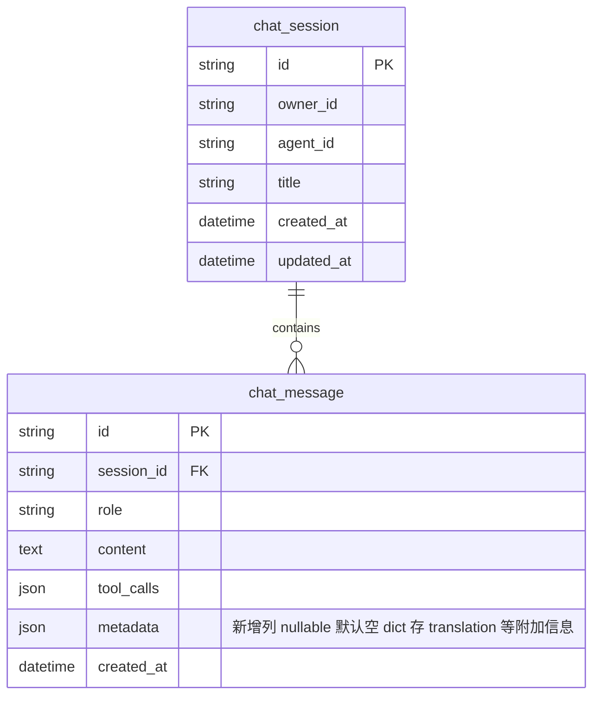

# PRD: 聊天消息中英文翻译（双语适配）

> 本 PRD 分两个 altitude，分别服务不同读者，自上而下阅读：
>
> - **Part A · 人审层 (Review Layer)** — 需求方 / 验收人读这部分，决定"该不该做、做得对不对"，并通过风险地图知道**哪些地方必须亲自确认**。Part A 不出现实现机制、文件路径、命令。
> - **Part B · 执行器层 (Build Layer)** — 实现者（人或 Agent）读这部分动手。人只在 Part A 风险地图**点名处**下钻审查，其余默认交执行器 + 自动门禁（hook / 测试 / 架构检查）。

---

# Part A · 人审层 (Review Layer)

## 1. Introduction & Goals

### Problem Statement

当前仓库的会话消息只有一种语言：用户用中文提问、Agent 用中文（或模型默认语言）回答，消息一旦生成就固定为原始语言。当使用者想用另一种语言阅读某条历史消息（例如把 Agent 的英文技术回复转成中文、或把用户的中文提问翻译给英文协作者看）时，没有任何后端能力支撑——只能靠用户自己复制到外部翻译工具，翻译结果也无法回到会话历史里。参考仓库 `freshai` 已有"服务端翻译单条聊天消息并持久化"的能力；本仓库作为同源模板，目前完全缺失这一块，也没有任何形式的中英文双语适配。

### Interpretation (解读回显)

本次需求被理解为：**参考 `freshai` 的做法，为本仓库增加"后端聊天消息翻译"能力，作为中英文双语适配的第一步**。具体含义：

- "双语"指的是**消息内容的运行时翻译**（中→英、英→中，乃至其他目标语言），不是界面 UI 的中英文切换、也不是文档站点的多语言。`freshai` 本身也没有做 UI 国际化，本 PRD 与其对齐，不扩大范围。
- 使用者可以对任意一条已有会话消息发起翻译请求，指定目标语言；系统在服务端调用 LLM 完成翻译，把结果写回该消息的元数据，后续可重复读取而无需再次调用模型。
- 翻译始终在服务端执行（不在前端直连模型），以保持模型密钥与审计边界统一。
- 本 PRD **不包含**：前端界面 i18n（文案文件、语言切换器）、文档站点多语言、实时双语流式输出、批量翻译整段会话。这些是独立的更大话题，待本 PRD 落地后另行评估。
- 翻译能力挂载在现有的"会话-消息"体系下，不引入新的顶层业务概念。

这是你**前置批准**的对象：批准这条 = 同意按这个解读自动实现（第一次人类触点）。若你期望的"双语适配"其实是 UI 界面中英文切换，请在批准前指出，本 PRD 需要重写。

### What The User Gets

- 任意已登录的会话所有者，可以对会话历史中的某条消息发起"翻译成中文/英文"请求，几秒内拿到翻译后的文本。
- 翻译结果会保存在这条消息上；之后再读取这条消息时，翻译结果依然在，不需要重复翻译、不重复消耗模型额度。
- 翻译由后端统一完成，使用者不需要配置任何模型密钥，也不会接触到模型供应商。
- 调用方（前端或 API 集成方）拿到的是一个结构化结果：翻译文本、目标语言、模型供应商与模型名，便于展示与审计。
- 不翻译、不发起翻译的既有会话与消息，行为完全不变。

### Measurable Objectives

- 已认证的会话所有者能通过一条 HTTP 接口把指定消息翻译成 `zh` 或 `en`，返回体包含 `translated_text`、`target_language`、`provider_name`、`model_name`。
- 翻译结果持久化到消息元数据；对同一条消息再次查询时，元数据中能看到上次翻译的 `target_language` 与 `translated_text`，且不触发新的模型调用。
- 非该会话所有者调用翻译接口被拒绝（403/401），无权访问的消息不存在时也不泄漏其存在性。
- 既有"创建会话、发消息、列消息"路径行为不变；未发起翻译的消息其元数据保持空值/缺省，旧数据无需回填。
- 后端提供确定性 stub 翻译器用于测试，真实 LLM 翻译器在配置齐全时可平滑替换。

---

## 2. Human Review Map (介入与风险地图)

本节决定注意力如何分配：哪些改动**必须人工确认**，哪些交给**执行器 + 自动门禁**（hook / 测试 / 架构检查）。

判定菜单（逐项对照本次改动是否命中）：

- 固定区域：① Core 业务逻辑 / 编排规则（`core/`）② 数据库结构 / schema / 迁移（即使在 `infrastructure/`）③ 安全 / 鉴权 / 信任边界 ④ 对外 API 契约 / breaking change
- 横切触发器（命中即升级，无视所在层）：⑤ 资金 / 计费 / 额度 ⑥ 不可逆 / 破坏性数据操作 ⑦ 并发 / 事务 / 幂等性

**命中的人审项**：

- ① 新增 Core 用例 `MessageTranslateUseCase`（编排翻译 + 持久化 + 所有权校验）
- ② 给 `chat_message` 表新增 `metadata` JSON 列（alembic 迁移）
- ③ 翻译接口必须复用现有鉴权并对"消息所属会话的所有权"做校验
- ④ 新增对外 HTTP 契约 `POST /sessions/messages/{message_id}/translate`
- ⑤ 翻译调用真实 LLM 会产生模型计费（需可观测、可关停）

**未命中**（默认执行器 + 自动门禁）：

- ⑥ 不涉及批量删除/回填/降级迁移；新增列为 nullable，旧行自然兼容。
- ⑦ 单消息翻译幂等性由"覆写式写 metadata"保证，无并发事务热点（最坏自检：若两人同时对同一消息翻译，后写覆盖前写，结果仍是一致可读的翻译，不会损坏数据）。

| 改动点 | 架构层 | 风险 | 介入方式 | 证据 / Oracle（指向 §7.6） |
|---|---|---|---|---|
| `chat_message` 表新增 `metadata` JSON 列 + 迁移 | infrastructure | 高 | 人工确认（schema 变更） | rv-1 |
| `MessageTranslateUseCase` 所有权校验与持久化 | core | 高 | 人工确认（业务编排） | rv-2, rv-3 |
| 翻译接口鉴权与契约 | api | 高 | 人工确认（对外契约 + 信任边界） | rv-2, rv-4 |
| LLM 翻译适配器与计费可关停 | engines | 中 | 人工确认（资金） | rv-5 |
| stub 翻译器、单元/集成测试 | tests | 低 | 执行器+门禁 | rv-3 |

**如何证明它生效（真实入口，白话）**：

- 用真实登录账号创建一个会话、发一条消息，再调翻译接口把这条消息翻成英文，返回里能看到翻译文本、且对该消息再查一次历史能看到翻译结果仍然挂在消息上；换一个不拥有该会话的账号调同一接口应被拒绝。

**数据库结构评审（schema 变化时必填）**：

- `chat_message` 表新增一列 `metadata`（JSON，nullable，默认空 dict/NULL），用于存放翻译结果等附加信息。详见 Part B 第 7.5 节 ER 图。旧行该列为 NULL，读取时按空字典处理，兼容现有逻辑。

---

## 3. Usage And Impact After Implementation

### 终端用户 / End User
- 通过现有的会话消息列表入口，对某条消息触发"翻译"操作（前端是否实现 UI 按钮不在本 PRD 范围；接口就绪后前端可按需接入）。
- 接口入口：`POST /sessions/messages/{message_id}/translate`，请求体 `{"target_language": "en" | "zh"}`，返回翻译文本与模型来源信息。

### 管理员 / Admin
- 不新增管理后台界面。管理员作为普通会话所有者同样可对自己的会话消息发起翻译。

### 开发者 / Developer
- 新增端口 `ChatTranslator`（`core/shared/interfaces`）与用例 `MessageTranslateUseCase`（`core/use_cases`），扩展会话相关 API 时复用现有 `SessionUseCase` 装配链路。
- 扩展翻译能力（如换供应商、加缓存）只需实现 `ChatTranslator` 端口或在 engines 层新增适配器，不改动 core 用例。

### Impact On Existing Behavior
- 既有"创建会话、发送消息、列出消息、删除会话"路径行为与响应不变。
- 新增 `metadata` 列为 nullable，旧数据无需回填；读取旧消息时 metadata 视为空字典，对外响应不出现该字段或出现为空。
- 新增可选配置项用于选择翻译器实现（stub / 真实 LLM）与默认关闭的开关；未配置时默认使用 stub 翻译器，不产生任何外部模型调用。

---

## 4. Requirement Shape

- Actor: 已认证的会话所有者（通过现有会话鉴权机制识别）。
- Trigger: 对自己拥有的某条会话消息发起翻译请求，指定目标语言。
- Expected behavior: 系统校验该消息存在且属于调用者拥有的会话；调用翻译端口把消息内容翻成目标语言；把翻译结果写入该消息的 metadata；返回翻译文本与来源信息。再次查询该消息时仍能看到翻译结果。
- Scope boundary: 不做 UI 界面 i18n、不做文档多语言、不做流式翻译、不做整段会话批量翻译、不做翻译结果的多版本历史（只保留最近一次）。

---

# Part B · 执行器层 (Build Layer)

> 以下供实现者（人或 Agent）使用。人只在 Part A 风险地图点名处下钻审查；其余默认交执行器 + 自动门禁。

## 5. Repository Context And Architecture Fit

- Existing path: `src/backend/core/session/use_cases.py`（`SessionUseCase`，已有 `send_message`/`list_messages`/所有权校验模式）与 `src/backend/api/session_router.py`（`/sessions` 路由，已有 `GET /sessions/{id}/messages`、`POST /sessions/{id}/messages`）。
- Reuse candidates:
  - `src/backend/core/shared/interfaces/session_repository.py`（`SessionRepository` 抽象，需新增 `update_message_metadata`）
  - `src/backend/core/shared/interfaces/llm_client.py`（`LLMClient.chat`，作为真实翻译器的底层模型调用）
  - `src/backend/core/shared/models/session.py`（`ChatMessage` dataclass，需新增 `metadata` 字段）
  - `src/backend/api/dependencies.py`（现有 `get_session_use_case`/`get_llm_client` 装配模式）
  - `src/backend/infrastructure/persistence/repos/session_repo.py`（`SqlAlchemySessionRepository`，需实现 `update_message_metadata`）
- Architecture pattern to preserve: 四层依赖方向 `api -> core -> engines -> infrastructure`。翻译端口（`ChatTranslator`）声明在 `core/shared/interfaces`，真实适配器（`LLMBasedTranslator`）实现放在 `engines`，core 用例只依赖端口。
- Frontend impact: 无前端改动。本 PRD 只交付后端能力；前端是否接入翻译按钮属后续工作，不在本 PRD。
- Existing PRD relationship: 检查 `tasks/pending/` 与 `tasks/archive/` 后，无翻译/i18n 相关 PRD，`independent`。
- Redundancy risks: 不要在 `session_router` 里直接调 `LLMClient`；不要在 `core` 里直接构造 prompt（prompt 属 engines 层适配器职责）。参考 `freshai` 的 `engines/chat/translator_adapter.py` 但适配本仓库的 `LLMClient`（非 `ChatModel`）。

## 6. Recommendation

### Recommended Approach
- Approach: 在现有"会话-消息"体系上最小扩展——加一列 metadata、加一个端口、加一个用例、加一个路由、加一个 engines 适配器。
- Why this is the best fit: 复用 `SessionUseCase` 已建立的所有权校验与消息持久化链路；翻译作为消息上的附加能力自然落位，不引入新顶层概念；与 `freshai` 实现形态一致，便于对照维护。
- Rejected redundancy: 不新建独立的 `chat/` 顶层模块（本仓库的会话体系在 `core/session`，不必照搬 `freshai` 的 `core/use_cases/chat_translate` 命名）；不引入 `ChatModel` 新抽象（复用现有 `LLMClient`）；不新建翻译结果表（写入 `chat_message.metadata` 即可，避免过度建模）。

### Proposed Solution Summary (实现机制)

- **端口**：在 `core/shared/interfaces` 新增 `ChatTranslator`（Protocol，`translate(text, target_language) -> ChatMessageTranslation`）与 `ChatMessageTranslation`、`TranslateMessageRequest` dataclass。
- **用例**：在 `core/use_cases` 新增 `MessageTranslateUseCase`，依赖 `SessionRepository` 与 `ChatTranslator`；校验 message_id 非空、target_language 非空、消息存在、消息所属会话属于 requester；调用翻译器、把结果合并进消息 metadata 的 `translation` 键（含 target_language/translated_text/provider_name/model_name），通过 `SessionRepository.update_message_metadata` 持久化，返回 `TranslatedMessage(message, translation)`。
- **适配器**：在 `engines/chat/translator_adapter.py` 新增 `LLMBasedTranslator`（构造接收 `LLMClient` 与可选 `system_prompt_template`，prompt 含 `{target_language}` 占位符），以及 `StubChatTranslator`（确定性，测试用，返回 `[lang] text` 形式）。
- **持久化**：`ChatMessage` dataclass 加 `metadata: dict[str, Any]`（默认空 dict）；`ChatMessageModel` 加 `metadata: Mapped[dict] = mapped_column(JSON, nullable=True, default=dict)`；`SqlAlchemySessionRepository` 实现 `update_message_metadata(message_id, metadata) -> ChatMessage`；`_to_message` 映射 metadata。
- **迁移**：新增 alembic 迁移，给 `chat_message` 加 `metadata` 列（JSON，nullable）。
- **API**：`session_router.py` 新增 `POST /sessions/messages/{message_id}/translate`，请求体 `TranslateMessageRequest`、响应 `ChatMessageTranslationResponse`；复用现有鉴权依赖识别 requester；错误映射：消息不存在/无权访问 → 404（不泄漏存在性）、未认证 → 401、target_language 非法 → 400。
- **装配**：`dependencies.py` 新增 `get_chat_translator`（按配置返回 stub 或 `LLMBasedTranslator(llm_client=get_llm_client(...))`）与 `get_message_translate_use_case`。
- **配置**：`config.toml`/`.env.example` 新增可选 `TRANSLATOR_PROVIDER`（`stub` 默认 | `llm`），默认 `stub` 以保证开箱不产生费用。
- **刻意避免**：不建翻译结果独立表、不做多版本翻译历史、不做流式翻译、不引入 i18n 文案体系。

### Alternatives Considered (Only When Useful)
- Alternative: 在前端直连模型供应商做翻译，后端只透传。
- Why not chosen: 密钥外泄到前端、无法统一审计、翻译结果无法持久化到会话历史，与 `freshai` 的"服务端翻译"模式相悖。

---

## 7. Implementation Guide

This section is a living implementation guide based on current repository analysis. If implementation discovers additional affected files, hidden dependencies, edge cases, or a better path, update this PRD before proceeding.

### 7.1 Core Logic

数据与控制流：

1. 请求到达 `POST /sessions/messages/{message_id}/translate`，鉴权依赖还原当前用户身份。
2. 路由调用 `MessageTranslateUseCase.translate_message(TranslateMessageRequest(message_id, target_language, requester_id))`。
3. 用例从 `SessionRepository` 读取消息；若不存在 → `ChatMessageNotFoundError`；读取消息所属 session，校验 `session.owner_id == requester_id`，否则 → `ChatMessageNotFoundError`（统一 404，不泄漏）。
4. 调用 `ChatTranslator.translate(text=message.content, target_language=...)` 得到 `ChatMessageTranslation`。
5. 合并 metadata：`merged = dict(message.metadata or {}); merged["translation"] = {...}`。
6. `SessionRepository.update_message_metadata(message_id, merged)` 写回，返回更新后的 `ChatMessage`。
7. 用例返回 `TranslatedMessage(message=updated, translation=completed)`；路由转成 `ChatMessageTranslationResponse`（含 message 快照）。

### 7.2 Change Impact Tree

```text
.
├── Backend
│   ├── src/backend/core/shared/models/session.py
│   │   [修改]
│   │   【总结】ChatMessage dataclass 新增 metadata 字段（dict[str, Any]，默认空 dict）
│   │   └── metadata: dict[str, Any] = field(default_factory=dict)
│   │
│   ├── src/backend/core/shared/interfaces/session_repository.py
│   │   [修改]
│   │   【总结】SessionRepository 抽象新增 update_message_metadata 方法
│   │   └── @abstractmethod update_message_metadata(message_id, metadata) -> ChatMessage
│   │
│   ├── src/backend/core/shared/interfaces/chat_translator.py   (新文件)
│   │   [新增]
│   │   【总结】翻译端口与结果 dataclass
│   │   ├── ChatMessageTranslation（message_id/target_language/translated_text/provider_name/model_name）
│   │   ├── TranslateMessageRequest（message_id/target_language/requester_id）
│   │   ├── TranslatedMessage（message/translation）
│   │   └── ChatTranslator（Protocol: translate(*, text, target_language) -> ChatMessageTranslation）
│   │
│   ├── src/backend/core/use_cases/message_translate.py   (新文件)
│   │   [新增]
│   │   【总结】MessageTranslateUseCase：所有权校验 + 调翻译器 + 合并 metadata + 持久化
│   │   ├── 校验 message_id / target_language 非空
│   │   ├── 读取消息、校验所属会话 owner == requester
│   │   ├── 调 translator.translate、合并 metadata["translation"]
│   │   └── 调 update_message_metadata 持久化、返回 TranslatedMessage
│   │
│   ├── src/backend/engines/chat/__init__.py   (新目录)
│   │   [新增]
│   │
│   ├── src/backend/engines/chat/translator_adapter.py   (新文件)
│   │   [新增]
│   │   【总结】翻译器引擎适配器
│   │   ├── LLMBasedTranslator（基于 LLMClient.chat，system_prompt 含 {target_language} 占位）
│   │   └── StubChatTranslator（确定性，返回 [lang] text，测试用）
│   │
│   ├── src/backend/infrastructure/persistence/models/session.py
│   │   [修改]
│   │   【总结】ChatMessageModel 新增 metadata 列
│   │   └── metadata: Mapped[dict] = mapped_column(JSON, nullable=True, default=dict, comment="消息附加元数据，如翻译结果")
│   │
│   ├── src/backend/infrastructure/persistence/repos/session_repo.py
│   │   [修改]
│   │   【总结】SqlAlchemySessionRepository 实现 update_message_metadata；_to_message 映射 metadata
│   │   ├── update_message_metadata(message_id, metadata) -> ChatMessage
│   │   └── _to_message 增加 metadata=model.metadata or {}
│   │
│   ├── alembic/versions/{timestamp}_add_chat_message_metadata.py   (新文件)
│   │   [新增]
│   │   【总结】迁移：给 chat_message 加 metadata JSON 列（nullable）
│   │   └── op.add_column("chat_message", sa.Column("metadata", sa.JSON, nullable=True))
│   │
│   ├── src/backend/api/schemas.py
│   │   [修改]
│   │   【总结】新增翻译相关 Pydantic schema
│   │   ├── TranslateMessageRequest（target_language: Literal["en","zh"] | str）
│   │   ├── ChatMessageTranslationResponse（message_id/target_language/translated_text/provider_name/model_name/message）
│   │   └── ChatMessageResponse 增加 metadata 字段（可选，默认不返回或返回空）
│   │
│   ├── src/backend/api/session_router.py
│   │   [修改]
│   │   【总结】新增 POST /sessions/messages/{message_id}/translate 路由
│   │   ├── 复用现有鉴权依赖识别 requester
│   │   ├── 调 get_message_translate_use_case
│   │   └── 错误映射：NotFoundError->404、未认证->401、校验失败->400
│   │
│   ├── src/backend/api/dependencies.py
│   │   [修改]
│   │   【总结】装配翻译器与翻译用例
│   │   ├── get_chat_translator（按配置返回 Stub 或 LLMBasedTranslator）
│   │   └── get_message_translate_use_case（组装 SessionRepository + ChatTranslator）
│   │
│   ├── src/backend/infrastructure/config/   (配置加载处)
│   │   [修改]
│   │   【总结】新增 translator 配置项
│   │   └── TRANSLATOR_PROVIDER: "stub" | "llm"，默认 "stub"
│   │
│   ├── config.toml / .env.example
│   │   [修改]
│   │   【总结】补翻译器配置项文档与默认值
│   │
│   └── tests/
│       ├── tests/fakes/stub_chat_translator.py   (新文件，若 engines 层 stub 也可直接复用)
│       ├── tests/core/test_message_translate.py   (新文件，用例单测，含所有权/校验/持久化)
│       └── tests/api/test_session_message_translate.py   (新文件，API 集成测试)
│
└── Frontend
    └── No frontend impact — 本 PRD 只交付后端能力；前端接入翻译按钮属后续工作。
```

### 7.3 Executor Drift Guard

| Check | Command | Expected Result | If It Fails, Inspect First |
|---|---|---|---|
| 旧消息读取路径未泄漏 metadata | `rg -n "metadata" src/backend/api/session_router.py` | 仅在新增翻译路由与响应序列化处出现，既有路由不依赖 metadata | schemas.py 的 ChatMessageResponse、_to_message_response |
| 翻译器调用仅在 engines 层 | `rg -n "LLMClient\|llm_client" src/backend/core/` | core 层不直接 import LLMClient，只依赖 ChatTranslator 端口 | core/use_cases/message_translate.py、core/shared/interfaces/chat_translator.py |
| 所有权校验存在 | `rg -n "owner_id\|requester_id" src/backend/core/use_cases/message_translate.py` | 用例内显式校验 session.owner_id == requester_id，失配抛 NotFoundError | message_translate.py |
| 迁移已注册 | `rg -n "add_column.*metadata\|chat_message" alembic/versions/` | 新迁移文件存在且 add_column chat_message.metadata | alembic/versions 目录、alembic.ini 版本链 |
| stub 为默认 | `rg -n "TRANSLATOR_PROVIDER" src/backend/infrastructure/config/ config.toml .env.example` | 默认值 stub、未配置时不产生外部调用 | config 加载、dependencies.get_chat_translator |

### 7.4 Flow Or Architecture Diagram

```mermaid
flowchart TD
    CLIENT[调用方 POST /sessions/messages/{id}/translate] --> AUTH[现有鉴权依赖还原 requester]
    AUTH --> ROUTER[session_router.translate_message]
    ROUTER --> UC[MessageTranslateUseCase.translate_message]
    UC --> REPO[SessionRepository.get_message / get_session_by_id]
    REPO --> OWN{owner_id == requester?}
    OWN -- 否 --> NF404[404 NotFound 不泄漏存在性]
    OWN -- 是 --> TR[ChatTranslator.translate]
    TR --> STUB{provider?}
    STUB -- stub --> STUBRES[确定性翻译结果]
    STUB -- llm --> LLM[LLMBasedTranslator -> LLMClient.chat]
    LLM --> LLMRES[模型回复作为译文]
    STUBRES --> MERGE[合并 metadata.translation]
    LLMRES --> MERGE
    MERGE --> PERSIST[SessionRepository.update_message_metadata]
    PERSIST --> RESP[ChatMessageTranslationResponse]
```

### 7.5 ER Diagram (Only When Data Model Changes)

> 与 Part A 第 2 节"数据库结构评审"联动：本图是人审依据，schema 变化时必出。



变更说明：`chat_message` 新增 `metadata`（JSON，nullable）。旧数据该列为 NULL，读取时按空 dict 处理。不删除/不改类型既有列。

### 7.6 Realistic Validation Plan (Oracle 块)

机读 + 人读的**单一 oracle 源**：§2 的证据列、§9 证据包、以及任何确定性抽取器都引用 / 解析这里的 `id`。

```yaml
- id: rv-1
  behavior: 给 chat_message 表加 metadata 列后，旧数据兼容、新数据可写可读
  real_entry: "just alembic-upgrade（或仓库现有迁移命令）后，旧会话消息仍可正常列表；对新消息写入 metadata 后再读出一致"
  expected: "迁移成功；旧消息列表无报错、metadata 视为空；新消息 metadata 写入后读回值相等"
  mock_boundary: "使用真实 SQLite/测试库，不 mock ORM"
  negative_control: "不跑迁移直接启动，应报缺列；或回滚迁移后访问翻译接口应 500"
  expected_fail: "缺列时接口 500 / 列表接口报错"
  test_layer: integration
  required_for_acceptance: true

- id: rv-2
  behavior: 会话所有者能翻译自己的消息并拿到结构化结果
  real_entry: "登录 -> POST /sessions 创建会话 -> POST /sessions/{id}/messages 发消息 -> POST /sessions/messages/{msg_id}/translate {target_language: en}"
  expected: "200 响应，body 含 translated_text/target_language/provider_name/model_name，且 message 快照的 metadata.translation.target_language == en"
  mock_boundary: "用 StubChatTranslator（不调真实模型），但走完整 HTTP+DB+用例链路"
  negative_control: "未登录调用应 401；target_language 为空应 400"
  expected_fail: "未登录 401；空语言 400"
  test_layer: integration
  required_for_acceptance: true

- id: rv-3
  behavior: 翻译结果持久化，再查消息仍能看到
  real_entry: "发起一次翻译后，再次 GET /sessions/{id}/messages 读取该消息"
  expected: "消息 metadata.translation 仍在，且与首次翻译返回一致；期间不应再次调用翻译器（stub 可用调用计数断言）"
  mock_boundary: "用带调用计数的 stub 翻译器，验证第二次查询不触发 translate"
  negative_control: "若持久化未生效，第二次查询 metadata 为空 / 翻译器被再次调用"
  expected_fail: "metadata 为空 或 translate 被调用次数 > 1"
  test_layer: integration
  required_for_acceptance: true

- id: rv-4
  behavior: 非所有者调用翻译被拒绝且不泄漏消息存在性
  real_entry: "用户 A 创建消息；用户 B 登录后对 A 的消息 id 调 POST /sessions/messages/{msg_id}/translate"
  expected: "404（不是 403，避免泄漏存在性）；用户 B 对不存在的 id 调用同样 404"
  mock_boundary: "真实多用户 fixture，不 mock 鉴权"
  negative_control: "若返回 403 或不同错误码，则泄漏了存在性"
  expected_fail: "返回 403 或消息内容"
  test_layer: integration
  required_for_acceptance: true

- id: rv-5
  behavior: 翻译器 provider 可配置，默认 stub 不产生外部调用；切到 llm 时调用 LLMClient
  real_entry: "TRANSLATOR_PROVIDER=stub 时翻译不调 LLMClient；切到 llm 时（测试可用 LLMClient 的 fake）调用一次 chat"
  expected: "stub 模式 LLMClient.chat 调用次数 0；llm 模式调用次数 1 且译文来自模型回复"
  mock_boundary: "llm 模式下用 fake LLMClient（不真实联网），但走 LLMBasedTranslator 真实代码路径"
  negative_control: "stub 模式下若 LLMClient 被调用，说明装配错误"
  expected_fail: "stub 模式 LLMClient.chat 被调用"
  test_layer: integration
  required_for_acceptance: true

- id: rv-6
  behavior: 用例单测覆盖校验与边界
  real_entry: "just pytest tests/core/test_message_translate.py"
  expected: "覆盖：message_id 空、target_language 空、消息不存在、非所有者、正常翻译、metadata 合并不覆盖既有键"
  mock_boundary: "stub 翻译器 + in-memory repo，单测 core 用例"
  negative_control: "删掉所有权校验后非所有者用例应变红"
  expected_fail: "删除校验后相关用例失败"
  test_layer: unit
  required_for_acceptance: true
```

Failure triage:
- rv-1 跑挂先查 alembic 迁移版本链与 `chat_message` 现有列定义，别急着改 ORM。
- rv-5 涉及真实 LLM 计费，标 `opt-in / post-merge`：CI 默认用 stub；真实 LLM 验证在本地或 post-merge 用凭据手工跑。

### 7.7 Low-Fidelity Prototype (Only When Required)

No low-fidelity prototype required for this PRD.（本 PRD 无前端改动。）

### 7.8 Interactive Prototype Change Log (Only When Files Actually Changed)

No interactive prototype file changes in this PRD.

### 7.9 External Validation (Only When Web Research Was Used)

No external validation required; repository evidence was sufficient.（实现参考本机 `freshai` 仓库的 `engines/chat/translator_adapter.py`、`core/use_cases/chat_translate.py`、`api/chat.py` 的 translate endpoint，未联网查证。）

---

## 8. Delivery Dependencies

工具中立的排期元数据，不是工具专属队列语法。无依赖时显式写 `none`。

- Group: backend-bilingual
- Depends on groups:
  - none
- Depends on tasks/issues:
  - none
- Gate type: none
- Notes: 本 PRD 仅后端，不阻塞也不依赖任何前端 PRD。翻译能力与现有 session 体系独立装配，无前置 schema 依赖（`chat_message.metadata` 是本 PRD 自带的新列）。

---

## 9. Acceptance Checklist

这是「人只看一次」的交付物。按 Part A 风险地图排序组织成**验收证据包**，每项必须带证据（命令输出 / 观察 / 工件引用），不是裸勾。

### Acceptance Evidence Package（证据包 · 按风险地图排序，终点人审入口）

1. **高风险 oracle 结果**（§2 每个人工确认行的 oracle 跑绿证据，置顶）：
   - rv-1（schema 迁移兼容）→ 迁移命令输出 + 旧消息列表请求 200 截图/日志
   - rv-2（所有者翻译成功）→ 完整 HTTP 链路 200 响应 body
   - rv-3（持久化）→ 二次查询消息 metadata.translation 仍在 + stub 调用计数 == 1
   - rv-4（非所有者 404 不泄漏）→ 用户 B 调用返回 404 的响应
   - rv-5（provider 可配 + 默认 stub 不计费）→ stub 模式 LLMClient.chat 调用计数 0 的断言输出
2. **风险地图对账 Predicted → Reconciled**：实现中有无未预测到的高风险面被触发（如发现 metadata 列与未来 JSON 字段冲突、迁移在 SQLite vs Postgres 行为差异），如何处理。
3. **对抗自检**：对"未命中项"的反方检查——确认未对既有路由产生 breaking change（旧 ChatMessageResponse 不含 metadata 时客户端不报错）；确认并发覆写不会损坏数据。
4. **对锁定契约的 diff**：`POST /sessions/messages/{id}/translate` 的请求/响应 schema 与 §7.2 一致；`ChatMessage.metadata` 默认空、不破坏既有序列化。
5. **低风险门禁结果（折叠）**：`just lint` / `just test` / ruff D100-D107 / 架构依赖检查（core 不 import engines）通过。

### Human-Confirmed (来自 Part A 风险地图)

- [ ] `chat_message.metadata` 列 + 迁移已确认（rv-1）
- [ ] `MessageTranslateUseCase` 所有权校验与持久化逻辑已确认（rv-2, rv-3）
- [ ] 翻译接口鉴权与契约已确认（rv-2, rv-4）
- [ ] LLM 翻译适配器计费可关停、默认 stub 已确认（rv-5）

### Architecture Acceptance

- [ ] `ChatTranslator` 端口在 `core/shared/interfaces`，`LLMBasedTranslator`/`StubChatTranslator` 在 `engines/chat`，`MessageTranslateUseCase` 在 `core/use_cases`，依赖方向 `api -> core -> engines` 不破。
- [ ] core 层不 import `LLMClient`（仅依赖 `ChatTranslator` 端口）。
- [ ] 装配在 `dependencies.py` 完成，路由通过依赖注入获取用例。

### Dependency Acceptance

- [ ] `SessionRepository` 新增 `update_message_metadata` 抽象方法，`SqlAlchemySessionRepository` 同步实现。
- [ ] `ChatMessage` dataclass 与 `ChatMessageModel` 的 `metadata` 字段类型一致（dict / JSON），映射无丢失。
- [ ] 不引入 `ChatModel` 新抽象；翻译器复用 `LLMClient`。

### Behavior Acceptance

- [ ] 所有者翻译自己的消息返回 200 + 结构化结果；翻译结果持久化可复读。
- [ ] 非所有者/未认证/消息不存在分别返回 404/401/404，不泄漏存在性。
- [ ] `TRANSLATOR_PROVIDER` 默认 `stub`，未配置时不产生外部模型调用。
- [ ] 既有创建会话/发消息/列消息/删会话行为与响应不变。

### Frontend Acceptance (When A Frontend App Changes)

- [ ] `No frontend impact` — 本 PRD 只交付后端能力，前端接入属后续工作。

### Documentation Acceptance

- [ ] `docs/api/` 或相关 API 文档新增翻译接口条目。
- [ ] `config.toml` / `.env.example` 含 `TRANSLATOR_PROVIDER` 说明。
- [ ] `mkdocs.yml` 导航同步（若新增文档页）。
- [ ] PRD 与仓库文档最终架构方向一致。
