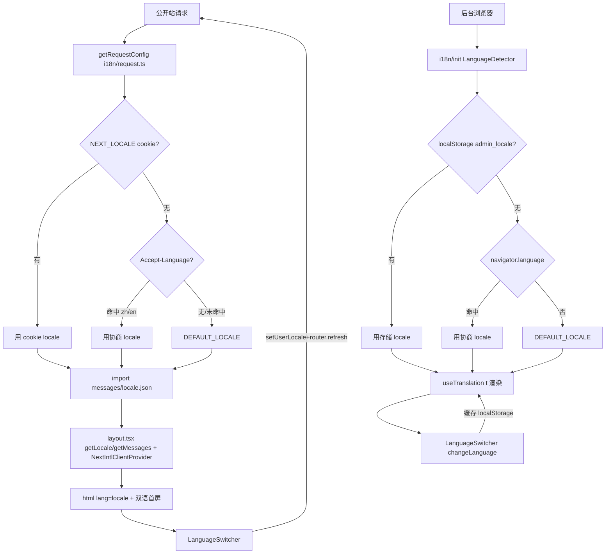

# PRD: 前端界面中英文 i18n 双语能力

> 本 PRD 分两个 altitude，分别服务不同读者，自上而下阅读：
>
> - **Part A · 人审层 (Review Layer)** — 需求方 / 验收人读这部分，决定"该不该做、做得对不对"，并通过风险地图知道**哪些地方必须亲自确认**。Part A 不出现实现机制、文件路径、命令。
> - **Part B · 执行器层 (Build Layer)** — 实现者（人或 Agent）读这部分动手。人只在 Part A 风险地图**点名处**下钻审查，其余默认交执行器 + 自动门禁（hook / 测试 / 架构检查）。

---

# Part A · 人审层 (Review Layer)

## 1. Introduction & Goals

### Problem Statement

当前仓库的两个前端应用（面向终端用户的公开站、面向管理员的后台）所有界面文案都是硬编码中文：标题、导航、按钮、表单标签、错误提示、空状态说明都写死在组件里，`<html lang>` 也固定为 `zh-CN`。没有任何语言切换入口、没有任何文案抽取、没有 locale 协商。对于英文用户（海外协作者、英文环境客户、国际化场景）来说，界面完全不可用；对于维护者来说，每改一处文案都要在组件里穿行，无法统一审校。参考仓库 `freshai` 已经建立了完整的前端 i18n 体系（公开站基于 `next-intl` 的服务端 cookie 模式、后台基于 `react-i18next` 的客户端模式，含 `en`/`zh` 双语文案、语言切换器、`Accept-Language` 协商），本仓库作为同源模板，目前完全缺失这一层能力。

### Interpretation (解读回显)

本次需求被理解为：**参考 `freshai` 的前端 i18n 体系，为本仓库的两个前端应用建立中英文双语能力**。具体含义与边界：

- "双语"指**界面文案的中英文切换**：用户可以通过语言切换器在中文与英文之间选择界面语言，选择被持久化（cookie / localStorage），下次访问自动恢复；服务端渲染的页面也能根据协商出的 locale 输出对应语言。
- 两个前端采用各自框架最契合的 i18n 方案（与 `freshai` 对齐）：公开站（Next.js App Router）用 `next-intl` 的服务端 cookie 模式（无 URL 前缀，locale 来自 cookie/Accept-Language），后台（Vite + TanStack Router）用 `react-i18next` 的客户端 localStorage 模式。
- 支持的 locale 集合为 `en` + `zh`；**默认 locale 建议为 `en`**（与 `freshai` 一致、符合国际化产品通用做法），但这是人工确认项（§2），若你希望默认 `zh` 请在批准前指出。
- 交付策略为**分阶段**：本 PRD 交付 i18n 基础设施（库、配置、Provider、切换器、文案文件骨架）+ 核心页面的文案迁移（根布局、导航、登录注册、仪表盘、设置页、语言切换器自身）；其余业务页面（Agent/工作流/工具/聊天等）的文案迁移列为"后续迁移清单"，在本 PRD 验收后按同一模式推进，不阻塞本 PRD 验收。
- 本 PRD **不包含**：后端 API 错误消息的 i18n、URL 路由前缀式 i18n（`/en/...` `/zh/...`）、RTL 布局、自动机器翻译文案、文档站点的多语言。
- 不引入新的顶层业务概念；i18n 是横切基础设施。

这是你**前置批准**的对象：批准这条 = 同意按这个解读自动实现（第一次人类触点）。三个关键确认点：① 默认 locale 是 `en` 还是 `zh`；② 交付范围是"基础设施+核心页面"还是"全量页面一次性迁移"；③ 是否需要后端 API 错误消息也做 i18n（本 PRD 默认不做）。

### What The User Gets

- 任意访客首次打开公开站时，系统根据浏览器语言偏好（`Accept-Language`）自动选择中/英文；之前手动选过语言的访客，自动恢复其选择。
- 页面右上角（或导航区）出现语言切换器，可在中文与英文之间一键切换；切换后整页立刻呈现新语言，选择被记住。
- 后台管理界面同样提供语言切换器，切换后所有界面文案随之改变，选择被记住。
- 登录注册、导航菜单、仪表盘、设置页等核心路径的文案完全双语化；其余业务页面在后续迁移清单中按同一模式逐步双语化，未迁移前保留现有中文（不会因为基础设施接入而坏掉）。
- 维护者获得结构化的文案文件（按命名空间组织，如 `common`/`nav`/`auth`/`dashboard`），新增文案时在文件里加 key，不再往组件里塞硬编码字符串。
- 不切换语言、不使用切换器的既有访问者，界面体验与现状一致（首语言由默认 locale 决定）。

### Measurable Objectives

- 公开站与后台各自具备可工作的语言切换器；切换后界面文案立即变化，且刷新/重开页面后选择被保留。
- 公开站服务端渲染的 HTML 的 `<html lang>` 与页面可见文案随协商 locale 变化（不是固定 `zh-CN`）。
- 核心页面（根布局 metadata、导航、登录、注册、仪表盘、设置）的所有可见文案均通过 i18n key 读取，不存在硬编码中/英文字符串。
- 新增 `en.json` 与 `zh.json` 两份文案文件，key 一一对应、无缺 key（用脚本/CI 校验）。
- 既有未迁移的业务页面在 i18n 基础设施接入后仍正常渲染（保留中文、不报错）。

---

## 2. Human Review Map (介入与风险地图)

本节决定注意力如何分配：哪些改动**必须人工确认**，哪些交给**执行器 + 自动门禁**。

判定菜单（逐项对照本次改动是否命中）：

- 固定区域：① Core 业务逻辑 / 编排规则 ② 数据库 schema ③ 安全 / 鉴权 / 信任边界 ④ 对外 API 契约
- 横切触发器：⑤ 资金 / 计费 ⑥ 不可逆 / 破坏性数据操作 ⑦ 并发 / 事务

**命中的人审项**：

- 无 ①②③④⑤⑥⑦ 命中（纯前端 i18n 基础设施 + 文案迁移，不触碰后端 core/schema/鉴权/API 契约）。
- **但有三处前置决策需人工确认**（非风险菜单项，而是 §1 解读回显的三个确认点，决定实现方向）：
  - D1：默认 locale（`en` vs `zh`）—— 影响所有首次访问者的默认体验。
  - D2：交付范围（基础设施+核心页面 vs 全量迁移）—— 影响工期与验收边界。
  - D3：文案 key 命名空间规范 —— 影响长期维护性与后续迁移的一致性。

**未命中**（默认执行器 + 自动门禁）：

- ①②③④⑤⑥⑦ 均不涉及。
- 最坏自检：若 i18n 接入有遗漏导致某页面渲染时 `t(key)` 找不到 key，最坏是该处显示 key 字符串或 fallback 文案，不会损坏数据或鉴权；通过"缺 key 检测脚本"在 CI 拦截。

| 改动点 | 架构层 | 风险 | 介入方式 | 证据 / Oracle（指向 §7.6） |
|---|---|---|---|---|
| 默认 locale 决策（D1） | frontend | 高 | 人工确认（前置决策） | rv-1 |
| 文案 key 命名空间规范（D3） | frontend | 中 | 人工确认（前置决策） | rv-2 |
| next-intl 接入公开站（config/provider/协商） | frontend-public | 中 | 执行器+门禁 | rv-3, rv-4 |
| react-i18next 接入后台（init/provider/切换器） | frontend-admin | 中 | 执行器+门禁 | rv-5 |
| 核心页面文案迁移 | frontend | 低 | 执行器+门禁 | rv-2, rv-6 |
| en/zh 文案文件缺 key 检测 | frontend | 低 | 执行器+门禁 | rv-7 |

**如何证明它生效（真实入口，白话）**：

- 用浏览器打开公开站，首屏按浏览器语言呈现中或英文；点语言切换器切到另一语言，整页文案立刻变；刷新后仍是切换后的语言。后台同理。对核心页面逐项肉眼检查：导航、登录、仪表盘、设置页的所有文案都跟随语言变化。

**数据库结构评审（schema 变化时必填）**：

- `本次无数据库结构变化。`（纯前端改动，不涉及后端与数据库。）

---

## 3. Usage And Impact After Implementation

### 终端用户 / End User
- 打开公开站任意页面，界面语言由浏览器偏好或上次手动选择决定；通过导航区的语言切换器在中/英文间切换，选择被记住。
- 核心路径（首页/市场/功能介绍/登录/注册/仪表盘/设置）全部双语化；其余业务页面在后续迁移清单中逐步双语化，未迁移者仍可正常使用（中文）。

### 管理员 / Admin
- 后台界面右上角（或导航区）提供语言切换器，切换后导航、表单、按钮、设置页等核心文案随之改变；选择持久化在 localStorage。

### 开发者 / Developer
- 公开站用 `next-intl`：组件内 `useTranslations("namespace")`、服务端 `getTranslations`/`getLocale`/`getMessages`；文案在 `messages/{en,zh}.json`。
- 后台用 `react-i18next`：组件内 `useTranslation()`；文案在 `src/locales/{en,zh}.json`。
- 新增页面/组件时，文案一律走 i18n key；命名空间按功能模块组织（`common`/`nav`/`auth`/`dashboard`/...）。

### Impact On Existing Behavior
- 既有未迁移的业务页面在 i18n 接入后仍正常渲染（保留原中文硬编码，不报错）。
- 公开站 `<html lang>` 从固定 `zh-CN` 变为动态 locale；既有 SEO 元数据从硬编码中文变为 i18n key 驱动（默认 locale 下与现状文案一致）。
- 不新增任何后端依赖、不改变后端 API、不改变数据库。

---

## 4. Requirement Shape

- Actor: 任意访客（公开站）/ 已登录管理员（后台）。
- Trigger: 首次访问（自动协商 locale）或主动操作语言切换器。
- Expected behavior: 界面呈现协商/选定的语言；切换器可改变语言且持久化；服务端渲染与客户端渲染一致；核心页面文案完全双语化。
- Scope boundary: 不做后端 API 错误消息 i18n、不做 URL 路由前缀式 i18n、不做 RTL、不做自动翻译文案、不做文档站多语言、不做全量页面一次性迁移（除核心页面外其余为后续清单）。

---

# Part B · 执行器层 (Build Layer)

> 以下供实现者（人或 Agent）使用。人只在 Part A 风险地图点名处下钻审查；其余默认交执行器 + 自动门禁。

## 5. Repository Context And Architecture Fit

- Existing path:
  - 公开站根布局 `frontend-public/app/layout.tsx`（当前硬编码 `lang="zh-CN"` + 中文 metadata）
  - 后台入口 `frontend-admin/src/main.tsx`（当前无 i18n 初始化）
- Reuse candidates:
  - `frontend-public/app/(app)/layout.tsx`、`frontend-public/app/(marketing)/page.tsx` 等核心页面（迁移文案到 key）
  - `frontend-public/components/ui/*`（shadcn 组件，切换器复用 DropdownMenu/Button）
  - `frontend-admin/src/components/ui/*`、`frontend-admin/src/routes/__root.tsx`（后台切换器挂载点）
- Architecture pattern to preserve: 两前端各自独立的构建/依赖；i18n 作为横切层接入，不引入跨前端耦合。公开站保持 Next.js App Router 的 RSC + client 边界；后台保持 Vite + TanStack Router。
- Frontend impact: 本 PRD **全部是前端改动**。公开站（`frontend-public/`）与后台（`frontend-admin/`）均受影响。
- Existing PRD relationship: 检查 `tasks/pending/` 与 `tasks/archive/` 后，无 i18n/前端国际化相关 PRD，`independent`。
- Redundancy risks:
  - 不要在公开站引入 `react-i18next`（与 Next.js SSR 契合差），也不要在后台引入 `next-intl`（后台不是 Next.js）。两前端用不同库是有意为之，与 `freshai` 对齐。
  - 不要自建文案抽取脚本框架；优先用 i18n 库自带能力 + 一个简单的缺 key 校验脚本。
  - 不要引入 URL 路由前缀式 i18n（`/en` `/zh`），那会牵动全部路由与链接、超出本 PRD 范围。

## 6. Recommendation

### Recommended Approach
- Approach: 对齐 `freshai` 的双前端异构 i18n 体系——公开站 `next-intl`（SSR cookie 模式）、后台 `react-i18next`（客户端 localStorage 模式）；分阶段交付，先基础设施+核心页面，其余页面列后续清单。
- Why this is the best fit: 与同源 `freshai` 实现形态一致，便于对照维护；各前端用其框架最佳拍档（Next.js 配 next-intl、Vite 配 react-i18next），避免 SSR/CSR 错配；分阶段让基础设施可独立验收，不被海量文案迁移拖死。
- Rejected redundancy: 不自建 i18n 框架、不统一两前端到同一库（会牺牲 SSR 能力或引入冗余适配）、不做 URL 前缀路由（超范围）。

### Proposed Solution Summary (实现机制)

**公开站 `frontend-public`（next-intl，SSR cookie 模式）**：
- 新增依赖 `next-intl`；`next.config.ts` 用 `createNextIntlPlugin("./i18n/request.ts")` 包裹。
- 新增 `i18n/` 目录：`constants.ts`（`LOCALE_COOKIE="NEXT_LOCALE"`、`SUPPORTED_LOCALES=["en","zh"]`、`DEFAULT_LOCALE`、`isSupportedLocale`、`SupportedLocale` 类型）、`request.ts`（`getRequestConfig`，优先级 cookie > Accept-Language > 默认）、`negotiate.ts`（`negotiateAcceptLanguage`，zh-*→zh、en-*→en）、`locale.ts`（server action `setUserLocale` 写 cookie）。
- 新增 `messages/en.json` + `messages/zh.json`，命名空间组织（`html`/`common`/`nav`/`auth`/`dashboard`/`settings`/`errors` 等）。
- 改造 `app/layout.tsx`：`generateMetadata` 用 `getTranslations("html")`；`getLocale`+`getMessages`+`NextIntlClientProvider` 包裹；`<html lang={locale}>`。
- 新增 `components/language-switcher.tsx`：`useLocale`+`useTranslations("common")`+`setUserLocale`+`router.refresh()`，复用 shadcn DropdownMenu。
- 核心页面（layout/(marketing)/(auth)/dashboard/settings）把硬编码文案替换为 `useTranslations`/`getTranslations` 调用。
- 在导航区（`app/(app)/layout.tsx` 与 marketing 布局）挂载语言切换器。

**后台 `frontend-admin`（react-i18next，客户端 localStorage 模式）**：
- 新增依赖 `i18next`、`react-i18next`、`i18next-browser-languagedetector`。
- 新增 `src/i18n/init.ts`：i18next 初始化，detection order `['localStorage','navigator']`、`fallbackLng` 默认 locale、`supportedLngs` 限定 en/zh；导出 `SUPPORTED_LOCALES`/`DEFAULT_LOCALE`/`LOCALE_STORAGE_KEY` 常量。
- 新增 `src/locales/en.json` + `src/locales/zh.json`，命名空间组织（`common`/`nav`/`auth`/`sidebar`/`settings`/`errors` 等）。
- `src/main.tsx` 在组件前 `import './i18n/init'`。
- 新增 `src/components/language-switcher.tsx`：`useTranslation`+`i18n.changeLanguage`，持久化 localStorage，复用 shadcn Button/DropdownMenu。
- 在 `__root.tsx` 或顶栏挂载语言切换器。
- 核心路由（sign-in、settings、dashboard、users 等核心页）把硬编码文案替换为 `t()` 调用。

**文案 key 规范（D3 待确认，建议如下）**：
- 命名空间按功能模块：`common`（通用动作/状态）、`nav`（导航）、`auth`（鉴权）、`dashboard`、`settings`、`errors`（错误提示）等。
- key 用 camelCase，语义化、可追溯：`common.save`、`nav.dashboard`、`auth.loginTitle`。
- 两份文案文件 key 严格一一对应；CI 脚本校验无缺 key。

**刻意避免**：不引入 URL 路由前缀、不做后端 locale 中间件、不做 RTL、不做自动翻译、不做全量页面一次性迁移。

### Alternatives Considered (Only When Useful)
- Alternative A: 两前端统一用 `react-i18next`。
- Why not chosen: 公开站是 Next.js App Router，`react-i18next` 缺乏 SSR 一等支持，会导致首屏语言闪烁、SEO metadata 无法服务端按 locale 生成；`next-intl` 是 Next.js 官方推荐方案。
- Alternative B: URL 路由前缀式 i18n（`/en/...` `/zh/...`）。
- Why not chosen: 牵动全部路由/链接/中间件，工作量与风险远超本 PRD；`freshai` 也用 cookie 模式，与之对齐。

---

## 7. Implementation Guide

This section is a living implementation guide based on current repository analysis. If implementation discovers additional affected files, hidden dependencies, edge cases, or a better path, update this PRD before proceeding.

### 7.1 Core Logic

**公开站 locale 协商与渲染流**：
1. 请求到达，`next-intl` plugin 调 `i18n/request.ts` 的 `getRequestConfig`。
2. `getRequestLocale()`：读 `NEXT_LOCALE` cookie → 命中则用；否则读 `Accept-Language` 头 → `negotiateAcceptLanguage` 归一（zh-*→zh、en-*→en）→ 命中则用；否则 `DEFAULT_LOCALE`。
3. `import(`../messages/${effective}.json`)` 加载文案，返回 `{ locale, messages }`。
4. `app/layout.tsx` 的 `getLocale()`/`getMessages()` 拿到 locale 与 messages，`NextIntlClientProvider` 注入客户端，`generateMetadata` 用 `getTranslations("html")` 产出 `<title>`/`<description>`，`<html lang={locale}>`。
5. 切换器 `onSelect`：`setUserLocale(next)`（server action 写 cookie）+ `document.cookie` 即时写入 + `router.refresh()` 触发 SSR 重渲染。

**后台 locale 协商与渲染流**：
1. `main.tsx` 在渲染前 `import './i18n/init'`，i18next 用 `LanguageDetector` 检测：localStorage(`admin_locale`) → navigator → fallback `DEFAULT_LOCALE`。
2. 组件用 `useTranslation()` 读 `t("namespace.key")`，文案来自 `src/locales/{en,zh}.json`。
3. 切换器 `onSelect`：`i18n.changeLanguage(next)`（detector caches 到 localStorage），组件自动重渲染。

### 7.2 Change Impact Tree

```text
.
├── frontend-public（next-intl，SSR cookie 模式）
│   ├── package.json
│   │   [修改] 新增 next-intl 依赖
│   │
│   ├── next.config.ts
│   │   [修改] 用 createNextIntlPlugin("./i18n/request.ts") 包裹导出
│   │
│   ├── i18n/constants.ts   (新文件)
│   │   [新增] LOCALE_COOKIE="NEXT_LOCALE"、SUPPORTED_LOCALES、DEFAULT_LOCALE、isSupportedLocale、SupportedLocale
│   │
│   ├── i18n/request.ts   (新文件)
│   │   [新增] getRequestConfig + getRequestLocale（cookie > Accept-Language > 默认）
│   │
│   ├── i18n/negotiate.ts   (新文件)
│   │   [新增] negotiateAcceptLanguage（zh-*→zh、en-*→en）
│   │
│   ├── i18n/locale.ts   (新文件)
│   │   [新增] setUserLocale server action（写 cookie）
│   │
│   ├── messages/en.json   (新文件)
│   ├── messages/zh.json   (新文件)
│   │   [新增] 双语文案，命名空间：html/common/nav/auth/dashboard/settings/errors 等
│   │
│   ├── app/layout.tsx
│   │   [修改] generateMetadata 用 getTranslations("html")；NextIntlClientProvider 包裹；<html lang={locale}>
│   │
│   ├── app/(app)/layout.tsx
│   │   [修改] 导航文案 t() 化；挂载 LanguageSwitcher
│   │
│   ├── app/(marketing)/*.tsx、app/(auth)/*.tsx、app/(app)/app/{dashboard,settings}/*.tsx
│   │   [修改] 核心页面硬编码文案 → useTranslations/getTranslations
│   │
│   ├── components/language-switcher.tsx   (新文件)
│   │   [新增] useLocale + setUserLocale + router.refresh，DropdownMenu 实现
│   │
│   └── components/layout/*（导航/顶栏）
│       [修改] 文案 t() 化；放置语言切换器
│
├── frontend-admin（react-i18next，客户端 localStorage 模式）
│   ├── package.json
│   │   [修改] 新增 i18next、react-i18next、i18next-browser-languagedetector
│   │
│   ├── src/i18n/init.ts   (新文件)
│   │   [新增] i18next 初始化；导出 SUPPORTED_LOCALES/DEFAULT_LOCALE/LOCALE_STORAGE_KEY
│   │
│   ├── src/locales/en.json   (新文件)
│   ├── src/locales/zh.json   (新文件)
│   │   [新增] 双语文案，命名空间：common/nav/auth/sidebar/settings/errors 等
│   │
│   ├── src/main.tsx
│   │   [修改] 组件前 import './i18n/init'
│   │
│   ├── src/routes/__root.tsx
│   │   [修改] 顶栏挂载 LanguageSwitcher；文案 t() 化
│   │
│   ├── src/routes/(auth)/sign-in.tsx、src/routes/_authenticated/{index,settings/*}.tsx
│   │   [修改] 核心路由硬编码文案 → useTranslation t()
│   │
│   ├── src/components/language-switcher.tsx   (新文件)
│   │   [新增] useTranslation + i18n.changeLanguage，Button/DropdownMenu 实现
│   │
│   └── src/components/layout/*（顶栏/侧栏）
│       [修改] 文案 t() 化；放置语言切换器
│
├── scripts/（或 justfile 命令）
│   └── check-i18n-keys.{sh,ts,py}   (新文件)
│       [新增] 校验 en/zh 文案文件 key 一一对应、无缺 key；接入 just lint / pre-commit
│
└── docs/
    └── guides/i18n.md   (新文件)
        [新增] 记录两前端 i18n 架构、cookie/localStorage 约定、新增文案规范；同步 mkdocs.yml
```

### 7.3 Executor Drift Guard

| Check | Command | Expected Result | If It Fails, Inspect First |
|---|---|---|---|
| 公开站无残留硬编码 lang | `rg -n 'lang="zh-CN"' frontend-public/app` | 仅在未迁移的非核心页面可能出现；核心 layout 已为 `lang={locale}` | app/layout.tsx |
| 公开站文案走 next-intl | `rg -n "useTranslations\|getTranslations" frontend-public/app frontend-public/components` | 核心页面/组件命中 | i18n/request.ts、messages/*.json key 对应 |
| 后台 i18n 已初始化 | `rg -n "i18n/init" frontend-admin/src/main.tsx` | main.tsx 顶部 import 存在 | src/i18n/init.ts、main.tsx |
| 两前端库不混用 | `rg -n "next-intl" frontend-admin/src` / `rg -n "react-i18next" frontend-public` | 均无命中 | package.json 依赖归属 |
| 文案 key 对齐 | `node/pnpm scripts/check-i18n-keys`（或等价命令） | en/zh 顶层与叶子 key 集合相等 | messages/*.json、locales/*.json |
| 未迁移页面未坏 | `pnpm build`（两前端） | 构建通过；未迁移页面保留中文、不报缺 key | 该页面是否误用 t() 但未加 key |

### 7.4 Flow Or Architecture Diagram



### 7.5 ER Diagram (Only When Data Model Changes)

No data model changes in this PRD.（纯前端，无数据库改动。）

### 7.6 Realistic Validation Plan (Oracle 块)

机读 + 人读的**单一 oracle 源**：§2 的证据列、§9 证据包、以及任何确定性抽取器都引用 / 解析这里的 `id`。

```yaml
# 前置：先在一个终端起公开站与后台（另起后端按现有方式），以下命令假设二者已运行：
#   cd frontend-public && pnpm dev      # http://localhost:3000
#   cd frontend-admin && pnpm dev       # http://localhost:5173
# Playwright e2e 工作目录：tests/playwright-e2e（pnpm exec playwright test ...）
# 证据收集也可走仓库统一入口：just e2e-evidence tasks/pending/P2-FEAT-20260707-150000-frontend-i18n-bilingual.md <rv-id>

- id: rv-1
  behavior: 默认 locale 决策生效（D1 确认后，公开站 SSR + 后台首屏）
  real_entry: |
    # 公开站：无 cookie / 无 Accept-Language 时 SSR 输出默认 locale
    curl -s http://localhost:3000/login | grep -oE '<html[^>]*lang="[^"]*"'
    # 后台：清 localStorage 后首屏 <html lang> 为默认 locale
    cd tests/playwright-e2e && pnpm exec playwright test tests/i18n/admin-locale.no-auth.spec.ts -g "default"
  expected: "公开站 curl 输出 lang=\"<DEFAULT_LOCALE>\"；后台 Playwright 用例绿（html[lang=<DEFAULT_LOCALE>]）"
  mock_boundary: "真实 dev server + 真实 SSR/客户端渲染；不 mock"
  negative_control: "把 DEFAULT_LOCALE 改成另一个值，curl 输出的 lang 与之同步变化"
  expected_fail: "curl 输出 lang=\"zh-CN\"（旧硬编码）或 lang 不随 DEFAULT_LOCALE 变"
  test_layer: smoke
  required_for_acceptance: true

- id: rv-2
  behavior: 核心页面文案全部走 i18n key、无硬编码可见文案
  real_entry: |
    # 静态：核心页面 JSX 文本节点无硬编码中文（注释除外，应无输出）
    rg -nP '[\x{4e00}-\x{9fff}]' \
      'frontend-public/app/layout.tsx' \
      'frontend-public/app/(app)/layout.tsx' \
      'frontend-public/app/(marketing)/page.tsx' \
      'frontend-public/app/(auth)/login/page.tsx' \
      'frontend-public/app/(app)/app/dashboard/page.tsx' \
      'frontend-public/app/(app)/app/settings/page.tsx'
    # 动态：切换语言后核心文案变化
    cd tests/playwright-e2e && pnpm exec playwright test tests/i18n/public-locale.no-auth.spec.ts
  expected: "rg 无 JSX 文本命中（注释命中可接受）；Playwright i18n 用例全绿"
  mock_boundary: "真实构建产物 + 真实 dev server"
  negative_control: "故意在某核心页面留一处硬编码中文（如 <h1>仪表盘</h1>），rg 命中且 en 下 Playwright 断言失败"
  expected_fail: "rg 命中硬编码中文，或 en 下页面仍显示中文"
  test_layer: e2e
  required_for_acceptance: true

- id: rv-3
  behavior: 公开站 NEXT_LOCALE cookie 持久化 + SSR 跟随
  real_entry: |
    # 带 zh cookie：SSR 输出 lang=zh 且含中文文案
    curl -s -b 'NEXT_LOCALE=zh' http://localhost:3000/login | grep -oE '<html[^>]*lang="[^"]*"|登录'
    # 带 en cookie：SSR 输出 lang=en 且含英文文案
    curl -s -b 'NEXT_LOCALE=en' http://localhost:3000/login | grep -oE '<html[^>]*lang="[^"]*"|Sign in'
    # 切换器写 cookie + 刷新持久化（端到端）
    cd tests/playwright-e2e && pnpm exec playwright test tests/i18n/public-locale.no-auth.spec.ts -g 'persists across reloads'
  expected: "zh cookie → lang=\"zh\" 且出现'登录'；en cookie → lang=\"en\" 且出现'Sign in'；Playwright 持久化用例绿"
  mock_boundary: "真实 Next.js SSR（curl 直接验服务端输出）+ 真实浏览器刷新"
  negative_control: "不带 cookie curl 应回退到 rv-1 的默认 locale（对比可见差异）"
  expected_fail: "zh cookie 下 lang 仍为 en / 无中文文案（说明 cookie 未被 request.ts 读取）"
  test_layer: integration
  required_for_acceptance: true

- id: rv-4
  behavior: 公开站 Accept-Language 协商
  real_entry: |
    # 中文偏好 → SSR zh
    curl -s -H 'Accept-Language: zh-CN,zh;q=0.9' http://localhost:3000/login | grep -oE '<html[^>]*lang="[^"]*"'
    # 英文偏好 → SSR en
    curl -s -H 'Accept-Language: en-US,en;q=0.9' http://localhost:3000/login | grep -oE '<html[^>]*lang="[^"]*"'
    # 非支持语言（如 fr）→ 回退默认 locale
    curl -s -H 'Accept-Language: fr-FR,fr;q=0.9' http://localhost:3000/login | grep -oE '<html[^>]*lang="[^"]*"'
  expected: "zh 偏好 → lang=\"zh\"；en 偏好 → lang=\"en\"；fr 偏好 → lang=\"<DEFAULT_LOCALE>\""
  mock_boundary: "真实 SSR；curl 只设 Accept-Language header、不带 cookie"
  negative_control: "删 negotiate.ts 里 zh 分支，zh 偏好应回退默认而非 zh"
  expected_fail: "三种 header 下 lang 都相同（说明协商未生效）"
  test_layer: integration
  required_for_acceptance: true

- id: rv-5
  behavior: 后台 react-i18next 接入 + localStorage 持久化
  real_entry: |
    cd tests/playwright-e2e && pnpm exec playwright test tests/i18n/admin-locale.no-auth.spec.ts -g 'persists in localStorage'
    cd tests/playwright-e2e && pnpm exec playwright test tests/i18n/admin-locale.no-auth.spec.ts -g 'survives reload'
  expected: "两条用例绿：set localStorage i18nextLng=zh 后中文文案出现；reload 后仍为中文"
  mock_boundary: "真实 Vite dev server (http://localhost:5173) + 真实浏览器；不 mock i18next"
  negative_control: "清 localStorage 后 reload，应回退到 navigator/默认 locale（英文）"
  expected_fail: "reload 后变回英文（说明 localStorage 未被 LanguageDetector 缓存）"
  test_layer: e2e
  required_for_acceptance: true

- id: rv-6
  behavior: 语言切换器在两前端可见可操作、点击即整页切换
  real_entry: |
    # 公开站切换器（点 dropdown 选另一语言 → 整页文案变化）
    cd tests/playwright-e2e && pnpm exec playwright test tests/i18n/public-locale.no-auth.spec.ts -g 'switch'
    # 后台切换器
    cd tests/playwright-e2e && pnpm exec playwright test tests/i18n/admin-locale.no-auth.spec.ts -g 'switch'
  expected: "两端切换器用例绿：点击后 <html lang> 与可见文案立即变为目标语言"
  mock_boundary: "真实浏览器点真实切换器组件"
  negative_control: "把切换器 disabled，用例应因找不到可点击项而失败"
  expected_fail: "切换器不存在 / 点击后文案不变（lang 不变）"
  test_layer: e2e
  required_for_acceptance: true

- id: rv-7
  behavior: en/zh 文案 key 对齐、无缺 key
  real_entry: |
    # 缺 key 校验脚本（PRD §7.2 新增，接入 just lint / pre-commit）
    node scripts/check-i18n-keys.mjs
    # 或直接对比两前端 key 集合
    node -e "const k=o=>{const s=new Set();const f=(p,pre)=>{for(const k in p){const v=pre?pre+'.'+k:k;typeof p[k]==='object'&&p[k]?f(p[k],v):s.add(v)}};f(o,'');return s};const e=require('./frontend-public/messages/en.json'),z=require('./frontend-public/messages/zh.json');const ae=k(e),az=k(z);const miss=[...ae].filter(x=>!az.has(x)),extra=[...az].filter(x=>!ae.has(x));console.log('missing-in-zh',miss);console.log('extra-in-zh',extra);process.exit(miss.length||extra.length?1:0)"
  expected: "退出码 0；missing/extra 列表均为空"
  mock_boundary: "纯静态 JSON 文件校验，无运行时"
  negative_control: "在 zh.json 删一个 key 后重跑，退出码 1 且 missing-in-zh 列出该 key"
  expected_fail: "退出码 1，打印缺/多 key 列表"
  test_layer: unit
  required_for_acceptance: true

- id: rv-8
  behavior: 未迁移业务页面不坏（i18n 接入后仍正常渲染）
  real_entry: |
    # 两前端构建通过
    cd frontend-public && pnpm build && cd ../frontend-admin && pnpm build
    # 烟雾访问未迁移页面（公开站 Agent 列表 + 后台已有 smoke）
    curl -s -o /dev/null -w '%{http_code}\n' http://localhost:3000/app/agents
    cd tests/playwright-e2e && pnpm exec playwright test tests/smoke/
  expected: "两前端 pnpm build 成功；公开站 Agent 页 200；tests/smoke/ 全绿"
  mock_boundary: "真实构建 + 真实 dev server + 真实路由"
  negative_control: "误把未迁移页面文案改成 t('x.y') 但不加 key → build 可过但页面显示 'x.y' 字面量，smoke 断言失败"
  expected_fail: "build 报错 / 页面 500 / 显示 t() 的 key 字符串"
  test_layer: smoke
  required_for_acceptance: true
```

Failure triage:
- rv-3 跑挂先查 `i18n/request.ts` 的 cookie 读取与 `setUserLocale` 的 cookie 写入是否同名（`NEXT_LOCALE`），再查 `router.refresh()` 是否触发。
- rv-4 跑挂先查 `negotiateAcceptLanguage` 的 zh-* / en-* 归一逻辑。
- rv-5 跑挂先查 `i18n/init.ts` 的 detection order 与 `LOCALE_STORAGE_KEY` 是否与切换器写入一致。
- rv-7 脚本失败时，按报出的缺失 key 在对应文案文件补齐。

### 7.7 Low-Fidelity Prototype (Only When Required)

```text
+----------------------------------------------------------+
| [Logo]  [Dashboard] [Agents] [Workflows] [Tools] [Settings]   [🌐 中/EN ▼]   [Sign in] |
+----------------------------------------------------------+
|                                                          |
|  当前语言：中文（切换到 English 后整页文案变化）          |
|                                                          |
+----------------------------------------------------------+
```

切换器形态：公开站用图标+下拉（DropdownMenu），后台用按钮组或下拉。具体形态实现时跟随各端现有导航风格。

### 7.8 Interactive Prototype Change Log (Only When Files Actually Changed)

No interactive prototype file changes in this PRD.（若 `docs/prototypes/` 有相关原型页被改动，实现时补本表。）

### 7.9 External Validation (Only When Web Research Was Used)

No external validation required; repository evidence was sufficient.（实现参考本机 `freshai` 仓库的 `frontend-public/i18n/`、`frontend-public/messages/`、`frontend-admin/src/i18n/init.ts`、`frontend-admin/src/locales/`，未联网查证。）

---

## 8. Delivery Dependencies

工具中立的排期元数据，不是工具专属队列语法。无依赖时显式写 `none`。

- Group: frontend-i18n
- Depends on groups:
  - none
- Depends on tasks/issues:
  - none
- Gate type: none
- Notes: 本 PRD 纯前端，不依赖任何后端 PRD。两前端可并行实施，但各自内部需先接入基础设施再做文案迁移。"后续迁移清单"（Agent/工作流/工具/聊天等业务页面）在本 PRD 验收后按同一模式推进，不阻塞本 PRD 验收。

---

## 9. Acceptance Checklist

这是「人只看一次」的交付物。按 Part A 风险地图排序组织成**验收证据包**，每项必须带证据（命令输出 / 观察 / 工件引用），不是裸勾。

### Acceptance Evidence Package（证据包 · 按风险地图排序，终点人审入口）

1. **高风险 oracle 结果**（§2 每个人工确认行的 oracle 跑绿证据，置顶）：
   - rv-1（默认 locale）→ 清 cookie 后首屏语言截图匹配 D1 决策
   - rv-2（核心页面无硬编码 + 双语切换）→ 切换前后截图对比 + rg 搜索结果
   - rv-3（公开站 cookie+SSR）→ cookie 值 + HTML 源码 lang + 刷新后截图
   - rv-4（Accept-Language 协商）→ 两种浏览器语言偏好下首屏截图
   - rv-5（后台 localStorage 持久化）→ localStorage 值 + 刷新后截图
   - rv-6（切换器可见可操作）→ 两端切换器截图
   - rv-7（key 对齐）→ 缺 key 校验脚本通过输出
   - rv-8（未迁移页面不坏）→ 未迁移页面访问截图无报错
2. **风险地图对账 Predicted → Reconciled**：实现中有无未预测到的高风险面（如发现某些核心页面的动态文案/复数/插值需要额外处理、或 shadcn 组件内文案遗漏），如何处理。
3. **对抗自检**：对"未命中"项的反方检查——确认未误改后端 API、未引入 URL 前缀路由、未破坏未迁移页面。
4. **对锁定契约的 diff**：`messages/{en,zh}.json` 与 `src/locales/{en,zh}.json` 的 key 集合一致；命名空间与 D3 决策一致。
5. **低风险门禁结果（折叠）**：`pnpm build`（两前端）/ `pnpm lint` / 缺 key 脚本 / 类型检查通过。

### Human-Confirmed (来自 Part A 风险地图)

- [ ] D1 默认 locale（en / zh）已确认
- [ ] D2 交付范围（基础设施+核心页面）已确认
- [ ] D3 文案 key 命名空间规范已确认
- [ ] rv-1 ~ rv-8 oracle 已跑绿

### Architecture Acceptance

- [ ] 公开站用 `next-intl` SSR cookie 模式；后台用 `react-i18next` 客户端 localStorage 模式；两前端库不混用。
- [ ] 公开站 `<html lang>` 动态化；`generateMetadata` 走 i18n。
- [ ] 后台 `main.tsx` 在组件前初始化 i18n。
- [ ] 语言切换器挂载在两端的导航/顶栏。

### Dependency Acceptance

- [ ] 公开站新增依赖仅 `next-intl`；后台新增依赖仅 `i18next`/`react-i18next`/`i18next-browser-languagedetector`。
- [ ] 不引入后端依赖、不改变后端 API、不改变数据库。
- [ ] 不引入 URL 路由前缀中间件。

### Behavior Acceptance

- [ ] 切换器切换后整页文案变化、刷新后保持。
- [ ] 公开站 cookie 持久化 + SSR 跟随；后台 localStorage 持久化。
- [ ] Accept-Language 协商生效。
- [ ] 核心页面无硬编码可见文案；未迁移页面不坏。
- [ ] en/zh 文案 key 一一对应、无缺 key（CI 拦截）。

### Frontend Acceptance (When A Frontend App Changes)

- [ ] `frontend-public/` 核心页面双语化、切换器可用、SSR 按 locale 输出。
- [ ] `frontend-admin/` 核心路由双语化、切换器可用、localStorage 持久化。
- [ ] 两前端 `pnpm build` 通过；类型检查通过。

### Documentation Acceptance

- [ ] 新增 `docs/guides/i18n.md` 记录两前端 i18n 架构、cookie/localStorage 约定、新增文案规范。
- [ ] `mkdocs.yml` 导航同步新增 i18n 指南页。
- [ ] `docs/ai-standards/` 若需补充前端命名/注释规范（如文案 key 命名）则同步更新。
- [ ] PRD 与仓库文档最终架构方向一致。
